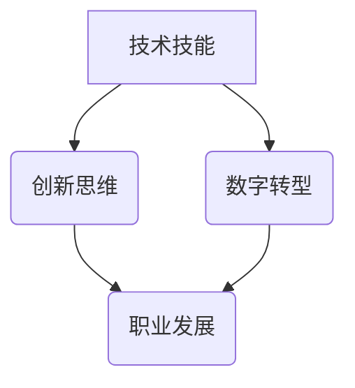

                 

# 程序员在知识经济时代的职业发展方向

## 关键词
- 知识经济
- 职业发展
- 技术技能
- 创新思维
- 数字转型

## 摘要
本文旨在探讨知识经济时代下程序员职业发展的多种可能方向。通过分析技术技能的演变、创新思维的重要性以及数字转型的推动力量，本文将介绍程序员如何利用自身的专业知识，结合时代趋势，拓宽职业道路，实现个人和职业的双重成长。

## 1. 背景介绍

### 1.1 目的和范围
本文将探讨知识经济时代程序员职业发展的关键要素，包括技术技能、创新思维和数字转型。通过分析这些因素，为程序员提供指导，帮助他们规划职业发展路径。

### 1.2 预期读者
本文适合具有编程背景的程序员、技术管理者以及对职业发展感兴趣的读者。

### 1.3 文档结构概述
本文分为十个部分，从背景介绍到扩展阅读，全面覆盖程序员在知识经济时代的职业发展方向。

### 1.4 术语表
#### 1.4.1 核心术语定义
- **知识经济**：以知识和信息为主要生产要素的经济形态。
- **数字转型**：通过数字化技术对传统业务流程进行改进和创新。
- **技术技能**：程序员在特定编程语言、工具和框架方面的能力。
- **创新思维**：产生新颖想法和解决方案的能力。

#### 1.4.2 相关概念解释
- **人工智能**：通过模拟人类智能行为，使计算机具有感知、学习和决策能力的学科。
- **大数据**：数据量巨大，无法用常规软件工具在合理时间内完成处理的复杂数据集。

#### 1.4.3 缩略词列表
- **AI**：人工智能
- **IDE**：集成开发环境
- **IoT**：物联网

## 2. 核心概念与联系

知识经济时代，程序员的职业发展受到多方面因素的影响。首先，技术技能的持续更新和深化是程序员职业发展的基础。其次，创新思维的重要性不容忽视，它能够帮助程序员在激烈的市场竞争中脱颖而出。最后，数字转型的浪潮为程序员提供了广阔的应用场景和职业机会。

### Mermaid 流程图（核心概念与联系）



## 3. 核心算法原理 & 具体操作步骤

### 技术技能的核心算法原理

技术技能的核心算法主要包括编程语言基础、数据结构与算法、数据库管理、前端和后端开发技术。以下是其原理及具体操作步骤：

#### 编程语言基础
- **原理**：编程语言是程序员与计算机进行沟通的工具。掌握一门编程语言，意味着能够编写出能够被计算机执行的代码。
- **具体操作步骤**：
  1. 学习基本语法和关键字。
  2. 完成基础编程练习，如循环、条件判断、函数等。
  3. 逐步学习高级特性，如面向对象编程、异常处理等。

#### 数据结构与算法
- **原理**：数据结构是存储和管理数据的方式，算法是解决问题的步骤和方法。
- **具体操作步骤**：
  1. 学习基本数据结构，如数组、链表、栈、队列等。
  2. 掌握基本算法，如排序、查找、递归等。
  3. 学习高级数据结构，如树、图、哈希表等。

#### 数据库管理
- **原理**：数据库是存储和管理数据的系统，能够高效地查询和处理数据。
- **具体操作步骤**：
  1. 学习数据库的基本概念，如表、记录、索引等。
  2. 学习SQL语言，用于数据的增删改查。
  3. 学习数据库管理系统，如MySQL、Oracle、MongoDB等。

#### 前端和后端开发技术
- **原理**：前端开发负责用户界面和交互，后端开发负责数据处理和存储。
- **具体操作步骤**：
  1. 学习HTML、CSS和JavaScript等前端技术。
  2. 学习服务器端编程语言，如Java、Python、Node.js等。
  3. 学习框架和库，如React、Vue.js、Django等。

### 伪代码示例

```python
# 数据结构——链表的基本操作
class Node:
    def __init__(self, value):
        self.value = value
        self.next = None

class LinkedList:
    def __init__(self):
        self.head = None

    def append(self, value):
        new_node = Node(value)
        if not self.head:
            self.head = new_node
            return
        current = self.head
        while current.next:
            current = current.next
        current.next = new_node

    def print_list(self):
        current = self.head
        while current:
            print(current.value, end=' ')
            current = current.next
        print()

# 实例化链表并添加元素
linked_list = LinkedList()
linked_list.append(1)
linked_list.append(2)
linked_list.append(3)

# 打印链表
linked_list.print_list()  # 输出：1 2 3
```

## 4. 数学模型和公式 & 详细讲解 & 举例说明

### 数学模型

在程序员的职业发展中，数学模型和公式起到关键作用。以下是一些常见的数学模型及其应用：

#### 1. 概率模型
- **公式**：$P(A) = \frac{N(A)}{N(S)}$
- **详细讲解**：概率模型用于评估事件发生的可能性。$P(A)$表示事件A发生的概率，$N(A)$表示事件A发生的次数，$N(S)$表示总次数。
- **举例说明**：投掷一个公平的硬币，出现正面的概率为$P(正面) = \frac{1}{2}$。

#### 2. 决策树模型
- **公式**：$V(S) = \sum_{i=1}^{n} P(i) \cdot V(i)$
- **详细讲解**：决策树模型用于评估不同决策的结果。$V(S)$表示总价值，$P(i)$表示选择i的概率，$V(i)$表示选择i的价值。
- **举例说明**：在选择是否购买某股票时，$V(S)$表示预期收益，$P(i)$表示购买或卖出的概率。

#### 3. 线性回归模型
- **公式**：$y = \beta_0 + \beta_1 \cdot x$
- **详细讲解**：线性回归模型用于预测因变量与自变量之间的关系。$y$表示因变量，$\beta_0$表示截距，$\beta_1$表示斜率，$x$表示自变量。
- **举例说明**：通过线性回归模型预测房价，$y$表示房价，$x$表示房屋面积。

$$
\text{房价} = \beta_0 + \beta_1 \cdot \text{房屋面积}
$$

## 5. 项目实战：代码实际案例和详细解释说明

### 开发环境搭建

为了更好地理解程序员的职业发展方向，我们以一个简单的Web应用为例进行实战。以下是开发环境的搭建步骤：

1. 安装Node.js和npm：访问Node.js官网下载安装包，按照提示安装。
2. 安装Visual Studio Code（VS Code）：访问VS Code官网下载安装包，安装完成后打开。
3. 安装依赖包管理工具npm：在VS Code中打开终端，执行命令`npm install -g npm`。

### 源代码详细实现和代码解读

以下是一个简单的Web应用示例，使用Node.js和Express框架实现。

```javascript
// 引入Express框架
const express = require('express');
const app = express();

// 创建HTTP服务
app.listen(3000, () => {
    console.log('Server is running on port 3000');
});

// 处理GET请求
app.get('/', (req, res) => {
    res.send('Hello, World!');
});

// 处理POST请求
app.post('/login', (req, res) => {
    const { username, password } = req.body;
    if (username === 'admin' && password === '123456') {
        res.send('Login successful');
    } else {
        res.status(401).send('Invalid credentials');
    }
});
```

### 代码解读与分析

1. 引入Express框架：使用`require`函数引入Express模块，Express是一个Node.js Web应用框架，提供路由、中间件等功能。
2. 创建HTTP服务：使用`app.listen`方法创建一个监听3000端口的HTTP服务。当服务器启动时，会打印日志。
3. 处理GET请求：使用`app.get`方法定义一个处理根路径`/`的GET请求的函数。当访问根路径时，返回字符串`Hello, World!`。
4. 处理POST请求：使用`app.post`方法定义一个处理`/login`路径的POST请求的函数。接收请求体中的`username`和`password`，进行验证。如果验证成功，返回字符串`Login successful`；否则，返回状态码401，表示无效凭证。

## 6. 实际应用场景

在知识经济时代，程序员的职业发展可以应用于多种实际场景，如：

- **互联网公司**：参与Web应用、移动应用、大数据处理和人工智能项目的开发。
- **金融机构**：开发金融交易平台、风险管理系统和数据挖掘应用。
- **医疗行业**：参与医疗信息化建设、电子病历和远程医疗服务。
- **制造业**：参与物联网、智能制造和工业自动化项目。

## 7. 工具和资源推荐

### 7.1 学习资源推荐

#### 7.1.1 书籍推荐
- 《代码大全》
- 《深度学习》
- 《架构探险：从零开始写微服务架构》

#### 7.1.2 在线课程
- Coursera的《Python编程》
- Udemy的《Web开发实战：使用Node.js和Express》
- edX的《人工智能导论》

#### 7.1.3 技术博客和网站
- Medium上的技术博客
- GitHub上的开源项目
- Stack Overflow上的技术问答

### 7.2 开发工具框架推荐

#### 7.2.1 IDE和编辑器
- Visual Studio Code
- IntelliJ IDEA
- PyCharm

#### 7.2.2 调试和性能分析工具
- Chrome DevTools
- Visual Studio Debugger
- JMeter

#### 7.2.3 相关框架和库
- Express.js
- React
- Angular
- Django

### 7.3 相关论文著作推荐

#### 7.3.1 经典论文
- 《The Art of Computer Programming》
- 《The Structure and Interpretation of Computer Programs》
- 《Machine Learning》

#### 7.3.2 最新研究成果
- arXiv上的最新论文
- IEEE Transactions on Knowledge and Data Engineering
- Nature Machine Intelligence

#### 7.3.3 应用案例分析
- 《工业互联网平台的建设与实践》
- 《基于人工智能的金融风控体系构建》
- 《医疗信息化建设的探索与实践》

## 8. 总结：未来发展趋势与挑战

在知识经济时代，程序员的职业发展面临多重机遇和挑战。未来，程序员需具备以下能力：

- **持续学习**：技术更新迅速，程序员需不断学习新知识。
- **创新思维**：创新思维是程序员在竞争中脱颖而出的关键。
- **跨领域能力**：跨领域知识能够帮助程序员更好地解决实际问题。

### 8.1 未来发展趋势

- **人工智能与编程的融合**：人工智能将更加深入地影响编程领域。
- **云计算与大数据的发展**：云计算和大数据将为程序员提供更广阔的应用场景。
- **物联网的普及**：物联网将带来新的编程需求和挑战。

### 8.2 未来挑战

- **技术更新速度**：程序员需不断适应新技术。
- **人才培养**：企业和学校需共同培养具备实战能力的程序员。
- **职业倦怠**：程序员需关注身心健康，避免职业倦怠。

## 9. 附录：常见问题与解答

### 9.1 如何提升编程技能？
- **多实践**：通过编写实际项目来提升编程技能。
- **学习经典书籍**：阅读经典编程书籍，如《代码大全》和《深度学习》。
- **参与开源项目**：参与开源项目，提升实际开发经验。

### 9.2 创新思维如何培养？
- **多思考**：培养问题解决能力，多思考问题的本质。
- **跨领域学习**：学习不同领域的知识，激发创新思维。
- **保持好奇心**：对未知事物保持好奇心，勇于尝试新事物。

## 10. 扩展阅读 & 参考资料

- 《人工智能：一种现代方法》
- 《软件架构设计：基于逻辑与结果的思维》
- 《知识经济：21世纪的经济发展模式》

---

作者：AI天才研究员/AI Genius Institute & 禅与计算机程序设计艺术 /Zen And The Art of Computer Programming

