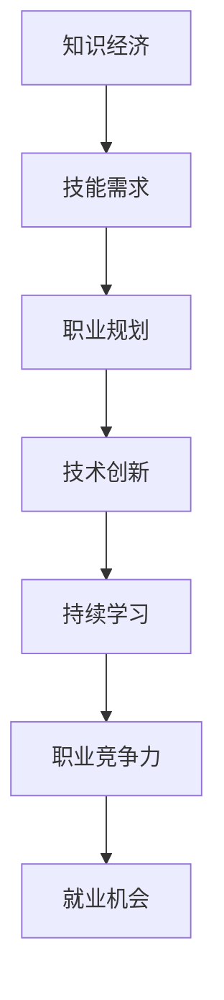
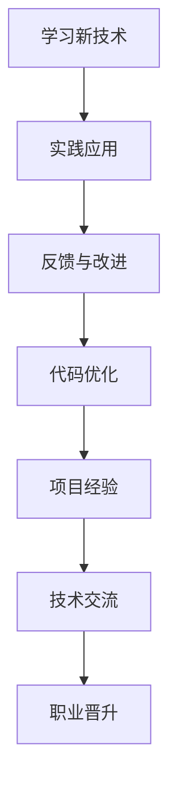
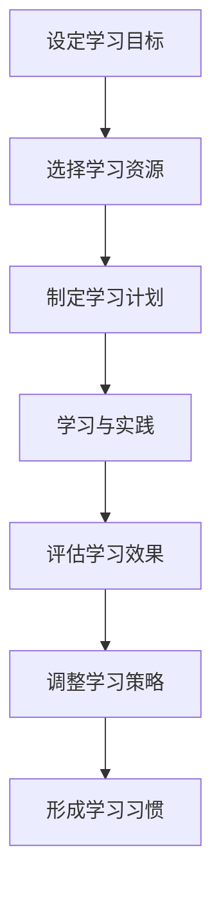
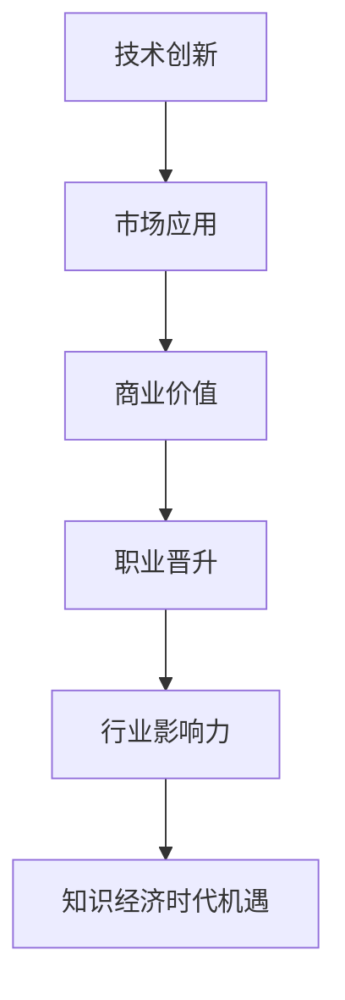

                 

# 程序员在知识经济时代的职业规划策略

> 关键词：知识经济、职业规划、技能提升、持续学习、技术创新

> 摘要：在知识经济时代，程序员面临着前所未有的职业挑战和机遇。本文旨在探讨程序员如何在不断变化的技术环境中规划自己的职业道路，提升个人竞争力，并在快速发展的行业中保持领先地位。

## 1. 背景介绍

### 1.1 目的和范围

本文将分析知识经济对程序员职业规划的影响，探讨如何通过持续学习和技能提升来应对职业挑战。文章将涵盖以下几个关键方面：

- **职业规划的重要性**
- **技能提升策略**
- **持续学习的必要性**
- **技术创新与职业发展的关系**

### 1.2 预期读者

本文适合以下读者群体：

- **初级程序员**：希望了解如何规划职业道路，提高技能水平的程序员。
- **中级程序员**：希望了解持续学习的重要性，以及如何利用技术创新提升职业竞争力。
- **高级程序员**：希望探索知识经济时代下的新机遇，并规划更长远的职业发展。

### 1.3 文档结构概述

本文分为十个部分，具体结构如下：

1. **背景介绍**
2. **核心概念与联系**
3. **核心算法原理 & 具体操作步骤**
4. **数学模型和公式 & 详细讲解 & 举例说明**
5. **项目实战：代码实际案例和详细解释说明**
6. **实际应用场景**
7. **工具和资源推荐**
8. **总结：未来发展趋势与挑战**
9. **附录：常见问题与解答**
10. **扩展阅读 & 参考资料**

### 1.4 术语表

#### 1.4.1 核心术语定义

- **知识经济**：以知识和信息为主要生产要素的经济形态。
- **职业规划**：根据个人的兴趣、能力和市场需求，规划职业发展的过程。
- **技能提升**：通过学习和实践，提高专业技能和知识水平。
- **持续学习**：不断更新知识，掌握新技能，以适应职业发展的需要。
- **技术创新**：通过引入新技术，提高工作效率，创造新的商业模式。

#### 1.4.2 相关概念解释

- **程序员**：负责编写、测试和维护计算机程序的专业人员。
- **职业竞争力**：个人在职场中的竞争优势，包括技能、经验、教育背景等。
- **市场趋势**：影响市场需求和供给的因素和方向。

#### 1.4.3 缩略词列表

- **IDE**：集成开发环境（Integrated Development Environment）
- **latex**：一种高质量的排版系统（LaTeX）
- **Mermaid**：一种使用Markdown语法的图表和流程图绘制工具

## 2. 核心概念与联系

### 2.1 知识经济与程序员职业规划的关系

知识经济时代，程序员面临的职业环境发生了显著变化。传统的工业经济模式转向以知识和信息为核心的生产方式，这意味着程序员需要具备更高的技能和持续学习的意识。

**Mermaid 流程图：**



### 2.2 技能提升策略

程序员需要不断掌握新技术，提高编程技能和解决问题的能力。以下是一个技能提升的流程图：

**Mermaid 流程图：**



### 2.3 持续学习的必要性

在知识经济时代，技术更新速度加快，程序员需要保持持续学习的习惯。以下是一个持续学习的流程图：

**Mermaid 流程图：**



### 2.4 技术创新与职业发展的关系

技术创新是推动职业发展的重要动力。以下是一个技术创新与职业发展的流程图：

**Mermaid 流�程图：**



## 3. 核心算法原理 & 具体操作步骤

### 3.1 核心算法原理

在知识经济时代，程序员需要掌握一些核心算法原理，以提高解决问题的能力。以下是一个常见的排序算法——快速排序（Quick Sort）的伪代码：

```plaintext
算法 QuickSort(A, low, high)
    if low < high
        pivot = Partition(A, low, high)
        QuickSort(A, low, pivot - 1)
        QuickSort(A, pivot + 1, high)
```

### 3.2 快速排序算法的具体操作步骤

1. **选择基准元素**：在待排序的数组中，选择一个基准元素（pivot）。
2. **分区操作**：将数组划分为两个子数组，一个包含小于基准元素的元素，另一个包含大于基准元素的元素。
3. **递归排序**：分别对两个子数组进行快速排序。
4. **合并结果**：将排序好的子数组合并，得到最终的排序结果。

### 3.3 快速排序算法的详细解释

快速排序是一种高效的排序算法，其平均时间复杂度为O(nlogn)。以下是快速排序算法的详细解释：

- **递归原理**：快速排序通过递归调用自身，将大问题分解为小问题，从而实现整个数组的排序。
- **分区操作**：选择一个基准元素，将数组划分为两个子数组，一个包含小于基准元素的元素，另一个包含大于基准元素的元素。这个过程称为分区操作。
- **基准选择**：基准元素的选择会影响排序算法的性能。常见的基准选择方法有随机选择、中位数选择等。

## 4. 数学模型和公式 & 详细讲解 & 举例说明

### 4.1 数学模型

在编程和算法领域，数学模型是解决实际问题的有力工具。以下是一个常见的数学模型——线性规划（Linear Programming）：

$$
\begin{cases}
\text{maximize } c^T x \\
\text{subject to } Ax \leq b \\
x \geq 0
\end{cases}
$$

其中，$c$ 是目标函数系数向量，$x$ 是决策变量向量，$A$ 是约束条件系数矩阵，$b$ 是约束条件常数向量。

### 4.2 线性规划详细讲解

线性规划是一种优化方法，用于在满足一系列约束条件的前提下，求解目标函数的最大值或最小值。

- **目标函数**：目标函数是线性规划的核心，它表示需要优化的目标，如最大化利润或最小化成本。
- **约束条件**：约束条件用于限制目标函数的取值范围，确保解的可行性和合理性。
- **求解方法**：线性规划的求解方法包括单纯形法、内点法等。单纯形法是最常用的方法，其基本思想是通过迭代移动，找到最优解。

### 4.3 线性规划举例说明

假设一家公司需要生产甲、乙两种产品，每种产品都需要消耗一定的原材料和人工成本。公司的目标是在满足原材料和人工成本限制的前提下，最大化总利润。

- **目标函数**：最大化 $P = 2x + 3y$
- **约束条件**：
  - $x + y \leq 50$（原材料限制）
  - $2x + y \leq 60$（人工成本限制）
  - $x, y \geq 0$（非负约束）

使用单纯形法求解该线性规划问题，可以得到最优解：

- $x = 20$，$y = 10$
- 最优利润 $P = 2 \times 20 + 3 \times 10 = 70$

## 5. 项目实战：代码实际案例和详细解释说明

### 5.1 开发环境搭建

在进行项目实战之前，首先需要搭建一个开发环境。以下是使用Python和Jupyter Notebook搭建开发环境的步骤：

1. **安装Python**：下载并安装Python 3.x版本。
2. **安装Jupyter Notebook**：在命令行中运行 `pip install jupyter`。
3. **启动Jupyter Notebook**：在命令行中运行 `jupyter notebook`，打开浏览器并访问指定的URL。

### 5.2 源代码详细实现和代码解读

以下是一个简单的Python程序，用于实现快速排序算法：

```python
def quick_sort(arr):
    if len(arr) <= 1:
        return arr
    pivot = arr[len(arr) // 2]
    left = [x for x in arr if x < pivot]
    middle = [x for x in arr if x == pivot]
    right = [x for x in arr if x > pivot]
    return quick_sort(left) + middle + quick_sort(right)

arr = [3, 6, 8, 10, 1, 2, 1]
sorted_arr = quick_sort(arr)
print(sorted_arr)
```

**代码解读：**

- **快速排序函数**：`quick_sort` 函数用于实现快速排序算法。
- **递归调用**：当数组长度小于等于1时，直接返回数组。否则，选择一个基准元素（pivot），将数组划分为小于、等于和大于基准元素的三部分。
- **递归排序**：分别对小于和大于基准元素的子数组进行快速排序，并将结果合并。

### 5.3 代码解读与分析

**时间复杂度分析：**

- **最佳情况**：O(nlogn)
- **最坏情况**：O(n^2)
- **平均情况**：O(nlogn)

快速排序算法的平均时间复杂度为O(nlogn)，但由于最坏情况下的时间复杂度为O(n^2)，在实际应用中可能存在性能问题。因此，在实际开发中，可以根据具体需求选择更高效的排序算法。

## 6. 实际应用场景

程序员在知识经济时代的职业规划，需要结合实际应用场景来制定策略。以下是一些常见的应用场景：

- **软件开发**：程序员可以通过参与软件开发项目，提升编程技能和团队协作能力。
- **数据科学**：掌握数据分析、机器学习等技能，为企业的数据驱

