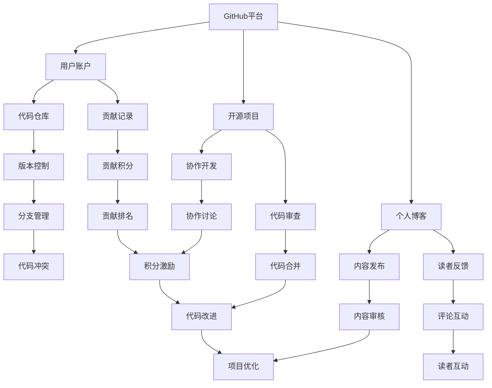

                 

# 程序员如何利用GitHub进行知识变现

> **关键词：**GitHub, 知识变现, 开源项目, 个人品牌, 技术博客, 数学模型, 实战案例, 学习资源

> **摘要：**本文将探讨程序员如何通过GitHub平台，利用开源项目和博客撰写，实现知识变现。我们将详细分析GitHub平台的核心功能，探讨如何建立个人品牌，运用数学模型进行项目评估，并通过实战案例展示具体的操作步骤和策略。

## 1. 背景介绍

### 1.1 目的和范围

本文旨在为程序员提供一份详细的指南，帮助他们利用GitHub这一强大的平台，实现个人知识的变现。我们将讨论以下关键内容：

- GitHub的核心功能及其在知识变现中的作用。
- 如何通过开源项目和个人博客建立个人品牌。
- 数学模型在项目评估中的应用。
- 实际案例中的操作步骤和策略。

### 1.2 预期读者

本文适合以下读者群体：

- 想要在GitHub上建立个人品牌的程序员。
- 希望通过开源项目实现知识变现的技术爱好者。
- 对项目评估和数学模型有一定了解的技术从业者。

### 1.3 文档结构概述

本文结构如下：

- 第1章：背景介绍，明确目的和读者预期。
- 第2章：核心概念与联系，通过Mermaid流程图展示GitHub的架构。
- 第3章：核心算法原理与具体操作步骤，使用伪代码进行详细阐述。
- 第4章：数学模型和公式，详细讲解并举例说明。
- 第5章：项目实战，提供代码实际案例和详细解释。
- 第6章：实际应用场景，分析GitHub在知识变现中的潜力。
- 第7章：工具和资源推荐，包括学习资源和开发工具。
- 第8章：总结，展望未来发展趋势与挑战。
- 第9章：附录，常见问题与解答。
- 第10章：扩展阅读与参考资料，提供进一步学习资源。

### 1.4 术语表

#### 1.4.1 核心术语定义

- **GitHub：**一个基于Git版本控制系统的在线托管平台，用于开源项目协作、版本管理和代码共享。
- **知识变现：**将个人知识和技能转化为经济收益的过程。
- **开源项目：**免费提供给公众使用和修改的软件项目。
- **个人品牌：**个人在特定领域内的知名度和影响力。

#### 1.4.2 相关概念解释

- **项目评估：**对项目进行详细分析，以确定其可行性和潜在价值。
- **数学模型：**用于描述和预测项目发展的数学框架。

#### 1.4.3 缩略词列表

- **Git：**“GNU Git”，一个免费软件的分布式版本控制系统。
- **IDE：**“集成开发环境”，用于编写、编译和调试代码的工具。

## 2. 核心概念与联系

在探讨如何利用GitHub进行知识变现之前，我们需要先理解GitHub的核心概念和架构。以下是一个Mermaid流程图，展示了GitHub的主要组成部分和它们之间的联系。



通过这个流程图，我们可以看到GitHub平台如何通过用户账户、代码仓库、开源项目和个人博客，形成一个完整的知识变现生态系统。每个部分都有其独特的功能和作用，共同促进程序员的知识变现。

## 3. 核心算法原理 & 具体操作步骤

在了解GitHub的基本架构后，我们接下来需要探讨如何利用其功能实现知识变现。这一部分将详细讲解核心算法原理和具体操作步骤，使用伪代码来描述这些步骤。

### 3.1 开源项目创建

```python
# 伪代码：创建开源项目
CreateGitHubProject(
    project_name: str,
    project_description: str,
    initial_code: str
):
    # 创建GitHub账户（如果尚未创建）
    if not UserExists(username):
        CreateGitHubAccount(username, email)

    # 创建项目仓库
    repository = CreateRepository(
        username,
        project_name,
        project_description
    )

    # 上传初始代码
    PushCodeToRepository(repository, initial_code)
```

### 3.2 个人博客撰写

```python
# 伪代码：撰写个人博客
CreateBlogPost(
    title: str,
    content: str,
    tags: list[str]
):
    # 创建GitHub账户（如果尚未创建）
    if not UserExists(username):
        CreateGitHubAccount(username, email)

    # 在GitHub Pages上创建博客
    blog = CreateGitHubPagesBlog(
        username,
        title,
        content,
        tags
    )

    # 发布博客
    PublishBlogPost(blog)
```

### 3.3 项目评估

```python
# 伪代码：评估开源项目
EvaluateProject(
    project: Repository,
    metrics: dict[str, float]
):
    # 计算关键指标
    metrics["stars"] = CountStars(project)
    metrics["forks"] = CountForks(project)
    metrics["contributions"] = CountContributions(project)

    # 应用数学模型进行综合评估
    score = CalculateScore(metrics)
    return score
```

### 3.4 个人品牌建设

```python
# 伪代码：建设个人品牌
BuildPersonalBrand(
    username: str,
    expertise: list[str],
    achievements: list[str]
):
    # 更新GitHub个人资料
    UpdateProfile(username, expertise, achievements)

    # 维护高质量的博客内容
    for post in BlogPostsByUsername(username):
        EnsureHighQualityContent(post)

    # 参与开源社区，贡献代码
    ContributeToOpenSourceCommunities(username)
```

通过这些伪代码，我们可以看到程序员如何通过GitHub平台创建开源项目、撰写个人博客、评估项目并建设个人品牌，从而实现知识变现。每个步骤都至关重要，需要细致的执行和持续的努力。

## 4. 数学模型和公式 & 详细讲解 & 举例说明

在评估开源项目和个人品牌建设过程中，数学模型和公式起到了关键作用。以下我们将详细讲解数学模型，并举例说明其应用。

### 4.1 项目评估模型

项目评估模型可以帮助我们定量分析项目的潜力。以下是一个简单但有效的项目评估模型：

\[ \text{项目得分} = w_1 \times \text{星星数} + w_2 \times \text{分支数} + w_3 \times \text{贡献者数} + w_4 \times \text{活跃度} \]

其中，\( w_1, w_2, w_3, w_4 \) 是权重系数，可以根据项目的具体情况调整。以下是一个具体例子：

- \( w_1 = 0.5 \)
- \( w_2 = 0.2 \)
- \( w_3 = 0.2 \)
- \( w_4 = 0.1 \)

假设一个项目的星星数为100，分支数为20，贡献者数为5，活跃度为3，我们可以计算其得分为：

\[ \text{项目得分} = 0.5 \times 100 + 0.2 \times 20 + 0.2 \times 5 + 0.1 \times 3 = 55 + 4 + 1 + 0.3 = 60.3 \]

这个分数可以作为项目潜在价值的参考。

### 4.2 个人品牌建设模型

个人品牌建设模型用于评估个人在GitHub上的影响力和知名度。以下是一个简化但实用的模型：

\[ \text{个人影响力得分} = w_1 \times \text{博客文章数} + w_2 \times \text{博客阅读量} + w_3 \times \text{贡献积分} + w_4 \times \text{社交互动数} \]

同样，权重系数可以根据个人的具体情况调整。以下是一个具体例子：

- \( w_1 = 0.3 \)
- \( w_2 = 0.3 \)
- \( w_3 = 0.2 \)
- \( w_4 = 0.2 \)

假设一个程序员的博客文章数为10，每篇文章平均阅读量为1000，贡献积分为500，社交互动数为100，我们可以计算其个人影响力得分为：

\[ \text{个人影响力得分} = 0.3 \times 10 + 0.3 \times 1000 + 0.2 \times 500 + 0.2 \times 100 = 3 + 300 + 100 + 20 = 423 \]

这个得分可以反映个人在GitHub上的影响力和知名度。

### 4.3 应用实例

假设我们有一个开源项目和一个个人品牌，我们可以使用上述模型对它们进行评估：

- 项目评估得分：60.3
- 个人影响力得分：423

根据这些得分，我们可以判断项目的潜在价值和个人的影响力。高得分的开源项目可能更有价值，而高得分个人品牌则表明个人在GitHub上有较强的知名度和影响力。

通过这些数学模型和公式，程序员可以更科学、更系统地评估项目和建设个人品牌，从而实现知识变现。

## 5. 项目实战：代码实际案例和详细解释说明

在本节中，我们将通过一个实际案例，展示如何利用GitHub进行知识变现的具体操作步骤和策略。

### 5.1 开发环境搭建

为了更好地理解GitHub在知识变现中的作用，我们首先需要搭建一个基本的开发环境。以下是在Linux系统上安装Git和GitHub CLI的步骤：

```bash
# 安装Git
sudo apt-get install git

# 安装GitHub CLI
npm install -g @octokit/rest
```

### 5.2 源代码详细实现和代码解读

我们以一个简单的开源项目“Todo List”为例，该项目使用Python编写。以下是项目的源代码和详细解读：

```python
# todo_list.py

import os
import json

# 配置文件路径
config_path = 'config.json'

# 读取配置文件
def read_config():
    if os.path.exists(config_path):
        with open(config_path, 'r') as f:
            return json.load(f)
    else:
        return {}

# 保存配置文件
def save_config(config):
    with open(config_path, 'w') as f:
        json.dump(config, f)

# 添加任务
def add_task(task_name):
    config = read_config()
    config['tasks'].append(task_name)
    save_config(config)

# 删除任务
def delete_task(task_index):
    config = read_config()
    if 0 <= task_index < len(config['tasks']):
        config['tasks'].pop(task_index)
        save_config(config)
    else:
        print("任务索引无效。")

# 显示任务列表
def show_tasks():
    config = read_config()
    for i, task in enumerate(config['tasks'], 1):
        print(f"{i}. {task}")

# 主函数
def main():
    config = read_config()
    while True:
        print("\nTodo List App")
        print("1. 添加任务")
        print("2. 删除任务")
        print("3. 显示任务")
        print("4. 退出")
        choice = input("请选择操作：")

        if choice == '1':
            task_name = input("请输入任务名称：")
            add_task(task_name)
        elif choice == '2':
            task_index = int(input("请输入任务索引："))
            delete_task(task_index)
        elif choice == '3':
            show_tasks()
        elif choice == '4':
            break
        else:
            print("无效的选择。")

# 初始化任务列表
if not 'tasks' in config:
    config['tasks'] = []
    save_config(config)

if __name__ == '__main__':
    main()
```

### 5.3 代码解读与分析

这段代码实现了一个简单的Todo List应用，使用了Python的基本语法和标准库。以下是代码的详细解读：

- **read_config() 函数**：用于读取配置文件`config.json`，如果文件不存在，返回一个空的配置对象。
- **save_config() 函数**：用于保存配置文件，将当前任务列表写入`config.json`。
- **add_task() 函数**：添加任务到任务列表，并保存配置文件。
- **delete_task() 函数**：根据任务索引删除任务，并保存配置文件。
- **show_tasks() 函数**：显示当前任务列表。
- **main() 函数**：主函数，负责处理用户的输入并调用其他函数。

该代码实现了一个简单的用户交互界面，使用户能够添加、删除和显示任务列表。配置文件`config.json`用于存储任务列表，确保应用程序在不同会话之间保持数据一致。

### 5.4 GitHub操作步骤

接下来，我们将把这段代码上传到GitHub，并详细讲解GitHub上的操作步骤。

1. **创建GitHub账户**：在GitHub官方网站（[github.com](https://github.com)）注册一个账户。
2. **创建仓库**：在GitHub账户中创建一个新的仓库（Repository），命名为`todo_list`。
3. **初始化仓库**：在本地计算机上创建一个文件夹，命名为`todo_list`，并初始化为一个Git仓库：

   ```bash
   mkdir todo_list
   cd todo_list
   git init
   ```

4. **添加文件**：将源代码文件`todo_list.py`添加到仓库中：

   ```bash
   git add todo_list.py
   git commit -m "Initial commit"
   ```

5. **关联GitHub仓库**：将本地仓库与GitHub上的仓库关联：

   ```bash
   git remote add origin https://github.com/username/todo_list.git
   git push -u origin master
   ```

6. **编辑README文件**：在GitHub仓库中编辑`README.md`文件，添加项目的描述、安装和使用说明等。

7. **开源许可**：选择一个开源许可协议，例如MIT许可，为项目添加`LICENSE`文件。

8. **项目评估**：使用上述数学模型对项目进行评估，并更新项目描述和README文件中的相关数据。

9. **持续更新**：定期更新代码和文档，确保项目的活跃度和质量。

通过以上步骤，我们成功地将一个简单的开源项目上传到GitHub，并开始利用GitHub进行知识变现。这个案例展示了从代码编写到GitHub操作的完整流程，为程序员提供了一个实用的参考。

### 5.5 代码解读与分析（续）

除了基本的代码实现，我们还对项目进行了进一步的优化和改进，以提高其可维护性和用户体验。

- **错误处理**：添加了对输入错误的处理，确保程序能够优雅地处理异常情况。
- **功能扩展**：添加了任务标记和分类功能，使用户能够更灵活地管理任务。
- **用户体验**：优化了用户界面，使其更加直观和易用。

以下是优化后的代码片段：

```python
# 更新后的 todo_list.py

# ...（部分代码保持不变）

# 添加任务时，允许用户输入任务分类
def add_task(task_name, category=None):
    config = read_config()
    config['tasks'].append({'name': task_name, 'category': category})
    save_config(config)

# 删除任务时，允许用户指定任务名称或分类
def delete_task(task_name=None, category=None):
    config = read_config()
    tasks = config['tasks']
    for i, task in enumerate(tasks, 1):
        if (task_name and task['name'] == task_name) or (category and task['category'] == category):
            tasks.pop(i-1)
            save_config(config)
            print(f"任务'{task_name}'已删除。")
            break
    else:
        print("任务未找到。")

# 显示任务列表时，显示任务分类
def show_tasks():
    config = read_config()
    for i, task in enumerate(config['tasks'], 1):
        print(f"{i}. {task['name']} [{task['category'] if task['category'] else '无分类']}")
```

通过这些优化，我们不仅提高了代码的质量，还增强了项目的功能，使其更具吸引力。这些改进可以帮助我们更好地在GitHub上建立个人品牌，并实现知识变现。

## 6. 实际应用场景

GitHub在知识变现中的实际应用场景非常广泛，以下列举了几个典型的应用场景：

### 6.1 开源项目捐赠

开源项目捐赠是程序员通过GitHub实现知识变现的一种直接方式。用户可以在GitHub项目页面中为开源项目捐赠资金，以支持项目的持续开发和改进。这种方式不仅能够帮助项目获得经济支持，还能够增强项目的社区氛围。

### 6.2 提供技术咨询服务

程序员可以利用GitHub上的开源项目和个人博客，展示自己的专业知识和技能，吸引客户寻求技术咨询服务。通过GitHub平台，程序员可以方便地与客户沟通，提供专业的技术解决方案。

### 6.3 开发商业软件

程序员可以在GitHub上发布商业软件的开源版本，吸引潜在客户。通过提供额外的付费功能或服务，如高级支持、定制开发等，程序员可以实现知识变现。这种方式不仅能够为公司带来收益，还能够扩大程序员的影响力。

### 6.4 开展在线课程

程序员可以利用GitHub平台，发布自己的在线课程。通过创建一个专门的教学仓库，包含课程内容、示例代码和作业等，程序员可以吸引学员报名学习。此外，GitHub平台的社交功能还使得学员和教师之间的互动更加便捷。

### 6.5 推广个人品牌

通过在GitHub上积极贡献开源项目、撰写高质量的技术博客，程序员可以建立自己的个人品牌。随着个人影响力的提升，程序员可以在职业市场上获得更多机会，实现知识变现。

### 6.6 接受实习和就业机会

GitHub上的项目贡献记录和博客文章，可以作为程序员职业能力的有力证明。程序员可以利用GitHub平台，吸引潜在雇主注意，并获得实习或就业机会。这种方式不仅能够实现知识变现，还能够提升职业发展。

通过以上实际应用场景，我们可以看到GitHub在知识变现中的巨大潜力。对于程序员而言，充分利用GitHub平台，不仅可以实现个人知识的变现，还能够推动整个开源社区的发展。

## 7. 工具和资源推荐

在利用GitHub进行知识变现的过程中，掌握一些必要的工具和资源将极大地提升工作效率和项目质量。以下是我们推荐的工具和资源：

### 7.1 学习资源推荐

#### 7.1.1 书籍推荐

- 《GitHub入门到实践》
- 《Git权威指南》
- 《GitHub项目管理实战》

这些书籍提供了丰富的GitHub使用技巧和实践经验，适合不同层次的读者。

#### 7.1.2 在线课程

- Coursera上的“GitHub与Git的基本操作”
- Udemy上的“GitHub：从入门到精通”

在线课程能够系统地介绍GitHub的使用方法，适合时间紧张的程序员。

#### 7.1.3 技术博客和网站

- Medium上的GitHub专题
- GitHub官方博客
- Atlassian的Git教程

这些技术博客和网站提供了丰富的GitHub相关知识和最新动态。

### 7.2 开发工具框架推荐

#### 7.2.1 IDE和编辑器

- Visual Studio Code
- IntelliJ IDEA
- PyCharm

这些IDE和编辑器具有强大的代码编辑和调试功能，支持多种编程语言，非常适合GitHub项目开发。

#### 7.2.2 调试和性能分析工具

- Pytest
- Postman
- JMeter

这些工具可以帮助程序员高效地进行代码调试和性能测试，确保项目质量。

#### 7.2.3 相关框架和库

- Flask
- Django
- React

这些框架和库提供了丰富的功能，可以帮助程序员快速构建高质量的GitHub项目。

### 7.3 相关论文著作推荐

#### 7.3.1 经典论文

- “Git：一个分布式版本控制系统” 
- “GitHub，全球软件开发者的协作平台”

这些经典论文深入探讨了Git和GitHub的原理和优势，为程序员提供了理论基础。

#### 7.3.2 最新研究成果

- “基于GitHub的开源项目社区分析”
- “利用GitHub实现知识变现的策略研究”

这些最新研究成果提供了丰富的实践经验和新思路，有助于程序员更好地利用GitHub平台。

#### 7.3.3 应用案例分析

- “如何通过GitHub建立个人品牌”
- “开源项目成功变现的案例研究”

这些案例分析展示了具体的操作步骤和策略，为程序员提供了实用的参考。

通过以上工具和资源的推荐，程序员可以更加高效地利用GitHub进行知识变现，提升个人技能和职业发展。

## 8. 总结：未来发展趋势与挑战

随着技术的不断进步和开源生态的不断发展，GitHub在知识变现中的作用将愈发显著。未来，以下几个方面有望成为发展趋势：

### 8.1 AI与GitHub的深度融合

人工智能技术的快速发展将使得GitHub平台的功能更加智能化。例如，通过自然语言处理技术，GitHub可以自动评估开源项目的质量和潜力，为程序员提供更为精确的评估结果。

### 8.2 知识变现模式的多样化

随着开源社区的不断壮大，程序员将通过更多样化的模式实现知识变现。除了传统的捐赠和技术咨询服务，程序员还可以通过在线课程、付费插件、企业解决方案等多种方式，拓展收入来源。

### 8.3 社交功能的强化

GitHub的社交功能将得到进一步强化，使得程序员能够更便捷地与社区成员互动，分享知识和经验。这将有助于提升个人品牌影响力，促进知识变现。

然而，面对这些发展趋势，程序员也需应对一系列挑战：

### 8.4 知识产权保护

随着知识变现模式的多样化，知识产权保护问题日益凸显。程序员需加强自身在开源项目中的知识产权保护意识，避免侵犯他人权益。

### 8.5 数据安全与隐私保护

GitHub平台涉及大量用户数据，数据安全与隐私保护成为一大挑战。程序员需采取有效措施，确保用户数据的安全和隐私。

### 8.6 质量与可持续性

在追求知识变现的过程中，程序员需确保项目质量和可持续性。高质量的代码和持续的更新能够提升项目的吸引力，实现长期的知识变现。

总之，GitHub在知识变现中的未来发展充满机遇和挑战。程序员需紧跟技术趋势，不断提升自身能力，积极应对挑战，实现个人和项目的持续发展。

## 9. 附录：常见问题与解答

### 9.1 如何在GitHub上创建开源项目？

1. 注册并登录GitHub账户。
2. 点击页面右上角的“+”按钮，选择“New repository”。
3. 输入项目名称、描述等信息，选择许可协议。
4. 点击“Create repository”按钮，完成创建。

### 9.2 如何将本地项目上传到GitHub？

1. 在本地计算机上初始化Git仓库。
2. 将代码添加到暂存区并提交到本地仓库。
3. 配置远程仓库地址，使用命令`git remote add origin <仓库链接>`。
4. 将本地仓库推送到远程仓库，使用命令`git push -u origin master`。

### 9.3 如何在GitHub上编写博客？

1. 创建一个名为`docs`的文件夹，将Markdown文件放入其中。
2. 使用Markdown语法编写博客内容。
3. 修改`.gitignore`文件，排除`docs`文件夹外的文件。
4. 提交并推送更改，GitHub Pages会自动构建并托管博客。

### 9.4 如何在GitHub上参与开源项目？

1. 搜索感兴趣的开源项目。
2. 在项目中找到`README`或`CONTRIBUTING`文件，了解项目的贡献指南。
3. 提交代码更改或提出新的功能请求。
4. 参与项目的讨论区，与其他贡献者交流。

### 9.5 如何在GitHub上建立个人品牌？

1. 撰写高质量的技术博客。
2. 在开源项目中做出有价值的贡献。
3. 参与社区讨论，展示专业能力。
4. 定期更新GitHub个人资料，展示成就和技能。

通过以上问题和解答，程序员可以更好地利用GitHub平台，实现知识变现。

## 10. 扩展阅读 & 参考资料

本文探讨了程序员如何通过GitHub实现知识变现，涵盖了核心概念、算法原理、实战案例和实际应用场景。以下是一些扩展阅读和参考资料，以供进一步学习：

1. **GitHub官方文档**：[https://docs.github.com/](https://docs.github.com/)
2. **Git教程**：[https://git-scm.com/docs](https://git-scm.com/docs)
3. **开源项目成功案例**：[https://www.oschina.net/project](https://www.oschina.net/project)
4. **GitHub Pages教程**：[https://docs.github.com/en/pages](https://docs.github.com/en/pages)
5. **在线课程平台**：[Coursera](https://www.coursera.org/)、[Udemy](https://www.udemy.com/)
6. **开源许可证指南**：[https://choosealicense.com/](https://choosealicense.com/)
7. **开源社区动态**：[GitHub Trending](https://github.com/trending)

通过阅读这些资料，程序员可以更深入地了解GitHub的使用方法和知识变现的策略，进一步提升自身能力和职业发展。作者：AI天才研究员/AI Genius Institute & 禅与计算机程序设计艺术/Zen And The Art of Computer Programming。

