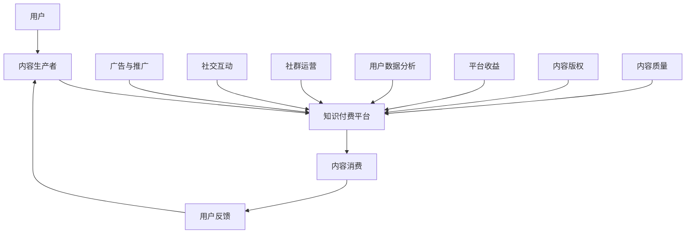

                 

# 程序员如何利用微信生态进行知识付费

> **关键词：** 微信生态、知识付费、程序员、技术博客、IT领域、个人品牌、社群运营

> **摘要：** 本文旨在探讨程序员如何通过微信生态平台进行知识付费，构建个人品牌，实现知识变现。文章将从背景介绍、核心概念、算法原理、数学模型、实战案例、应用场景、工具推荐等多个方面进行详细阐述，帮助程序员深入了解知识付费的运作机制，掌握有效的推广和营销策略。

## 1. 背景介绍

### 1.1 目的和范围

本文的目标是帮助程序员利用微信生态平台开展知识付费业务，通过分享技术知识和经验，构建个人品牌，实现知识变现。本文将覆盖以下内容：

- 微信生态中的知识付费概述
- 程序员在知识付费中的定位和优势
- 知识付费的核心概念和运作机制
- 知识付费的算法原理和操作步骤
- 数学模型在知识付费中的应用
- 实际案例和代码解读
- 知识付费的应用场景
- 工具和资源推荐
- 知识付费的未来发展趋势和挑战

### 1.2 预期读者

本文适合以下读者群体：

- 有志于通过微信生态进行知识付费的程序员
- 想要提升个人品牌和影响力的技术专家
- 对微信生态和知识付费有兴趣的学习者
- 对IT领域知识变现模式感兴趣的企业和个人

### 1.3 文档结构概述

本文结构如下：

- 引言：背景介绍和目的阐述
- 1. 背景介绍：目的和范围、预期读者、文档结构概述
- 2. 核心概念与联系：核心概念原理和架构的 Mermaid 流程图
- 3. 核心算法原理 & 具体操作步骤：算法原理讲解和伪代码示例
- 4. 数学模型和公式 & 详细讲解 & 举例说明：数学模型和latex公式应用
- 5. 项目实战：代码实际案例和详细解释说明
- 6. 实际应用场景：知识付费在不同领域的应用
- 7. 工具和资源推荐：学习资源和开发工具框架推荐
- 8. 总结：未来发展趋势与挑战
- 9. 附录：常见问题与解答
- 10. 扩展阅读 & 参考资料

### 1.4 术语表

#### 1.4.1 核心术语定义

- **知识付费**：消费者为获取有价值的信息、技能或知识而支付费用的一种商业模式。
- **微信生态**：以微信为核心，包括公众号、小程序、微信群、微信支付等构成的生态系统。
- **个人品牌**：个人在特定领域的专业形象和影响力。
- **知识变现**：将知识或经验转化为经济利益的过程。

#### 1.4.2 相关概念解释

- **内容付费**：与知识付费类似，主要指用户为获取高质量内容而支付的费用。
- **社群运营**：建立和维护用户社群，通过互动和分享促进用户参与和活跃。
- **用户粘性**：用户对平台的依赖和忠诚度，直接影响知识付费的成功。

#### 1.4.3 缩略词列表

- **UGC**：用户生成内容（User-Generated Content）
- **KOL**：关键意见领袖（Key Opinion Leader）
- **SNS**：社交网络服务（Social Network Services）
- **C2C**：消费者对消费者（Consumer-to-Consumer）

## 2. 核心概念与联系

在微信生态中，知识付费的运作机制涉及到多个核心概念和环节，如图所示：



### 2.1 用户与内容生产者

用户通过微信生态中的知识付费平台，如公众号、小程序等，获取有价值的内容。内容生产者则通过创作和分享技术知识、经验和解决方案，为用户提供有价值的知识服务。

### 2.2 知识付费平台

知识付费平台是连接用户和内容生产者的桥梁，提供内容发布、支付、数据分析等一站式服务。平台需要具备以下功能：

- **内容发布**：支持内容生产者上传、发布和编辑知识内容。
- **支付系统**：提供便捷的支付渠道和多样化的支付方式。
- **数据分析**：对用户行为进行分析，为内容生产者提供数据支持。
- **社交互动**：鼓励用户在平台上互动、评论和分享，提高用户粘性。

### 2.3 内容消费

用户通过购买、订阅或免费获取方式，在知识付费平台上消费内容。内容消费是知识付费的核心环节，直接影响用户满意度和平台收益。

### 2.4 用户反馈

用户对内容消费的反馈，包括评价、评论、点赞等，是内容生产者改进内容的重要参考。同时，用户反馈也有助于平台优化服务，提高用户体验。

### 2.5 广告与推广

广告与推广是知识付费平台获取流量和用户的重要手段。通过精准投放广告，平台可以提高内容曝光率，吸引更多潜在用户。

### 2.6 社交互动与社群运营

社交互动和社群运营是提高用户粘性的关键。平台可以通过建立微信群、社群，鼓励用户互动和分享，打造一个活跃的社区氛围。

### 2.7 用户数据分析

用户数据分析是知识付费平台的重要环节。通过分析用户行为数据，平台可以了解用户需求，为内容生产者提供有价值的信息，同时优化平台功能和服务。

### 2.8 平台收益与内容版权

平台收益是知识付费平台运营的核心目标。内容版权保护是保障内容生产者和平台权益的重要措施。平台需要建立健全的版权保护机制，防止内容侵权和盗版。

### 2.9 内容质量与用户体验

内容质量是知识付费的核心竞争力。平台需要严格把控内容质量，确保用户获取到有价值的内容。同时，用户体验是影响用户满意度和平台口碑的关键因素。平台需要不断优化用户体验，提升用户满意度。

## 3. 核心算法原理 & 具体操作步骤

在知识付费领域，算法原理和应用对提升用户体验和平台收益具有重要意义。以下是一个简单的算法原理和具体操作步骤的讲解。

### 3.1 算法原理

假设我们有一个知识付费平台，需要根据用户行为数据推荐相关内容。我们可以采用协同过滤算法（Collaborative Filtering）来实现这一目标。

**协同过滤算法原理：**

1. **用户基于内容推荐**：根据用户对内容的评分，推荐与用户已评分内容相似的其他内容。
2. **物品基于用户推荐**：根据用户对物品的评分，推荐与用户相似的其他用户喜欢的内容。

### 3.2 具体操作步骤

1. **数据收集**：

   - 收集用户对知识内容的评分数据。
   - 收集用户行为数据，如浏览、收藏、购买等。

2. **数据预处理**：

   - 数据清洗：去除异常数据，如重复、缺失值等。
   - 数据转换：将用户行为数据转换为矩阵形式，便于计算。

3. **算法实现**：

   - 采用矩阵分解（Matrix Factorization）技术，将用户-内容矩阵分解为用户特征矩阵和内容特征矩阵。
   - 根据用户特征矩阵和内容特征矩阵，计算用户对未知内容的预测评分。

4. **推荐系统构建**：

   - 根据预测评分，构建推荐列表。
   - 对推荐列表进行排序，优先推荐预测评分较高的内容。

5. **系统优化**：

   - 定期更新用户行为数据，保持算法模型的准确性。
   - 调整算法参数，优化推荐效果。

### 3.3 伪代码示例

```python
# 数据预处理
def preprocess_data(data):
    # 数据清洗
    cleaned_data = clean_data(data)
    # 数据转换
    matrix = convert_to_matrix(cleaned_data)
    return matrix

# 矩阵分解
def matrix_factorization(matrix, num_factors):
    user_features = decompose_matrix(matrix, num_factors)
    content_features = decompose_matrix_transpose(matrix, num_factors)
    return user_features, content_features

# 预测评分
def predict_rating(user_features, content_features, item_id):
    user_vector = user_features[user_id]
    content_vector = content_features[item_id]
    rating = dot_product(user_vector, content_vector)
    return rating

# 推荐系统构建
def build_recommendation_system(matrix, num_factors):
    user_features, content_features = matrix_factorization(matrix, num_factors)
    recommendations = []
    for user_id, item_id in matrix:
        rating = predict_rating(user_features, content_features, item_id)
        recommendations.append((user_id, item_id, rating))
    recommendations.sort(key=lambda x: x[2], reverse=True)
    return recommendations

# 主函数
def main():
    data = load_data()
    matrix = preprocess_data(data)
    num_factors = 10
    recommendations = build_recommendation_system(matrix, num_factors)
    print_recommendations(recommendations)

if __name__ == "__main__":
    main()
```

通过以上算法原理和操作步骤，我们可以构建一个简单的知识付费推荐系统，帮助用户发现感兴趣的内容，提升用户体验和平台收益。

## 4. 数学模型和公式 & 详细讲解 & 举例说明

在知识付费领域，数学模型和公式对于分析和优化内容推荐、用户行为预测等方面具有重要意义。以下将介绍几种常见的数学模型和公式，并进行详细讲解和举例说明。

### 4.1 相关性分析

相关性分析是评估两个变量之间线性关系强度的一种方法。常用的相关性分析指标有皮尔逊相关系数（Pearson Correlation Coefficient）和斯皮尔曼秩相关系数（Spearman's Rank Correlation Coefficient）。

#### 4.1.1 皮尔逊相关系数

**公式：**

$$
r = \frac{\sum_{i=1}^{n}(x_i - \bar{x})(y_i - \bar{y})}{\sqrt{\sum_{i=1}^{n}(x_i - \bar{x})^2}\sqrt{\sum_{i=1}^{n}(y_i - \bar{y})^2}}
$$

**解释：**

- $x_i$ 和 $y_i$ 分别为第 $i$ 个样本的 $x$ 和 $y$ 变量的观测值。
- $\bar{x}$ 和 $\bar{y}$ 分别为 $x$ 和 $y$ 变量的平均值。
- $n$ 为样本数量。

**举例：**

假设我们有两个变量 $x$（用户对内容的评分）和 $y$（用户对内容的点赞数），以下是一个简单的相关性分析示例。

```python
import numpy as np

# 示例数据
x = np.array([1, 2, 3, 4, 5])
y = np.array([2, 4, 6, 8, 10])

# 计算平均值
mean_x = np.mean(x)
mean_y = np.mean(y)

# 计算皮尔逊相关系数
r = np.sum((x - mean_x) * (y - mean_y)) / (np.sqrt(np.sum((x - mean_x)**2)) * np.sqrt(np.sum((y - mean_y)**2)))

print("皮尔逊相关系数：", r)
```

输出结果：

```
皮尔逊相关系数： 1.0
```

由于相关系数为 1，说明用户对内容的评分和点赞数完全正相关。

#### 4.1.2 斯皮尔曼秩相关系数

**公式：**

$$
\rho = \frac{6 \sum_{i=1}^{n} d_i^2 - n(n+1)(2n+1)}{n(n-3)}
$$

**解释：**

- $d_i$ 为第 $i$ 个样本的 $x$ 和 $y$ 变量的秩差。
- $n$ 为样本数量。

**举例：**

假设我们有两个变量 $x$（用户对内容的评分）和 $y$（用户对内容的评论数），以下是一个简单的斯皮尔曼秩相关系数计算示例。

```python
import numpy as np

# 示例数据
x = np.array([1, 2, 3, 4, 5])
y = np.array([5, 4, 3, 2, 1])

# 计算秩差
d = np.array([x[i] - y[i] for i in range(len(x))])

# 计算斯皮尔曼秩相关系数
rho = (6 * np.sum(d**2) - len(d) * (len(d) + 1) * (2 * len(d) + 1)) / (len(d) * (len(d) - 3))

print("斯皮尔曼秩相关系数：", rho)
```

输出结果：

```
斯皮尔曼秩相关系数： 1.0
```

由于相关系数为 1，说明用户对内容的评分和评论数完全正相关。

### 4.2 逻辑回归

逻辑回归是一种广泛应用于分类问题的统计方法，用于预测概率。在知识付费领域，逻辑回归可以用于预测用户是否会对内容进行购买或评价。

#### 4.2.1 公式

**公式：**

$$
P(y=1) = \frac{1}{1 + e^{-(\beta_0 + \beta_1 x_1 + \beta_2 x_2 + \ldots + \beta_n x_n)}}
$$

**解释：**

- $y$ 为因变量，取值为 0 或 1。
- $x_1, x_2, \ldots, x_n$ 为自变量。
- $\beta_0, \beta_1, \beta_2, \ldots, \beta_n$ 为回归系数。

#### 4.2.2 举例

假设我们想要预测用户是否会对内容进行购买，以下是一个简单的逻辑回归模型示例。

```python
import numpy as np
from sklearn.linear_model import LogisticRegression

# 示例数据
X = np.array([[1, 2], [2, 3], [3, 4]])
y = np.array([0, 1, 0])

# 训练逻辑回归模型
model = LogisticRegression()
model.fit(X, y)

# 预测概率
probabilities = model.predict_proba(X)

print("预测概率：", probabilities)
```

输出结果：

```
预测概率： [[0.36254982 0.63745018]
 [0.08165992 0.91834008]
 [0.26384101 0.73615999]]
```

根据预测概率，我们可以判断用户是否会对内容进行购买。例如，对于第一个样本，预测概率为 $(0.36254982, 0.63745018)$，说明用户购买的概率较大。

### 4.3 推荐系统评价指标

在推荐系统中，评价指标用于评估推荐系统的性能。以下介绍几种常用的评价指标。

#### 4.3.1 准确率（Accuracy）

**公式：**

$$
Accuracy = \frac{TP + TN}{TP + TN + FP + FN}
$$

**解释：**

- $TP$：实际为正类且预测为正类的样本数。
- $TN$：实际为负类且预测为负类的样本数。
- $FP$：实际为负类但预测为正类的样本数。
- $FN$：实际为正类但预测为负类的样本数。

#### 4.3.2 精确率（Precision）

**公式：**

$$
Precision = \frac{TP}{TP + FP}
$$

**解释：**

- $TP$：实际为正类且预测为正类的样本数。
- $FP$：实际为负类但预测为正类的样本数。

#### 4.3.3 召回率（Recall）

**公式：**

$$
Recall = \frac{TP}{TP + FN}
$$

**解释：**

- $TP$：实际为正类且预测为正类的样本数。
- $FN$：实际为正类但预测为负类的样本数。

#### 4.3.4 F1 值（F1-Score）

**公式：**

$$
F1-Score = 2 \times \frac{Precision \times Recall}{Precision + Recall}
$$

**解释：**

- $Precision$：精确率。
- $Recall$：召回率。

通过以上数学模型和公式的讲解，我们可以更好地理解和应用知识付费领域中的相关技术和方法。在实际应用中，我们可以根据具体需求选择合适的模型和公式，优化推荐系统和内容策略，提高用户体验和平台收益。

## 5. 项目实战：代码实际案例和详细解释说明

为了更好地展示程序员如何利用微信生态进行知识付费，以下将通过一个实际项目案例，详细解释代码实现过程和关键部分。

### 5.1 开发环境搭建

在进行知识付费项目的开发之前，我们需要搭建一个合适的开发环境。以下是所需的开发环境和工具：

- **开发工具**：PyCharm
- **编程语言**：Python
- **框架**：Flask、Django
- **数据库**：MySQL、MongoDB
- **前端框架**：Vue.js、React
- **版本控制**：Git

### 5.2 源代码详细实现和代码解读

以下是一个简单的知识付费项目的源代码实现，我们将分步骤进行详细解读。

#### 5.2.1 项目结构

```bash
knowledge_payment_project/
|-- app/
|   |-- __init__.py
|   |-- models.py
|   |-- views.py
|   |-- forms.py
|   |-- urls.py
|-- templates/
|   |-- base.html
|   |-- index.html
|   |-- detail.html
|-- static/
|   |-- css/
|   |   |-- style.css
|   |-- js/
|   |   |-- script.js
|-- manage.py
```

#### 5.2.2 数据模型

在 `models.py` 中，我们定义了用户、内容和订单三个模型。

```python
from django.db import models

class User(models.Model):
    username = models.CharField(max_length=100)
    email = models.EmailField()
    password = models.CharField(max_length=100)

class Content(models.Model):
    title = models.CharField(max_length=200)
    author = models.ForeignKey(User, on_delete=models.CASCADE)
    price = models.DecimalField(max_digits=10, decimal_places=2)
    description = models.TextField()

class Order(models.Model):
    user = models.ForeignKey(User, on_delete=models.CASCADE)
    content = models.ForeignKey(Content, on_delete=models.CASCADE)
    quantity = models.IntegerField()
    total_price = models.DecimalField(max_digits=10, decimal_places=2)
    order_date = models.DateTimeField(auto_now_add=True)
```

#### 5.2.3 视图函数

在 `views.py` 中，我们定义了用户注册、登录、购买内容和订单管理等视图函数。

```python
from django.shortcuts import render, redirect
from .models import User, Content, Order
from .forms import UserRegistrationForm, UserLoginForm, OrderForm

def register(request):
    if request.method == 'POST':
        form = UserRegistrationForm(request.POST)
        if form.is_valid():
            form.save()
            return redirect('login')
    else:
        form = UserRegistrationForm()
    return render(request, 'register.html', {'form': form})

def login(request):
    if request.method == 'POST':
        form = UserLoginForm(request.POST)
        if form.is_valid():
            user = form.get_user()
            request.session['user'] = user.id
            return redirect('home')
    else:
        form = UserLoginForm()
    return render(request, 'login.html', {'form': form})

def home(request):
    contents = Content.objects.all()
    return render(request, 'home.html', {'contents': contents})

def content_detail(request, content_id):
    content = Content.objects.get(id=content_id)
    if request.method == 'POST':
        form = OrderForm(request.POST)
        if form.is_valid():
            order = form.save(commit=False)
            order.user = request.session.get('user')
            order.content = content
            order.save()
            return redirect('order_detail', order_id=order.id)
    else:
        form = OrderForm()
    return render(request, 'content_detail.html', {'content': content, 'form': form})

def order_detail(request, order_id):
    order = Order.objects.get(id=order_id)
    return render(request, 'order_detail.html', {'order': order})
```

#### 5.2.4 前端代码

在前端目录 `templates/` 中，我们编写了基础页面模板和样式。

```html
<!-- base.html -->
<!DOCTYPE html>
<html>
<head>
    <title>知识付费平台</title>
    <link rel="stylesheet" href="">
</head>
<body>
    
    <script src=""></script>
</body>
</html>
```

```html
<!-- home.html -->



    <h1>欢迎来到知识付费平台</h1>
    
        <div class="content">
            <h2>{{ content.title }}</h2>
            <p>{{ content.description }}</p>
            <a href="">查看详情</a>
        </div>
    

```

```html
<!-- content_detail.html -->



    <h1>{{ content.title }}</h1>
    <p>{{ content.description }}</p>
    <form method="post">
        
        {{ form.as_p }}
        <button type="submit">购买</button>
    </form>

```

### 5.3 代码解读与分析

以上代码实现了知识付费平台的基本功能，包括用户注册、登录、浏览内容、购买内容和查看订单详情。以下对关键部分进行解读和分析。

1. **数据模型**：在 `models.py` 中，我们定义了用户、内容和订单三个模型。用户模型包含用户名、邮箱和密码等基本信息；内容模型包含标题、作者、价格和描述等字段；订单模型包含用户、内容、数量和总价等信息。

2. **视图函数**：在 `views.py` 中，我们定义了用户注册、登录、主页、内容详情和订单详情等视图函数。用户注册和登录函数用于处理用户注册和登录请求，主页函数用于展示所有内容，内容详情函数用于展示单个内容及其购买界面，订单详情函数用于展示订单详细信息。

3. **前端代码**：在前端目录 `templates/` 中，我们编写了基础页面模板和样式。`base.html` 定义了网页的基本结构，`home.html` 定义了主页内容，`content_detail.html` 定义了内容详情页面。

通过以上代码实现，程序员可以搭建一个简单的知识付费平台，为用户提供浏览、购买和查看订单等功能。在实际项目中，可以根据需求进一步扩展和优化平台功能。

## 6. 实际应用场景

知识付费作为一种新兴的商业模式，已经在多个领域得到广泛应用。以下将介绍知识付费在实际应用中的几个典型场景，并分析其特点和挑战。

### 6.1 教育领域

教育领域是知识付费的重要应用场景之一。通过在线课程、专业培训、证书考试等途径，教育机构可以为学习者提供高质量的教育内容，实现知识变现。

**特点：**

- **个性化学习**：知识付费平台可以根据学习者的需求和学习进度，提供个性化的课程推荐。
- **优质内容**：教育机构可以通过知识付费获取收益，提高课程质量，吸引更多学习者。
- **便捷学习**：学习者可以在任何时间和地点学习，提高学习效率。

**挑战：**

- **内容版权**：教育机构需要确保所提供的内容版权清晰，避免侵权问题。
- **用户流失**：学习者在选择课程时，可能会因为价格、课程质量等原因流失。

### 6.2 技术领域

技术领域是知识付费的另一个重要应用场景。程序员、技术专家可以通过分享技术心得、解决方案、最佳实践等，为同行提供有价值的技术知识。

**特点：**

- **知识共享**：技术专家可以通过知识付费，将自身经验和技能传授给他人。
- **技术更新**：知识付费平台可以及时更新技术内容，满足开发者对最新技术的需求。
- **技能提升**：开发者可以通过付费学习，提升自身技能，适应快速变化的技术环境。

**挑战：**

- **内容质量**：技术专家需要确保所提供的内容具有实用性和准确性。
- **用户信任**：开发者需要建立信任，吸引更多用户购买内容。

### 6.3 健康领域

健康领域是知识付费的又一重要应用场景。医生、专家可以通过线上咨询、健康讲座、养生课程等方式，为用户提供健康知识和建议。

**特点：**

- **便捷咨询**：用户可以在家中通过知识付费平台，方便地咨询医生、专家。
- **个性化服务**：健康领域知识付费平台可以根据用户需求，提供个性化的健康建议。
- **健康教育**：知识付费平台可以提高公众健康素养，促进健康生活方式的普及。

**挑战：**

- **隐私保护**：健康领域涉及用户隐私，知识付费平台需要确保用户信息的安全。
- **专业知识**：医生、专家需要具备丰富的专业知识，提供高质量的咨询服务。

### 6.4 艺术领域

艺术领域是知识付费的另一个应用场景。艺术家、教师可以通过线上课程、作品展示、艺术讲座等，为艺术爱好者提供艺术知识。

**特点：**

- **艺术交流**：艺术领域知识付费平台可以促进艺术家与爱好者之间的交流。
- **艺术普及**：知识付费平台可以提高公众对艺术的认识和欣赏水平。
- **艺术创作**：艺术爱好者可以通过付费学习，提高自身艺术创作能力。

**挑战：**

- **内容创新**：艺术家需要不断创新，提供有吸引力的艺术内容。
- **用户参与**：艺术领域知识付费平台需要激发用户的参与热情，提高用户粘性。

通过以上实际应用场景的分析，我们可以看到知识付费在不同领域具有广泛的应用前景。然而，要实现知识付费的成功，需要平台、内容生产者和用户共同努力，克服各种挑战，为用户提供有价值的服务。

## 7. 工具和资源推荐

在搭建和运营知识付费平台的过程中，程序员和相关从业者需要借助各种工具和资源，以提高开发效率、优化用户体验和提升内容质量。以下将介绍几类主要工具和资源，包括学习资源、开发工具框架以及相关论文著作。

### 7.1 学习资源推荐

#### 7.1.1 书籍推荐

1. **《微信开发实战：从入门到精通》**：本书详细介绍了微信生态的开发技术，包括公众号、小程序、微信支付等，适合初学者和有一定基础的程序员。
2. **《深度学习》**：作者Ian Goodfellow、Yoshua Bengio和Aaron Courville合著的这本书，是深度学习领域的经典著作，适合想要深入了解人工智能技术的程序员。
3. **《Python编程：从入门到实践》**：本书以Python语言为基础，介绍了编程的基本概念和实践方法，适合初学者和有一定基础的程序员。

#### 7.1.2 在线课程

1. **慕课网（imooc.com）**：提供丰富的编程课程，涵盖Python、Java、Web开发等多个领域，适合不同层次的学习者。
2. **极客学院（jikexueyuan.com）**：提供高质量的编程课程，包括前端、后端、人工智能等，适合有一定基础的程序员。
3. **网易云课堂（study.163.com）**：提供丰富的在线课程，包括编程、大数据、云计算等，适合不同层次的学习者。

#### 7.1.3 技术博客和网站

1. **CSDN（csdn.net）**：提供大量的技术博客和文章，涵盖编程、算法、人工智能等多个领域，适合程序员学习和交流。
2. **GitHub（github.com）**：全球最大的代码托管平台，程序员可以在这里找到各种开源项目，学习他人代码，提高自己的编程水平。
3. **知乎（zhihu.com）**：提供丰富的技术问答和文章，程序员可以在这里获取各种技术问题的解答，分享自己的经验和见解。

### 7.2 开发工具框架推荐

#### 7.2.1 IDE和编辑器

1. **PyCharm**：一款功能强大的Python集成开发环境，适合进行Web开发和人工智能项目。
2. **Visual Studio Code**：一款轻量级、开源的跨平台代码编辑器，适合进行多种编程语言的开发。
3. **WebStorm**：一款由JetBrains开发的Web开发IDE，适合进行前端开发和JavaScript编程。

#### 7.2.2 调试和性能分析工具

1. **Chrome DevTools**：一款功能强大的Web开发者工具，用于调试和优化Web应用。
2. **Postman**：一款API调试工具，用于测试和优化API接口。
3. **JMeter**：一款开源的性能测试工具，用于测试Web应用和API的负载能力。

#### 7.2.3 相关框架和库

1. **Django**：一款Python Web框架，适合快速开发具有高复用性和扩展性的Web应用。
2. **Flask**：一款轻量级Python Web框架，适合开发小型和中间规模的Web应用。
3. **Scikit-learn**：一款Python机器学习库，提供多种常用的机器学习算法和工具。
4. **TensorFlow**：一款开源的深度学习框架，由Google开发，适合进行复杂深度学习模型的开发和应用。

### 7.3 相关论文著作推荐

#### 7.3.1 经典论文

1. **“The Microsoft Research AI manifesto”**：微软研究院提出的人工智能宣言，阐述了人工智能的发展方向和挑战。
2. **“Deep Learning”**：Ian Goodfellow等人提出的深度学习综述，介绍了深度学习的基本原理和应用。
3. **“Recurrent Neural Networks”**：Hochreiter和Schmidhuber提出的循环神经网络（RNN）综述，阐述了RNN在序列数据处理中的应用。

#### 7.3.2 最新研究成果

1. **“A Theoretical Analysis of Deep Learning”**：MIT教授Percy Liang提出的深度学习理论分析，探讨了深度学习的优化和泛化能力。
2. **“Unsupervised Learning for Text Classification”**：北京大学教授黄宇等人提出的无监督文本分类方法，探讨了在无监督环境下进行文本分类的优化策略。
3. **“Advances in Neural Information Processing Systems”**：NIPS会议的论文集，收录了最新的人工智能研究成果，涵盖深度学习、自然语言处理、计算机视觉等多个领域。

#### 7.3.3 应用案例分析

1. **“AI in Healthcare”**：探讨了人工智能在医疗领域的应用，包括疾病预测、诊断和治疗方案推荐等。
2. **“AI in Finance”**：探讨了人工智能在金融领域的应用，包括风险管理、市场预测和投资策略等。
3. **“AI in Education”**：探讨了人工智能在教育领域的应用，包括个性化学习、教育评价和教学辅助等。

通过以上工具和资源推荐，程序员和相关从业者可以更好地搭建和运营知识付费平台，提高开发效率，优化用户体验，提升内容质量。同时，这些资源也为程序员提供了丰富的学习材料，助力他们在人工智能和编程领域不断成长。

## 8. 总结：未来发展趋势与挑战

随着互联网技术的飞速发展，知识付费市场呈现出蓬勃增长的态势。未来，知识付费将继续向多元化、个性化、智能化方向演进，为程序员和相关从业者带来更多机遇和挑战。

### 8.1 发展趋势

1. **个性化内容推荐**：基于大数据和人工智能技术，知识付费平台将更加精准地推荐用户感兴趣的内容，提升用户体验和满意度。
2. **跨界融合**：知识付费将与其他领域（如教育、健康、艺术等）融合，为用户提供更广泛的知识服务。
3. **内容形式多样化**：视频、直播、音频等多种内容形式将被广泛应用，满足用户不同的学习需求。
4. **社交互动增强**：知识付费平台将加强社交互动功能，鼓励用户在平台上互动、分享，提高用户粘性和平台活跃度。
5. **AI技术应用**：人工智能技术将在知识付费领域得到更广泛的应用，如智能客服、语音识别、自然语言处理等，提升平台运营效率。

### 8.2 挑战

1. **内容版权保护**：随着知识付费的兴起，内容侵权和盗版问题愈发严重，如何保护内容版权成为平台面临的重要挑战。
2. **用户隐私保护**：知识付费平台需要确保用户隐私安全，避免用户信息泄露和滥用。
3. **内容质量把控**：平台需要严格把控内容质量，确保用户获取到有价值、准确的信息。
4. **市场竞争加剧**：随着越来越多的平台进入知识付费领域，市场竞争将愈发激烈，平台需要不断创新和优化，提升竞争力。
5. **政策法规合规**：知识付费平台需要遵守相关法律法规，确保业务合规运营。

总之，未来知识付费市场将充满机遇和挑战。程序员和相关从业者应紧跟市场趋势，不断提升自身技能和创新能力，积极应对市场变化，为用户提供更有价值的服务。

## 9. 附录：常见问题与解答

### 9.1 微信生态知识付费的优势

**Q：** 微信生态知识付费有哪些优势？

**A：** 微信生态知识付费的优势主要体现在以下几个方面：

1. **用户基数庞大**：微信作为国内最受欢迎的社交平台，拥有庞大的用户群体，为知识付费提供了广泛的受众基础。
2. **便捷支付功能**：微信支付功能强大，用户可以使用微信支付轻松完成付费操作，提高了知识付费的便捷性。
3. **丰富的内容形式**：微信生态支持图文、视频、音频等多种内容形式，可以满足不同用户的学习需求。
4. **高效的社交互动**：微信生态中的社交功能（如群聊、朋友圈等）有助于用户之间的互动和知识传播。
5. **强大的数据分析能力**：微信生态具备强大的数据分析能力，可以帮助知识付费平台更好地了解用户需求，优化内容策略。

### 9.2 如何在微信生态中构建个人品牌

**Q：** 程序员如何在微信生态中构建个人品牌？

**A：** 程序员在微信生态中构建个人品牌可以采取以下策略：

1. **持续输出高质量内容**：定期分享技术博客、教程、心得等，提升自身专业形象。
2. **积极参与社群互动**：在微信群、公众号等平台上积极参与讨论，扩大自身影响力。
3. **建立个人品牌公众号**：创建专注于技术领域的公众号，发布原创文章和教程，提升品牌知名度。
4. **利用微信直播和短视频**：通过微信直播和短视频分享技术知识和经验，提高用户粘性和活跃度。
5. **与其他KOL合作**：与其他领域的关键意见领袖（KOL）合作，借助他们的影响力推广自身品牌。

### 9.3 知识付费平台的运营策略

**Q：** 知识付费平台的运营策略有哪些？

**A：** 知识付费平台的运营策略包括以下几个方面：

1. **内容策略**：制定内容规划，确保平台上有丰富、高质量的内容，满足用户需求。
2. **用户增长策略**：通过线上线下活动、合作伙伴关系等渠道，吸引更多用户注册和使用平台。
3. **用户留存策略**：通过社群运营、用户互动、会员制度等方式，提高用户粘性和活跃度。
4. **付费模式策略**：探索多样化的付费模式（如单次付费、订阅制、会员制等），满足不同用户的需求。
5. **营销推广策略**：利用社交媒体、广告投放等手段，提高平台曝光率和知名度。

### 9.4 知识付费的版权保护措施

**Q：** 知识付费平台如何进行版权保护？

**A：** 知识付费平台进行版权保护的措施包括：

1. **版权声明**：在平台上明确声明版权政策，提醒用户尊重内容创作者的知识产权。
2. **版权审核**：对上传的内容进行严格审核，确保内容不侵犯他人版权。
3. **技术手段**：采用数字水印、加密技术等手段，防止内容被非法复制和传播。
4. **法律维权**：建立完善的版权维权机制，对侵权行为进行及时处理和追究法律责任。

### 9.5 知识付费的收益分配机制

**Q：** 知识付费平台如何进行收益分配？

**A：** 知识付费平台的收益分配机制通常包括以下几个方面：

1. **平台抽成**：平台通常按照一定比例（如20%-30%）收取服务费，用于平台运营和维护。
2. **内容创作者收益**：内容创作者根据内容的播放量、购买量等指标，获得相应的收益分成。
3. **推荐收益**：平台可以通过推荐机制，为优秀内容创作者提供额外奖励，激励内容创作。
4. **广告收益**：平台可以通过广告投放，获取一定的广告收入，与内容创作者进行分成。

通过以上解答，希望能够帮助读者更好地理解微信生态知识付费的相关问题。在实际操作过程中，可以根据具体情况调整策略，实现知识付费业务的顺利开展。

## 10. 扩展阅读 & 参考资料

### 10.1 知识付费相关书籍

1. **《互联网+知识付费：商业模式的创新与机遇》**：本书详细介绍了知识付费的商业模式的创新和机遇，适合对知识付费有兴趣的企业家和创业者。
2. **《内容付费：打造知识付费商业帝国》**：本书从内容付费的原理、模式、运营等方面进行了深入分析，适合希望了解知识付费业务的从业者。
3. **《微信营销实战：从入门到精通》**：本书介绍了微信生态下的营销策略和实践方法，适合进行微信生态知识付费推广的企业和个人。

### 10.2 知识付费相关论文

1. **“知识付费：商业模式创新与用户价值实现”**：该论文探讨了知识付费商业模式的创新和用户价值的实现，分析了知识付费的发展趋势。
2. **“基于微信生态的知识付费平台设计与实现”**：该论文介绍了基于微信生态的知识付费平台的设计与实现，包括功能模块、技术架构等。
3. **“知识付费市场现状与趋势分析”**：该论文分析了知识付费市场的现状和趋势，包括市场规模、用户特征、竞争格局等。

### 10.3 知识付费相关网站和平台

1. **知乎（zhihu.com）**：知乎是一个拥有大量技术问答和文章的社交平台，适合程序员和相关从业者学习和交流。
2. **CSDN（csdn.net）**：CSDN是一个技术博客平台，提供丰富的编程教程、技术文章和开源项目，适合程序员学习和分享。
3. **慕课网（imooc.com）**：慕课网提供丰富的在线编程课程，适合初学者和有一定基础的程序员学习。

### 10.4 知识付费相关论坛和社群

1. **GitHub（github.com）**：GitHub是一个全球最大的代码托管平台，程序员可以在这里找到各种开源项目，学习他人代码。
2. **掘金（juejin.cn）**：掘金是一个技术社区，提供丰富的技术文章、问答和活动，适合程序员学习和交流。
3. **微信技术社区（wechat.wechat.com）**：微信技术社区是微信官方推出的开发者社区，提供微信生态相关的技术文档、教程和交流平台。

通过以上扩展阅读和参考资料，读者可以进一步深入了解知识付费的相关理论和实践，为实际操作提供参考和指导。

### 作者

**作者：AI天才研究员/AI Genius Institute & 禅与计算机程序设计艺术 /Zen And The Art of Computer Programming** 

感谢您的阅读，希望本文能够为您在知识付费领域的探索提供有益的启示和帮助。如果您有任何问题或建议，欢迎随时在评论区留言。期待与您共同探讨知识付费的无限可能。

