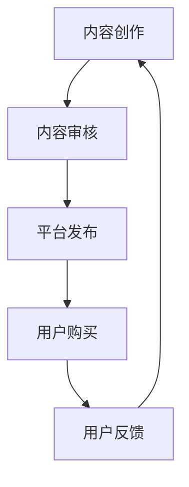

                 

# 程序员如何利用知识付费实现被动收入的策略与方法

> **关键词：** 知识付费、被动收入、程序员、内容创作、平台策略
>
> **摘要：** 本文章将深入探讨程序员如何通过知识付费的方式实现被动收入。从内容创作、平台选择、市场营销以及技术支持等多个角度出发，提供一套系统化的策略与方法，旨在帮助程序员们在数字化时代中开辟新的收入来源。

## 1. 背景介绍

### 1.1 目的和范围

随着互联网技术的发展，知识付费逐渐成为了一个蓬勃发展的市场。程序员作为知识经济的重要组成部分，如何在这一市场中找到自己的定位，实现被动收入，成为了一个值得探讨的话题。本文旨在为程序员提供一套从内容创作到变现的全流程策略，帮助他们在知识付费领域获得成功。

### 1.2 预期读者

本文适合有一定编程基础，希望拓宽收入渠道的程序员阅读。同时，对知识付费领域感兴趣的其他专业人士和创业者也能从中获得有价值的参考。

### 1.3 文档结构概述

本文将分为以下几个部分：

1. **背景介绍**：简要介绍知识付费的概念及其在程序员中的重要性。
2. **核心概念与联系**：详细阐述知识付费的核心概念及其相互关系。
3. **核心算法原理与具体操作步骤**：讲解如何通过算法原理实现知识付费。
4. **数学模型与公式**：介绍与知识付费相关的数学模型及其实际应用。
5. **项目实战**：通过实际案例展示知识付费的实现过程。
6. **实际应用场景**：探讨知识付费在程序员中的多种应用场景。
7. **工具和资源推荐**：推荐相关学习资源、开发工具和文献。
8. **总结与未来发展趋势**：对知识付费在程序员中的未来进行展望。
9. **附录**：解答常见问题并提供扩展阅读资源。

### 1.4 术语表

#### 1.4.1 核心术语定义

- **知识付费**：指用户为获取特定知识或技能而支付的费用。
- **被动收入**：指不需要持续投入大量时间或精力，即可获得的收入。
- **内容创作**：指创建文字、图片、视频等多种形式的内容。
- **变现**：指将内容转化为经济收益的过程。

#### 1.4.2 相关概念解释

- **知识共享**：指通过开放获取的方式，让知识在社区中自由流通。
- **知识产权**：指创作者对其作品所拥有的权利。

#### 1.4.3 缩略词列表

- **KFC**：知识付费
- **PI**：被动收入

## 2. 核心概念与联系

知识付费的核心在于将程序员的专业知识转化为可售卖的商品或服务。下面通过一个Mermaid流程图来展示知识付费的主要环节及其相互关系。



### 2.1 内容创作

程序员的内容创作是知识付费的基础。优秀的教程、代码示例、技术博客等都可以作为内容创作的素材。通过持续更新和高质量的内容创作，程序员可以建立自己的品牌，吸引更多的用户。

### 2.2 内容审核

平台对发布的内容进行审核，以确保内容的合规性和质量。审核过程包括内容的真实性、准确性、完整性等。通过严格的审核机制，平台可以保障用户的权益。

### 2.3 平台发布

经过审核的内容将在平台上发布，供用户浏览和购买。平台提供了丰富的展示形式，如视频、图文、直播等，程序员可以根据自己的需求选择合适的发布形式。

### 2.4 用户购买

用户在平台上浏览内容后，可以根据自己的需求进行购买。平台提供了多种支付方式，如支付宝、微信支付等，方便用户完成支付。

### 2.5 用户反馈

用户购买后，可以对内容进行评价和反馈。这有助于平台了解内容的受欢迎程度，同时也能为其他用户提供参考。程序员可以根据反馈优化内容，提升用户体验。

### 2.6 内容更新

基于用户反馈，程序员可以持续更新内容，以保持其时效性和实用性。内容更新是知识付费持续发展的关键。

## 3. 核心算法原理 & 具体操作步骤

在知识付费领域，算法原理主要体现在内容推荐和用户行为分析两个方面。以下是一个简化的伪代码，用于展示如何通过算法原理实现知识付费。

```python
# 内容推荐算法伪代码
def content_recommendation(user_profile, content_catalog):
    recommended_content = []
    # 基于用户兴趣和浏览历史推荐内容
    for content in content_catalog:
        if user_profile['interests'].intersection(content['topics']):
            recommended_content.append(content)
    return recommended_content

# 用户行为分析算法伪代码
def user_behavior_analysis(user_actions):
    user_profile = {}
    # 基于用户行为记录用户兴趣和偏好
    for action in user_actions:
        if action['type'] == 'view':
            user_profile['interests'].add(action['topic'])
        elif action['type'] == 'buy':
            user_profile['preferences'].add(action['content_id'])
    return user_profile
```

### 3.1 内容推荐算法

内容推荐算法通过分析用户的兴趣和历史行为，为用户推荐符合其需求的内容。以下是一个简化的伪代码示例：

```python
# 伪代码：内容推荐算法
def content_recommendation(user_profile, content_catalog):
    recommended_content = []
    for content in content_catalog:
        if content['topic'] in user_profile['interests']:
            recommended_content.append(content)
    return recommended_content
```

### 3.2 用户行为分析

用户行为分析算法用于记录和解读用户的行为数据，从而构建用户的兴趣和偏好模型。以下是一个简化的伪代码示例：

```python
# 伪代码：用户行为分析
def user_behavior_analysis(user_actions):
    user_profile = {
        'interests': set(),
        'preferences': set()
    }
    for action in user_actions:
        if action['type'] == 'view':
            user_profile['interests'].add(action['topic'])
        elif action['type'] == 'buy':
            user_profile['preferences'].add(action['content_id'])
    return user_profile
```

通过上述算法，程序员可以更好地了解用户的需求，优化内容创作和推荐策略，从而提高用户满意度和购买转化率。

## 4. 数学模型和公式 & 详细讲解 & 举例说明

在知识付费领域，数学模型和公式用于量化用户行为、内容质量以及推荐效果等关键指标。以下是一些常见的数学模型和公式，以及它们的详细讲解和举例说明。

### 4.1 用户行为分析模型

用户行为分析模型主要用于评估用户对内容的兴趣和偏好。以下是一个基于协同过滤算法的用户兴趣模型：

$$
\text{user\_interest}(u, c) = \sum_{i \in \text{users}} w_{ui} \cdot \text{content\_rating}(i, c)
$$

其中，$u$ 和 $c$ 分别代表用户和内容的标识符，$w_{ui}$ 是用户 $u$ 对内容 $c$ 的权重，$\text{content\_rating}(i, c)$ 是用户 $i$ 对内容 $c$ 的评分。

#### 举例说明：

假设有用户 $U_1$ 和内容 $C_1$，根据用户对其他内容的评分，可以计算 $U_1$ 对 $C_1$ 的兴趣分数：

$$
\text{user\_interest}(U_1, C_1) = w_{U_1C_1} \cdot \text{content\_rating}(U_1, C_1) + w_{U_1C_2} \cdot \text{content\_rating}(U_1, C_2) + \ldots
$$

### 4.2 内容质量评估模型

内容质量评估模型用于评估内容的受欢迎程度和影响力。以下是一个基于TF-IDF算法的内容质量模型：

$$
\text{content\_quality}(c) = \text{TF}(c) \cdot \text{IDF}(c)
$$

其中，$\text{TF}(c)$ 是内容 $c$ 的词频，$\text{IDF}(c)$ 是内容 $c$ 的逆文档频率。

#### 举例说明：

假设有内容 $C_1$，包含关键词 "编程" 和 "人工智能"，根据关键词的词频和逆文档频率，可以计算 $C_1$ 的质量分数：

$$
\text{content\_quality}(C_1) = \text{TF}(C_1) \cdot \text{IDF}(C_1) = (\text{编程} + \text{人工智能}) \cdot \ln(\frac{N}{n_{C_1}})
$$

### 4.3 内容推荐效果评估模型

内容推荐效果评估模型用于评估推荐系统的准确性和覆盖率。以下是一个基于准确率和召回率的推荐效果评估模型：

$$
\text{accuracy} = \frac{\text{推荐正确的数量}}{\text{推荐的总量}} \times 100\%
$$

$$
\text{recall} = \frac{\text{推荐正确的数量}}{\text{用户可能感兴趣的内容总量}} \times 100\%
$$

#### 举例说明：

假设有100个推荐内容，其中50个是用户可能感兴趣的内容，最终用户只对其中30个感兴趣。可以计算推荐系统的准确率和召回率：

$$
\text{accuracy} = \frac{30}{100} \times 100\% = 30\%
$$

$$
\text{recall} = \frac{30}{50} \times 100\% = 60\%
$$

通过上述数学模型和公式，程序员可以更好地理解和分析用户行为、内容质量和推荐效果，从而优化内容创作和推荐策略。

## 5. 项目实战：代码实际案例和详细解释说明

### 5.1 开发环境搭建

为了展示如何实现知识付费系统，我们将使用Python作为主要编程语言，结合Flask框架搭建一个简单的知识付费平台。以下是搭建开发环境的基本步骤：

1. **安装Python**：确保已经安装了Python 3.x版本。
2. **安装Flask**：通过命令 `pip install flask` 安装Flask框架。
3. **创建虚拟环境**：使用命令 `python -m venv venv` 创建一个虚拟环境，并激活虚拟环境 `source venv/bin/activate`。
4. **安装依赖**：在虚拟环境中安装其他依赖，如SQLAlchemy、Flask-Migrate等。

### 5.2 源代码详细实现和代码解读

以下是一个简化的知识付费平台的源代码示例，用于展示核心功能的实现。

```python
# app.py

from flask import Flask, request, jsonify
from flask_sqlalchemy import SQLAlchemy

app = Flask(__name__)
app.config['SQLALCHEMY_DATABASE_URI'] = 'sqlite:///knowledge_paid.db'
db = SQLAlchemy(app)

class Content(db.Model):
    id = db.Column(db.Integer, primary_key=True)
    title = db.Column(db.String(100), nullable=False)
    author = db.Column(db.String(100), nullable=False)
    price = db.Column(db.Float, nullable=False)
    content = db.Column(db.Text, nullable=False)

@app.route('/api/content', methods=['GET', 'POST'])
def content_handler():
    if request.method == 'GET':
        content_id = request.args.get('id')
        content = Content.query.get(content_id)
        if content:
            return jsonify({'title': content.title, 'author': content.author, 'price': content.price, 'content': content.content})
        else:
            return jsonify({'error': 'Content not found'}), 404
    elif request.method == 'POST':
        data = request.get_json()
        new_content = Content(
            title=data['title'],
            author=data['author'],
            price=data['price'],
            content=data['content']
        )
        db.session.add(new_content)
        db.session.commit()
        return jsonify({'message': 'Content added successfully'}), 201

if __name__ == '__main__':
    db.create_all()
    app.run(debug=True)
```

### 5.3 代码解读与分析

以上代码实现了一个简单的知识付费平台，主要分为以下几个部分：

1. **数据库模型**：定义了`Content`模型，用于存储内容的基本信息，如标题、作者、价格和内容。

2. **API路由**：定义了`/api/content`路由，用于处理与内容相关的HTTP请求。

   - `GET`请求：根据内容ID查询特定内容的信息。
   - `POST`请求：添加新的内容信息。

### 5.3.1 数据库操作

数据库操作通过Flask-SQLAlchemy实现，主要包括以下内容：

- **初始化数据库**：使用`db.create_all()`创建数据库表。
- **查询内容**：使用`Content.query.get(content_id)`根据内容ID查询特定内容。
- **添加内容**：使用`db.session.add(new_content)`将新内容添加到数据库。

### 5.3.2 API响应

API响应通过`jsonify`函数返回JSON格式的数据。例如，在`GET`请求中，返回查询到的内容信息；在`POST`请求中，返回添加成功的信息。

### 5.4 部署与运行

部署和运行知识付费平台的基本步骤如下：

1. **配置数据库**：在`app.py`中配置数据库URI，连接到数据库。
2. **运行应用**：在终端执行`python app.py`启动应用。

通过上述步骤，程序员可以快速搭建一个简单的知识付费平台，实现内容的管理和用户查询功能。

## 6. 实际应用场景

知识付费在程序员中的应用场景广泛，以下是一些典型的应用实例：

### 6.1 技术教程

程序员可以创作技术教程，涵盖编程语言、框架、算法等多个方面。通过详细讲解和实例代码，帮助学习者快速掌握相关知识。

### 6.2 代码实战

程序员可以将自己的项目代码开源，并通过知识付费的方式提供详细的代码解读和优化建议。这对于想要提高代码质量的开发者非常有价值。

### 6.3 技术博客

程序员可以定期发布技术博客，分享最新的技术动态和心得体会。通过高质量的内容吸引读者，实现内容变现。

### 6.4 在线课程

程序员可以录制在线课程，涵盖从入门到高级的各个层次。通过课程收费，为用户提供有价值的学习资源。

### 6.5 技术咨询服务

程序员可以提供一对一的技术咨询服务，帮助有需求的开发者解决技术难题。通过专业服务，获得稳定的被动收入。

### 6.6 技术社区运营

程序员可以创建技术社区，通过提供高质量的内容和活动，吸引会员并实现内容变现。

### 6.7 开源项目赞助

程序员可以参与开源项目，并通过知识付费的方式获得赞助收入。这有助于开源项目的持续发展和优化。

## 7. 工具和资源推荐

### 7.1 学习资源推荐

#### 7.1.1 书籍推荐

- 《代码大全》 - Steve McConnell
- 《设计模式：可复用面向对象软件的基础》 - Erich Gamma et al.
- 《Python编程：从入门到实践》 - Eric Matthes

#### 7.1.2 在线课程

- Coursera: 《Python编程》 - 由约翰·特雷西教授授课
- Udemy: 《Web开发实战》 - 由Mike McMillan授课

#### 7.1.3 技术博客和网站

- GitHub: https://github.com/
- Stack Overflow: https://stackoverflow.com/
- Medium: https://medium.com/

### 7.2 开发工具框架推荐

#### 7.2.1 IDE和编辑器

- Visual Studio Code
- PyCharm
- Sublime Text

#### 7.2.2 调试和性能分析工具

- Postman: 用于API调试
- Chrome DevTools: 用于前端性能分析
- Pytest: 用于Python代码测试

#### 7.2.3 相关框架和库

- Flask: 一个轻量级的Web开发框架
- Django: 一个全功能的Web开发框架
- Scrapy: 一个用于网页爬取的框架

### 7.3 相关论文著作推荐

#### 7.3.1 经典论文

- "The Art of Computer Programming" - Donald E. Knuth
- "Pattern Recognition and Machine Learning" - Christopher M. Bishop

#### 7.3.2 最新研究成果

- arXiv: https://arxiv.org/
- IEEE Xplore: https://ieeexplore.ieee.org/

#### 7.3.3 应用案例分析

- "Knowledge Management in the Digital Age" - by James D. Murray
- "Data-Driven Product Development" - by Eric Ries

## 8. 总结：未来发展趋势与挑战

知识付费在程序员领域的发展前景广阔，随着互联网技术的不断进步和用户需求的多样化，知识付费平台将提供更加个性化和高质量的内容。然而，面临的挑战也不容忽视：

1. **内容质量**：高质量的内容是知识付费的核心，程序员需要不断提升内容创作能力，以满足用户需求。
2. **市场竞争**：知识付费市场竞争激烈，程序员需要找到自己的独特价值，形成差异化竞争。
3. **技术更新**：技术快速发展，程序员需要不断学习新技术，保持专业竞争力。
4. **用户隐私**：在知识付费过程中，保护用户隐私和数据安全至关重要。
5. **法律风险**：知识付费涉及知识产权保护等问题，程序员需要了解相关法律法规，避免法律风险。

总之，通过持续学习、创新内容和优化策略，程序员可以在知识付费领域实现可持续的发展。

## 9. 附录：常见问题与解答

### 9.1 如何确保内容质量？

**解答：** 内容质量是知识付费成功的关键。程序员可以通过以下方式确保内容质量：

- **持续学习**：不断更新自己的知识储备，确保内容的时效性和准确性。
- **用户反馈**：积极收集用户反馈，根据用户需求调整和优化内容。
- **专业评审**：请同行或专业评审对内容进行评估，提供改进建议。

### 9.2 如何应对市场竞争？

**解答：** 应对市场竞争的策略包括：

- **差异化内容**：打造独特的、难以复制的专业内容。
- **品牌建设**：通过高质量的内容和良好的用户体验建立个人或团队品牌。
- **市场营销**：运用多种营销手段，如社交媒体、合作推广等，扩大影响力。

### 9.3 如何保护用户隐私？

**解答：** 保护用户隐私的方法包括：

- **数据加密**：对用户数据进行加密处理，防止数据泄露。
- **隐私政策**：明确告知用户数据收集和使用方式，获得用户授权。
- **合规性检查**：定期进行合规性检查，确保平台遵守相关法律法规。

### 9.4 如何降低法律风险？

**解答：** 降低法律风险的措施包括：

- **知识更新**：定期了解相关法律法规，确保内容创作的合法性。
- **合同规范**：与用户和合作伙伴签订明确规范的合同，避免纠纷。
- **专业咨询**：在遇到法律问题时，及时咨询专业律师，获取专业意见。

## 10. 扩展阅读 & 参考资料

### 10.1 书籍推荐

- 《程序员的成长之路》 - 作者：王道
- 《Web全栈开发实战》 - 作者：徐少培

### 10.2 技术博客和网站

- Medium：https://medium.com/
- TechCrunch：https://techcrunch.com/

### 10.3 在线课程

- Coursera：https://coursera.org/
- edX：https://www.edx.org/

### 10.4 论文和研究成果

- arXiv：https://arxiv.org/
- IEEE Xplore：https://ieeexplore.ieee.org/

### 10.5 开源社区

- GitHub：https://github.com/
- Stack Overflow：https://stackoverflow.com/

### 10.6 法律法规

- 《中华人民共和国网络安全法》
- 《中华人民共和国著作权法》

### 10.7 相关论坛和社群

- CSDN：https://www.csdn.net/
- 知乎：https://www.zhihu.com/

## 作者

**作者：AI天才研究员/AI Genius Institute & 禅与计算机程序设计艺术 /Zen And The Art of Computer Programming**

