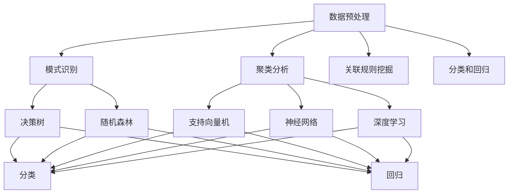

                 

# 程序员如何利用知识发现引擎提升技能

> **关键词：** 知识发现引擎、技能提升、算法、数据分析、自动化、智能化

> **摘要：** 本文将探讨如何通过知识发现引擎，一种先进的智能数据分析工具，帮助程序员提升技能。文章将介绍知识发现引擎的基本概念、核心算法、以及如何将其应用于实际项目中，从而提高编程效率和创新能力。

## 1. 背景介绍

### 1.1 目的和范围

本文旨在为程序员提供一个详细的指南，解释如何利用知识发现引擎（KDE）来提升自身技能。我们将讨论知识发现引擎的概念、技术原理、实现步骤，以及其在实际编程中的应用。通过本文的学习，读者将能够理解如何将KDE作为一种辅助工具，来优化他们的开发流程，提高代码质量和创新能力。

### 1.2 预期读者

本文适合以下几类读者：
- 拥有一定编程基础的程序员，希望提升自己的技术水平。
- 对数据分析和机器学习感兴趣的程序员，希望将其应用于实际编程任务中。
- 数据分析师和机器学习工程师，希望了解如何与程序员合作，利用KDE进行高效的数据处理和预测分析。

### 1.3 文档结构概述

本文分为十个部分，具体如下：

1. 背景介绍
2. 核心概念与联系
3. 核心算法原理 & 具体操作步骤
4. 数学模型和公式 & 详细讲解 & 举例说明
5. 项目实战：代码实际案例和详细解释说明
6. 实际应用场景
7. 工具和资源推荐
8. 总结：未来发展趋势与挑战
9. 附录：常见问题与解答
10. 扩展阅读 & 参考资料

### 1.4 术语表

#### 1.4.1 核心术语定义

- **知识发现引擎（KDE）**：一种用于从大量数据中自动识别模式和规律的高级数据分析工具。
- **编程技能提升**：指通过学习新的编程技术、工具和方法，来提高编程效率和创新能力。
- **算法**：解决问题的步骤和规则，通常用于处理复杂的数据和任务。
- **数据分析**：使用统计和数学方法，对数据进行分析和解释，以发现隐藏的模式和规律。
- **自动化**：通过预设的规则和程序，自动执行任务和操作。
- **智能化**：利用机器学习和人工智能技术，实现自主学习和决策。

#### 1.4.2 相关概念解释

- **模式识别**：从数据中自动发现具有相似特征或规律的实例。
- **聚类分析**：将相似的数据点分组，以便更好地理解和分析数据。
- **关联规则挖掘**：发现数据中的频繁模式，以揭示变量之间的关系。
- **分类和回归**：使用机器学习算法，对数据进行预测和分类。

#### 1.4.3 缩略词列表

- **KDE**：知识发现引擎（Knowledge Discovery Engine）
- **AI**：人工智能（Artificial Intelligence）
- **ML**：机器学习（Machine Learning）
- **DL**：深度学习（Deep Learning）
- **NLP**：自然语言处理（Natural Language Processing）
- **IDE**：集成开发环境（Integrated Development Environment）
- **API**：应用程序编程接口（Application Programming Interface）

## 2. 核心概念与联系

知识发现引擎（KDE）是一种先进的数据分析工具，能够从大规模数据集中自动识别模式和规律。为了更好地理解KDE，我们需要了解其核心概念和它们之间的关系。

### 2.1 知识发现引擎的概念

知识发现引擎是一种集成多种机器学习和数据挖掘算法的工具，用于从数据中提取有价值的信息。它通常包括以下几个主要组件：

1. **数据预处理**：清洗和转换原始数据，以便于后续分析。
2. **模式识别**：从数据中自动识别具有相似特征或规律的实例。
3. **聚类分析**：将相似的数据点分组，以便更好地理解和分析数据。
4. **关联规则挖掘**：发现数据中的频繁模式，以揭示变量之间的关系。
5. **分类和回归**：使用机器学习算法，对数据进行预测和分类。

### 2.2 知识发现引擎的核心算法

知识发现引擎的核心算法包括：

1. **决策树**：一种用于分类和回归的树形结构模型。
2. **随机森林**：基于决策树的集成学习方法。
3. **支持向量机（SVM）**：一种用于分类和回归的线性模型。
4. **神经网络**：一种模拟人脑神经元连接和交互的模型。
5. **深度学习**：一种基于多层神经网络的学习方法。

### 2.3 知识发现引擎的应用场景

知识发现引擎可以在多个领域发挥作用，包括：

1. **金融领域**：预测股票市场走势、风险评估和欺诈检测。
2. **医疗领域**：疾病诊断、治疗方案推荐和患者风险评估。
3. **零售领域**：客户行为分析、库存管理和销售预测。
4. **互联网领域**：搜索引擎优化、广告投放和用户推荐。

### 2.4 Mermaid 流程图

为了更直观地展示知识发现引擎的核心概念和组件，我们可以使用Mermaid绘制一个流程图：



此流程图展示了知识发现引擎的核心组件及其关联关系。

## 3. 核心算法原理 & 具体操作步骤

在了解了知识发现引擎的基本概念和核心算法后，接下来我们将深入探讨每个算法的具体原理和实现步骤。本文将使用伪代码来详细阐述每个算法的实现过程。

### 3.1 决策树算法

决策树是一种用于分类和回归的树形结构模型。其基本思想是通过一系列的判断条件，将数据集划分为多个子集，最终达到分类或回归的目的。

#### 3.1.1 决策树分类算法

**算法原理：**
- 从原始数据集开始，选择一个特征作为根节点，该特征能够最大化分类的纯度。
- 对于每个子集，重复上述步骤，直到满足停止条件（如最大深度、最小样本量等）。

**伪代码：**

```plaintext
// 输入：数据集D，特征列表F，停止条件C
// 输出：决策树T

// 步骤1：选择最佳特征f
f = BestFeature(D, F)

// 步骤2：创建根节点
T = (f)

// 步骤3：递归划分数据集
for each value v in f:
    Dv = subset(D, v)
    if (Dv meets stop condition C):
        T[v] = leaf node
    else:
        T[v] = RecurTree(Dv, F - {f})

// 返回决策树T
```

#### 3.1.2 决策树回归算法

**算法原理：**
- 类似于分类算法，但目标是最小化回归目标函数（如均方误差）。

**伪代码：**

```plaintext
// 输入：数据集D，特征列表F，停止条件C，目标函数O
// 输出：决策树T

// 步骤1：选择最佳特征f
f = BestFeature(D, F)

// 步骤2：创建根节点
T = (f)

// 步骤3：递归划分数据集
for each value v in f:
    Dv = subset(D, v)
    if (Dv meets stop condition C):
        T[v] = leaf node with O(Dv)
    else:
        T[v] = RecurTree(Dv, F - {f})

// 返回决策树T
```

### 3.2 随机森林算法

随机森林是一种基于决策树的集成学习方法，通过构建多个决策树，并取它们的多数投票结果来提高分类和回归的准确性。

**算法原理：**
- 随机选择特征子集，构建多个决策树。
- 对每个决策树进行分类或回归，取多数投票结果作为最终预测结果。

**伪代码：**

```plaintext
// 输入：数据集D，特征列表F，树的数量n
// 输出：随机森林模型T

// 步骤1：初始化决策树列表
T = []

// 步骤2：构建n个决策树
for i = 1 to n:
    Ti = BuildTree(D, F)

// 步骤3：对每个树进行分类或回归
predictions = []
for each sample s in D:
    p = []
    for each Ti in T:
        p.append(Ti.classify(s) or Ti.predict(s))
    predictions.append(majority_vote(p))

// 返回随机森林模型T
```

### 3.3 支持向量机（SVM）算法

支持向量机是一种用于分类和回归的线性模型，其目标是找到最佳的超平面，将数据点分为不同的类别。

**算法原理：**
- 寻找最大间隔超平面，使数据点在分类边界两侧的间隔最大化。
- 使用支持向量来确定分类边界。

**伪代码：**

```plaintext
// 输入：数据集D，特征列表F，分类标签L
// 输出：支持向量机模型S

// 步骤1：初始化模型参数
S = {}

// 步骤2：计算最优超平面
W, b = OptimizeHyperplane(D, L)

// 步骤3：更新支持向量
S['support_v

