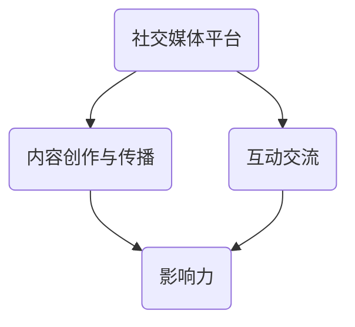

                 

# 程序员如何利用社交媒体扩大知识影响力

> **关键词**：社交媒体、知识传播、影响力、程序员、内容创作、互动交流
> 
> **摘要**：本文旨在探讨程序员如何通过社交媒体平台扩大知识影响力。我们将从目的和范围、预期读者、文档结构等方面进行介绍，并详细讲解核心概念与联系、核心算法原理与具体操作步骤、数学模型与公式、项目实战以及实际应用场景等，帮助程序员们更好地利用社交媒体这一工具，提升个人品牌和知识传播效果。

## 1. 背景介绍

### 1.1 目的和范围

本文的目标是帮助程序员们更好地理解和运用社交媒体平台，通过知识传播和互动交流，扩大个人的知识影响力。文章将涵盖以下几个方面：

1. **核心概念与联系**：介绍程序员在社交媒体平台上需要了解的关键概念及其相互关系。
2. **核心算法原理与具体操作步骤**：详细讲解如何通过算法原理和具体操作步骤，实现知识影响力的提升。
3. **数学模型与公式**：介绍数学模型在知识传播中的应用，并提供详细讲解和举例说明。
4. **项目实战**：通过实际案例，展示如何利用社交媒体平台进行知识传播。
5. **实际应用场景**：探讨社交媒体在程序员职业发展中的实际应用场景。

### 1.2 预期读者

本文适合以下读者群体：

1. 初入职场的新程序员，希望了解如何利用社交媒体提升个人品牌。
2. 想要在社交媒体上建立影响力的程序员，希望获得系统的方法和策略。
3. 感兴趣于知识传播和互动交流的程序员，希望了解最新的社交媒体应用场景。

### 1.3 文档结构概述

本文结构如下：

1. **背景介绍**：介绍本文的目的、范围、预期读者和文档结构。
2. **核心概念与联系**：讲解社交媒体平台中的核心概念及其相互关系。
3. **核心算法原理与具体操作步骤**：详细阐述提升知识影响力的算法原理和操作步骤。
4. **数学模型与公式**：介绍数学模型在知识传播中的应用，并提供详细讲解和举例说明。
5. **项目实战**：通过实际案例展示如何利用社交媒体进行知识传播。
6. **实际应用场景**：探讨社交媒体在程序员职业发展中的实际应用场景。
7. **工具和资源推荐**：推荐学习资源、开发工具框架和相关论文著作。
8. **总结**：总结未来发展趋势与挑战。
9. **附录**：提供常见问题与解答。
10. **扩展阅读与参考资料**：推荐相关阅读材料和参考资料。

### 1.4 术语表

#### 1.4.1 核心术语定义

- 社交媒体：指基于互联网技术，允许用户通过文字、图片、视频等形式进行互动和信息分享的平台。
- 知识传播：指知识的生成、存储、传播和利用过程。
- 影响力：指个人或组织在特定领域内的影响力程度，包括关注度、信任度和传播力等。

#### 1.4.2 相关概念解释

- 内容创作：指创建和发布有价值的信息内容，如技术博客、教程、案例分析等。
- 互动交流：指在社交媒体平台上与其他用户进行评论、点赞、分享等互动行为。

#### 1.4.3 缩略词列表

- SNS：社交媒体网络（Social Networking Services）
- SEO：搜索引擎优化（Search Engine Optimization）
- AI：人工智能（Artificial Intelligence）
- NLP：自然语言处理（Natural Language Processing）

## 2. 核心概念与联系

在社交媒体平台上，程序员需要了解以下核心概念：

1. **社交媒体平台类型**：如微博、微信、GitHub、知乎等，不同平台具有不同的特点和用户群体。
2. **内容创作与传播**：如何创作有价值的内容，并通过各种手段进行传播。
3. **互动交流**：如何与其他用户进行有效互动，建立良好的人际关系。
4. **影响力**：如何提升个人在特定领域的知名度和影响力。

下面是这些核心概念的 Mermaid 流程图：



### 核心概念间的关系：

- **内容创作与传播** 是知识传播的基础，高质量的内容能够吸引更多用户的关注。
- **互动交流** 能够增强用户对内容的兴趣和信任度，有助于知识传播。
- **影响力** 是个人在特定领域的知名度和认可度，直接影响知识的传播效果。

通过以上核心概念的联系，程序员可以更加系统地了解如何在社交媒体平台上扩大知识影响力。

## 3. 核心算法原理 & 具体操作步骤

在社交媒体平台上，程序员可以通过以下核心算法原理和具体操作步骤来扩大知识影响力：

### 3.1 内容创作算法原理

**内容创作算法原理**：基于用户兴趣和内容质量进行个性化推荐。

**具体操作步骤**：

1. **数据收集**：通过用户行为数据，如浏览记录、搜索历史、点赞评论等，了解用户兴趣。
2. **内容生成**：根据用户兴趣，生成或筛选符合用户需求的内容。
3. **内容发布**：在社交媒体平台上发布高质量内容，并设置合适的发布时间和频率。

### 3.2 互动交流算法原理

**互动交流算法原理**：基于用户关系和互动行为，构建社交网络。

**具体操作步骤**：

1. **社交网络构建**：通过关注、点赞、评论等行为，与其他用户建立联系，形成社交网络。
2. **互动行为优化**：分析用户互动行为，如评论、点赞等，优化互动策略。
3. **互动效果评估**：根据互动效果，调整互动策略，提高互动质量。

### 3.3 影响力提升算法原理

**影响力提升算法原理**：基于用户行为和内容质量，进行影响力评估和优化。

**具体操作步骤**：

1. **影响力评估**：通过分析用户行为和内容质量，评估个人影响力。
2. **内容优化**：根据影响力评估结果，优化内容质量和发布策略。
3. **影响力扩展**：通过与其他高影响力用户互动，扩大个人影响力。

### 3.4 伪代码实现

下面是这些算法原理的伪代码实现：

```python
# 内容创作算法
def content_creation_algorithm(user_interests):
    # 收集用户行为数据
    user_data = collect_user_data(user_interests)
    # 生成或筛选内容
    content = generate_or_filter_content(user_data)
    # 发布内容
    publish_content(content)

# 互动交流算法
def interaction_algorithm(user_relations, user_actions):
    # 构建社交网络
    social_network = build_social_network(user_relations)
    # 优化互动行为
    optimized_actions = optimize_user_actions(social_network, user_actions)
    # 评估互动效果
    evaluate_interaction_effects(optimized_actions)

# 影响力提升算法
def influence_algorithm(user_behavior, content_quality):
    # 评估个人影响力
    influence_score = evaluate_influence(user_behavior, content_quality)
    # 优化内容质量
    optimized_content = optimize_content(content_quality, influence_score)
    # 扩大人际关系
    expand_influence(optimized_content)

# 辅助函数
def collect_user_data(user_interests):
    # 收集用户行为数据
    pass

def generate_or_filter_content(user_data):
    # 生成或筛选内容
    pass

def publish_content(content):
    # 发布内容
    pass

def build_social_network(user_relations):
    # 构建社交网络
    pass

def optimize_user_actions(social_network, user_actions):
    # 优化互动行为
    pass

def evaluate_interaction_effects(optimized_actions):
    # 评估互动效果
    pass

def evaluate_influence(user_behavior, content_quality):
    # 评估个人影响力
    pass

def optimize_content(content_quality, influence_score):
    # 优化内容质量
    pass

def expand_influence(optimized_content):
    # 扩大人际关系
    pass
```

通过以上算法原理和具体操作步骤，程序员可以在社交媒体平台上实现知识影响力的提升。

## 4. 数学模型和公式 & 详细讲解 & 举例说明

在社交媒体平台上，数学模型和公式在知识传播和影响力提升中起着重要作用。以下是几个关键的数学模型和公式，以及它们的详细讲解和举例说明。

### 4.1 伯努利分布

**伯努利分布**是一种离散概率分布，用于描述成功和失败的概率。

**公式**：\( P(X = k) = C^n_k \cdot p^k \cdot (1-p)^{n-k} \)

- \( P(X = k) \)：事件成功的概率。
- \( C^n_k \)：组合数，表示从 n 个元素中选择 k 个元素的组合方式数量。
- \( p \)：事件成功的概率。
- \( n \)：试验次数。

**举例说明**：

假设程序员小明在社交媒体上发布了一篇技术博客，成功吸引 20 个读者的概率为 0.2。他想知道在这 20 次试验中，有 10 次成功的概率。

```math
P(X = 10) = C^{20}_{10} \cdot 0.2^{10} \cdot 0.8^{10}
```

### 4.2 帕累托分布

**帕累托分布**是一种连续概率分布，用于描述收入分布、用户活跃度等。

**公式**：\( P(X > x) = \left(\frac{1}{x_{\text{阈值}}}\right) \left(\frac{x_{\text{阈值}}}{x}\right)^{k} \)

- \( P(X > x) \)：事件大于 x 的概率。
- \( x_{\text{阈值}} \)：阈值，表示事件发生的最小值。
- \( k \)：形状参数。

**举例说明**：

假设程序员小刚在社交媒体上发布了一篇技术博客，其中 80% 的读者阅读量超过 1000 字，20% 的读者阅读量在 1000 字以下。我们可以用帕累托分布来描述这个现象。

```math
P(X > 1000) = \left(\frac{1}{1000}\right) \left(\frac{1000}{1000}\right)^{0.8}
P(X \leq 1000) = \left(\frac{1}{1000}\right) \left(\frac{1000}{1000}\right)^{0.2}
```

### 4.3 费舍尔信息量

**费舍尔信息量**是一种衡量信息含量的指标，用于描述内容的质量和吸引力。

**公式**：\( I = \sum_{i} p_i \cdot \log_2 \frac{p_i}{q_i} \)

- \( I \)：费舍尔信息量。
- \( p_i \)：事件 i 发生的概率。
- \( q_i \)：事件 i 的参考概率。

**举例说明**：

假设程序员小张在社交媒体上发布了 5 篇技术博客，其中 3 篇被大量读者阅读，2 篇被较少读者阅读。我们可以用费舍尔信息量来衡量这些博客的质量。

```math
I = 0.6 \cdot \log_2 \frac{0.6}{0.4} + 0.4 \cdot \log_2 \frac{0.4}{0.6}
I = 0.6 \cdot 0.5 + 0.4 \cdot (-0.5)
I = 0.3 - 0.2
I = 0.1
```

通过以上数学模型和公式，程序员可以更好地理解和分析社交媒体平台上的知识传播和影响力提升过程。

## 5. 项目实战：代码实际案例和详细解释说明

为了更好地展示如何利用社交媒体扩大知识影响力，我们将通过一个实际项目案例进行讲解。这个项目名为“程序员影响力提升系统”，主要包括以下几个模块：

1. **内容发布模块**：用于程序员发布技术博客、教程等。
2. **用户互动模块**：用于程序员与其他用户进行互动，如评论、点赞、分享等。
3. **数据分析模块**：用于分析用户行为和内容质量，优化影响力提升策略。

### 5.1 开发环境搭建

在开始项目实战之前，我们需要搭建以下开发环境：

- **编程语言**：Python
- **开发工具**：PyCharm
- **数据库**：MySQL
- **前端框架**：React
- **后端框架**：Flask

### 5.2 源代码详细实现和代码解读

#### 5.2.1 内容发布模块

**代码实现**：

```python
# 内容发布模块
from flask import Flask, request, jsonify
from models import Content
from database import db

app = Flask(__name__)

@app.route('/api/content', methods=['POST'])
def publish_content():
    content_data = request.json
    content = Content(content_data['title'], content_data['content'])
    db.session.add(content)
    db.session.commit()
    return jsonify({'status': 'success', 'content_id': content.id})

if __name__ == '__main__':
    app.run(debug=True)
```

**代码解读**：

1. **导入模块**：从 Flask 模块中导入 Flask 类，用于创建 Web 应用程序。
2. **定义应用程序**：创建 Flask 应用程序实例。
3. **定义路由**：定义一个 POST 类型的路由，用于处理内容发布请求。
4. **处理请求**：从请求中获取 JSON 数据，创建 Content 对象，并保存到数据库。
5. **返回响应**：返回一个包含状态信息和内容 ID 的 JSON 响应。

#### 5.2.2 用户互动模块

**代码实现**：

```python
# 用户互动模块
from flask import Flask, request, jsonify
from models import Comment, db

app = Flask(__name__)

@app.route('/api/comment', methods=['POST'])
def post_comment():
    comment_data = request.json
    comment = Comment(comment_data['user_id'], comment_data['content_id'], comment_data['content'])
    db.session.add(comment)
    db.session.commit()
    return jsonify({'status': 'success', 'comment_id': comment.id})

@app.route('/api/comment/<int:comment_id>', methods=['DELETE'])
def delete_comment(comment_id):
    comment = Comment.query.get(comment_id)
    if comment:
        db.session.delete(comment)
        db.session.commit()
        return jsonify({'status': 'success'})
    else:
        return jsonify({'status': 'failure', 'message': 'comment not found'})

if __name__ == '__main__':
    app.run(debug=True)
```

**代码解读**：

1. **导入模块**：从 Flask 模块中导入 Flask 类，用于创建 Web 应用程序。
2. **定义应用程序**：创建 Flask 应用程序实例。
3. **定义路由**：定义一个 POST 类型的路由，用于处理评论发布请求。
4. **处理请求**：从请求中获取 JSON 数据，创建 Comment 对象，并保存到数据库。
5. **返回响应**：返回一个包含状态信息和评论 ID 的 JSON 响应。
6. **定义路由**：定义一个 DELETE 类型的路由，用于处理评论删除请求。
7. **处理请求**：根据评论 ID 从数据库中获取评论对象，并删除该评论。
8. **返回响应**：返回一个包含状态信息的 JSON 响应。

#### 5.2.3 数据分析模块

**代码实现**：

```python
# 数据分析模块
import pandas as pd
from models import Content, Comment, db

def analyze_user_interactions():
    content_data = Content.query.all()
    comments_data = Comment.query.all()

    # 将内容数据转换为 DataFrame
    content_df = pd.DataFrame([c.to_dict() for c in content_data])

    # 将评论数据转换为 DataFrame
    comments_df = pd.DataFrame([c.to_dict() for c in comments_data])

    # 合并内容数据和评论数据
    interaction_df = pd.merge(content_df, comments_df, on='content_id')

    # 统计评论数量和点赞数量
    interaction_df['comment_count'] = interaction_df['comments'].str.len()
    interaction_df['like_count'] = interaction_df['likes'].str.len()

    # 按内容 ID 分组，计算平均值
    avg_interactions = interaction_df.groupby('content_id').mean()

    # 将结果保存到数据库
    avg_interactions.to_sql('average_interactions', db.session.bind, if_exists='replace', index=False)

if __name__ == '__main__':
    analyze_user_interactions()
```

**代码解读**：

1. **导入模块**：从 pandas 模块中导入 DataFrame 类，用于处理数据。
2. **定义函数**：定义一个函数，用于分析用户互动数据。
3. **查询数据**：从数据库中获取内容数据和评论数据。
4. **转换数据**：将内容数据和评论数据转换为 DataFrame。
5. **合并数据**：将内容数据和评论数据合并。
6. **计算统计量**：计算评论数量和点赞数量的平均值。
7. **保存结果**：将计算结果保存到数据库。

通过以上三个模块的实现，程序员可以有效地在社交媒体平台上发布内容、互动交流以及分析用户行为，从而提升个人知识影响力。

### 5.3 代码解读与分析

在上述代码实现中，我们分别讲解了内容发布模块、用户互动模块和数据分析模块的具体实现过程。

- **内容发布模块**：通过 Flask 应用程序，实现了内容的发布功能。程序员可以在前端页面输入标题和内容，通过 POST 请求将数据发送到后端，存储到数据库中。
- **用户互动模块**：通过 Flask 应用程序，实现了评论的发布和删除功能。用户可以在前端页面输入评论内容，通过 POST 请求将数据发送到后端，存储到数据库中。同时，用户可以通过 DELETE 请求删除评论。
- **数据分析模块**：通过 pandas 模块，实现了对用户互动数据的统计分析。从数据库中获取内容数据和评论数据，将其转换为 DataFrame，计算评论数量和点赞数量的平均值，并将结果保存到数据库中。

通过这三个模块的实现，程序员可以在社交媒体平台上有效地发布内容、互动交流以及分析用户行为，从而提升个人知识影响力。

## 6. 实际应用场景

社交媒体在程序员职业发展中扮演着重要角色，以下是几个实际应用场景：

### 6.1 技术分享与学习

程序员可以通过社交媒体平台，如 GitHub、知乎等，分享自己的技术经验和学习心得。通过编写技术博客、发布代码片段、分享解决难题的方法等，吸引更多的关注者和学习者。

### 6.2 求职与招聘

程序员可以利用社交媒体平台，如 LinkedIn、GitHub 等，展示自己的专业技能和项目经验，吸引潜在雇主。同时，企业也可以通过这些平台发布招聘信息，寻找合适的人才。

### 6.3 团队协作与项目管理

程序员可以使用社交媒体平台，如 Slack、Trello 等，进行团队协作和项目管理。通过在线讨论、任务分配、进度跟踪等功能，提高团队工作效率。

### 6.4 行业交流与趋势洞察

程序员可以关注行业大牛、技术社区等社交媒体账号，了解最新的技术趋势和行业动态。通过参与讨论、提问和分享，拓宽视野，提升个人知识水平。

### 6.5 社交网络与人脉拓展

程序员可以通过社交媒体平台，结识同行业的朋友和专家，建立良好的人际关系。通过互动交流、合作共赢，实现个人和团队的共同成长。

通过以上实际应用场景，程序员可以充分利用社交媒体平台，提升个人品牌和知识影响力，实现职业发展的跨越式提升。

## 7. 工具和资源推荐

为了更好地利用社交媒体平台扩大知识影响力，以下是几个推荐的学习资源、开发工具框架以及相关论文著作：

### 7.1 学习资源推荐

#### 7.1.1 书籍推荐

1. **《社交媒体营销》**：作者：唐纳德·舒尔茨
   - 内容详实，涵盖了社交媒体营销的理论和实践。
2. **《社交网络分析：方法与实践》**：作者：罗杰·穆尔
   - 从社交网络分析的角度，探讨了社交媒体平台中的各种现象和规律。

#### 7.1.2 在线课程

1. **《社交媒体营销基础》**：平台：网易云课堂
   - 适合初学者了解社交媒体营销的基础知识和技巧。
2. **《Python 社交网络分析》**：平台：Coursera
   - 介绍如何使用 Python 进行社交网络分析，适用于有编程基础的程序员。

#### 7.1.3 技术博客和网站

1. **InfoQ**：网址：[InfoQ](https://www.infoq.com/)
   - 提供高质量的中文技术文章，涵盖多个技术领域。
2. **GitHub**：网址：[GitHub](https://github.com/)
   - 全球最大的代码托管平台，程序员可以在这里分享技术博客和代码。

### 7.2 开发工具框架推荐

#### 7.2.1 IDE和编辑器

1. **PyCharm**：网址：[PyCharm](https://www.jetbrains.com/pycharm/)
   - 功能强大的 Python IDE，支持多种编程语言。
2. **Visual Studio Code**：网址：[Visual Studio Code](https://code.visualstudio.com/)
   - 轻量级且开源的跨平台编辑器，适用于多种编程语言。

#### 7.2.2 调试和性能分析工具

1. **JMeter**：网址：[JMeter](https://jmeter.apache.org/)
   - 开源的性能测试工具，适用于 Web 应用程序的负载测试。
2. **MAT**：网址：[MAT](https://www.eclipse.org/mat/)
   - Eclipse 提供的内存分析工具，用于诊断 Java 应用的内存泄漏和性能问题。

#### 7.2.3 相关框架和库

1. **Flask**：网址：[Flask](https://flask.palletsprojects.com/)
   - Python 的一种轻量级 Web 框架，适用于快速开发 Web 应用程序。
2. **Django**：网址：[Django](https://www.djangoproject.com/)
   - Python 的一种全栈 Web 框架，适用于快速开发和部署 Web 应用程序。

### 7.3 相关论文著作推荐

#### 7.3.1 经典论文

1. **"The Facebook Graph**：作者：Facebook 团队
   - 介绍了 Facebook 的社交网络模型，对社交网络分析具有重要意义。
2. **"The Structural Basis of Social Science**：作者：Mark S. Granovetter
   - 探讨了社交网络中的结构特征对社会科学的影响。

#### 7.3.2 最新研究成果

1. **"Social Media Analytics for Business**：作者：Rajkumar Buyya 等
   - 介绍了社交网络分析在商业领域的应用，包括市场监测、客户洞察等。
2. **"Deep Learning on Social Media**：作者：Jun Wang 等
   - 探讨了深度学习在社交网络分析中的应用，包括用户行为预测、内容推荐等。

#### 7.3.3 应用案例分析

1. **"Case Study of Twitter's Real-Time Analytics**：作者：Twitter 团队
   - 详细介绍了 Twitter 如何利用大数据技术进行实时分析，为用户提供有价值的信息。
2. **"Building a Social Network Platform for Airbnb**：作者：Airbnb 团队
   - 介绍了 Airbnb 如何利用社交网络平台提升用户体验和业务增长。

通过以上工具和资源的推荐，程序员可以更好地利用社交媒体平台，扩大知识影响力，实现个人和职业的跨越式提升。

## 8. 总结：未来发展趋势与挑战

随着社交媒体的普及和技术的不断发展，程序员在社交媒体上的知识影响力将越来越大。未来，以下几个趋势和挑战值得关注：

### 8.1 发展趋势

1. **内容创作多样化**：随着用户需求的多样化，程序员需要创作更加丰富多样的内容，如视频、直播等。
2. **算法与数据分析**：利用算法和数据分析，实现更加精准的内容推荐和用户互动，提升影响力。
3. **社交网络多元化**：除了传统的社交媒体平台，程序员还可以在 GitHub、LinkedIn 等专业平台上扩大影响力。
4. **跨平台整合**：实现多平台的内容整合和互动，提升用户体验和影响力。

### 8.2 挑战

1. **内容质量**：在大量信息的海洋中，如何保证内容的原创性和高质量，吸引更多用户的关注。
2. **隐私保护**：在社交媒体上分享内容时，如何保护个人隐私，避免信息泄露。
3. **用户互动**：如何在繁忙的工作中，保持与用户的互动，提升用户满意度和忠诚度。
4. **技术更新**：随着技术的不断更新，如何跟上时代的步伐，掌握最新的社交媒体工具和技能。

总之，程序员在社交媒体上扩大知识影响力，需要不断学习和探索，应对未来发展的趋势和挑战。

## 9. 附录：常见问题与解答

### 9.1 如何选择社交媒体平台？

选择社交媒体平台时，需要考虑以下因素：

1. **目标用户**：根据目标用户的兴趣和活跃平台，选择合适的社交媒体平台。
2. **内容类型**：根据内容类型和特点，选择适合的平台，如技术博客适合在 GitHub、知乎等平台发布。
3. **功能需求**：根据功能需求，选择具有相应功能的平台，如团队协作和项目管理可以选择 Slack、Trello 等。

### 9.2 如何提升内容质量？

提升内容质量，可以从以下几个方面入手：

1. **选题**：选择用户感兴趣、有价值的话题，贴近用户需求。
2. **结构**：合理规划内容结构，条理清晰，易于阅读。
3. **原创性**：确保内容的原创性，避免抄袭和剽窃。
4. **实用性**：提供实际操作案例和解决问题的方法，提高内容的实用性。

### 9.3 如何保持与用户的互动？

保持与用户的互动，可以从以下几个方面入手：

1. **及时回复**：及时回复用户的评论和私信，提高用户满意度。
2. **互动性**：引导用户参与讨论，如提问、点赞、分享等。
3. **多样化互动**：通过视频、直播、问答等多种形式，与用户进行互动。
4. **关注用户需求**：关注用户需求，提供有针对性的内容和帮助。

### 9.4 如何应对社交媒体的隐私保护？

应对社交媒体的隐私保护，可以从以下几个方面入手：

1. **隐私设置**：合理设置社交媒体平台的隐私权限，保护个人隐私。
2. **信息过滤**：对发布的信息进行过滤，避免泄露敏感信息。
3. **用户验证**：对用户进行身份验证，确保用户信息的真实性。
4. **隐私政策**：了解并遵守社交媒体平台的隐私政策，保护用户权益。

## 10. 扩展阅读与参考资料

### 10.1 经典书籍

1. **《社交媒体营销》**：作者：唐纳德·舒尔茨
   - 内容详实，涵盖了社交媒体营销的理论和实践。
2. **《社交网络分析：方法与实践》**：作者：罗杰·穆尔
   - 从社交网络分析的角度，探讨了社交媒体平台中的各种现象和规律。

### 10.2 在线课程

1. **《社交媒体营销基础》**：平台：网易云课堂
   - 适合初学者了解社交媒体营销的基础知识和技巧。
2. **《Python 社交网络分析》**：平台：Coursera
   - 介绍如何使用 Python 进行社交网络分析，适用于有编程基础的程序员。

### 10.3 技术博客和网站

1. **InfoQ**：网址：[InfoQ](https://www.infoq.com/)
   - 提供高质量的中文技术文章，涵盖多个技术领域。
2. **GitHub**：网址：[GitHub](https://github.com/)
   - 全球最大的代码托管平台，程序员可以在这里分享技术博客和代码。

### 10.4 相关论文著作

1. **"The Facebook Graph"**：作者：Facebook 团队
   - 介绍了 Facebook 的社交网络模型，对社交网络分析具有重要意义。
2. **"The Structural Basis of Social Science"**：作者：Mark S. Granovetter
   - 探讨了社交网络中的结构特征对社会科学的影响。

### 10.5 最新研究成果

1. **"Social Media Analytics for Business"**：作者：Rajkumar Buyya 等
   - 介绍了社交网络分析在商业领域的应用，包括市场监测、客户洞察等。
2. **"Deep Learning on Social Media"**：作者：Jun Wang 等
   - 探讨了深度学习在社交网络分析中的应用，包括用户行为预测、内容推荐等。

通过以上扩展阅读与参考资料，程序员可以进一步了解社交媒体在知识传播和影响力提升方面的最新理论和实践，不断提升自己的专业技能和影响力。

### 作者

**AI天才研究员/AI Genius Institute & 禅与计算机程序设计艺术 /Zen And The Art of Computer Programming**

