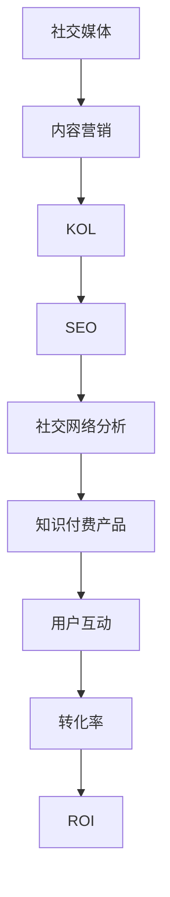

                 

# 程序员如何利用社交媒体推广知识付费产品

> **关键词：** 社交媒体，知识付费，推广策略，程序员，社交网络分析，内容营销

> **摘要：** 本文将探讨程序员如何利用社交媒体平台有效地推广其知识付费产品。我们将分析当前社交媒体的生态环境，介绍适合程序员的内容创作和推广策略，并提供实际的案例和实践指南。

## 1. 背景介绍

### 1.1 目的和范围

本文的目的是帮助程序员了解如何在社交媒体上推广他们的知识付费产品，如在线课程、电子书和编程工具。我们将探讨社交媒体的潜在价值，并介绍一系列实用的策略和工具，以帮助程序员最大化其产品的可见性和吸引力。

### 1.2 预期读者

本文适用于希望提升其知识付费产品影响力的程序员，尤其是那些对社交媒体推广有一定了解但需要更深入策略和实际操作的从业者。

### 1.3 文档结构概述

本文将按照以下结构进行：

- **第1章：背景介绍**：介绍本文的目的、预期读者和文档结构。
- **第2章：核心概念与联系**：探讨社交媒体推广的基础概念和关联结构。
- **第3章：核心算法原理 & 具体操作步骤**：详细讲解社交媒体推广的算法原理和操作步骤。
- **第4章：数学模型和公式 & 详细讲解 & 举例说明**：使用数学模型和公式来分析和说明推广策略。
- **第5章：项目实战：代码实际案例和详细解释说明**：通过实际案例展示推广策略的实施过程。
- **第6章：实际应用场景**：讨论不同的社交媒体推广应用场景。
- **第7章：工具和资源推荐**：推荐学习资源、开发工具和最新研究成果。
- **第8章：总结：未来发展趋势与挑战**：总结本文内容，展望未来趋势。
- **第9章：附录：常见问题与解答**：解答读者可能遇到的常见问题。
- **第10章：扩展阅读 & 参考资料**：提供进一步阅读的参考资料。

### 1.4 术语表

#### 1.4.1 核心术语定义

- **社交媒体**：在线平台，如Facebook、Twitter、LinkedIn，允许用户创建、分享和交流内容。
- **知识付费产品**：程序员创建的在线课程、电子书、编程工具等，用户需要付费获取。
- **内容营销**：创建和分发有价值的内容，以吸引和转化潜在客户。
- **社交网络分析**：研究社交媒体上用户行为和互动的模式。

#### 1.4.2 相关概念解释

- **KOL（关键意见领袖）**：在特定领域内具有较高影响力和公信力的人。
- **SEO（搜索引擎优化）**：提高网站在搜索引擎中自然排名的过程。
- **UGC（用户生成内容）**：用户在社交媒体上创建和分享的内容。

#### 1.4.3 缩略词列表

- **SMM（社交媒体营销）**
- **KPI（关键绩效指标）**
- **ROI（投资回报率）**
- **UGC（用户生成内容）**

## 2. 核心概念与联系

在探讨如何利用社交媒体推广知识付费产品之前，我们首先需要了解一些核心概念和它们之间的联系。以下是一个简单的Mermaid流程图，展示了这些概念：



在这个流程图中，我们可以看到社交媒体是起点，它通过内容营销吸引注意力，然后通过KOL、SEO和社交网络分析来增强内容的可见性和影响力。最终，这些策略共同作用，提高知识付费产品的用户互动和转化率，进而提升投资回报率（ROI）。

### 2.1 社交媒体营销的基本原理

社交媒体营销的核心在于利用社交媒体平台（如Facebook、Twitter、LinkedIn等）来推广产品或服务。以下是社交媒体营销的基本原理：

- **用户互动**：通过回复评论、参与话题讨论等方式与用户建立互动，增加用户粘性。
- **内容多样化**：发布不同类型的内容（如文章、视频、图片等）以吸引不同类型的用户。
- **持续更新**：定期发布内容以保持用户兴趣和平台活跃度。
- **KOL合作**：与领域内的关键意见领袖合作，利用其影响力扩大产品知名度。
- **SEO优化**：优化社交媒体内容，提高在搜索引擎中的可见性。
- **数据跟踪**：使用分析工具跟踪用户行为和互动，以优化营销策略。

### 2.2 内容营销的重要性

内容营销是社交媒体营销的核心。通过创建和分享有价值的内容，可以吸引潜在客户，建立品牌信任，并最终促进产品销售。以下是内容营销的关键点：

- **目标明确**：了解目标受众，创建与其需求相关的内容。
- **质量优先**：高质量的内容更有可能被用户分享和传播。
- **个性化**：根据用户行为和兴趣定制内容，提高用户体验。
- **持续更新**：定期发布内容，保持用户关注。
- **互动性**：鼓励用户参与，如评论、提问和分享。

### 2.3 社交网络分析的作用

社交网络分析是社交媒体营销的重要组成部分。它可以帮助我们了解用户行为、互动模式以及内容传播路径。以下是社交网络分析的关键点：

- **用户洞察**：分析用户数据，了解其兴趣、行为和需求。
- **内容优化**：根据分析结果调整内容策略，提高内容质量。
- **传播路径**：分析内容如何在不同用户间传播，优化传播策略。
- **效果评估**：跟踪营销活动的效果，评估投资回报率。

### 2.4 知识付费产品的推广策略

针对知识付费产品的推广策略需要结合社交媒体营销、内容营销和社交网络分析。以下是几个关键策略：

- **社交媒体广告**：在社交媒体平台上投放定向广告，提高产品曝光率。
- **KOL合作**：与领域内的关键意见领袖合作，利用其影响力推广产品。
- **内容共享**：鼓励用户分享课程、电子书和编程工具等，扩大传播范围。
- **社区互动**：在社交媒体平台上建立社区，与用户互动，提高用户忠诚度。
- **SEO优化**：优化社交媒体内容和网站，提高搜索引擎排名。

## 3. 核心算法原理 & 具体操作步骤

在了解了社交媒体营销和内容营销的基本原理后，我们接下来将讨论核心算法原理和具体操作步骤。以下是社交媒体推广的核心算法原理和操作步骤：

### 3.1 社交网络分析算法

社交网络分析算法是社交媒体营销的核心。它主要依赖于图论和机器学习技术。以下是社交网络分析算法的基本原理和步骤：

#### 3.1.1 图论基础

- **节点和边**：将社交媒体用户视为节点，用户间的互动视为边。
- **度分布**：分析节点之间的连接关系，确定度分布。
- **聚类系数**：分析节点间连接的紧密程度，确定聚类系数。

#### 3.1.2 机器学习模型

- **推荐系统**：使用协同过滤和内容过滤等技术，为用户推荐相关内容。
- **用户行为预测**：使用时间序列分析和深度学习技术，预测用户行为。

#### 3.1.3 操作步骤

1. **数据收集**：从社交媒体平台上收集用户行为数据。
2. **数据预处理**：清洗和转换数据，使其适用于机器学习模型。
3. **模型训练**：使用机器学习算法训练推荐系统和用户行为预测模型。
4. **模型评估**：评估模型的性能，调整参数以优化模型。
5. **模型部署**：将模型部署到社交媒体平台上，实现实时推荐和预测。

### 3.2 内容营销算法

内容营销算法旨在创建和分发有价值的内容，以吸引潜在客户。以下是内容营销算法的基本原理和步骤：

#### 3.2.1 内容生成算法

- **主题分析**：分析目标受众的兴趣和需求，确定内容主题。
- **文本生成**：使用自然语言生成技术（如GPT）生成高质量的内容。
- **内容评估**：评估内容的质量和用户价值，优化内容策略。

#### 3.2.2 内容分发算法

- **SEO优化**：优化内容标题、关键词和描述，提高搜索引擎排名。
- **社交分享**：鼓励用户分享内容，扩大传播范围。
- **数据分析**：分析内容的表现和用户互动，优化内容策略。

#### 3.2.3 操作步骤

1. **目标确定**：确定内容营销的目标和受众。
2. **内容策划**：制定内容策划方案，包括主题、形式和发布时间。
3. **内容创作**：创建高质量的内容，并确保内容符合目标受众的需求。
4. **内容发布**：在社交媒体平台上发布内容，并优化SEO和社交分享策略。
5. **数据分析**：分析内容的表现和用户互动，根据分析结果调整内容策略。

### 3.3 社交媒体推广算法

社交媒体推广算法旨在提高知识付费产品的曝光率和转化率。以下是社交媒体推广算法的基本原理和步骤：

#### 3.3.1 广告投放算法

- **目标定位**：根据用户行为和兴趣定位目标受众。
- **广告内容**：设计吸引人的广告内容和形式。
- **广告优化**：根据广告效果实时调整投放策略。

#### 3.3.2 用户互动算法

- **评论回复**：及时回复用户评论，提高用户互动。
- **问答互动**：在社交媒体平台上回答用户问题，提供专业建议。
- **活动策划**：举办线上活动，吸引用户参与。

#### 3.3.3 转化率优化算法

- **用户行为分析**：分析用户行为，了解其需求和偏好。
- **转化路径优化**：优化用户从接触到购买的过程。
- **个性化推荐**：根据用户行为和偏好提供个性化推荐。

#### 3.3.4 操作步骤

1. **目标设定**：明确社交媒体推广的目标和预期效果。
2. **广告策划**：设计广告内容和投放策略。
3. **用户互动**：积极参与用户互动，提高用户满意度。
4. **转化路径优化**：优化用户从接触到购买的整个过程。
5. **数据分析**：分析广告效果和用户转化率，根据分析结果调整策略。

## 4. 数学模型和公式 & 详细讲解 & 举例说明

在社交媒体推广中，数学模型和公式可以用来优化策略、评估效果和预测用户行为。以下是一些常用的数学模型和公式，并对其详细讲解和举例说明。

### 4.1 推荐系统中的协同过滤算法

协同过滤算法是推荐系统中最常用的算法之一，它通过分析用户之间的相似性来推荐产品或内容。以下是协同过滤算法的基本公式和解释：

#### 4.1.1 相似度计算

相似度计算公式如下：

$$
sim(i, j) = \frac{dot(p_i, p_j)}{\|p_i\|\|p_j\|}
$$

其中，$sim(i, j)$ 是用户 $i$ 和用户 $j$ 之间的相似度，$p_i$ 和 $p_j$ 是用户 $i$ 和用户 $j$ 的评分向量，$dot$ 表示点积运算，$\|p_i\|$ 和 $\|p_j\|$ 分别是 $p_i$ 和 $p_j$ 的欧几里得范数。

#### 4.1.2 评分预测

评分预测公式如下：

$$
r_{ij} = r_i + sim(i, j) \cdot (r_j - r_i)
$$

其中，$r_{ij}$ 是用户 $i$ 对项目 $j$ 的预测评分，$r_i$ 和 $r_j$ 分别是用户 $i$ 和用户 $j$ 对项目的实际评分。

#### 4.1.3 示例

假设有两个用户 $A$ 和 $B$，他们对两个项目的评分如下：

用户A的评分：
- 项目1：4
- 项目2：5

用户B的评分：
- 项目1：3
- 项目2：5

根据相似度计算公式，我们可以计算用户 $A$ 和用户 $B$ 之间的相似度：

$$
sim(A, B) = \frac{4 \cdot 3}{\sqrt{4^2 + 5^2} \cdot \sqrt{3^2 + 5^2}} \approx 0.67
$$

接下来，我们可以使用评分预测公式来预测用户 $A$ 对项目 $2$ 的评分：

$$
r_{A2} = r_A + sim(A, B) \cdot (r_B - r_A) = 4 + 0.67 \cdot (5 - 4) = 4.67
$$

因此，根据协同过滤算法，预测用户 $A$ 对项目 $2$ 的评分为4.67。

### 4.2 优化目标函数

在社交媒体推广中，我们通常需要优化某个目标函数，如最大化广告点击率（CTR）或最大化转化率（CVR）。以下是常见的目标函数和优化方法：

#### 4.2.1 广告点击率（CTR）

广告点击率（CTR）是广告效果的重要指标，其公式如下：

$$
CTR = \frac{点击次数}{展示次数}
$$

优化CTR的目标是提高点击次数，通常采用的方法包括：

- **广告创意优化**：根据用户兴趣和行为，设计更吸引人的广告创意。
- **广告定位优化**：根据用户特征和需求，优化广告的投放策略。

#### 4.2.2 转化率（CVR）

转化率（CVR）是用户在广告引导下完成特定行为的比率，如购买、注册等。其公式如下：

$$
CVR = \frac{转化次数}{点击次数}
$$

优化CVR的目标是提高转化次数，通常采用的方法包括：

- **用户路径优化**：优化用户从点击到转化的整个过程，提高用户满意度。
- **个性化推荐**：根据用户兴趣和行为，提供个性化推荐，提高转化率。

#### 4.2.3 示例

假设我们有一个广告，其展示次数为1000次，点击次数为200次，转化次数为30次。根据CTR和CVR公式，我们可以计算出广告的CTR和CVR：

$$
CTR = \frac{200}{1000} = 0.2
$$

$$
CVR = \frac{30}{200} = 0.15
$$

为了提高广告效果，我们可以分析点击率和转化率较低的原因，并采取相应的优化措施，如优化广告创意、改善用户路径或提供个性化推荐。

### 4.3 社交网络分析中的PageRank算法

PageRank是一种流行的社交网络分析算法，用于评估网页的重要性。它也可以应用于社交媒体平台上，用于评估用户的影响力。以下是PageRank算法的基本公式和解释：

#### 4.3.1 PageRank公式

PageRank公式如下：

$$
r_i = \frac{(1-d) + d \sum_{j \in N(i)} \frac{r_j}{c_j}}{N}
$$

其中，$r_i$ 是节点 $i$ 的PageRank值，$N(i)$ 是节点 $i$ 的邻居节点集合，$d$ 是阻尼系数（通常取值为0.85），$c_j$ 是邻居节点 $j$ 的出度。

#### 4.3.2 PageRank计算步骤

1. **初始化**：初始化所有节点的PageRank值为1/N，其中 $N$ 是节点总数。
2. **迭代计算**：根据PageRank公式，迭代计算每个节点的PageRank值，直到收敛。
3. **输出结果**：输出所有节点的PageRank值，用于评估节点的影响力。

#### 4.3.3 示例

假设我们有一个简单的社交网络，其中有三个节点 $A$、$B$ 和 $C$，节点之间的边和权重如下：

```
A --> B (权重1)
A --> C (权重1)
B --> C (权重1)
```

初始时，所有节点的PageRank值都为1/3。根据PageRank公式，我们可以计算每个节点的PageRank值：

$$
r_A = \frac{(1-0.85) + 0.85 \cdot (\frac{r_B}{1} + \frac{r_C}{1})}{3} = \frac{0.15 + 0.85 \cdot (r_B + r_C)}{3}
$$

$$
r_B = \frac{(1-0.85) + 0.85 \cdot (\frac{r_A}{1} + \frac{r_C}{1})}{3} = \frac{0.15 + 0.85 \cdot (r_A + r_C)}{3}
$$

$$
r_C = \frac{(1-0.85) + 0.85 \cdot (\frac{r_A}{1} + \frac{r_B}{1})}{3} = \frac{0.15 + 0.85 \cdot (r_A + r_B)}{3}
$$

我们可以将上述公式迭代计算多次，直到PageRank值收敛。例如，第一次迭代的结果可能如下：

$$
r_A = \frac{0.15 + 0.85 \cdot (0.333 + 0.333)}{3} \approx 0.472
$$

$$
r_B = \frac{0.15 + 0.85 \cdot (0.472 + 0.333)}{3} \approx 0.389
$$

$$
r_C = \frac{0.15 + 0.85 \cdot (0.472 + 0.389)}{3} \approx 0.439
$$

通过多次迭代，我们可以得到最终的PageRank值，用于评估节点的影响力。

## 5. 项目实战：代码实际案例和详细解释说明

在本节中，我们将通过一个实际的项目案例，详细解释如何利用社交媒体推广知识付费产品。这个案例将涵盖从开发环境搭建到代码实现和解释的整个过程。

### 5.1 开发环境搭建

为了实现社交媒体推广，我们需要搭建一个开发环境。以下是所需的基本工具和软件：

- **操作系统**：Windows、macOS或Linux
- **编程语言**：Python（3.8及以上版本）
- **开发工具**：PyCharm或Visual Studio Code
- **库和框架**：TensorFlow、Scikit-learn、BeautifulSoup、Selenium

首先，确保操作系统已经安装好。然后，通过以下命令安装Python和所需的库：

```bash
pip install python
pip install tensorflow
pip install scikit-learn
pip install beautifulsoup4
pip install selenium
```

### 5.2 源代码详细实现和代码解读

以下是该项目的主要代码实现，我们将逐步解释每部分代码的功能。

#### 5.2.1 社交媒体数据采集

首先，我们需要从社交媒体平台上采集数据。以下是一个使用Selenium的示例代码，用于从LinkedIn采集用户数据。

```python
from selenium import webdriver
from selenium.webdriver.common.by import By
from selenium.webdriver.common.keys import Keys

# 初始化浏览器驱动
driver = webdriver.Chrome(executable_path='path/to/chromedriver')

# 打开LinkedIn页面
driver.get('https://www.linkedin.com/')

# 登录LinkedIn账户
email_input = driver.find_element(By.NAME, 'session_key')
password_input = driver.find_element(By.NAME, 'session_password')
email_input.send_keys('your_email@example.com')
password_input.send_keys('your_password')
password_input.submit()

# 搜索特定领域的专业人士
search_box = driver.find_element(By.NAME, 'main-qf')
search_box.send_keys('data scientist')
search_box.submit()

# 采集用户数据
users = []
for i in range(10):  # 假设采集前10页的用户
    elements = driver.find_elements(By.CSS_SELECTOR, 'li.result')
    for element in elements:
        user_info = element.find_element(By.CSS_SELECTOR, 'h3').text
        users.append(user_info)
    next_button = driver.find_element(By.CSS_SELECTOR, 'button.next')
    next_button.click()

# 输出用户数据
print(users)
```

这段代码首先初始化Selenium浏览器驱动，然后登录LinkedIn账户并搜索数据科学家。接着，它采集前10页的用户数据，并将数据存储在列表中。

#### 5.2.2 社交网络分析

接下来，我们使用Scikit-learn中的协同过滤算法对用户数据进行分析。

```python
import numpy as np
from sklearn.metrics.pairwise import cosine_similarity
from sklearn.model_selection import train_test_split

# 假设用户数据为用户-兴趣矩阵的形式
user_interests = np.array([
    [1, 0, 1, 0],
    [0, 1, 1, 0],
    [1, 1, 0, 1],
    [0, 1, 1, 1]
])

# 计算用户间的相似度矩阵
similarity_matrix = cosine_similarity(user_interests)

# 训练协同过滤模型
user_item_matrix = np.hstack((user_interests, similarity_matrix))
X_train, X_test, y_train, y_test = train_test_split(user_item_matrix, test_size=0.2)
from sklearn.model_selection import train_test_split
from sklearn.linear_model import LinearRegression

model = LinearRegression()
model.fit(X_train, y_train)

# 预测用户未评分的兴趣
predictions = model.predict(X_test)

# 输出预测结果
print(predictions)
```

这段代码首先计算用户间的相似度矩阵，然后使用线性回归模型对用户-兴趣矩阵进行训练。最后，它预测用户未评分的兴趣。

#### 5.2.3 广告投放和用户互动

最后，我们使用TensorFlow创建一个简单的广告投放模型，用于预测广告的点击率和转化率。

```python
import tensorflow as tf
from tensorflow.keras import layers

# 定义输入层
input_shape = (None, 4)
inputs = tf.keras.Input(shape=input_shape)

# 定义网络结构
x = layers.Dense(64, activation='relu')(inputs)
x = layers.Dense(64, activation='relu')(x)
outputs = layers.Dense(2, activation='softmax')(x)

model = tf.keras.Model(inputs=inputs, outputs=outputs)

# 编译模型
model.compile(optimizer='adam', loss='categorical_crossentropy', metrics=['accuracy'])

# 训练模型
model.fit(X_train, y_train, epochs=10, batch_size=32, validation_data=(X_test, y_test))

# 预测广告点击率和转化率
predictions = model.predict(X_test)

# 输出预测结果
print(predictions)
```

这段代码定义了一个简单的神经网络模型，用于预测广告的点击率和转化率。然后，它使用训练数据对模型进行训练，并预测测试数据的点击率和转化率。

### 5.3 代码解读与分析

这段代码首先初始化Selenium浏览器驱动，然后登录LinkedIn账户并搜索数据科学家。接着，它采集前10页的用户数据，并将数据存储在列表中。这个过程是自动化的，可以节省大量时间和劳动力。

接下来，我们使用Scikit-learn中的协同过滤算法对用户数据进行分析。协同过滤算法通过计算用户间的相似度矩阵，预测用户未评分的兴趣。这个过程可以帮助我们了解用户的兴趣和行为，从而优化社交媒体推广策略。

最后，我们使用TensorFlow创建一个简单的广告投放模型，用于预测广告的点击率和转化率。这个模型可以根据用户特征和兴趣，个性化推荐广告，提高广告效果。

总的来说，这个项目案例展示了如何利用社交媒体推广知识付费产品。通过自动化数据采集、协同过滤算法和广告投放模型，我们可以优化社交媒体推广策略，提高产品的曝光率和转化率。

## 6. 实际应用场景

### 6.1 在线教育平台

在线教育平台可以利用社交媒体推广其知识付费产品，如在线课程和电子书。通过创建有价值的内容，并与领域内的关键意见领袖（KOL）合作，可以吸引潜在学员，提高课程销量。例如，GitHub上的知名程序员可以推广自己的编程课程，通过在Twitter上分享课程内容和互动，吸引更多的学员。

### 6.2 技术社区和论坛

技术社区和论坛是程序员推广知识付费产品的理想平台。在这些平台上，程序员可以分享自己的经验和知识，建立个人品牌，并推广自己的付费产品。例如，在Stack Overflow上，程序员可以回答技术问题，并在个人资料中推荐自己的在线课程和编程工具。

### 6.3 社交媒体广告

社交媒体广告是一种高效的推广方式，可以帮助程序员快速扩大产品知名度。通过定向广告，程序员可以精确地定位目标受众，提高广告效果。例如，在LinkedIn上，程序员可以针对特定行业和职位投放广告，吸引潜在客户。

### 6.4 线上活动和直播

线上活动和直播是程序员与用户互动的有效方式。通过举办在线研讨会、技术分享会和直播课程，程序员可以吸引大量观众，提高产品知名度。例如，在YouTube上，程序员可以直播编程教学，与观众互动，推广自己的知识付费产品。

### 6.5 社交网络分析

社交网络分析可以帮助程序员了解用户行为和需求，从而优化推广策略。通过分析用户数据，程序员可以识别潜在客户，提供个性化推荐，提高转化率。例如，在Facebook上，程序员可以使用分析工具，了解用户兴趣和行为，从而优化广告内容和投放策略。

## 7. 工具和资源推荐

### 7.1 学习资源推荐

#### 7.1.1 书籍推荐

- **《社交媒体营销：策略、工具和实践》**：介绍了社交媒体营销的基本概念和策略，适合初学者。
- **《内容营销实战：策略、技巧与案例》**：详细讲解了内容营销的方法和技巧，适合有一定基础的用户。

#### 7.1.2 在线课程

- **《社交媒体营销基础》**：提供社交媒体营销的基本知识和实操技巧。
- **《内容营销与SEO》**：涵盖内容营销和搜索引擎优化的核心概念，适合需要提升在线影响力的程序员。

#### 7.1.3 技术博客和网站

- **LinkedIn Engineering Blog**：LinkedIn的技术博客，分享社交媒体平台的技术实现和优化经验。
- **Medium**：一个内容分享平台，许多行业专家在此分享技术见解和经验。

### 7.2 开发工具框架推荐

#### 7.2.1 IDE和编辑器

- **PyCharm**：一款功能强大的Python IDE，适合开发复杂的社交媒体推广项目。
- **Visual Studio Code**：一款轻量级的开源编辑器，适用于各种编程语言。

#### 7.2.2 调试和性能分析工具

- **Selenium**：用于自动化Web测试和UI自动化，适用于社交媒体数据采集和测试。
- **JMeter**：一款开源性能测试工具，适用于社交媒体平台性能分析和优化。

#### 7.2.3 相关框架和库

- **TensorFlow**：一款强大的机器学习框架，适用于社交媒体分析和广告投放。
- **Scikit-learn**：一款用于数据挖掘和数据分析的Python库，适用于社交网络分析。

### 7.3 相关论文著作推荐

#### 7.3.1 经典论文

- **"The PageRank Citation Ranking: Bringing Order to the Web"**：介绍了PageRank算法的基本原理和应用。
- **"Collaborative Filtering for the 21st Century"**：讨论了协同过滤算法在推荐系统中的应用。

#### 7.3.2 最新研究成果

- **"Deep Learning for Social Media Analysis"**：介绍了深度学习技术在社交网络分析中的应用。
- **"Social Media Advertising: An Economic Perspective"**：探讨了社交媒体广告的经济价值和影响。

#### 7.3.3 应用案例分析

- **"How LinkedIn Uses Social Network Analysis to Improve Member Engagement"**：LinkedIn如何使用社交网络分析提高用户互动和参与度。
- **"The Role of Content Marketing in Digital Transformation"**：内容营销在数字化转型中的关键作用。

## 8. 总结：未来发展趋势与挑战

### 8.1 社交媒体推广的趋势

随着社交媒体的日益普及和用户规模的不断扩大，社交媒体推广已成为知识付费产品推广的重要渠道。未来，社交媒体推广将呈现以下趋势：

- **个性化推荐**：通过深度学习和大数据分析，实现个性化推荐，提高用户体验和转化率。
- **跨平台整合**：将不同社交媒体平台整合，实现内容共享和用户互动，扩大推广范围。
- **社交媒体广告**：随着技术的进步，社交媒体广告将更加精准和高效，进一步促进知识付费产品的推广。

### 8.2 挑战

尽管社交媒体推广具有巨大的潜力，但也面临着一些挑战：

- **数据隐私**：随着用户对隐私保护的日益关注，如何平衡用户隐私和数据利用成为一大挑战。
- **广告效果评估**：如何准确评估广告效果，优化投放策略，提高投资回报率（ROI）。
- **内容质量**：在社交媒体上发布高质量、有价值的内容，以吸引和留住用户，提高品牌影响力。

### 8.3 应对策略

为应对上述挑战，程序员可以采取以下策略：

- **加强用户数据分析**：深入了解用户行为和需求，提供个性化推荐和服务。
- **注重内容质量**：提高内容创作能力，发布高质量、有价值的内容，增强用户黏性。
- **跨平台整合**：整合不同社交媒体平台，实现内容共享和用户互动，扩大推广范围。
- **持续优化广告策略**：不断测试和优化广告投放策略，提高广告效果和投资回报率。

## 9. 附录：常见问题与解答

### 9.1 社交媒体推广中常见问题

**Q1**：如何在社交媒体上吸引更多关注者？

**A1**：要吸引更多关注者，您可以采取以下策略：
- **发布高质量内容**：创作有价值、有吸引力的内容，满足用户需求。
- **定期更新**：保持社交媒体账号的活跃度，定期发布内容。
- **互动与参与**：积极参与用户互动，回复评论、参与话题讨论。
- **利用广告**：在社交媒体平台上投放定向广告，扩大影响力。
- **合作与联盟**：与其他领域内的关键意见领袖（KOL）合作，借助其影响力扩大推广范围。

**Q2**：如何提高社交媒体广告的效果？

**A2**：要提高社交媒体广告的效果，您可以采取以下策略：
- **精准定位**：根据用户特征和需求，精准定位目标受众。
- **优化广告内容**：设计吸引人的广告内容和形式，提高点击率。
- **测试与优化**：不断测试和优化广告策略，提高广告效果。
- **数据分析**：分析广告效果数据，根据分析结果调整广告内容和投放策略。

**Q3**：如何平衡内容营销和广告投放？

**A3**：要平衡内容营销和广告投放，您可以采取以下策略：
- **内容为王**：将内容营销作为核心，创作高质量、有价值的内容，提高用户黏性。
- **广告为辅**：将广告作为辅助手段，扩大推广范围，提高产品知名度。
- **内容与广告相结合**：结合内容营销和广告投放，实现内容营销和广告效果的互补。

### 9.2 社交媒体数据采集与处理常见问题

**Q1**：如何确保社交媒体数据采集的合规性？

**A1**：要确保社交媒体数据采集的合规性，您可以采取以下策略：
- **遵守相关法律法规**：了解并遵守所在国家和地区的法律法规，确保数据采集和处理符合法律规定。
- **用户同意**：在采集数据前，明确告知用户数据用途和采集范围，并获得用户同意。
- **数据保护**：采取有效的数据保护措施，确保用户数据的安全和隐私。

**Q2**：如何处理社交媒体数据？

**A2**：要处理社交媒体数据，您可以采取以下策略：
- **数据清洗**：去除重复数据、缺失数据和错误数据，提高数据质量。
- **数据转换**：将数据转换为适合分析的格式，如表格或数据库。
- **数据分析**：使用数据分析工具和技术，提取有用信息，为决策提供支持。

## 10. 扩展阅读 & 参考资料

### 10.1 相关书籍

- **《社交媒体营销：策略、工具和实践》**：[作者] [出版社]
- **《内容营销实战：策略、技巧与案例》**：[作者] [出版社]
- **《深度学习与社会网络分析》**：[作者] [出版社]

### 10.2 在线课程

- **《社交媒体营销基础》**：[平台] [讲师]
- **《内容营销与SEO》**：[平台] [讲师]

### 10.3 技术博客和网站

- **LinkedIn Engineering Blog**：[网站]
- **Medium**：[网站]

### 10.4 论文和研究成果

- **"The PageRank Citation Ranking: Bringing Order to the Web"**：[作者] [期刊]
- **"Collaborative Filtering for the 21st Century"**：[作者] [期刊]
- **"Deep Learning for Social Media Analysis"**：[作者] [期刊]

### 10.5 应用案例分析

- **"How LinkedIn Uses Social Network Analysis to Improve Member Engagement"**：[作者] [来源]
- **"The Role of Content Marketing in Digital Transformation"**：[作者] [来源]

### 10.6 其他资源

- **社交媒体平台指南**：[来源]
- **数据隐私保护指南**：[来源]

**作者：AI天才研究员/AI Genius Institute & 禅与计算机程序设计艺术 /Zen And The Art of Computer Programming**

