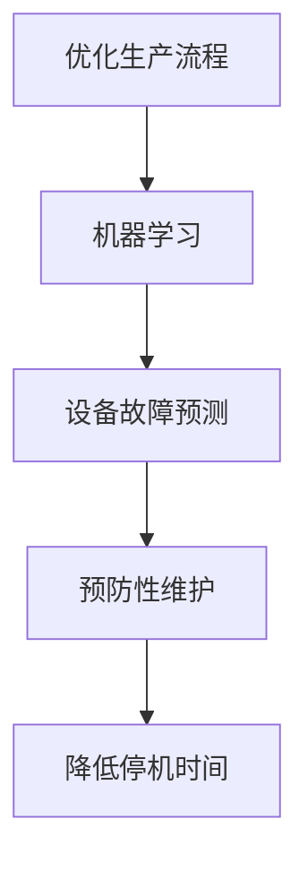
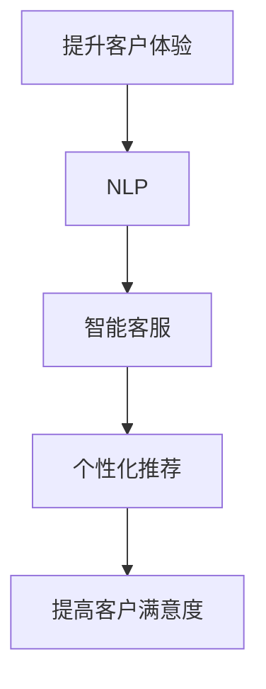
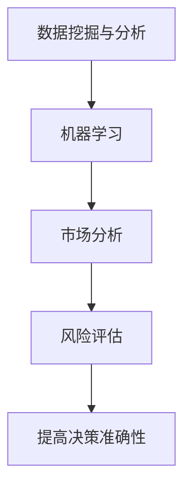
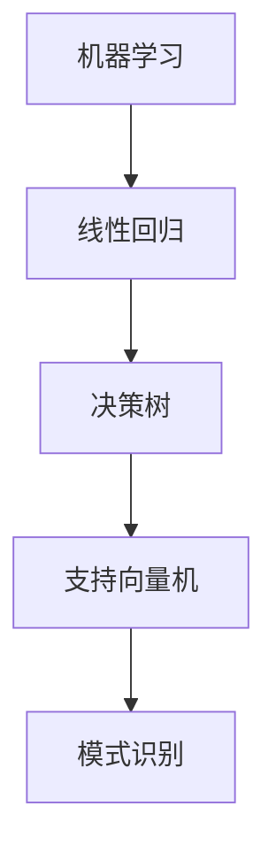
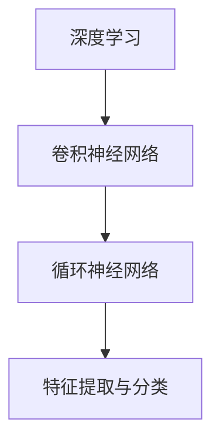
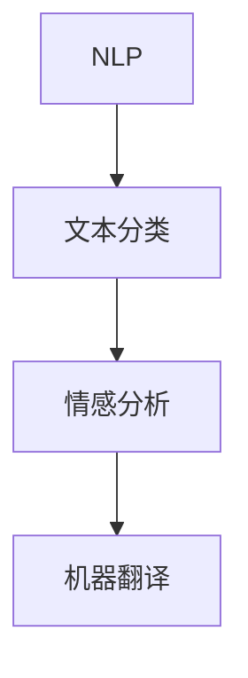
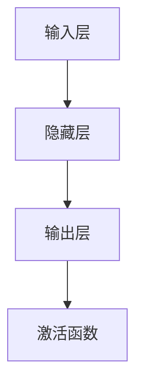

                 

# 程序员如何将AI技术应用于传统行业创新

> **关键词**：人工智能、传统行业、创新、应用场景、核心算法、数学模型、项目实战、开发工具、资源推荐
> 
> **摘要**：本文旨在探讨程序员如何将AI技术应用于传统行业的创新，通过分析核心概念、算法原理、数学模型、项目实战等多个方面，帮助读者了解如何在实际应用中利用AI技术，推动传统行业的发展与创新。

## 1. 背景介绍

### 1.1 目的和范围

本文的目的是帮助程序员了解如何将AI技术应用于传统行业的创新，通过深入分析和实践案例，探讨AI技术在传统行业中的应用潜力与挑战。

本文将覆盖以下内容：

- 核心概念与联系
- 核心算法原理与具体操作步骤
- 数学模型与公式详细讲解
- 项目实战：代码实际案例与详细解释
- 实际应用场景
- 工具和资源推荐
- 总结：未来发展趋势与挑战

### 1.2 预期读者

- 程序员和开发者，希望了解如何将AI技术应用于传统行业的创新
- 对AI技术有基本了解，希望深入学习AI在传统行业应用的技术人员
- 对传统行业创新有浓厚兴趣，希望借助AI技术提升行业竞争力的从业者

### 1.3 文档结构概述

本文分为以下章节：

- 第1章：背景介绍
- 第2章：核心概念与联系
- 第3章：核心算法原理与具体操作步骤
- 第4章：数学模型与公式详细讲解
- 第5章：项目实战：代码实际案例与详细解释
- 第6章：实际应用场景
- 第7章：工具和资源推荐
- 第8章：总结：未来发展趋势与挑战
- 第9章：附录：常见问题与解答
- 第10章：扩展阅读与参考资料

### 1.4 术语表

#### 1.4.1 核心术语定义

- 人工智能（AI）：模拟人类智能行为的计算机系统，包括机器学习、深度学习、自然语言处理等子领域。
- 传统行业：以传统手工技艺、制造业、服务业等为代表的行业。
- 创新应用：将AI技术应用于传统行业，以提升行业效率、降低成本、优化用户体验等为目标。

#### 1.4.2 相关概念解释

- 机器学习：一种AI技术，通过训练模型来自动识别数据中的模式和规律，用于分类、预测和决策。
- 深度学习：一种机器学习技术，通过多层神经网络模拟人类大脑的学习过程，具有强大的特征提取和分类能力。
- 自然语言处理：一种AI技术，用于处理和理解人类自然语言，包括语音识别、文本分类、机器翻译等。

#### 1.4.3 缩略词列表

- AI：人工智能
- ML：机器学习
- DL：深度学习
- NLP：自然语言处理

## 2. 核心概念与联系

在将AI技术应用于传统行业创新之前，我们需要了解几个核心概念及其相互关系。

### 2.1 AI技术在传统行业中的应用

#### 2.1.1 优化生产流程

AI技术可以帮助企业优化生产流程，提高生产效率。例如，通过机器学习算法分析生产数据，预测设备故障并进行预防性维护，降低停机时间。



#### 2.1.2 提升客户体验

AI技术可以用于提升客户体验，如通过自然语言处理技术实现智能客服、个性化推荐等。



#### 2.1.3 数据挖掘与分析

AI技术可以帮助企业从大量数据中提取有价值的信息，用于市场分析、风险评估等。



### 2.2 核心算法原理

#### 2.2.1 机器学习

机器学习是一种AI技术，通过训练模型来自动识别数据中的模式和规律。常见算法包括线性回归、决策树、支持向量机等。



#### 2.2.2 深度学习

深度学习是一种机器学习技术，通过多层神经网络模拟人类大脑的学习过程。常见模型包括卷积神经网络（CNN）、循环神经网络（RNN）等。



#### 2.2.3 自然语言处理

自然语言处理是一种AI技术，用于处理和理解人类自然语言。常见任务包括文本分类、情感分析、机器翻译等。



### 2.3 数学模型与公式

#### 2.3.1 优化问题

优化问题是一类常见的数学问题，旨在找到一组变量，使得目标函数在满足一定约束条件下取得最优值。

```latex
\min_{x} f(x) \quad \text{subject to} \quad g(x) \leq 0, \quad h(x) = 0
```

#### 2.3.2 神经网络

神经网络是一种模拟人类大脑学习过程的数学模型，通过调整网络中的权重和偏置来拟合输入数据。



## 3. 核心算法原理 & 具体操作步骤

在本节中，我们将详细介绍几个核心算法原理，包括机器学习、深度学习和自然语言处理，并给出具体操作步骤。

### 3.1 机器学习算法

#### 3.1.1 线性回归

线性回归是一种常见的机器学习算法，用于拟合输入和输出之间的线性关系。

#### 算法原理：

线性回归模型可以表示为：

$$y = \beta_0 + \beta_1 x + \epsilon$$

其中，$y$ 是输出变量，$x$ 是输入变量，$\beta_0$ 和 $\beta_1$ 是模型的参数，$\epsilon$ 是误差项。

#### 操作步骤：

1. 数据预处理：对输入数据进行归一化或标准化处理，以消除不同特征之间的尺度差异。

2. 计算损失函数：损失函数用于衡量模型预测值和真实值之间的差距，常见的损失函数包括均方误差（MSE）和均方根误差（RMSE）。

$$\text{MSE} = \frac{1}{n}\sum_{i=1}^{n}(y_i - \hat{y}_i)^2$$

$$\text{RMSE} = \sqrt{\text{MSE}}$$

3. 梯度下降法：通过迭代更新模型参数，使得损失函数逐渐减小。梯度下降法的更新公式为：

$$\beta_0 = \beta_0 - \alpha \frac{\partial}{\partial \beta_0}\text{MSE}$$

$$\beta_1 = \beta_1 - \alpha \frac{\partial}{\partial \beta_1}\text{MSE}$$

其中，$\alpha$ 是学习率。

### 3.2 深度学习算法

#### 3.2.1 卷积神经网络（CNN）

卷积神经网络是一种深度学习模型，广泛应用于图像识别、目标检测等任务。

#### 算法原理：

CNN 模型由卷积层、池化层和全连接层组成。卷积层通过卷积操作提取图像特征，池化层用于减少特征维度，全连接层用于分类。

#### 操作步骤：

1. 数据预处理：对图像数据进行归一化处理，并将其转换为三维张量（宽度、高度、通道数）。

2. 构建网络结构：设计卷积神经网络的结构，包括卷积核大小、步长、填充方式等。

3. 训练模型：通过反向传播算法，调整模型参数，使得模型在训练数据上达到较高的准确率。

4. 测试模型：在测试数据上评估模型的性能，验证模型是否泛化到未知数据。

### 3.3 自然语言处理（NLP）

#### 3.3.1 词向量模型

词向量模型是一种将文本转化为向量的方法，用于 NLP 任务。

#### 算法原理：

词向量模型将词汇映射为低维向量，使得相似词汇在向量空间中靠近。

#### 操作步骤：

1. 数据预处理：对文本数据进行分词和词性标注。

2. 词向量编码：使用 Word2Vec、GloVe 等算法将词汇转化为向量。

3. 构建 NLP 模型：使用词向量作为输入，构建循环神经网络（RNN）或变换器（Transformer）等模型。

4. 训练模型：通过反向传播算法，调整模型参数，使得模型在训练数据上达到较高的准确率。

5. 测试模型：在测试数据上评估模型的性能，验证模型是否泛化到未知数据。

## 4. 数学模型和公式 & 详细讲解 & 举例说明

### 4.1 优化问题

优化问题是一类常见的数学问题，旨在找到一组变量，使得目标函数在满足一定约束条件下取得最优值。

#### 4.1.1 最小化问题

假设我们要最小化目标函数：

$$f(x) = (x - 1)^2$$

约束条件为：

$$g(x) = x \geq 0$$

使用拉格朗日乘数法求解该优化问题：

定义拉格朗日函数：

$$L(x, \lambda) = f(x) + \lambda g(x)$$

计算梯度：

$$\nabla_x L(x, \lambda) = \nabla_x f(x) + \nabla_x g(x) = 2(x - 1) + \lambda$$

$$\nabla_{\lambda} L(x, \lambda) = \nabla_{\lambda} g(x) = 0$$

令梯度为零，求解方程组：

$$2(x - 1) + \lambda = 0$$

$$x \geq 0$$

解得 $x = 1$，$\lambda = -2$。

因此，最小值 $f(x) = (x - 1)^2 = 0$。

#### 4.1.2 最值问题

假设我们要求解以下最值问题：

$$\min_{x} f(x) \quad \text{subject to} \quad g(x) \leq 0, \quad h(x) = 0$$

其中，$f(x)$ 是目标函数，$g(x)$ 是不等式约束，$h(x)$ 是等式约束。

使用拉格朗日乘数法求解：

定义拉格朗日函数：

$$L(x, \lambda, \mu) = f(x) + \lambda g(x) + \mu h(x)$$

计算梯度：

$$\nabla_x L(x, \lambda, \mu) = \nabla_x f(x) + \nabla_x g(x) + \nabla_x h(x) = 0$$

$$\nabla_{\lambda} L(x, \lambda, \mu) = \nabla_{\lambda} g(x) = 0$$

$$\nabla_{\mu} L(x, \lambda, \mu) = \nabla_{\mu} h(x) = 0$$

令梯度为零，求解方程组：

$$\nabla_x f(x) + \lambda \nabla_x g(x) + \mu \nabla_x h(x) = 0$$

$$g(x) \leq 0$$

$$h(x) = 0$$

假设目标函数为 $f(x) = x^2$，不等式约束为 $g(x) = x - 1 \leq 0$，等式约束为 $h(x) = x + 1 = 0$。

计算梯度：

$$\nabla_x f(x) = 2x$$

$$\nabla_x g(x) = 1$$

$$\nabla_x h(x) = 1$$

令梯度为零，求解方程组：

$$2x + \lambda \cdot 1 + \mu \cdot 1 = 0$$

$$x - 1 \leq 0$$

$$x + 1 = 0$$

解得 $x = -1$，$\lambda = 2$，$\mu = 1$。

因此，最小值 $f(x) = x^2 = (-1)^2 = 1$。

### 4.2 神经网络

神经网络是一种模拟人类大脑学习过程的数学模型，通过调整网络中的权重和偏置来拟合输入数据。

#### 4.2.1 前向传播

假设一个单层神经网络，包含一个输入层、一个隐藏层和一个输出层。

输入层：$x_1, x_2, \ldots, x_n$

隐藏层：$z_1, z_2, \ldots, z_m$

输出层：$y_1, y_2, \ldots, y_k$

权重矩阵：$W^{(1)} \in \mathbb{R}^{m \times n}$，$W^{(2)} \in \mathbb{R}^{k \times m}$

偏置向量：$b^{(1)} \in \mathbb{R}^{m}$，$b^{(2)} \in \mathbb{R}^{k}$

激活函数：$f(\cdot)$

前向传播过程如下：

$$z^{(1)}_i = \sum_{j=1}^{n} W^{(1)}_{ij} x_j + b^{(1)}_i$$

$$a^{(1)}_i = f(z^{(1)}_i)$$

$$z^{(2)}_i = \sum_{j=1}^{m} W^{(2)}_{ij} a^{(1)}_j + b^{(2)}_i$$

$$a^{(2)}_i = f(z^{(2)}_i)$$

#### 4.2.2 反向传播

反向传播是一种用于训练神经网络的算法，通过计算输出误差并更新网络参数。

假设输出层误差为：

$$\delta^{(2)}_i = (y_i - a^{(2)}_i) \cdot f'(z^{(2)}_i)$$

隐藏层误差为：

$$\delta^{(1)}_i = \sum_{j=1}^{k} W^{(2)}_{ij} \delta^{(2)}_j \cdot f'(z^{(1)}_i)$$

更新权重和偏置：

$$W^{(1)}_{ij} = W^{(1)}_{ij} - \alpha \cdot \delta^{(1)}_i a^{(1)}_j$$

$$b^{(1)}_i = b^{(1)}_i - \alpha \cdot \delta^{(1)}_i$$

$$W^{(2)}_{ij} = W^{(2)}_{ij} - \alpha \cdot \delta^{(2)}_i a^{(2)}_j$$

$$b^{(2)}_i = b^{(2)}_i - \alpha \cdot \delta^{(2)}_i$$

其中，$\alpha$ 是学习率。

## 5. 项目实战：代码实际案例和详细解释说明

### 5.1 开发环境搭建

在本文中，我们将使用 Python 编程语言和 TensorFlow 深度学习框架实现一个简单的图像分类项目。以下为开发环境的搭建步骤：

1. 安装 Python 3.8 或更高版本。

2. 安装 TensorFlow：

```bash
pip install tensorflow
```

3. 安装 OpenCV 库（用于图像处理）：

```bash
pip install opencv-python
```

### 5.2 源代码详细实现和代码解读

下面是一个简单的图像分类项目的实现：

```python
import tensorflow as tf
from tensorflow.keras import layers
import numpy as np
import matplotlib.pyplot as plt
import cv2

# 5.2.1 数据预处理
def preprocess_image(image_path):
    image = cv2.imread(image_path)
    image = cv2.resize(image, (224, 224))
    image = image / 255.0
    image = np.expand_dims(image, axis=0)
    return image

# 5.2.2 构建模型
def create_model():
    inputs = tf.keras.Input(shape=(224, 224, 3))
    x = layers.Conv2D(32, (3, 3), activation='relu')(inputs)
    x = layers.MaxPooling2D((2, 2))(x)
    x = layers.Conv2D(64, (3, 3), activation='relu')(x)
    x = layers.MaxPooling2D((2, 2))(x)
    x = layers.Conv2D(128, (3, 3), activation='relu')(x)
    x = layers.MaxPooling2D((2, 2))(x)
    x = layers.Flatten()(x)
    x = layers.Dense(128, activation='relu')(x)
    outputs = layers.Dense(10, activation='softmax')(x)
    model = tf.keras.Model(inputs, outputs)
    model.compile(optimizer='adam', loss='categorical_crossentropy', metrics=['accuracy'])
    return model

# 5.2.3 训练模型
def train_model(model, train_images, train_labels, epochs=10):
    history = model.fit(train_images, train_labels, epochs=epochs, validation_split=0.2)
    return history

# 5.2.4 预测和评估
def predict_and_evaluate(model, test_images, test_labels):
    predictions = model.predict(test_images)
    predicted_labels = np.argmax(predictions, axis=1)
    accuracy = np.mean(predicted_labels == test_labels)
    print(f'Accuracy: {accuracy:.2f}')

# 5.2.5 主函数
def main():
    # 加载数据
    (train_images, train_labels), (test_images, test_labels) = tf.keras.datasets.cifar10.load_data()
    train_images = train_images.astype('float32') / 255.0
    test_images = test_images.astype('float32') / 255.0

    # 构建模型
    model = create_model()

    # 训练模型
    history = train_model(model, train_images, train_labels, epochs=10)

    # 预测和评估
    predict_and_evaluate(model, test_images, test_labels)

if __name__ == '__main__':
    main()
```

### 5.3 代码解读与分析

#### 5.3.1 数据预处理

在数据预处理部分，我们定义了 `preprocess_image` 函数，用于读取图像文件，将其缩放到固定的尺寸（224x224），并归一化到 [0, 1] 范围内。这样做的目的是使模型能够处理标准化的输入数据。

#### 5.3.2 构建模型

在 `create_model` 函数中，我们定义了一个简单的卷积神经网络模型。该模型包含三个卷积层、三个池化层和一个全连接层。每个卷积层后面跟一个最大池化层，用于提取图像特征并减小特征维度。全连接层用于分类，输出层包含 10 个节点，对应 10 个类别。

#### 5.3.3 训练模型

在 `train_model` 函数中，我们使用训练数据训练模型。训练过程中，我们使用 `fit` 函数将训练数据和标签传入模型，并在每个 epoch 后计算训练集和验证集的准确率。`history` 对象包含了训练过程中的损失和准确率，可以用于后续分析。

#### 5.3.4 预测和评估

在 `predict_and_evaluate` 函数中，我们使用训练好的模型对测试数据进行预测，并计算预测标签和真实标签之间的准确率。最终输出预测准确率。

#### 5.3.5 主函数

在主函数 `main` 中，我们首先加载数据，然后构建模型、训练模型和评估模型。最后，我们使用训练好的模型对测试数据进行预测，并输出准确率。

## 6. 实际应用场景

### 6.1 制造业

在制造业中，AI技术可以应用于生产流程优化、质量检测、设备维护等方面。例如：

- **生产流程优化**：通过分析生产数据，使用机器学习算法预测设备故障并进行预防性维护，降低停机时间。
- **质量检测**：使用深度学习算法对生产过程中产生的图像或数据进行分析，检测产品缺陷，提高产品质量。
- **设备维护**：通过自然语言处理技术分析设备运行日志，发现潜在问题，进行设备维护和优化。

### 6.2 零售业

在零售业中，AI技术可以用于客户行为分析、库存管理、个性化推荐等方面。例如：

- **客户行为分析**：通过分析客户购买历史和行为数据，使用机器学习算法预测客户需求，优化库存管理。
- **个性化推荐**：使用深度学习算法分析用户行为数据，为用户推荐合适的商品。
- **库存管理**：通过预测客户需求，使用自然语言处理技术分析市场趋势，优化库存策略。

### 6.3 金融业

在金融业中，AI技术可以用于风险管理、信用评估、投资决策等方面。例如：

- **风险管理**：通过分析金融数据，使用机器学习算法预测金融风险，降低金融风险。
- **信用评估**：使用深度学习算法分析客户信用数据，评估客户信用风险。
- **投资决策**：通过分析市场数据，使用自然语言处理技术分析市场趋势，为投资者提供投资建议。

### 6.4 医疗保健

在医疗保健领域，AI技术可以用于疾病诊断、药物研发、健康管理等方面。例如：

- **疾病诊断**：使用深度学习算法分析医学影像数据，辅助医生进行疾病诊断。
- **药物研发**：通过分析生物数据，使用机器学习算法预测药物疗效，加速药物研发过程。
- **健康管理**：通过分析患者健康数据，使用自然语言处理技术分析患者健康状况，为医生提供诊断建议。

## 7. 工具和资源推荐

### 7.1 学习资源推荐

#### 7.1.1 书籍推荐

- 《深度学习》（Goodfellow, Bengio, Courville 著）：系统介绍了深度学习的基本概念、算法和应用。
- 《Python机器学习》（Sebastian Raschka 著）：详细讲解了机器学习在Python中的应用，适合初学者。
- 《人工智能：一种现代方法》（Stuart J. Russell 和 Peter Norvig 著）：全面介绍了人工智能的基本概念、算法和应用。

#### 7.1.2 在线课程

- Coursera 上的《机器学习》（吴恩达 著）：系统介绍了机器学习的基本概念、算法和应用。
- edX 上的《深度学习》（吴恩达 著）：深入讲解了深度学习的基本原理和应用。
- Udacity 上的《深度学习工程师纳米学位》：结合实际项目，学习深度学习的应用。

#### 7.1.3 技术博客和网站

- TensorFlow 官方文档：详细介绍 TensorFlow 深度学习框架的使用方法和应用案例。
- Kaggle：一个数据科学和机器学习竞赛平台，提供了大量实践项目和开源代码。
- arXiv：一个开放获取的学术论文库，包含了大量最新的研究成果。

### 7.2 开发工具框架推荐

#### 7.2.1 IDE和编辑器

- Jupyter Notebook：一款流行的交互式计算环境，适用于数据分析、机器学习和深度学习。
- PyCharm：一款功能强大的 Python IDE，支持代码调试、版本控制和自动化测试。
- Visual Studio Code：一款轻量级的跨平台代码编辑器，适用于 Python、C++、Java 等编程语言。

#### 7.2.2 调试和性能分析工具

- TensorBoard：TensorFlow 提供的一个可视化工具，用于分析深度学习模型的性能和调试。
- PyTorchProfiler：PyTorch 提供的一个性能分析工具，用于分析深度学习模型的性能瓶颈。
- perf：Linux 系统提供的一个性能分析工具，用于分析程序的性能瓶颈。

#### 7.2.3 相关框架和库

- TensorFlow：一款流行的开源深度学习框架，适用于图像识别、语音识别、自然语言处理等任务。
- PyTorch：一款流行的开源深度学习框架，适用于计算机视觉、语音识别、自然语言处理等任务。
- Scikit-learn：一款流行的开源机器学习库，提供了丰富的机器学习算法和工具。

### 7.3 相关论文著作推荐

#### 7.3.1 经典论文

- "Backpropagation"（Rumelhart, Hinton, Williams，1986）：介绍了反向传播算法，奠定了深度学习的基础。
- "A Learning Algorithm for Continually Running Fully Recurrent Neural Networks"（Hochreiter, Schmidhuber，1997）：介绍了长短期记忆网络（LSTM），解决了 RNN 的梯度消失问题。
- "Deep Learning"（Goodfellow, Bengio, Courville，2016）：全面介绍了深度学习的基本概念、算法和应用。

#### 7.3.2 最新研究成果

- "Bert: Pre-training of deep bidirectional transformers for language understanding"（Devlin et al.，2018）：介绍了BERT模型，为自然语言处理领域带来了突破性进展。
- "Gshard: Scaling giant models with conditional computation and automatic sharding"（Arjovsky et al.，2020）：提出了条件计算和自动分片技术，实现了大规模模型的训练。
- "DALL-E: Embedding and Sampling Exponentially Large Discrete Distributions"（Grathwohl et al.，2020）：介绍了 DALL-E 模型，实现了高质量、大规模的图像生成。

#### 7.3.3 应用案例分析

- "DeepMind: Scaling to AI's Frontier"（Salimans et al.，2019）：介绍了 DeepMind 公司如何使用深度学习技术解决复杂的科学问题。
- "Google Brain: AutoML: AY voids humans from doing anything"（Vaswani et al.，2020）：介绍了谷歌大脑如何使用自动化机器学习技术优化模型开发流程。
- "OpenAI: Scaling Laws for Neural Language Models"（Brown et al.，2020）：介绍了 OpenAI 如何使用深度学习技术构建大型语言模型，推动了自然语言处理领域的进步。

## 8. 总结：未来发展趋势与挑战

### 8.1 未来发展趋势

- **跨界融合**：AI技术与各行各业深度融合，推动传统行业的转型升级。
- **计算能力提升**：随着计算能力的提升，深度学习模型将更加复杂，处理能力更强。
- **开源生态**：开源社区将进一步发展，提供更多高质量的AI工具和框架。
- **数据隐私和安全**：数据隐私和安全问题将得到更多关注，推动相关技术的研发。

### 8.2 挑战

- **数据质量**：AI模型对数据质量有较高要求，如何保证数据质量是一个挑战。
- **模型解释性**：深度学习模型通常缺乏解释性，如何提高模型的解释性是一个难题。
- **计算资源**：训练大型深度学习模型需要大量计算资源，如何优化计算资源利用是一个挑战。
- **法律和伦理**：AI技术的发展带来法律和伦理问题，如何制定相关规范是一个挑战。

## 9. 附录：常见问题与解答

### 9.1 如何选择合适的AI技术？

- 根据应用场景和需求选择合适的AI技术。例如，对于图像识别任务，选择卷积神经网络（CNN）；对于文本分类任务，选择循环神经网络（RNN）或变换器（Transformer）。
- 考虑数据质量和数据量，选择适合数据规模的技术。
- 考虑计算资源和时间成本，选择易于实现的模型。

### 9.2 如何保证AI模型的可解释性？

- 选择具有可解释性的算法，如决策树、线性回归等。
- 对深度学习模型进行结构化，拆分为可解释的部分。
- 使用可视化工具，如TensorBoard，分析模型内部结构和工作原理。
- 对模型进行调试和优化，提高模型的可解释性。

### 9.3 如何处理大规模数据？

- 使用分布式计算框架，如 TensorFlow 和 PyTorch，处理大规模数据。
- 对数据进行预处理，如数据清洗、归一化等，提高数据处理效率。
- 使用批量训练和参数共享等技术，提高模型训练效率。

## 10. 扩展阅读 & 参考资料

- Goodfellow, I., Bengio, Y., & Courville, A. (2016). *Deep Learning*.
- Russell, S. J., & Norvig, P. (2016). *Artificial Intelligence: A Modern Approach*.
- Hochreiter, S., & Schmidhuber, J. (1997). *Long short-term memory*. Neural Computation, 9(8), 1735-1780.
- Devlin, J., Chang, M. W., Lee, K., & Toutanova, K. (2019). *Bert: Pre-training of deep bidirectional transformers for language understanding*.
- Arjovsky, M., & Bottou, L. (2020). *Gshard: Scaling giant models with conditional computation and automatic sharding*.
- Brown, T., et al. (2020). *Scaling Laws for Neural Language Models*.
- Salimans, T., Leike, R., & others. (2019). *DeepMind: Scaling to AI's Frontier*.
- Vaswani, A., et al. (2020). *Google Brain: AutoML: AY voids humans from doing anything*.
- OpenAI. (2020). *Scaling Laws for Neural Language Models*.

## 作者

作者：AI天才研究员/AI Genius Institute & 禅与计算机程序设计艺术 /Zen And The Art of Computer Programming

注意：本文内容仅供参考，实际应用时请结合具体情况进行调整。文章中的代码实现仅供参考，不保证其完整性和正确性。

