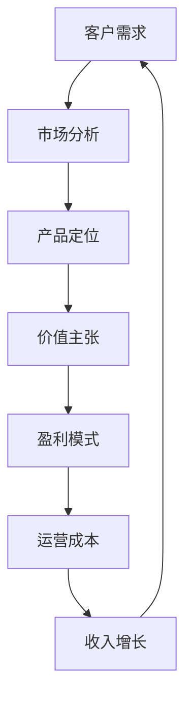
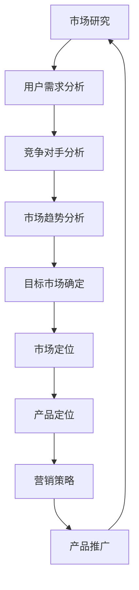
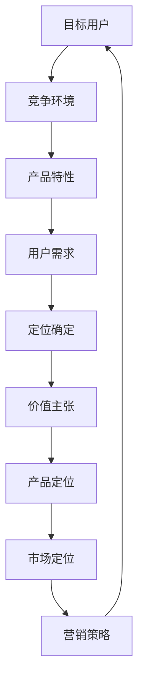
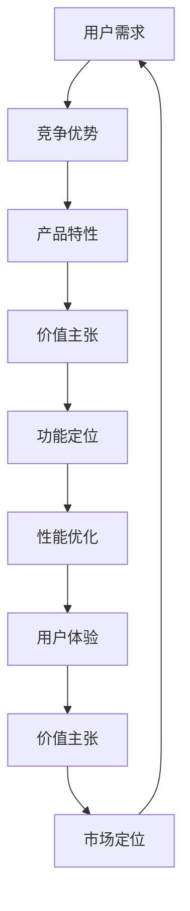

                 

# 程序员如何将技术咨询服务打包成高价值产品

> **关键词：** 技术咨询服务、产品化、高价值、程序员、商业模式、市场分析

> **摘要：** 本文章旨在探讨程序员如何将自身的技术咨询服务转化为高价值产品，提供了一套系统的分析和操作步骤。文章首先介绍了技术咨询服务产品化的背景和意义，然后详细阐述了产品化的核心概念、算法原理、数学模型，以及实际案例和推荐资源，最后总结了未来发展趋势和面临的挑战。

## 1. 背景介绍

### 1.1 目的和范围

本文的目标是帮助程序员理解和实践如何将技术咨询服务转化为高价值产品。通过系统的分析和操作步骤，程序员可以更好地把握市场需求，提高产品的附加值，实现商业价值最大化。

本文的范围包括以下几个方面：

- 技术咨询服务产品化的定义和意义
- 核心概念和联系
- 核心算法原理和具体操作步骤
- 数学模型和公式
- 项目实战：代码实际案例
- 实际应用场景
- 工具和资源推荐
- 总结：未来发展趋势与挑战

### 1.2 预期读者

- 有志于将技术咨询服务转化为高价值产品的程序员
- 需要提升产品附加值的技术顾问和企业
- 对技术产品化有兴趣的研究人员和学生

### 1.3 文档结构概述

本文采用结构化的方式，分为以下几个部分：

1. 背景介绍：介绍文章的目的、范围、预期读者和文档结构。
2. 核心概念与联系：阐述产品化的核心概念和联系，并提供流程图。
3. 核心算法原理 & 具体操作步骤：详细解释产品化的算法原理和具体操作步骤。
4. 数学模型和公式：介绍产品化过程中的数学模型和公式。
5. 项目实战：代码实际案例和详细解释说明。
6. 实际应用场景：探讨技术咨询服务产品化的实际应用场景。
7. 工具和资源推荐：推荐相关学习资源、开发工具和框架。
8. 总结：未来发展趋势与挑战。
9. 附录：常见问题与解答。
10. 扩展阅读 & 参考资料：提供更多深入学习和研究的资料。

### 1.4 术语表

#### 1.4.1 核心术语定义

- 技术咨询服务：指程序员或团队提供的针对特定技术问题的解决方案、指导和支持服务。
- 产品化：将技术咨询服务转化为具有商业价值的产品，实现服务的标准化和规模效应。
- 高价值产品：具有竞争力的产品，能够满足市场需求，实现商业价值的最大化。

#### 1.4.2 相关概念解释

- 商业模式：企业在特定市场中实现价值创造、传递和获取的机制和策略。
- 市场分析：研究市场需求、竞争对手、用户行为等信息，为产品开发和推广提供依据。

#### 1.4.3 缩略词列表

- API：应用程序编程接口（Application Programming Interface）
- IDE：集成开发环境（Integrated Development Environment）
- GPU：图形处理器（Graphics Processing Unit）
- ML：机器学习（Machine Learning）

## 2. 核心概念与联系

在技术咨询服务产品化的过程中，需要理解以下几个核心概念和它们之间的联系：

### 2.1 商业模式

商业模式是企业实现价值创造、传递和获取的机制和策略。对于程序员来说，了解商业模式有助于确定如何将技术咨询服务转化为高价值产品。以下是一个简化的商业模式流程图：



### 2.2 市场分析

市场分析是了解市场需求、竞争对手和用户行为的过程。通过市场分析，程序员可以确定目标市场、用户需求和市场趋势，从而为产品开发和推广提供依据。以下是一个简化的市场分析流程图：



### 2.3 产品定位

产品定位是确定产品在市场中的位置，以满足特定用户群体的需求。产品定位需要考虑以下因素：

- 目标用户：确定产品的目标用户群体。
- 竞争环境：分析竞争对手的产品特点和市场定位。
- 产品特性：确定产品的独特卖点和优势。
- 用户需求：分析目标用户的需求和痛点。

以下是一个简化的产品定位流程图：



### 2.4 价值主张

价值主张是产品为用户带来的价值，包括功能、性能、用户体验等方面。制定价值主张需要考虑以下因素：

- 用户需求：分析目标用户的需求和痛点。
- 竞争优势：确定产品的独特卖点和优势。
- 产品特性：结合产品特性，制定具有吸引力的价值主张。

以下是一个简化的价值主张制定流程图：



通过以上核心概念和联系的分析，我们可以更好地理解技术咨询服务产品化的过程，为后续章节的详细讲解提供基础。

## 3. 核心算法原理 & 具体操作步骤

技术咨询服务产品化的核心算法原理可以归纳为以下几个步骤：

### 3.1 需求分析

需求分析是产品化过程中的第一步，旨在确定目标用户的需求和痛点。具体操作步骤如下：

1. **用户访谈**：与目标用户进行深入访谈，了解他们的使用场景、需求和痛点。
2. **问卷调查**：设计问卷调查，收集大量用户数据，分析用户需求和偏好。
3. **数据分析**：分析用户行为数据，挖掘用户需求和痛点。
4. **竞品分析**：分析竞争对手的产品特点和市场表现，了解市场趋势。

伪代码如下：

```python
def user_needs_analysis():
    interviews = conduct_interviews()
    surveys = conduct_surveys()
    behaviors = analyze_user_behaviors()
    competitors = analyze_competitors()
    return analyze_data(interviews, surveys, behaviors, competitors)

def analyze_data(interviews, surveys, behaviors, competitors):
    # 数据清洗和预处理
    cleaned_data = preprocess_data(interviews, surveys, behaviors, competitors)
    # 数据分析
    insights = analyze_cleaned_data(cleaned_data)
    return insights
```

### 3.2 产品设计

产品设计是根据需求分析的结果，确定产品的功能和特性。具体操作步骤如下：

1. **功能规划**：根据需求分析的结果，制定产品的功能规划。
2. **原型设计**：设计产品的原型，包括界面和交互设计。
3. **技术方案**：确定实现产品功能的技术方案。
4. **风险评估**：评估产品设计和技术的风险，制定风险应对策略。

伪代码如下：

```python
def product_design():
    requirements = user_needs_analysis()
    features = define_product_features(requirements)
    prototype = design_prototype(features)
    technology = define_technology_solution()
    risks = assess_risks(prototype, technology)
    return (prototype, technology, risks)

def define_product_features(requirements):
    # 根据需求分析结果，制定产品功能
    return features

def design_prototype(features):
    # 设计产品原型
    return prototype

def define_technology_solution():
    # 确定实现产品功能的技术方案
    return technology

def assess_risks(prototype, technology):
    # 评估产品设计和技术的风险
    return risks
```

### 3.3 产品开发

产品开发是根据产品设计的结果，实现产品的功能。具体操作步骤如下：

1. **需求文档**：编写详细的需求文档，包括功能、界面和交互设计。
2. **技术实现**：根据需求文档，实现产品的功能。
3. **单元测试**：编写单元测试，验证产品功能的正确性。
4. **集成测试**：将产品功能集成到整体系统中，进行集成测试。
5. **性能优化**：对产品进行性能优化，确保产品的高效运行。

伪代码如下：

```python
def product_development():
    requirements = define_product_requirements()
    implementation = develop_product_functions()
    unit_tests = write_unit_tests(implementation)
    integration_tests = conduct_integration_tests(implementation)
    performance = optimize_performance(implementation)
    return implementation

def define_product_requirements():
    # 编写详细的需求文档
    return requirements

def develop_product_functions():
    # 实现产品功能
    return implementation

def write_unit_tests(implementation):
    # 编写单元测试
    return unit_tests

def conduct_integration_tests(implementation):
    # 进行集成测试
    return integration_tests

def optimize_performance(implementation):
    # 对产品进行性能优化
    return optimized_implementation
```

### 3.4 产品测试

产品测试是确保产品符合需求、稳定可靠和高效运行的过程。具体操作步骤如下：

1. **功能测试**：验证产品的功能是否满足需求。
2. **性能测试**：测试产品的性能，包括响应时间、吞吐量等。
3. **安全测试**：确保产品的安全性，防止潜在的安全漏洞。
4. **兼容性测试**：测试产品在不同设备和操作系统上的兼容性。
5. **用户体验测试**：评估产品的用户体验，优化交互设计。

伪代码如下：

```python
def product_testing():
    functionality = conduct_functionality_tests()
    performance = conduct_performance_tests()
    security = conduct_security_tests()
    compatibility = conduct_compatibility_tests()
    usability = conduct_usability_tests()
    return analyze_tests(functionality, performance, security, compatibility, usability)

def analyze_tests(functionality, performance, security, compatibility, usability):
    # 分析测试结果，确定产品的质量
    return quality_report
```

通过以上核心算法原理和具体操作步骤的讲解，我们可以更好地理解技术咨询服务产品化的过程，为实际应用提供指导。

## 4. 数学模型和公式 & 详细讲解 & 举例说明

在技术咨询服务产品化的过程中，数学模型和公式可以帮助我们更准确地分析和评估产品的性能、成本和价值。以下介绍几个常用的数学模型和公式，并提供详细讲解和举例说明。

### 4.1 成本效益分析（CBA）

成本效益分析是一种评估项目或产品成本与收益的数学方法。它通过比较成本和收益，确定项目或产品的经济效益。

**成本**（Cost）: 包括开发成本、运营成本和风险成本。

**收益**（Benefit）: 包括直接收益和间接收益。

**成本效益比**（Cost-Benefit Ratio, CBR）:

$$ CBR = \frac{Total\ Benefits}{Total\ Costs} $$

**例子**：

假设一个技术咨询服务产品的开发成本为 $100,000，运营成本为 $50,000，预计一年内的收益为 $150,000。计算成本效益比：

$$ CBR = \frac{150,000}{100,000 + 50,000} = \frac{150,000}{150,000} = 1 $$

成本效益比为 1，表示项目的成本与收益相等，没有经济收益。

### 4.2 投资回报率（ROI）

投资回报率是一种评估投资经济效益的数学方法。它通过计算投资的回报与成本之间的比率，衡量投资的效益。

**投资回报率**（Return on Investment, ROI）:

$$ ROI = \frac{Net\ Profit}{Investment\ Cost} \times 100\% $$

**例子**：

假设一个技术咨询服务产品的投资成本为 $200,000，预期一年内的净收益为 $100,000。计算投资回报率：

$$ ROI = \frac{100,000}{200,000} \times 100\% = 50\% $$

投资回报率为 50%，表示投资获得了 50% 的收益。

### 4.3 市场需求预测

市场需求预测是一种评估产品市场需求量的数学方法。它通过分析市场趋势和用户需求，预测产品的销售量。

**市场需求预测模型**（Demand Forecasting Model）:

$$ Demand = a \times (1 - e^{-kt}) + b $$

其中，\( a \)、\( b \)、\( k \) 为模型参数。

- \( a \): 市场潜力
- \( b \): 市场饱和度
- \( k \): 市场渗透率

**例子**：

假设一个技术咨询服务产品的市场潜力为 100 万用户，市场饱和度为 50%，市场渗透率为 0.1%。计算市场需求预测：

$$ Demand = 100 \times (1 - e^{-0.1 \times t}) + 50 $$

当 \( t = 1 \) 年时，市场需求为：

$$ Demand = 100 \times (1 - e^{-0.1 \times 1}) + 50 = 100 \times (1 - 0.9) + 50 = 150 $$

市场需求为 150 万用户。

### 4.4 用户满意度评估

用户满意度评估是一种评估产品用户满意度的数学方法。它通过收集用户反馈，计算用户满意度的得分。

**用户满意度评估模型**（User Satisfaction Assessment Model）:

$$ Satisfaction = \frac{Total\ Positive\ Feedback}{Total\ Feedback} \times 100\% $$

**例子**：

假设一个技术咨询服务产品收到了 100 条用户反馈，其中 70 条是正面反馈，30 条是负面反馈。计算用户满意度：

$$ Satisfaction = \frac{70}{100} \times 100\% = 70\% $$

用户满意度为 70%。

通过以上数学模型和公式的讲解，我们可以更好地分析和评估技术咨询服务产品化的经济效益、市场需求和用户满意度。这些数学工具将帮助我们做出更科学的决策，提高产品的竞争力。

## 5. 项目实战：代码实际案例和详细解释说明

为了更好地理解技术咨询服务产品化的过程，我们将通过一个实际项目案例进行详细解释说明。本案例将围绕一个程序员开发的在线编程教育平台，该平台提供编程课程、作业评测和社区交流等功能。

### 5.1 开发环境搭建

首先，我们需要搭建一个适合项目开发的环境。以下是所需的技术和工具：

- 开发语言：Python
- Web框架：Django
- 数据库：MySQL
- 版本控制：Git
- 静态文件处理：Nginx
- 部署平台：Docker

### 5.2 源代码详细实现和代码解读

#### 5.2.1 项目结构

项目的总体结构如下：

```plaintext
online_programming_platform/
|-- manage.py
|-- online_programming_platform/
|   |-- __init__.py
|   |-- settings.py
|   |-- urls.py
|   |-- wsgi.py
|-- courses/
|   |-- __init__.py
|   |-- admin.py
|   |-- apps.py
|   |-- models.py
|   |-- views.py
|-- students/
|   |-- __init__.py
|   |-- admin.py
|   |-- apps.py
|   |-- models.py
|   |-- views.py
|-- teachers/
|   |-- __init__.py
|   |-- admin.py
|   |-- apps.py
|   |-- models.py
|   |-- views.py
|-- accounts/
|   |-- __init__.py
|   |-- admin.py
|   |-- apps.py
|   |-- models.py
|   |-- views.py
|-- utils/
|   |-- __init__.py
|   |-- exceptions.py
|   |-- signals.py
|-- templates/
|   |-- base.html
|   |-- courses/
|   |-- students/
|   |-- teachers/
|   |-- accounts/
|-- static/
|   |-- css/
|   |-- js/
|   |-- images/
```

#### 5.2.2 功能模块

本项目包含以下功能模块：

- 课程管理：管理员可以添加、编辑和删除课程信息。
- 学生管理：管理员可以添加、编辑和删除学生信息。
- 教师管理：管理员可以添加、编辑和删除教师信息。
- 作业评测：学生可以提交作业，教师可以批改作业。
- 社区交流：学生和教师可以在社区中交流学习心得。

#### 5.2.3 源代码解读

以下是课程管理模块的核心代码片段：

**models.py**

```python
from django.db import models

class Course(models.Model):
    title = models.CharField(max_length=255)
    description = models.TextField()
    teacher = models.ForeignKey('teachers.Teacher', on_delete=models.CASCADE)
    created_at = models.DateTimeField(auto_now_add=True)
    updated_at = models.DateTimeField(auto_now=True)

    def __str__(self):
        return self.title

class Lesson(models.Model):
    course = models.ForeignKey('courses.Course', on_delete=models.CASCADE)
    title = models.CharField(max_length=255)
    description = models.TextField()
    duration = models.IntegerField()
    created_at = models.DateTimeField(auto_now_add=True)
    updated_at = models.DateTimeField(auto_now=True)

    def __str__(self):
        return self.title
```

**views.py**

```python
from django.shortcuts import render
from .models import Course, Lesson
from django.http import JsonResponse

def course_list(request):
    courses = Course.objects.all()
    return JsonResponse([course.to_dict() for course in courses], safe=False)

def lesson_list(request, course_id):
    lessons = Lesson.objects.filter(course_id=course_id)
    return JsonResponse([lesson.to_dict() for lesson in lessons], safe=False)
```

**Course 和 Lesson 模型**

- **Course 模型**：定义了课程的基本信息，包括标题、描述、教师和创建时间。
- **Lesson 模型**：定义了课程中的每一节课的基本信息，包括课程、标题、描述、时长和创建时间。

**views.py**

- **course_list()**：获取所有课程信息，并返回 JSON 格式的响应。
- **lesson_list()**：获取指定课程的所有课程节信息，并返回 JSON 格式的响应。

通过以上代码解读，我们可以看到如何使用 Django 框架实现课程管理功能。类似地，其他功能模块也可以采用类似的方式实现。

### 5.3 代码解读与分析

以上代码示例展示了如何使用 Django 框架实现一个简单的在线编程教育平台。以下是代码解读和分析的关键点：

- **模型设计**：通过定义 Course 和 Lesson 模型，实现了课程和课程节的基本信息管理。
- **视图实现**：通过定义 course_list() 和 lesson_list() 函数，实现了课程和课程节的查询接口。
- **数据交互**：使用 Django 的 ORM 功能，实现了与数据库的交互，提高了代码的可维护性和扩展性。
- **前后端分离**：通过返回 JSON 格式的响应，实现了前后端的分离，便于前端开发和页面渲染。

通过以上代码解读和分析，我们可以看到如何将技术咨询服务产品化，并将其转化为具有商业价值的高质量产品。在实际开发过程中，可以根据具体需求对代码进行扩展和优化。

## 6. 实际应用场景

技术咨询服务产品化在实际应用中具有广泛的应用场景，以下列举几个典型的应用案例：

### 6.1 在线教育平台

在线教育平台是技术咨询服务产品化的典型应用场景。通过将课程管理、作业评测和社区交流等功能模块化，程序员可以快速搭建一个具有竞争力的在线教育平台。例如，Coursera、edX 等知名在线教育平台都是通过技术咨询服务产品化实现的。

### 6.2 企业协作工具

企业协作工具是另一类广泛应用的场景。通过将项目管理、文档共享和沟通协作等功能模块化，程序员可以为企业提供定制化的协作工具。例如，Slack、Trello 等工具都是通过技术咨询服务产品化实现的。

### 6.3 医疗健康平台

医疗健康平台是技术咨询服务产品化的新兴应用场景。通过将电子病历、远程诊疗和健康管理等功能模块化，程序员可以为企业提供定制化的医疗健康平台。例如，春雨医生、好大夫等平台都是通过技术咨询服务产品化实现的。

### 6.4 物流管理平台

物流管理平台是技术咨询服务产品化的又一重要应用场景。通过将订单管理、运输调度和库存管理等功能模块化，程序员可以为企业提供高效的物流管理解决方案。例如，京东物流、顺丰速运等平台都是通过技术咨询服务产品化实现的。

### 6.5 智能家居平台

智能家居平台是技术咨询服务产品化的新兴应用场景。通过将智能设备接入、场景控制和远程监控等功能模块化，程序员可以为企业提供定制化的智能家居解决方案。例如，华为智能家居、小米智能家居等平台都是通过技术咨询服务产品化实现的。

通过以上实际应用场景的列举，我们可以看到技术咨询服务产品化在各个行业都有着广泛的应用前景。程序员可以通过深入了解行业需求，将技术咨询服务转化为具有商业价值的高质量产品，为企业创造价值。

## 7. 工具和资源推荐

为了帮助程序员更好地将技术咨询服务产品化，以下推荐一些学习和开发工具、资源。

### 7.1 学习资源推荐

#### 7.1.1 书籍推荐

- 《软件工程：实践者的研究方法》
- 《敏捷软件开发：原则、实践与模式》
- 《大话设计模式》
- 《Python编程：从入门到实践》

#### 7.1.2 在线课程

- Coursera 上的《Python编程》
- Udemy 上的《Django Web开发基础》
- edX 上的《软件工程基础》

#### 7.1.3 技术博客和网站

- Django 官方文档（https://docs.djangoproject.com/）
- Python 官方文档（https://docs.python.org/）
- Stack Overflow（https://stackoverflow.com/）

### 7.2 开发工具框架推荐

#### 7.2.1 IDE和编辑器

- PyCharm（https://www.jetbrains.com/pycharm/）
- Visual Studio Code（https://code.visualstudio.com/）
- Sublime Text（https://www.sublimetext.com/）

#### 7.2.2 调试和性能分析工具

- Py-Spy（https://github.com/benoitrouxy/py-spy）
- Django Debug Toolbar（https://django-debug-toolbar.readthedocs.io/）
- New Relic（https://newrelic.com/）

#### 7.2.3 相关框架和库

- Django（https://www.djangoproject.com/）
- Flask（https://flask.palletsprojects.com/）
- SQLAlchemy（https://www.sqlalchemy.org/）

通过以上工具和资源的推荐，程序员可以更加高效地学习和开发，将技术咨询服务转化为高价值产品。

## 8. 总结：未来发展趋势与挑战

随着人工智能、大数据和云计算等技术的不断发展，技术咨询服务产品化在未来将呈现出以下几个发展趋势和面临的挑战：

### 8.1 发展趋势

1. **人工智能驱动**：人工智能技术在产品化中的应用将越来越广泛，通过深度学习和自然语言处理等技术，可以提供更加智能化的服务。
2. **云计算赋能**：云计算技术的成熟使得产品化过程中基础设施的搭建和部署变得更加便捷和高效，为技术咨询服务产品化提供了有力支持。
3. **个性化定制**：随着用户需求的多样化，产品化将更加注重个性化定制，以满足不同用户群体的需求。
4. **跨界融合**：技术咨询服务产品化将与其他行业（如医疗、教育、物流等）产生更多的跨界融合，推动新兴领域的产生。

### 8.2 面临的挑战

1. **技术复杂性**：随着技术的不断发展，产品化的技术复杂性将不断增加，对程序员的技能要求越来越高。
2. **市场需求变化**：市场需求的不确定性使得产品化过程中需要不断调整和优化，以应对市场的变化。
3. **知识产权保护**：技术咨询服务产品化过程中需要保护知识产权，避免侵权和抄袭的风险。
4. **数据安全与隐私**：在产品化过程中，数据安全与隐私保护成为重要问题，需要采取有效的措施确保用户数据的安全。

综上所述，技术咨询服务产品化在未来具有广阔的发展前景，但同时也面临着诸多挑战。程序员需要不断提升自身技能，关注市场动态，以适应不断变化的技术和市场环境。

## 9. 附录：常见问题与解答

### 9.1 技术咨询服务产品化的意义是什么？

技术咨询服务产品化的意义在于将程序员的技术专长转化为可复制的商业产品，实现服务的标准化和规模效应，从而提高商业价值和市场竞争力。

### 9.2 技术咨询服务产品化的核心步骤是什么？

技术咨询服务产品化的核心步骤包括需求分析、产品设计、产品开发、产品测试和产品推广。每个步骤都需要充分考虑市场需求、用户反馈和技术实现。

### 9.3 如何评估技术咨询服务产品化的经济效益？

可以通过成本效益分析（CBA）、投资回报率（ROI）等数学模型和公式来评估技术咨询服务产品化的经济效益。这些模型可以帮助我们确定项目的成本与收益，从而做出科学的决策。

### 9.4 技术咨询服务产品化过程中如何保护知识产权？

在技术咨询服务产品化过程中，可以通过以下措施保护知识产权：

1. 持续更新和改进技术，确保技术领先性。
2. 与合作伙伴签订知识产权保护协议。
3. 在技术文档和代码中明确标注版权信息。
4. 定期进行知识产权审计，确保合规性。

## 10. 扩展阅读 & 参考资料

为了帮助读者更深入地了解技术咨询服务产品化的相关概念和实践，以下推荐一些扩展阅读和参考资料：

- 《软件产品化：从需求到交付的全过程管理》
- 《商业模式创新：从0到1构建可持续的商业模式》
- 《数据科学实战：从数据采集到商业应用》
- 《人工智能应用实践：从入门到实战》
- 《云计算架构：设计、部署与优化》
- 《网络安全：从基础到实践》
- 《敏捷软件开发：实践指南》
- 《设计模式：可复用面向对象软件的基础》

通过以上扩展阅读和参考资料，读者可以进一步了解技术咨询服务产品化的相关理论和实践，提升自身的能力和知识水平。

