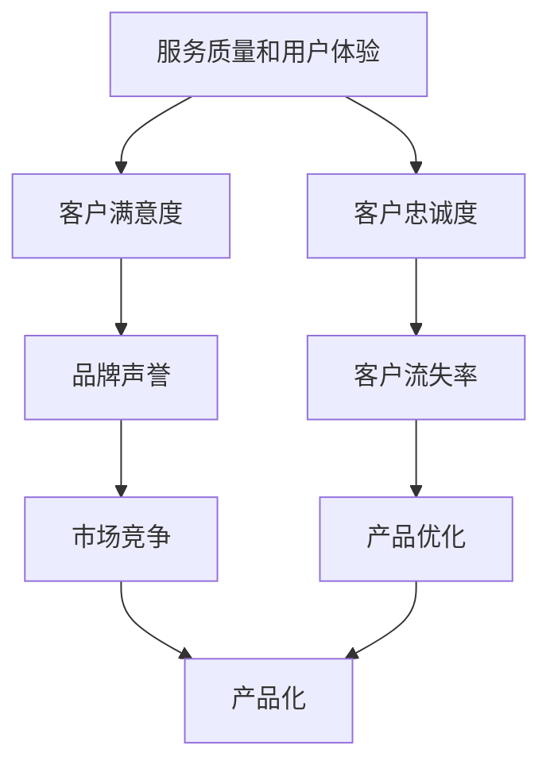
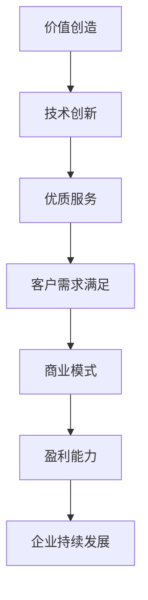
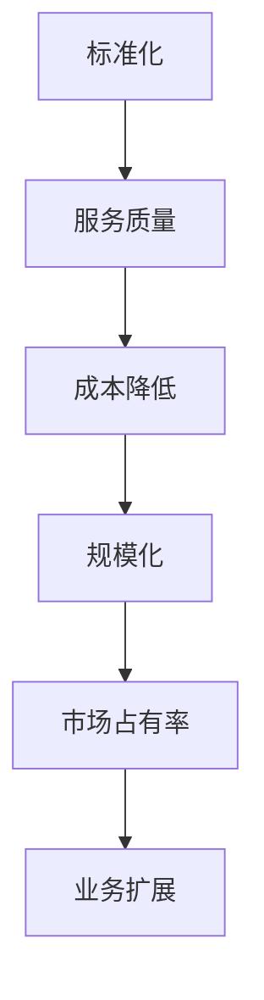
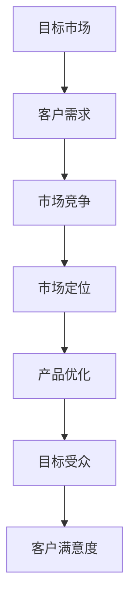

                 

# 程序员如何将技术咨询服务打造成高价值产品

## > {关键词：技术咨询服务、产品化、价值创造、市场定位、服务质量}

> {摘要：本文旨在探讨程序员如何将技术咨询服务转化为高价值产品，通过明确目标受众、优化服务流程、构建标准化解决方案以及不断提升服务质量，从而实现技术服务的商业化和规模化。文章从背景介绍、核心概念、算法原理、数学模型、项目实战、应用场景等多个角度，详细解析了将技术服务产品化的策略和实践，为程序员在技术咨询服务领域的发展提供有益的参考。}

## 1. 背景介绍

### 1.1 目的和范围

本文旨在帮助程序员理解如何将技术咨询服务转化为高价值产品。我们将讨论以下几个核心主题：

- 明确目标市场和受众
- 设计和实施标准化的服务流程
- 构建高质量的解决方案
- 优化服务质量和用户体验
- 实现技术服务的商业化和规模化

通过本文的阅读，读者将能够：

- 了解将技术服务产品化的意义
- 掌握将技术咨询服务转化为产品的步骤和方法
- 获得在技术咨询服务领域发展的实用策略和经验

### 1.2 预期读者

本文主要面向以下几类读者：

- 有志于将技术咨询服务产品化的程序员和创业者
- 担任技术咨询服务角色的IT专业人士
- 感兴趣于了解技术服务产品化实践的IT爱好者

### 1.3 文档结构概述

本文结构如下：

- 1. 背景介绍：介绍本文的目的、范围、预期读者和文档结构
- 2. 核心概念与联系：定义和阐述本文涉及的核心概念
- 3. 核心算法原理 & 具体操作步骤：详细讲解将技术咨询服务转化为产品的算法原理和操作步骤
- 4. 数学模型和公式 & 详细讲解 & 举例说明：介绍相关的数学模型和公式，并给出实际应用案例
- 5. 项目实战：通过实际代码案例展示技术咨询服务产品化的具体实现
- 6. 实际应用场景：探讨技术服务产品化的实际应用场景和效果
- 7. 工具和资源推荐：推荐学习资源和开发工具，帮助读者更好地理解和技术服务产品化实践
- 8. 总结：总结本文的主要观点，展望未来发展趋势与挑战
- 9. 附录：常见问题与解答，提供进一步的信息和帮助
- 10. 扩展阅读 & 参考资料：推荐相关文献和资料，供读者进一步学习参考

### 1.4 术语表

#### 1.4.1 核心术语定义

- 技术咨询服务：指IT专业人士或团队为其他企业或个人提供的关于软件开发、系统维护、性能优化等方面的服务。
- 产品化：将原本提供的服务或解决方案转化为标准化的产品，以便更高效地大规模推广和销售。
- 价值创造：通过提供高质量的服务和产品，满足客户需求，从而实现商业价值。
- 标准化：制定一套统一的标准和流程，确保服务或产品的质量和一致性。
- 市场定位：确定产品在市场上的定位和目标受众，以便更精准地满足客户需求。

#### 1.4.2 相关概念解释

- 服务质量：指客户对服务的主观满意度，包括服务的速度、可靠性、响应性、友好性等方面。
- 用户体验：用户在使用产品或服务过程中所感受到的整体感受和体验。
- 商业模式：指企业通过何种方式创造、传递和获取价值，实现盈利。

#### 1.4.3 缩略词列表

- IT：信息技术
- SEO：搜索引擎优化
- AI：人工智能
- BI：商业智能
- SaaS：软件即服务
- PaaS：平台即服务
- IaaS：基础设施即服务

## 2. 核心概念与联系

在将技术咨询服务转化为高价值产品的过程中，我们需要明确几个核心概念和它们之间的联系。

### 2.1. 服务质量和用户体验

服务质量和用户体验是技术咨询服务产品化的两个关键因素。高质量的服务能够提高客户的满意度，从而增强品牌声誉和市场竞争力。而良好的用户体验则能增加客户的忠诚度，降低客户流失率。

#### Mermaid 流程图：



### 2.2. 价值创造和商业模式

价值创造是产品化的核心驱动力。通过创新的技术和优质的服务，企业能够满足客户需求，实现商业价值。而商业模式则决定了企业如何创造、传递和获取价值。

#### Mermaid 流�程图：



### 2.3. 标准化和规模化

标准化和规模化是实现技术服务产品化的两个关键步骤。标准化有助于提高服务质量和一致性，降低成本。而规模化则能实现业务的快速扩展，提高市场占有率。

#### Mermaid 流程图：



### 2.4. 目标市场和受众

明确目标市场和受众是产品化成功的关键。通过深入了解目标客户的需求和痛点，企业能够更有针对性地提供产品和服务，提高市场竞争力。

#### Mermaid 流程图：



## 3. 核心算法原理 & 具体操作步骤

将技术咨询服务转化为高价值产品需要一套科学的算法原理和操作步骤。以下是具体的核心算法原理和操作步骤：

### 3.1. 服务流程设计

服务流程设计是产品化的第一步。我们需要根据客户需求和痛点，设计一套标准化的服务流程。

#### 算法原理：

- 客户需求分析
- 服务流程规划
- 服务流程实施
- 服务流程评估与优化

#### 操作步骤：

1. **客户需求分析**：通过问卷调查、访谈、市场调研等方式，深入了解客户的需求和痛点。
2. **服务流程规划**：根据客户需求，设计一套标准化的服务流程，包括服务内容、服务步骤、责任分配等。
3. **服务流程实施**：将设计好的服务流程付诸实践，确保服务的质量和一致性。
4. **服务流程评估与优化**：定期评估服务流程的效果，收集客户反馈，不断优化服务流程。

### 3.2. 服务质量监控

服务质量监控是确保产品化成功的重要环节。我们需要建立一套有效的服务质量监控体系，实时监测服务质量，及时发现问题并采取措施。

#### 算法原理：

- 服务质量指标设计
- 服务质量监测
- 服务质量评估
- 服务质量改进

#### 操作步骤：

1. **服务质量指标设计**：根据客户需求和行业标准，设计一套服务质量指标，包括服务速度、可靠性、响应性、友好性等。
2. **服务质量监测**：使用工具和技术，实时监测服务质量指标，发现问题并及时报告。
3. **服务质量评估**：定期评估服务质量，分析服务质量指标的变化趋势，找出潜在问题。
4. **服务质量改进**：根据评估结果，制定改进措施，持续优化服务质量。

### 3.3. 产品化策略

产品化策略是产品化成功的关键。我们需要根据市场需求和客户反馈，制定一套科学的产品化策略。

#### 算法原理：

- 市场需求分析
- 产品定位
- 产品设计
- 产品推广

#### 操作步骤：

1. **市场需求分析**：通过市场调研、竞争分析等方式，了解市场需求和趋势。
2. **产品定位**：根据市场需求，确定产品的定位和目标客户。
3. **产品设计**：根据产品定位，设计产品的功能和特性，满足客户需求。
4. **产品推广**：通过广告、促销、渠道建设等方式，推广产品，提高市场占有率。

### 3.4. 商业模式优化

商业模式优化是提高产品化成功率和盈利能力的关键。我们需要根据市场变化和客户需求，不断优化商业模式。

#### 算法原理：

- 商业模式评估
- 商业模式优化
- 商业模式创新

#### 操作步骤：

1. **商业模式评估**：定期评估现有商业模式的效果，分析盈利能力、市场份额等指标。
2. **商业模式优化**：根据评估结果，优化商业模式，提高盈利能力和市场竞争力。
3. **商业模式创新**：探索新的商业模式，应对市场变化和客户需求。

## 4. 数学模型和公式 & 详细讲解 & 举例说明

在将技术咨询服务转化为高价值产品的过程中，数学模型和公式能够帮助我们更好地理解和优化服务流程、质量和商业模式。以下是一些常用的数学模型和公式，并进行详细讲解和举例说明：

### 4.1. 服务质量模型

服务质量模型用于评估服务质量的各个方面。常用的服务质量模型有：

#### 1. 服务速度模型

服务速度模型用于评估服务的响应速度。公式如下：

\[ \text{服务速度} = \frac{\text{服务时长}}{\text{客户请求次数}} \]

**举例**：某技术咨询服务，在一个月内处理了100个客户请求，总耗时为1000小时。则服务速度为：

\[ \text{服务速度} = \frac{1000}{100} = 10 \text{小时/次} \]

#### 2. 服务可靠性模型

服务可靠性模型用于评估服务的稳定性和可靠性。公式如下：

\[ \text{服务可靠性} = \frac{\text{成功服务次数}}{\text{总服务次数}} \]

**举例**：某技术咨询服务，在一个月内共完成了100个服务项目，其中成功完成了90个，失败了10个。则服务可靠性为：

\[ \text{服务可靠性} = \frac{90}{100} = 0.9 \]

#### 3. 服务友好性模型

服务友好性模型用于评估服务的友好程度。公式如下：

\[ \text{服务友好性} = \frac{\text{客户满意度}}{\text{客户总人数}} \]

**举例**：某技术咨询服务，在一个季度内共服务了100名客户，其中90名客户表示满意，10名客户表示不满意。则服务友好性为：

\[ \text{服务友好性} = \frac{90}{100} = 0.9 \]

### 4.2. 商业模式模型

商业模式模型用于分析企业的盈利能力和市场竞争力。常用的商业模式模型有：

#### 1. 盈利能力模型

盈利能力模型用于评估企业的盈利能力。公式如下：

\[ \text{盈利能力} = \frac{\text{总收入}}{\text{总成本}} \]

**举例**：某技术咨询服务公司，在一个季度内实现了100万元的总收入，总成本为60万元。则盈利能力为：

\[ \text{盈利能力} = \frac{100}{60} = 1.67 \]

#### 2. 市场竞争力模型

市场竞争力模型用于评估企业在市场中的竞争力。公式如下：

\[ \text{市场竞争力} = \frac{\text{市场份额}}{\text{行业总市场份额}} \]

**举例**：某技术咨询服务公司，在一个市场中占据了20%的市场份额，该市场的总市场份额为100%。则市场竞争力为：

\[ \text{市场竞争力} = \frac{20}{100} = 0.2 \]

### 4.3. 用户体验模型

用户体验模型用于评估用户在使用产品或服务过程中的整体感受和体验。常用的用户体验模型有：

#### 1. 用户满意度模型

用户满意度模型用于评估用户的满意度。公式如下：

\[ \text{用户满意度} = \frac{\text{满意用户数}}{\text{总用户数}} \]

**举例**：某技术咨询服务公司，在一个季度内共服务了100名客户，其中80名客户表示满意，20名客户表示不满意。则用户满意度为：

\[ \text{用户满意度} = \frac{80}{100} = 0.8 \]

#### 2. 用户忠诚度模型

用户忠诚度模型用于评估用户的忠诚度。公式如下：

\[ \text{用户忠诚度} = \frac{\text{重复购买用户数}}{\text{总用户数}} \]

**举例**：某技术咨询服务公司，在一个季度内共服务了100名客户，其中40名客户表示愿意再次购买服务，60名客户表示不愿意。则用户忠诚度为：

\[ \text{用户忠诚度} = \frac{40}{100} = 0.4 \]

## 5. 项目实战：代码实际案例和详细解释说明

在本节中，我们将通过一个实际项目案例，展示如何将技术咨询服务转化为高价值产品。该项目是一个基于云计算的自动化运维平台，旨在帮助企业客户提高运维效率和降低成本。

### 5.1 开发环境搭建

为了实现该项目，我们首先需要搭建一个适合开发和部署的云计算环境。以下是搭建过程的简要步骤：

1. **选择云服务提供商**：我们选择阿里云作为云服务提供商。
2. **创建云账户**：在阿里云官网注册并创建云账户。
3. **配置云服务器**：购买云服务器，配置操作系统、网络和安全设置。
4. **安装开发工具**：在云服务器上安装开发所需的工具，如Java开发环境、数据库等。
5. **配置代码仓库**：使用Git等版本控制工具，配置代码仓库，便于团队协作开发。

### 5.2 源代码详细实现和代码解读

接下来，我们将介绍项目的主要功能模块和核心代码实现。

#### 5.2.1 功能模块设计

项目的主要功能模块包括：

1. **用户管理模块**：负责用户注册、登录、权限管理等。
2. **任务管理模块**：负责任务创建、调度、执行和监控。
3. **监控报警模块**：负责监控系统性能、资源使用情况，并实时发送报警通知。
4. **日志管理模块**：负责收集、存储和管理系统日志。
5. **报表统计模块**：负责生成系统运行报表，提供数据分析和可视化功能。

#### 5.2.2 用户管理模块

用户管理模块的核心代码实现如下：

```java
public class UserController {
  
  // 用户注册
  public void register(User user) {
    // 实现用户注册逻辑
  }
  
  // 用户登录
  public User login(String username, String password) {
    // 实现用户登录逻辑
    return user;
  }
  
  // 用户权限管理
  public void managePermissions(User user, List<String> permissions) {
    // 实现用户权限管理逻辑
  }
  
}
```

#### 5.2.3 任务管理模块

任务管理模块的核心代码实现如下：

```java
public class TaskController {
  
  // 创建任务
  public void createTask(Task task) {
    // 实现任务创建逻辑
  }
  
  // 调度任务
  public void scheduleTask(Task task) {
    // 实现任务调度逻辑
  }
  
  // 执行任务
  public void executeTask(Task task) {
    // 实现任务执行逻辑
  }
  
  // 监控任务
  public void monitorTask(Task task) {
    // 实现任务监控逻辑
  }
  
}
```

#### 5.2.4 监控报警模块

监控报警模块的核心代码实现如下：

```java
public class MonitorController {
  
  // 监控系统性能
  public void monitorPerformance(SystemPerformance performance) {
    // 实现系统性能监控逻辑
  }
  
  // 监控资源使用情况
  public void monitorResourceUsage(ResourceUsage usage) {
    // 实现资源使用情况监控逻辑
  }
  
  // 发送报警通知
  public void sendAlarmNotification(Alarm alarm) {
    // 实现报警通知逻辑
  }
  
}
```

#### 5.2.5 日志管理模块

日志管理模块的核心代码实现如下：

```java
public class LogController {
  
  // 收集系统日志
  public void collectSystemLogs(Log log) {
    // 实现系统日志收集逻辑
  }
  
  // 存储系统日志
  public void storeSystemLogs(Log log) {
    // 实现系统日志存储逻辑
  }
  
  // 管理系统日志
  public void manageSystemLogs(Log log) {
    // 实现系统日志管理逻辑
  }
  
}
```

#### 5.2.6 报表统计模块

报表统计模块的核心代码实现如下：

```java
public class ReportController {
  
  // 生成系统运行报表
  public Report generateSystemReport(Report report) {
    // 实现系统运行报表生成逻辑
    return report;
  }
  
  // 数据分析和可视化
  public void analyzeAndVisualizeData(Report report) {
    // 实现数据分析和可视化逻辑
  }
  
}
```

### 5.3 代码解读与分析

通过对上述代码的实现和分析，我们可以看到，项目的主要功能模块已经完成。下面是对各模块代码的简要解读：

1. **用户管理模块**：实现了用户注册、登录和权限管理等基本功能，为后续任务管理和监控报警模块提供了用户身份验证和权限管理的基础。
2. **任务管理模块**：实现了任务创建、调度、执行和监控等功能，是项目的核心模块，负责自动化运维的具体操作。
3. **监控报警模块**：实现了系统性能监控、资源使用监控和报警通知等功能，确保系统的稳定运行和及时预警。
4. **日志管理模块**：实现了系统日志的收集、存储和管理等功能，为系统运行分析和故障排查提供了重要依据。
5. **报表统计模块**：实现了系统运行报表的生成、数据分析和可视化等功能，为企业管理提供了关键数据支持。

通过以上代码实现和分析，我们可以看到，将技术咨询服务转化为高价值产品需要明确的功能模块划分和高效的核心代码实现。在实际项目中，还需要不断优化和迭代，以满足客户的需求和市场的变化。

## 6. 实际应用场景

将技术咨询服务转化为高价值产品在实际应用中具有广泛的应用场景，以下是一些典型的应用案例：

### 6.1. 企业内部运维服务

许多企业需要内部IT运维团队来确保业务的连续性和稳定性。通过将技术咨询服务产品化，企业可以将运维服务标准化、流程化，提高运维效率，降低运维成本。例如，企业可以开发一套内部运维管理平台，提供包括服务器监控、网络管理、安全防护等功能，实现一站式运维服务。

### 6.2. 咨询服务外包

许多中小企业由于规模和资源限制，无法建立完整的IT运维团队。通过将技术咨询服务产品化，企业可以将咨询服务外包给专业的第三方服务商。例如，提供云计算解决方案、大数据分析服务、网络安全评估等，帮助企业提升IT基础设施和管理水平。

### 6.3. 互联网平台服务

互联网公司通常需要提供多样化的技术支持服务，如API接口开发、系统性能优化、数据分析等。通过将技术咨询服务产品化，互联网公司可以搭建一个开放的技术服务平台，提供标准化、定制化的服务，满足不同客户的需求。

### 6.4. 专业培训和教育

技术咨询服务产品化还可以应用于专业培训和教育领域。例如，开发一系列在线课程或培训教材，针对不同层次的学员提供系统性的技术培训，帮助他们提升专业技能。

### 6.5. 顾问咨询服务

对于一些大型企业和组织，技术咨询服务往往涉及复杂的业务场景和战略规划。通过将咨询服务产品化，企业可以为不同客户提供针对性的顾问服务，帮助他们解决具体问题，实现业务目标。

### 6.6. 产业园区和孵化器

产业园区和孵化器通常为初创企业和小型企业提供一系列支持服务，包括技术支持、创业辅导、投融资等。通过将技术咨询服务产品化，这些园区和孵化器可以搭建一个综合服务平台，提供一站式服务，助力企业快速发展。

## 7. 工具和资源推荐

### 7.1 学习资源推荐

#### 7.1.1 书籍推荐

1. 《技术领导力：构建高效IT团队》
2. 《产品经理实战手册》
3. 《敏捷软件开发：实践指南》
4. 《精益创业：新商业思维的实践》
5. 《用户体验要素：搭建稳定的产品架构》

#### 7.1.2 在线课程

1. Coursera - 《产品经理入门与实践》
2. Udemy - 《程序员如何成为技术领导者》
3. edX - 《敏捷开发与Scrum实践》
4. LinkedIn Learning - 《数据驱动产品管理》
5. Pluralsight - 《云计算基础与实践》

#### 7.1.3 技术博客和网站

1. Medium - 《TechCrunch》
2. HackerRank - 《HackerRank Blog》
3. Stack Overflow - 《Stack Overflow Blog》
4. InfoQ - 《InfoQ中文站》
5. GitHub - 《GitHub Blog》

### 7.2 开发工具框架推荐

#### 7.2.1 IDE和编辑器

1. IntelliJ IDEA
2. Visual Studio Code
3. Eclipse
4. Sublime Text
5. Xcode

#### 7.2.2 调试和性能分析工具

1. JMeter
2. GitKraken
3. VisualVM
4. New Relic
5. Dynatrace

#### 7.2.3 相关框架和库

1. Spring Boot
2. React
3. Angular
4. Vue.js
5. TensorFlow
6. Keras
7. PyTorch

### 7.3 相关论文著作推荐

#### 7.3.1 经典论文

1. "The Mythical Man-Month" by Frederick P. Brooks Jr.
2. "Design Patterns: Elements of Reusable Object-Oriented Software" by Erich Gamma, Richard Helm, Ralph Johnson, and John Vlissides.
3. "Peopleware: Productive Projects and Teams" by Tom DeMarco and Timothy Lister.

#### 7.3.2 最新研究成果

1. "Principles of Secure Software Development" by Somesh Jha, Dennis Stutts, and Raghu Sistla.
2. "Deep Learning on Mobile Devices" by Kurt Keutzer, Shenghuo Li, and Zhifeng Chen.
3. "Blockchain: Blueprint for a New Economy" by Melanie Swan.

#### 7.3.3 应用案例分析

1. "Case Study: Netflix's Evolution to a Data-Driven Company" by John Hayes and Patrice Thibodeau.
2. "Case Study: Google's Scalable Infrastructure for Machine Learning" by Jeff Dean and Greg Corrado.
3. "Case Study: Airbnb's Data Science and Machine Learning" by Jeff Jordan and Jonathan Golden.

## 8. 总结：未来发展趋势与挑战

随着数字化转型的加速，技术咨询服务在市场上越来越受到重视。未来，技术服务产品化的趋势将继续加强，这将为程序员和IT企业带来巨大的发展机遇。然而，这一过程也面临诸多挑战：

### 8.1. 持续创新与技术迭代

技术服务产品化要求持续创新，以适应不断变化的市场需求和技术发展。程序员需要不断学习新技术、新理念，保持技术领先。

### 8.2. 质量控制与标准化

产品化的核心在于提供高质量的服务，这对服务质量控制和标准化提出了更高要求。企业需要建立一套完善的质量管理体系，确保服务的稳定性和一致性。

### 8.3. 用户体验优化

良好的用户体验是产品化的关键因素。程序员需要深入理解用户需求，优化服务流程和界面设计，提升用户体验。

### 8.4. 商业模式创新

产品化过程中，商业模式创新至关重要。企业需要根据市场需求和自身优势，探索多元化的商业模式，实现可持续发展。

### 8.5. 数据安全与隐私保护

随着数据价值的凸显，数据安全与隐私保护成为技术咨询服务的重要挑战。程序员需要关注数据安全法律法规，采取有效的保护措施。

### 8.6. 人才培养与团队建设

技术服务产品化离不开优秀的人才。企业需要注重人才培养，打造一支专业、高效、协作的团队。

总之，未来技术服务产品化将迎来更多机遇和挑战。程序员和IT企业需要不断创新、优化服务、提升质量，以在激烈的市场竞争中脱颖而出。

## 9. 附录：常见问题与解答

### 9.1. 什么是技术咨询服务？

技术咨询服务是指IT专业人士或团队为其他企业或个人提供的关于软件开发、系统维护、性能优化等方面的服务。

### 9.2. 技术服务产品化的目的是什么？

技术服务产品化的目的是将原本提供的服务或解决方案转化为标准化的产品，以便更高效地大规模推广和销售，从而实现商业化和规模化。

### 9.3. 如何设计服务流程？

设计服务流程的步骤包括：1）客户需求分析；2）服务流程规划；3）服务流程实施；4）服务流程评估与优化。

### 9.4. 服务质量如何监控？

服务质量监控的步骤包括：1）服务质量指标设计；2）服务质量监测；3）服务质量评估；4）服务质量改进。

### 9.5. 如何确定目标市场和受众？

确定目标市场和受众的步骤包括：1）市场需求分析；2）市场定位；3）产品优化；4）目标受众确定。

### 9.6. 如何优化商业模式？

优化商业模式的步骤包括：1）商业模式评估；2）商业模式优化；3）商业模式创新。

### 9.7. 数据安全与隐私保护的重要性是什么？

数据安全与隐私保护的重要性在于，随着数据价值的凸显，保护数据安全与隐私已成为企业可持续发展的关键。它关系到客户的信任、企业的声誉，甚至法律合规性问题。

## 10. 扩展阅读 & 参考资料

### 10.1. 相关书籍

1. 《技术领导力：构建高效IT团队》 - by Rod Boothby
2. 《产品经理实战手册》 - by Ken Norton
3. 《敏捷软件开发：实践指南》 - by Barry Boehm
4. 《精益创业：新商业思维的实践》 - by Eric Ries
5. 《用户体验要素：搭建稳定的产品架构》 - by Peter Morville 和 Louis Rosenfeld

### 10.2. 在线课程

1. Coursera - 《产品经理入门与实践》
2. Udemy - 《程序员如何成为技术领导者》
3. edX - 《敏捷开发与Scrum实践》
4. LinkedIn Learning - 《数据驱动产品管理》
5. Pluralsight - 《云计算基础与实践》

### 10.3. 技术博客和网站

1. Medium - 《TechCrunch》
2. HackerRank - 《HackerRank Blog》
3. Stack Overflow - 《Stack Overflow Blog》
4. InfoQ - 《InfoQ中文站》
5. GitHub - 《GitHub Blog》

### 10.4. 学术论文

1. "The Mythical Man-Month" by Frederick P. Brooks Jr.
2. "Design Patterns: Elements of Reusable Object-Oriented Software" by Erich Gamma, Richard Helm, Ralph Johnson, and John Vlissides.
3. "Peopleware: Productive Projects and Teams" by Tom DeMarco and Timothy Lister.

### 10.5. 最新研究成果

1. "Principles of Secure Software Development" by Somesh Jha, Dennis Stutts, and Raghu Sistla.
2. "Deep Learning on Mobile Devices" by Kurt Keutzer, Shenghuo Li, and Zhifeng Chen.
3. "Blockchain: Blueprint for a New Economy" by Melanie Swan.

### 10.6. 应用案例分析

1. "Case Study: Netflix's Evolution to a Data-Driven Company" by John Hayes and Patrice Thibodeau.
2. "Case Study: Google's Scalable Infrastructure for Machine Learning" by Jeff Dean and Greg Corrado.
3. "Case Study: Airbnb's Data Science and Machine Learning" by Jeff Jordan and Jonathan Golden.

---

**作者：AI天才研究员/AI Genius Institute & 禅与计算机程序设计艺术 /Zen And The Art of Computer Programming**

