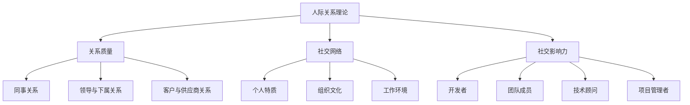

                 

# 程序员如何应对职场人际关系挑战

> 关键词：职场人际关系、沟通技巧、团队合作、冲突解决、自我提升、心理学、技能培训
> 
> 摘要：本文旨在帮助程序员在职场中更好地应对人际关系挑战。通过分析职场中的常见人际关系问题，提供实用的沟通技巧、团队合作方法、冲突解决策略，以及自我提升技巧，帮助程序员提升职场竞争力，实现个人和团队的成功。

## 1. 背景介绍

### 1.1 目的和范围

本文的目的在于探讨程序员在职场中面临的人际关系挑战，并提供一系列实用的策略和技巧，以帮助他们更好地应对这些挑战。本文的范围涵盖了职场中常见的几个人际关系问题，包括沟通障碍、团队合作困境、冲突解决和自我提升。

### 1.2 预期读者

本文预期读者为从事编程工作的程序员，特别是那些在人际关系方面遇到困难的从业者。此外，对于管理团队的技术领导或人力资源专业人士，本文的内容也具有一定的参考价值。

### 1.3 文档结构概述

本文的结构如下：

1. 背景介绍
    - 1.1 目的和范围
    - 1.2 预期读者
    - 1.3 文档结构概述
    - 1.4 术语表
2. 核心概念与联系
    - 2.1 人际关系理论
    - 2.2 职场中的程序员角色
    - 2.3 人际关系与程序员工作绩效的关系
3. 核心算法原理 & 具体操作步骤
    - 3.1 有效沟通技巧
    - 3.2 团队合作策略
    - 3.3 冲突解决方法
    - 3.4 自我提升技巧
4. 数学模型和公式 & 详细讲解 & 举例说明
    - 4.1 社交网络分析
    - 4.2 沟通模型
5. 项目实战：代码实际案例和详细解释说明
    - 5.1 开发环境搭建
    - 5.2 源代码详细实现和代码解读
    - 5.3 代码解读与分析
6. 实际应用场景
7. 工具和资源推荐
    - 7.1 学习资源推荐
    - 7.2 开发工具框架推荐
    - 7.3 相关论文著作推荐
8. 总结：未来发展趋势与挑战
9. 附录：常见问题与解答
10. 扩展阅读 & 参考资料

### 1.4 术语表

#### 1.4.1 核心术语定义

- 职场人际关系：指在职场环境中，人与人之间因工作需要而建立的关系。
- 沟通技巧：指有效传达和接收信息的能力。
- 团队合作：指团队成员为实现共同目标而协同工作的过程。
- 冲突解决：指通过策略和技巧解决职场中的矛盾和分歧。
- 自我提升：指个人通过学习和实践不断提高自身能力和素质。

#### 1.4.2 相关概念解释

- 社交网络分析：指研究个体和群体之间的互动关系，以揭示社交网络的特性。
- 沟通模型：指描述信息传递和接收过程的框架。

#### 1.4.3 缩略词列表

- IDE：集成开发环境（Integrated Development Environment）
- CV：简历（Curriculum Vitae）

## 2. 核心概念与联系

### 2.1 人际关系理论

人际关系理论是研究人类在社会环境中建立和维护关系的一门学科。对于程序员来说，了解人际关系理论有助于他们更好地理解职场中的人际互动，从而提高沟通和团队合作能力。

#### 2.1.1 基本概念

- 关系质量：指人际关系中的情感、信任和满意度水平。
- 社交网络：指个体之间相互联系的结构。
- 社交影响力：指个体通过社交网络影响他人行为的能力。

#### 2.1.2 关系类型

- 同事关系：指在同一组织中工作的个体之间的关系。
- 领导与下属关系：指上级与下属之间的一种权力关系。
- 客户与供应商关系：指不同组织之间的合作关系。

#### 2.1.3 关系影响因素

- 个人特质：如性格、价值观等。
- 组织文化：如企业文化、团队氛围等。
- 工作环境：如办公室布局、工作任务等。

### 2.2 职场中的程序员角色

程序员在职场中扮演着关键角色，他们需要与团队成员、领导和其他利益相关者进行有效沟通和合作。以下是程序员在职场中的几个重要角色：

- 开发者：负责编写、测试和部署软件代码。
- 团队成员：参与团队项目，与团队成员协作完成任务。
- 技术顾问：为团队提供技术指导和建议。
- 项目管理者：负责项目规划、进度跟踪和资源分配。

### 2.3 人际关系与程序员工作绩效的关系

人际关系对程序员的工作绩效具有重要影响。良好的人际关系有助于提高团队合作效率、减少冲突、提升工作满意度，从而提高整体绩效。以下是人际关系对程序员工作绩效的几个方面影响：

- 沟通：有效沟通有助于明确任务目标、减少误解、提高团队协作。
- 合作：团队合作有助于共同解决问题、提高创新能力和工作效率。
- 冲突解决：及时解决冲突有助于维护团队稳定、减少负面影响。
- 自我提升：持续学习和进步有助于提高个人能力和职业竞争力。

### 2.4 职场人际关系分析（Mermaid 流程图）



## 3. 核心算法原理 & 具体操作步骤

### 3.1 有效沟通技巧

#### 3.1.1 沟通模型

沟通模型描述了信息传递和接收的过程。以下是基本沟通模型：

1. 信息源：指发出信息的个体。
2. 信息编码：指将信息转化为可传递的形式。
3. 信道：指信息传递的路径。
4. 信息解码：指接收方解读信息。
5. 反馈：指接收方对信息的回应。

#### 3.1.2 沟通技巧

1. 倾听：倾听是有效沟通的关键。倾听不仅包括听取对方说话的内容，还要关注对方的情感和态度。
2. 表达清晰：使用简单、明确的语言表达自己的观点和需求，避免使用专业术语或复杂的句子结构。
3. 提问：提问有助于澄清问题和理解对方的观点，促进双向沟通。
4. 非语言沟通：注意身体语言、面部表情和语调等非语言因素，以增强沟通效果。

### 3.2 团队合作策略

#### 3.2.1 团队合作模型

团队合作模型描述了团队如何协同工作以实现共同目标。以下是基本团队合作模型：

1. 明确目标：团队目标应具体、可衡量，并得到所有成员的认同。
2. 分工合作：根据成员的能力和特长，合理分配任务。
3. 沟通协作：保持频繁的沟通和协作，确保任务进度和团队目标的实现。
4. 激励和支持：为团队成员提供激励和支持，鼓励他们充分发挥潜力。

#### 3.2.2 团队合作策略

1. 建立信任：通过诚实、透明和负责任的行动建立信任。
2. 角色定位：明确团队成员的角色和职责，确保每个人都知道自己的任务和期望。
3. 分享知识：鼓励团队成员分享知识和经验，提高团队整体能力。
4. 解决冲突：及时解决团队内部的冲突，避免影响团队合作。

### 3.3 冲突解决方法

#### 3.3.1 冲突解决模型

冲突解决模型描述了解决冲突的过程。以下是基本冲突解决模型：

1. 识别问题：明确冲突的原因和性质。
2. 分析原因：分析冲突背后的原因，包括个人、团队和组织因素。
3. 制定方案：提出解决方案，并评估其可行性和效果。
4. 实施方案：执行解决方案，并监控实施过程。
5. 反馈与调整：对解决方案进行评估和调整，以实现最佳效果。

#### 3.3.2 冲突解决技巧

1. 积极倾听：倾听对方的观点，理解他们的需求和期望。
2. 理解立场：站在对方的角度思考问题，尊重对方的立场和感受。
3. 寻求共识：寻找双方都能接受的解决方案，达成共识。
4. 调整期望：在必要时，调整自己的期望和需求，以实现双赢。

### 3.4 自我提升技巧

#### 3.4.1 自我提升模型

自我提升模型描述了个人如何通过学习和实践不断提高自己的能力。以下是基本自我提升模型：

1. 设定目标：明确自己的职业目标和提升方向。
2. 学习与成长：通过学习、培训和实际经验，不断提升自己的技能和知识。
3. 反思与总结：定期反思自己的工作和学习，总结经验教训。
4. 持续改进：根据反思和总结的结果，持续改进自己的工作方法和思维方式。

#### 3.4.2 自我提升技巧

1. 勇于尝试：不断尝试新的事物，拓宽自己的知识和技能。
2. 保持好奇心：对未知领域保持好奇，积极探索和了解。
3. 求助与合作：遇到问题时，勇于寻求帮助，与他人合作解决问题。
4. 自我激励：为自己设定目标和奖励，保持动力和激情。

## 4. 数学模型和公式 & 详细讲解 & 举例说明

### 4.1 社交网络分析

社交网络分析是一种研究个体之间互动关系的方法，可以帮助我们理解职场中的人际关系结构。以下是几种常见的社交网络分析模型和公式：

#### 4.1.1 度中心性

度中心性是一种衡量个体在社交网络中重要性的指标。公式如下：

$$
C_d = \frac{d(i)}{N-1}
$$

其中，$C_d$ 表示度中心性，$d(i)$ 表示个体 $i$ 的度（即与 $i$ 直接相连的其他个体的数量），$N$ 表示社交网络中的总个体数量。

#### 4.1.2 距离中心性

距离中心性是一种衡量个体在社交网络中影响范围的大小。公式如下：

$$
C_c = \sum_{i \neq j} \frac{d(i,j)}{N-1}
$$

其中，$C_c$ 表示距离中心性，$d(i,j)$ 表示个体 $i$ 和 $j$ 之间的距离（即两者之间的边数），$N$ 表示社交网络中的总个体数量。

#### 4.1.2 社交网络密度

社交网络密度是一种衡量社交网络紧密程度的指标。公式如下：

$$
\delta = \frac{E}{N(N-1)/2}
$$

其中，$\delta$ 表示社交网络密度，$E$ 表示社交网络中的边数，$N$ 表示社交网络中的总个体数量。

### 4.2 沟通模型

沟通模型描述了信息传递和接收的过程。以下是基本沟通模型：

1. 信息源：指发出信息的个体。
2. 信息编码：指将信息转化为可传递的形式。
3. 信道：指信息传递的路径。
4. 信息解码：指接收方解读信息。
5. 反馈：指接收方对信息的回应。

#### 4.2.1 信息传递效率

信息传递效率是一种衡量信息在信道中传递效果的指标。公式如下：

$$
\eta = \frac{P_r}{P_t}
$$

其中，$\eta$ 表示信息传递效率，$P_r$ 表示接收方接收到的信息量，$P_t$ 表示发送方发送的信息量。

#### 4.2.2 沟通距离

沟通距离是一种衡量信息传递过程中信息损失程度的指标。公式如下：

$$
D = 1 - \eta
$$

其中，$D$ 表示沟通距离，$\eta$ 表示信息传递效率。

### 4.3 举例说明

#### 4.3.1 社交网络分析

假设一个社交网络中有10个个体，其中5个个体直接相连，其他个体之间没有直接联系。使用度中心性和距离中心性分析该社交网络。

1. 度中心性：
   $$ C_d = \frac{d(i)}{N-1} = \frac{5}{10-1} = \frac{5}{9} \approx 0.556 $$
2. 距离中心性：
   $$ C_c = \sum_{i \neq j} \frac{d(i,j)}{N-1} = \frac{10-1}{9} = \frac{9}{9} = 1 $$

#### 4.3.2 沟通模型

假设信息源发送了100个信息，其中接收方接收到了80个信息。计算信息传递效率和沟通距离。

1. 信息传递效率：
   $$ \eta = \frac{P_r}{P_t} = \frac{80}{100} = 0.8 $$
2. 沟通距离：
   $$ D = 1 - \eta = 1 - 0.8 = 0.2 $$

## 5. 项目实战：代码实际案例和详细解释说明

### 5.1 开发环境搭建

为了更好地展示沟通技巧、团队合作策略、冲突解决方法和自我提升技巧在项目中的应用，我们将以一个简单的团队合作项目为例，介绍开发环境的搭建。

#### 5.1.1 工具和框架选择

- 编程语言：Python
- 版本控制工具：Git
- 集成开发环境（IDE）：PyCharm
- 代码质量检测工具：Pylint
- 团队协作工具：Trello

#### 5.1.2 开发环境配置

1. 安装Python：

```bash
# 在Windows上安装Python
winget install Python --accept-package-agreements --accept-license --force
# 在Linux上安装Python
sudo apt-get install python3
```

2. 安装PyCharm：

```bash
# 在Windows上安装PyCharm
jetbrains-toolbox
# 在Linux上安装PyCharm
sudo snap install pycharm-community --classic
```

3. 安装Git：

```bash
# 在Windows上安装Git
winget install Git --accept-package-agreements --accept-license --force
# 在Linux上安装Git
sudo apt-get install git
```

4. 安装Pylint：

```bash
# 在Windows和Linux上安装Pylint
pip install pylint
```

5. 初始化Git仓库：

```bash
# 初始化本地Git仓库
git init
# 将本地仓库与远程仓库关联
git remote add origin https://github.com/your-username/your-repo.git
# 将本地仓库推送到远程仓库
git push -u origin master
```

### 5.2 源代码详细实现和代码解读

#### 5.2.1 项目需求

假设我们的项目是一个简单的博客系统，功能包括：

- 文章发布
- 文章评论
- 用户注册与登录

#### 5.2.2 模块划分

根据项目需求，我们将博客系统划分为以下三个模块：

1. 用户模块
2. 文章模块
3. 评论模块

#### 5.2.3 用户模块

用户模块负责处理用户注册、登录和权限管理。以下是用户模块的伪代码：

```python
# 用户模块伪代码

# 用户注册
def register(username, password):
    # 校验用户名和密码是否符合要求
    # 存储用户信息到数据库
    pass

# 用户登录
def login(username, password):
    # 验证用户名和密码是否匹配
    # 返回用户信息
    pass

# 权限管理
def check_permission(user, action):
    # 检查用户是否有权限执行特定操作
    pass
```

#### 5.2.4 文章模块

文章模块负责处理文章的发布、修改和删除。以下是文章模块的伪代码：

```python
# 文章模块伪代码

# 发布文章
def publish_article(user, title, content):
    # 验证用户权限
    # 将文章信息存储到数据库
    pass

# 修改文章
def edit_article(user, article_id, title, content):
    # 验证用户权限
    # 更新文章信息
    pass

# 删除文章
def delete_article(user, article_id):
    # 验证用户权限
    # 删除文章信息
    pass
```

#### 5.2.5 评论模块

评论模块负责处理评论的发布、修改和删除。以下是评论模块的伪代码：

```python
# 评论模块伪代码

# 发布评论
def publish_comment(user, article_id, content):
    # 验证用户权限
    # 将评论信息存储到数据库
    pass

# 修改评论
def edit_comment(user, comment_id, content):
    # 验证用户权限
    # 更新评论信息
    pass

# 删除评论
def delete_comment(user, comment_id):
    # 验证用户权限
    # 删除评论信息
    pass
```

### 5.3 代码解读与分析

在项目实战中，我们使用了Python编程语言和一系列开发工具（如PyCharm、Git和Pylint）来搭建开发环境。代码实现遵循模块划分原则，每个模块都有明确的职责和功能。

#### 5.3.1 模块化设计

模块化设计有助于提高代码的可读性、可维护性和可扩展性。通过将功能划分为用户、文章和评论三个模块，我们可以更好地管理代码，避免代码冗长和混乱。

#### 5.3.2 功能实现

在用户模块中，我们实现了用户注册、登录和权限管理功能。通过调用数据库操作接口，我们可以方便地存储和查询用户信息，实现用户注册和登录功能。权限管理功能通过检查用户角色和操作权限，确保用户只能执行符合其角色的操作。

在文章模块中，我们实现了文章的发布、修改和删除功能。这些功能通过调用数据库接口，实现对文章信息的增删改查操作。文章发布功能需要验证用户权限，确保只有具有相应权限的用户才能发布文章。文章修改和删除功能也需要验证用户权限，确保用户只能修改或删除自己的文章。

在评论模块中，我们实现了评论的发布、修改和删除功能。这些功能与文章模块类似，通过调用数据库接口实现评论信息的增删改查操作。评论发布功能需要验证用户权限，确保用户只能发布符合规定的评论。评论修改和删除功能也需要验证用户权限，确保用户只能修改或删除自己的评论。

#### 5.3.3 代码质量

在代码实现过程中，我们使用了Pylint等代码质量检测工具，确保代码符合最佳实践。Pylint可以帮助我们识别潜在的错误、提高代码的可读性、确保代码的一致性。通过遵循代码质量标准，我们可以提高代码的可维护性和可扩展性。

## 6. 实际应用场景

在职场中，人际关系对程序员的职业发展和工作满意度具有重要影响。以下是几个实际应用场景，展示了人际关系技巧在程序员日常工作中的重要作用。

### 6.1 团队合作

在一个团队项目中，程序员需要与其他成员紧密合作，共同实现项目目标。良好的人际关系有助于提高团队合作效率，减少误解和冲突。以下是几个具体场景：

1. **沟通障碍**：程序员A在开发过程中遇到了技术难题，但由于沟通不畅，无法从团队成员B那里获得帮助。通过改善沟通技巧，例如主动提问和倾听，程序员A能够更快地解决问题。
2. **分工合作**：团队中程序员C和D对某项任务的分工存在分歧，导致任务进展缓慢。通过明确分工和沟通，双方达成共识，确保任务顺利进行。

### 6.2 领导与下属关系

作为团队的一员，程序员需要与领导保持良好的沟通，以便更好地理解工作目标和期望。以下是几个具体场景：

1. **任务分配**：程序员E被领导F分配了一个紧急任务，但由于未充分沟通任务要求和截止日期，导致任务进展不顺利。通过及时沟通和反馈，程序员E能够更好地完成任务。
2. **职业发展**：程序员G向领导H请教职业发展建议，但由于沟通不畅，未能获得有价值的建议。通过改善沟通技巧，例如主动表达需求和倾听，程序员G能够获得更好的职业发展指导。

### 6.3 冲突解决

在职场中，程序员不可避免地会遇到冲突。学会有效解决冲突是程序员职业素养的重要方面。以下是几个具体场景：

1. **意见分歧**：程序员I和J在项目需求上存在分歧，导致项目进展受阻。通过积极倾听和寻求共识，双方能够找到共同点，达成一致意见。
2. **工作压力**：程序员K因工作压力过大而情绪低落，与同事L产生冲突。通过沟通和鼓励，同事L能够帮助程序员K缓解压力，改善人际关系。

### 6.4 自我提升

程序员需要不断学习和进步，以适应快速变化的职场环境。以下是几个具体场景：

1. **知识分享**：程序员M在团队内部组织技术分享会，分享自己的经验和知识，提高团队整体技术水平。
2. **职业规划**：程序员N定期反思自己的工作，设定职业目标，并通过学习新技能和拓展人际关系，实现职业发展。

## 7. 工具和资源推荐

### 7.1 学习资源推荐

#### 7.1.1 书籍推荐

1. 《沟通的艺术》（The Art of Communication）
2. 《非暴力沟通》（Nonviolent Communication）
3. 《影响力》（Influence: The Psychology of Persuasion）
4. 《社交网络分析》（Social Network Analysis: Methods and Applications）

#### 7.1.2 在线课程

1. Coursera：提供各种人际关系和沟通技巧的课程，如“有效沟通”、“团队合作”等。
2. Udemy：提供丰富的职场技能培训课程，如“职场沟通技巧”、“冲突解决”等。

#### 7.1.3 技术博客和网站

1. Medium：有许多关于人际关系和职场技能的高质量博客文章。
2. HackerRank：提供编程挑战和职业发展相关内容。

### 7.2 开发工具框架推荐

#### 7.2.1 IDE和编辑器

1. PyCharm：适用于Python编程的集成开发环境。
2. Visual Studio Code：跨平台的代码编辑器，支持多种编程语言。

#### 7.2.2 调试和性能分析工具

1. Debugging Tools for Windows：适用于Windows平台的调试工具。
2. GDB：适用于Linux和Unix平台的调试工具。

#### 7.2.3 相关框架和库

1. Flask：Python Web开发框架。
2. Django：Python Web开发框架。
3. React：JavaScript前端框架。

### 7.3 相关论文著作推荐

#### 7.3.1 经典论文

1. "Social Network Analysis: Methods and Applications" by Paul R. Eichler.
2. "The Strength of Weak Ties" by Mark S. Granovetter.

#### 7.3.2 最新研究成果

1. "Human-AI Interaction in the Age of Automation" by Elena L. Simos and David R. Traum.
2. "Machine Learning in Human-Robot Interaction" by Wolfram Burgard and Dieter Fox.

#### 7.3.3 应用案例分析

1. "A Case Study of Social Network Analysis in a Large Software Development Company" by Paul A. B. W. Collins and Mark S. Granovetter.
2. "The Impact of Social Media on Job Search: A Multi-Country Study" by Debora M. Katz and Eitan M. Tal.

## 8. 总结：未来发展趋势与挑战

随着科技的不断发展，职场人际关系将在未来面临新的挑战和机遇。以下是几个可能的发展趋势和挑战：

### 8.1 发展趋势

1. **远程工作与数字化交流**：远程工作和数字化交流的普及将改变职场人际关系模式，程序员需要掌握更高效的沟通和协作技巧。
2. **人工智能与自动化**：人工智能和自动化的应用将提高工作效率，但可能导致人际关系的疏远，程序员需要适应新的工作环境。
3. **多样化与包容性**：职场中多样化和包容性的趋势将增加人际关系复杂性，程序员需要关注文化差异和包容性原则。

### 8.2 挑战

1. **技能更新与自我提升**：程序员需要不断更新技能，以适应快速变化的职场环境，这要求他们在自我提升方面投入更多的时间和精力。
2. **沟通障碍**：远程工作和数字化交流可能导致沟通障碍，程序员需要克服这些障碍，提高沟通效率。
3. **人际冲突**：多样化的团队可能面临更多人际冲突，程序员需要学会有效解决冲突，以维护团队和谐。

## 9. 附录：常见问题与解答

### 9.1 问题1：如何提升沟通技巧？

**解答**：要提升沟通技巧，可以从以下几个方面入手：

1. **倾听**：倾听是有效沟通的关键。在交流过程中，要专注于对方的话语，避免分心。
2. **表达清晰**：使用简单、明确的语言表达自己的观点和需求，避免使用专业术语或复杂的句子结构。
3. **提问**：提问有助于澄清问题和理解对方的观点，促进双向沟通。
4. **非语言沟通**：注意身体语言、面部表情和语调等非语言因素，以增强沟通效果。

### 9.2 问题2：如何处理职场冲突？

**解答**：处理职场冲突，可以采取以下策略：

1. **积极倾听**：倾听对方的观点，理解他们的需求和期望。
2. **理解立场**：站在对方的角度思考问题，尊重对方的立场和感受。
3. **寻求共识**：寻找双方都能接受的解决方案，达成共识。
4. **调整期望**：在必要时，调整自己的期望和需求，以实现双赢。

### 9.3 问题3：如何进行团队合作？

**解答**：进行团队合作，可以采取以下策略：

1. **明确目标**：确保团队目标具体、可衡量，并得到所有成员的认同。
2. **分工合作**：根据成员的能力和特长，合理分配任务。
3. **沟通协作**：保持频繁的沟通和协作，确保任务进度和团队目标的实现。
4. **激励和支持**：为团队成员提供激励和支持，鼓励他们充分发挥潜力。

## 10. 扩展阅读 & 参考资料

- 《程序员心理学》（Programmer Psychology），作者：John Y. Y. Tseng
- 《社交网络分析：方法与应用》（Social Network Analysis: Methods and Applications），作者：Paul R. Eichler
- 《非暴力沟通》（Nonviolent Communication），作者：Marshall B. Rosenberg
- 《影响力：说服的心理学》（Influence: The Psychology of Persuasion），作者：Robert B. Cialdini
- 《有效沟通》（Effective Communication），作者：Stephen R. Covey
- Coursera：https://www.coursera.org/
- Udemy：https://www.udemy.com/
- HackerRank：https://www.hackerrank.com/
- Medium：https://medium.com/
- PyCharm：https://www.jetbrains.com/pycharm/
- Visual Studio Code：https://code.visualstudio.com/
- Debugging Tools for Windows：https://docs.microsoft.com/en-us/windows-hardware/debugger/
- GDB：https://www.gnu.org/software/gdb/
- Flask：https://flask.palletsprojects.com/
- Django：https://www.djangoproject.com/
- React：https://reactjs.org/

### 作者

**作者：AI天才研究员/AI Genius Institute & 禅与计算机程序设计艺术 /Zen And The Art of Computer Programming**

