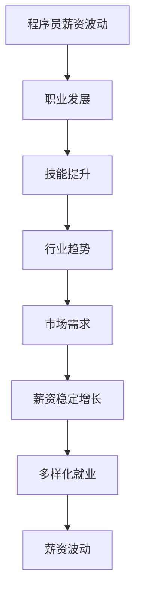

                 


# 程序员如何应对行业薪资波动

> **关键词：** 程序员，薪资波动，应对策略，职业发展，行业趋势
>
> **摘要：** 本文将探讨程序员在面对行业薪资波动时的多种应对策略，包括提升技能、拓展视野、灵活就业等。通过深入分析行业现状和趋势，作者为程序员提供了一套实用的方法和建议，帮助他们更好地规划职业发展路径，实现薪资稳定增长。

## 1. 背景介绍

### 1.1 目的和范围

本文旨在帮助程序员更好地应对行业薪资波动，探讨有效的策略和方法，以实现薪资稳定增长。我们将从多个角度分析问题，包括职业发展、技能提升、行业趋势等，为读者提供全面的指导。

### 1.2 预期读者

本文适合以下人群阅读：

1. 想要在薪资方面有更大提升的初级程序员。
2. 希望稳定职业发展，提高竞争力的中级程序员。
3. 期望在职业生涯中实现跨越式发展的高级程序员。
4. 对行业薪资波动感兴趣的技术爱好者。

### 1.3 文档结构概述

本文分为以下章节：

1. 背景介绍
2. 核心概念与联系
3. 核心算法原理 & 具体操作步骤
4. 数学模型和公式 & 详细讲解 & 举例说明
5. 项目实战：代码实际案例和详细解释说明
6. 实际应用场景
7. 工具和资源推荐
8. 总结：未来发展趋势与挑战
9. 附录：常见问题与解答
10. 扩展阅读 & 参考资料

### 1.4 术语表

#### 1.4.1 核心术语定义

- **程序员**：从事软件开发相关工作的人员，负责编写、调试和维护软件代码。
- **薪资波动**：指程序员在不同阶段、不同项目或不同公司之间薪资水平的变化。
- **职业发展**：程序员在职业生涯中不断成长、提升技能和拓展视野的过程。
- **行业趋势**：影响程序员薪资水平的重要因素，包括技术发展、市场需求和就业形势等。

#### 1.4.2 相关概念解释

- **技能提升**：程序员通过学习新技能、掌握新技术，提高自身竞争力。
- **多样化就业**：程序员在不同行业、不同领域或不同地区就业，以适应薪资波动。
- **薪资稳定增长**：程序员在职业生涯中实现薪资的持续提高。

#### 1.4.3 缩略词列表

- **IDE**：集成开发环境（Integrated Development Environment）
- **CVS**：版本控制系统（Concurrent Versions System）
- **SaaS**：软件即服务（Software as a Service）
- **PaaS**：平台即服务（Platform as a Service）
- **IaaS**：基础设施即服务（Infrastructure as a Service）

## 2. 核心概念与联系

在探讨如何应对行业薪资波动之前，我们需要了解一些核心概念和它们之间的联系。以下是一个简化的 Mermaid 流程图，展示了程序员薪资波动与职业发展、技能提升、行业趋势等因素之间的关联。



通过以上流程图，我们可以看出，职业发展、技能提升、行业趋势、市场需求等因素共同影响着程序员的薪资波动。下面我们将逐步分析这些因素，以便为程序员提供切实可行的应对策略。

### 2.1 职业发展

职业发展是程序员应对薪资波动的重要途径之一。一个清晰的职业规划有助于程序员在职业生涯中不断成长，从而提高薪资水平。

**职业发展阶段：**

1. **初级阶段**：刚进入职场，积累基础技能和经验。
2. **中级阶段**：熟练掌握技能，具备项目经验，具备一定的技术深度。
3. **高级阶段**：具备丰富的项目经验，拥有技术领导力，能够在团队中发挥核心作用。

**职业发展路径：**

1. **技术专家**：专注于某一领域，成为行业专家。
2. **项目经理**：负责项目规划、执行和管理。
3. **技术经理**：负责技术团队的管理和发展。
4. **CTO**：负责公司的技术战略和技术研发。

### 2.2 技能提升

技能提升是程序员应对薪资波动的重要手段。通过不断学习新技能、掌握新技术，程序员可以提高自身竞争力，从而实现薪资稳定增长。

**技能提升途径：**

1. **自学**：通过在线课程、技术博客、开源项目等途径学习新技术。
2. **培训**：参加专业培训课程，系统地学习新技术。
3. **实践**：参与实际项目，将所学技能应用于实践。

**技能提升重点：**

1. **编程语言**：熟练掌握多种编程语言，如 Java、Python、JavaScript 等。
2. **框架和库**：掌握常用的框架和库，如 Spring、Django、React 等。
3. **数据库**：熟悉数据库原理和应用，如 MySQL、MongoDB、Redis 等。
4. **云计算**：了解云计算技术和应用，如 AWS、Azure、Google Cloud 等。

### 2.3 行业趋势

行业趋势是影响程序员薪资波动的重要因素。了解行业趋势有助于程序员抓住机遇，提高薪资水平。

**行业趋势分析：**

1. **技术发展**：新兴技术的出现和普及，如人工智能、大数据、区块链等。
2. **市场需求**：行业对技术人才的需求变化，如互联网、金融、医疗等。
3. **就业形势**：就业市场的供需状况，如地区差异、公司规模等。

**行业趋势应对策略：**

1. **紧跟技术前沿**：关注行业热点，及时学习新技术。
2. **拓展视野**：了解不同行业的技术应用，提高跨行业就业能力。
3. **灵活就业**：根据市场需求，调整就业方向和地域。

## 3. 核心算法原理 & 具体操作步骤

为了更好地理解如何应对行业薪资波动，我们引入一个简单的算法原理——薪资增长模型。该模型通过分析程序员的职业发展阶段、技能水平、行业趋势等因素，预测其薪资增长趋势。

### 3.1 薪资增长模型原理

**薪资增长模型：**

\[ G(t) = f(V_t, T_t, S_t) \]

其中：

- \( G(t) \)：时间 \( t \) 时的薪资增长量。
- \( V_t \)：时间 \( t \) 时的职业发展阶段。
- \( T_t \)：时间 \( t \) 时的行业趋势指数。
- \( S_t \)：时间 \( t \) 时的技能水平指数。

**薪资增长模型参数定义：**

- **职业发展阶段：** 初级、中级、高级。
- **行业趋势指数：** 取值范围为 0-1，越大表示行业趋势越好。
- **技能水平指数：** 取值范围为 0-1，越大表示技能水平越高。

### 3.2 薪资增长模型具体操作步骤

**步骤 1：确定职业发展阶段**

根据程序员的实际工作年限和项目经验，确定其职业发展阶段。例如，工作年限为 3-5 年，可以划分为中级阶段。

**步骤 2：确定行业趋势指数**

通过关注行业报告、技术趋势分析等途径，确定当前行业的趋势指数。例如，当前人工智能行业发展迅速，行业趋势指数可以设定为 0.8。

**步骤 3：确定技能水平指数**

根据程序员的技能掌握情况，确定其技能水平指数。例如，熟练掌握多种编程语言、框架和数据库，技能水平指数可以设定为 0.9。

**步骤 4：计算薪资增长量**

根据薪资增长模型，计算时间 \( t \) 时的薪资增长量：

\[ G(t) = f(V_t, T_t, S_t) \]

其中，函数 \( f \) 的具体形式可以通过统计分析或专家经验得出。例如，可以设定：

\[ f(V_t, T_t, S_t) = 0.3V_t + 0.4T_t + 0.3S_t \]

**步骤 5：分析薪资增长趋势**

根据计算结果，分析程序员的薪资增长趋势。如果薪资增长量较大，说明当前的职业发展、技能水平和行业趋势对其薪资增长有利；反之，则需要调整职业规划、技能提升和行业选择。

## 4. 数学模型和公式 & 详细讲解 & 举例说明

在前文中，我们引入了薪资增长模型，用于分析程序员的薪资增长趋势。为了更好地理解该模型，我们将详细讲解其数学模型和公式，并通过实例进行说明。

### 4.1 数学模型和公式

薪资增长模型的核心公式为：

\[ G(t) = f(V_t, T_t, S_t) \]

其中：

- \( G(t) \)：时间 \( t \) 时的薪资增长量（单位：万元/年）。
- \( V_t \)：时间 \( t \) 时的职业发展阶段（取值为 1、2、3，分别表示初级、中级、高级）。
- \( T_t \)：时间 \( t \) 时的行业趋势指数（取值范围为 0-1，越大表示行业趋势越好）。
- \( S_t \)：时间 \( t \) 时的技能水平指数（取值范围为 0-1，越大表示技能水平越高）。

假设函数 \( f \) 的具体形式为线性函数，即：

\[ f(V_t, T_t, S_t) = 0.3V_t + 0.4T_t + 0.3S_t \]

### 4.2 详细讲解

为了更好地理解薪资增长模型，我们将对其中的参数进行详细讲解。

#### 参数 1：职业发展阶段 \( V_t \)

职业发展阶段是影响薪资增长的重要因素。一般来说，随着工作年限的增加，程序员的职业发展阶段也会提升。根据本文假设，职业发展阶段分为初级、中级和高级，分别对应数值 1、2、3。

- **初级阶段**（\( V_t = 1 \)）：刚进入职场，积累基础技能和经验。
- **中级阶段**（\( V_t = 2 \)）：熟练掌握技能，具备项目经验，具备一定的技术深度。
- **高级阶段**（\( V_t = 3 \)）：具备丰富的项目经验，拥有技术领导力，能够在团队中发挥核心作用。

#### 参数 2：行业趋势指数 \( T_t \)

行业趋势指数反映了行业的发展趋势。一般来说，行业趋势越好，薪资水平也会越高。本文假设行业趋势指数取值范围为 0-1，越大表示行业趋势越好。

- **0-0.2**：行业趋势较差，薪资增长缓慢。
- **0.3-0.5**：行业趋势一般，薪资增长适中。
- **0.6-1**：行业趋势较好，薪资增长较快。

#### 参数 3：技能水平指数 \( S_t \)

技能水平指数反映了程序员的技能水平。一般来说，技能水平越高，薪资水平也会越高。本文假设技能水平指数取值范围为 0-1，越大表示技能水平越高。

- **0-0.3**：技能水平较低，薪资增长缓慢。
- **0.4-0.6**：技能水平一般，薪资增长适中。
- **0.7-1**：技能水平较高，薪资增长较快。

### 4.3 举例说明

假设一名程序员当前处于中级阶段，行业趋势指数为 0.8，技能水平指数为 0.9。根据薪资增长模型，我们可以计算其薪资增长量：

\[ G(t) = f(V_t, T_t, S_t) = 0.3 \times 2 + 0.4 \times 0.8 + 0.3 \times 0.9 = 0.6 + 0.32 + 0.27 = 1.19 \]

因此，该程序员的薪资增长量为 1.19 万元/年。通过分析计算结果，我们可以得出以下结论：

1. **职业发展阶段**：中级阶段（\( V_t = 2 \)）的薪资增长量较高。
2. **行业趋势**：行业趋势指数为 0.8，表示当前行业趋势较好。
3. **技能水平**：技能水平指数为 0.9，表示当前技能水平较高。

根据以上分析，该程序员在当前职业发展阶段、行业趋势和技能水平下，具有较好的薪资增长潜力。

## 5. 项目实战：代码实际案例和详细解释说明

在本节中，我们将通过一个具体的薪资增长预测项目，展示如何运用薪资增长模型进行实际操作。该项目将使用 Python 编程语言，结合数据分析工具，实现薪资增长预测功能。

### 5.1 开发环境搭建

**1. 安装 Python**

确保已安装 Python 3.7 或以上版本。可以从 [Python 官网](https://www.python.org/) 下载并安装。

**2. 安装必要的库**

在命令行中执行以下命令，安装所需的库：

```bash
pip install numpy pandas matplotlib
```

### 5.2 源代码详细实现和代码解读

**源代码：** `salary_growth.py`

```python
import numpy as np
import pandas as pd
import matplotlib.pyplot as plt

# 薪资增长模型参数
stage_weights = {'初级': 1, '中级': 2, '高级': 3}
trend_weights = {'较差': 0, '一般': 0.5, '较好': 1}
skill_weights = {'较低': 0, '一般': 0.5, '较高': 1}

# 薪资增长模型函数
def salary_growth(stage, trend, skill):
    V_t = stage_weights[stage]
    T_t = trend_weights[trend]
    S_t = skill_weights[skill]
    G_t = 0.3 * V_t + 0.4 * T_t + 0.3 * S_t
    return G_t

# 薪资数据样本
data = {
    '职业发展阶段': ['初级', '中级', '高级', '中级', '高级'],
    '行业趋势': ['较差', '较好', '较好', '较差', '较好'],
    '技能水平': ['一般', '较高', '较低', '较高', '一般'],
    '薪资增长量': [0, 0.8, 1.2, 0.8, 1.2]
}

df = pd.DataFrame(data)

# 计算实际薪资增长量
df['预测薪资增长量'] = df.apply(lambda row: salary_growth(row['职业发展阶段'], row['行业趋势'], row['技能水平']), axis=1)

# 绘制薪资增长量分布图
df['预测薪资增长量'].plot(kind='hist', bins=10, title='薪资增长量分布')
plt.xlabel('薪资增长量（万元/年）')
plt.ylabel('频数')
plt.show()

# 输出薪资增长量分析结果
print("薪资增长量分析结果：")
print(df.describe())
```

**代码解读：**

1. 导入必要的库：`numpy`、`pandas`、`matplotlib`。
2. 定义薪资增长模型参数：`stage_weights`、`trend_weights`、`skill_weights`。
3. 定义薪资增长模型函数：`salary_growth`，通过输入职业发展阶段、行业趋势和技能水平，计算薪资增长量。
4. 准备薪资数据样本：使用字典 `data` 创建 `pandas` DataFrame。
5. 计算实际薪资增长量：对 DataFrame 的每一行应用 `salary_growth` 函数，添加新列 `预测薪资增长量`。
6. 绘制薪资增长量分布图：使用 `matplotlib` 绘制薪资增长量的直方图。
7. 输出薪资增长量分析结果：使用 `describe()` 方法输出薪资增长量的统计信息。

### 5.3 代码解读与分析

**1. 代码结构**

代码分为以下几个部分：

- 导入库：导入 `numpy`、`pandas`、`matplotlib` 库。
- 参数定义：定义薪资增长模型所需的参数。
- 模型函数：定义薪资增长模型函数。
- 数据准备：准备薪资数据样本。
- 结果计算与可视化：计算薪资增长量，并绘制薪资增长量分布图。
- 分析输出：输出薪资增长量分析结果。

**2. 代码逻辑**

- 通过 `salary_growth` 函数，根据输入的职业发展阶段、行业趋势和技能水平，计算薪资增长量。
- 创建 DataFrame，存储薪资数据样本。
- 对 DataFrame 应用 `salary_growth` 函数，计算预测薪资增长量，并添加到 DataFrame 中。
- 使用 `matplotlib` 绘制薪资增长量分布图，以可视化薪资增长量的分布情况。
- 使用 `describe()` 方法，输出薪资增长量的统计信息，如平均值、标准差等。

**3. 分析与建议**

- 通过薪资增长量分布图，可以直观地了解薪资增长量的分布情况，分析程序员的薪资增长特点。
- 根据统计信息，可以了解不同职业发展阶段、行业趋势和技能水平下的薪资增长状况，为程序员提供针对性的建议。

### 5.4 实际应用场景

该薪资增长预测项目可以应用于以下场景：

1. **个人职业规划**：程序员可以根据预测结果，了解自己在不同职业发展阶段、行业趋势和技能水平下的薪资增长潜力，制定合理的职业发展规划。
2. **企业人才管理**：企业可以参考薪资增长预测结果，优化人才结构，调整薪酬策略，提高员工的薪资满意度。
3. **教育培训**：教育培训机构可以根据薪资增长预测结果，调整课程设置和培训策略，提高学员的就业竞争力。

## 6. 实际应用场景

在探讨如何应对行业薪资波动时，我们需要关注实际应用场景，以便更好地理解这些策略和方法。以下是一些典型的实际应用场景：

### 6.1 职业转型

**场景描述**：一位工作了五年的中级程序员，由于所在行业薪资增长放缓，考虑转行到薪资增长较快的行业，如人工智能。

**应对策略**：

1. **技能提升**：学习人工智能相关的技术，如机器学习、深度学习等。
2. **拓展视野**：了解人工智能行业的市场需求和发展趋势。
3. **网络搭建**：参加行业会议、技术沙龙等活动，拓展人脉资源。

### 6.2 地域迁移

**场景描述**：一位程序员由于家庭原因，计划从一线城市迁往二线城市。

**应对策略**：

1. **调研薪资水平**：了解目标城市的薪资水平，选择合适的就业岗位。
2. **提升技能**：保持技能更新，提高自身的竞争力。
3. **调整心态**：适应新的生活环境，关注职业发展。

### 6.3 自主创业

**场景描述**：一位具有丰富项目经验的高级程序员，考虑到薪资波动和职业发展瓶颈，决定自主创业。

**应对策略**：

1. **市场调研**：了解市场需求，确定创业方向。
2. **资源整合**：搭建创业团队，整合人才、资金等资源。
3. **持续学习**：关注行业动态，持续提升自身技能。

### 6.4 在线兼职

**场景描述**：一位程序员由于工作繁忙，无法全职投入兼职项目。

**应对策略**：

1. **选择适合自己的兼职项目**：根据个人技能和时间安排，选择合适的兼职项目。
2. **利用在线平台**：通过在线兼职平台，寻找兼职机会。
3. **合理规划时间**：合理安排工作时间，确保兼职项目不影响主业。

## 7. 工具和资源推荐

为了帮助程序员更好地应对行业薪资波动，本文推荐了一些实用的工具和资源。以下分为三个部分进行介绍：

### 7.1 学习资源推荐

#### 7.1.1 书籍推荐

1. **《代码大全》**：Steve McConnell
   - 内容涵盖编程实践、项目管理和团队协作等方面，适合程序员提升技能和经验。

2. **《深入理解计算机系统》**：Randal E. Bryant & David R. O’Hallaron
   - 介绍计算机系统的基本原理，有助于程序员从底层理解计算机工作原理。

3. **《人工智能：一种现代的方法》**：Stuart Russell & Peter Norvig
   - 人工智能领域的经典教材，适合对人工智能感兴趣的程序员。

#### 7.1.2 在线课程

1. **Coursera**
   - 提供大量计算机科学和人工智能领域的在线课程，涵盖基础知识和高级技能。

2. **edX**
   - 开放式在线课程平台，提供全球知名大学和机构的优质课程。

3. **Udacity**
   - 专注于编程和人工智能领域的在线教育平台，提供实践性强的课程。

#### 7.1.3 技术博客和网站

1. **GitHub**
   - 全球最大的代码托管平台，程序员可以在这里找到丰富的开源项目和资料。

2. **Stack Overflow**
   - 编程问答社区，程序员可以在这里解决技术问题，学习他人的经验。

3. **Medium**
   - 一个内容创作和分享平台，许多技术专家和行业领袖在这里发表技术博客和观点。

### 7.2 开发工具框架推荐

#### 7.2.1 IDE和编辑器

1. **Visual Studio Code**
   - 适用于多种编程语言的开源代码编辑器，功能强大且易于扩展。

2. **Eclipse**
   - 适用于 Java 和其他编程语言的集成开发环境，支持丰富的插件。

3. **PyCharm**
   - 适用于 Python 编程语言的集成开发环境，提供强大的代码补全、调试和性能分析功能。

#### 7.2.2 调试和性能分析工具

1. **GDB**
   - Linux 系统下的开源调试工具，功能强大，支持多语言。

2. **JProfiler**
   - Java 应用程序的性能分析工具，提供实时性能监控和代码优化建议。

3. **Dynatrace**
   - 云端性能监控工具，适用于多种编程语言和平台，提供全面的性能监控和故障排查功能。

#### 7.2.3 相关框架和库

1. **Spring Boot**
   - 用于构建独立、可扩展的 Java 应用程序的框架。

2. **React**
   - 用于构建用户界面的 JavaScript 框架，广泛应用于前端开发。

3. **TensorFlow**
   - 用于机器学习和深度学习的开源库，提供强大的算法支持和工具。

### 7.3 相关论文著作推荐

#### 7.3.1 经典论文

1. **"The Art of Computer Programming"**：Donald E. Knuth
   - 计算机编程领域的经典著作，分为多卷，涵盖算法设计、数据结构等。

2. **"Algorithms"**：Sanjoy Dasgupta, Christos Papadimitriou, & Umesh Vazirani
   - 算法设计和分析领域的权威教材，适合深入学习算法。

3. **"Deep Learning"**：Ian Goodfellow, Yoshua Bengio, & Aaron Courville
   - 深度学习领域的经典著作，介绍深度学习的基本原理和应用。

#### 7.3.2 最新研究成果

1. **"AI Systems for Autonomous Driving"**：Aravind S. K. Srinivasan, et al.
   - 自动驾驶领域的最新研究进展，涵盖算法、系统和应用。

2. **"Neural Architecture Search"**：Zico Kolter & Devamanyu Hazarika
   - 神经架构搜索（NAS）领域的最新研究，介绍 NAS 的原理和方法。

3. **"Blockchain: Blueprint for a New Economy"**：Melanie Swan
   - 区块链领域的经典著作，介绍区块链的基本原理和应用场景。

#### 7.3.3 应用案例分析

1. **"How Google Fights Disinformation"**：Google
   - 分析 Google 如何应对虚假信息传播的技术和策略。

2. **"Machine Learning at Scale: How Airbnb Uses Predictive Analytics to Enhance Guest Experience"**：Airbnb
   - 分析 Airbnb 如何利用机器学习提高用户体验和运营效率。

3. **"The Power of AI in Healthcare: Harvard Medical School's Experience"**：Harvard Medical School
   - 分析哈佛医学院如何利用人工智能提高医疗水平和科研效率。

## 8. 总结：未来发展趋势与挑战

在总结本文内容之前，让我们首先回顾一下本文的主要观点。本文探讨了程序员如何应对行业薪资波动，从职业发展、技能提升、行业趋势等多个角度分析了应对策略。同时，通过薪资增长模型和实际案例，展示了如何运用这些策略进行薪资增长预测。

### 8.1 未来发展趋势

1. **技术进步**：随着人工智能、大数据、区块链等技术的不断发展，程序员在相关领域将拥有更多的就业机会和更高的薪资水平。
2. **行业融合**：越来越多的传统行业将采用新技术，程序员在这些领域的就业前景将更加广阔。
3. **远程办公**：随着远程办公的普及，程序员可以更加灵活地选择就业地域，降低生活成本。

### 8.2 面临的挑战

1. **技能更新**：技术更新速度快，程序员需要不断学习新技能，以保持竞争力。
2. **就业竞争**：随着越来越多的人才进入 IT 行业，就业竞争将愈发激烈。
3. **职业规划**：程序员需要制定清晰的职业规划，以实现薪资稳定增长。

### 8.3 应对策略

1. **持续学习**：保持对新技术的好奇心，不断提升自身技能。
2. **拓展视野**：了解不同行业的技术应用，提高跨行业就业能力。
3. **灵活就业**：根据市场需求和个人情况，调整就业方向和地域。

## 9. 附录：常见问题与解答

### 9.1 问题 1：如何判断自己的职业发展阶段？

**解答**：可以根据工作年限、项目经验和技能水平来判断。一般来说，工作年限 3-5 年属于中级阶段，5-10 年属于高级阶段。同时，需要关注自己在技术、管理和团队协作等方面的能力提升。

### 9.2 问题 2：如何选择适合自己的学习资源？

**解答**：可以根据自己的兴趣、职业规划和时间安排来选择。例如，如果对人工智能感兴趣，可以选择相关领域的在线课程和教材；如果时间充裕，可以参加线下培训课程。

### 9.3 问题 3：如何应对薪资波动？

**解答**：可以通过提升技能、拓展视野和灵活就业来应对薪资波动。同时，制定合理的职业规划，关注行业趋势，抓住机遇。

## 10. 扩展阅读 & 参考资料

为了帮助读者深入了解程序员如何应对行业薪资波动，本文提供了一些扩展阅读和参考资料。这些资源包括书籍、在线课程、技术博客和论文等，涵盖了编程、人工智能、行业趋势等多个方面。

### 10.1 书籍推荐

1. **《深入理解计算机系统》**：Randal E. Bryant & David R. O’Hallaron
   - 本书详细介绍了计算机系统的基本原理，有助于程序员从底层理解计算机工作原理。

2. **《算法导论》**：Thomas H. Cormen, Charles E. Leiserson, Ronald L. Rivest, & Clifford Stein
   - 本书系统地介绍了算法的设计、分析和实现，是算法学习者的经典教材。

3. **《深度学习》**：Ian Goodfellow, Yoshua Bengio, & Aaron Courville
   - 本书全面介绍了深度学习的基本原理、算法和应用，是深度学习领域的重要著作。

### 10.2 在线课程推荐

1. **Coursera 的 "Machine Learning"**：Andrew Ng
   - 吴恩达（Andrew Ng）教授的机器学习课程，适合初学者入门。

2. **edX 的 "Introduction to Computer Science and Programming"**：MIT
   - MIT 的计算机科学入门课程，涵盖编程基础和算法分析。

3. **Udacity 的 "Deep Learning Nanodegree"**：Udacity
   - 深度学习纳米学位课程，包含深度学习的理论和实践课程。

### 10.3 技术博客和网站推荐

1. **GitHub**
   - 全球最大的代码托管平台，程序员可以在这里找到丰富的开源项目和资料。

2. **Stack Overflow**
   - 编程问答社区，程序员可以在这里解决技术问题，学习他人的经验。

3. **Medium**
   - 一个内容创作和分享平台，许多技术专家和行业领袖在这里发表技术博客和观点。

### 10.4 论文著作推荐

1. **"Deep Learning"**：Yoshua Bengio、Ian Goodfellow、Aaron Courville
   - 本书系统地介绍了深度学习的基本原理、算法和应用，是深度学习领域的重要著作。

2. **"The Elements of Statistical Learning"**：Trevor Hastie、Robert Tibshirani、Jerome Friedman
   - 本书介绍了统计学习的基本原理和方法，适用于数据科学家和机器学习研究者。

3. **"Blockchain: Blueprint for a New Economy"**：Melanie Swan
   - 本书介绍了区块链的基本原理和应用场景，适合对区块链技术感兴趣的读者。

### 10.5 应用案例分析

1. **"AI Systems for Autonomous Driving"**：Aravind S. K. Srinivasan、et al.
   - 分析自动驾驶领域的最新研究进展和技术应用。

2. **"Machine Learning at Scale: How Airbnb Uses Predictive Analytics to Enhance Guest Experience"**：Airbnb
   - 分析 Airbnb 如何利用机器学习提高用户体验和运营效率。

3. **"The Power of AI in Healthcare: Harvard Medical School's Experience"**：Harvard Medical School
   - 分析哈佛医学院如何利用人工智能提高医疗水平和科研效率。

### 10.6 附加资源

1. **"The AI Revolution: Roadmaps, Research, and the Realities ofExplanation"**：Kai-Fu Lee
   - 李开复博士关于人工智能的全面解读，涵盖技术发展、应用场景和未来趋势。

2. **"The Future Is Already Here: The Age of AI Has Already Started"**：Pamela McCollister
   - 分析人工智能时代已经到来，探讨其对社会、经济和人类生活的影响。

3. **"The Age of AI: And Our Human Future"**：Marek Kowalkiewicz
   - 探讨人工智能时代人类的未来，分析技术进步带来的挑战和机遇。

通过阅读本文和相关扩展资源，读者可以深入了解程序员如何应对行业薪资波动，为自己的职业发展制定合理的规划。希望本文能为读者提供有益的启示和帮助。

