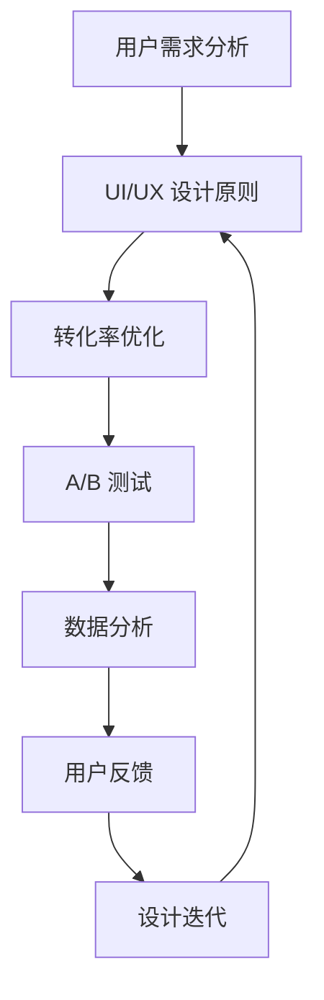

                 

# 程序员如何打造高转化率的销售页面

> 关键词：销售页面、用户体验、UI/UX 设计、转化率、A/B 测试、技术优化
>
> 摘要：本文将探讨如何通过技术手段和设计理念，帮助程序员打造高转化率的销售页面。我们将深入分析用户体验（UI/UX）设计的关键要素，探讨如何通过A/B测试进行优化，并提供实际案例和工具资源推荐。

## 1. 背景介绍

### 1.1 目的和范围

本文的目标是帮助程序员了解如何利用技术手段提升销售页面的转化率。我们将覆盖以下主题：

1. UI/UX 设计原理
2. 销售页面的关键要素
3. A/B 测试方法
4. 技术优化策略
5. 实际案例与工具推荐

### 1.2 预期读者

本文适用于以下读者群体：

1. 程序员和开发人员
2. 数字营销和商业分析师
3. 企业和产品经理
4. UI/UX 设计师

### 1.3 文档结构概述

本文将按照以下结构进行：

1. 背景介绍
2. 核心概念与联系
3. 核心算法原理 & 具体操作步骤
4. 数学模型和公式 & 详细讲解 & 举例说明
5. 项目实战：代码实际案例和详细解释说明
6. 实际应用场景
7. 工具和资源推荐
8. 总结：未来发展趋势与挑战
9. 附录：常见问题与解答
10. 扩展阅读 & 参考资料

### 1.4 术语表

#### 1.4.1 核心术语定义

- **用户体验（UX）**：用户在使用产品或服务时的主观感受和体验。
- **用户界面（UI）**：产品的视觉元素，如颜色、字体、按钮等，直接影响用户体验。
- **转化率**：用户在访问页面后完成预期目标（如购买、注册等）的比例。
- **A/B 测试**：将用户随机分为两组，一组使用旧版页面，另一组使用新版页面，比较两组的转化率。

#### 1.4.2 相关概念解释

- **用户留存率**：用户在首次使用产品后继续使用的概率。
- **跳出率**：用户打开页面后没有进行任何操作就离开的比率。
- **转化路径**：用户从访问页面到完成转化的全过程。

#### 1.4.3 缩略词列表

- **UI/UX**：用户界面/用户体验
- **A/B 测试**：分对照组测试
- **CRO**：转化率优化（Conversion Rate Optimization）
- **CRM**：客户关系管理（Customer Relationship Management）

## 2. 核心概念与联系

在构建高转化率的销售页面之前，我们需要理解几个核心概念和它们之间的联系。

### 2.1 用户需求分析

首先，程序员需要通过市场调研和用户反馈了解用户需求。这包括：

- **产品功能**：用户期望的产品功能。
- **价值主张**：产品能为用户带来哪些价值。
- **痛点**：用户在当前产品中遇到的困难。

### 2.2 UI/UX 设计原则

UI/UX 设计是提升用户体验的关键。以下是一些核心设计原则：

- **一致性**：设计元素在整个页面上保持一致，提高用户熟悉度。
- **易用性**：确保用户能轻松完成操作，降低学习成本。
- **简洁性**：避免页面过于复杂，确保关键信息一目了然。
- **响应式设计**：页面能在不同设备上良好显示，提高用户体验。

### 2.3 转化率优化

转化率优化（CRO）是通过多种技术手段提高页面转化率的过程。以下是一些关键点：

- **A/B 测试**：通过对比不同版本页面的效果，找出最佳设计方案。
- **数据分析**：使用工具收集用户行为数据，分析页面性能。
- **用户反馈**：收集用户对页面的反馈，不断优化设计。

### 2.4 核心概念联系

这些概念相互关联，共同决定了销售页面的成功。例如，通过用户需求分析确定设计方向，通过UI/UX 设计提升用户体验，再通过CRO 不断优化页面效果。

下面是一个使用 Mermaid 绘制的流程图，展示核心概念之间的联系：



## 3. 核心算法原理 & 具体操作步骤

### 3.1 A/B 测试原理

A/B 测试是一种常见的实验方法，用于评估两个或多个版本的页面在转化率上的效果。以下是A/B 测试的基本原理和步骤：

#### 3.1.1 基本原理

A/B 测试的核心思想是将用户随机分为两组，一组（对照组）使用旧版页面，另一组（实验组）使用新版页面。通过对比两组的转化率，评估新设计的有效性。

#### 3.1.2 具体步骤

1. **确定测试目标**：明确希望提高的转化指标，如购买率、注册率等。
2. **设计实验版本**：根据用户需求和分析结果，设计一个新的页面版本。
3. **设置对照组和实验组**：将用户随机分配到对照组和实验组。
4. **收集数据**：运行测试，收集用户行为数据。
5. **分析结果**：比较两组的转化率，评估新设计的有效性。

### 3.2 A/B 测试伪代码

```python
# A/B 测试伪代码

# 初始化测试参数
control_group_size = 1000
experiment_group_size = 1000
objective_metric = "purchase_rate"

# 分配用户到对照组和实验组
control_group = random.sample(users, control_group_size)
experiment_group = random.sample(users, experiment_group_size)

# 运行测试
control_results = run_test(control_group, old_version)
experiment_results = run_test(experiment_group, new_version)

# 计算转化率
control_rate = calculate_rate(control_results, objective_metric)
experiment_rate = calculate_rate(experiment_results, objective_metric)

# 比较结果
if experiment_rate > control_rate:
    print("New version is better.")
else:
    print("Old version is better.")
```

## 4. 数学模型和公式 & 详细讲解 & 举例说明

### 4.1 转化率计算公式

转化率是评估页面效果的重要指标，计算公式如下：

$$
\text{转化率} = \frac{\text{转化人数}}{\text{访问人数}} \times 100\%
$$

#### 4.1.1 详细讲解

- **转化人数**：在特定时间内完成预期目标（如购买、注册等）的用户数量。
- **访问人数**：在相同时间内访问页面的总用户数量。

#### 4.1.2 举例说明

假设一个销售页面在一个月内有1000次访问，其中200人完成了购买。那么该页面的转化率为：

$$
\text{转化率} = \frac{200}{1000} \times 100\% = 20\%
$$

### 4.2 A/B 测试统计显著性分析

在A/B 测试中，我们需要评估实验结果是否具有统计显著性，以确定新设计的有效性。常用的统计方法包括T检验和卡方检验。

#### 4.2.1 T检验

T检验用于比较两组样本均值是否有显著差异。公式如下：

$$
t = \frac{\bar{x}_1 - \bar{x}_2}{\sigma/\sqrt{n}}
$$

其中：

- $\bar{x}_1$ 和 $\bar{x}_2$ 分别为对照组和实验组的样本均值。
- $\sigma$ 为总体标准差。
- $n$ 为样本大小。

#### 4.2.2 卡方检验

卡方检验用于比较两组比例是否有显著差异。公式如下：

$$
\chi^2 = \sum \frac{(O_i - E_i)^2}{E_i}
$$

其中：

- $O_i$ 为观察频数。
- $E_i$ 为期望频数。

#### 4.2.3 举例说明

假设对照组的转化率为10%，实验组的转化率为15%。我们可以使用T检验评估两者是否有显著差异。

首先，计算总体标准差：

$$
\sigma = \sqrt{\frac{p(1-p)}{n}}
$$

其中：

- $p$ 为总体比例。
- $n$ 为总体大小。

假设总体大小为10000，总体比例$p$为0.1。则：

$$
\sigma = \sqrt{\frac{0.1 \times 0.9}{10000}} \approx 0.0045
$$

接下来，计算T值：

$$
t = \frac{0.15 - 0.10}{0.0045/\sqrt{10000}} \approx 2.24
$$

对于双样本T检验，显著性水平为0.05时，自由度为99，T值为1.98。由于计算得到的T值（2.24）大于临界值（1.98），我们拒绝原假设，认为实验组的转化率显著高于对照组。

## 5. 项目实战：代码实际案例和详细解释说明

### 5.1 开发环境搭建

在本案例中，我们将使用Python和Jinja2模板引擎来构建销售页面。以下是开发环境的搭建步骤：

1. 安装Python（版本3.8或更高）。
2. 安装Jinja2模板引擎：`pip install Jinja2`。

### 5.2 源代码详细实现和代码解读

#### 5.2.1 源代码

```python
# sales_page.py

from jinja2 import Environment, FileSystemLoader
import random

# 1. 确定页面元素
title = "超级优惠：限时抢购"
description = "现在购买，享受9折优惠！"
button_text = "立即购买"

# 2. 设计A/B测试版本
def generate_page(content):
    template_dir = "templates"
    env = Environment(loader=FileSystemLoader(template_dir))
    template = env.get_template("base.html")
    return template.render(content=content)

def create_ab_test(users, version='A'):
    if version == 'A':
        content = {
            "title": title,
            "description": description,
            "button_text": button_text
        }
    elif version == 'B':
        content = {
            "title": "限时抢购：超级优惠",
            "description": "立即下单，享受高达15%的优惠！",
            "button_text": "立即下单"
        }
    return generate_page(content)

# 3. 运行A/B测试
users = ['user1', 'user2', 'user3', 'user4', 'user5']
random.shuffle(users)

for user in users:
    if random.random() < 0.5:
        page = create_ab_test(user, 'A')
        print(f"{user} received version A.")
    else:
        page = create_ab_test(user, 'B')
        print(f"{user} received version B.")

```

#### 5.2.2 代码解读

- **第1步**：定义页面元素，包括标题、描述和按钮文本。
- **第2步**：设计A/B测试版本。我们创建了两个版本（A和B），并使用函数`create_ab_test`根据版本号生成页面内容。
- **第3步**：运行A/B测试。我们随机将用户分配到两个版本，并打印出每个用户接收的版本。

#### 5.2.3 代码分析

- **模板引擎**：使用Jinja2模板引擎生成页面。模板文件（`base.html`）定义了页面的基本结构和样式。
- **随机分配**：使用随机函数将用户分配到A/B测试的两组。

### 5.3 代码解读与分析

#### 5.3.1 页面模板

页面模板（`base.html`）如下：

```html
<!-- templates/base.html -->

<!DOCTYPE html>
<html lang="en">
<head>
    <meta charset="UTF-8">
    <meta name="viewport" content="width=device-width, initial-scale=1.0">
    <title>{{ content.title }}</title>
    <style>
        body {
            font-family: Arial, sans-serif;
            margin: 0;
            padding: 0;
        }
        .container {
            max-width: 800px;
            margin: 0 auto;
            padding: 20px;
        }
        h1 {
            color: #333;
        }
        p {
            color: #666;
        }
        button {
            background-color: #007bff;
            color: white;
            padding: 10px 20px;
            border: none;
            cursor: pointer;
        }
        button:hover {
            background-color: #0056b3;
        }
    </style>
</head>
<body>
    <div class="container">
        <h1>{{ content.title }}</h1>
        <p>{{ content.description }}</p>
        <button>{{ content.button_text }}</button>
    </div>
</body>
</html>
```

- **HTML结构**：定义了页面的基本结构，包括标题、描述和按钮。
- **CSS样式**：设置页面的基本样式，如字体、颜色和布局。

#### 5.3.2 A/B 测试实现

- **分配用户**：使用`random.shuffle`和`random.random`将用户随机分配到A/B测试的两组。
- **生成页面**：调用`create_ab_test`函数，根据版本号生成页面内容。

通过这个实际案例，我们可以看到如何使用Python和Jinja2模板引擎构建A/B测试页面，并分析其实现原理和关键步骤。

## 6. 实际应用场景

### 6.1 电商网站

电商网站通常使用A/B测试来优化产品展示、推荐系统和购物车页面。例如，通过测试不同产品排序方式、推荐算法和购物车设计，提高用户购买意愿和转化率。

### 6.2 营销活动

营销活动页面可以使用A/B测试来优化页面设计、文案和按钮颜色。通过比较不同版本的转化效果，选择最佳设计方案。

### 6.3 付费课程

在线教育平台可以使用A/B测试优化课程页面设计、课程介绍和报名按钮。通过对比不同版本的转化率，提高报名率和用户留存率。

### 6.4 软件产品

软件公司可以使用A/B测试优化产品下载页面、试用流程和购买按钮设计。通过测试不同版本，提高产品下载量和用户转化率。

## 7. 工具和资源推荐

### 7.1 学习资源推荐

#### 7.1.1 书籍推荐

- 《用户体验要素》
- 《转化率优化：如何提高网站用户转化率》
- 《数字营销实战》

#### 7.1.2 在线课程

- Coursera：用户体验设计
- Udemy：转化率优化：从入门到精通
- edX：数据驱动营销

#### 7.1.3 技术博客和网站

- Smashing Magazine：关于UI/UX设计和前端开发的博客
- Nielsen Norman Group：用户体验研究和最佳实践
- ConversionXL：关于CRO和数字营销的资源

### 7.2 开发工具框架推荐

#### 7.2.1 IDE和编辑器

- Visual Studio Code：跨平台、功能强大的代码编辑器
- Sublime Text：轻量级、灵活的代码编辑器
- IntelliJ IDEA：专业级Java和Python开发IDE

#### 7.2.2 调试和性能分析工具

- Chrome DevTools：强大的Web开发调试工具
- WebPageTest：网页性能测试工具
- New Relic：应用程序性能监控和调试工具

#### 7.2.3 相关框架和库

- Django：Python Web开发框架
- React：用于构建用户界面的JavaScript库
- Bootstrap：响应式前端开发框架

### 7.3 相关论文著作推荐

#### 7.3.1 经典论文

- "Designing for Usability" by Jakob Nielsen
- "The Design of Everyday Things" by Don Norman
- "Conversion Rate Optimization: The Art and Science of Optimizing Your Web Site" by Brian Halligan and John Jantsch

#### 7.3.2 最新研究成果

- "User Experience Design and Personalization in E-commerce: A Multilevel Study" by Hendrik P. van Bruggen, et al.
- "A/B Testing for Conversion Rate Optimization: A Comprehensive Guide" by Andrew Chen
- "The Impact of Color on E-commerce Website Conversion Rates" by Lea P. D'Arcy and Richard A. Watson

#### 7.3.3 应用案例分析

- "How A/B Testing Helped Shopify Increase Conversion Rate by 10%" by Shopify
- "The Power of A/B Testing: A Case Study" by HubSpot
- "Optimizing Website Conversion Rates with A/B Testing" by Unsplash

## 8. 总结：未来发展趋势与挑战

### 8.1 未来发展趋势

1. **个性化用户体验**：随着大数据和人工智能技术的发展，个性化用户体验将成为主流。通过分析用户行为，提供个性化的产品推荐和页面设计。
2. **AI自动化优化**：利用机器学习和自然语言处理技术，实现自动化A/B测试和页面优化。
3. **全渠道整合**：跨渠道（如网页、移动应用、社交媒体）的优化策略，提升整体用户体验和转化率。

### 8.2 面临的挑战

1. **数据隐私和安全**：在收集和使用用户数据时，需要遵守相关法律法规，保护用户隐私。
2. **技术复杂度**：随着技术的不断发展，程序员需要不断学习新的工具和框架，以应对日益复杂的需求。
3. **用户反馈一致性**：收集和分析用户反馈，确保不同版本的测试结果具有可比性，避免数据偏差。

## 9. 附录：常见问题与解答

### 9.1 问题1：A/B测试是否适用于所有网站？

A/B测试是一种通用的优化方法，适用于各种类型的网站，包括电商、在线教育、软件产品等。然而，对于特定类型的网站（如内容驱动型网站），A/B测试可能不是唯一有效的优化手段。

### 9.2 问题2：如何确定A/B测试的时间长度？

A/B测试的时间长度取决于多个因素，如访问量、用户行为特征和业务目标。通常，建议运行至少7天，以确保测试结果具有统计显著性。对于高访问量的网站，可能需要更长时间来收集足够的数据。

### 9.3 问题3：如何确保A/B测试的公正性？

确保A/B测试的公正性需要遵循以下原则：

1. 随机分配用户到对照组和实验组。
2. 确保对照组和实验组在测试开始前处于相同状态。
3. 使用统计分析方法评估实验结果。

## 10. 扩展阅读 & 参考资料

### 10.1 扩展阅读

- "The Lean Startup" by Eric Ries
- "UI/UX Design for Startups" by Andrew Chen
- "Web Analytics: An Hour a Day" by Avinash Kaushik

### 10.2 参考资料

- "A/B Testing Guide" by VWO
- "Conversion Rate Optimization: Best Practices and Strategies" by Unbounce
- "User Research for Startups" by Eric Ries

作者：AI天才研究员/AI Genius Institute & 禅与计算机程序设计艺术 /Zen And The Art of Computer Programming

