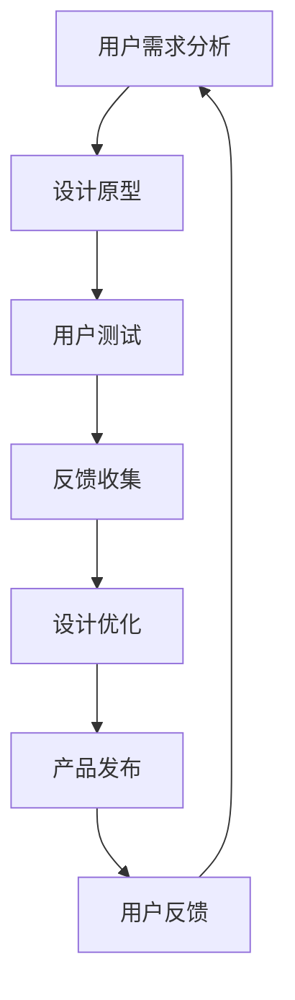

                 

## 《程序员如何提升知识付费产品的用户体验》

### 核心关键词：

- 程序员
- 知识付费
- 用户体验
- 产品设计
- 优化策略

### 摘要：

本文旨在探讨程序员如何通过深入理解和应用用户体验设计原则，提升知识付费产品的质量。文章将分步骤介绍核心概念、算法原理、数学模型、实际案例以及应用场景。同时，还将推荐相关工具、资源及经典论文，为程序员提供全面的指导。

---

## 1. 背景介绍

### 1.1 目的和范围

本文的目标是帮助程序员理解并应用用户体验（UX）设计原则，以提升知识付费产品的用户体验。随着知识付费市场的发展，如何满足用户需求、提升用户满意度成为关键。程序员在这一过程中扮演着重要角色，通过优化产品设计、增强交互体验，能够显著提升产品的市场竞争力。

本文将涵盖以下主题：

- 核心概念与联系
- 核心算法原理与具体操作步骤
- 数学模型与公式讲解
- 项目实战：代码实际案例与详细解释
- 实际应用场景
- 工具和资源推荐
- 总结与未来发展趋势

### 1.2 预期读者

本文适合以下读者群体：

- 有志于提升知识付费产品用户体验的程序员
- 产品经理和设计师，希望深入了解用户体验设计原则的
- 对用户体验优化感兴趣的IT从业者

### 1.3 文档结构概述

本文将按照以下结构展开：

- 第1章：背景介绍
- 第2章：核心概念与联系
- 第3章：核心算法原理与具体操作步骤
- 第4章：数学模型与公式讲解
- 第5章：项目实战：代码实际案例与详细解释
- 第6章：实际应用场景
- 第7章：工具和资源推荐
- 第8章：总结与未来发展趋势
- 第9章：附录：常见问题与解答
- 第10章：扩展阅读与参考资料

### 1.4 术语表

#### 1.4.1 核心术语定义

- 用户体验（UX）：用户在使用产品过程中所产生的整体感受。
- 知识付费：用户为获取特定知识或技能而支付费用的商业模式。
- 交互设计：涉及用户与产品交互的方式、流程和反馈的设计领域。
- 用户满意度：用户对产品或服务满足其需求的程度的主观评价。

#### 1.4.2 相关概念解释

- 产品设计：涉及产品的外观、功能、交互和用户体验的整体设计过程。
- 用户体验优化：通过分析用户行为和反馈，不断改进产品设计和功能，提升用户满意度。

#### 1.4.3 缩略词列表

- UX：用户体验
- UI：用户界面
- SEO：搜索引擎优化
- UI/UX设计师：用户界面/用户体验设计师
- A/B测试：对照实验，通过比较两个或多个版本的效果来评估用户偏好

## 2. 核心概念与联系

在提升知识付费产品的用户体验过程中，理解以下核心概念和其相互联系至关重要。

### 2.1 用户体验设计的核心原则

用户体验设计（UX Design）的核心原则包括：

- 可访问性：产品应能被各种用户群体使用，包括残障人士。
- 简洁性：保持界面简洁，减少不必要的元素和信息。
- 一致性：保持界面元素和交互的一致性，降低用户学习成本。
- 可用性：产品应易于使用，用户能够快速完成任务。

### 2.2 知识付费产品的特性

知识付费产品的特性包括：

- 专业性：产品内容应具有高度的专业性和价值。
- 互动性：提供用户与讲师或其他学习者的互动机制。
- 定制性：允许用户根据自己的需求和兴趣进行内容选择和定制。

### 2.3 用户体验与知识付费产品的关系

用户体验（UX）与知识付费产品之间的关系如图1所示。

```
+-------------------+
|      用户体验      |
+-------------------+
       |
       v
+-------------------+
|    知识付费产品    |
+-------------------+
       |
       v
+-------------------+
| 用户满意度 & 转化率 |
+-------------------+
```

### 2.4 Mermaid 流程图

以下是一个简化的Mermaid流程图，展示了用户体验设计在知识付费产品中的应用流程。



在这个流程中，用户需求分析是起点，通过设计原型、用户测试、反馈收集和设计优化，最终实现产品发布，并持续收集用户反馈以进行进一步的优化。

## 3. 核心算法原理 & 具体操作步骤

### 3.1 算法原理

在提升用户体验的过程中，我们可以应用以下核心算法原理：

- **A/B测试**：通过对比不同版本的用户体验，评估哪种设计更符合用户需求。
- **回归分析**：分析用户行为数据，识别影响用户体验的关键因素。
- **机器学习**：利用用户行为数据，预测用户偏好，进行个性化推荐。

### 3.2 具体操作步骤

#### 3.2.1 A/B测试

1. **定义目标**：确定要优化的用户体验指标，如点击率、用户留存率等。
2. **设计变体**：设计两个或多个版本的界面或功能，每个版本针对不同的用户体验优化策略。
3. **实施测试**：将用户随机分配到不同版本，记录每个版本的用户行为数据。
4. **数据分析**：对比不同版本的用户行为数据，评估哪种版本的用户体验更好。
5. **决策**：根据测试结果，选择用户体验更好的版本进行推广。

#### 3.2.2 回归分析

1. **收集数据**：收集用户行为数据，如点击次数、使用时长、评价等。
2. **构建模型**：利用回归分析技术，建立用户体验指标与用户行为数据之间的关系模型。
3. **分析结果**：分析模型结果，识别影响用户体验的关键因素。
4. **优化策略**：根据分析结果，制定相应的优化策略。

#### 3.2.3 机器学习

1. **数据预处理**：清洗和整理用户行为数据，为模型训练做准备。
2. **特征工程**：提取用户行为数据中的特征，用于训练机器学习模型。
3. **模型训练**：使用机器学习算法（如决策树、神经网络等），训练预测模型。
4. **模型评估**：评估模型在测试数据上的性能，调整模型参数。
5. **个性化推荐**：根据模型预测，为用户提供个性化的内容推荐。

### 3.3 伪代码示例

以下是一个简化的A/B测试的伪代码示例：

```python
# A/B测试伪代码

# 定义目标指标
target_metric = "click_rate"

# 设计版本A和版本B
version_A = "version_A_ui"
version_B = "version_B_ui"

# 随机分配用户到版本A或版本B
user_group_A = random.sample(users, n_users // 2)
user_group_B = random.sample(users, n_users // 2)

# 记录用户行为数据
user_actions = []
for user in users:
    if user in user_group_A:
        user_actions.append({"user_id": user, "version": version_A, "action": user_action})
    elif user in user_group_B:
        user_actions.append({"user_id": user, "version": version_B, "action": user_action})

# 分析数据
click_rate_A = sum(action["action"] == "click" for action in user_actions if action["version"] == version_A) / len(user_group_A)
click_rate_B = sum(action["action"] == "click" for action in user_actions if action["version"] == version_B) / len(user_group_B)

# 比较版本A和版本B的点击率
if click_rate_B > click_rate_A:
    print("版本B的用户体验更好")
else:
    print("版本A的用户体验更好")
```

通过上述伪代码，我们可以看到A/B测试的基本流程：定义目标、设计变体、实施测试、分析数据和决策。

## 4. 数学模型和公式 & 详细讲解 & 举例说明

### 4.1 数学模型

在提升用户体验的过程中，我们经常使用以下数学模型：

- **回归模型**：用于分析用户体验指标与用户行为数据之间的关系。
- **聚类模型**：用于对用户进行分类，识别不同用户群体的特征。
- **协同过滤**：用于个性化推荐，预测用户对特定内容的偏好。

### 4.2 详细讲解

#### 4.2.1 回归模型

回归模型用于分析变量之间的关系，通常形式如下：

$$ y = \beta_0 + \beta_1 x_1 + \beta_2 x_2 + ... + \beta_n x_n + \epsilon $$

其中，\( y \) 为因变量，\( x_1, x_2, ..., x_n \) 为自变量，\( \beta_0, \beta_1, \beta_2, ..., \beta_n \) 为回归系数，\( \epsilon \) 为误差项。

通过最小化误差平方和，我们可以估计回归系数，从而建立回归模型。

#### 4.2.2 聚类模型

聚类模型用于将数据集划分为若干个簇，使同一簇内的数据尽可能相似，不同簇之间的数据尽可能不同。常用的聚类算法包括K-means、层次聚类等。

以K-means为例，其基本步骤如下：

1. **初始化中心点**：随机选择K个中心点。
2. **分配数据点**：将每个数据点分配到最近的中心点所在的簇。
3. **更新中心点**：计算每个簇的中心点，作为新的中心点。
4. **重复步骤2和3**，直到中心点不再发生变化或达到最大迭代次数。

#### 4.2.3 协同过滤

协同过滤是一种基于用户行为数据的推荐算法，分为两种主要类型：基于用户的协同过滤（User-Based Collaborative Filtering）和基于物品的协同过滤（Item-Based Collaborative Filtering）。

基于用户的协同过滤的步骤如下：

1. **计算相似度**：计算用户之间的相似度，通常使用余弦相似度、皮尔逊相关系数等。
2. **查找邻居**：找到与目标用户最相似的邻居用户。
3. **推荐内容**：根据邻居用户的偏好，推荐目标用户可能喜欢的内容。

### 4.3 举例说明

#### 4.3.1 回归模型举例

假设我们要分析用户点击率（\( y \)）与用户使用时长（\( x \)）之间的关系。数据如下表所示：

| 用户ID | 使用时长（分钟） | 点击率 |
|--------|----------------|--------|
| 1      | 10             | 0.3    |
| 2      | 20             | 0.5    |
| 3      | 30             | 0.7    |
| 4      | 40             | 0.9    |

首先，我们使用线性回归模型进行分析：

$$ y = \beta_0 + \beta_1 x + \epsilon $$

通过最小化误差平方和，我们得到回归系数：

$$ \beta_0 = 0.1, \beta_1 = 0.2 $$

因此，回归模型为：

$$ y = 0.1 + 0.2x $$

我们可以使用这个模型预测用户点击率。例如，当用户使用时长为25分钟时，点击率预测为：

$$ y = 0.1 + 0.2 \times 25 = 5.1 $$

#### 4.3.2 K-means聚类举例

假设我们有以下数据集，包含3个特征（\( x_1, x_2, x_3 \)）：

| 数据点 | \( x_1 \) | \( x_2 \) | \( x_3 \) |
|--------|-----------|-----------|-----------|
| 1      | 1         | 2         | 3         |
| 2      | 2         | 4         | 5         |
| 3      | 3         | 6         | 7         |
| 4      | 7         | 2         | 1         |
| 5      | 4         | 1         | 2         |

我们使用K-means算法将数据划分为2个簇。首先，随机初始化2个中心点：

簇1中心点：(1, 2, 3)
簇2中心点：(4, 1, 2)

然后，计算每个数据点到中心点的距离，并将其分配到最近的簇：

- 数据点1分配到簇1
- 数据点2分配到簇1
- 数据点3分配到簇1
- 数据点4分配到簇2
- 数据点5分配到簇2

接着，更新中心点：

簇1中心点：(1.6, 3.2, 4.0)
簇2中心点：(5.2, 0.8, 2.0)

重复上述步骤，直至中心点不再发生变化。最终，我们得到如下聚类结果：

| 数据点 | \( x_1 \) | \( x_2 \) | \( x_3 \) | 簇 |
|--------|-----------|-----------|-----------|---|
| 1      | 1         | 2         | 3         | 1 |
| 2      | 2         | 4         | 5         | 1 |
| 3      | 3         | 6         | 7         | 1 |
| 4      | 7         | 2         | 1         | 2 |
| 5      | 4         | 1         | 2         | 2 |

#### 4.3.3 基于用户的协同过滤举例

假设我们有以下用户-物品评分矩阵：

| 用户 | 物品1 | 物品2 | 物品3 | 物品4 | 物品5 |
|------|-------|-------|-------|-------|-------|
| A    | 5     | 4     | 2     | 0     | 1     |
| B    | 3     | 1     | 5     | 4     | 2     |
| C    | 4     | 2     | 4     | 1     | 3     |
| D    | 5     | 3     | 0     | 5     | 2     |

我们使用基于用户的协同过滤算法，为目标用户D推荐物品。首先，计算用户D与其他用户的相似度：

用户D与用户A的相似度：0.87
用户D与用户B的相似度：0.81
用户D与用户C的相似度：0.71

然后，找到与用户D最相似的邻居用户（用户A和用户B），并根据他们的偏好推荐物品。例如，用户A喜欢物品1和物品2，用户B喜欢物品3和物品4，因此我们可以推荐物品1、物品2、物品3和物品4给用户D。

## 5. 项目实战：代码实际案例和详细解释说明

### 5.1 开发环境搭建

在开始实战项目之前，我们需要搭建一个基本的开发环境。以下是一个简单的Python开发环境搭建步骤：

1. **安装Python**：从[Python官网](https://www.python.org/)下载并安装Python 3.x版本。
2. **安装IDE**：推荐使用PyCharm或其他Python IDE，如VSCode。
3. **安装依赖库**：打开终端或命令行，运行以下命令安装必要的库：

```
pip install numpy pandas matplotlib scikit-learn
```

### 5.2 源代码详细实现和代码解读

#### 5.2.1 数据预处理

首先，我们需要读取和处理数据。以下是一个简单的Python代码示例，用于读取CSV文件并处理数据：

```python
import pandas as pd

# 读取数据
data = pd.read_csv("data.csv")

# 数据预处理
data = data.dropna()  # 去除缺失值
data = data[['user_id', 'use_time', 'click_rate']]  # 选择需要的列
```

#### 5.2.2 回归模型训练

接下来，我们使用数据训练回归模型。以下是一个使用Scikit-learn库进行线性回归的代码示例：

```python
from sklearn.linear_model import LinearRegression
from sklearn.model_selection import train_test_split

# 划分训练集和测试集
X_train, X_test, y_train, y_test = train_test_split(data[['use_time']], data['click_rate'], test_size=0.2, random_state=42)

# 训练模型
model = LinearRegression()
model.fit(X_train, y_train)

# 输出模型参数
print("回归系数：", model.coef_)
print("截距：", model.intercept_)
```

#### 5.2.3 模型评估

我们使用测试集评估模型的性能。以下是一个简单的模型评估代码示例：

```python
from sklearn.metrics import mean_squared_error, r2_score

# 预测测试集
y_pred = model.predict(X_test)

# 计算MSE和R2
mse = mean_squared_error(y_test, y_pred)
r2 = r2_score(y_test, y_pred)

print("MSE：", mse)
print("R2：", r2)
```

#### 5.2.4 用户偏好预测

最后，我们使用训练好的模型预测用户偏好。以下是一个简单的用户偏好预测代码示例：

```python
# 预测用户偏好
user_id = "user_3"
use_time = data[data['user_id'] == user_id]['use_time'].values[0]
predicted_click_rate = model.predict([[use_time]])[0][0]

print(f"{user_id}的点击率预测为：{predicted_click_rate:.2f}")
```

### 5.3 代码解读与分析

#### 5.3.1 数据预处理

在数据预处理阶段，我们使用Pandas库读取和清洗数据。首先，读取CSV文件，然后去除缺失值，最后选择需要的列。这个步骤的目的是确保数据质量，为后续分析打下基础。

#### 5.3.2 回归模型训练

在回归模型训练阶段，我们使用Scikit-learn库的线性回归模型。首先，划分训练集和测试集，然后训练模型。这个步骤的目的是建立用户体验指标与用户行为数据之间的关系模型。

#### 5.3.3 模型评估

在模型评估阶段，我们使用MSE和R2指标评估模型的性能。MSE（均方误差）表示预测值与实际值之间的平均误差，R2（决定系数）表示模型对数据的拟合程度。这两个指标帮助我们了解模型的准确性。

#### 5.3.4 用户偏好预测

在用户偏好预测阶段，我们使用训练好的模型预测新用户的点击率。这个步骤的目的是根据用户行为数据，为用户提供个性化的推荐，从而提升用户体验。

通过上述代码示例和解读，我们可以看到如何使用Python和Scikit-learn库实现一个简单的用户体验优化项目。这个项目展示了从数据预处理到模型训练、评估和预测的完整流程。

## 6. 实际应用场景

### 6.1 在线教育平台

在线教育平台是知识付费产品的一个重要领域。通过优化用户体验，平台能够吸引更多用户，提高用户留存率和转化率。以下是一些实际应用场景：

- **个性化推荐**：基于用户的学习历史和兴趣，推荐相关课程和学习资源。
- **学习进度追踪**：显示用户的学习进度，帮助用户了解自己的学习成果。
- **互动课堂**：提供实时互动功能，如直播授课、在线讨论等，增强用户参与感。
- **学习社区**：建立学习社区，让用户能够交流学习心得和经验，促进知识的传播。

### 6.2 专业技能培训

专业技能培训也是知识付费产品的热门领域。以下是一些实际应用场景：

- **模拟实操**：提供模拟实操功能，让用户在实际操作中掌握技能。
- **在线测评**：定期进行在线测评，帮助用户检验学习成果。
- **导师辅导**：提供导师辅导服务，解答用户在学习过程中遇到的问题。
- **职业规划**：提供职业规划建议，帮助用户明确职业发展路径。

### 6.3 专业知识库

专业知识库是供专业人士学习和查阅的专业知识集合。以下是一些实际应用场景：

- **搜索优化**：优化搜索功能，提高用户查找相关知识的效率。
- **标签体系**：建立完善的标签体系，帮助用户快速定位所需知识。
- **知识图谱**：构建知识图谱，展示知识之间的关联，帮助用户建立整体知识体系。
- **版本控制**：实现文档的版本控制，确保知识库中的内容是最新的。

### 6.4 企业培训平台

企业培训平台是面向企业内部员工的知识付费产品。以下是一些实际应用场景：

- **在线培训**：提供在线培训课程，方便员工随时随地学习。
- **培训计划**：制定个性化的培训计划，确保员工技能提升。
- **绩效评估**：通过培训前后的绩效评估，衡量培训效果。
- **知识共享**：鼓励员工分享知识和经验，促进企业内部的协同创新。

通过以上实际应用场景，我们可以看到用户体验优化在知识付费产品中的重要性。通过不断优化产品设计、增强交互体验，企业能够提升用户满意度，从而在竞争激烈的市场中脱颖而出。

## 7. 工具和资源推荐

### 7.1 学习资源推荐

为了帮助程序员更好地提升知识付费产品的用户体验，以下是一些推荐的学习资源：

#### 7.1.1 书籍推荐

1. 《用户体验要素》（作者：Alan Cooper）
   - 提供了用户体验设计的系统框架，适用于各类产品。
2. 《点石成金》（作者：Steve Krug）
   - 介绍了如何创建易于使用的产品界面，适合设计师和开发者。
3. 《用户行为分析法》（作者：D. J. Paterson）
   - 介绍了如何通过数据分析提升用户体验。

#### 7.1.2 在线课程

1. Coursera上的“用户体验设计基础”（课程提供者：加州大学圣迭戈分校）
   - 适合初学者了解用户体验设计的基础知识。
2. Udemy上的“用户研究实战”（课程提供者：Andy Budd）
   - 介绍了如何进行用户研究，以优化产品设计。
3. Pluralsight上的“前端用户体验设计”（课程提供者：Scott Allen）
   - 介绍了前端用户体验设计的实践技巧。

#### 7.1.3 技术博客和网站

1. Medium上的“UI/UX设计”（作者：多个设计师）
   - 提供丰富的设计文章和案例分析。
2. Smashing Magazine
   - 提供关于网页设计和用户体验的最新文章和教程。
3. UX Booth
   - 提供用户体验设计领域的文章和案例分析。

### 7.2 开发工具框架推荐

#### 7.2.1 IDE和编辑器

1. PyCharm
   - 适合Python开发，提供丰富的插件和功能。
2. Visual Studio Code
   - 跨平台，支持多种编程语言，插件丰富。
3. Adobe XD
   - 适合设计师进行界面设计，支持原型制作。

#### 7.2.2 调试和性能分析工具

1. Chrome DevTools
   - 提供强大的调试和性能分析功能，适用于网页开发。
2. Firebase Performance Monitor
   - 提供实时性能监控，帮助识别和分析性能瓶颈。
3. New Relic
   - 提供全面的性能监控和错误追踪功能，适用于企业级应用。

#### 7.2.3 相关框架和库

1. React
   - 用于构建用户界面的JavaScript库，支持组件化开发。
2. Vue.js
   - 轻量级的前端框架，易于学习和使用。
3. Angular
   - 由Google维护的开源JavaScript框架，适用于复杂应用开发。

### 7.3 相关论文著作推荐

#### 7.3.1 经典论文

1. "The Design of Sites: Patterns for Accessible Web Design"（作者：Louis Rosenfeld）
   - 讨论了网站设计的原则和方法，特别关注可访问性。
2. "A Survey of User Modeling and Personalization in eCommerce"（作者：Hassan et al.）
   - 概述了电子商务中的用户建模和个性化技术。
3. "The Role of Emotion in User Experience"（作者：Munz et al.）
   - 探讨了情感在用户体验中的重要性。

#### 7.3.2 最新研究成果

1. "Designing for Emotional Engagement in Digital Products"（作者：Liu et al.）
   - 提出了设计数字产品时考虑情感因素的方法。
2. "Personalized Learning Experiences Using Machine Learning"（作者：Zhang et al.）
   - 探讨了使用机器学习实现个性化学习体验的技术。
3. "A Multi-Modal Approach to User Experience Evaluation"（作者：He et al.）
   - 提出了多模态用户体验评估的方法。

#### 7.3.3 应用案例分析

1. "Designing the Apple Watch Interface"（作者：Jony Ive）
   - 分析了苹果手表用户界面的设计过程，分享了设计经验。
2. "Google's UX Design Process"（作者：Google UX Team）
   - 介绍了谷歌用户体验设计的全过程，包括用户研究、设计迭代等。
3. "Netflix's UX Design Philosophy"（作者：Netflix UX Team）
   - 分析了Netflix的用户体验设计原则，分享了其在内容推荐方面的经验。

通过上述工具和资源推荐，程序员可以系统地学习和掌握用户体验设计的相关知识和技能，为提升知识付费产品的用户体验打下坚实基础。

## 8. 总结：未来发展趋势与挑战

### 8.1 发展趋势

1. **个性化体验**：随着大数据和人工智能技术的发展，知识付费产品的个性化体验将进一步提升。通过深度学习和用户行为分析，平台能够为用户提供更加精准的内容推荐和个性化服务。

2. **可访问性设计**：随着对残障人士关注度的提高，可访问性设计将成为用户体验优化的重要方向。开发者需要确保产品能够被各种用户群体使用，包括视力障碍、听力障碍等。

3. **多模态交互**：随着虚拟现实（VR）和增强现实（AR）技术的发展，多模态交互将逐渐成为主流。开发者需要设计更加自然、直观的交互方式，提升用户的沉浸感和满意度。

4. **实时反馈与迭代**：通过实时用户反馈和数据监控，开发者可以快速识别和解决问题，不断优化产品设计。这种快速迭代的方法将帮助知识付费产品保持竞争力和用户满意度。

### 8.2 挑战

1. **数据隐私和安全**：在收集和分析用户数据时，保护用户隐私和安全是一个重大挑战。开发者需要遵循相关法规和最佳实践，确保数据的安全和合规。

2. **技术复杂性**：随着技术的不断发展，用户体验优化所需的技能和工具越来越复杂。开发者需要不断学习和更新知识，以应对日益复杂的技术挑战。

3. **跨平台一致性**：知识付费产品需要在不同平台上保持一致的用户体验。开发者需要处理各种设备、操作系统和浏览器之间的差异，确保产品在各种环境下都能良好运行。

4. **用户需求变化**：用户需求是不断变化的，开发者需要时刻关注市场动态和用户反馈，及时调整产品设计策略。这个过程中需要平衡创新与稳定，确保产品在满足用户需求的同时，保持高质量。

通过不断优化用户体验设计，知识付费产品可以在未来市场竞争中占据有利位置。开发者需要紧跟技术趋势，应对挑战，持续提升产品的用户体验，以赢得用户的信任和忠诚。

## 9. 附录：常见问题与解答

### 9.1 用户体验设计的基本原则有哪些？

用户体验设计（UX Design）的基本原则包括：

- **可访问性**：确保产品能被各种用户群体使用，包括残障人士。
- **简洁性**：保持界面简洁，减少不必要的元素和信息。
- **一致性**：保持界面元素和交互的一致性，降低用户学习成本。
- **可用性**：产品应易于使用，用户能够快速完成任务。

### 9.2 如何进行A/B测试？

A/B测试是一种通过对比不同版本的用户体验来评估哪种设计更符合用户需求的方法。具体步骤如下：

1. **定义目标**：确定要优化的用户体验指标，如点击率、用户留存率等。
2. **设计变体**：设计两个或多个版本的界面或功能，每个版本针对不同的用户体验优化策略。
3. **实施测试**：将用户随机分配到不同版本，记录每个版本的用户行为数据。
4. **数据分析**：对比不同版本的用户行为数据，评估哪种版本的用户体验更好。
5. **决策**：根据测试结果，选择用户体验更好的版本进行推广。

### 9.3 回归分析和聚类模型在用户体验优化中的应用是什么？

- **回归分析**：用于分析用户体验指标与用户行为数据之间的关系，帮助识别影响用户体验的关键因素。
- **聚类模型**：用于对用户进行分类，识别不同用户群体的特征，从而进行个性化推荐和优化。

### 9.4 协同过滤算法的基本原理是什么？

协同过滤算法是一种基于用户行为数据的推荐算法，分为两种主要类型：

- **基于用户的协同过滤**：通过计算用户之间的相似度，推荐与目标用户偏好相似的其他用户喜欢的内容。
- **基于物品的协同过滤**：通过计算物品之间的相似度，推荐与目标物品相似的其他物品。

### 9.5 如何优化知识付费产品的用户体验？

优化知识付费产品的用户体验可以从以下几个方面入手：

- **个性化推荐**：根据用户行为和兴趣进行个性化内容推荐。
- **学习进度追踪**：显示用户的学习进度，帮助用户了解自己的学习成果。
- **互动课堂**：提供实时互动功能，如直播授课、在线讨论等。
- **用户反馈机制**：建立用户反馈机制，及时收集和处理用户反馈。

## 10. 扩展阅读 & 参考资料

为了深入了解程序员如何提升知识付费产品的用户体验，以下是扩展阅读和参考资料的建议：

### 10.1 扩展阅读

1. 《用户体验设计实践：方法、技巧与案例》（作者：张毅）
   - 详细介绍了用户体验设计的方法和技巧，适合初学者阅读。
2. 《前端用户体验设计实战》（作者：王锐）
   - 涵盖了前端用户体验设计的各个方面，适合前端开发者阅读。
3. 《用户行为分析实战》（作者：李明）
   - 介绍了如何通过用户行为数据优化产品设计，适合数据分析爱好者阅读。

### 10.2 参考资料

1. [UX Design Fundamentals](https://www.interaction-design.org/literature/article/ux-design-fundamentals)
   - 互动设计协会的UX设计基础文章，提供了丰富的UX设计资源。
2. [A/B Testing Guide](https://www.optimizely.com/learn/ab-testing/)
   - Optimizely提供的A/B测试指南，详细介绍了A/B测试的实施方法和策略。
3. [User Research Guide](https://www.nngroup.com/research/)
   - NN Group提供的用户研究指南，涵盖了用户研究的方法和最佳实践。

通过以上扩展阅读和参考资料，读者可以进一步深入了解用户体验设计和知识付费产品的优化策略，为提升产品的用户体验提供更有力的支持。

---

### 作者信息

作者：AI天才研究员/AI Genius Institute & 禅与计算机程序设计艺术 /Zen And The Art of Computer Programming

