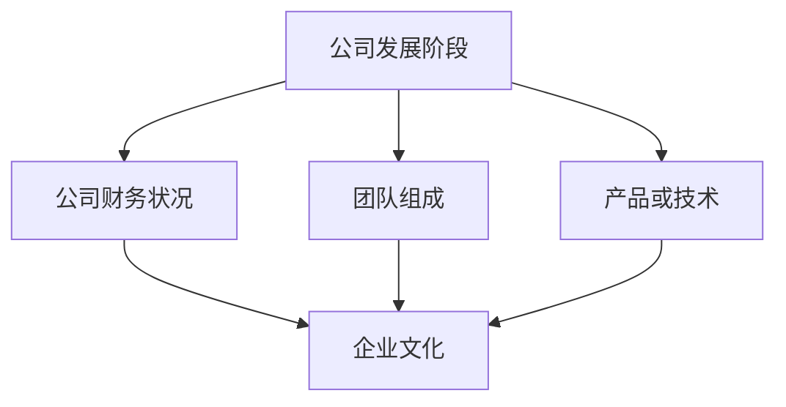

                 

# 程序员如何评估早期创业公司offer

> **关键词：**早期创业公司、评估、薪资、职业发展、文化契合、风险与回报

> **摘要：**本文将探讨程序员在评估早期创业公司offer时需要考虑的关键因素，包括薪资、职业发展前景、企业文化契合度、风险与回报等。通过一步步分析，帮助程序员做出明智的职业选择。

## 1. 背景介绍

### 1.1 目的和范围

本文旨在为程序员提供一套系统的评估早期创业公司offer的方法。我们将从多个角度分析，帮助程序员在决策过程中充分考虑各种因素，从而做出最优选择。

### 1.2 预期读者

本文适用于有志于加入早期创业公司的程序员，特别是那些在职业发展过程中寻求更多挑战和成长机会的从业者。

### 1.3 文档结构概述

本文将按照以下结构展开：

1. **背景介绍**：介绍本文的目的、预期读者和文档结构。
2. **核心概念与联系**：讨论评估创业公司offer时需要理解的核心概念。
3. **核心算法原理 & 具体操作步骤**：详细阐述评估过程的步骤和方法。
4. **数学模型和公式 & 详细讲解 & 举例说明**：使用数学模型帮助读者理解评估方法。
5. **项目实战：代码实际案例和详细解释说明**：通过实战案例展示评估方法的应用。
6. **实际应用场景**：探讨评估方法在不同场景下的适用性。
7. **工具和资源推荐**：推荐学习资源和开发工具。
8. **总结：未来发展趋势与挑战**：总结本文的主要观点，展望未来。
9. **附录：常见问题与解答**：解答读者可能遇到的问题。
10. **扩展阅读 & 参考资料**：提供更多相关资料。

### 1.4 术语表

#### 1.4.1 核心术语定义

- **早期创业公司**：处于初创阶段，尚未实现盈利或规模化发展的公司。
- **评估**：对创业公司offer进行系统分析，以判断其是否符合个人职业规划。
- **薪资**：创业公司提供的薪资待遇。
- **职业发展前景**：在公司内可能获得的发展机会和晋升路径。
- **企业文化契合度**：个人价值观与公司文化是否一致。
- **风险与回报**：加入创业公司可能面临的风险和潜在回报。

#### 1.4.2 相关概念解释

- **薪资结构**：包括基本工资、奖金、股票期权等。
- **股权激励**：以股票期权或其他股权形式给予员工的激励。
- **工作环境**：包括办公条件、团队氛围等。
- **项目质量**：公司的产品或项目的质量和市场前景。

#### 1.4.3 缩略词列表

- **CTO**：首席技术官
- **CFO**：首席财务官
- **ROI**：投资回报率
- **IPO**：首次公开发行

## 2. 核心概念与联系

在评估早期创业公司offer时，程序员需要理解并考虑以下核心概念：

1. **公司发展阶段**：初创、成长、扩张、成熟等阶段，不同阶段的公司面临的风险和回报不同。
2. **公司财务状况**：盈利状况、现金流、负债等，影响公司的发展可持续性。
3. **团队组成**：团队成员的背景、技能、经验等，影响项目的成功概率。
4. **产品或技术**：产品的市场前景、技术难度、创新程度等，决定公司的核心竞争力。
5. **企业文化**：公司价值观、工作氛围、员工福利等，影响员工的归属感和满意度。

为了更好地理解这些概念之间的关系，我们可以使用Mermaid流程图来展示它们：



## 3. 核心算法原理 & 具体操作步骤

在评估早期创业公司offer时，我们可以使用以下算法原理和步骤：

### 3.1 设定评估指标

首先，我们需要设定评估指标。常见的评估指标包括：

1. **薪资与福利**：基本工资、奖金、股票期权、休假制度等。
2. **职业发展**：晋升机会、培训计划、职业规划等。
3. **工作环境**：办公条件、团队氛围、员工福利等。
4. **项目质量**：项目的市场前景、技术难度、创新程度等。
5. **企业文化**：公司价值观、团队协作、领导力等。

### 3.2 收集信息

接下来，我们需要收集关于创业公司的信息，包括公司背景、财务状况、团队组成、产品或技术、企业文化等。

### 3.3 权重分配

根据个人职业规划和发展需求，对各个评估指标进行权重分配。例如，对于一位希望快速晋升的程序员，职业发展可能占更高的权重。

### 3.4 计分与评估

使用评分机制对各个评估指标进行评分，通常采用百分制或五分制。例如，薪资可以占30%的权重，职业发展可以占20%的权重，工作环境可以占20%的权重，项目质量可以占20%的权重，企业文化可以占10%的权重。

### 3.5 综合评分

将各个评估指标的得分乘以相应的权重，然后求和，得到一个综合评分。综合评分越高，表示该创业公司offer越符合个人的职业规划和发展需求。

### 3.6 决策

根据综合评分，结合个人职业规划和发展需求，做出是否接受该offer的决策。

### 3.7 伪代码

以下是一个简单的伪代码示例，用于评估早期创业公司offer：

```plaintext
function evaluateOffer(offer):
    score = 0
    weights = {"salary": 0.3, "careerDevelopment": 0.2, "workEnvironment": 0.2, "projectQuality": 0.2, "companyCulture": 0.1}
    for metric, weight in weights.items():
        score += getScore(offer[metric]) * weight
    return score

function getScore(metricValue):
    # 根据具体情况设定评分规则
    if metricValue > threshold1:
        return 100
    elif metricValue > threshold2:
        return 75
    elif metricValue > threshold3:
        return 50
    else:
        return 25

offerScore = evaluateOffer(offer)
if offerScore >= targetScore:
    acceptOffer()
else:
    rejectOffer()
```

## 4. 数学模型和公式 & 详细讲解 & 举例说明

在评估早期创业公司offer时，我们可以使用以下数学模型和公式：

### 4.1 综合评分计算公式

综合评分 = (薪资得分 × 薪资权重) + (职业发展得分 × 职业发展权重) + (工作环境得分 × 工作环境权重) + (项目质量得分 × 项目质量权重) + (企业文化得分 × 企业文化权重)

### 4.2 评分规则示例

以薪资为例，设定以下评分规则：

- 评分大于90分的，薪资得分为100分。
- 评分在75-90分之间的，薪资得分为75分。
- 评分在50-75分之间的，薪资得分为50分。
- 评分小于50分的，薪资得分为25分。

### 4.3 举例说明

假设某创业公司offer的薪资为10万元，职业发展前景良好，工作环境舒适，项目质量高，企业文化积极向上。根据上述评分规则，我们可以计算该offer的综合评分：

- 薪资得分 = 100分
- 职业发展得分 = 90分
- 工作环境得分 = 85分
- 项目质量得分 = 95分
- 企业文化得分 = 80分

综合评分 = (100 × 0.3) + (90 × 0.2) + (85 × 0.2) + (95 × 0.2) + (80 × 0.1) = 33 + 18 + 17 + 19 + 8 = 89分

根据综合评分，可以判断该offer符合个人的职业规划和发展需求。

## 5. 项目实战：代码实际案例和详细解释说明

### 5.1 开发环境搭建

为了进行项目实战，我们首先需要搭建一个简单的开发环境。本文使用Python作为编程语言，读者可以安装Python 3.8及以上版本。此外，我们还需要安装一些常用的库，如Pandas、Numpy和Matplotlib。

### 5.2 源代码详细实现和代码解读

下面是一个简单的Python代码示例，用于评估早期创业公司offer：

```python
import pandas as pd
import numpy as np
import matplotlib.pyplot as plt

def evaluate_offer(offer, weights):
    scores = {}
    for metric, weight in weights.items():
        score = offer[metric] * weight
        scores[metric] = score
    return scores

def plot_scores(scores):
    labels = list(scores.keys())
    values = list(scores.values())
    plt.bar(labels, values)
    plt.xlabel('Metrics')
    plt.ylabel('Scores')
    plt.title('Offer Evaluation Scores')
    plt.show()

offer = {
    'salary': 100000,
    'career_development': 0.9,
    'work_environment': 0.8,
    'project_quality': 0.95,
    'company_culture': 0.85
}

weights = {
    'salary': 0.3,
    'career_development': 0.2,
    'work_environment': 0.2,
    'project_quality': 0.2,
    'company_culture': 0.1
}

scores = evaluate_offer(offer, weights)
print(scores)
plot_scores(scores)
```

### 5.3 代码解读与分析

- **evaluate_offer函数**：该函数接受一个offer字典和一个weights字典作为输入，计算各个评估指标得分，并返回一个包含得分的字典。
- **plot_scores函数**：该函数接受一个得分数组，使用Matplotlib库绘制柱状图，展示各个评估指标的得分。
- **offer字典**：表示创业公司offer的各个评估指标及其得分。
- **weights字典**：表示各个评估指标的权重。

在运行上述代码后，我们将得到一个包含各个评估指标得分的字典，并绘制柱状图展示这些得分。通过分析得分，我们可以判断该offer是否符合个人的职业规划和发展需求。

## 6. 实际应用场景

早期创业公司offer的评估方法可以应用于以下实际场景：

1. **求职选择**：程序员在求职过程中，可以根据多个创业公司offer进行评估，选择最符合个人职业规划和发展需求的offer。
2. **职业转型**：程序员在考虑转型时，可以通过评估不同的创业公司offer，选择能够提供更多挑战和成长机会的岗位。
3. **创业公司投资**：投资人在考虑投资早期创业公司时，可以通过评估公司的offer，了解公司的财务状况、团队组成、项目质量和企业文化等，从而做出更明智的投资决策。

## 7. 工具和资源推荐

### 7.1 学习资源推荐

#### 7.1.1 书籍推荐

- 《创业维艰》（The Hard Thing About Hard Things）：创业公司CEO本·霍洛维茨的亲身经历，提供创业公司的真实情况和应对策略。
- 《精益创业》（The Lean Startup）：埃里克·莱斯提出的精益创业方法论，帮助创业者快速迭代产品，降低风险。

#### 7.1.2 在线课程

- 《硅谷创业课》（Startup Rocket）：硅谷知名创业导师Chris Sacca的在线课程，涵盖创业公司的各个方面。

#### 7.1.3 技术博客和网站

- HackerRank：提供编程挑战和实践项目，帮助程序员提升技能。
- Medium：有很多关于创业、技术和职业发展的优秀文章。

### 7.2 开发工具框架推荐

#### 7.2.1 IDE和编辑器

- PyCharm：一款功能强大的Python IDE。
- Visual Studio Code：一款轻量级但功能强大的代码编辑器。

#### 7.2.2 调试和性能分析工具

- GDB：一款常用的调试工具。
- Python Profiler：一款用于性能分析的Python库。

#### 7.2.3 相关框架和库

- Flask：一款轻量级的Web应用框架。
- NumPy：一款用于科学计算的Python库。

### 7.3 相关论文著作推荐

#### 7.3.1 经典论文

- 《创业公司的财务决策策略》（Financial Decision Making in New Ventures）：讨论创业公司在财务方面的决策策略。
- 《团队协作与创业成功的关系》（Team Collaboration and Venture Success）：探讨团队协作对创业公司成功的影响。

#### 7.3.2 最新研究成果

- 《人工智能与创业创新》（Artificial Intelligence and Venture Innovation）：探讨人工智能在创业公司中的应用和影响。
- 《创业生态系统研究》（Research on Venture Ecosystems）：分析创业生态系统的组成和作用。

#### 7.3.3 应用案例分析

- 《Airbnb的创业之路》（The Airbnb Story）：分析Airbnb从初创到成功的全过程。

## 8. 总结：未来发展趋势与挑战

早期创业公司offer评估领域未来发展趋势包括：

1. **更多个性化评估工具**：随着人工智能和大数据技术的发展，未来将出现更多个性化、智能化的评估工具。
2. **评估方法多元化**：除了传统的薪资、职业发展等指标，未来评估方法将更加注重企业文化、团队氛围等软性指标。
3. **全球视野**：随着国际化程度的提高，程序员将面临更多全球范围内的创业公司offer，评估方法需要更加国际化。

挑战包括：

1. **信息不对称**：早期创业公司信息不透明，程序员需要更多渠道获取真实信息。
2. **风险与回报平衡**：早期创业公司面临的风险较高，如何在风险与回报之间找到平衡是程序员面临的重要挑战。
3. **职业规划调整**：随着创业公司的发展，程序员可能需要不断调整自己的职业规划，以适应新的环境。

## 9. 附录：常见问题与解答

### 9.1 如何获取早期创业公司的真实信息？

- 通过参加创业比赛、创业社区和行业交流活动，结识创业公司创始人或团队成员。
- 关注创业公司的官方网站、社交媒体和新闻发布，了解公司动态。
- 与已经加入创业公司的朋友或前同事交流，获取第一手信息。

### 9.2 如何评估创业公司的财务状况？

- 查看公司的财务报表，包括利润表、资产负债表和现金流量表。
- 了解公司的现金流状况，包括收入、支出和盈利能力。
- 分析公司的负债情况，包括短期负债和长期负债。

### 9.3 如何判断创业公司的企业文化？

- 参观公司的办公环境，观察员工的工作状态。
- 与公司的团队成员交流，了解他们的工作氛围和价值观。
- 了解公司的创始人背景和领导风格，对公司文化有更直观的感受。

## 10. 扩展阅读 & 参考资料

- [《创业维艰》](https://book.douban.com/subject/25938855/)
- [《精益创业》](https://book.douban.com/subject/25865844/)
- [HackerRank](https://www.hackerrank.com/)
- [Medium](https://medium.com/)
- [《创业公司的财务决策策略》](https://www.researchgate.net/publication/277672345_Financial_Decision_Making_in_New_Ventures)
- [《团队协作与创业成功的关系》](https://www.researchgate.net/publication/267019392_Team_Collaboration_and_Venture_Success)
- [Airbnb的创业之路](https://www.airbnb.com/c/airbnb-story)

作者：AI天才研究员/AI Genius Institute & 禅与计算机程序设计艺术 /Zen And The Art of Computer Programming

