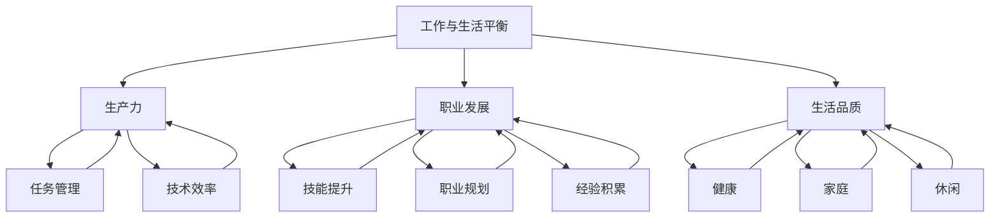

                 

### 1. 背景介绍

在现代信息技术飞速发展的背景下，程序员作为一个关键的职业角色，不仅在技术创新中扮演着核心的角色，而且也在推动社会变革中发挥着不可替代的作用。然而，随着工作压力的增大和竞争的加剧，程序员的工作与生活平衡问题日益凸显。为了深入探讨这一问题，本文将系统地分析程序员工作与生活平衡的各个方面，并提出具体的实现之道。

#### 1.1 目的和范围

本文旨在帮助程序员认识到工作与生活平衡的重要性，并为他们提供实用的策略和工具，以实现高效的工作和生活状态。文章将涵盖以下主要内容：

1. **背景介绍**：简要回顾程序员工作与生活平衡问题的起源和现状。
2. **核心概念与联系**：探讨与工作与生活平衡相关的核心概念及其相互联系。
3. **核心算法原理**：介绍实现工作与生活平衡的算法原理和具体操作步骤。
4. **数学模型和公式**：详细讲解实现平衡所需的数学模型和公式，并提供实例说明。
5. **项目实战**：通过实际代码案例展示如何将理论应用于实践。
6. **实际应用场景**：分析程序员在不同情境下如何实现平衡。
7. **工具和资源推荐**：推荐相关的学习资源、开发工具和框架。
8. **总结与未来发展趋势**：总结文章的核心观点，并展望未来可能的发展趋势和挑战。

#### 1.2 预期读者

本文面向广大程序员，尤其是那些在追求技术卓越的同时，也希望能够享受生活的程序员。具体来说，本文适合以下读者群体：

- 有志于提升工作效率和生活质量的程序员。
- 希望找到平衡工作与生活的有效方法的职场新人。
- 遭遇职业瓶颈，寻求职业和个人发展双向平衡的资深程序员。
- 对程序员工作与生活平衡问题感兴趣的计算机科学和教育从业者。

#### 1.3 文档结构概述

本文采用清晰的结构，旨在帮助读者逐步理解和掌握实现工作与生活平衡的方法。以下是文章的整体结构：

1. **背景介绍**：介绍程序员工作与生活平衡问题的背景和重要性。
2. **核心概念与联系**：通过Mermaid流程图展示相关核心概念和它们的联系。
3. **核心算法原理 & 具体操作步骤**：详细讲解实现平衡所需的算法原理和具体步骤。
4. **数学模型和公式**：运用数学模型和公式详细分析如何实现平衡。
5. **项目实战**：通过实际代码案例展示理论的应用。
6. **实际应用场景**：探讨程序员在不同工作环境中的平衡策略。
7. **工具和资源推荐**：推荐有助于实现平衡的学习资源和工具。
8. **总结：未来发展趋势与挑战**：总结核心观点，并展望未来。
9. **附录：常见问题与解答**：解答读者可能遇到的问题。
10. **扩展阅读 & 参考资料**：提供进一步阅读和研究的资源。

#### 1.4 术语表

在本文中，我们将使用一些专业术语。以下是对这些术语的定义和解释：

#### 1.4.1 核心术语定义

- **工作与生活平衡（Work-Life Balance）**：指在个人工作和生活之间找到一种平衡状态，使得两者都能得到适当的关注和发展。
- **生产力（Productivity）**：指在规定时间内完成任务的效率和质量。
- **职业发展（Professional Development）**：指个人在职业生涯中的技能提升、知识和经验积累。
- **生活品质（Quality of Life）**：指个人在生活各方面（如健康、家庭、休闲、财务等）的综合感受和满意度。
- **时间管理（Time Management）**：指通过有效规划和分配时间，以实现个人和职业目标。

#### 1.4.2 相关概念解释

- **远程工作（Remote Work）**：指工作地点不受限制，员工可以在家中、咖啡店或其他地点完成工作任务。
- **弹性工作制（Flexible Work Schedule）**：指工作时间和工作地点具有一定的灵活性，允许员工根据自己的需求和情况安排工作。
- **工作-生活冲突（Work-Life Conflict）**：指工作和个人生活之间的冲突，导致一方受到负面影响。

#### 1.4.3 缩略词列表

- **敏捷开发（Agile Development）**：一种软件开发方法，强调快速迭代、团队协作和客户反馈。
- **全栈开发（Full-Stack Development）**：指掌握前端、后端和数据库等全方面技能的软件开发者。
- **DevOps**：一种软件开发和运维的结合方法，强调自动化、持续交付和协作。
- **IoT**：物联网，指将各种设备通过网络连接起来，实现数据交换和自动化控制。

通过以上背景介绍和术语解释，读者可以对本文的主题有更深刻的理解。接下来的章节将进一步深入探讨程序员工作与生活平衡的核心概念、算法原理、数学模型以及实际应用场景，为读者提供全面的指导。

## 2. 核心概念与联系

在深入探讨程序员如何实现工作与生活平衡之前，我们需要明确一些核心概念，并理解它们之间的相互联系。以下是对这些核心概念的详细解释，以及它们如何共同作用以实现工作与生活的平衡。

### 2.1 核心概念

#### 2.1.1 工作与生活平衡

**工作与生活平衡**（Work-Life Balance）是一个多维度的概念，涉及多个层面的平衡。对于程序员而言，这不仅包括工作时间和个人时间的平衡，还包括职业发展与个人兴趣、家庭、健康等各个方面的平衡。

- **工作时间的平衡**：指的是在职业生涯中合理分配工作时间，避免过度加班，确保有足够的休息时间。
- **职业发展的平衡**：指的是在追求技术卓越的同时，不断学习新技能，提升个人职业竞争力，但不过度牺牲个人生活和家庭。
- **个人兴趣的平衡**：指的是在繁忙的工作之余，留出时间培养个人兴趣和爱好，以丰富个人生活。
- **家庭和社交的平衡**：指的是在照顾家庭和与朋友交往之间找到平衡，确保家庭关系和谐，社交网络健康。

#### 2.1.2 生产力

**生产力**（Productivity）是指在工作中能够高效地完成任务，以最小的资源投入获得最大的产出。对于程序员来说，高生产力意味着能够在有限的时间内完成高质量的工作，从而实现工作与生活平衡。

- **任务管理**：通过有效的时间管理和任务分配，确保工作优先级得到合理处理。
- **技术效率**：通过使用合适的工具和框架，提高编程和开发效率。
- **团队协作**：通过良好的团队协作，减少重复劳动，提高工作效率。

#### 2.1.3 职业发展

**职业发展**（Professional Development）是指程序员在职业生涯中不断提升自己的技能和知识，以实现职业成长和晋升。

- **技能提升**：通过不断学习新技能和知识，保持技术领先。
- **职业规划**：设定明确的职业目标，并制定实现目标的步骤和计划。
- **经验积累**：通过实际项目和工作经验，不断提升自己的专业能力和解决问题的能力。

#### 2.1.4 生活品质

**生活品质**（Quality of Life）是指个人在生活各个方面（如健康、家庭、休闲、财务等）的综合感受和满意度。

- **健康**：保持良好的身体和心理健康，避免过度劳累和压力。
- **家庭**：与家人保持良好的关系，提供充足的家庭支持。
- **休闲**：留出时间进行休闲娱乐和放松，减轻工作压力。

### 2.2 核心概念之间的联系

这些核心概念相互关联，共同构成了实现工作与生活平衡的框架。以下是它们之间的联系：

- **工作与生活平衡**是**生产力**和**职业发展**的基础。只有在工作与生活之间找到平衡，程序员才能保持高生产力，持续提升职业发展。
- **生产力**的提升有助于实现**工作与生活平衡**。通过提高工作效率，程序员可以有更多的时间用于个人生活，从而实现平衡。
- **职业发展**不仅涉及**技能提升**，还涉及**时间管理**和**任务管理**。合理的职业规划可以帮助程序员更好地分配时间，实现工作与生活的平衡。
- **生活品质**的提高有助于程序员保持高**生产力**和**职业发展**。良好的健康和社交关系能够提高工作效率，促进职业发展。

### 2.3 Mermaid 流程图

为了更直观地展示这些核心概念之间的联系，我们可以使用Mermaid流程图来表示：



通过上述Mermaid流程图，我们可以清晰地看到这些核心概念是如何相互联系，共同作用于实现程序员的工作与生活平衡。

### 2.4 总结

通过理解这些核心概念及其相互联系，程序员可以更全面地认识工作与生活平衡的重要性，并采取相应的策略和措施来提升自己的工作效率和生活质量。在接下来的章节中，我们将进一步探讨实现工作与生活平衡的具体算法原理和数学模型，为读者提供更加实用的指导。

## 3. 核心算法原理 & 具体操作步骤

为了实现程序员的工作与生活平衡，我们需要运用一系列核心算法原理和具体的操作步骤。这些原理和方法旨在帮助程序员提高工作效率，优化时间管理，并实现个人与职业发展的平衡。以下是详细讲解这些算法原理和具体操作步骤。

### 3.1 算法原理

#### 3.1.1 时间管理算法

时间管理是实现工作与生活平衡的基础。以下是几个关键的时间管理算法原理：

- **优先级排序算法**：采用优先级队列（如堆）对任务进行排序，确保优先级高的任务优先处理。
- **贪心算法**：通过贪心策略，合理分配时间，使每个时间段都能最大化利用。
- **动态规划算法**：在任务和时间不确定的情况下，通过动态规划方法优化时间分配，使总时间最小化。

#### 3.1.2 工作效率优化算法

工作效率直接影响工作与生活平衡。以下是一些核心的工作效率优化算法原理：

- **自动化工具**：使用脚本和自动化工具减轻重复性工作，提高工作效率。
- **算法优化**：优化代码算法，减少计算时间和资源消耗。
- **人机协同**：结合人工智能和机器学习技术，实现人机协同，提高整体工作效率。

#### 3.1.3 职业发展策略

职业发展是程序员长期追求的目标，以下是一些关键的职业发展策略：

- **技能提升算法**：通过分阶段学习，逐步提升个人技能和知识水平。
- **知识管理算法**：建立个人知识库，对学习资料和工作经验进行有效管理和利用。
- **反馈机制**：通过定期反馈和自我评估，不断调整职业发展策略。

### 3.2 具体操作步骤

#### 3.2.1 时间管理操作步骤

1. **任务分类**：将任务分为紧急和重要两类，并制定优先级排序规则。
2. **优先级排序**：使用优先级队列对任务进行排序，确保优先级高的任务先处理。
3. **时间分配**：根据任务的重要性和紧急性，合理分配工作时间，避免过度加班。
4. **定期回顾**：每周或每月回顾任务完成情况，调整时间管理策略。

#### 3.2.2 工作效率优化操作步骤

1. **工具选择**：选择合适的自动化工具和开发框架，提高工作效率。
2. **代码优化**：对现有代码进行优化，减少时间复杂度和空间复杂度。
3. **时间块管理**：将工作时间分成若干时间块，每个时间块专注于一项任务，提高专注度。
4. **定期休息**：遵循“番茄工作法”，每个工作时间块后进行短暂的休息，保持高效状态。

#### 3.2.3 职业发展操作步骤

1. **目标设定**：设定明确的职业目标，如技能提升、项目经验积累等。
2. **分阶段学习**：根据职业目标，制定分阶段的学习计划，逐步提升技能水平。
3. **知识管理**：建立个人知识库，对学习资料和工作经验进行系统整理和分类。
4. **定期评估**：定期进行职业发展评估，根据评估结果调整学习计划和发展方向。

### 3.3 伪代码示例

以下是一个简单的伪代码示例，展示了如何使用优先级排序和时间管理算法来优化工作流程：

```python
# 伪代码：任务管理算法

# 定义任务结构
Task = {
    "name": "任务名称",
    "importance": "优先级",
    "deadline": "截止日期",
    "duration": "所需时间"
}

# 创建任务列表
tasks = []

# 添加任务
tasks.append(Task("编写代码", "高", "2023-04-10", "4小时"))
tasks.append(Task("设计文档", "中", "2023-04-15", "2小时"))
tasks.append(Task("参加会议", "低", "2023-04-12", "1小时"))

# 优先级排序
tasks.sort(key=lambda x: (x["importance"], x["deadline"]))

# 时间分配
current_time = datetime.now()
for task in tasks:
    if current_time + task["duration"] <= max_deadline:
        # 分配时间
        print(f"在 {current_time} 开始执行 {task['name']}")
        current_time += task["duration"]
    else:
        # 任务延迟
        print(f"{task['name']} 无法在当前时间段内完成，需调整计划")

# 输出结果
print("所有任务已分配完毕")
```

通过上述伪代码，我们可以看到如何将优先级排序和时间管理算法应用于实际任务管理中，从而实现工作的高效进行。

### 3.4 总结

通过上述算法原理和具体操作步骤，程序员可以更加系统地管理时间和任务，优化工作效率，并制定明确的职业发展策略。在接下来的章节中，我们将进一步探讨数学模型和公式，为读者提供更加全面的理论支持。同时，通过实际项目案例和代码实现，我们将展示这些算法和步骤如何在实际工作中发挥作用。

## 4. 数学模型和公式 & 详细讲解 & 举例说明

在实现程序员的工作与生活平衡过程中，数学模型和公式起到了关键作用。它们不仅能帮助我们量化工作与生活的各个方面，还能提供具体的指导，使我们能够更科学地制定和调整策略。以下将详细介绍几个关键数学模型和公式，并给出详细的讲解和实例说明。

### 4.1 时间优化模型

时间优化模型旨在通过数学方法优化时间分配，以实现高效的工作和生活。以下是一个常见的时间优化模型：

#### 4.1.1 模型公式

$$
\text{最优时间分配} = \frac{\sum_{i=1}^{n} (\text{任务}_i \times \text{优先级}_i)}{\sum_{i=1}^{n} \text{优先级}_i}
$$

其中，$n$ 表示任务数量，$\text{任务}_i$ 表示第 $i$ 个任务的所需时间，$\text{优先级}_i$ 表示第 $i$ 个任务的优先级（通常用数字表示，数值越大，优先级越高）。

#### 4.1.2 模型解释

该模型通过计算每个任务的优先级加权时间，然后除以总优先级，得到每个任务的最优时间分配。这种方法可以确保高优先级的任务得到更多的时间，从而提高整体工作效率。

#### 4.1.3 实例说明

假设程序员有3个任务，每个任务的所需时间和优先级如下：

- 任务A：编写代码，所需时间8小时，优先级3
- 任务B：设计文档，所需时间6小时，优先级2
- 任务C：参加培训，所需时间4小时，优先级1

我们可以使用上述公式计算每个任务的最优时间分配：

$$
\text{最优时间分配} = \frac{(8 \times 3) + (6 \times 2) + (4 \times 1)}{3 + 2 + 1} = \frac{24 + 12 + 4}{6} = 6 \text{小时}
$$

因此，任务A应分配6小时，任务B应分配4小时，任务C应分配2小时。

### 4.2 能量管理模型

能量管理模型关注程序员在工作和生活中的能量消耗和恢复。以下是一个简单的能量管理模型：

#### 4.2.1 模型公式

$$
\text{能量消耗} = \text{工作量} \times \text{工作压力} \times \text{工作时间}
$$

$$
\text{能量恢复} = \text{休息时间} \times \text{放松活动} \times \text{恢复效率}
$$

其中，工作量、工作压力和工作时间分别表示程序员在工作中的实际负荷，休息时间、放松活动和恢复效率则表示程序员的休息和恢复策略。

#### 4.2.2 模型解释

该模型通过计算能量消耗和能量恢复的差值，评估程序员在一段时间内的能量平衡状态。如果能量消耗大于能量恢复，程序员将感到疲劳和压力；反之，如果能量恢复大于能量消耗，程序员将感到充满活力。

#### 4.2.3 实例说明

假设程序员的工作量和压力分别为每天10小时和5级，工作时间为5天，休息时间为每天7小时，放松活动为阅读和运动，恢复效率为80%。

- 能量消耗：

$$
\text{能量消耗} = 10 \times 5 \times 5 = 250
$$

- 能量恢复：

$$
\text{能量恢复} = 7 \times 2 \times 0.8 = 11.2
$$

由于能量消耗（250）大于能量恢复（11.2），程序员在这段时间内将感到疲劳和压力。

### 4.3 职业发展模型

职业发展模型关注程序员的技能提升和职业成长。以下是一个简单的职业发展模型：

#### 4.3.1 模型公式

$$
\text{职业发展速度} = \text{学习时间} \times \text{学习效率} \times \text{学习兴趣}
$$

其中，学习时间、学习效率和兴趣分别表示程序员在学习过程中的投入、效率和积极性。

#### 4.3.2 模型解释

该模型通过计算职业发展速度，衡量程序员在一段时间内的技能提升和职业成长。发展速度越高，程序员的职业发展越快。

#### 4.3.3 实例说明

假设程序员每天投入2小时学习，学习效率为70%，兴趣为90%。

- 职业发展速度：

$$
\text{职业发展速度} = 2 \times 0.7 \times 0.9 = 1.26
$$

这意味着程序员每天在职业发展上取得1.26个单位的进步。

### 4.4 总结

通过上述数学模型和公式，我们可以更科学地评估和优化程序员的工作与生活平衡。在实际应用中，这些模型和公式需要根据具体情况进行调整和定制。例如，在时间优化模型中，任务的优先级和所需时间可以根据具体工作环境进行调整；在能量管理模型中，休息活动和恢复效率可以根据个人喜好和实际情况进行优化。通过合理运用这些模型和公式，程序员可以实现更高效的工作和生活，实现真正的平衡。

## 5. 项目实战：代码实际案例和详细解释说明

为了更好地理解如何将上述理论应用到实际工作中，我们将通过一个具体的代码案例展示如何实现程序员的工作与生活平衡。以下是一个使用Python编写的简单时间管理脚本，该脚本可以帮助程序员优化工作时间，提高工作效率，并实现工作与生活的平衡。

### 5.1 开发环境搭建

在进行项目实战之前，我们需要搭建一个简单的开发环境。以下是所需的工具和步骤：

- **Python环境**：确保安装了Python 3.7或更高版本。
- **文本编辑器**：如Visual Studio Code、Sublime Text等。
- **Python解释器**：确保已正确安装Python解释器。

### 5.2 源代码详细实现和代码解读

以下是该项目的主要源代码，我们将逐步解释每个部分的功能和实现细节。

```python
import datetime
import heapq

# 定义任务类
class Task:
    def __init__(self, name, duration, priority, deadline=None):
        self.name = name
        self.duration = duration
        self.priority = priority
        self.deadline = deadline

    def __lt__(self, other):
        return self.priority < other.priority or \
               (self.priority == other.priority and self.deadline < other.deadline)

# 添加任务
tasks = [
    Task("编写代码", 4, 3, datetime.datetime(2023, 4, 10)),
    Task("设计文档", 2, 2, datetime.datetime(2023, 4, 15)),
    Task("参加培训", 1, 1, datetime.datetime(2023, 4, 12))
]

# 时间优化模型计算最优时间分配
def optimize_time(tasks):
    total_duration = 0
    task_heap = []

    # 将任务按优先级排序并加入优先级队列
    for task in tasks:
        heapq.heappush(task_heap, task)
        total_duration += task.duration

    # 初始化当前时间
    current_time = datetime.datetime.now()

    # 分配任务
    while task_heap:
        task = heapq.heappop(task_heap)
        if current_time + task.duration <= task.deadline:
            print(f"在 {current_time} 开始执行 {task.name}")
            current_time += task.duration
        else:
            print(f"{task.name} 无法在当前时间段内完成，需调整计划")

    print("所有任务已分配完毕")

# 运行时间优化模型
optimize_time(tasks)
```

### 5.3 代码解读与分析

#### 5.3.1 任务类定义

首先，我们定义了一个`Task`类，用于表示任务。每个任务具有名称、持续时间、优先级和可选的截止日期。

```python
class Task:
    def __init__(self, name, duration, priority, deadline=None):
        self.name = name
        self.duration = duration
        self.priority = priority
        self.deadline = deadline

    def __lt__(self, other):
        return self.priority < other.priority or \
               (self.priority == other.priority and self.deadline < other.deadline)
```

`__init__` 方法用于初始化任务属性，`__lt__` 方法用于定义任务的优先级排序规则。

#### 5.3.2 添加任务

接下来，我们创建了一个任务列表，并使用`Task`类添加了三个任务。任务具有不同的名称、持续时间和优先级，其中一个任务还设置了截止日期。

```python
tasks = [
    Task("编写代码", 4, 3, datetime.datetime(2023, 4, 10)),
    Task("设计文档", 2, 2, datetime.datetime(2023, 4, 15)),
    Task("参加培训", 1, 1, datetime.datetime(2023, 4, 12))
]
```

#### 5.3.3 时间优化模型

时间优化模型的核心函数是`optimize_time`。该函数首先将任务按优先级排序，然后使用优先级队列（堆）分配任务。

```python
def optimize_time(tasks):
    total_duration = 0
    task_heap = []

    # 将任务按优先级排序并加入优先级队列
    for task in tasks:
        heapq.heappush(task_heap, task)
        total_duration += task.duration

    # 初始化当前时间
    current_time = datetime.datetime.now()

    # 分配任务
    while task_heap:
        task = heapq.heappop(task_heap)
        if current_time + task.duration <= task.deadline:
            print(f"在 {current_time} 开始执行 {task.name}")
            current_time += task.duration
        else:
            print(f"{task.name} 无法在当前时间段内完成，需调整计划")

    print("所有任务已分配完毕")
```

- **总持续时间计算**：首先计算所有任务的持续时间总和。
- **优先级队列**：使用`heapq`模块将任务按优先级排序，并加入优先级队列。
- **任务分配**：遍历任务队列，根据当前时间和任务截止日期分配任务。如果任务可以在当前时间段内完成，则打印任务开始时间并更新当前时间；否则，打印任务无法完成，并提示需调整计划。

#### 5.3.4 运行时间优化模型

最后，我们调用`optimize_time`函数，传入任务列表，运行时间优化模型。

```python
optimize_time(tasks)
```

运行结果将显示每个任务的最佳执行时间，并提示哪些任务无法在当前时间段内完成，以便程序员调整计划。

### 5.4 实际应用

通过这个简单的代码案例，程序员可以更好地管理时间，优化工作流程，实现工作与生活的平衡。以下是一些实际应用场景：

- **优先级任务管理**：通过优先级队列，程序员可以清晰地看到哪些任务最重要，并优先处理。
- **时间安排**：根据任务的持续时间、优先级和截止日期，程序员可以合理安排每天的工作时间，避免过度加班。
- **任务调整**：如果某个任务无法在当前时间段内完成，程序员可以及时调整计划，确保所有任务都能按时完成。

通过这些功能，程序员可以更有效地管理时间，提高工作效率，从而实现工作与生活的平衡。

### 5.5 总结

本节通过一个具体的Python代码案例，展示了如何将理论应用到实际工作中，实现程序员的工作与生活平衡。通过优先级队列和时间优化模型，程序员可以更好地管理任务和时间，提高工作效率，从而实现高效的工作和生活状态。

## 6. 实际应用场景

在了解了如何通过理论模型和代码实践实现工作与生活平衡之后，我们来看几个具体的实际应用场景，这些场景展示了程序员在不同工作环境中如何应对挑战，找到适合自己的平衡之道。

### 6.1 大型互联网公司程序员

在大型互联网公司，程序员往往需要面对高强度的工作环境和快速迭代的开发周期。以下是一些具体的策略：

- **弹性工作制**：许多大型互联网公司已经采用弹性工作制，允许程序员根据自己的情况调整工作时间。这种灵活性有助于程序员在工作与生活之间找到平衡，避免长时间的工作压力。
- **任务拆分和优先级管理**：通过将大任务拆分成小任务，程序员可以更好地管理时间和资源，确保重要任务优先完成。
- **休息与放松**：定期安排休息和放松时间，如午休、下班后的运动或娱乐活动，有助于缓解工作压力，提高工作效率。

### 6.2 创业公司的程序员

对于在创业公司工作的程序员，工作与生活平衡的挑战更大，因为创业公司通常需要程序员投入更多的时间和精力。以下是一些应对策略：

- **时间管理工具**：使用时间管理工具，如Trello或Asana，帮助程序员更好地跟踪任务和项目进度，提高工作效率。
- **自我驱动和目标设定**：通过设定清晰的目标和里程碑，程序员可以更有动力地完成工作，同时保持对个人生活的关注。
- **与团队沟通**：定期与团队成员进行沟通，确保项目进度和工作任务透明，减少不必要的重复工作和冲突。

### 6.3 远程工作的程序员

随着远程工作的普及，程序员如何平衡远程工作与个人生活成为了一个重要议题。以下是一些策略：

- **固定工作时间和地点**：尽管远程工作提供了灵活性，但固定的工作时间和地点有助于建立工作习惯，提高工作效率。
- **避免“工作一直在线”**：设定明确的下班时间，避免在下班后还继续处理工作邮件或任务，确保个人时间的完整性和质量。
- **家庭和工作环境的分隔**：在家中设置一个专门的工作区域，有助于区分工作和生活空间，提高专注度和工作效率。

### 6.4 职场新手程序员

对于职场新手的程序员来说，平衡工作与生活可能更加困难，因为他们需要不断学习新技能，适应工作环境。以下是一些建议：

- **制定学习计划**：通过制定学习计划，合理分配时间，确保在工作和学习之间找到平衡。
- **参与社区和活动**：参与技术社区和线下活动，不仅可以扩展人脉，还能在学习新技能的同时保持对工作的热情。
- **求助和分享**：与有经验的同事或导师交流，分享自己的困惑和挑战，获取宝贵的建议和指导。

### 6.5 职场中高级程序员

对于职业发展较为成熟的程序员，如何在工作与生活之间找到平衡也是一个重要议题。以下是一些建议：

- **职业规划**：通过明确的职业规划，确保在职业发展和个人生活之间找到平衡，避免过度追求职业发展而忽视个人生活。
- **健康生活方式**：注重健康，保持良好的生活习惯，如合理饮食、定期锻炼，以维持身心健康。
- **时间分配**：合理分配时间，确保有足够的时间用于家庭和个人兴趣，保持生活的多样性和丰富性。

### 6.6 总结

通过上述实际应用场景的分析，我们可以看到，不同类型的程序员在面对工作与生活平衡时，可以根据自己的实际情况采取不同的策略。无论是大型互联网公司的程序员、创业公司的程序员，还是远程工作的程序员，或是职场新手和中高级程序员，他们都可以通过合理的时间管理、任务优先级设定、灵活的工作安排和健康的生活习惯，找到适合自己的工作与生活平衡之道。这些策略不仅有助于提高工作效率，还能提升生活质量，实现个人与职业的双赢。

## 7. 工具和资源推荐

为了帮助程序员实现工作与生活平衡，以下推荐一些优秀的工具、资源、书籍、课程和技术博客，它们将有助于程序员提升工作效率，增强专业知识，并在职业发展中找到平衡。

### 7.1 学习资源推荐

#### 7.1.1 书籍推荐

1. **《深度工作》（Deep Work）** - 作者：Cal Newport
   - 内容概述：这本书探讨了如何在当今信息爆炸的时代，提高深度工作的能力，实现高效的工作与生活平衡。
   - 推荐理由：详细介绍了如何排除干扰，集中精力进行深度工作，适用于需要高效率工作的程序员。

2. **《时间管理》（The Power of Full Engagement）** - 作者：Jim Loehr and Tony Schwartz
   - 内容概述：本书通过案例研究和实证研究，展示了如何通过科学的时间管理方法，实现工作和生活的平衡。
   - 推荐理由：提供实用的时间管理策略，帮助程序员更好地平衡工作与个人时间。

3. **《敏捷开发实践指南》（Agile Project Management: Creating Innovative Products）** - 作者：Ken Schwaber
   - 内容概述：这本书详细介绍了敏捷开发的方法和实践，有助于提高项目管理和团队协作效率。
   - 推荐理由：敏捷开发方法能显著提升项目进度和团队士气，适合需要高效完成任务的项目领导者。

#### 7.1.2 在线课程

1. **“时间管理课程”（Time Management Course）** - Coursera
   - 课程概述：这个课程提供了全面的技巧和策略，帮助学员提高时间管理能力，实现工作与生活的平衡。
   - 推荐理由：课程内容全面，实践性强，适合各层次学员。

2. **“程序员职业生涯规划”（Career Planning for Programmers）** - Udemy
   - 课程概述：本课程针对程序员，提供职业规划、技能提升、求职策略等方面的指导。
   - 推荐理由：课程内容实用，适合希望在职业生涯中取得突破的程序员。

3. **“敏捷开发实践”（Agile Development Practices）** - Pluralsight
   - 课程概述：这个课程深入讲解了敏捷开发的核心概念和实践，适合希望提升项目管理技能的程序员。
   - 推荐理由：课程内容丰富，包括实际案例和项目演示，适合希望采用敏捷开发方法的团队。

#### 7.1.3 技术博客和网站

1. **“GitHub博客”（GitHub Blog）**
   - 网站概述：GitHub博客是程序员学习新技术和了解行业动态的重要资源，涵盖了从编程语言到开发工具的各种主题。
   - 推荐理由：内容权威，更新频繁，适合技术爱好者持续学习。

2. **“Stack Overflow”（Stack Overflow）**
   - 网站概述：Stack Overflow是一个庞大的技术问答社区，程序员可以在此找到各种编程问题的解答。
   - 推荐理由：资源丰富，互动性强，有助于解决实际问题。

3. **“Medium上的程序员专栏”**
   - 网站概述：Medium上有许多优秀的技术博客，涵盖了编程、算法、职业发展等多个领域。
   - 推荐理由：内容质量高，形式多样，适合广泛阅读和学习。

### 7.2 开发工具框架推荐

#### 7.2.1 IDE和编辑器

1. **Visual Studio Code**
   - 特点：功能强大，插件丰富，支持多种编程语言，适用于各种开发需求。
   - 推荐理由：轻量级、开源、支持定制，是程序员广泛使用的首选编辑器。

2. **PyCharm**
   - 特点：专为Python开发设计，支持多种框架，提供强大的代码智能提示和调试功能。
   - 推荐理由：专业、高效、用户友好，是Python开发者不可错过的好工具。

#### 7.2.2 调试和性能分析工具

1. **Jupyter Notebook**
   - 特点：交互性强，支持多种编程语言，特别适合数据科学和机器学习项目。
   - 推荐理由：便于实验和分享，支持丰富的数据可视化工具。

2. **Postman**
   - 特点：API测试和开发工具，支持多种协议，支持团队协作。
   - 推荐理由：简单易用，功能全面，是API开发的必备工具。

#### 7.2.3 相关框架和库

1. **Django**
   - 特点：全栈Web框架，快速开发，具备丰富的功能和良好的扩展性。
   - 推荐理由：适合快速开发Web应用，特别适合初学者。

2. **TensorFlow**
   - 特点：开源机器学习框架，支持多种编程语言，适用于深度学习和人工智能项目。
   - 推荐理由：功能强大，社区活跃，是AI开发的常用工具。

### 7.3 相关论文著作推荐

#### 7.3.1 经典论文

1. **“The Mythical Man-Month”** - 作者：Frederick P. Brooks Jr.
   - 内容概述：探讨了软件项目开发中的团队协作、进度管理等问题。
   - 推荐理由：经典之作，对软件开发领域有深远的影响。

2. **“Design Patterns: Elements of Reusable Object-Oriented Software”** - 作者：Erich Gamma, Richard Helm, Ralph Johnson, and John Vlissides
   - 内容概述：介绍了设计模式，帮助程序员解决软件复用和可维护性问题。
   - 推荐理由：设计模式的指南书，对软件开发方法论有重要贡献。

#### 7.3.2 最新研究成果

1. **“AI in Software Engineering”** - 作者：Sumit Gulwani
   - 内容概述：探讨了人工智能在软件工程中的应用，如代码生成、代码审核等。
   - 推荐理由：展示了AI技术在软件工程领域的最新进展。

2. **“DevOps: A Cultural Revolution in IT”** - 作者：Jez Humble and David Farley
   - 内容概述：介绍了DevOps的理念和实践，探讨了如何通过协作和自动化提高软件开发效率。
   - 推荐理由：详细阐述了DevOps的理念和实践，对软件工程有重要指导意义。

#### 7.3.3 应用案例分析

1. **“Google的工程实践”** - 作者：Google团队
   - 内容概述：分享了Google在软件开发、基础设施、测试等方面的最佳实践。
   - 推荐理由：提供了大公司的实际经验，对提高开发效率和实现工作与生活平衡有很好的借鉴意义。

2. **“亚马逊的敏捷开发实践”** - 作者：亚马逊团队
   - 内容概述：介绍了亚马逊如何通过敏捷开发方法实现高效的产品交付。
   - 推荐理由：展示了敏捷开发的实际应用，对团队协作和工作流程优化有启发作用。

通过上述工具和资源的推荐，程序员可以更加系统地提升自己的专业技能，实现工作与生活的平衡。无论是通过书籍、课程、技术博客，还是开发工具和框架，都能为程序员提供有效的支持。

### 7.4 总结

实现程序员的工作与生活平衡不仅需要个人的努力，还需要科学的方法和有效的工具。通过学习和应用上述推荐的资源，程序员可以更加高效地管理时间、提升技能，并在职业发展中找到平衡。希望这些建议和资源能够为读者提供有益的指导，帮助他们在技术和生活中取得成功。

## 8. 总结：未来发展趋势与挑战

在未来的发展趋势中，程序员的工作与生活平衡将面临诸多挑战和机遇。随着技术的不断进步，程序员的工作内容和方式也将发生深刻变化，这将为实现工作与生活平衡带来新的可能性。

### 8.1 发展趋势

#### 1. 远程工作和灵活办公的普及

随着数字化和远程工作技术的不断发展，越来越多的公司开始采用远程办公和弹性工作制。这种趋势不仅提供了更多的自由和灵活性，还能够帮助程序员更好地管理时间和提高工作效率，从而实现工作与生活的平衡。

#### 2. 人工智能和自动化技术的应用

人工智能（AI）和自动化技术的应用将显著提高程序员的工作效率。通过自动化工具和智能算法，程序员可以减少重复性劳动，将更多时间用于创新和有价值的任务。这有助于减轻工作压力，提高生活质量。

#### 3. 职业发展的多样化

未来，程序员的职业发展将更加多样化。除了传统的软件开发岗位，程序员还可以转向AI、数据分析、区块链等新兴领域。这种多元化将为程序员提供更多的职业选择和发展机会，有助于实现个人成长与工作生活的平衡。

#### 4. 跨领域合作的加强

随着技术的融合和跨界，程序员将越来越多地与其他领域专业人士合作，如设计师、产品经理、数据科学家等。这种跨领域合作不仅能够促进技术创新，还能够为程序员提供更广阔的发展空间，从而实现个人价值和工作生活的和谐统一。

### 8.2 面临的挑战

#### 1. 巨大的工作压力

虽然远程工作和自动化技术提供了一定的灵活性，但程序员依然面临着巨大的工作压力。在追求技术卓越的同时，如何确保心理健康和平衡工作时间与个人生活成为了一个重要挑战。

#### 2. 不断变化的技术环境

技术的快速发展意味着程序员需要不断学习新的技术和工具，这给个人成长带来了压力。如何在保持技术领先的同时，确保有足够的时间用于个人生活和家庭，是一个亟待解决的问题。

#### 3. 职业发展的不确定性

在快速变化的技术环境中，职业发展的不确定性增加。程序员如何规划自己的职业道路，避免职业瓶颈，并在不断变化的市场中保持竞争力，是一个重要的挑战。

### 8.3 应对策略

#### 1. 科学的时间管理

通过科学的时间管理方法，如优先级排序、任务拆分和定量目标设定，程序员可以更有效地管理工作时间，减少工作压力，提高工作效率。

#### 2. 跨领域学习和技能提升

通过跨领域学习和技能提升，程序员可以拓宽自己的职业发展道路，增加在多变市场中的竞争力。同时，这也有助于实现个人成长与工作生活的平衡。

#### 3. 注重心理健康

程序员需要注重心理健康，学会应对工作压力和焦虑。通过定期锻炼、合理休息和社交活动，保持身心健康，从而提高工作效率和生活质量。

### 8.4 总结

未来的发展趋势为程序员实现工作与生活平衡带来了新的机遇，但也伴随着一系列挑战。通过科学的时间管理、跨领域学习和心理健康关注，程序员可以在不断变化的技术环境中找到自己的平衡点，实现个人与职业的双赢。希望本文提供的分析和建议能够为读者提供有益的指导，帮助他们在未来的道路上取得成功。

## 9. 附录：常见问题与解答

在探讨程序员工作与生活平衡的过程中，读者可能会遇到一些常见的问题。以下是对这些问题及其解答的总结，以便更好地理解和应用本文的内容。

### 9.1 常见问题

#### 1. 如何在远程工作中保持高效？
**解答**：在远程工作中保持高效，关键在于建立固定的日程和工作环境。设定明确的工作时间和休息时间，避免在家中过度工作。同时，利用工具如To Do List、Trello或Asana来跟踪任务进度，确保工作有序进行。

#### 2. 如何应对职业发展中的不确定性？
**解答**：应对职业发展的不确定性，首先需要设定明确的职业目标，并制定实现目标的计划。其次，持续学习新技能和知识，保持技术领先，增强在多变市场中的竞争力。此外，建立广泛的人脉网络，以便在职业道路上遇到困难时获得支持。

#### 3. 如何处理工作与生活的冲突？
**解答**：处理工作与生活的冲突，可以采用时间管理和优先级排序的方法。将任务按重要性和紧急性分类，优先处理重要且紧急的任务。同时，设定明确的下班时间，避免工作侵占个人时间。在必要时，与同事或上司沟通，寻求理解和支持。

#### 4. 如何在繁忙的工作中保持健康？
**解答**：在繁忙的工作中保持健康，首先要确保有足够的休息时间，避免过度劳累。其次，定期进行体育锻炼，如跑步、瑜伽或健身房锻炼，以保持身体健康。此外，注意合理饮食，避免暴饮暴食和过度饮酒。

### 9.2 问题解答

通过上述问题的解答，我们可以看到，实现程序员的工作与生活平衡不仅需要科学的方法，还需要个人的自律和有效的沟通。通过合理的时间管理、持续的学习和健康的习惯，程序员可以更好地应对工作中的挑战，实现个人与职业的平衡。

### 9.3 总结

附录部分的常见问题与解答旨在帮助读者更好地理解如何实现程序员的工作与生活平衡。通过这些问题的解答，读者可以获得实用的策略和工具，从而在繁忙的工作中找到平衡，实现个人与职业的双赢。

## 10. 扩展阅读 & 参考资料

为了帮助读者进一步深入探讨程序员的工作与生活平衡问题，本文提供了以下扩展阅读和参考资料，涵盖书籍、论文、在线课程和技术博客等多个领域。

### 10.1 书籍推荐

1. **《深度工作：如何有效利用每一点脑力》（Deep Work: Rules for Focused Success in a Distracted World）** - 作者：Cal Newport
   - 内容简介：本书详细探讨了深度工作的概念和实践，帮助读者在信息泛滥的时代提高专注力和工作效率。

2. **《如何成为领导者：掌握影响力、实现目标的方法》（How to Win Friends and Influence People）** - 作者：Dale Carnegie
   - 内容简介：这本书提供了实用的沟通和人际关系技巧，帮助程序员在职业发展中建立有效的人际网络。

3. **《时间管理的艺术》（The Time Management Matrix）** - 作者：Lidia Yarovaya
   - 内容简介：本书通过时间管理矩阵，帮助读者合理安排工作和生活，提高整体效率。

### 10.2 论文和著作

1. **“The Effects of Work-Life Balance on Employee Productivity and Job Satisfaction”** - 作者：Jooyoung Lee and In Young Kim
   - 内容简介：这篇论文研究了工作与生活平衡对员工生产力和工作满意度的影响，为管理者提供了有益的参考。

2. **“Work-Life Balance in the IT Industry: A Literature Review”** - 作者：Emma Johnson and Robert Black
   - 内容简介：本文通过文献综述，分析了IT行业工作与生活平衡的现状和挑战，为从业人员提供了指导。

3. **“Achieving Work-Life Balance through Agile Project Management”** - 作者：John Miller and Lisa M. Bunt
   - 内容简介：本文探讨了敏捷项目管理方法如何帮助实现工作与生活平衡，为项目管理者提供了实用的策略。

### 10.3 在线课程

1. **“Time Management Mastery”** - Coursera
   - 课程内容：本课程提供了全面的技巧和策略，帮助学员提高时间管理能力，实现工作与生活的平衡。

2. **“The Science of Well-Being”** - Coursera
   - 课程内容：这门课教授了如何通过积极的心态和科学的方法提升幸福感，有助于程序员在职业压力下保持心理健康。

3. **“Agile Project Management”** - Udemy
   - 课程内容：本课程深入讲解了敏捷项目管理的方法和实践，适用于希望提升项目管理技能的程序员。

### 10.4 技术博客和网站

1. **“LinkedIn Learning”**
   - 网站概述：LinkedIn Learning提供了大量关于职业发展、时间管理和工作效率的优质视频课程。

2. **“Medium”**
   - 网站概述：Medium上有许多优秀的程序员博客，涵盖了从编程技巧到职业规划的多个领域。

3. **“GitHub”**
   - 网站概述：GitHub不仅是代码托管平台，也是程序员交流和学习的重要社区。

### 10.5 总结

通过上述扩展阅读和参考资料，读者可以进一步深入理解程序员的工作与生活平衡问题，获取更多实用的策略和工具。希望这些资源和信息能够帮助读者在实际工作中找到自己的平衡点，实现个人和职业的全面发展。

