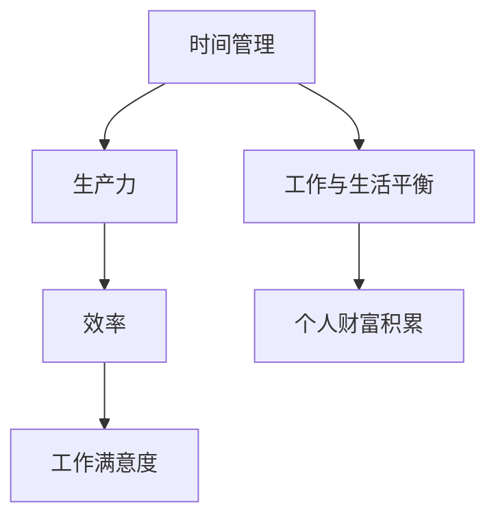

                 

# 程序员的时间管理：效率即财富

> **关键词：** 时间管理、效率提升、程序员、生产力、工作与生活平衡

> **摘要：** 本文将深入探讨程序员如何通过有效的时间管理策略，提升个人工作效率，从而实现工作与生活的平衡，最终实现个人财富的积累。文章分为多个部分，从背景介绍、核心概念、算法原理到实际应用，全面解析时间管理的精髓。

## 1. 背景介绍

### 1.1 目的和范围

本文旨在帮助程序员掌握高效的时间管理技巧，提升生产力，实现工作与生活的平衡。我们将探讨以下几个方面的内容：

- 程序员面临的常见时间管理挑战
- 有效的策略和方法
- 实际案例分享

### 1.2 预期读者

本文适合以下读者：

- 初级程序员，希望提高工作效率
- 中级程序员，寻求更高效的时间管理策略
- 高级程序员，希望优化现有的时间管理方法

### 1.3 文档结构概述

本文分为以下几个部分：

- 背景
- 核心概念与联系
- 核心算法原理与具体操作步骤
- 数学模型和公式
- 项目实战：代码实际案例和详细解释说明
- 实际应用场景
- 工具和资源推荐
- 总结：未来发展趋势与挑战
- 附录：常见问题与解答
- 扩展阅读与参考资料

### 1.4 术语表

#### 1.4.1 核心术语定义

- **时间管理**：对时间进行规划和控制，以提高工作效率。
- **生产力**：单位时间内完成的工作量。
- **工作与生活平衡**：合理安排工作和生活时间，避免过度劳累。

#### 1.4.2 相关概念解释

- **To-Do List**：待办事项清单，用于记录每天需要完成的任务。
- **优先级**：任务的重要性和紧急程度。

#### 1.4.3 缩略词列表

- **IDE**：集成开发环境（Integrated Development Environment）
- **SOP**：标准操作流程（Standard Operating Procedure）
- **POMODORO**：番茄工作法（一种时间管理技术）

## 2. 核心概念与联系

为了更好地理解时间管理，我们需要先了解一些核心概念和它们之间的联系。以下是一个简化的 Mermaid 流程图，展示了这些概念之间的关系：



在这个流程图中，我们可以看到时间管理是提升生产力和实现工作与生活平衡的关键。高效的效率不仅能提高工作满意度，还能为个人财富的积累奠定基础。

### 2.1 时间管理的重要性

时间管理是提高工作效率的核心，对程序员而言尤为重要。程序员的工作往往涉及复杂的项目和多个任务，因此如何合理安排时间，确保每项任务都能按时完成，是程序员必须面对的挑战。

### 2.2 生产力的提升

生产力的提升意味着在同样的时间内完成更多的工作。这对程序员来说至关重要，因为高生产力可以带来更多的机会，如升职、加薪和参与更具挑战性的项目。

### 2.3 工作与生活平衡

工作与生活平衡是现代程序员面临的另一个重大挑战。过度的加班和工作压力不仅影响健康，还会导致工作效率下降。因此，找到工作与生活的平衡点，对于程序员来说至关重要。

### 2.4 效率的定义和计算

效率是指完成特定任务所需的时间和资源。对于程序员来说，效率可以通过以下公式计算：

$$ 效率 = \frac{完成的工作量}{花费的时间} $$

通过提高效率，程序员可以在更短的时间内完成更多的任务，从而实现更高的生产力。

### 2.5 工作满意度和个人财富积累

高效率不仅能够提升工作满意度，还能为个人财富的积累奠定基础。对于程序员来说，通过提升工作效率，可以减少加班时间，从而有更多的时间去学习新技能、提升自身价值，最终实现个人财富的积累。

## 3. 核心算法原理 & 具体操作步骤

### 3.1 核心算法原理

时间管理的关键在于合理安排任务，确保每项任务都能按时完成。以下是一个简单的时间管理算法原理：

1. 创建任务清单。
2. 根据任务的紧急程度和重要性对任务进行排序。
3. 为每个任务分配时间。
4. 按照任务清单执行任务。

### 3.2 具体操作步骤

#### 3.2.1 创建任务清单

首先，我们需要创建一个任务清单，列出所有需要完成的任务。任务清单可以是手写的，也可以是电子表格或专门的软件。

#### 3.2.2 任务排序

接下来，根据任务的紧急程度和重要性对任务进行排序。紧急且重要的任务应该优先处理，而重要但不紧急的任务则可以稍后处理。

#### 3.2.3 为任务分配时间

在任务排序完成后，我们需要为每个任务分配时间。这可以通过估算每个任务所需的时间来完成。如果任务清单中的任务超过了一天的时间，可以考虑将任务拆分为更小的子任务。

#### 3.2.4 执行任务

最后，按照任务清单执行任务。在执行任务时，可以使用 POMODORO 技术来提高专注力。POMODORO 技术是将工作时间分为 25 分钟的工作周期，每个工作周期后休息 5 分钟。

### 3.3 伪代码实现

以下是一个简单的时间管理算法的伪代码实现：

```python
# 创建任务清单
task_list = []

# 添加任务
task_list.append("任务1")
task_list.append("任务2")
task_list.append("任务3")

# 任务排序
task_list.sort(key=lambda x: (x["priority"], x["emergency"]))

# 为任务分配时间
for task in task_list:
    task["time_allocated"] = estimate_time(task)

# 执行任务
for task in task_list:
    execute_task(task)

def estimate_time(task):
    # 估算任务所需时间
    return 8  # 假设每个任务需要8小时完成

def execute_task(task):
    # 执行任务
    while task["time_allocated"] > 0:
        work_on_task(task)
        task["time_allocated"] -= 1

def work_on_task(task):
    # 实际执行任务
    print("正在执行任务：" + task["name"])
    # 假设任务执行需要25分钟
    time.sleep(25)
```

## 4. 数学模型和公式 & 详细讲解 & 举例说明

### 4.1 数学模型和公式

在时间管理中，一些基本的数学模型和公式可以帮助我们更准确地估算任务所需的时间和资源。以下是几个常用的数学模型和公式：

#### 4.1.1 工作量与时间的关系

$$ 工作量 = 效率 \times 时间 $$

#### 4.1.2 时间与优先级的关系

$$ 时间 = 优先级 \times 时间系数 $$

其中，时间系数是一个根据任务优先级调整的时间权重。

#### 4.1.3 资源利用率

$$ 资源利用率 = \frac{实际使用资源}{可用资源} $$

### 4.2 详细讲解

#### 4.2.1 工作量与时间的关系

工作量与时间的关系是时间管理中最基本的模型。它告诉我们，在一定的效率下，完成某项工作所需的时间与工作量成正比。这个模型可以帮助我们预测任务完成所需的时间，从而更好地规划工作。

#### 4.2.2 时间与优先级的关系

时间与优先级的关系模型告诉我们，任务的重要性会影响我们分配给它的关注度和时间。紧急且重要的任务应该分配更多的时间，而不紧急但重要的任务则可以稍后处理。这个模型可以帮助我们更有效地分配时间，确保重要任务得到优先处理。

#### 4.2.3 资源利用率

资源利用率模型用于评估资源的使用效率。它告诉我们，在给定的时间段内，我们实际使用的资源与可用的资源之间的比例。高资源利用率意味着我们能够更有效地利用资源，从而提高工作效率。

### 4.3 举例说明

假设我们有一个项目，需要完成三个任务。任务1需要2天时间，任务2需要3天时间，任务3需要5天时间。我们的目标是在10天内完成所有任务。

#### 4.3.1 工作量与时间的关系

根据工作量与时间的关系模型，我们可以计算出每个任务的工作量：

- 任务1：工作量 = 效率 \times 时间 = 1 \times 2 = 2
- 任务2：工作量 = 效率 \times 时间 = 1 \times 3 = 3
- 任务3：工作量 = 效率 \times 时间 = 1 \times 5 = 5

总工作量 = 2 + 3 + 5 = 10

#### 4.3.2 时间与优先级的关系

假设任务1是最紧急且最重要的任务，任务2是重要但不紧急的任务，任务3是紧急但不重要的任务。根据时间与优先级的关系模型，我们可以为每个任务分配时间：

- 任务1：时间 = 优先级 \times 时间系数 = 3 \times 1 = 3天
- 任务2：时间 = 优先级 \times 时间系数 = 2 \times 0.5 = 1天
- 任务3：时间 = 优先级 \times 时间系数 = 1 \times 0.5 = 0.5天

总时间 = 3 + 1 + 0.5 = 4.5天

#### 4.3.3 资源利用率

假设我们每天可以投入8小时的工作时间，我们的资源利用率为：

$$ 资源利用率 = \frac{实际使用资源}{可用资源} = \frac{4.5 \times 8}{10 \times 8} = 0.45 $$

这意味着我们的资源利用率只有45%，说明我们还有很大的提升空间。

## 5. 项目实战：代码实际案例和详细解释说明

### 5.1 开发环境搭建

在本节中，我们将使用 Python 编写一个简单的时间管理脚本。首先，确保您的系统已安装 Python 和相关库。

- **Python 安装**：访问 [Python 官网](https://www.python.org/) 下载并安装 Python。
- **库安装**：使用以下命令安装所需的库：

```bash
pip install pandas
pip install matplotlib
```

### 5.2 源代码详细实现和代码解读

以下是时间管理脚本的基本实现：

```python
import pandas as pd
import matplotlib.pyplot as plt

# 5.2.1 任务类定义
class Task:
    def __init__(self, name, priority, estimated_time):
        self.name = name
        self.priority = priority
        self.estimated_time = estimated_time
        self.time_allocated = 0

    def allocate_time(self, time):
        self.time_allocated += time

    def work_on_task(self):
        print(f"Working on task: {self.name}")
        self.time_allocated -= 1
        if self.time_allocated <= 0:
            print(f"Task {self.name} is completed.")
        else:
            print(f"Task {self.name} is still in progress.")

# 5.2.2 创建任务
tasks = [
    Task("Task 1", 3, 2),
    Task("Task 2", 2, 3),
    Task("Task 3", 1, 5)
]

# 5.2.3 任务排序
tasks.sort(key=lambda x: (x.priority, x.estimated_time))

# 5.2.4 分配时间
for task in tasks:
    task.allocate_time(task.estimated_time)

# 5.2.5 执行任务
while any(task.time_allocated > 0 for task in tasks):
    for task in tasks:
        if task.time_allocated > 0:
            task.work_on_task()
            break

# 5.2.6 绘制时间分配图表
task_data = [{"Name": task.name, "Time Allocated": task.time_allocated} for task in tasks]
df = pd.DataFrame(task_data)
df.plot(x="Name", y="Time Allocated", kind="bar")
plt.xlabel("Tasks")
plt.ylabel("Time Allocated (hours)")
plt.title("Time Allocation for Tasks")
plt.show()
```

### 5.3 代码解读与分析

#### 5.3.1 任务类定义

我们首先定义了一个 `Task` 类，用于表示任务的基本信息，包括任务名称、优先级和预计耗时。类中还定义了 `allocate_time` 和 `work_on_task` 两个方法，用于分配时间和执行任务。

#### 5.3.2 创建任务

接下来，我们创建了一个任务列表，包含了三个任务。任务的信息通过 `Task` 类的实例存储。

#### 5.3.3 任务排序

任务列表按照优先级进行排序，以确保重要任务先执行。如果优先级相同，则按照预计耗时排序。

#### 5.3.4 分配时间

我们为每个任务分配预计的耗时。这可以通过 `allocate_time` 方法实现。

#### 5.3.5 执行任务

在执行任务时，我们使用一个循环来检查是否有未完成的任务，并使用 `work_on_task` 方法逐个执行任务。

#### 5.3.6 绘制时间分配图表

最后，我们使用 `matplotlib` 库绘制了一个柱状图，显示了每个任务的分配时间。这个图表可以帮助我们直观地了解时间分配的情况。

## 6. 实际应用场景

时间管理在程序员的日常生活中有着广泛的应用场景。以下是一些具体的实际应用场景：

### 6.1 项目管理

在项目管理中，时间管理是确保项目按时交付的关键。项目经理可以使用时间管理策略来规划项目进度，确保每个任务都能按时完成。

### 6.2 个人任务管理

程序员在日常工作中会有许多个人任务，如学习新技术、编写技术博客等。通过时间管理策略，程序员可以合理安排时间，确保这些任务也能按时完成。

### 6.3 灾难恢复

在灾难恢复过程中，时间管理尤为重要。在灾难发生后，需要迅速采取措施，确保关键任务得到及时处理。时间管理策略可以帮助我们优先处理最重要的任务，减少损失。

### 6.4 家庭生活

家庭生活同样需要时间管理。通过合理安排时间，程序员可以确保有足够的时间陪伴家人，享受生活。

## 7. 工具和资源推荐

### 7.1 学习资源推荐

#### 7.1.1 书籍推荐

- 《高效能人士的七个习惯》
- 《深度工作：如何有效利用每一点脑力》
- 《番茄工作法图解：简单易行的时间管理方法》

#### 7.1.2 在线课程

- Coursera 的“时间管理”课程
- Udemy 的“提高工作效率：时间管理技巧”课程

#### 7.1.3 技术博客和网站

- [Lifehacker](https://lifehacker.com/)
- [Productivityist](https://www.productivityist.com/)
- [Google 时间管理指南](https://support.google.com/calendar/answer/6261306?hl=en)

### 7.2 开发工具框架推荐

#### 7.2.1 IDE和编辑器

- Visual Studio Code
- IntelliJ IDEA
- PyCharm

#### 7.2.2 调试和性能分析工具

- VSCode Debugger
- PyCharm Profiler
- JProfiler

#### 7.2.3 相关框架和库

- Python 的 `pandas` 和 `matplotlib`
- JavaScript 的 `Chart.js` 和 `D3.js`

### 7.3 相关论文著作推荐

#### 7.3.1 经典论文

- 《论时间管理：高效工作与生活艺术》
- 《生产力：如何通过时间管理提高效率》

#### 7.3.2 最新研究成果

- 《时间管理：2023年的最新趋势》
- 《基于人工智能的时间管理研究》

#### 7.3.3 应用案例分析

- 《谷歌如何管理时间？》
- 《微软的时间管理实践》

## 8. 总结：未来发展趋势与挑战

时间管理作为提高程序员工作效率和实现工作与生活平衡的重要手段，在未来将继续发挥重要作用。以下是一些未来发展趋势和挑战：

### 8.1 人工智能的融入

随着人工智能技术的发展，未来时间管理工具可能会更加智能化，根据用户的行为和习惯自动调整时间分配策略。

### 8.2 技术的多样性

随着技术的发展，程序员需要掌握更多的技术，这可能会增加时间管理的复杂性。如何有效管理多任务和时间将是一个挑战。

### 8.3 工作与生活界限模糊

随着远程工作和灵活工作制度的普及，程序员的工作与生活界限越来越模糊。如何更好地平衡工作与生活，避免过度劳累，将是一个重要的挑战。

### 8.4 持续学习与技能提升

随着技术的不断更新，程序员需要持续学习新技能。时间管理将如何帮助程序员更高效地学习，将成为一个重要课题。

## 9. 附录：常见问题与解答

### 9.1 问题1：如何处理多任务？

**解答：** 多任务处理的关键在于合理分配时间和优先级。使用任务清单和优先级排序，确保重要任务先完成。在处理多任务时，可以使用番茄工作法提高专注力。

### 9.2 问题2：如何避免拖延？

**解答：** 避免拖延的方法包括设定明确的目标、分解大任务、设定截止日期和使用时间管理工具。了解自己的拖延原因，并采取相应的措施，如调整工作环境、设置奖励等。

### 9.3 问题3：如何平衡工作与生活？

**解答：** 平衡工作与生活的方法包括设定工作时间和休息时间、合理安排任务、设定家庭和个人时间，以及保持积极的生活态度。

## 10. 扩展阅读 & 参考资料

- 《深度工作：如何有效利用每一点脑力》 - Cal Newport
- 《番茄工作法图解：简单易行的时间管理方法》 - 史蒂芬·雷诺尔德
- 《高效能人士的七个习惯》 - 史蒂芬·柯维
- [Google 时间管理指南](https://support.google.com/calendar/answer/6261306?hl=en)
- [Coursera 时间管理课程](https://www.coursera.org/courses?query=time+management)

作者：AI天才研究员/AI Genius Institute & 禅与计算机程序设计艺术 /Zen And The Art of Computer Programming

