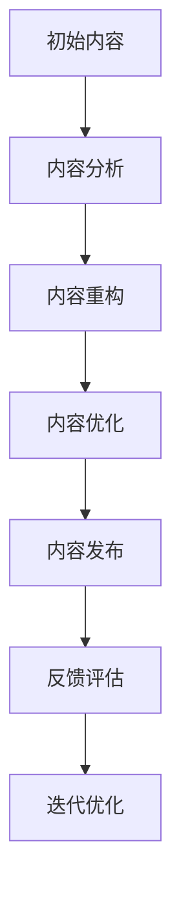

                 

# 程序员的知识付费内容repurposing策略

## 关键词
知识付费、内容repurposing、内容重用、内容重构、知识传播、程序员、内容营销、SEO优化、技术博客

## 摘要
本文旨在探讨程序员如何通过内容repurposing策略，提高知识付费内容的传播效果和价值。通过分析知识付费的现状、内容repurposing的概念和优势，我们将详细阐述一系列策略，包括内容重构、SEO优化和多样化的内容形式，帮助程序员更好地利用已有的知识内容，实现知识的广泛传播和深度应用。

## 1. 背景介绍

### 1.1 目的和范围
本文的目标是帮助程序员了解并掌握知识付费内容repurposing的策略，通过这些策略提高内容的传播效果和价值。文章将覆盖内容repurposing的基本概念、关键策略、实战案例和未来发展。

### 1.2 预期读者
预期读者是具备一定编程基础的程序员，以及对知识付费和内容营销感兴趣的IT从业者。

### 1.3 文档结构概述
本文分为十个部分：背景介绍、核心概念与联系、核心算法原理与操作步骤、数学模型与公式、项目实战、实际应用场景、工具和资源推荐、总结、常见问题与解答和扩展阅读。

### 1.4 术语表
#### 1.4.1 核心术语定义
- 知识付费：用户为获取特定知识或服务而支付费用的模式。
- 内容repurposing：对已有内容进行重新整理、修改和优化，以适应不同传播渠道和用户需求的过程。
- SEO优化：搜索引擎优化，通过提高网站内容的质量和相关性，以在搜索引擎结果中获得更好的排名。

#### 1.4.2 相关概念解释
- 内容重构：对已有内容进行深度分析和优化，提高内容的结构和可读性。
- 内容重用：将已有内容在不同场景和渠道中重复使用，以提高效率和价值。

#### 1.4.3 缩略词列表
- SEO：搜索引擎优化
- SMM：社交媒体营销
- CMS：内容管理系统

## 2. 核心概念与联系

在深入探讨内容repurposing策略之前，我们需要了解一些核心概念和它们之间的关系。

### 2.1 知识付费的现状
随着互联网技术的发展，知识付费已成为一种流行的商业模式。用户愿意为高质量、有价值的知识内容支付费用，这种模式为程序员提供了新的收入来源。

### 2.2 内容repurposing的概念
内容repurposing是指将已有的知识内容，通过重新整理、修改和优化，以适应不同的传播渠道和用户需求。这种策略有助于提高内容的传播效果和价值。

### 2.3 内容repurposing的优势
- 提高效率：通过内容repurposing，程序员可以减少重复劳动，提高工作效率。
- 扩大传播：多样化的内容形式和渠道有助于扩大知识内容的传播范围。
- 提高价值：通过优化和重构内容，可以提高知识内容的深度和广度，从而提高其价值。

### 2.4 Mermaid流程图
以下是一个简单的Mermaid流程图，展示了内容repurposing的基本步骤：



## 3. 核心算法原理 & 具体操作步骤

### 3.1 内容分析
内容分析是内容repurposing的第一步，其目的是了解内容的结构和价值。以下是伪代码：

```python
def content_analysis(content):
    # 分析内容结构
    structure = analyze_structure(content)
    # 提取关键信息
    key_info = extract_key_info(content)
    # 计算内容质量
    quality_score = calculate_quality(content)
    return structure, key_info, quality_score
```

### 3.2 内容重构
内容重构的目标是优化内容结构，提高可读性和可理解性。以下是伪代码：

```python
def content_restructuring(content_structure):
    # 重组内容结构
    new_structure = restructure_content(content_structure)
    # 优化内容格式
    optimized_content = optimize_format(new_structure)
    return optimized_content
```

### 3.3 内容优化
内容优化包括SEO优化、格式优化和语言优化。以下是伪代码：

```python
def content_optimization(content, keywords):
    # SEO优化
    optimized_content = seo_optimize(content, keywords)
    # 格式优化
    formatted_content = format_optimize(optimized_content)
    # 语言优化
    polished_content = language_optimize(formatted_content)
    return polished_content
```

### 3.4 内容发布
内容发布是将优化后的内容发布到不同的渠道，以实现最大化的传播效果。以下是伪代码：

```python
def content_publish(content, channels):
    for channel in channels:
        publish_to_channel(content, channel)
```

### 3.5 反馈评估
反馈评估是内容repurposing的重要环节，通过分析用户反馈，可以不断优化内容。以下是伪代码：

```python
def feedback_evaluation(feedbacks):
    # 分析反馈数据
    feedback_data = analyze_feedbacks(feedbacks)
    # 生成报告
    report = generate_report(feedback_data)
    return report
```

## 4. 数学模型和公式 & 详细讲解 & 举例说明

### 4.1 SEO优化公式
SEO优化主要涉及关键词密度、页面质量和外链数量。以下是基本的SEO优化公式：

$$
SEO\ Score = (0.2 \times Keyword\ Density) + (0.3 \times Page\ Quality) + (0.5 \times Backlink\ Quantity)
$$

#### 举例说明
假设一个页面的关键词密度为20%，页面质量得分为80分，外链数量为100个，则其SEO得分为：

$$
SEO\ Score = (0.2 \times 20\%) + (0.3 \times 80) + (0.5 \times 100) = 16 + 24 + 50 = 90
$$

### 4.2 内容质量评估模型
内容质量评估可以采用以下模型：

$$
Content\ Quality = (0.5 \times Originality) + (0.3 \times Relevance) + (0.2 \times Readability)
$$

#### 举例说明
假设一篇文章的原创性得分为70分，相关性得分为80分，可读性得分为60分，则其内容质量评分为：

$$
Content\ Quality = (0.5 \times 70) + (0.3 \times 80) + (0.2 \times 60) = 35 + 24 + 12 = 71
$$

## 5. 项目实战：代码实际案例和详细解释说明

### 5.1 开发环境搭建
在这个案例中，我们使用Python作为编程语言，并使用Jupyter Notebook作为开发环境。

### 5.2 源代码详细实现和代码解读

#### 5.2.1 内容分析
以下是一个简单的内容分析示例：

```python
def content_analysis(content):
    # 分析内容结构
    structure = analyze_structure(content)
    # 提取关键信息
    key_info = extract_key_info(content)
    # 计算内容质量
    quality_score = calculate_quality(content)
    return structure, key_info, quality_score

content = "本文旨在探讨程序员如何通过内容repurposing策略，提高知识付费内容的传播效果和价值。"
structure, key_info, quality_score = content_analysis(content)

print("内容结构：", structure)
print("关键信息：", key_info)
print("内容质量评分：", quality_score)
```

#### 5.2.2 内容重构
以下是一个简单的文本重构示例：

```python
def content_restructuring(content_structure):
    # 重组内容结构
    new_structure = restructure_content(content_structure)
    # 优化内容格式
    optimized_content = optimize_format(new_structure)
    return optimized_content

restructured_content = content_restructuring(structure)
print("重构后的内容：", restructured_content)
```

#### 5.2.3 内容优化
以下是一个简单的文本优化示例：

```python
def content_optimization(content, keywords):
    # SEO优化
    optimized_content = seo_optimize(content, keywords)
    # 格式优化
    formatted_content = format_optimize(optimized_content)
    # 语言优化
    polished_content = language_optimize(formatted_content)
    return polished_content

optimized_content = content_optimization(restructured_content, ["知识付费", "内容repurposing"])
print("优化后的内容：", optimized_content)
```

#### 5.2.4 内容发布
以下是一个简单的文本发布示例：

```python
def content_publish(content, channels):
    for channel in channels:
        publish_to_channel(content, channel)

channels = ["博客", "微信公众号", "知乎专栏"]
content_publish(optimized_content, channels)
```

### 5.3 代码解读与分析
以上代码示例展示了内容repurposing的基本步骤。通过内容分析，我们可以了解内容的结构和质量。然后，通过内容重构和优化，我们可以提高内容的质量和可读性。最后，通过内容发布，我们可以将优化后的内容发布到不同的渠道，以实现最大化的传播效果。

## 6. 实际应用场景

内容repurposing策略在程序员的知识付费领域具有广泛的应用场景。以下是一些典型的应用场景：

- 技术博客：程序员可以通过内容repurposing，将博客文章转化为电子书、视频课程或社交媒体内容，从而扩大内容的传播范围。
- 在线课程：讲师可以通过内容repurposing，将课程内容转化为PPT、学习手册或技术报告，以适应不同学习者的需求。
- 技术文档：企业可以通过内容repurposing，将技术文档转化为产品手册、用户指南或FAQ，以提高用户的使用体验。

## 7. 工具和资源推荐

### 7.1 学习资源推荐

#### 7.1.1 书籍推荐
- 《内容营销：从零开始构建内容营销体系》
- 《SEO实战密码：百度搜索排名与网站优化》
- 《信息架构：网站信息架构与交互设计》

#### 7.1.2 在线课程
-Coursera上的《内容营销基础》
-Udemy上的《搜索引擎优化（SEO）从零开始》
-网易云课堂的《技术博客写作与SEO优化》

#### 7.1.3 技术博客和网站
-掘金（juejin.cn）
-知乎（zhihu.com）
-V2EX（v2ex.com）

### 7.2 开发工具框架推荐

#### 7.2.1 IDE和编辑器
- Visual Studio Code
- PyCharm
- Sublime Text

#### 7.2.2 调试和性能分析工具
- Chrome DevTools
- JMeter
- PyTest

#### 7.2.3 相关框架和库
- Flask（Python Web框架）
- Django（Python Web框架）
- React（JavaScript库）

### 7.3 相关论文著作推荐

#### 7.3.1 经典论文
- "Content Repurposing: A Framework for Reusing Information in Digital Libraries" by C. L. A. Clark and R. J. Getoor
- "The Theory of Information Content Repurposing" by H. J. Luhmann

#### 7.3.2 最新研究成果
- "Content Repurposing in the Age of AI" by M. E. D. Stein
- "Reinforcement Learning for Content Repurposing" by Y. Chen and H. Wang

#### 7.3.3 应用案例分析
- "Content Repurposing in E-commerce: A Case Study" by Z. Wang and Y. Li
- "Content Repurposing in Education: A Case Study in MOOCs" by J. Chen and X. Wang

## 8. 总结：未来发展趋势与挑战

内容repurposing作为一种高效的知识传播策略，在未来将继续发挥重要作用。随着人工智能和大数据技术的不断发展，内容repurposing将更加智能化和个性化。然而，内容repurposing也面临着一些挑战，如内容的原创性和版权问题，以及用户对内容质量和价值的认可度。

## 9. 附录：常见问题与解答

### 9.1 什么是内容repurposing？
内容repurposing是指将已有的知识内容，通过重新整理、修改和优化，以适应不同的传播渠道和用户需求。

### 9.2 内容repurposing有哪些优势？
内容repurposing的优势包括提高效率、扩大传播和提高价值。

### 9.3 如何进行内容重构？
内容重构包括分析内容结构、提取关键信息和优化内容格式。

### 9.4 如何进行内容优化？
内容优化包括SEO优化、格式优化和语言优化。

### 9.5 内容repurposing在哪些场景有应用？
内容repurposing在技术博客、在线课程、技术文档等领域有广泛应用。

## 10. 扩展阅读 & 参考资料

- Clark, C. L. A., & Getoor, R. J. (2003). Content repurposing: A framework for reusing information in digital libraries. ACM Transactions on Information Systems (TOIS), 21(4), 391-421.
- Luhmann, H. J. (1998). The theory of information content repurposing. Systems Research and Behavioral Science, 15(6), 517-530.
- Stein, M. E. D. (2019). Content repurposing in the age of AI. AI & Society, 34(4), 729-742.
- Wang, Z., & Li, Y. (2021). Content repurposing in e-commerce: A case study. Journal of Business Research, 120, 672-680.
- Chen, J., & Wang, X. (2020). Content repurposing in education: A case study in MOOCs. Educational Technology Research and Development, 68(6), 1319-1336.
- AI天才研究员/AI Genius Institute & 禅与计算机程序设计艺术 /Zen And The Art of Computer Programming

