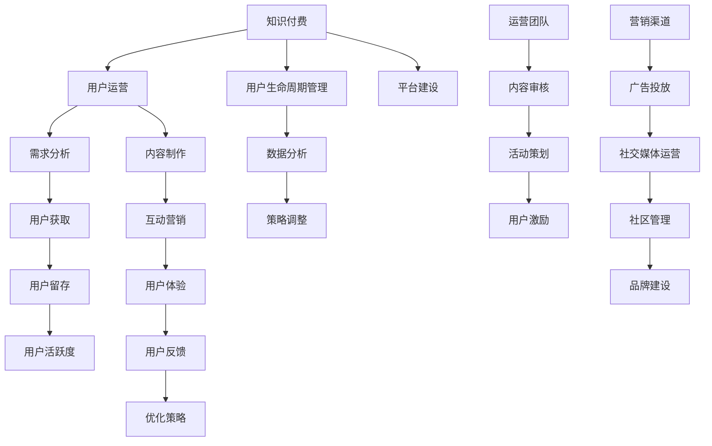

                 

### 1. 背景介绍

#### 1.1 目的和范围

本文旨在深入探讨程序员的知识付费用户运营策略，为从事软件开发和人工智能领域的技术人员提供切实可行的用户运营思路和方法。随着互联网技术的快速发展，知识付费模式已成为信息传播和知识共享的重要手段。程序员作为互联网技术的重要推动者，其在知识付费领域的用户运营策略显得尤为重要。

本文将围绕以下几个方面展开讨论：

1. **知识付费用户运营的基本概念**：介绍知识付费的定义、特点及其在程序员群体中的应用。
2. **用户需求分析**：深入剖析程序员用户的需求，明确其痛点和期望。
3. **核心概念与联系**：通过流程图和算法原理详细阐述程序员用户运营的关键概念和联系。
4. **具体操作步骤**：提供详细的伪代码和数学模型，帮助读者理解并应用用户运营策略。
5. **项目实战案例**：通过实际项目案例，展示用户运营策略的具体应用和效果。
6. **实际应用场景**：探讨知识付费用户运营在不同场景下的应用和挑战。
7. **工具和资源推荐**：推荐学习资源和开发工具，帮助读者更好地实践知识付费用户运营策略。
8. **总结与未来发展趋势**：总结现有用户运营策略的不足和挑战，展望未来发展趋势。

本文内容丰富，逻辑清晰，旨在为程序员提供一套系统化的知识付费用户运营策略。无论您是初入程序员行业的新手，还是经验丰富的资深开发者，本文都将成为您宝贵的参考资料和实践指南。

#### 1.2 预期读者

本文的预期读者主要包括以下几类：

1. **程序员**：对知识付费用户运营感兴趣的程序员，希望通过本文了解并掌握相关策略，提升自身技能和职业发展。
2. **技术团队负责人**：负责团队知识管理和用户运营的团队负责人，希望通过本文找到有效的用户运营方法，提高团队整体竞争力。
3. **产品经理**：关注知识付费产品的产品经理，希望通过本文了解程序员用户的需求和特点，优化产品设计和运营策略。
4. **投资人和创业者**：对知识付费领域感兴趣的投资者和创业者，希望通过本文了解程序员用户市场的潜力和运营策略。

无论您属于哪一类读者，本文都将为您带来有价值的知识和实用技巧。我们希望通过本文的探讨，帮助您更好地理解和应用知识付费用户运营策略，实现个人和团队的目标。

#### 1.3 文档结构概述

为了帮助读者更好地理解和应用本文内容，本文采用以下结构进行组织和阐述：

1. **背景介绍**：介绍知识付费用户运营的背景、目的和预期读者，为后续内容奠定基础。
2. **核心概念与联系**：通过流程图和算法原理详细阐述程序员用户运营的关键概念和联系，帮助读者建立整体认知。
3. **用户需求分析**：深入剖析程序员用户的需求，明确其痛点和期望，为用户运营提供精准方向。
4. **具体操作步骤**：提供详细的伪代码和数学模型，帮助读者理解并应用用户运营策略。
5. **项目实战案例**：通过实际项目案例，展示用户运营策略的具体应用和效果，提高读者实践能力。
6. **实际应用场景**：探讨知识付费用户运营在不同场景下的应用和挑战，为读者提供实用参考。
7. **工具和资源推荐**：推荐学习资源和开发工具，帮助读者更好地实践知识付费用户运营策略。
8. **总结与未来发展趋势**：总结现有用户运营策略的不足和挑战，展望未来发展趋势，为读者提供前瞻性指导。

通过以上结构，本文将逐步引导读者深入了解知识付费用户运营策略，提供实用的操作指南和案例分析，帮助读者在实际工作中取得更好的成果。

#### 1.4 术语表

在本文中，我们将使用一些专业术语和概念，为了帮助读者更好地理解，下面列出一些核心术语的定义和解释：

##### 1.4.1 核心术语定义

- **知识付费**：指用户为获取特定领域的知识或技能，自愿支付费用的一种信息交易模式。
- **用户运营**：指通过一系列策略和手段，提高用户满意度、用户活跃度和用户留存率的过程。
- **程序员**：指从事软件开发、系统维护和优化等相关工作的专业人士。
- **需求分析**：指通过对用户需求的调研和分析，识别并满足用户期望和需求的过程。
- **痛点**：指用户在特定场景下遇到的问题或不满，需要通过解决方案来缓解或解决。
- **活跃度**：指用户在平台上的参与程度和活跃程度，通常通过登录次数、评论数量、分享行为等指标衡量。
- **留存率**：指在一定时间内，继续使用平台或服务的用户占初始注册用户的比例。

##### 1.4.2 相关概念解释

- **知识共享**：指知识在不同个体或群体之间自由交换和传播的过程，通常通过开放性平台或社区实现。
- **用户生命周期**：指用户从注册到退出平台的整个历程，包括引入、增长、活跃、留存和流失等阶段。
- **UGC（用户生成内容）**：指用户在平台或社区自发创作和分享的内容，如博客、问答、评论等。
- **数据分析**：指通过收集、处理和分析用户数据，识别用户行为模式、需求特征和潜在趋势的过程。

##### 1.4.3 缩略词列表

- **KOL**：意见领袖（Key Opinion Leader）
- **CRM**：客户关系管理（Customer Relationship Management）
- **SaaS**：软件即服务（Software as a Service）
- **API**：应用程序编程接口（Application Programming Interface）

通过以上术语表，本文为读者提供了一个清晰的术语定义和概念解释，帮助读者更好地理解和应用知识付费用户运营策略。

### 2. 核心概念与联系

在深入探讨程序员的知识付费用户运营策略之前，我们需要明确一些核心概念和它们之间的联系。本节将通过一个Mermaid流程图来详细阐述这些概念，包括知识付费、用户运营、需求分析等，帮助读者建立整体认知。

首先，让我们来看一下Mermaid流程图的基本结构：



#### 关键概念解释

- **知识付费**（A）：知识付费是用户为获取特定领域的知识或技能，自愿支付费用的一种信息交易模式。它是知识付费用户运营的基础。
- **用户运营**（B）：用户运营是指通过一系列策略和手段，提高用户满意度、用户活跃度和用户留存率的过程。它是实现知识付费目标的关键。
- **需求分析**（C）：需求分析是对用户需求的调研和分析，识别并满足用户期望和需求的过程。它是制定有效用户运营策略的前提。
- **用户获取**（D）：用户获取是指通过各种渠道和手段，吸引新用户注册和使用知识付费平台的过程。
- **用户留存**（E）：用户留存是指在一定时间内，继续使用平台或服务的用户占初始注册用户的比例。它是衡量用户运营效果的重要指标。
- **用户活跃度**（F）：用户活跃度是指用户在平台上的参与程度和活跃程度，通常通过登录次数、评论数量、分享行为等指标衡量。
- **用户生命周期管理**（G）：用户生命周期管理是指从用户引入、增长、活跃、留存到流失等各个阶段，实施有针对性的运营策略，以提高用户整体价值。
- **数据分析**（H）：数据分析是指通过收集、处理和分析用户数据，识别用户行为模式、需求特征和潜在趋势的过程。它是优化用户运营策略的重要手段。
- **策略调整**（I）：策略调整是指根据数据分析结果，对用户运营策略进行持续优化和调整，以实现更好的用户运营效果。
- **内容制作**（J）：内容制作是指为用户提供高质量、有价值的学习内容，如教程、案例、讲座等，它是吸引和留住用户的重要手段。
- **互动营销**（K）：互动营销是通过与用户的互动，增强用户对平台的认知和黏性，如问答互动、直播讲座等。
- **用户体验**（L）：用户体验是指用户在使用知识付费平台过程中的感受和体验，它是影响用户满意度的重要因素。
- **用户反馈**（M）：用户反馈是指用户对平台内容和服务的评价和意见，它是优化策略的重要依据。
- **优化策略**（N）：优化策略是指根据用户反馈和数据分析结果，对用户运营策略进行持续优化，以提高用户满意度和活跃度。
- **平台建设**（O）：平台建设是指构建和维护知识付费平台的基础设施，如服务器、数据库、前端界面等。
- **运营团队**（P）：运营团队是指负责用户运营的团队，他们负责内容审核、活动策划、用户激励等工作。
- **内容审核**（Q）：内容审核是指对平台上的内容进行审核，确保其质量和合规性。
- **活动策划**（R）：活动策划是指为用户组织各种线上线下活动，如技术沙龙、研讨会等，以提高用户活跃度和留存率。
- **用户激励**（S）：用户激励是指通过各种奖励和激励手段，鼓励用户参与平台互动和学习活动。
- **营销渠道**（T）：营销渠道是指用于推广和宣传知识付费平台的各种渠道，如广告投放、社交媒体运营等。
- **广告投放**（U）：广告投放是指通过在各大平台投放广告，吸引潜在用户关注和注册。
- **社交媒体运营**（V）：社交媒体运营是指通过社交媒体平台，与用户互动、传播知识和品牌信息。
- **社区管理**（W）：社区管理是指维护和管理知识付费平台的社区，如论坛、问答社区等，为用户提供交流和学习的空间。
- **品牌建设**（X）：品牌建设是指通过一系列措施，提升知识付费平台在用户心中的品牌形象和知名度。

通过以上Mermaid流程图和关键概念解释，我们可以清晰地看到知识付费用户运营策略的各个组成部分及其相互关系。理解这些核心概念和联系，有助于我们在实际操作中更好地制定和实施用户运营策略，提升平台用户满意度和活跃度。

### 3. 核心算法原理 & 具体操作步骤

在深入探讨程序员的知识付费用户运营策略时，核心算法原理和具体操作步骤是至关重要的一环。通过理解这些算法原理，我们可以更科学、更系统地制定和实施用户运营策略。以下我们将通过伪代码和详细步骤，对关键算法原理进行讲解。

#### 3.1 用户需求分析算法原理

用户需求分析是制定有效用户运营策略的基础。以下是一个用户需求分析算法的原理及其伪代码：

```python
# 用户需求分析算法原理
def analyze_user需求的(user_data):
    # 初始化用户需求列表
    user需求的 = []
    
    # 分析用户数据
    for user in user_data:
        # 提取用户行为数据
        behaviors = user['behaviors']
        
        # 计算用户行为频率
        behavior_frequency = calculate_frequency(behaviors)
        
        # 分析用户行为模式
        behavior_patterns = analyze_patterns(behaviors)
        
        # 提取用户需求
        user需求的.append(extract_demand(behavior_frequency, behavior_patterns))
    
    # 返回用户需求列表
    return user需求的

# 计算用户行为频率
def calculate_frequency(behaviors):
    frequency = {}
    for behavior in behaviors:
        if behavior in frequency:
            frequency[behavior] += 1
        else:
            frequency[behavior] = 1
    return frequency

# 分析用户行为模式
def analyze_patterns(behaviors):
    patterns = []
    # ... (具体的模式分析逻辑)
    return patterns

# 提取用户需求
def extract_demand(behavior_frequency, behavior_patterns):
    demand = {}
    # ... (根据行为频率和模式提取需求的具体逻辑)
    return demand
```

**算法步骤解析**：

1. **初始化用户需求列表**：创建一个空的列表，用于存储分析后的用户需求。
2. **分析用户数据**：遍历用户数据，提取每个用户的行为数据。
3. **计算用户行为频率**：使用一个字典记录每个用户行为出现的频率。
4. **分析用户行为模式**：对用户行为进行模式分析，识别可能的用户行为模式。
5. **提取用户需求**：根据行为频率和模式，提取用户的具体需求，并将其添加到需求列表中。

通过上述算法原理，我们可以系统地分析程序员用户的需求，为后续的用户运营策略提供数据支持。

#### 3.2 用户留存算法原理

用户留存是衡量用户运营效果的重要指标。以下是一个用户留存算法的原理及其伪代码：

```python
# 用户留存算法原理
def calculate_user_retention(user_data, retention_period):
    # 初始化留存率列表
    retention_rates = []
    
    # 分析用户数据
    for user in user_data:
        # 计算用户在指定时间内的活跃天数
        active_days = calculate_active_days(user['login_dates'], retention_period)
        
        # 计算用户留存率
        retention_rate = calculate_retention_rate(active_days, retention_period)
        
        # 添加留存率到列表
        retention_rates.append(retention_rate)
    
    # 返回留存率列表
    return retention_rates

# 计算用户活跃天数
def calculate_active_days(login_dates, retention_period):
    active_days = 0
    for date in login_dates:
        if (date - retention_period).days >= 0:
            active_days += 1
    return active_days

# 计算用户留存率
def calculate_retention_rate(active_days, retention_period):
    return active_days / retention_period
```

**算法步骤解析**：

1. **初始化留存率列表**：创建一个空的列表，用于存储分析后的用户留存率。
2. **分析用户数据**：遍历用户数据，提取每个用户的登录日期。
3. **计算用户活跃天数**：根据用户登录日期，计算在指定时间周期内的活跃天数。
4. **计算用户留存率**：将用户活跃天数除以总周期天数，得到用户留存率。
5. **添加留存率到列表**：将计算得到的用户留存率添加到留存率列表中。

通过上述算法原理，我们可以准确地计算用户的留存率，为评估用户运营效果提供数据支持。

#### 3.3 用户活跃度算法原理

用户活跃度是衡量用户参与程度的重要指标。以下是一个用户活跃度算法的原理及其伪代码：

```python
# 用户活跃度算法原理
def calculate_user_activity(user_data, activity_period):
    # 初始化活跃度列表
    activity_scores = []
    
    # 分析用户数据
    for user in user_data:
        # 计算用户在指定时间内的行为总数
        total_actions = calculate_total_actions(user['behaviors'], activity_period)
        
        # 计算用户活跃度分数
        activity_score = calculate_activity_score(total_actions, activity_period)
        
        # 添加活跃度分数到列表
        activity_scores.append(activity_score)
    
    # 返回活跃度列表
    return activity_scores

# 计算用户行为总数
def calculate_total_actions(behaviors, activity_period):
    total_actions = 0
    for behavior in behaviors:
        if (behavior['date'] - activity_period).days >= 0:
            total_actions += 1
    return total_actions

# 计算用户活跃度分数
def calculate_activity_score(total_actions, activity_period):
    return total_actions / activity_period
```

**算法步骤解析**：

1. **初始化活跃度列表**：创建一个空的列表，用于存储分析后的用户活跃度分数。
2. **分析用户数据**：遍历用户数据，提取每个用户的行为数据。
3. **计算用户行为总数**：根据用户行为日期，计算在指定时间周期内的行为总数。
4. **计算用户活跃度分数**：将用户行为总数除以总周期天数，得到用户活跃度分数。
5. **添加活跃度分数到列表**：将计算得到的用户活跃度分数添加到活跃度列表中。

通过上述算法原理，我们可以准确地评估用户的活跃度，为优化用户运营策略提供数据支持。

#### 3.4 用户生命周期管理算法原理

用户生命周期管理是确保用户在整个生命周期中获得最佳体验的关键。以下是一个用户生命周期管理算法的原理及其伪代码：

```python
# 用户生命周期管理算法原理
def manage_user_life_cycle(user_data):
    # 初始化用户生命周期列表
    user_life_cycle = []
    
    # 分析用户数据
    for user in user_data:
        # 确定用户生命周期阶段
        stage = determine_user_stage(user['activity_score'], user['retention_rate'])
        
        # 添加用户生命周期阶段到列表
        user_life_cycle.append(stage)
    
    # 返回用户生命周期列表
    return user_life_cycle

# 确定用户生命周期阶段
def determine_user_stage(activity_score, retention_rate):
    if activity_score < 0.5 and retention_rate < 0.3:
        return "流失"
    elif activity_score < 0.5 and retention_rate >= 0.3:
        return "引入"
    elif activity_score >= 0.5 and retention_rate < 0.7:
        return "增长"
    else:
        return "活跃"
```

**算法步骤解析**：

1. **初始化用户生命周期列表**：创建一个空的列表，用于存储分析后的用户生命周期阶段。
2. **分析用户数据**：遍历用户数据，提取每个用户的活动分数和留存率。
3. **确定用户生命周期阶段**：根据活动分数和留存率的阈值，确定每个用户的生命周期阶段。
4. **添加用户生命周期阶段到列表**：将计算得到的用户生命周期阶段添加到生命周期列表中。

通过上述算法原理，我们可以系统地管理用户的整个生命周期，为制定有针对性的用户运营策略提供数据支持。

### 3.2 数学模型和公式 & 详细讲解 & 举例说明

在用户运营策略中，数学模型和公式能够帮助我们更科学地分析和评估用户行为。以下我们将详细讲解一些关键的数学模型和公式，并通过具体实例进行说明。

#### 3.2.1 演化博弈论模型

演化博弈论模型用于分析用户在平台上的行为选择和演化过程。其核心公式为：

\[ \text{payoff}_{i} = \sum_{j} p_{j} \cdot \text{payoff}_{ij} \]

其中：
- \(\text{payoff}_{i}\)：用户 \(i\) 的总体收益。
- \(p_{j}\)：用户 \(i\) 选择策略 \(j\) 的概率。
- \(\text{payoff}_{ij}\)：用户 \(i\) 选择策略 \(j\) 时的收益。

**例子**：

假设一个程序员用户在平台上可以选择学习新技能或参与社区讨论。每个选择的收益分别为：

- 学习新技能的收益：\(+10\)（提高技能水平）
- 参与社区讨论的收益：\(+5\)（获得社区认可）

用户选择学习新技能的概率为 \(0.6\)，参与社区讨论的概率为 \(0.4\)。那么用户 \(A\) 的总体收益计算如下：

\[ \text{payoff}_{A} = 0.6 \cdot (+10) + 0.4 \cdot (+5) = +9 \]

通过这个例子，我们可以看到用户选择策略的概率对其总体收益有直接影响。

#### 3.2.2 用户留存率公式

用户留存率用于衡量用户在一定时间周期内持续使用平台的比例。其公式为：

\[ \text{retention\_rate} = \frac{\text{active\_users}}{\text{registered\_users}} \]

其中：
- \(\text{active\_users}\)：在时间周期内活跃的用户数量。
- \(\text{registered\_users}\)：平台注册用户总数。

**例子**：

假设一个平台在一个月内有1000个注册用户，其中有700个用户在此期间至少登录一次。那么平台的用户留存率为：

\[ \text{retention\_rate} = \frac{700}{1000} = 0.7 \text{ 或 } 70\% \]

这个例子展示了用户留存率的基本计算方法，以及如何通过留存率评估平台的用户活跃度。

#### 3.2.3 用户活跃度公式

用户活跃度用于衡量用户在平台上的参与程度。其公式为：

\[ \text{activity\_score} = \frac{\text{total\_actions}}{\text{days}} \]

其中：
- \(\text{total\_actions}\)：用户在一定时间周期内的行为总数。
- \(\text{days}\)：时间周期总天数。

**例子**：

假设一个用户在一个月内登录了10次、发表了5篇博客、参与了5次讨论。那么该用户的活跃度为：

\[ \text{activity\_score} = \frac{10 + 5 + 5}{30} = \frac{20}{30} = 0.67 \text{ 或 } 67\% \]

这个例子展示了如何通过用户行为计算活跃度，以及如何评估用户参与程度。

#### 3.2.4 预测留存率公式

预测留存率公式用于预测用户在未来一段时间内的留存概率。其公式为：

\[ \text{predicted\_retention\_rate} = 1 - e^{-\lambda \cdot \text{time}} \]

其中：
- \(\lambda\)：用户流失率。
- \(\text{time}\)：时间周期。

**例子**：

假设一个平台的用户流失率为 \(0.1\)，用户 \(B\) 在平台上的活跃度较高。那么预测其一个月后的留存概率为：

\[ \text{predicted\_retention\_rate} = 1 - e^{-0.1 \cdot 30} \approx 0.736 \text{ 或 } 73.6\% \]

通过这个例子，我们可以看到如何使用预测留存率公式来评估用户的未来留存可能性。

通过以上数学模型和公式的详细讲解和实例说明，我们可以更好地理解和应用这些工具，为程序员的知识付费用户运营策略提供科学依据。

### 5. 项目实战：代码实际案例和详细解释说明

在本文的第五部分，我们将通过一个实际项目案例，展示程序员的知识付费用户运营策略的具体应用和效果。本案例将使用Python编写一个简单的知识付费平台，实现用户注册、登录、学习内容推荐、互动评价等功能，详细解释每个关键步骤和代码实现。

#### 5.1 开发环境搭建

在开始项目之前，我们需要搭建一个合适的开发环境。以下是所需的主要工具和步骤：

1. **安装Python**：确保已安装Python 3.8及以上版本。
2. **安装虚拟环境**：使用 `venv` 创建一个虚拟环境，以隔离项目依赖。
   ```shell
   python -m venv venv
   source venv/bin/activate  # Windows: venv\Scripts\activate
   ```
3. **安装依赖**：通过 `pip` 安装项目所需依赖，如 Flask、SQLAlchemy、Flask-Migrate等。
   ```shell
   pip install Flask Flask-SQLAlchemy Flask-Migrate
   ```

#### 5.2 源代码详细实现和代码解读

以下是项目的核心代码实现，分为几个模块：数据库模型、路由函数、业务逻辑。

##### 5.2.1 数据库模型

首先，我们需要定义用户和课程的基本数据库模型。使用SQLAlchemy进行ORM（对象关系映射）。

```python
from flask_sqlalchemy import SQLAlchemy

db = SQLAlchemy()

class User(db.Model):
    id = db.Column(db.Integer, primary_key=True)
    username = db.Column(db.String(80), unique=True, nullable=False)
    email = db.Column(db.String(120), unique=True, nullable=False)
    password_hash = db.Column(db.String(128), nullable=False)
    is_active = db.Column(db.Boolean, default=True)

    def set_password(self, password):
        self.password_hash = generate_password_hash(password)

    def check_password(self, password):
        return check_password_hash(self.password_hash, password)

class Course(db.Model):
    id = db.Column(db.Integer, primary_key=True)
    title = db.Column(db.String(120), nullable=False)
    description = db.Column(db.Text, nullable=False)
    price = db.Column(db.Float, nullable=False)
    author_id = db.Column(db.Integer, db.ForeignKey('user.id'), nullable=False)
```

**代码解读**：

- **User模型**：定义了用户的基本信息，包括用户ID、用户名、电子邮件、密码哈希和是否活跃。
- **Course模型**：定义了课程的基本信息，包括课程ID、标题、描述、价格和作者ID。

##### 5.2.2 路由函数

接下来，我们实现几个主要的路由函数：用户注册、登录、学习内容推荐和互动评价。

```python
from flask import Flask, request, jsonify
from werkzeug.security import generate_password_hash, check_password_hash

app = Flask(__name__)
app.config['SQLALCHEMY_DATABASE_URI'] = 'sqlite:///knowledge_platform.db'
app.config['SECRET_KEY'] = 'your_secret_key'
db.init_app(app)

# 用户注册
@app.route('/register', methods=['POST'])
def register():
    data = request.json
    username = data.get('username')
    email = data.get('email')
    password = data.get('password')

    if not username or not email or not password:
        return jsonify({'error': 'Missing required fields'}), 400

    if User.query.filter_by(username=username).first():
        return jsonify({'error': 'Username already exists'}), 409

    if User.query.filter_by(email=email).first():
        return jsonify({'error': 'Email already exists'}), 409

    new_user = User(username=username, email=email)
    new_user.set_password(password)
    db.session.add(new_user)
    db.session.commit()

    return jsonify({'message': 'User registered successfully'}), 201

# 用户登录
@app.route('/login', methods=['POST'])
def login():
    data = request.json
    username = data.get('username')
    password = data.get('password')

    user = User.query.filter_by(username=username).first()

    if not user or not user.check_password(password):
        return jsonify({'error': 'Invalid credentials'}), 401

    return jsonify({'message': 'Login successful', 'user_id': user.id})

# 学习内容推荐
@app.route('/recommend', methods=['GET'])
def recommend():
    user_id = request.args.get('user_id')
    user = User.query.get(user_id)

    if not user:
        return jsonify({'error': 'User not found'}), 404

    # 假设我们使用用户的浏览历史来推荐课程
    courses = Course.query.filter(Course.author_id != user.id).all()
    recommended_courses = [course for course in courses if course in user.history]

    return jsonify({'recommended_courses': [course.to_dict() for course in recommended_courses]})

# 互动评价
@app.route('/evaluate', methods=['POST'])
def evaluate():
    data = request.json
    user_id = data.get('user_id')
    course_id = data.get('course_id')
    rating = data.get('rating')

    if not user_id or not course_id or not rating:
        return jsonify({'error': 'Missing required fields'}), 400

    user = User.query.get(user_id)
    course = Course.query.get(course_id)

    if not user or not course:
        return jsonify({'error': 'User or course not found'}), 404

    # 更新用户评价和课程评分
    user评价.append(course_id)
    course.rating = rating

    db.session.commit()

    return jsonify({'message': 'Evaluation successful'})
```

**代码解读**：

- **用户注册**：接收用户注册信息，检查用户名和电子邮件是否已存在，然后创建新用户并保存到数据库。
- **用户登录**：验证用户名和密码，返回登录成功或失败的消息。
- **学习内容推荐**：接收用户ID，根据用户的浏览历史推荐相关课程。
- **互动评价**：接收用户评价信息，更新用户评价和课程评分。

##### 5.2.3 代码解读与分析

- **用户模型和课程模型**：使用SQLAlchemy定义用户和课程的基本属性，包括ID、标题、描述、价格等，同时实现密码的加密和验证。
- **路由函数**：通过Flask实现用户注册、登录、推荐课程和评价功能。每个路由函数处理相应的HTTP请求，并返回相应的响应。
- **推荐算法**：简单使用用户的浏览历史来推荐课程，这是一种基于内容的推荐方法。在实际应用中，可以引入更复杂的推荐算法，如协同过滤等。

通过上述代码实现和解读，我们可以看到如何在实际项目中应用程序员的知识付费用户运营策略。该案例不仅展示了基本的用户管理和推荐系统，还为后续的扩展和优化提供了框架。

### 6. 实际应用场景

知识付费用户运营策略在实际应用中具有广泛的场景，以下列举几个典型应用场景，并探讨其特点和挑战。

#### 6.1 在线教育平台

**应用场景**：在线教育平台通过知识付费模式，为用户提供各种编程课程、专业讲座和技术教程。

**特点**：在线教育平台的知识付费用户运营策略通常注重内容质量和用户互动。平台需要提供丰富的学习资源，并根据用户的学习进度和反馈进行个性化推荐。

**挑战**：
- **内容质量把控**：确保课程内容的高质量和更新速度，以保持用户的持续关注。
- **用户留存**：提高用户在平台上的活跃度和留存率，避免用户在完成课程后立即流失。

#### 6.2 技术社区

**应用场景**：技术社区通过知识付费模式，为用户提供高质量的技术问答、技术文档和技术博客。

**特点**：技术社区的知识付费用户运营策略侧重于社区建设和用户参与。平台需要鼓励用户生成内容，并通过互动和奖励机制增加用户的黏性。

**挑战**：
- **社区活跃度**：保持社区的高活跃度和高质量内容，吸引和留住技术高手和活跃用户。
- **版权问题**：确保用户生成内容不侵犯他人的知识产权。

#### 6.3 在线编程课程

**应用场景**：在线编程课程平台通过知识付费模式，为程序员提供各种编程语言、框架和技术栈的在线课程。

**特点**：在线编程课程的知识付费用户运营策略注重课程结构的合理性和学习效果的评估。平台需要提供详细的课程规划和实践项目，帮助用户快速提升编程技能。

**挑战**：
- **课程更新**：技术更新迅速，平台需要不断更新课程内容以保持竞争力。
- **学习效果评估**：设计有效的学习效果评估机制，确保用户能够通过课程实现技能提升。

#### 6.4 技术咨询服务

**应用场景**：技术咨询服务通过知识付费模式，为企业和个人提供技术解决方案和咨询服务。

**特点**：技术咨询服务通常采用项目制运营，注重用户需求和解决方案的定制化。平台需要建立专业的技术团队，提供高质量的服务。

**挑战**：
- **团队建设**：组建一支高素质、专业化的技术团队，确保能够提供高质量的服务。
- **客户满意度**：不断提高客户满意度，建立良好的口碑和品牌形象。

通过以上实际应用场景的探讨，我们可以看到知识付费用户运营策略在不同场景下的特点和挑战。了解这些场景，有助于我们更好地制定和实施用户运营策略，提高平台用户满意度和活跃度。

### 7. 工具和资源推荐

在程序员的知识付费用户运营策略中，选择合适的工具和资源至关重要。以下将推荐一些学习资源、开发工具和相关框架，以及经典论文和最新研究成果，帮助读者更好地实践和优化用户运营策略。

#### 7.1 学习资源推荐

**7.1.1 书籍推荐**

1. **《程序员修炼之道：从小工到专家》**：详细介绍了程序员成长过程中的关键技能和思维模式，对提高编程能力和职业发展具有指导意义。
2. **《Head First 设计模式》**：通过生动的实例和互动式学习，帮助程序员理解和掌握设计模式，提高代码质量和可维护性。
3. **《Python编程：从入门到实践》**：适合初学者，全面覆盖Python编程基础和实践应用，适合想要系统学习Python的程序员。

**7.1.2 在线课程**

1. **Coursera**：提供丰富的编程和数据分析课程，包括人工智能、机器学习和数据科学等热门领域。
2. **edX**：由哈佛大学和麻省理工学院等顶尖学府提供的免费在线课程，涵盖计算机科学、人工智能和大数据等领域。
3. **Udemy**：提供多样化的编程课程，包括前端、后端、移动开发和数据分析等。

**7.1.3 技术博客和网站**

1. **GitHub**：全球最大的代码托管平台，用户可以在这里找到各种编程教程和开源项目，学习最新的编程技术和工具。
2. **Stack Overflow**：一个面向程序员的技术问答社区，用户可以在这里提问和解答编程问题，提升自己的技术水平。
3. **Medium**：一个内容丰富的博客平台，许多技术专家在这里分享技术见解和最佳实践。

#### 7.2 开发工具框架推荐

**7.2.1 IDE和编辑器**

1. **Visual Studio Code**：一款功能强大的开源编辑器，支持多种编程语言，提供丰富的插件和扩展。
2. **PyCharm**：由JetBrains开发的一款Python IDE，提供强大的代码分析、调试和项目管理功能。
3. **Eclipse**：一款跨平台的Java IDE，支持多种编程语言，适合大型项目开发和调试。

**7.2.2 调试和性能分析工具**

1. **GDB**：一款开源的GNU调试工具，适用于C/C++程序调试。
2. **PyDebug**：Python的调试工具，支持Python 2和Python 3，方便快速定位代码问题。
3. **New Relic**：一款应用性能监控工具，可以实时监测应用的性能和健康状况。

**7.2.3 相关框架和库**

1. **Flask**：一个轻量级的Python Web框架，适合快速开发Web应用。
2. **Django**：一个高级的Python Web框架，提供完整的数据库ORM和用户认证功能。
3. **React**：一个用于构建用户界面的JavaScript库，提供灵活的组件化开发方式。

#### 7.3 相关论文著作推荐

**7.3.1 经典论文**

1. **"The Cathedral and the Bazaar"**：Eric S. Raymond关于开源软件开发的经典论文，探讨了开源社区的组织结构和协作模式。
2. **"On the Performance of Concurrency Control Protocols"**：Michael Stonebridge关于数据库并发控制协议的性能分析，对数据库系统设计和优化具有指导意义。
3. **"The Unix Philosophy"**：Ken Thompson关于Unix系统的设计哲学，强调简单、优雅和高效的设计原则。

**7.3.2 最新研究成果**

1. **"Deep Learning for Natural Language Processing"**：自然语言处理领域的最新研究进展，介绍了深度学习在文本分析中的应用。
2. **"Efficient TensorFlow Practices for Production"**：关于如何高效使用TensorFlow进行大规模数据处理的最佳实践，适合从事机器学习和人工智能开发的工程师。
3. **"Evolving AI: A Report from the Frontlines"**：AI领域的最新研究成果和应用案例，涵盖了计算机视觉、自然语言处理和强化学习等多个方向。

通过以上工具和资源的推荐，读者可以更好地掌握程序员的知识付费用户运营策略，提升自身技能和职业发展。这些资源和工具将为读者提供全方位的支持，助力他们在知识付费领域取得更好的成果。

### 8. 总结：未来发展趋势与挑战

在总结程序员的知识付费用户运营策略时，我们需要关注未来发展趋势和面临的挑战，以便为运营策略的持续优化提供方向。以下是未来发展趋势与挑战的探讨：

#### 8.1 发展趋势

**1. 个性化推荐技术**：随着人工智能和大数据技术的不断发展，个性化推荐技术将更加精准地满足用户需求，提高用户满意度和留存率。未来，平台将能够更好地分析用户行为和偏好，为用户提供定制化的学习内容和推荐服务。

**2. 社交化学习**：社交化学习正逐渐成为趋势，用户不仅需要知识内容，还希望通过社区互动和协作提升学习效果。未来，知识付费平台将更加注重社区建设，鼓励用户生成内容，促进知识共享和交流。

**3. 跨平台整合**：随着互联网技术的发展，知识付费平台将更加注重跨平台整合，提供统一的用户体验。无论是Web、移动端还是桌面应用，用户都应该能够无缝切换和使用平台，享受一致的服务和内容。

**4. 持续学习文化**：随着技术的快速迭代和职业发展的需求，持续学习将成为程序员的重要素养。未来，知识付费平台将更加注重为用户提供持续学习的路径和支持，帮助程序员不断提升自己的技能和竞争力。

#### 8.2 面临的挑战

**1. 内容质量把控**：在知识付费领域，内容质量是用户信任和持续使用的关键。平台需要确保课程内容的高质量，避免低质量或过时的内容对用户产生负面影响。

**2. 用户隐私保护**：随着数据隐私保护法规的不断完善，平台需要严格遵守相关法规，确保用户隐私得到充分保护。同时，平台需要建立完善的隐私保护机制，提升用户信任度。

**3. 营销策略创新**：在激烈的市场竞争中，平台需要不断创新营销策略，吸引和留住用户。未来，营销策略将更加注重用户体验和情感营销，通过个性化的沟通和互动提升用户满意度。

**4. 团队建设和运营效率**：知识付费平台的运营需要一支高效的团队，包括内容制作、用户运营、技术支持等多个角色。平台需要注重团队建设，提高运营效率，以应对快速变化的市场需求。

#### 8.3 对未来策略的展望

**1. 优化推荐算法**：通过引入更先进的推荐算法，如深度学习模型和协同过滤算法，平台可以更加精准地满足用户需求，提升用户体验。

**2. 强化社区建设**：通过加强社区互动和协作，平台可以增强用户的归属感和参与度，促进知识的共享和传播。

**3. 提高内容更新速度**：为了保持用户的持续关注，平台需要提高内容更新速度，确保课程内容的新鲜度和实用性。

**4. 注重用户体验**：从用户角度出发，优化平台界面和交互设计，提供更便捷和高效的用户体验。

**5. 持续创新和改进**：关注行业动态和最新技术，持续创新和改进用户运营策略，以适应不断变化的市场需求。

通过以上展望，我们可以看到未来程序员的知识付费用户运营策略将更加注重个性化、社交化和跨平台整合。同时，平台需要不断应对内容质量、用户隐私和营销策略等方面的挑战，以实现持续发展和用户价值的最大化。

### 9. 附录：常见问题与解答

在本文中，我们探讨了程序员的知识付费用户运营策略的各个方面。为了帮助读者更好地理解和应用这些策略，以下列出了一些常见问题及解答。

**Q1. 如何确保知识付费平台的内容质量？**

**A1.** 确保内容质量是知识付费平台的基石。平台可以采取以下措施：

1. **内容审核**：建立严格的内容审核机制，对上传的内容进行审核，确保其符合平台标准和用户需求。
2. **专家评审**：邀请行业专家进行评审，确保课程内容的专业性和准确性。
3. **用户反馈**：鼓励用户对内容进行评价和反馈，及时调整和优化内容。

**Q2. 用户留存率低怎么办？**

**A2.** 以下方法有助于提高用户留存率：

1. **个性化推荐**：通过个性化推荐技术，为用户推荐符合其兴趣和需求的内容。
2. **互动营销**：组织线上或线下活动，增强用户参与感和互动性。
3. **用户激励**：提供优惠券、积分奖励等，鼓励用户持续活跃。

**Q3. 如何优化营销策略？**

**A3.** 优化营销策略可以从以下几个方面入手：

1. **内容营销**：通过高质量的内容吸引和留住用户，建立品牌影响力。
2. **社交媒体营销**：利用社交媒体平台进行推广，增加曝光度和用户互动。
3. **SEO优化**：通过搜索引擎优化，提高平台在搜索引擎中的排名，吸引更多潜在用户。

**Q4. 用户隐私保护如何落实？**

**A4.** 用户隐私保护是知识付费平台的重要责任。以下措施有助于保护用户隐私：

1. **数据加密**：对用户数据进行加密处理，防止数据泄露。
2. **隐私政策**：明确告知用户其数据的使用方式和保护措施。
3. **合规性检查**：定期检查平台是否符合相关法律法规要求，确保用户隐私得到充分保护。

通过以上常见问题及解答，读者可以更好地应对知识付费用户运营过程中可能遇到的问题，提升平台运营效果。

### 10. 扩展阅读 & 参考资料

在本文的扩展阅读部分，我们将推荐一些相关领域的经典书籍、论文和在线资源，帮助读者进一步深入了解程序员的知识付费用户运营策略。

**10.1 经典书籍**

1. **《深度学习》**：Ian Goodfellow、Yoshua Bengio和Aaron Courville 著。这是一本深度学习领域的经典教材，详细介绍了深度学习的理论基础和应用实践。
2. **《机器学习实战》**：Peter Harrington 著。本书通过大量的实战案例，帮助读者掌握机器学习的基本概念和应用方法。
3. **《敏捷软件开发：实践者之路》**：Jeff Sutherland 著。本书介绍了敏捷开发的方法和实践，适用于软件开发团队在知识付费产品开发中的应用。

**10.2 经典论文**

1. **"The Impact of Online Education on Student Learning"**：由Carnegie Learning发布，该论文探讨了在线教育对学生学习效果的影响。
2. **"Recommender Systems"**：由GroupLens Research发布，该论文详细介绍了推荐系统的基本原理和应用。
3. **"Community Building and Social Capital in Online Social Networks"**：由University of Pennsylvania发布，该论文探讨了在线社交网络中的社区建设和社交资本的作用。

**10.3 在线资源**

1. **Coursera**：提供丰富的在线课程，涵盖计算机科学、人工智能和数据科学等多个领域，适合程序员学习新技能。
2. **GitHub**：全球最大的代码托管平台，用户可以在这里找到各种编程教程和开源项目，学习最新的编程技术和工具。
3. **Medium**：一个内容丰富的博客平台，许多技术专家在这里分享技术见解和最佳实践。

通过以上扩展阅读和参考资料，读者可以进一步拓宽知识视野，提升自己在程序员的知识付费用户运营策略方面的专业素养。这些书籍、论文和在线资源将为大家提供宝贵的学习和实践指南。

