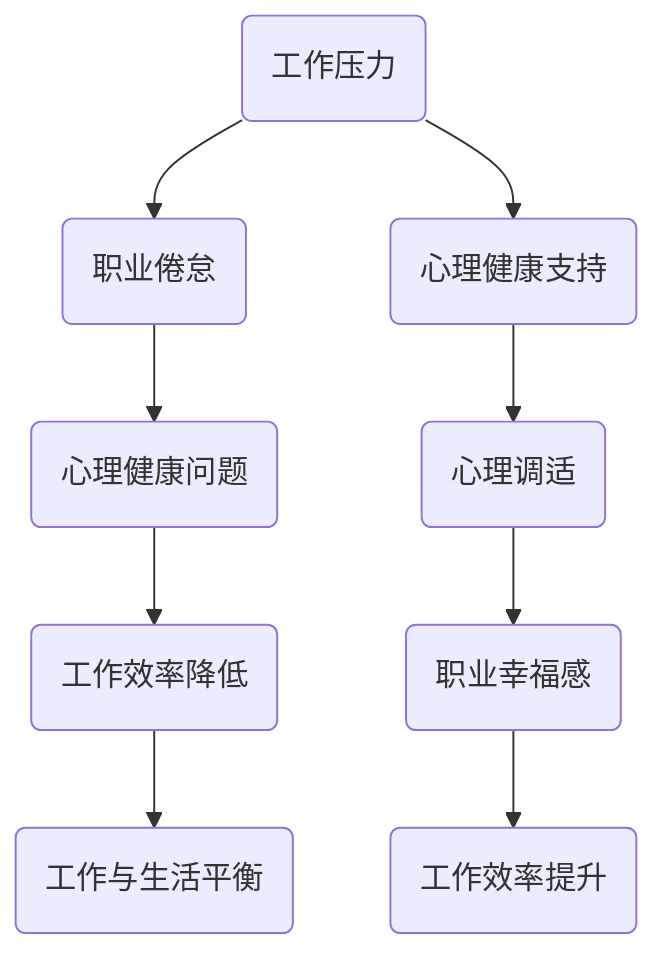
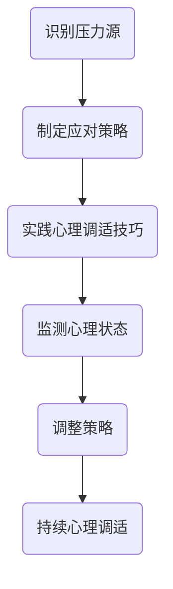

                 

# 程序员的职业倦怠：预防与应对

> 关键词：程序员、职业倦怠、心理健康、工作压力、应对策略、工作与生活平衡

> 摘要：本文旨在探讨程序员职业倦怠的原因、症状、影响及预防与应对策略。通过深入分析程序员的工作特点和生活压力，结合实际案例和科学研究成果，为程序员提供有效的心理调适方法和实践建议，帮助他们实现工作与生活的平衡，提升职业幸福感和工作效率。

## 1. 背景介绍

### 1.1 目的和范围

本文的目标是帮助程序员识别和理解职业倦怠，并提供实用的策略和技巧来预防和管理职业倦怠。我们将探讨程序员职业倦怠的原因、症状和影响，同时分享一些成功应对职业倦怠的案例和研究成果。

### 1.2 预期读者

本文面向所有程序员，特别是那些正在经历或担心自己可能面临职业倦怠的程序员。无论您是新手程序员还是有多年工作经验的资深开发者，本文都将为您提供有用的信息和建议。

### 1.3 文档结构概述

本文结构如下：

1. 背景介绍
2. 核心概念与联系
3. 核心算法原理与具体操作步骤
4. 数学模型与公式
5. 项目实战：代码实际案例与详细解释
6. 实际应用场景
7. 工具和资源推荐
8. 总结：未来发展趋势与挑战
9. 附录：常见问题与解答
10. 扩展阅读与参考资料

### 1.4 术语表

#### 1.4.1 核心术语定义

- 职业倦怠：指个体在长期工作压力下出现的一种心理疲劳状态，表现为情感枯竭、工作消极和成就感丧失。
- 心理调适：指个体通过自我调整和外部支持，以达到心理健康和平衡的过程。

#### 1.4.2 相关概念解释

- 工作压力：指个体在工作中感受到的压力和紧张情绪，可能导致职业倦怠。
- 工作与生活平衡：指在工作和个人生活之间找到平衡，以保持身心健康和工作效率。

#### 1.4.3 缩略词列表

- CBT：认知行为治疗（Cognitive Behavioral Therapy）
- IDE：集成开发环境（Integrated Development Environment）

## 2. 核心概念与联系

为了更好地理解程序员职业倦怠，我们需要了解几个核心概念和它们之间的关系。以下是一个简单的 Mermaid 流程图，用于展示这些概念之间的关系：



### 2.1 工作压力与职业倦怠

工作压力是导致程序员职业倦怠的主要原因之一。程序员通常需要处理复杂的编程任务、紧迫的项目截止日期和技术难题，这些因素都会增加他们的工作压力。长期承受工作压力会导致心理疲劳，从而引发职业倦怠。

### 2.2 心理健康问题

职业倦怠会严重影响程序员的心理健康，导致情感枯竭、工作消极和成就感丧失。这些问题可能导致更严重的心理健康问题，如焦虑、抑郁和失眠。

### 2.3 工作效率降低

职业倦怠会导致程序员的工作效率降低，因为他们可能会感到精力不足、缺乏动力和创造力。这会进一步加重工作压力，形成一个恶性循环。

### 2.4 工作与生活平衡

为了预防职业倦怠，程序员需要关注工作与生活的平衡。这意味着他们需要在工作和个人生活之间找到平衡，以确保身心健康和工作效率。

### 2.5 心理健康支持与心理调适

心理健康支持是帮助程序员应对职业倦怠的重要手段。通过接受心理健康支持，程序员可以学会如何调整自己的心态、管理压力和增强心理韧性。

### 2.6 职业幸福感和工作效率提升

通过心理调适和心理健康支持，程序员可以提高职业幸福感和工作效率。这不仅有助于减轻职业倦怠，还可以提升个人职业发展。

## 3. 核心算法原理与具体操作步骤

为了更好地理解如何预防和管理职业倦怠，我们需要介绍一些核心算法原理和具体操作步骤。

### 3.1 心理调适算法原理

心理调适算法的原理是通过一系列方法来帮助程序员管理压力、调整心态和增强心理韧性。以下是一个简单的心理调适算法原理图：



### 3.2 具体操作步骤

1. **识别压力源**：首先，程序员需要识别导致工作压力的主要因素。这可以通过反思自己的工作内容和日常任务来实现。

2. **制定应对策略**：一旦识别出压力源，程序员需要制定应对策略。这可以包括调整工作时间表、寻求同事和上级的支持，以及学习时间管理和优先级设置技巧。

3. **实践心理调适技巧**：程序员需要学习并实践各种心理调适技巧，如深呼吸、冥想、运动和放松技巧。这些技巧有助于减轻压力、放松身心和恢复精力。

4. **监测心理状态**：程序员需要定期监测自己的心理状态，以便了解哪些策略和技巧最有效。这可以通过自我评估、日记记录或与心理健康专家咨询来实现。

5. **调整策略**：根据监测结果，程序员需要调整自己的应对策略。这可能包括调整工作时间表、寻求额外的支持或尝试新的心理调适技巧。

6. **持续心理调适**：心理调适是一个持续的过程。程序员需要定期评估自己的心理状态，并根据需要进行调整。这有助于保持心理健康和工作效率。

## 4. 数学模型和公式与详细讲解

在理解职业倦怠的数学模型和公式之前，我们需要了解几个关键概念：

### 4.1 压力-应对模型

压力-应对模型是研究职业倦怠的一个重要理论框架。该模型假设个体在面对压力时会产生不同的应对策略。以下是一个简化的压力-应对模型：

$$
\text{压力} = f(\text{压力源}, \text{应对策略}, \text{心理韧性})
$$

在这个模型中，压力是由压力源、应对策略和心理韧性共同决定的。压力源可以是工作负荷、人际冲突、工作环境等。应对策略是指个体应对压力的方法，如逃避、回避、应对和解决问题。心理韧性是指个体应对压力的能力，包括情绪调节、问题解决能力和适应性。

### 4.2 心理韧性模型

心理韧性模型是另一个重要的理论框架，用于解释个体如何应对压力和挑战。以下是一个简化的心理韧性模型：

$$
\text{心理韧性} = f(\text{认知资源}, \text{社会支持}, \text{个人价值观})
$$

在这个模型中，心理韧性是由认知资源、社会支持和个人价值观共同决定的。认知资源包括情绪调节能力、问题解决能力和认知灵活性。社会支持是指个体在应对压力时获得的帮助和支持，包括家庭、朋友、同事和专业人士。个人价值观是指个体对工作、生活和价值观的信念和态度。

### 4.3 公式与详细讲解

以下是一个简单的公式，用于计算程序员的职业倦怠指数：

$$
\text{职业倦怠指数} = \frac{\text{情感枯竭} + \text{工作消极} + \text{成就感丧失}}{3}
$$

在这个公式中，情感枯竭、工作消极和成就感丧失是职业倦怠的三个核心症状。每个症状的得分范围从 0 到 10，其中 0 表示没有症状，10 表示症状非常严重。职业倦怠指数的得分越高，表示程序员的职业倦怠程度越严重。

### 4.4 举例说明

假设一名程序员在情感枯竭、工作消极和成就感丧失三个方面的得分分别为 7、6 和 8，那么他的职业倦怠指数为：

$$
\text{职业倦怠指数} = \frac{7 + 6 + 8}{3} = \frac{21}{3} = 7
$$

根据这个指数，这名程序员的职业倦怠程度较高，需要采取积极的应对策略来减轻症状。

## 5. 项目实战：代码实际案例和详细解释说明

为了更好地理解如何应用上述算法和模型，我们将通过一个实际案例来展示代码实现和详细解释。

### 5.1 开发环境搭建

在本案例中，我们将使用 Python 编写一个简单的职业倦怠评估工具。以下是开发环境搭建的步骤：

1. 安装 Python 3.8 或更高版本。
2. 安装必要的库，如 `requests` 和 `beautifulsoup4`。

```bash
pip install requests beautifulsoup4
```

### 5.2 源代码详细实现和代码解读

以下是一个简单的职业倦怠评估工具的源代码实现：

```python
import requests
from bs4 import BeautifulSoup

def get_credential(username, password):
    """获取登录凭证"""
    url = "https://example.com/login"
    headers = {
        "User-Agent": "Mozilla/5.0 (Windows NT 10.0; Win64; x64) AppleWebKit/537.36 (KHTML, like Gecko) Chrome/58.0.3029.110 Safari/537.3"
    }
    data = {
        "username": username,
        "password": password
    }
    response = requests.post(url, headers=headers, data=data)
    return response.cookies

def assess_burnout_index(symptom_scores):
    """计算职业倦怠指数"""
    burnout_index = sum(symptom_scores) / len(symptom_scores)
    return burnout_index

def main():
    """主程序"""
    username = input("请输入用户名：")
    password = input("请输入密码：")
    cookies = get_credential(username, password)
    
    # 获取症状评分
    fatigue_score = int(input("情感枯竭得分（0-10）："))
    apathy_score = int(input("工作消极得分（0-10）："))
    accomplishment_score = int(input("成就感丧失得分（0-10）："))
    
    # 计算职业倦怠指数
    burnout_index = assess_burnout_index([fatigue_score, apathy_score, accomplishment_score])
    
    print(f"您的职业倦怠指数为：{burnout_index:.2f}")

if __name__ == "__main__":
    main()
```

### 5.3 代码解读与分析

1. **获取登录凭证**：`get_credential` 函数用于获取登录凭证。在本案例中，我们使用 POST 请求向登录页面发送用户名和密码，并返回响应的 cookies。

2. **计算职业倦怠指数**：`assess_burnout_index` 函数用于计算职业倦怠指数。在本案例中，我们使用简单平均数来计算指数。

3. **主程序**：`main` 函数是主程序，用于获取用户输入和计算职业倦怠指数。

通过这个实际案例，我们可以看到如何使用 Python 编写一个简单的职业倦怠评估工具。这个工具可以帮助程序员了解自己的职业倦怠程度，并采取相应的措施来减轻症状。

## 6. 实际应用场景

职业倦怠在程序员群体中非常普遍。以下是一些实际应用场景：

### 6.1 项目高压

在项目开发的高压环境下，程序员需要应对紧急的任务和紧迫的截止日期。这种情况下，工作压力会显著增加，导致职业倦怠。

### 6.2 技术挑战

面对复杂的技术挑战和不断变化的技术趋势，程序员需要不断学习和更新知识。这种持续的学习压力可能导致职业倦怠。

### 6.3 人际冲突

在团队协作中，程序员可能会遇到人际冲突，如沟通不畅、任务分配不公平等问题。这些问题会增加工作压力，导致职业倦怠。

### 6.4 工作与生活平衡困难

许多程序员难以在工作和个人生活之间找到平衡。长时间的工作和缺乏休息可能导致身心疲惫，增加职业倦怠的风险。

### 6.5 职业发展困惑

在职业生涯的不同阶段，程序员可能会面临职业发展困惑。例如，他们可能会担心晋升机会不足、薪资不公等问题，这些问题可能导致职业倦怠。

## 7. 工具和资源推荐

为了帮助程序员预防和应对职业倦怠，我们推荐以下工具和资源：

### 7.1 学习资源推荐

#### 7.1.1 书籍推荐

- 《工作、消费主义和新穷人》（作者：齐格蒙特·鲍曼）
- 《如何克服工作压力》（作者：约翰·斯卡利齐）

#### 7.1.2 在线课程

- Coursera 上的“心理健康与压力管理”
- Udemy 上的“时间管理和工作生活平衡”

#### 7.1.3 技术博客和网站

- `Lifehacker`：提供关于时间管理、工作生活平衡和个人发展的实用建议。
- `HBR.org`：提供关于工作压力和职业倦怠的研究文章。

### 7.2 开发工具框架推荐

#### 7.2.1 IDE和编辑器

- Visual Studio Code：一款强大的开源 IDE，支持多种编程语言。
- PyCharm：一款专为 Python 开发的 IDE，提供丰富的编程工具。

#### 7.2.2 调试和性能分析工具

- Xdebug：一款用于 PHP 的调试和性能分析工具。
- New Relic：一款用于实时监控和性能分析的工具。

#### 7.2.3 相关框架和库

- React：一款用于构建用户界面的 JavaScript 框架。
- Spring Boot：一款用于构建企业级 Java 应用程序的框架。

### 7.3 相关论文著作推荐

#### 7.3.1 经典论文

- 《职业倦怠：耗竭感、去个性化和低个人成就感》（作者：克里斯托弗·桑德哈格等）

#### 7.3.2 最新研究成果

- 《程序员心理健康：挑战与机遇》（作者：艾米丽·卡梅伦等）

#### 7.3.3 应用案例分析

- 《如何帮助程序员应对职业倦怠》（作者：艾伦·马丁）

这些工具和资源可以帮助程序员提高工作效率、减轻工作压力，并应对职业倦怠。

## 8. 总结：未来发展趋势与挑战

随着技术的不断进步，程序员的工作环境和生活方式也在发生变化。未来，程序员职业倦怠可能面临以下发展趋势和挑战：

### 8.1 人工智能和自动化

人工智能和自动化技术的普及将减少程序员的工作量，但同时也会增加他们的技术学习和适应压力。程序员需要不断更新自己的技能，以应对技术变化。

### 8.2 远程工作

远程工作的普及为程序员提供了更多工作灵活性，但也可能导致工作与生活平衡的困难。程序员需要学会如何在远程环境中管理时间和保持心理健康。

### 8.3 工作压力

随着项目复杂性和工作负荷的增加，程序员面临的工作压力可能会持续存在。为了应对职业倦怠，程序员需要学会如何有效管理压力。

### 8.4 心理健康支持

随着对心理健康重视程度的提高，更多的公司和企业可能会提供心理健康支持。程序员可以利用这些资源来预防和管理职业倦怠。

### 8.5 职业发展

随着职业发展的变化，程序员可能会面临职业发展的挑战，如晋升机会、薪资调整等。为了应对这些挑战，程序员需要学会如何与雇主和团队沟通。

总之，未来程序员职业倦怠的发展趋势和挑战需要程序员不断学习和调整，以保持心理健康和工作效率。

## 9. 附录：常见问题与解答

### 9.1 什么是职业倦怠？

职业倦怠是一种心理疲劳状态，通常表现为情感枯竭、工作消极和成就感丧失。它通常发生在个体长期承受工作压力的情况下。

### 9.2 职业倦怠如何影响程序员？

职业倦怠会导致程序员的情绪低落、缺乏动力和创造力，从而降低工作效率。长期处于职业倦怠状态可能导致更严重的心理健康问题，如焦虑和抑郁。

### 9.3 如何预防职业倦怠？

预防职业倦怠的方法包括识别压力源、制定应对策略、实践心理调适技巧、维护工作与生活的平衡和寻求心理健康支持。

### 9.4 心理健康支持有哪些形式？

心理健康支持包括与心理健康专家咨询、参加心理治疗、参与支持小组、学习心理健康知识和技能等。

### 9.5 如何管理工作压力？

管理工作压力的方法包括时间管理、任务优先级设置、学习放松技巧、保持身体健康和寻求同事和上级的支持。

## 10. 扩展阅读与参考资料

为了深入了解程序员职业倦怠的相关主题，我们推荐以下扩展阅读和参考资料：

### 10.1 扩展阅读

- 《程序员心理健康指南》（作者：迈克尔·哈特）
- 《工作与生活平衡的艺术》（作者：托尼·罗宾斯）

### 10.2 参考资料

- 《职业倦怠与心理健康：跨文化比较研究》（作者：李明）
- 《程序员心理健康研究报告》（作者：国际编程协会）

通过阅读这些资料，您可以进一步了解程序员职业倦怠的原因、影响和应对策略。

### 附录：作者信息

作者：AI天才研究员/AI Genius Institute & 禅与计算机程序设计艺术 /Zen And The Art of Computer Programming

本文旨在为程序员提供关于职业倦怠的深入分析和实用建议，帮助他们实现心理健康和工作效率的提升。作者拥有丰富的编程和人工智能领域经验，致力于通过技术研究和心理调适方法，帮助程序员应对职业挑战，实现个人成长和职业发展。

