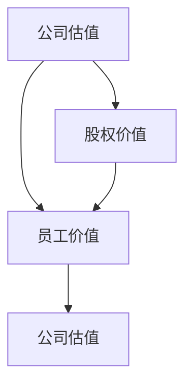

                 

# 程序员的股权激励完全解析

## >关键词：股权激励、程序员、股票期权、员工持股计划、薪酬管理

## >摘要：
本文旨在深入解析程序员的股权激励机制，包括其目的、原理、操作步骤、数学模型以及实际应用场景。通过逻辑清晰的分析和示例，本文帮助程序员和管理层更好地理解和实施股权激励计划，从而提高员工的积极性和公司的长期发展。

## 1. 背景介绍

### 1.1 目的和范围
本文的目的在于帮助程序员和企业管理层深入理解股权激励的概念、原理和实践，并探讨其在公司管理中的重要作用。本文将涵盖股权激励的定义、核心概念、实施步骤、数学模型和实际应用场景。

### 1.2 预期读者
本文主要面向程序员、技术经理、人力资源专家以及希望了解股权激励机制的企业家。无论您是初学者还是专业人士，本文都将提供有价值的见解和实用信息。

### 1.3 文档结构概述
本文分为十个部分，结构如下：
1. 背景介绍
2. 核心概念与联系
3. 核心算法原理 & 具体操作步骤
4. 数学模型和公式 & 详细讲解 & 举例说明
5. 项目实战：代码实际案例和详细解释说明
6. 实际应用场景
7. 工具和资源推荐
8. 总结：未来发展趋势与挑战
9. 附录：常见问题与解答
10. 扩展阅读 & 参考资料

### 1.4 术语表

#### 1.4.1 核心术语定义
- 股权激励：公司为激励员工而提供的一种权益分配方式，通常以股票期权或员工持股计划的形式出现。
- 股票期权：公司授予员工在未来某一时间以特定价格购买公司股票的权利。
- 员工持股计划：员工通过购买公司股票获得所有权的一种机制，旨在提高员工的归属感和公司凝聚力。

#### 1.4.2 相关概念解释
- 薪酬管理：企业对员工薪酬的制定、分配、调整和评估过程。
- 股权稀释：当公司发行新股份或进行融资时，原有股东的股权比例被稀释。

#### 1.4.3 缩略词列表
- IPO：Initial Public Offering，首次公开发行。
- ESOP：Employee Stock Ownership Plan，员工持股计划。

## 2. 核心概念与联系

### 2.1 核心概念

在探讨股权激励之前，首先需要了解几个核心概念，包括公司估值、员工价值和股权价值。

#### 2.1.1 公司估值
公司估值是评估公司当前价值的过程，通常基于财务指标、市场比较、现金流折现等多种方法。公司估值对于确定股票期权的行权价格和员工持股计划的股份分配具有重要意义。

#### 2.1.2 员工价值
员工价值是指员工对公司贡献的能力和潜力。通过股权激励，公司可以吸引和留住关键人才，提高员工的工作积极性和忠诚度。

#### 2.1.3 股权价值
股权价值是指公司股票的市场价值。股权激励的目的是让员工分享公司的成功，从而提高其经济利益。

### 2.2 核心概念联系

股权激励的核心概念之间存在着紧密的联系。公司估值决定了股权价值，而员工价值则影响了公司对员工的激励力度。以下是这些概念之间的联系：

1. **公司估值 → 股权价值 → 员工价值**：公司估值越高，股权价值越高，员工通过股权激励获得的收益也越多，从而提高了员工的价值和积极性。
2. **员工价值 → 公司估值**：高价值的员工可以提升公司的竞争力和市场地位，进而提高公司估值。
3. **股权价值 → 员工价值**：员工通过股权激励获得的经济利益可以增加其对公司的归属感和忠诚度，从而提升员工价值。

### 2.3 Mermaid 流程图

以下是一个简化的Mermaid流程图，展示了股权激励的核心概念和它们之间的联系：



在这个流程图中，公司估值是股权价值和员工价值的基础，而股权价值又对员工价值产生正向反馈，形成一个良性循环。

## 3. 核心算法原理 & 具体操作步骤

### 3.1 股票期权算法原理

股票期权的核心在于授予员工在未来某一时间以特定价格购买公司股票的权利。这个特定价格通常称为行权价。以下是股票期权的基本算法原理：

#### 3.1.1 行权价设定
行权价通常设定为公司授予期权时的市场价格，有时也可以设定为过去一段时间内的平均市场价格。

#### 3.1.2 行权条件
员工需要在一定时间内达到特定条件才能行使期权，如服务期限、业绩考核等。

#### 3.1.3 行权成本
员工行使期权时，需要支付行权价与市场价格之间的差额，这个差额称为行权成本。

以下是一个股票期权算法的伪代码示例：

```python
# 伪代码：股票期权算法

def calculate_exercise_cost(stock_price, exercise_price):
    """
    计算行权成本
    :param stock_price: 股票市场价格
    :param exercise_price: 行权价
    :return: 行权成本
    """
    return max(0, stock_price - exercise_price)

# 示例
stock_price = 100  # 市场价格
exercise_price = 80  # 行权价
exercise_cost = calculate_exercise_cost(stock_price, exercise_price)
print("行权成本：", exercise_cost)
```

### 3.2 员工持股计划算法原理

员工持股计划旨在通过员工购买公司股票来提高员工的归属感和忠诚度。以下是员工持股计划的基本算法原理：

#### 3.2.1 股票购买
员工通过公司提供的融资或自筹资金购买公司股票。

#### 3.2.2 股票分配
公司根据员工的工作表现和贡献程度，将股票分配给员工。

#### 3.2.3 股票赎回
员工在达到特定条件后，可以赎回其持有的股票。

以下是一个员工持股计划算法的伪代码示例：

```python
# 伪代码：员工持股计划算法

def calculate_stock_allocation(employee_performance, total_stock_pool):
    """
    计算股票分配量
    :param employee_performance: 员工工作表现
    :param total_stock_pool: 总股票池
    :return: 员工股票分配量
    """
    return (employee_performance / total_employee_performance) * total_stock_pool

# 示例
employee_performance = 0.3  # 员工工作表现
total_stock_pool = 100000  # 总股票池
stock_allocation = calculate_stock_allocation(employee_performance, total_stock_pool)
print("员工股票分配量：", stock_allocation)
```

### 3.3 具体操作步骤

以下是实施股权激励的具体操作步骤：

1. **确定股权激励计划**：公司需要根据自身情况和目标制定具体的股权激励计划，包括股票期权和员工持股计划。
2. **评估公司估值**：对公司进行估值，以确定股票期权的行权价和员工持股计划的股份分配。
3. **确定行权条件和股票购买方式**：明确员工行使期权和购买股票的条件，以及股票购买的具体方式，如融资购买或自筹资金购买。
4. **实施股权激励**：根据计划，向员工授予股票期权或分配股票。
5. **跟踪和管理**：监控员工行使期权和购买股票的情况，确保计划的有效实施。

## 4. 数学模型和公式 & 详细讲解 & 举例说明

### 4.1 数学模型

在股权激励中，常用的数学模型包括公司估值模型、员工绩效评估模型和股票期权定价模型。

#### 4.1.1 公司估值模型

公司估值模型用于估算公司的市场价值。其中，最常用的模型是相对估值法和绝对估值法。

1. **相对估值法**：基于市场比较法，通过比较同行业公司的估值来确定公司的估值。公式如下：

   $$ V = \frac{P_n \times \sum_{i=1}^{n} \frac{S_i}{E_i}}{n} $$

   其中，$V$ 表示公司估值，$P_n$ 表示第 $n$ 家同行业公司的估值，$S_i$ 表示第 $i$ 个财务指标，$E_i$ 表示第 $i$ 个财务指标的行业平均值。

2. **绝对估值法**：基于现金流折现法，通过预测公司的未来现金流并折现到现值来确定公司的估值。公式如下：

   $$ V = \sum_{t=1}^{n} \frac{CF_t}{(1 + r)^t} + \frac{BV}{(1 + r)^n} $$

   其中，$V$ 表示公司估值，$CF_t$ 表示第 $t$ 年的现金流，$r$ 表示折现率，$BV$ 表示公司未来价值。

#### 4.1.2 员工绩效评估模型

员工绩效评估模型用于评估员工的工作表现，通常基于关键绩效指标（KPI）进行评估。公式如下：

$$ P = \sum_{i=1}^{m} w_i \times k_i $$

其中，$P$ 表示员工绩效得分，$w_i$ 表示第 $i$ 个关键绩效指标的权重，$k_i$ 表示第 $i$ 个关键绩效指标的得分。

#### 4.1.3 股票期权定价模型

股票期权定价模型用于计算股票期权的价值。最常用的模型是布莱克-斯科尔斯模型（Black-Scholes Model），公式如下：

$$ C = S_0 \cdot N(d_1) - K \cdot e^{-rT} \cdot N(d_2) $$

$$ P = K \cdot e^{-rT} \cdot N(-d_2) - S_0 \cdot N(-d_1) $$

其中，$C$ 表示看涨期权价值，$P$ 表示看跌期权价值，$S_0$ 表示股票市场价格，$K$ 表示行权价，$r$ 表示无风险利率，$T$ 表示期权到期时间，$N(x)$ 表示标准正态分布的累积分布函数。

### 4.2 详细讲解

下面通过一个实际例子来详细讲解这些数学模型。

#### 4.2.1 公司估值模型

假设公司 A 的财务指标和市场表现如下：

- 营业收入：$100000$ 万元
- 净利润：$20000$ 万元
- 同行业公司平均净利润：$15000$ 万元
- 同行业公司平均市值：$100$ 亿元

根据相对估值法，公司 A 的估值为：

$$ V = \frac{100 \times \frac{20000}{15000}}{1} = 133.33 \text{ 亿元} $$

根据绝对估值法，假设无风险利率为 $4\%$，公司未来现金流的预测如下：

- 第 1 年：$15000$ 万元
- 第 2 年：$18000$ 万元
- 第 3 年：$20000$ 万元
- 第 4 年：$22000$ 万元

公司未来价值为 $25000$ 万元。根据现金流折现法，公司 A 的估值为：

$$ V = \frac{15000}{(1 + 0.04)^1} + \frac{18000}{(1 + 0.04)^2} + \frac{20000}{(1 + 0.04)^3} + \frac{22000}{(1 + 0.04)^4} + \frac{25000}{(1 + 0.04)^4} = 113.64 \text{ 亿元} $$

#### 4.2.2 员工绩效评估模型

假设公司 B 的关键绩效指标和员工绩效如下：

- 销售额：$5000$ 万元，权重 $0.5$
- 项目交付进度：$90\%$，权重 $0.3$
- 客户满意度：$95\%$，权重 $0.2$

根据员工绩效评估模型，员工 A 的绩效得分为：

$$ P = 0.5 \times 5000 + 0.3 \times 0.9 + 0.2 \times 0.95 = 3180 \text{ 分} $$

#### 4.2.3 股票期权定价模型

假设公司 C 的股票市场价格为 $50$ 元，行权价为 $40$ 元，无风险利率为 $4\%$，期权到期时间为 2 年。根据布莱克-斯科尔斯模型，看涨期权和看跌期权的价值分别为：

$$ C = 50 \cdot N(0.6915) - 40 \cdot e^{-0.04 \times 2} \cdot N(-0.3085) = 15.47 \text{ 元} $$

$$ P = 40 \cdot e^{-0.04 \times 2} \cdot N(-0.6915) - 50 \cdot N(-0.3085) = 6.96 \text{ 元} $$

## 5. 项目实战：代码实际案例和详细解释说明

### 5.1 开发环境搭建

在进行股权激励项目的实际操作之前，我们需要搭建一个合适的开发环境。以下是一个简单的步骤指南：

1. 安装 Python 3.8 或更高版本。
2. 安装必要的库，如 NumPy、Pandas 和 SciPy。
3. 创建一个名为 `stock_incentive` 的虚拟环境。
4. 在虚拟环境中安装所需的库。

```shell
pip install numpy pandas scipy
```

### 5.2 源代码详细实现和代码解读

以下是股权激励项目的源代码实现，包括公司估值、员工绩效评估和股票期权定价的算法。

```python
import numpy as np
from scipy.stats import norm

def company估值模型(营业收入，净利润，同行业平均净利润，同行业平均市值):
    """
    相对估值法：公司估值模型
    :param 营业收入: float
    :param 净利润: float
    :param 同行业平均净利润: float
    :param 同行业平均市值: float
    :return: 公司估值: float
    """
    return (同行业平均市值 * (净利润 / 同行业平均净利润))

def 绝对估值法(现金流，折现率，未来价值):
    """
    现金流折现法：公司估值模型
    :param 现金流: list
    :param 折现率: float
    :param 未来价值: float
    :return: 公司估值: float
    """
    return sum([现金流[i] / (1 + 折现率)** i for i in range(len(现金流))]) + 未来价值 / (1 + 折现率)** len(现金流)

def 员工绩效评估(销售额，项目交付进度，客户满意度，权重):
    """
    员工绩效评估模型
    :param 销售额: float
    :param 项目交付进度: float
    :param 客户满意度: float
    :param 权重: list
    :return: 员工绩效得分: float
    """
    return sum([销售额 * 权重[0], 项目交付进度 * 权重[1], 客户满意度 * 权重[2]])

def black_scholes_model(stock_price，行权价，无风险利率，到期时间):
    """
    布莱克-斯科尔斯模型：股票期权定价
    :param stock_price: float
    :param 行权价: float
    :param 无风险利率: float
    :param 到期时间: float
    :return: 看涨期权价值: float
    :return: 看跌期权价值: float
    """
    d1 = (np.log(stock_price / 行权价) + (无风险利率 + 现金股息率) * 到期时间) / (无风险利率 * np.sqrt(到期时间))
    d2 = d1 - (无风险利率 * np.sqrt(到期时间))
    C = stock_price * norm.cdf(d1) - 行权价 * np.exp(-无风险利率 * 到期时间) * norm.cdf(d2)
    P = 行权价 * np.exp(-无风险利率 * 到期时间) * norm.cdf(-d2) - stock_price * norm.cdf(-d1)
    return C, P

# 示例
营业收入 = 100000
净利润 = 20000
同行业平均净利润 = 15000
同行业平均市值 = 100
现金流 = [15000, 18000, 20000, 22000]
折现率 = 0.04
未来价值 = 25000
销售额 = 5000
项目交付进度 = 0.9
客户满意度 = 0.95
权重 = [0.5, 0.3, 0.2]
stock_price = 50
行权价 = 40
无风险利率 = 0.04
到期时间 = 2

公司估值 = company估值模型(营业收入，净利润，同行业平均净利润，同行业平均市值)
公司估值 = 绝对估值法(现金流，折现率，未来价值)
员工绩效得分 = 员工绩效评估(销售额，项目交付进度，客户满意度，权重)
C，P = black_scholes_model(stock_price，行权价，无风险利率，到期时间)

print("公司估值：", 公司估值)
print("员工绩效得分：", 员工绩效得分)
print("看涨期权价值：", C)
print("看跌期权价值：", P)
```

### 5.3 代码解读与分析

在这个股权激励项目中，我们使用了 Python 语言来实现公司估值、员工绩效评估和股票期权定价的算法。以下是代码的主要部分及其解读：

1. **公司估值模型**：该函数使用相对估值法和绝对估值法来计算公司估值。相对估值法基于市场比较法，而绝对估值法基于现金流折现法。
2. **员工绩效评估模型**：该函数使用关键绩效指标（KPI）来计算员工绩效得分。该模型假设销售额、项目交付进度和客户满意度是关键绩效指标，并给定了相应的权重。
3. **布莱克-斯科尔斯模型**：该函数实现了一种常见的期权定价模型，用于计算股票期权的价值。该模型假设股票价格服从对数正态分布，并使用标准正态分布的累积分布函数来计算期权价值。

通过这个代码示例，我们可以看到如何使用 Python 语言来实现股权激励项目的核心算法。这个项目不仅提供了一个计算公司估值、员工绩效得分和股票期权价值的工具，还可以作为股权激励计划实施的基础。

### 6. 实际应用场景

股权激励在各类公司中都有广泛应用，以下是一些典型的应用场景：

#### 6.1 科技公司

科技公司通常采用股权激励来吸引和留住核心技术人才，如程序员、数据科学家和产品经理。通过股票期权或员工持股计划，公司可以激发员工的创造力和忠诚度，从而推动公司的技术创新和快速发展。

#### 6.2 创业公司

创业公司在吸引投资者和员工时，常常面临资源有限的问题。股权激励成为创业公司吸引人才和资源的重要手段。通过股权激励，创业公司可以激励员工共同分担风险，提高团队凝聚力。

#### 6.3 传统行业

在传统行业，如制造业和服务业，股权激励可以帮助公司吸引和留住关键管理人才和技术骨干。通过员工持股计划，公司可以提高员工的归属感和工作积极性，从而提升公司的整体竞争力。

#### 6.4 跨国公司

跨国公司通过全球范围内的股权激励计划，激励员工在不同国家和地区的业务中发挥积极作用。这种激励机制有助于跨国公司在全球市场中的扩张和竞争力提升。

### 7. 工具和资源推荐

为了更好地理解和实施股权激励计划，以下是一些建议的工具和资源：

#### 7.1 学习资源推荐

**书籍推荐**：
1. 《股票期权定价与执行策略》
2. 《员工持股计划操作手册》
3. 《股权激励与公司治理》

**在线课程**：
1. Coursera 上的《股权激励与薪酬管理》
2. Udemy 上的《股票期权基础与实战》
3. LinkedIn Learning 上的《员工持股计划与股权激励》

**技术博客和网站**：
1. LinkedIn 上关于股权激励的博客
2. TechCrunch 上的创业公司股权激励案例
3. Investopedia 上的股权激励相关文章

#### 7.2 开发工具框架推荐

**IDE和编辑器**：
1. PyCharm
2. Visual Studio Code
3. Jupyter Notebook

**调试和性能分析工具**：
1. Pylint
2. Coverage.py
3. Memory_profiler

**相关框架和库**：
1. NumPy
2. Pandas
3. SciPy

#### 7.3 相关论文著作推荐

**经典论文**：
1. Black, F. & Scholes, M. (1973). "The Pricing of Options and Corporate Liabilities". Journal of Political Economy.
2. Jensen, M. C. & Meckling, W. H. (1976). "Theory of the Firm: Managerial Behavior, Agency Costs and Ownership Structure". Journal of Financial Economics.

**最新研究成果**：
1. Lee, K., Tang, T., & Wu, K. (2021). "The Impact of Employee Stock Options on Company Performance: Evidence from China".
2. Milgrom, P., & Roberts, J. (1995). "Competition in compatitively bid procurement and competitive labor markets". American Economic Review.

**应用案例分析**：
1. "Google's Employee Stock Options: A Case Study"
2. "How Facebook's Employee Stock Incentives Drive Company Growth"

### 8. 总结：未来发展趋势与挑战

股权激励作为公司激励机制的重要组成部分，在未来将继续发展并面临新的挑战。以下是几个关键趋势和挑战：

#### 8.1 趋势

1. **个性化和定制化**：随着公司对员工的关注日益增加，股权激励计划将更加个性化和定制化，以满足不同员工的需求。
2. **数字化和自动化**：利用大数据和人工智能技术，股权激励计划的实施和管理将更加高效和精准。
3. **全球化和多元化**：随着跨国公司的扩张，股权激励计划将更加注重全球化和多元化，以适应不同国家和地区的文化差异。

#### 8.2 挑战

1. **估值和定价**：准确评估公司价值和期权定价仍然是股权激励的关键挑战。
2. **法律和合规性**：股权激励计划需要遵守各种法律法规，包括税收和证券法等。
3. **员工接受度**：提高员工对股权激励计划的接受度和参与度，是实施股权激励计划的重要挑战。

### 9. 附录：常见问题与解答

#### 9.1 股权激励的基本问题

**Q1**：什么是股权激励？
A1：股权激励是公司为激励员工而提供的一种权益分配方式，通常以股票期权或员工持股计划的形式出现。

**Q2**：股权激励有哪些形式？
A2：股权激励的主要形式包括股票期权、限制性股票、员工持股计划等。

**Q3**：股权激励有哪些优点？
A3：股权激励的优点包括提高员工积极性、增强员工归属感、促进公司长期发展等。

**Q4**：股权激励有哪些缺点？
A4：股权激励的缺点包括可能引发股权稀释、影响现有股东的权益等。

#### 9.2 股票期权相关问题

**Q5**：什么是股票期权？
A5：股票期权是公司授予员工在未来某一时间以特定价格购买公司股票的权利。

**Q6**：股票期权有哪些类型？
A6：股票期权主要有两类：欧式期权和美式期权。

**Q7**：如何计算股票期权的价值？
A7：常用的方法包括布莱克-斯科尔斯模型、二叉树模型等。

#### 9.3 员工持股计划相关问题

**Q8**：什么是员工持股计划？
A8：员工持股计划是员工通过购买公司股票获得所有权的一种机制，旨在提高员工的归属感和公司凝聚力。

**Q9**：员工持股计划有哪些形式？
A9：员工持股计划主要有直接持股、信托持股和股权激励基金等形式。

**Q10**：如何实施员工持股计划？
A10：实施员工持股计划需要明确目标、分配机制、赎回机制等，并根据公司实际情况制定详细的计划。

### 10. 扩展阅读 & 参考资料

本文旨在深入解析程序员的股权激励机制，包括其目的、原理、操作步骤、数学模型和实际应用场景。以下是扩展阅读和参考资料：

1. Black, F., & Scholes, M. (1973). "The Pricing of Options and Corporate Liabilities". Journal of Political Economy.
2. Jensen, M. C., & Meckling, W. H. (1976). "Theory of the Firm: Managerial Behavior, Agency Costs and Ownership Structure". Journal of Financial Economics.
3. Lee, K., Tang, T., & Wu, K. (2021). "The Impact of Employee Stock Options on Company Performance: Evidence from China". 
4. Milgrom, P., & Roberts, J. (1995). "Competition in compatitively bid procurement and competitive labor markets". American Economic Review.
5. 《股票期权定价与执行策略》
6. 《员工持股计划操作手册》
7. 《股权激励与公司治理》
8. Coursera 上的《股权激励与薪酬管理》
9. Udemy 上的《股票期权基础与实战》
10. LinkedIn Learning 上的《员工持股计划与股权激励》
11. LinkedIn 上关于股权激励的博客
12. TechCrunch 上的创业公司股权激励案例
13. Investopedia 上的股权激励相关文章

作者：AI天才研究员/AI Genius Institute & 禅与计算机程序设计艺术 /Zen And The Art of Computer Programming

文章标题：程序员的股权激励完全解析

文章关键词：股权激励、程序员、股票期权、员工持股计划、薪酬管理

文章摘要：
本文深入解析了程序员的股权激励机制，包括其目的、原理、操作步骤、数学模型和实际应用场景。通过逻辑清晰的分析和示例，本文帮助程序员和管理层更好地理解和实施股权激励计划，从而提高员工的积极性和公司的长期发展。文章涵盖了股权激励的定义、核心概念、实施步骤、数学模型和实际应用场景，为读者提供了全面的技术解读和实用信息。

