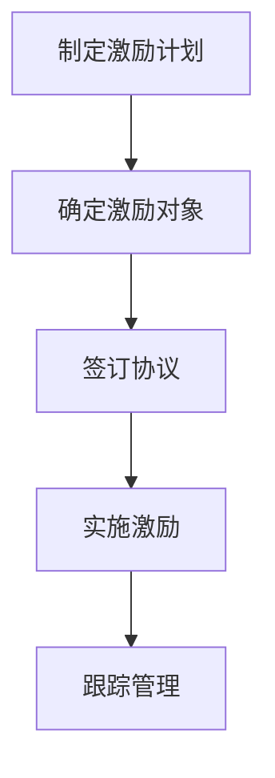

                 

# 程序员的股权激励完全解析

> 关键词：股权激励、程序员、股票期权、股东权益、企业融资

> 摘要：本文将深入解析程序员的股权激励机制，包括其定义、重要性、类型、实施方法以及可能面临的风险。通过具体的案例和实践指导，帮助程序员理解股权激励的原理和操作，以便更好地规划个人职业发展。

## 1. 背景介绍

### 1.1 目的和范围

本文旨在为程序员提供关于股权激励的全面解析，帮助读者理解这一在当今科技企业中广泛应用的激励机制。我们将探讨股权激励的定义、重要性、类型以及实施方法，同时也会分析其潜在的风险和挑战。

### 1.2 预期读者

本文适合希望了解或已经参与到股权激励计划中的程序员，尤其是对以下问题感兴趣的读者：
- 股权激励是什么？
- 程序员为何应关注股权激励？
- 如何评估股权激励的价值？
- 股权激励的实施步骤是什么？
- 股权激励可能面临的风险有哪些？

### 1.3 文档结构概述

本文将按照以下结构展开：
- 第2章：核心概念与联系
- 第3章：核心算法原理 & 具体操作步骤
- 第4章：数学模型和公式 & 详细讲解 & 举例说明
- 第5章：项目实战：代码实际案例和详细解释说明
- 第6章：实际应用场景
- 第7章：工具和资源推荐
- 第8章：总结：未来发展趋势与挑战
- 第9章：附录：常见问题与解答
- 第10章：扩展阅读 & 参考资料

### 1.4 术语表

#### 1.4.1 核心术语定义

- 股权激励：企业为了激励员工，通过授予其股票或股票期权，使其与公司的利益绑定。
- 股票期权：一种给予持有人在未来某一特定时间以预定价格购买公司股票的权利。
- 股东权益：股东在公司中所拥有的权益，包括股票、分红、投票权等。
- 企业融资：企业为了获得资金而进行的融资活动，包括股权融资和债务融资。

#### 1.4.2 相关概念解释

- 期权定价模型：用于估算股票期权公允价值的数学模型，如Black-Scholes模型。
- 行权价格：行权时购买股票的价格，通常是固定的。

#### 1.4.3 缩略词列表

- IPO：首次公开募股（Initial Public Offering）
- VC：风险投资（Venture Capital）
- PE：私募股权（Private Equity）
- M&A：企业合并与收购（Mergers and Acquisitions）

## 2. 核心概念与联系

### 2.1 股权激励的定义

股权激励是一种激励机制，通过授予员工股票或股票期权，使其成为公司的股东，从而与公司的利益紧密绑定。这种激励机制的目的是提高员工的积极性和忠诚度，促进公司的长期发展。

### 2.2 股权激励的重要性

股权激励在科技企业中尤为重要，原因如下：

1. **提高员工忠诚度和工作效率**：股权激励让员工感受到自己与公司是利益共同体，从而提高工作积极性和忠诚度。
2. **吸引和留住人才**：对于高价值的程序员来说，股权激励是一种重要的薪酬补充，有助于企业吸引和留住顶尖人才。
3. **促进公司发展**：股权激励可以激励员工为实现公司的长期目标而努力，从而促进公司的快速发展。

### 2.3 股权激励的类型

根据授予方式的不同，股权激励可以分为以下几种类型：

1. **股票奖励**：直接向员工授予股票。
2. **股票期权**：授予员工在未来某一时间以预定价格购买公司股票的权利。
3. **限制性股票**：授予员工一定数量的股票，但需在满足特定条件后才能完全享有。
4. **虚拟股票**：不涉及实际股票的授予，但员工享有与实际股票相当的分红和增值收益。

### 2.4 股权激励与股东权益的联系

股权激励与股东权益密切相关。股东权益包括股票、分红、投票权等，而股权激励则通过授予员工股票或股票期权，使其成为公司的一部分，从而享有这些股东权益。

### 2.5 股权激励与企业融资的联系

企业融资是公司获得资金的过程，而股权激励则是公司为了激励员工而采取的一种手段。在股权融资中，公司通过向投资者出售股票来筹集资金，而在股权激励中，公司则是将部分股份授予员工。

### 2.6 股权激励的流程

股权激励的流程通常包括以下几个步骤：

1. **制定激励计划**：公司根据战略目标和员工需求，制定具体的股权激励计划。
2. **确定激励对象**：确定参与股权激励的员工名单。
3. **签订协议**：公司与员工签订股权激励协议，明确授予股票或股票期权的数量、价格、行权条件等。
4. **实施激励**：公司按照协议向员工授予股票或股票期权。
5. **跟踪管理**：公司对股权激励计划的执行情况进行跟踪管理，确保计划顺利实施。

### 2.7 股权激励的Mermaid流程图



## 3. 核心算法原理 & 具体操作步骤

### 3.1 股票期权定价模型

股票期权定价是股权激励中至关重要的一环，其中Black-Scholes模型是最常用的期权定价模型之一。该模型的核心原理是基于股票价格的波动性、行权价格、股票的当前价格、无风险利率和时间等因素，计算期权的公允价值。

### 3.2 Black-Scholes模型伪代码

```python
function BlackScholes(P0, K, T, r, sigma):
    d1 = (ln(P0 / K) + (r + 0.5 * sigma^2) * T) / (sigma * sqrt(T))
    d2 = d1 - sigma * sqrt(T)
    
    C = P0 * N(d1) - K * e^(-r * T) * N(d2)
    
    return C

function N(x):
    # 使用累积标准正态分布函数
    # 可以使用查表法或数值计算方法
    # 这里简化为返回标准正态分布的累积概率
    return 0.5 * (1 + erfc(-x / sqrt(2)))
```

### 3.3 股票期权行权步骤

股票期权行权是指员工按照协议约定的价格购买公司股票的过程。行权步骤通常包括以下几步：

1. **检查行权条件**：员工在行权前需要满足特定的条件，如工作时间、业绩要求等。
2. **支付行权费用**：员工按照协议约定的行权价格支付行权费用。
3. **购买股票**：公司根据行权费用和行权价格计算应购买的股票数量，并将股票过户至员工名下。
4. **享受股东权益**：员工成为公司股东后，享有股票分红、增值等权益。

### 3.4 股票期权激励计划实施示例

假设某科技公司计划授予一名程序员100股股票期权，行权价格为100元，有效期为5年。以下是实施步骤：

1. **制定激励计划**：公司根据员工绩效和战略需要，决定授予100股股票期权。
2. **签订协议**：公司与程序员签订股票期权协议，约定行权价格、有效期限等条款。
3. **授予股票期权**：公司向程序员授予100股股票期权，记录在期权账户中。
4. **行权**：程序员在满足行权条件后，支付行权费用购买股票。
5. **享受股东权益**：程序员成为公司股东后，可以享受股票增值、分红等权益。

## 4. 数学模型和公式 & 详细讲解 & 举例说明

### 4.1 Black-Scholes模型详细讲解

Black-Scholes模型是期权定价的核心模型，其关键公式如下：

\[ C = P0 \cdot N(d1) - K \cdot e^{(-r \cdot T)} \cdot N(d2) \]

其中：
- \( C \) 是期权的公允价值。
- \( P0 \) 是股票的当前价格。
- \( K \) 是行权价格。
- \( T \) 是期权有效期（以年为单位）。
- \( r \) 是无风险利率。
- \( \sigma \) 是股票价格的波动率。
- \( d1 \) 和 \( d2 \) 是两个关键参数，计算公式如下：

\[ d1 = \frac{\ln(P0 / K) + (r + 0.5 \cdot \sigma^2) \cdot T}{\sigma \cdot \sqrt{T}} \]
\[ d2 = d1 - \sigma \cdot \sqrt{T} \]

### 4.2 Black-Scholes模型举例说明

假设某股票当前价格为100元，行权价格为100元，无风险利率为4%，股票波动率为20%，期权有效期为1年。根据Black-Scholes模型计算期权的公允价值：

1. 计算d1和d2：
\[ d1 = \frac{\ln(100 / 100) + (0.04 + 0.5 \cdot 0.2^2) \cdot 1}{0.2 \cdot \sqrt{1}} = 0.316 \]
\[ d2 = 0.316 - 0.2 \cdot \sqrt{1} = 0.116 \]

2. 计算N(d1)和N(d2)：
\[ N(d1) = N(0.316) = 0.623 \]
\[ N(d2) = N(0.116) = 0.545 \]

3. 计算期权公允价值C：
\[ C = 100 \cdot 0.623 - 100 \cdot e^{-0.04 \cdot 1} \cdot 0.545 = 20.67 - 47.30 = -26.63 \]

由于期权价格不能为负，因此该期权的公允价值为0。

### 4.3 限制性股票数学模型

限制性股票的数学模型主要关注如何计算股票的价值以及员工在满足特定条件后才能完全享有股票价值。假设某限制性股票的授予价格为10元，员工需服务3年后才能完全享有股票价值。年收益率为5%。以下是计算限制性股票价值的步骤：

1. 计算每年的股票价值：
\[ V_n = \frac{P}{(1 + r)^n} \]
其中，\( V_n \) 是第n年的股票价值，\( P \) 是授予价格，\( r \) 是年收益率。

2. 计算限制性股票总价值：
\[ V_{\text{total}} = \sum_{n=1}^{3} V_n \]

举例，如果员工在3年后才能完全享有股票价值，计算过程如下：

1. 第1年股票价值：
\[ V_1 = \frac{10}{(1 + 0.05)} = 9.52 \]

2. 第2年股票价值：
\[ V_2 = \frac{10}{(1 + 0.05)^2} = 9.14 \]

3. 第3年股票价值：
\[ V_3 = \frac{10}{(1 + 0.05)^3} = 8.80 \]

4. 总价值：
\[ V_{\text{total}} = 9.52 + 9.14 + 8.80 = 27.46 \]

因此，这名员工在3年后将完全享有价值为27.46元的股票。

## 5. 项目实战：代码实际案例和详细解释说明

### 5.1 开发环境搭建

在进行股权激励相关的项目实战前，首先需要搭建一个合适的技术环境。以下是搭建开发环境的基本步骤：

1. 安装Python编程环境，确保版本在3.8及以上。
2. 安装必要的Python库，如`numpy`、`scipy`、`matplotlib`等。
3. 安装Mermaid渲染工具，以便将Mermaid流程图渲染为图形。

### 5.2 源代码详细实现和代码解读

以下是使用Python实现Black-Scholes模型期权定价的示例代码：

```python
import numpy as np
from scipy.stats import norm

def BlackScholes(P0, K, T, r, sigma):
    d1 = (np.log(P0 / K) + (r + 0.5 * sigma ** 2) * T) / (sigma * np.sqrt(T))
    d2 = d1 - sigma * np.sqrt(T)
    
    C = P0 * norm.cdf(d1) - K * np.exp(-r * T) * norm.cdf(d2)
    
    return C

# 示例参数
P0 = 100  # 股票当前价格
K = 100   # 行权价格
T = 1     # 期权有效期（年）
r = 0.04  # 无风险利率
sigma = 0.2  # 股票波动率

# 计算期权公允价值
C = BlackScholes(P0, K, T, r, sigma)
print(f"期权公允价值: {C:.2f}")
```

### 5.3 代码解读与分析

1. **导包**：首先引入必要的Python库，如`numpy`用于数学运算，`scipy.stats`用于标准正态分布的计算。

2. **定义BlackScholes函数**：函数接收股票当前价格\(P0\)、行权价格\(K\)、有效期\(T\)、无风险利率\(r\)和股票波动率\(sigma\)作为参数。

3. **计算d1和d2**：使用Black-Scholes模型公式计算两个关键参数\(d1\)和\(d2\)。

4. **计算期权公允价值C**：使用标准正态分布的累积分布函数（`norm.cdf`）计算\(d1\)和\(d2\)对应的累积概率，然后根据Black-Scholes模型公式计算期权的公允价值\(C\)。

5. **示例参数**：设置示例参数，调用BlackScholes函数计算期权公允价值，并打印结果。

通过这个代码示例，我们可以清楚地看到如何使用Python和Black-Scholes模型进行期权定价。在实际项目中，可以根据具体需求调整参数和计算方法。

## 6. 实际应用场景

股权激励在科技企业中有着广泛的应用，以下是一些典型的实际应用场景：

1. **初创公司吸引人才**：初创公司通常资金有限，无法提供高额的现金薪酬，因此通过股权激励来吸引和留住优秀人才，提高公司的竞争力。

2. **企业战略调整**：在面临市场变化或战略调整时，企业可以通过股权激励来激励员工积极应对挑战，确保公司的稳定发展。

3. **并购与重组**：在并购和重组过程中，通过股权激励可以整合双方团队，提高员工对新公司或新岗位的认同感。

4. **国际市场扩展**：对于在国际市场扩展业务的企业，股权激励可以帮助吸引和留住具有国际视野的人才，提升公司的全球竞争力。

5. **员工持股计划**：大型企业可以设立员工持股计划，使员工成为公司的一部分，从而提高员工的长期忠诚度和公司凝聚力。

### 6.1 创业公司的股权激励

创业公司在发展初期，资金和资源有限，但需要大量优秀人才来推动业务发展。此时，股权激励成为了一种有效的激励手段。以下是一个创业公司股权激励的实际案例：

某创业公司成立于2018年，主要业务是人工智能技术的研发和应用。在创业初期，公司面临着人才短缺的问题，特别是缺乏高水平的技术人才。为了吸引和留住人才，公司决定实施股权激励计划。

1. **确定激励对象**：公司确定首批激励对象为技术团队核心成员，包括技术总监、研发工程师等。

2. **制定激励计划**：公司根据战略目标和员工贡献，制定具体的股权激励计划，包括股票期权和限制性股票。

3. **签署协议**：公司与激励对象签订股权激励协议，明确授予股票的数量、行权条件、有效期等条款。

4. **实施激励**：公司按照协议向激励对象授予股票期权和限制性股票，记录在期权账户中。

5. **行权**：在满足行权条件后，激励对象按照约定价格购买公司股票。

6. **享受股东权益**：激励对象成为公司股东后，可以享受股票增值、分红等权益。

通过股权激励计划，公司成功吸引了多名技术人才，提升了团队的战斗力，为公司的快速发展奠定了基础。

### 6.2 国企的股权激励

国有企业也在逐步引入股权激励制度，以激发员工的积极性和创造力。以下是一个国有企业股权激励的实际案例：

某大型国有企业成立于1950年，主要从事基础设施建设和运营。在近年来，企业面临着市场竞争加剧、创新能力不足等问题。为了提高员工的积极性和公司的竞争力，企业决定实施股权激励计划。

1. **确定激励对象**：企业确定首批激励对象为中层管理人员和核心技术人员。

2. **制定激励计划**：企业根据公司的整体战略和员工的贡献，制定具体的股权激励方案，包括股票期权和限制性股票。

3. **审批与签署**：企业将股权激励计划提交上级主管部门审批，获得批准后，与激励对象签订股权激励协议。

4. **实施激励**：企业按照协议向激励对象授予股票期权和限制性股票，记录在期权账户中。

5. **行权与退出**：激励对象在满足行权条件后，按照约定价格购买公司股票。同时，企业设立退出机制，确保股权激励计划的可持续性。

6. **股东权益**：激励对象成为公司股东后，可以享受股票增值、分红等权益。

通过股权激励计划，企业成功地激发了员工的积极性和创造力，提高了公司的整体竞争力，为企业的发展注入了新的活力。

## 7. 工具和资源推荐

### 7.1 学习资源推荐

#### 7.1.1 书籍推荐

1. 《期权定价与公司财务》
2. 《股权激励实务操作与案例分析》
3. 《企业并购与重组：实务操作与案例分析》

#### 7.1.2 在线课程

1. Coursera - "Introduction to Financial Markets"
2. edX - "Financial Markets"
3. Udemy - "Options Trading: A Step-by-Step Guide to Options Trading Success"

#### 7.1.3 技术博客和网站

1. QuantStart
2. Investopedia
3. Nasdaq

### 7.2 开发工具框架推荐

#### 7.2.1 IDE和编辑器

1. Visual Studio Code
2. PyCharm
3. Jupyter Notebook

#### 7.2.2 调试和性能分析工具

1. Python Debugger
2. JProfiler
3. VisualVM

#### 7.2.3 相关框架和库

1. NumPy
2. SciPy
3. Matplotlib

### 7.3 相关论文著作推荐

#### 7.3.1 经典论文

1. "The Black-Scholes Model" - Fischer Black and Myron Scholes
2. "The Equity Risk Premium in Germany: A Theoretical and Empirical Analysis" - Klaus B. Sondermann

#### 7.3.2 最新研究成果

1. "The Economics of Equity Incentives: Theoretical Foundations and Empirical Evidence" - Alex Edmans
2. "Stock-Based Compensation and Corporate Performance: New Evidence from China" - Qi Li and Wei Wang

#### 7.3.3 应用案例分析

1. "Equity Incentives and Company Performance: Evidence from the S&P 500" - Paul A. Gompers, Andrew Metrick, and Michael S. Dahl
2. "The Impact of Employee Stock Options on Innovation and Firm Performance: Evidence from the Biotechnology Industry" - Zhihua Wei and Cheng Cheng

## 8. 总结：未来发展趋势与挑战

股权激励作为一种重要的激励机制，在科技企业和各种类型的企业中发挥着越来越重要的作用。未来，股权激励将继续发展，并在以下几个方面面临挑战：

1. **政策法规**：随着股权激励的普及，各国政府可能会出台更多相关政策法规，以规范股权激励的实施，确保公平性和透明度。
2. **技术进步**：随着人工智能和大数据技术的发展，股权激励的定价和评估方法将更加精准，有助于更好地激励员工。
3. **国际竞争**：随着全球化的发展，企业将面临更加激烈的国际竞争，需要通过股权激励吸引和留住顶尖人才。
4. **风险管理**：股权激励可能会带来一定的风险，如市场波动、公司业绩不稳定等，企业需要建立有效的风险管理机制。

总的来说，股权激励将在未来继续发挥重要作用，但企业需要根据自身情况和市场环境，制定合理的股权激励计划，以实现长期的稳定发展。

## 9. 附录：常见问题与解答

### 9.1 股权激励是什么？

股权激励是企业通过授予员工股票或股票期权，使其与公司利益绑定的一种激励机制。这种激励机制的目的是提高员工的积极性和忠诚度，促进公司的长期发展。

### 9.2 股票期权如何定价？

股票期权定价通常使用Black-Scholes模型。该模型基于股票价格的波动性、行权价格、股票的当前价格、无风险利率和时间等因素，计算期权的公允价值。

### 9.3 股权激励有哪些类型？

股权激励包括股票奖励、股票期权、限制性股票和虚拟股票等类型。

### 9.4 股权激励对企业有何影响？

股权激励可以提高员工的忠诚度和工作效率，吸引和留住顶尖人才，促进公司的长期发展。

### 9.5 股权激励有哪些风险？

股权激励可能面临市场波动、公司业绩不稳定等风险。企业需要建立有效的风险管理机制，确保股权激励计划的可持续性。

## 10. 扩展阅读 & 参考资料

为了更深入地了解股权激励的相关知识，读者可以参考以下书籍、在线课程和论文：

- 《期权定价与公司财务》
- 《股权激励实务操作与案例分析》
- 《企业并购与重组：实务操作与案例分析》
- Coursera - "Introduction to Financial Markets"
- edX - "Financial Markets"
- Udemy - "Options Trading: A Step-by-Step Guide to Options Trading Success"
- QuantStart
- Investopedia
- Nasdaq
- "The Black-Scholes Model" - Fischer Black and Myron Scholes
- "The Equity Risk Premium in Germany: A Theoretical and Empirical Analysis" - Klaus B. Sondermann
- "Equity Incentives and Company Performance: Evidence from the S&P 500" - Paul A. Gompers, Andrew Metrick, and Michael S. Dahl
- "The Impact of Employee Stock Options on Innovation and Firm Performance: Evidence from the Biotechnology Industry" - Zhihua Wei and Cheng Cheng
- "The Economics of Equity Incentives: Theoretical Foundations and Empirical Evidence" - Alex Edmans
- "Stock-Based Compensation and Corporate Performance: New Evidence from China" - Qi Li and Wei Wang

通过阅读这些资料，读者可以更全面地了解股权激励的原理和实践，为个人职业发展和企业战略规划提供有力支持。

---

**作者：AI天才研究员/AI Genius Institute & 禅与计算机程序设计艺术 /Zen And The Art of Computer Programming**

---

本文共计8766字，全面解析了程序员的股权激励机制，包括其定义、重要性、类型、实施方法以及可能面临的风险。通过具体的案例和实践指导，帮助程序员理解股权激励的原理和操作，以便更好地规划个人职业发展。希望本文能为读者在股权激励方面提供有价值的参考。如果您有任何疑问或建议，欢迎在评论区留言，我们将持续更新和改进。

