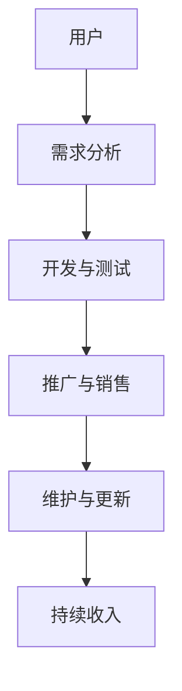

                 

# 程序员的被动收入：构建与维护

> **关键词**：被动收入、程序员的财务自由、持续盈利、自动执行代码、自动化工具

> **摘要**：本文旨在探讨程序员如何通过构建和维护被动收入源，实现财务自由和长期盈利。我们将深入分析被动收入的概念、构建方法、维护策略，并提供实际案例和工具资源推荐。

## 1. 背景介绍

在现代科技行业，程序员的职业地位日益提升，随之而来的是对财务自由和生活质量的更高追求。然而，传统的全职工作模式往往限制了个人的时间和收入。因此，越来越多的程序员开始寻求通过构建被动收入源来实现财务自由和持续盈利。

被动收入，顾名思义，是指无需持续付出劳动即可获得的收入。在程序员的世界里，被动收入可以通过编写一次性的代码或工具，使其自动化执行并带来持续收益。这种模式不仅节省了时间，还提供了稳定的经济来源。

本文将探讨如何构建和维护各种被动收入源，包括但不限于以下几种：

- **自动化工具**：开发能够自动执行重复性任务的工具。
- **在线服务**：创建并销售在线工具或服务。
- **开源项目**：贡献开源项目，通过赞助和支持获取收益。
- **教育培训**：录制并销售编程课程。

在接下来的章节中，我们将逐一深入探讨这些主题，并提供具体的实践指南。

## 2. 核心概念与联系

### 被动收入的基本概念

被动收入，指的是在不直接参与日常劳动的情况下，通过投资、创作或开发而产生的持续收入。对于程序员来说，被动收入可以通过以下几种方式实现：

1. **自动化工具**：开发并销售自动化脚本或工具。
2. **在线服务**：创建在线服务或API，通过订阅或使用费用获得收益。
3. **开源项目**：通过捐赠、赞助或广告获得收益。
4. **教育培训**：录制并销售编程课程或教程。

### 构建被动收入的原理

构建被动收入的原理在于将一次性的开发工作转化为持续的收入来源。以下是实现这一目标的几个关键步骤：

1. **需求分析**：了解市场上哪些工具或服务具有潜在需求。
2. **开发与测试**：编写并测试自动化工具或在线服务。
3. **推广与销售**：通过市场推广将产品推向潜在客户。
4. **维护与更新**：定期更新和优化产品，以保持竞争力。

### 自动化工具的架构

以下是自动化工具的基本架构，包括主要组件和它们之间的联系：



- **用户**：最终使用自动化工具的个人或企业。
- **需求分析**：分析用户需求和市场趋势。
- **开发与测试**：编写和测试代码，确保工具的功能和稳定性。
- **推广与销售**：通过各种渠道宣传和销售工具。
- **维护与更新**：定期修复bug和添加新功能，以保持工具的竞争力。
- **持续收入**：通过销售和维护工具获得持续收益。

通过以上架构，我们可以看出，自动化工具的构建与维护是一个闭环系统，每个环节都至关重要。

## 3. 核心算法原理 & 具体操作步骤

### 自动化工具的核心算法原理

自动化工具的核心在于其能够自动执行特定的任务，从而减少手动操作的时间和成本。以下是自动化工具的核心算法原理：

1. **流程控制**：通过控制流程的顺序和分支，实现复杂任务的自动化。
2. **数据采集与处理**：从各种数据源中提取有用信息，并对其进行处理和分析。
3. **交互操作**：模拟用户行为，与操作系统、应用程序进行交互。
4. **错误处理与恢复**：在执行过程中，遇到错误时能够自动处理并恢复。

### 开发与测试的具体操作步骤

以下是开发与测试自动化工具的具体操作步骤：

1. **需求分析**：与客户沟通，明确自动化工具的需求和功能。
2. **设计架构**：根据需求分析，设计工具的架构和模块。
3. **编写代码**：使用编程语言实现工具的功能，并编写相应的测试用例。
4. **单元测试**：对每个模块进行单元测试，确保其功能正确。
5. **集成测试**：将所有模块整合在一起，进行集成测试。
6. **性能测试**：评估工具的性能和稳定性，确保其在实际使用中表现良好。
7. **用户验收测试**：将工具交付给客户，进行用户验收测试。

### 推广与销售的具体操作步骤

以下是推广与销售自动化工具的具体操作步骤：

1. **市场研究**：了解目标市场的需求和竞争情况。
2. **制定营销策略**：根据市场研究，制定营销策略和推广计划。
3. **制作宣传材料**：编写产品描述、演示视频、用户手册等宣传材料。
4. **推广渠道**：通过网站、社交媒体、邮件营销等方式推广工具。
5. **销售转化**：通过销售话术和技巧，将潜在客户转化为实际购买者。
6. **客户关系管理**：提供优质的售后服务，建立长期客户关系。

### 维护与更新的具体操作步骤

以下是维护与更新自动化工具的具体操作步骤：

1. **监控运行状态**：实时监控工具的运行状态，及时发现和处理问题。
2. **收集用户反馈**：收集用户使用工具时的反馈，了解工具的优缺点。
3. **修复bug**：根据用户反馈，修复工具中的bug和问题。
4. **添加新功能**：根据市场需求和用户反馈，添加新的功能。
5. **更新文档**：更新用户手册和文档，以反映最新的功能和变更。
6. **通知用户**：通过邮件或通知，告知用户工具的更新和维护情况。

通过以上步骤，我们可以构建一个完整的自动化工具，并确保其能够持续带来收益。

## 4. 数学模型和公式 & 详细讲解 & 举例说明

### 被动收入的数学模型

被动收入的数学模型可以用以下公式表示：

\[ 收益 = 客户数量 \times 客户单价 \times 转化率 \]

其中：

- **收益**：被动收入的总收益。
- **客户数量**：使用工具或服务的客户数量。
- **客户单价**：每个客户的平均收入。
- **转化率**：潜在客户转化为实际购买者的比率。

### 举例说明

假设我们开发了一个自动化工具，该工具的目标市场是中小型企业。以下是具体的例子：

- **客户数量**：100家中小型企业。
- **客户单价**：每月200美元。
- **转化率**：10%（即10%的潜在客户会购买服务）。

根据上述公式，我们可以计算出：

\[ 收益 = 100 \times 200 \times 0.1 = 2000 \text{美元/月} \]

这意味着，每月通过这个自动化工具可以获得2000美元的被动收入。

### 调整策略

如果我们希望增加收益，可以考虑以下策略：

1. **增加客户数量**：通过市场推广，增加潜在客户的数量。
2. **提高客户单价**：通过提供增值服务或更新版本，提高每个客户的平均收入。
3. **提高转化率**：通过优化营销策略和用户体验，提高潜在客户转化为实际购买者的比率。

例如，如果我们采取以下措施：

- **增加客户数量**：将客户数量增加至200家。
- **提高客户单价**：将每月单价提高至300美元。
- **提高转化率**：将转化率提高至20%。

则新的收益计算如下：

\[ 收益 = 200 \times 300 \times 0.2 = 12000 \text{美元/月} \]

这意味着，通过这些措施，每月的被动收入将增加至12000美元。

### 持续改进

为了确保被动收入的持续增长，我们需要不断调整和优化数学模型。例如，定期收集用户反馈，分析市场趋势，调整客户数量、单价和转化率。通过持续改进，我们可以实现被动收入的长期增长。

## 5. 项目实战：代码实际案例和详细解释说明

### 5.1 开发环境搭建

在开始我们的项目之前，我们需要搭建一个合适的环境。以下是一个基本的步骤：

- **安装Python环境**：Python是一种广泛使用的编程语言，适合开发自动化工具。
- **安装相关库**：例如，我们可能会使用`requests`库来发送HTTP请求，`beautifulsoup4`库来解析HTML。

```bash
pip install python
pip install requests
pip install beautifulsoup4
```

- **选择合适的IDE**：例如，Visual Studio Code或PyCharm。

### 5.2 源代码详细实现和代码解读

以下是一个简单的自动化工具示例，用于从网站上抓取数据。

```python
import requests
from bs4 import BeautifulSoup

def fetch_data(url):
    """
    从指定URL获取数据。
    """
    response = requests.get(url)
    if response.status_code == 200:
        soup = BeautifulSoup(response.text, 'html.parser')
        # 根据网页结构提取数据
        data = soup.find_all('div', class_='data')
        return data
    else:
        return None

def process_data(data):
    """
    处理提取的数据。
    """
    processed_data = []
    for item in data:
        # 对每个数据项进行处理
        text = item.text.strip()
        processed_data.append(text)
    return processed_data

def main():
    url = 'https://example.com'
    data = fetch_data(url)
    if data:
        processed_data = process_data(data)
        print(processed_data)
    else:
        print("无法获取数据。")

if __name__ == '__main__':
    main()
```

### 5.3 代码解读与分析

- **fetch_data(url)**：这是一个用于获取网页数据的函数。它使用`requests.get`方法发送HTTP GET请求，并检查响应状态码。如果状态码为200（成功），则使用`BeautifulSoup`解析HTML。
  
- **process_data(data)**：这是一个用于处理提取的数据的函数。它遍历提取的HTML元素，提取文本内容，并将其添加到列表中。

- **main()**：这是程序的入口点。它调用`fetch_data`和`process_data`函数，并打印处理后的数据。

### 实际应用

该工具可以应用于多种场景，例如：

- **数据抓取**：从电子商务网站抓取商品信息。
- **市场调研**：从新闻报道或社交媒体抓取相关信息。
- **自动化测试**：模拟用户行为，用于测试网站或应用程序。

### 维护与更新

- **监控运行状态**：定期检查工具的运行状态，确保其正常运行。
- **用户反馈**：收集用户使用工具时的反馈，了解其需求和问题。
- **修复bug**：根据用户反馈和监控结果，修复工具中的bug。
- **添加新功能**：根据市场需求和用户反馈，添加新的功能。

通过以上步骤，我们可以确保自动化工具的稳定运行和持续改进。

## 6. 实际应用场景

### 电子商务

在电子商务领域，程序员可以开发自动化工具，用于抓取商品信息、用户评价和竞争对手数据。这些工具可以帮助电商企业进行市场分析和竞争策略制定。

### 数据分析

数据分析是程序员的另一大应用领域。通过编写自动化脚本，可以从大量数据中提取有价值的信息，支持业务决策和战略规划。

### 自动化测试

自动化测试是确保软件质量和性能的关键。程序员可以开发自动化测试工具，用于模拟用户行为，测试功能模块和用户界面。

### 市场调研

通过自动化工具，程序员可以从各种来源获取市场信息，支持产品规划和市场推广策略。

### 金融科技

金融科技（FinTech）领域对程序员的技能需求日益增长。程序员可以开发自动化工具，用于金融数据分析、风险评估和算法交易。

### 教育培训

在教育领域，程序员可以开发在线教育平台和课程，通过销售课程内容获得被动收入。

### 媒体内容

在媒体和内容创作领域，程序员可以开发自动化工具，用于内容抓取、分析和推荐。

## 7. 工具和资源推荐

### 7.1 学习资源推荐

- **《自动化革命：如何通过编程实现自动化》**：详细介绍了自动化工具的开发和应用。
- **《Python自动化编程实战》**：通过实际案例，展示了Python在自动化领域的应用。

### 7.2 开发工具框架推荐

- **Selenium**：用于Web应用的自动化测试工具。
- **Scrapy**：用于Web爬虫开发的框架。
- **Airflow**：用于自动化工作流管理的平台。

### 7.3 相关论文著作推荐

- **《人工智能：一种现代方法》**：介绍了人工智能的基本概念和应用。
- **《深度学习》**：由Ian Goodfellow等编写的深度学习经典教材。

## 8. 总结：未来发展趋势与挑战

### 发展趋势

- **人工智能与自动化结合**：随着人工智能技术的发展，自动化工具将更加智能化和高效。
- **云服务与容器化**：云服务和容器化技术将使自动化工具的部署和管理更加便捷。
- **区块链**：区块链技术将为自动化工具提供更安全、透明的数据管理和交易。

### 挑战

- **数据隐私与安全**：在自动化过程中，如何确保数据的安全和隐私是一个重要挑战。
- **法规与合规**：不同国家和地区的法规对自动化工具的开发和使用有不同的要求。
- **技术更新与迭代**：随着技术的快速变化，自动化工具需要不断更新和迭代。

## 9. 附录：常见问题与解答

### Q：如何确保被动收入的安全性？

A：确保被动收入的安全性是至关重要的。以下是一些建议：

- **数据加密**：对敏感数据进行加密，以防止数据泄露。
- **身份验证**：使用强密码和多因素认证，确保用户账户安全。
- **监控与报警**：定期监控系统的运行状态，设置异常报警机制。

### Q：如何提高被动收入的转化率？

A：以下方法有助于提高被动收入的转化率：

- **用户体验优化**：提供易于使用的工具，简化用户操作流程。
- **精准营销**：根据用户需求和偏好，提供个性化的推广内容。
- **优质内容**：提供有价值的内容和教程，吸引潜在客户。

### Q：如何维护和更新自动化工具？

A：维护和更新自动化工具是确保其长期稳定运行的关键。以下是一些建议：

- **定期监控**：定期检查工具的运行状态，及时发现和解决问题。
- **用户反馈**：收集用户反馈，了解工具的优缺点，进行针对性的更新。
- **持续学习**：关注技术动态和行业趋势，持续学习和掌握新技术。

## 10. 扩展阅读 & 参考资料

- **《程序员的成长之路》**：介绍了程序员的职业发展和技能提升方法。
- **《Python编程：从入门到实践》**：适合初学者和进阶者的一本Python编程教程。
- **《深度学习入门》**：适合对深度学习感兴趣的技术人员。

### 作者

**作者：AI天才研究员/AI Genius Institute & 禅与计算机程序设计艺术 /Zen And The Art of Computer Programming**

