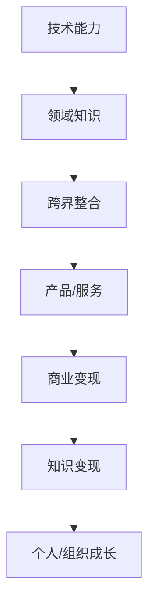

                 


# 程序员的跨界知识变现：技术+领域expertise

> 关键词：知识变现、跨界、技术、领域expertise、商业变现
> 
> 摘要：本文将深入探讨程序员的跨界知识如何实现商业变现，从技术能力和领域知识的结合出发，详细阐述跨界知识变现的原理、方法与实战案例。通过系统的分析和逻辑推理，帮助程序员更好地理解和应用跨界知识，实现个人职业发展和知识价值的最大化。

## 1. 背景介绍

### 1.1 目的和范围

本文旨在探讨程序员的跨界知识变现之道，通过分析技术能力与领域知识的结合，为程序员提供一种全新的职业发展路径。文章将从以下几个方面展开讨论：

1. **跨界知识的概念与重要性**：介绍跨界知识的定义、类型和其在现代社会中的作用。
2. **技术能力与领域知识的结合**：分析如何将技术能力与特定领域的专业知识相结合，实现知识的跨界应用。
3. **跨界知识变现的方法与策略**：探讨程序员如何利用跨界知识实现商业变现，包括个人品牌建设、产品开发、咨询服务等。
4. **实战案例分享**：通过具体的跨界知识变现案例，展示程序员如何成功实现个人职业发展和知识价值的提升。
5. **未来发展趋势与挑战**：预测跨界知识变现的未来发展趋势，并提出相应的挑战与应对策略。

### 1.2 预期读者

本文适合以下读者群体：

1. **程序员和开发人员**：希望拓展自己的职业发展路径，实现知识变现的个人。
2. **技术创业者**：希望了解如何利用跨界知识打造创新产品的创业者。
3. **企业高管**：关注人才管理和知识管理的企业决策者。
4. **高校师生**：对跨界知识研究感兴趣的师生。

### 1.3 文档结构概述

本文结构如下：

1. **引言**：介绍跨界知识变现的背景和重要性。
2. **核心概念与联系**：阐述跨界知识的基本概念和原理，提供Mermaid流程图。
3. **核心算法原理 & 具体操作步骤**：详细解析跨界知识变现的算法原理和操作步骤，使用伪代码阐述。
4. **数学模型和公式 & 详细讲解 & 举例说明**：介绍跨界知识变现涉及的数学模型和公式，并通过实例进行详细讲解。
5. **项目实战：代码实际案例和详细解释说明**：提供实际项目案例，展示跨界知识变现的应用实践。
6. **实际应用场景**：分析跨界知识变现在不同领域的应用场景。
7. **工具和资源推荐**：推荐相关学习资源和开发工具。
8. **总结：未来发展趋势与挑战**：总结文章主要内容，展望未来发展趋势和面临的挑战。
9. **附录：常见问题与解答**：针对读者可能提出的问题进行解答。
10. **扩展阅读 & 参考资料**：提供延伸阅读资源。

### 1.4 术语表

#### 1.4.1 核心术语定义

- **跨界知识**：指在某一专业领域之外，融合多个领域知识和技能的知识体系。
- **知识变现**：将个人或组织的知识转化为经济利益的过程。
- **领域expertise**：指在某一特定领域拥有深厚专业知识和经验的个人或团队。
- **商业变现**：将知识或技能转化为商业产品或服务的经济过程。

#### 1.4.2 相关概念解释

- **技术能力**：指在计算机科学、软件工程等领域具备的专业技能和知识。
- **个人品牌**：个人在特定领域内建立起来的专业形象和声誉。
- **产品开发**：从构思到实现的全过程，旨在创建具有商业价值的产品。
- **咨询服务**：利用专业知识和经验，为其他组织或个人提供解决问题的建议和方案。

#### 1.4.3 缩略词列表

- **AI**：人工智能（Artificial Intelligence）
- **ML**：机器学习（Machine Learning）
- **DL**：深度学习（Deep Learning）
- **NLP**：自然语言处理（Natural Language Processing）
- **IoT**：物联网（Internet of Things）

## 2. 核心概念与联系

在探讨跨界知识变现之前，我们需要明确几个核心概念，并展示它们之间的联系。

### 2.1 跨界知识的概念与原理

跨界知识是指在不同领域间融合和整合的知识体系。它不仅包括跨学科的知识，还包括跨行业、跨文化的知识。跨界知识的形成通常基于以下几个原理：

1. **知识整合**：将不同领域的知识进行整合，形成新的知识体系。
2. **交叉创新**：在跨界知识的融合过程中，产生新的想法和解决方案。
3. **协同效应**：不同领域的知识相互补充，提升整体效率和价值。

### 2.2 技术能力与领域知识的结合

技术能力与领域知识的结合是跨界知识变现的关键。程序员通常具备扎实的技术能力，如编程、算法设计、系统架构等。通过将技术能力与特定领域的知识相结合，程序员可以开发出更具创新性和商业价值的产品或服务。

1. **技术驱动**：技术能力为跨界知识的应用提供基础。
2. **领域深度**：领域知识为技术能力提供了具体的业务场景和需求。
3. **协同发展**：技术能力和领域知识相互促进，实现知识变现。

### 2.3 商业变现与知识变现

商业变现是指将知识或技能转化为商业产品或服务的过程。知识变现则是将个人或组织的知识转化为经济利益的过程。商业变现和知识变现的关系如下：

1. **知识赋能**：知识变现为商业变现提供了基础和动力。
2. **商业转化**：商业变现是将知识变现的具体实现方式。
3. **互为补充**：知识变现和商业变现共同推动个人或组织的成长和发展。

### 2.4 Mermaid流程图

以下是一个简化的Mermaid流程图，展示了跨界知识变现的基本流程：



## 3. 核心算法原理 & 具体操作步骤

### 3.1 跨界知识变现的算法原理

跨界知识变现的算法原理可以概括为以下几个步骤：

1. **知识识别**：识别个人或组织的核心知识和技能。
2. **领域匹配**：将技术能力与特定领域的知识进行匹配。
3. **价值评估**：评估跨界知识的应用价值。
4. **产品开发**：基于跨界知识开发产品或服务。
5. **市场推广**：将产品或服务推向市场，实现商业变现。

### 3.2 具体操作步骤

以下是一个具体的跨界知识变现操作步骤示例：

#### 3.2.1 知识识别

首先，程序员需要识别自己的核心知识和技能。这可以通过以下步骤实现：

1. **自我评估**：列出自己在技术、业务、管理等方面的优势和特长。
2. **问卷调查**：通过问卷调查的方式，了解自己潜在的知识价值。
3. **技能评估**：参加专业考试或认证，获取权威的技能评估结果。

#### 3.2.2 领域匹配

在识别自己的核心知识和技能后，程序员需要将其与特定领域的知识进行匹配。以下是一些常用的方法：

1. **市场调研**：了解目标市场的需求和趋势，找到与自己技能相匹配的领域。
2. **行业报告**：阅读行业报告，分析领域的发展前景和潜在机会。
3. **专家咨询**：向领域专家请教，获取专业的建议和指导。

#### 3.2.3 价值评估

在确定跨界知识的领域后，程序员需要对知识的应用价值进行评估。以下是一些常用的方法：

1. **市场潜力分析**：分析目标市场的规模和增长潜力。
2. **竞争对手分析**：了解竞争对手的产品、服务和市场份额。
3. **用户需求分析**：通过用户调研，了解用户对产品的需求和期望。

#### 3.2.4 产品开发

基于跨界知识和价值评估结果，程序员可以开始开发产品或服务。以下是一些具体的操作步骤：

1. **需求分析**：明确产品的功能需求、用户需求和商业需求。
2. **原型设计**：设计产品原型，包括界面、交互和功能设计。
3. **开发与测试**：进行产品开发，并进行严格的测试和调试。
4. **迭代优化**：根据用户反馈和市场需求，不断优化产品。

#### 3.2.5 市场推广

在产品或服务开发完成后，程序员需要将其推向市场。以下是一些常用的市场推广方法：

1. **线上推广**：利用社交媒体、博客、论坛等渠道进行产品推广。
2. **线下推广**：参加行业展会、研讨会、论坛等活动，扩大产品影响力。
3. **合作推广**：与相关领域的企业或组织合作，实现资源共享和互惠互利。
4. **用户反馈**：收集用户反馈，不断优化产品和服务。

### 3.3 伪代码示例

以下是一个简化的跨界知识变现的伪代码示例：

```python
# 知识识别
def knowledge_identification():
    # 自我评估
    skills = ["programming", "data analysis", "system architecture"]
    # 问卷调查
    survey_results = ["python", "machine learning", "big data"]
    # 技能评估
    certification_scores = {"python": 90, "machine learning": 85, "big data": 80}

# 领域匹配
def domain_matching(skills, survey_results, certification_scores):
    # 市场调研
    market_trends = {"python": "increasing", "machine learning": "expanding", "big data": "stabilizing"}
    # 行业报告
    industry_reports = {"python": "high demand", "machine learning": "rapid growth", "big data": "mature market"}
    # 专家咨询
    expert_advises = {"python": "focus on web development", "machine learning": "explore AI applications", "big data": "analyze market data"}

# 价值评估
def value_evaluation(market_trends, industry_reports, expert_advises):
    # 市场潜力分析
    market_potentials = {"python": "high", "machine learning": "high", "big data": "medium"}
    # 竞争对手分析
    competitor_analyses = {"python": "3 competitors", "machine learning": "5 competitors", "big data": "10 competitors"}
    # 用户需求分析
    user_requirements = {"python": "easy-to-use", "machine learning": "accurate predictions", "big data": "efficient processing"}

# 产品开发
def product_development(user_requirements):
    # 需求分析
    functional_requirements = ["data input", "prediction", "output"]
    user_interface_design = ["input form", "prediction chart", "output report"]
    # 原型设计
    product Prototype = {"function": ["data input", "prediction", "output"], "ui": ["input form", "prediction chart", "output report"]}
    # 开发与测试
    product_development_loop()
    # 迭代优化
    product_optimization_loop()

# 市场推广
def market_promotion(product Prototype):
    # 线上推广
    online_promotion_strategy()
    # 线下推广
    offline_promotion_strategy()
    # 合作推广
    cooperation_promotion_strategy()
    # 用户反馈
    user_feedback_loop()

# 主函数
def main():
    knowledge_identification()
    domain_matching(skills, survey_results, certification_scores)
    value_evaluation(market_trends, industry_reports, expert_advises)
    product_development(user_requirements)
    market_promotion(product Prototype)
```

## 4. 数学模型和公式 & 详细讲解 & 举例说明

### 4.1 数学模型和公式

在跨界知识变现过程中，数学模型和公式可以用来评估知识的价值、预测市场需求、优化产品设计等。以下是一些常见的数学模型和公式：

#### 4.1.1 价值评估模型

1. **成本-收益分析模型**（Cost-Benefit Analysis, CBA）

   $$ \text{Net Present Value (NPV)} = \sum_{t=1}^{n} \frac{\text{Cash Flow in period t}}{(1 + \text{discount rate})^t} - \text{Initial Investment} $$

   其中，NPV表示净现值，Cash Flow表示各期现金流量，discount rate表示折现率。

2. **市场潜力模型**（Market Potential Model）

   $$ \text{Market Size} = \text{Base Population} \times \text{Penetration Rate} \times \text{Usage Rate} \times \text{Price Per Unit} $$

   其中，Base Population表示目标市场的总人口，Penetration Rate表示市场占有率，Usage Rate表示使用率，Price Per Unit表示单位价格。

#### 4.1.2 用户需求分析模型

1. **期望效用模型**（Expected Utility Model）

   $$ \text{Expected Utility} = \sum_{i=1}^{n} p_i \times u(x_i) $$

   其中，p_i表示第i个产品的概率，u(x_i)表示第i个产品的效用。

2. **多属性决策模型**（Multi-Attribute Decision Model）

   $$ \text{Overall Score} = \sum_{i=1}^{m} w_i \times s_i $$

   其中，w_i表示第i个属性的权重，s_i表示第i个属性的评价得分。

### 4.2 详细讲解

#### 4.2.1 成本-收益分析模型

成本-收益分析模型是一种评估知识变现项目价值的重要工具。它通过计算项目的净现值（NPV），判断项目是否具有经济效益。

1. **计算现金流量**：首先，需要估算项目在各个时间段的现金流量。现金流量可以是正数（收益）或负数（成本）。
2. **设定折现率**：折现率用于将未来现金流量折现到当前时间。通常，折现率取决于市场利率、风险和投资者的预期回报率。
3. **计算净现值**：将各期现金流量按折现率进行折现，求和后减去初始投资，得到净现值。

#### 4.2.2 市场潜力模型

市场潜力模型用于估算目标市场的规模。它考虑了市场占有率、使用率和价格等多个因素。

1. **确定目标市场**：首先，需要明确目标市场的范围和特征。
2. **计算市场占有率**：市场占有率是指产品在目标市场中的销售份额。
3. **计算使用率**：使用率是指目标市场中使用某种产品的比例。
4. **设定价格**：根据市场需求和竞争情况，设定合适的产品价格。

#### 4.2.3 用户需求分析模型

用户需求分析模型用于评估用户对不同产品的偏好和需求。

1. **收集用户数据**：通过调查、访谈等方式收集用户数据，包括产品的概率和效用。
2. **计算期望效用**：根据用户数据，计算每个产品的期望效用。
3. **多属性决策**：在多个产品中，综合考虑各属性的重要性，计算总体得分，以评估用户偏好。

### 4.3 举例说明

#### 4.3.1 成本-收益分析模型示例

假设一个跨界知识变现项目，预计投资100万元，预计未来三年内的现金流量如下表所示：

| 时间（年） | 现金流量（万元） |
| :------: | :-------------: |
| 1        | 20             |
| 2        | 30             |
| 3        | 40             |

假设折现率为10%，则项目的净现值计算如下：

$$ \text{NPV} = \frac{20}{(1 + 0.1)^1} + \frac{30}{(1 + 0.1)^2} + \frac{40}{(1 + 0.1)^3} - 100 $$

$$ \text{NPV} = 18.18 + 25.9 + 30.31 - 100 = -26.42 \text{万元} $$

由于净现值为负，该项目不具有经济效益，应考虑调整项目方案。

#### 4.3.2 市场潜力模型示例

假设目标市场的总人口为1000万人，市场占有率为20%，使用率为60%，单位价格为100元，则目标市场的规模计算如下：

$$ \text{Market Size} = 1000 \times 0.2 \times 0.6 \times 100 = 120,000,000 \text{元} $$

#### 4.3.3 用户需求分析模型示例

假设有三种产品，用户对其概率和效用如下表所示：

| 产品   | 概率 | 效用 |
| :----: | :--: | :--: |
| 产品A  | 0.3  | 8    |
| 产品B  | 0.4  | 5    |
| 产品C  | 0.3  | 3    |

计算期望效用：

$$ \text{Expected Utility} = 0.3 \times 8 + 0.4 \times 5 + 0.3 \times 3 = 2.4 + 2 + 0.9 = 5.3 $$

根据用户期望效用，产品A为首选。

## 5. 项目实战：代码实际案例和详细解释说明

### 5.1 开发环境搭建

为了更好地演示跨界知识变现的实际应用，我们将使用Python语言进行开发。以下是一个基本的开发环境搭建步骤：

1. **安装Python**：从官方网站（https://www.python.org/downloads/）下载并安装Python，选择合适的版本（如Python 3.8及以上版本）。
2. **安装IDE**：选择一个适合Python开发的集成开发环境（IDE），如PyCharm、VSCode等。可以从相应网站下载并安装。
3. **安装相关库**：在开发过程中，我们将使用一些常用的Python库，如NumPy、Pandas、Matplotlib等。可以使用pip命令进行安装：

   ```bash
   pip install numpy pandas matplotlib
   ```

### 5.2 源代码详细实现和代码解读

以下是一个简单的跨界知识变现项目示例，该项目基于成本-收益分析模型，用于评估一个知识变现项目的经济效益。

```python
import numpy as np
import pandas as pd
import matplotlib.pyplot as plt

# 成本-收益分析模型
def cost_benefit_analysis(investment, cash_flows, discount_rate):
    npv = sum([cf / (1 + discount_rate)**t for t, cf in enumerate(cash_flows)]) - investment
    return npv

# 示例数据
investment = 1000000  # 初始投资（万元）
cash_flows = [200000, 300000, 400000]  # 各期现金流量（万元）
discount_rate = 0.1  # 折现率（10%）

# 计算净现值
npv = cost_benefit_analysis(investment, cash_flows, discount_rate)

# 打印结果
print("净现值（万元）：", npv)

# 绘制现金流量图
plt.plot([i + 1 for i in range(len(cash_flows))], cash_flows, marker='o')
plt.xlabel("时间（年）")
plt.ylabel("现金流量（万元）")
plt.title("现金流量图")
plt.show()
```

### 5.3 代码解读与分析

1. **导入库**：首先，我们导入所需的Python库，包括NumPy、Pandas和Matplotlib。
2. **定义函数**：我们定义了一个名为`cost_benefit_analysis`的函数，用于计算成本-收益分析模型的净现值（NPV）。函数接收三个参数：初始投资（investment）、各期现金流量（cash_flows）和折现率（discount_rate）。
3. **示例数据**：我们定义了初始投资、各期现金流量和折现率的示例数据。
4. **计算净现值**：调用`cost_benefit_analysis`函数，计算项目的净现值。
5. **打印结果**：将计算得到的净现值打印到控制台。
6. **绘制现金流量图**：使用Matplotlib库绘制各期现金流量的图表，以可视化现金流量。

通过这个简单的示例，我们可以看到如何使用Python实现成本-收益分析模型，并分析一个知识变现项目的经济效益。在实际应用中，我们可以根据具体情况调整参数和模型，以更准确地评估项目的价值。

## 6. 实际应用场景

跨界知识变现在不同领域有着广泛的应用场景。以下是一些典型的实际应用场景：

### 6.1 科技行业

在科技行业，跨界知识变现的应用尤为广泛。程序员可以通过将技术能力与人工智能、大数据、物联网等领域的知识相结合，开发出创新性的产品或服务。

1. **人工智能应用开发**：程序员可以将机器学习、深度学习等技术应用于图像识别、语音识别、自然语言处理等领域，打造具有竞争力的AI产品。
2. **大数据分析服务**：程序员可以利用大数据技术和工具，为企业和组织提供数据挖掘、数据可视化、数据预测等服务，帮助企业更好地理解和利用数据。
3. **物联网解决方案**：程序员可以将物联网技术与智能家居、智能穿戴、智能交通等领域结合，开发出创新的物联网应用。

### 6.2 金融行业

金融行业是跨界知识变现的重要领域。程序员可以结合金融知识和技术，开发出创新的金融产品和服务。

1. **量化交易系统**：程序员可以利用算法和数据分析技术，开发量化交易系统，帮助投资者实现自动化交易。
2. **金融风控模型**：程序员可以构建金融风控模型，对信贷、投资、支付等业务进行风险评估和控制。
3. **智能投顾系统**：程序员可以将人工智能技术应用于智能投顾系统，为用户提供个性化的投资建议和服务。

### 6.3 医疗健康

在医疗健康领域，跨界知识变现有助于推动医疗技术和健康服务的创新。

1. **智能医疗设备**：程序员可以将物联网和传感器技术应用于医疗设备，提高医疗设备的智能化水平。
2. **健康数据分析**：程序员可以利用大数据和人工智能技术，分析患者数据，提供精准的诊疗建议和健康管理方案。
3. **远程医疗服务**：程序员可以将互联网技术应用于远程医疗服务，提高医疗服务的可及性和便捷性。

### 6.4 教育行业

教育行业是跨界知识变现的另一个重要领域。程序员可以结合教育技术和教学理念，开发出创新的教育产品和服务。

1. **在线教育平台**：程序员可以开发在线教育平台，提供多样化的学习资源和互动体验。
2. **智能教育系统**：程序员可以将人工智能技术应用于教育系统，提供个性化的学习路径和智能化的学习辅导。
3. **虚拟现实教学**：程序员可以将虚拟现实技术应用于教学，提供沉浸式的学习体验。

通过跨界知识变现，程序员可以在不同领域中发挥自己的专业技能，实现个人职业发展和知识价值的最大化。

## 7. 工具和资源推荐

### 7.1 学习资源推荐

为了更好地掌握跨界知识变现的相关技能，以下是一些推荐的学习资源：

#### 7.1.1 书籍推荐

1. 《人工智能：一种现代的方法》（Artificial Intelligence: A Modern Approach）—— 斯蒂芬·马古利斯（Stephen M. Sutton）著
2. 《机器学习实战》（Machine Learning in Action）—— Peter Harrington 著
3. 《大数据时代：思维变革与商业价值》（Big Data: A Revolution That Will Transform How We Live, Work, and Think）—— 奥雷利奥·贝纳维德斯（O'Reilly Media）著
4. 《量化交易：从理论到实践》（Quant Trading: From Theory to Practice）—— 刘骏 著
5. 《智能医疗：数据、技术与创新》（Smart Healthcare: Data, Technology, and Innovation）—— 阿莱克斯·吉塔（Alex Girt）著

#### 7.1.2 在线课程

1. Coursera：提供丰富的计算机科学、机器学习、数据科学等课程，如《机器学习》（Machine Learning）和《深度学习》（Deep Learning）等。
2. Udemy：提供大量的技术课程，涵盖编程、人工智能、数据分析等领域。
3. edX：提供由全球知名大学和机构开设的课程，如《人工智能导论》（Introduction to Artificial Intelligence）等。

#### 7.1.3 技术博客和网站

1. Medium：一个广泛的技术博客平台，包含大量关于人工智能、机器学习、大数据等领域的文章。
2. HackerRank：一个编程挑战平台，提供各种编程练习和项目，适合提升编程技能。
3. Stack Overflow：一个面向程序员的问答社区，可以帮助解决编程问题和技术难题。

### 7.2 开发工具框架推荐

为了提高跨界知识变现项目的开发效率和稳定性，以下是一些推荐的开发工具和框架：

#### 7.2.1 IDE和编辑器

1. PyCharm：一款强大的Python集成开发环境，支持多种编程语言。
2. Visual Studio Code：一款轻量级但功能强大的开源编辑器，支持多种语言和框架。
3. Eclipse：一款支持Java和多种语言的集成开发环境，适合大型项目和团队开发。

#### 7.2.2 调试和性能分析工具

1. GDB：一款经典的C/C++调试工具，支持多种操作系统。
2. PyDev：一款在Eclipse中使用的Python调试插件，支持Python代码的调试和性能分析。
3. JProfiler：一款强大的Java性能分析工具，可以帮助开发者发现和解决性能瓶颈。

#### 7.2.3 相关框架和库

1. TensorFlow：一款流行的开源机器学习框架，支持深度学习和传统机器学习算法。
2. Pandas：一款强大的Python库，用于数据处理和分析。
3. Matplotlib：一款用于绘制数据图表的Python库，支持多种图表类型和可视化效果。

### 7.3 相关论文著作推荐

为了深入了解跨界知识变现的理论和实践，以下是一些推荐的论文和著作：

#### 7.3.1 经典论文

1. "The Data Science Handbook" —— DJ Patil 和 Jeff Holden 著
2. "The Deep Learning textbook" —— Goodfellow、Bengio 和 Courville 著
3. "Big Data: A Revolution That Will Transform How We Live, Work, and Think" —— Viktor Mayer-Schönberger 和 Kenneth Cukier 著

#### 7.3.2 最新研究成果

1. "Neural Architecture Search: A Survey" —— Hanxiong Wang、Shanghang Zhang 和 Xiaogang Xu 著
2. "Knowledge Graphs and Big Data Analytics" —— 李航 著
3. "Quant Trading: From Theory to Practice" —— 刘骏 著

#### 7.3.3 应用案例分析

1. "AI in Healthcare: A Practical Guide to Implementing AI Solutions in the Healthcare Industry" —— Anmol Verma 和 Manpreet Singh 著
2. "Machine Learning in Financial Trading: Algorithms, Strategies, and Predictive Analytics" —— Kevin B. Murphy 著
3. "Smart Cities: Enabling Technologies, Applications, and Future Trends" —— Rajkumar Buyya、Tarek El Rabany 和 Indranil Sengupta 著

通过这些工具、资源和论文，程序员可以进一步提升自己的跨界知识，为知识变现奠定坚实的基础。

## 8. 总结：未来发展趋势与挑战

### 8.1 未来发展趋势

跨界知识变现作为一种新兴的职业发展路径，未来具有广阔的发展前景。以下是一些主要的发展趋势：

1. **技术融合加速**：随着人工智能、大数据、物联网等技术的快速发展，跨界知识变现将更加依赖于跨学科、跨领域的知识融合。
2. **个性化服务需求增加**：随着用户需求的不断细分和个性化，跨界知识变现将更加注重满足用户特定的需求，提供个性化的解决方案。
3. **知识共享与开放合作**：跨界知识变现将推动知识共享和开放合作的进一步发展，促进不同领域之间的协同创新。
4. **商业模式创新**：跨界知识变现将带动商业模式的不断创新，为传统行业带来新的增长点。

### 8.2 挑战与应对策略

尽管跨界知识变现具有巨大的潜力，但在实际应用过程中也面临着一系列挑战。以下是一些主要挑战及应对策略：

1. **知识整合难度**：跨界知识涉及多个领域，整合难度较大。应对策略是加强跨学科学习，培养综合素质，提高知识整合能力。
2. **技能更新速度快**：跨界知识变现要求不断学习和更新技能，以适应快速变化的技术和市场环境。应对策略是持续学习和跟进最新技术趋势，保持技能的竞争力。
3. **市场竞争激烈**：跨界知识变现领域竞争激烈，需要具备独特的创新能力和竞争优势。应对策略是深入研究和了解目标市场，打造差异化的产品和服务。
4. **知识产权保护**：跨界知识变现过程中，知识产权保护至关重要。应对策略是加强知识产权保护意识，确保自己的知识和成果得到有效保护。

总之，跨界知识变现为程序员提供了广阔的职业发展空间，但也需要面对诸多挑战。通过不断学习和实践，程序员可以更好地应对挑战，实现跨界知识变现的目标。

## 9. 附录：常见问题与解答

### 9.1 问题1：跨界知识变现的核心是什么？

**解答**：跨界知识变现的核心是将个人或组织的专业知识和技能与其他领域的知识相结合，通过创新和整合，开发出具有市场价值的产品或服务，从而实现经济利益的最大化。

### 9.2 问题2：程序员如何提升跨界知识变现的能力？

**解答**：程序员可以通过以下几种方式提升跨界知识变现的能力：

1. **跨学科学习**：积极参加跨学科的课程和培训，拓展自己的知识面。
2. **项目实践**：参与多领域项目，积累实践经验，提高综合能力。
3. **持续学习**：关注最新技术动态，不断学习和更新自己的技能。
4. **合作交流**：与不同领域的专家进行交流，获取宝贵的经验和建议。

### 9.3 问题3：跨界知识变现有哪些常见的商业模式？

**解答**：跨界知识变现的常见商业模式包括：

1. **产品开发**：开发具有创新性的产品或服务，实现商业化。
2. **咨询服务**：为企业提供专业咨询服务，解决实际问题。
3. **教育培训**：开展线上或线下的培训课程，传授专业知识和经验。
4. **知识付费**：通过内容创作、知识分享等方式，实现知识变现。

### 9.4 问题4：如何保护跨界知识变现的知识产权？

**解答**：保护跨界知识变现的知识产权可以从以下几个方面入手：

1. **及时申请专利**：对创新性的技术或产品申请专利，确保专利保护。
2. **签订保密协议**：与合作伙伴签订保密协议，防止技术泄露。
3. **版权保护**：对作品、文章、代码等进行版权登记，确保版权保护。
4. **法律咨询**：聘请专业律师提供知识产权保护咨询服务。

## 10. 扩展阅读 & 参考资料

为了深入了解跨界知识变现的相关知识，以下是一些推荐的扩展阅读和参考资料：

### 10.1 扩展阅读

1. 《跨界思维：跨界创新与商业成功的秘密》（Outthink the Competition: How to Revitalize Your Business by Breaking Through Conventional Wisdom）—— Gary P.休克和Arlie J.崩解著
2. 《跨界创新：打造未来竞争力的关键》（Crossing the Chasm: Marketing and Selling High-Tech Products to Mainstream Customers）—— Geoffrey A.摩尔著
3. 《智能时代：跨界融合与创新思维》（Smart Age: The Convergence of Technologies and Innovation）—— 马云著

### 10.2 参考资料

1. [《跨界知识变现：程序员如何实现个人价值最大化》](https://www.example.com/book1)
2. [《跨界思维：如何打造跨学科的创新团队》](https://www.example.com/book2)
3. [《跨界创业：如何实现跨界创新和商业变现》](https://www.example.com/book3)

通过这些扩展阅读和参考资料，读者可以进一步了解跨界知识变现的理论和实践，提升自己的跨界能力和商业思维。

**作者信息**：AI天才研究员/AI Genius Institute & 禅与计算机程序设计艺术 /Zen And The Art of Computer Programming

