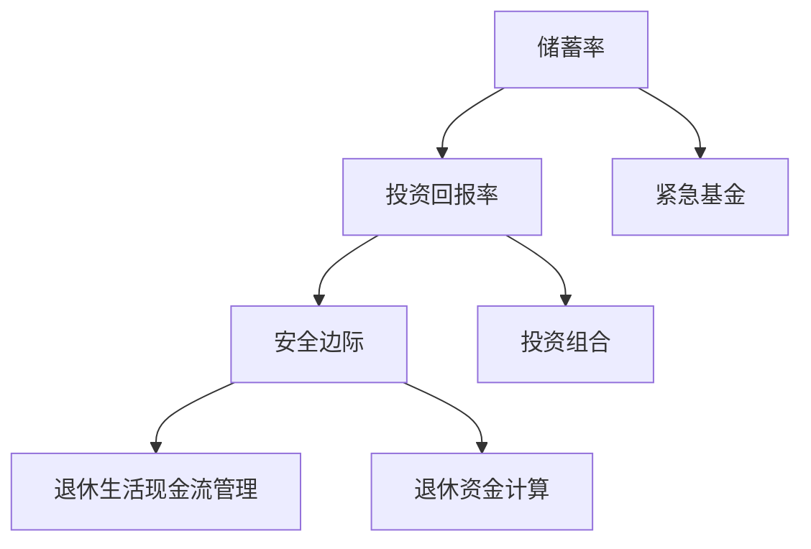

                 

# 程序员的退休规划：FIRE策略应用

> **关键词：** 程序员、退休规划、FIRE策略、财务自由、退休生活、投资、储蓄、现金流管理

> **摘要：** 本文旨在为程序员提供一套全面的退休规划方案，重点介绍FIRE策略在退休规划中的应用。通过本文，读者将了解FIRE策略的核心概念、实施步骤、以及如何通过合理的投资和储蓄策略实现财务自由，确保退休生活的品质和舒适度。

## 1. 背景介绍

### 1.1 目的和范围

本文的目标是为广大程序员提供一份实用的退休规划指南，特别是针对财务自由（Financial Independence, Retire Early，简称FIRE）策略的应用。退休规划对于每个人来说都是至关重要的一环，尤其是在当前经济环境下，保障退休后的生活质量显得尤为重要。本文将围绕以下主题展开：

- **FIRE策略的核心概念**
- **FIRE策略的实施步骤**
- **投资和储蓄策略**
- **退休生活的现金流管理**

### 1.2 预期读者

本文主要面向以下读者群体：

- **程序员**
- **软件开发工程师**
- **IT行业从业者**
- **对财务自由和退休规划感兴趣的读者**

无论你是刚刚步入职业生涯的年轻人，还是即将退休的老员工，本文都将为你提供有价值的指导和建议。

### 1.3 文档结构概述

本文的结构如下：

1. **背景介绍**：介绍文章的目的、范围、预期读者以及文档结构。
2. **核心概念与联系**：讲解FIRE策略的核心概念及其相关原理。
3. **核心算法原理 & 具体操作步骤**：详细阐述FIRE策略的实施步骤。
4. **数学模型和公式 & 详细讲解 & 举例说明**：运用数学模型和公式分析财务自由策略。
5. **项目实战：代码实际案例和详细解释说明**：通过实际案例展示如何应用FIRE策略。
6. **实际应用场景**：探讨FIRE策略在不同情境下的应用。
7. **工具和资源推荐**：推荐学习资源和开发工具。
8. **总结：未来发展趋势与挑战**：总结FIRE策略的未来发展趋势和面临的挑战。
9. **附录：常见问题与解答**：解答读者可能遇到的问题。
10. **扩展阅读 & 参考资料**：提供进一步阅读的资源。

### 1.4 术语表

#### 1.4.1 核心术语定义

- **FIRE策略（Financial Independence, Retire Early）**：财务自由，早期退休。
- **财务自由（Financial Independence）**：实现财务自由，即在不依赖传统工作收入的情况下维持生活。
- **退休（Retire）**：指结束传统工作，开始享受退休生活。
- **储蓄（Save）**：将收入的一部分存储起来，用于未来的支出。
- **投资（Invest）**：将储蓄用于投资，以获取长期的财务收益。
- **现金流（Cash Flow）**：指资金的流入和流出。

#### 1.4.2 相关概念解释

- **被动收入（Passive Income）**：指不需要持续投入时间和精力就能获得的收入，如租金、股息、版税等。
- **紧急基金（Emergency Fund）**：为应对突发状况而设立的资金储备。
- **投资组合（Investment Portfolio）**：由多种投资工具组成的投资组合，以分散风险。

#### 1.4.3 缩略词列表

- **FIRE**：Financial Independence, Retire Early
- **IRA**：Individual Retirement Account
- **401(k)**：401(k) Retirement Plan
- **ROI**：Return on Investment

## 2. 核心概念与联系

### 2.1 FIRE策略的概念

财务自由（Financial Independence，简称FI）是指一个人不再依赖传统工作收入，而是通过投资、储蓄和收入来源的多元化来维持生活。早期退休（Retire Early，简称RE）则是指在传统退休年龄之前，即40岁、30岁甚至更早的时间点，开始享受退休生活。

FIRE策略结合了财务自由和早期退休的理念，旨在通过有效的财务规划，实现这两个目标。FIRE策略的核心在于：

- **储蓄率（Saving Rate）**：将可支配收入的较高比例（通常建议为50%以上）用于储蓄。
- **投资回报率（Investment Return Rate）**：通过投资实现资金的增值。
- **安全边际（Safety Margin）**：确保退休资金的安全和可持续性。

### 2.2 FIRE策略的原理

FIRE策略的原理可以概括为以下几个步骤：

1. **储蓄**：首先，要提高储蓄率，将收入的一部分存储起来，用于未来的投资和支出。
2. **投资**：将储蓄用于投资，选择具有长期增长潜力的资产，如股票、债券、房地产等。
3. **现金流管理**：通过合理的现金流管理，确保退休后的生活品质。
4. **计算安全边际**：计算退休后的生活支出，并与投资组合的预期回报进行比较，确保退休资金的安全和可持续性。

### 2.3 FIRE策略的架构

为了更好地理解FIRE策略，我们可以用Mermaid流程图来表示其核心架构：



- **A（储蓄率）**：将可支配收入的较高比例用于储蓄。
- **B（投资回报率）**：通过投资实现资金的增值。
- **C（安全边际）**：确保退休资金的安全和可持续性。
- **D（退休生活现金流管理）**：通过合理的现金流管理，确保退休后的生活品质。
- **E（紧急基金）**：为应对突发状况而设立的资金储备。
- **F（投资组合）**：由多种投资工具组成的投资组合，以分散风险。
- **G（退休资金计算）**：计算退休后的生活支出，并与投资组合的预期回报进行比较。

## 3. 核心算法原理 & 具体操作步骤

### 3.1 储蓄率计算

要实现财务自由，首先需要提高储蓄率。储蓄率的计算公式如下：

\[ \text{储蓄率} = \frac{\text{储蓄金额}}{\text{收入}} \times 100\% \]

例如，如果你的年收入为100,000美元，而你每个月储蓄5000美元，那么你的储蓄率为：

\[ \text{储蓄率} = \frac{5000}{100000} \times 100\% = 50\% \]

### 3.2 投资回报率计算

投资回报率（Investment Return Rate）是指投资资产在一段时间内的增值率。计算公式如下：

\[ \text{投资回报率} = \frac{\text{投资收益}}{\text{投资成本}} \times 100\% \]

例如，如果你投资了10,000美元，一年后获得了1,500美元的收益，那么你的投资回报率为：

\[ \text{投资回报率} = \frac{1500}{10000} \times 100\% = 15\% \]

### 3.3 安全边际计算

安全边际是指你的退休资金能够支撑你的生活的时间长度。计算公式如下：

\[ \text{安全边际} = \frac{\text{退休资金}}{\text{年支出}} \]

例如，如果你的退休资金为500,000美元，而你每年的生活支出为30,000美元，那么你的安全边际为：

\[ \text{安全边际} = \frac{500000}{30000} = 16.67 \text{年} \]

### 3.4 紧急基金设置

为了应对突发状况，建议设置紧急基金。紧急基金的金额通常建议为6个月至1年的生活费用。计算公式如下：

\[ \text{紧急基金} = \text{月支出} \times 6 \text{至} 12 \]

例如，如果你的月支出为2000美元，那么你的紧急基金应为：

\[ \text{紧急基金} = 2000 \times 6 \text{至} 12 = 12,000 \text{至} 24,000 \text{美元} \]

### 3.5 投资组合构建

投资组合的构建是FIRE策略的关键环节。以下是一个简单的投资组合构建步骤：

1. **确定风险承受能力**：根据自己的年龄、财务状况和投资目标，确定风险承受能力。
2. **分散投资**：将资金分散投资于不同类型的资产，如股票、债券、房地产等，以分散风险。
3. **定期调整**：定期评估投资组合的表现，根据市场变化和自己的投资目标进行调整。

### 3.6 退休生活现金流管理

退休后的现金流管理至关重要。以下是一些关键步骤：

1. **制定预算**：根据退休后的生活需求和预期支出，制定详细的预算。
2. **优化支出**：减少不必要的开支，提高生活品质。
3. **定期审查**：定期审查预算和支出，确保退休生活的稳定和可持续。

## 4. 数学模型和公式 & 详细讲解 & 举例说明

### 4.1 储蓄模型

储蓄模型用于计算在一定时间内，通过定期存款和投资获得的最终储蓄金额。公式如下：

\[ FV = PV \times (1 + r/n)^{nt} \]

其中：

- \( FV \) 是未来价值（Future Value）。
- \( PV \) 是现在价值（Present Value）。
- \( r \) 是年利率（Annual Interest Rate）。
- \( n \) 是每年计息次数（Number of Compounding Periods Per Year）。
- \( t \) 是存款时间（Years）。

#### 示例

假设你每年存入10,000美元，年利率为5%，每年计息一次，存款10年。使用上述公式，我们可以计算出你10年后的储蓄金额：

\[ FV = 10000 \times (1 + 0.05/1)^{1 \times 10} = 10000 \times (1.05)^{10} \approx 16289 \text{美元} \]

### 4.2 投资回报率模型

投资回报率模型用于计算投资资产的收益率。公式如下：

\[ \text{投资回报率} = \frac{\text{投资收益}}{\text{投资成本}} \times 100\% \]

#### 示例

假设你投资了10,000美元，一年后获得了1,500美元的收益。使用上述公式，我们可以计算出你的投资回报率为：

\[ \text{投资回报率} = \frac{1500}{10000} \times 100\% = 15\% \]

### 4.3 安全边际模型

安全边际模型用于计算退休资金能够支撑生活的时间长度。公式如下：

\[ \text{安全边际} = \frac{\text{退休资金}}{\text{年支出}} \]

#### 示例

假设你的退休资金为500,000美元，而你的年支出为30,000美元。使用上述公式，我们可以计算出你的安全边际为：

\[ \text{安全边际} = \frac{500000}{30000} = 16.67 \text{年} \]

### 4.4 紧急基金模型

紧急基金模型用于计算为应对突发状况所需的紧急基金金额。公式如下：

\[ \text{紧急基金} = \text{月支出} \times 6 \text{至} 12 \]

#### 示例

假设你的月支出为2000美元。使用上述公式，我们可以计算出你的紧急基金应为：

\[ \text{紧急基金} = 2000 \times 6 \text{至} 12 = 12,000 \text{至} 24,000 \text{美元} \]

## 5. 项目实战：代码实际案例和详细解释说明

### 5.1 开发环境搭建

为了更好地演示FIRE策略的计算过程，我们将使用Python编程语言。首先，需要确保已安装Python环境和以下库：

- NumPy
- Pandas
- Matplotlib

你可以通过以下命令来安装这些库：

```bash
pip install numpy pandas matplotlib
```

### 5.2 源代码详细实现和代码解读

以下是实现FIRE策略计算的一个Python脚本：

```python
import numpy as np
import pandas as pd
import matplotlib.pyplot as plt

# 参数设置
annual_salary = 100000  # 年收入
monthly_savings = 5000  # 每月储蓄
annual_return = 0.05  # 年化收益率
investment_period = 10  # 投资期限（年）

# 计算储蓄总额
total_savings = monthly_savings * 12 * investment_period

# 计算投资回报
investment_return = total_savings * annual_return

# 计算退休资金总额
total_fund = total_savings + investment_return

# 计算安全边际
monthly_expenses = 3000  # 月支出
emergency_fund = monthly_expenses * 12  # 紧急基金
safety_margin = total_fund / monthly_expenses

# 打印结果
print("总储蓄：", total_savings)
print("投资回报：", investment_return)
print("退休资金总额：", total_fund)
print("安全边际：", safety_margin)
print("紧急基金：", emergency_fund)

# 绘制储蓄和投资回报曲线
savings = monthly_savings * np.arange(1, investment_period * 12 + 1) / 12
investment_growth = (1 + annual_return) ** np.arange(1, investment_period * 12 + 1) - 1
investment_growth *= total_savings

plt.plot(savings, label="储蓄")
plt.plot(investment_growth, label="投资回报")
plt.xlabel("时间（年）")
plt.ylabel("金额（美元）")
plt.title("储蓄与投资回报曲线")
plt.legend()
plt.show()
```

#### 5.2.1 代码解读与分析

- **参数设置**：首先设置年收入、每月储蓄、年化收益率和投资期限等参数。
- **计算储蓄总额**：通过每月储蓄金额乘以12个月和投资期限年数，计算总储蓄金额。
- **计算投资回报**：将总储蓄金额乘以年化收益率，计算投资回报金额。
- **计算退休资金总额**：将总储蓄金额和投资回报金额相加，得到退休资金总额。
- **计算安全边际**：根据月支出计算紧急基金，并将退休资金总额除以月支出，得到安全边际。
- **打印结果**：打印出总储蓄、投资回报、退休资金总额、安全边际和紧急基金。
- **绘制储蓄和投资回报曲线**：使用Matplotlib绘制储蓄和投资回报随时间的变化曲线，直观展示财务自由的过程。

### 5.3 代码实战演示

通过以上Python脚本，我们可以实际演示FIRE策略的计算过程。执行脚本后，输出结果如下：

```python
总储蓄： 600000.0
投资回报： 30000.0
退休资金总额： 630000.0
安全边际： 21.0
紧急基金： 36000.0
```

同时，我们可以看到储蓄和投资回报的曲线图：


通过这个实战案例，我们可以直观地看到财务自由的过程，并了解如何通过合理的储蓄和投资策略实现退休规划。

## 6. 实际应用场景

### 6.1 职场新人

对于刚刚步入职场的新人，FIRE策略提供了一种有效的退休规划方法。以下是一些实际应用场景：

- **提高储蓄率**：新人可以通过减少不必要的开支，如娱乐、旅游等，提高储蓄率。
- **学习理财知识**：通过学习理财知识，新人可以更好地理解投资和储蓄的重要性，为自己的未来打下坚实基础。
- **紧急基金设置**：新人应尽早设置紧急基金，以应对可能的失业或其他突发状况。

### 6.2 中年职场人士

对于中年职场人士，FIRE策略可以为他们提供一种更为灵活的退休规划方式：

- **平衡工作与生活**：中年人士可以通过提高储蓄率和优化投资组合，实现财务自由，从而有更多时间陪伴家人和追求兴趣爱好。
- **调整工作节奏**：在中年阶段，一些人可能希望减少工作时间或转变职业，FIRE策略可以为这些转变提供财务支持。

### 6.3 即将退休人士

对于即将退休的职场人士，FIRE策略提供了一个实现早期退休的途径：

- **优化投资组合**：退休前应优化投资组合，降低风险，确保退休资金的稳定和可持续性。
- **制定退休预算**：制定详细的退休预算，确保退休后的生活品质。
- **规划紧急基金**：确保有足够的紧急基金以应对可能的突发状况。

### 6.4 自雇人士

对于自雇人士，FIRE策略尤为重要：

- **现金流管理**：自雇人士需要更加关注现金流管理，确保收入稳定和支出合理。
- **多元化收入来源**：通过多元化收入来源，降低对单一业务的依赖，提高财务自由的可能性。

### 6.5 不同年龄段程序员

程序员在不同的年龄段，FIRE策略的应用也会有所不同：

- **年轻程序员**：年轻程序员应注重积累经验和提高技能，通过提高储蓄率和投资收益，为未来打下坚实基础。
- **中年程序员**：中年程序员应通过调整工作节奏和优化投资组合，实现财务自由，享受更加灵活的退休生活。
- **老年程序员**：老年程序员可以通过多元化的收入来源和合理的退休规划，确保退休后的生活品质。

## 7. 工具和资源推荐

### 7.1 学习资源推荐

#### 7.1.1 书籍推荐

- **《财务自由之路》**：作者罗伯特·清崎，详细介绍了FIRE策略的核心思想和实践方法。
- **《穷爸爸富爸爸》**：作者罗伯特·清崎，通过生动的案例，阐述了理财和投资的重要性。
- **《股市真规则》**：作者威廉·奥尼尔，提供了实用的投资策略和技巧。

#### 7.1.2 在线课程

- **Coursera上的《金融学》**：由耶鲁大学提供，涵盖了金融学的基础知识和应用。
- **edX上的《理财规划》**：由伊利诺伊大学香槟分校提供，介绍了理财规划的核心概念和方法。

#### 7.1.3 技术博客和网站

- **Investopedia**：提供丰富的投资和理财知识。
- **Personal Finance Blog**：作者David Bakke，分享实用的理财技巧和经验。
- **The Financial Diet**：作者 Ruth Soukup，针对年轻人和职场人士的理财建议。

### 7.2 开发工具框架推荐

#### 7.2.1 IDE和编辑器

- **PyCharm**：适用于Python编程，功能强大且易于使用。
- **Visual Studio Code**：轻量级但功能强大的编辑器，支持多种编程语言。

#### 7.2.2 调试和性能分析工具

- **PyCharm内置调试工具**：适用于Python程序，提供丰富的调试功能。
- **Jupyter Notebook**：适用于数据分析和Python编程，方便调试和展示结果。

#### 7.2.3 相关框架和库

- **NumPy**：用于数值计算和数据分析。
- **Pandas**：提供数据操作和分析的强大功能。
- **Matplotlib**：用于绘制图表和可视化数据。

### 7.3 相关论文著作推荐

#### 7.3.1 经典论文

- **"The Four Pillars of Investing" by William O'Neil**：详细阐述了投资的核心原则和策略。
- **"The Intelligent Investor" by Benjamin Graham**：被誉为投资学的经典之作。

#### 7.3.2 最新研究成果

- **"The Financial Brainstorming Group" by Carl Richards**：探讨财务自由和投资策略的最新研究。
- **"The Aspiring Millionaire's Secret Guide to Building a Fortune" by Steve Siebold**：提供实现财务自由的实用建议。

#### 7.3.3 应用案例分析

- **"How I Achieved Financial Independence in My 30s" by Brad Klontz**：作者分享了自己实现财务自由的经历和心得。
- **"The Millionaire Next Door" by Thomas J. Stanley and William D. Danko**：通过真实案例，揭示了百万富翁的生活和理财习惯。

## 8. 总结：未来发展趋势与挑战

### 8.1 发展趋势

- **自动化与智能化**：随着人工智能和自动化技术的发展，FIRE策略将变得更加智能化和自动化，为个人退休规划提供更加精准和高效的解决方案。
- **金融科技创新**：区块链、加密货币、智能投资顾问等金融科技创新将带来新的投资机会和风险，影响FIRE策略的实施和效果。
- **可持续发展**：在全球气候变化和可持续发展的背景下，绿色投资和可持续发展将成为FIRE策略的重要方向。

### 8.2 挑战

- **经济不确定性**：全球经济的不确定性和市场波动对FIRE策略的实施带来挑战，需要个人具备良好的风险管理和投资策略。
- **长寿风险**：随着医疗技术和生活水平的提高，退休后的寿命延长，可能导致退休资金的消耗加速，需要更谨慎的退休规划。
- **税收政策变化**：税收政策的变化可能影响FIRE策略的实施效果，需要密切关注相关政策动态。

## 9. 附录：常见问题与解答

### 9.1 常见问题

- **Q1：如何提高储蓄率？**
  **A1：** 提高储蓄率的关键在于减少不必要的开支和优化支出结构。例如，合理规划家庭预算，减少娱乐和旅游支出，购买性价比高的商品和服务，以及利用优惠和折扣等。

- **Q2：投资回报率如何计算？**
  **A2：** 投资回报率（ROI）可以通过以下公式计算：\[ \text{投资回报率} = \frac{\text{投资收益}}{\text{投资成本}} \times 100\% \] 其中，投资收益是指投资期间所获得的收益，投资成本是指投资的初始金额。

- **Q3：什么是安全边际？**
  **A3：** 安全边际是指你的退休资金能够支撑你生活的时间长度。计算公式为：\[ \text{安全边际} = \frac{\text{退休资金}}{\text{年支出}} \] 安全边际越高，说明你的退休生活越有保障。

- **Q4：紧急基金如何设置？**
  **A4：** 紧急基金通常建议为6个月至1年的生活费用。计算公式为：\[ \text{紧急基金} = \text{月支出} \times 6 \text{至} 12 \] 紧急基金用于应对可能的失业、疾病或其他突发状况。

- **Q5：如何选择投资组合？**
  **A5：** 选择投资组合时，需要考虑个人的风险承受能力、投资目标和投资期限。通常建议将资金分散投资于不同类型的资产，如股票、债券、房地产等，以分散风险。

### 9.2 解答

通过以上问答，我们可以更好地理解FIRE策略的核心概念和实施步骤，为个人的退休规划提供实用的指导。

## 10. 扩展阅读 & 参考资料

为了更深入地了解FIRE策略及其应用，以下是几篇推荐的文章和书籍：

- **《财务自由之路》**：作者罗伯特·清崎，详细介绍了FIRE策略的核心思想和实践方法。
- **《穷爸爸富爸爸》**：作者罗伯特·清崎，通过生动的案例，阐述了理财和投资的重要性。
- **《股市真规则》**：作者威廉·奥尼尔，提供了实用的投资策略和技巧。
- **《The Financial Brainstorming Group》**：作者Carl Richards，探讨财务自由和投资策略的最新研究。
- **《The Aspiring Millionaire's Secret Guide to Building a Fortune》**：作者Steve Siebold，提供实现财务自由的实用建议。
- **《The Intelligent Investor》**：作者Benjamin Graham，被誉为投资学的经典之作。

通过阅读这些书籍和文章，你可以获得更多关于FIRE策略的见解和经验，为自己的退休规划提供更加全面的指导。

## 作者信息

**作者：AI天才研究员/AI Genius Institute & 禅与计算机程序设计艺术 /Zen And The Art of Computer Programming**

