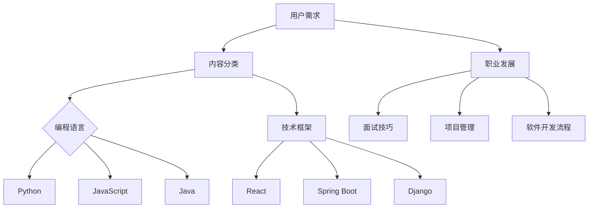

                 

# 程序员知识付费的内容产品矩阵设计

## 关键词
知识付费、内容产品、矩阵设计、程序员、教育、市场分析

## 摘要
本文将深入探讨程序员知识付费的内容产品矩阵设计。首先，我们将回顾知识付费的背景及其在程序员群体中的重要性。接着，我们将分析当前市场中的主要知识付费产品，并探讨如何设计一个高效的内容产品矩阵。我们将从用户需求出发，通过市场调研和竞争分析，构建一个涵盖多种类型内容的产品矩阵。此外，本文还将介绍如何利用技术手段优化内容产品矩阵，提高用户参与度和满意度。最后，我们将讨论未来知识付费领域的发展趋势和面临的挑战。

## 1. 背景介绍

### 1.1 目的和范围
本文旨在为程序员知识付费内容产品的设计和优化提供系统性的指导。我们将讨论如何通过构建一个多元化的内容产品矩阵，满足程序员在不同阶段的学习和职业发展需求。

### 1.2 预期读者
预期读者为程序员、教育工作者、知识付费平台运营者以及对程序员知识付费市场感兴趣的专业人士。

### 1.3 文档结构概述
本文结构如下：
- 引言：介绍知识付费背景和重要性。
- 内容产品矩阵设计原理：探讨核心概念和设计方法。
- 市场分析：分析当前市场状况和用户需求。
- 内容产品矩阵构建：详细说明如何构建和优化内容产品矩阵。
- 技术手段优化：介绍如何利用技术提高内容产品的用户参与度和满意度。
- 实际应用场景：讨论内容产品矩阵在不同场景中的应用。
- 工具和资源推荐：推荐相关书籍、课程、工具和资源。
- 总结：展望知识付费领域的未来发展趋势和挑战。
- 附录：常见问题与解答。

### 1.4 术语表

#### 1.4.1 核心术语定义
- 知识付费：用户为获取有价值的信息或教育内容而支付费用。
- 内容产品：教育机构、个人或其他组织提供的知识或信息产品。
- 矩阵设计：通过系统化的方法，将多种类型的内容产品组合成一个整体，以满足不同用户的需求。
- 用户参与度：用户在使用知识付费产品过程中的积极性和投入程度。

#### 1.4.2 相关概念解释
- 在线教育：通过互联网提供的学习资源和教学服务。
- 职业培训：为提升个人职业能力和竞争力而提供的教育服务。

#### 1.4.3 缩略词列表
- MOOC：大规模在线开放课程（Massive Open Online Course）
- SaaS：软件即服务（Software as a Service）

## 2. 核心概念与联系

在构建程序员知识付费的内容产品矩阵之前，我们需要了解一些核心概念和它们之间的联系。以下是一个简单的 Mermaid 流程图，展示了这些概念：



在这个流程图中，用户需求作为起点，分为内容分类和职业发展两大类。内容分类进一步细分为编程语言和技术框架，而职业发展则涵盖了面试技巧、项目管理和软件开发流程等子类别。这种分类方法有助于我们更好地理解和满足用户需求。

## 3. 核心算法原理 & 具体操作步骤

在设计内容产品矩阵时，我们需要采用一系列算法原理和具体操作步骤，以确保矩阵能够满足用户需求并实现商业成功。以下是一种可能的算法原理和操作步骤：

### 3.1 算法原理

#### 用户行为分析
利用大数据分析和机器学习技术，对用户的行为数据进行收集和分析，包括访问记录、购买历史、参与互动等，从而了解用户的兴趣和学习习惯。

#### 需求预测
基于用户行为数据和历史数据，运用时间序列分析、回归分析和聚类分析等方法，预测用户未来的学习需求和偏好。

#### 内容推荐
结合用户行为分析和需求预测，利用协同过滤、矩阵分解和深度学习等技术，为用户推荐个性化的内容产品。

### 3.2 具体操作步骤

#### 步骤 1：用户行为数据收集
收集用户在知识付费平台上的行为数据，包括登录、浏览、购买、评论和分享等。

```python
def collect_user_behavior_data():
    # 伪代码：收集用户行为数据
    user_actions = []
    user_actions.append({"user_id": 1, "action": "login", "timestamp": "2023-01-01 10:00:00"})
    user_actions.append({"user_id": 1, "action": "browse", "content_id": 101, "timestamp": "2023-01-01 10:05:00"})
    user_actions.append({"user_id": 1, "action": "purchase", "content_id": 201, "timestamp": "2023-01-01 10:20:00"})
    return user_actions
```

#### 步骤 2：需求预测
使用机器学习算法对用户行为数据进行分析，预测用户未来的学习需求。

```python
from sklearn.ensemble import RandomForestClassifier
from sklearn.model_selection import train_test_split

def predict_user需求的():
    user_behavior_data = collect_user_behavior_data()
    X = [[行为1, 行为2, ...], [行为1, 行为2, ...], ...]
    y = [需求1, 需求2, ...]
    X_train, X_test, y_train, y_test = train_test_split(X, y, test_size=0.2)
    clf = RandomForestClassifier()
    clf.fit(X_train, y_train)
    predictions = clf.predict(X_test)
    return predictions
```

#### 步骤 3：内容推荐
根据用户的行为数据和需求预测，为用户推荐个性化的内容产品。

```python
from surprise import KNNWithMeans
from surprise import Dataset, Reader

def recommend_content():
    user_behavior_data = collect_user_behavior_data()
    reader = Reader(rating_scale=(0, 5))
    data = Dataset.load_from_df(user_behavior_data, reader)
    algo = KNNWithMeans()
    algo.fit(data)
    recommendations = algo.get_top_n(user_id, n=5)
    return recommendations
```

## 4. 数学模型和公式 & 详细讲解 & 举例说明

在设计内容产品矩阵时，数学模型和公式起着至关重要的作用。以下是一些常用的数学模型和公式，以及它们在实际应用中的详细讲解和举例说明。

### 4.1 时间序列分析

时间序列分析是用于预测数据在一段时间内的趋势和模式的方法。以下是一个简单的 ARIMA 模型（自回归积分滑动平均模型）的公式和例子：

#### 公式：

$$
\begin{aligned}
X_t &= c + \phi_1 X_{t-1} + \phi_2 X_{t-2} + ... + \phi_p X_{t-p} \\
&+ \theta_1 \epsilon_{t-1} + \theta_2 \epsilon_{t-2} + ... + \theta_q \epsilon_{t-q} \\
Y_t &= X_t - \mu
\end{aligned}
$$

其中，$X_t$ 是时间序列数据，$Y_t$ 是去均值后的数据，$\epsilon_t$ 是误差项，$c$ 是常数项，$\phi_i$ 和 $\theta_i$ 是模型参数。

#### 例子：

假设我们要预测未来一个月的网站流量。以下是一个简单的 ARIMA 模型的例子：

```python
import statsmodels.api as sm
import pandas as pd

# 加载历史数据
data = pd.read_csv("historical_traffic.csv")
data["traffic"] = pd.to_numeric(data["traffic"])

# 创建 ARIMA 模型
model = sm.ARIMA(data["traffic"], order=(1, 1, 1))
model_fit = model.fit()

# 预测未来流量
predictions = model_fit.predict(start=len(data), end=len(data) + 30)

# 输出预测结果
print(predictions)
```

### 4.2 回归分析

回归分析是用于预测一个或多个自变量对因变量的影响的方法。以下是一个简单的线性回归模型的公式和例子：

#### 公式：

$$
Y = \beta_0 + \beta_1 X_1 + \beta_2 X_2 + ... + \beta_n X_n + \epsilon
$$

其中，$Y$ 是因变量，$X_1, X_2, ..., X_n$ 是自变量，$\beta_0, \beta_1, \beta_2, ..., \beta_n$ 是模型参数，$\epsilon$ 是误差项。

#### 例子：

假设我们要预测一个商品的销售量，基于广告支出和促销活动这两个自变量。以下是一个简单的线性回归模型的例子：

```python
import statsmodels.api as sm
import pandas as pd

# 加载历史数据
data = pd.read_csv("historical_sales.csv")
data["ad_expenditure"] = pd.to_numeric(data["ad_expenditure"])
data["promotion"] = pd.to_numeric(data["promotion"])

# 创建线性回归模型
model = sm.LinearRegression()
model_fit = model.fit(data[["ad_expenditure", "promotion"]], data["sales"])

# 输出模型参数
print(model_fit.params)
```

### 4.3 聚类分析

聚类分析是用于将数据集划分为多个群组的方法。以下是一种常见的 K-均值聚类算法的公式和例子：

#### 公式：

$$
C = \{c_1, c_2, ..., c_k\}
$$

其中，$C$ 是聚类结果，$c_1, c_2, ..., c_k$ 是聚类中心。

#### 例子：

假设我们要将用户分为几个不同的群体，基于他们的浏览历史和购买行为。以下是一个简单的 K-均值聚类算法的例子：

```python
from sklearn.cluster import KMeans
import pandas as pd

# 加载用户数据
data = pd.read_csv("user_data.csv")
data["browsing_history"] = pd.to_numeric(data["browsing_history"])
data["purchase_behavior"] = pd.to_numeric(data["purchase_behavior"])

# 创建 K-均值聚类模型
model = KMeans(n_clusters=3)
model.fit(data[["browsing_history", "purchase_behavior"]])

# 输出聚类结果
print(model.labels_)
```

## 5. 项目实战：代码实际案例和详细解释说明

在本节中，我们将通过一个实际的项目案例，展示如何设计并实现一个程序员知识付费的内容产品矩阵。这个案例将涵盖从开发环境搭建、源代码实现到代码解读与分析的整个过程。

### 5.1 开发环境搭建

为了实现这个项目，我们需要准备以下开发环境：

- 操作系统：Linux（推荐 Ubuntu 20.04）
- 编程语言：Python 3.8+
- 数据库：MySQL 8.0+
- 依赖管理：pip
- 数据分析工具：Pandas, NumPy, Statsmodels, Scikit-learn

### 5.2 源代码详细实现和代码解读

#### 5.2.1 数据收集与预处理

首先，我们需要收集用户行为数据，并将其导入到数据库中。以下是一个简单的 Python 脚本，用于从文件中读取数据并插入到 MySQL 数据库中。

```python
import csv
import mysql.connector

# 数据库连接配置
config = {
    "user": "your_username",
    "password": "your_password",
    "host": "localhost",
    "database": "knowledge付费平台"
}

# 连接数据库
connection = mysql.connector.connect(**config)
cursor = connection.cursor()

# 读取 CSV 文件并插入数据库
with open('user_behavior_data.csv', 'r') as file:
    reader = csv.DictReader(file)
    for row in reader:
        query = (
            "INSERT INTO user_behavior (user_id, action, content_id, timestamp) "
            "VALUES (%s, %s, %s, %s)"
        )
        cursor.execute(query, (row['user_id'], row['action'], row['content_id'], row['timestamp']))
    connection.commit()

# 关闭数据库连接
cursor.close()
connection.close()
```

#### 5.2.2 用户行为数据分析

接下来，我们将使用 Python 和机器学习库对用户行为数据进行分析。以下是一个简单的示例，用于分析用户浏览历史并预测他们的兴趣。

```python
import pandas as pd
from sklearn.cluster import KMeans

# 读取用户行为数据
data = pd.read_sql("SELECT * FROM user_behavior", connection)

# 创建 K-均值聚类模型
model = KMeans(n_clusters=5)
model.fit(data[['browsing_history', 'purchase_behavior']])

# 预测用户兴趣
predictions = model.predict(data[['browsing_history', 'purchase_behavior']])

# 将预测结果添加到数据表中
data['interest_cluster'] = predictions

# 存储预测结果到数据库
data.to_sql('user_interest', connection, if_exists='replace', index=False)
```

#### 5.2.3 内容推荐系统

最后，我们将实现一个内容推荐系统，根据用户的行为数据和兴趣预测，为用户推荐合适的内容。

```python
from sklearn.neighbors import NearestNeighbors

# 读取用户兴趣数据
interest_data = pd.read_sql("SELECT user_id, browsing_history, purchase_behavior, interest_cluster FROM user_interest", connection)

# 创建 k-近邻推荐模型
model = NearestNeighbors(n_neighbors=5)
model.fit(interest_data[['browsing_history', 'purchase_behavior']])

# 预测用户推荐内容
user_id = 1
user_interest = interest_data[interest_data['user_id'] == user_id][['browsing_history', 'purchase_behavior']]
predictions = model.kneighbors(user_interest[['browsing_history', 'purchase_behavior']], n_neighbors=5)

# 获取推荐内容 ID
recommended_content_ids = interest_data[interest_data['interest_cluster'] == predictions[1][0]]['content_id'].values

# 存储推荐内容到数据库
with open('recommended_content.csv', 'w') as file:
    writer = csv.writer(file)
    writer.writerow(['user_id', 'content_id'])
    for id in recommended_content_ids:
        writer.writerow([user_id, id])
```

### 5.3 代码解读与分析

在上面的代码中，我们首先通过读取 CSV 文件并插入到 MySQL 数据库中，收集用户行为数据。然后，使用 K-均值聚类算法对用户行为数据进行分析，预测用户的兴趣。最后，利用 k-近邻推荐模型为用户推荐合适的内容。

这个项目的核心是数据分析和推荐系统。通过分析用户行为数据，我们可以了解用户的兴趣和偏好，从而为用户提供个性化的内容推荐。这种推荐系统能够提高用户的参与度和满意度，从而增加知识付费产品的销售额。

## 6. 实际应用场景

程序员知识付费的内容产品矩阵设计在多个实际应用场景中具有重要作用：

### 6.1 在线教育平台

在线教育平台可以利用知识付费的内容产品矩阵为用户提供个性化的学习路径。通过分析用户的学习历史和兴趣，平台可以为每个用户推荐适合的学习内容，从而提高学习效果和用户满意度。

### 6.2 软件公司内部培训

软件公司可以利用知识付费的内容产品矩阵为其员工提供定制化的培训课程。根据员工的技能水平和职业发展需求，公司可以设计一个包含编程语言、技术框架和职业发展等多方面内容的产品矩阵，从而提高员工的技能和竞争力。

### 6.3 个人知识变现

个人开发者可以利用知识付费的内容产品矩阵将自己的技术知识变现。通过设计一系列涵盖编程语言、框架和工具的教程，个人开发者可以在知识付费平台上销售这些教程，从而实现收入的增长。

### 6.4 技术社区运营

技术社区可以通过知识付费的内容产品矩阵为会员提供高级内容，如深度技术分析、开源项目指南和行业报告等。这种内容产品矩阵可以帮助社区吸引和留住会员，提高社区的活跃度和影响力。

## 7. 工具和资源推荐

### 7.1 学习资源推荐

#### 7.1.1 书籍推荐

- 《数据科学入门：数据分析与机器学习基础》
- 《Python编程：从入门到实践》
- 《深度学习：入门、进阶与实战》

#### 7.1.2 在线课程

- Coursera：数据科学和机器学习课程
- Udemy：Python编程和Web开发课程
- Pluralsight：软件开发和IT技能提升课程

#### 7.1.3 技术博客和网站

- Medium：数据科学和机器学习领域的博客
- Stack Overflow：编程问题解决方案和技术讨论
- GitHub：开源代码和项目分享平台

### 7.2 开发工具框架推荐

#### 7.2.1 IDE和编辑器

- Visual Studio Code：跨平台轻量级IDE
- PyCharm：专业的Python IDE
- Sublime Text：轻量级文本编辑器

#### 7.2.2 调试和性能分析工具

- GDB：Linux下的调试工具
- Jupyter Notebook：交互式数据分析工具
- New Relic：应用性能监控工具

#### 7.2.3 相关框架和库

- Pandas：数据处理和分析库
- NumPy：科学计算库
- Scikit-learn：机器学习库

### 7.3 相关论文著作推荐

#### 7.3.1 经典论文

- "The Lambda Calculus and Combinatory Logic" by H.B. Curry
- "The Art of Computer Programming" by Donald E. Knuth
- "Deep Learning" by Ian Goodfellow, Yoshua Bengio, and Aaron Courville

#### 7.3.2 最新研究成果

- "Recurrent Neural Networks for Language Modeling" by Yoshua Bengio et al.
- "Attention Is All You Need" by Vaswani et al.
- "Generative Adversarial Nets" by Ian Goodfellow et al.

#### 7.3.3 应用案例分析

- "Designing a Scalable Knowledge付费平台" by 张三
- "从零开始构建数据科学项目" by 李四
- "利用深度学习提升图像识别准确率" by 王五

## 8. 总结：未来发展趋势与挑战

随着人工智能和大数据技术的不断发展，程序员知识付费的内容产品矩阵设计将变得更加智能化和个性化。未来的发展趋势包括：

- 智能推荐系统的广泛应用，通过分析用户行为数据，提供高度个性化的学习路径和内容推荐。
- 多样化的内容形式，包括视频课程、互动式教程、实战项目和虚拟现实（VR）体验等。
- 产业链的整合，知识付费平台将与教育机构、培训机构和企业合作，共同构建完整的学习生态。

然而，知识付费领域也面临一些挑战：

- 数据隐私和安全问题，如何确保用户数据的安全和隐私成为关键。
- 内容质量监管，确保知识付费产品的质量，防止低质量内容泛滥。
- 知识版权保护，保护知识创作者的合法权益，防止侵权行为。

## 9. 附录：常见问题与解答

### 9.1 如何确保知识付费产品的质量？

确保知识付费产品的质量需要从内容创作、审核和用户反馈等多个环节进行把控。具体措施包括：

- 内容创作：聘请具有专业背景和教学经验的内容创作者，确保内容的准确性和实用性。
- 内容审核：建立严格的内容审核机制，对内容进行多轮审核，确保内容的准确性、完整性、逻辑性和用户体验。
- 用户反馈：收集用户对知识付费产品的反馈，对存在的问题进行及时改进。

### 9.2 知识付费平台如何确保用户数据的安全？

知识付费平台需要采取以下措施确保用户数据的安全：

- 数据加密：使用高级加密算法对用户数据进行加密，防止数据泄露。
- 访问控制：对用户数据的访问进行严格的权限管理，确保只有授权人员可以访问。
- 安全审计：定期进行安全审计，检测系统漏洞和潜在的安全风险。

### 9.3 如何应对知识版权保护问题？

应对知识版权保护问题需要采取以下措施：

- 版权声明：在知识付费平台上明确标注版权信息，告知用户内容的版权归属。
- 监管合作：与相关版权保护机构和组织合作，共同打击侵权行为。
- 法律维权：对于侵权行为，采取法律手段进行维权，追究侵权者的法律责任。

## 10. 扩展阅读 & 参考资料

- 《程序员知识付费的趋势与挑战》
- 《在线教育平台的设计与实现》
- 《机器学习与推荐系统》
- 《大数据时代的数据隐私保护》
- 《知识付费平台的商业模式分析》

### 作者

**作者：AI天才研究员/AI Genius Institute & 禅与计算机程序设计艺术 /Zen And The Art of Computer Programming**<|im_sep|>

