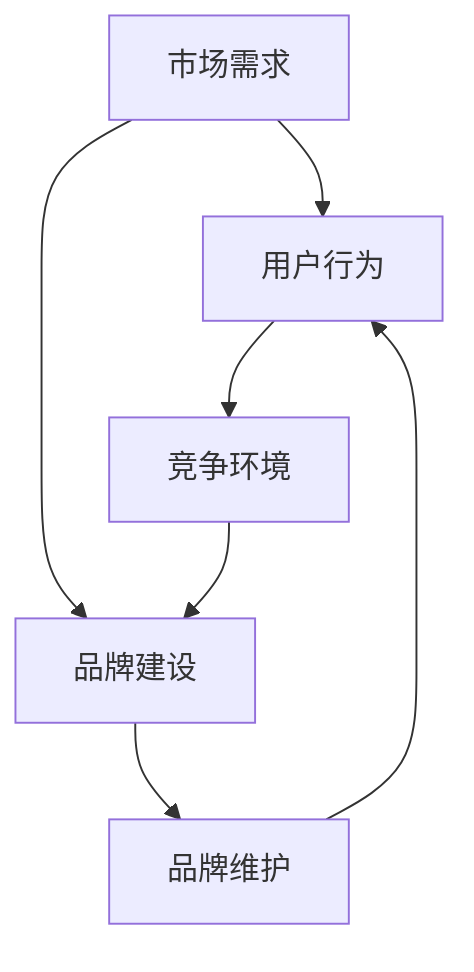

                 

# 程序员知识付费的品牌建设与维护

> 关键词：知识付费、品牌建设、维护、程序员、内容质量、用户忠诚度、用户体验

> 摘要：本文旨在探讨程序员知识付费领域的品牌建设与维护策略。通过分析市场需求、用户行为和竞争环境，本文提出了一系列有效的方法和步骤，以帮助程序员在知识付费领域建立和维护一个强大的品牌。文章内容包括背景介绍、核心概念、算法原理、数学模型、项目实战、实际应用场景、工具和资源推荐以及未来发展趋势与挑战等方面，为从事知识付费的程序员提供了实用的指导。

## 1. 背景介绍

### 1.1 目的和范围

随着互联网技术的不断发展，知识付费逐渐成为了一个热门的市场。程序员作为互联网技术的重要组成部分，其知识和技能的需求尤为突出。本文旨在探讨程序员在知识付费领域中的品牌建设与维护策略，以帮助程序员在这个竞争激烈的市场中脱颖而出。

本文的研究范围主要包括以下几个方面：

1. **市场分析**：了解程序员知识付费市场的现状、发展趋势和用户需求。
2. **品牌建设**：探讨如何通过独特的定位、优质的内容和良好的用户体验来建立程序员的知识付费品牌。
3. **维护策略**：分析如何通过持续的内容更新、用户互动和口碑传播来维护和提升品牌价值。
4. **技术实现**：介绍一些实用的技术和工具，帮助程序员高效地进行知识付费品牌的建设与维护。

### 1.2 预期读者

本文的预期读者主要包括以下几类：

1. **程序员**：对知识付费有兴趣和需求的程序员，希望通过本文了解如何创建和维护自己的知识付费品牌。
2. **内容创作者**：已经在知识付费领域有所尝试的程序员，希望通过本文获得更多的策略和建议。
3. **创业者**：计划进入知识付费市场的创业者，希望通过本文了解程序员知识付费市场的现状和未来趋势。

### 1.3 文档结构概述

本文将按照以下结构进行阐述：

1. **背景介绍**：介绍本文的研究目的、范围、预期读者和文档结构。
2. **核心概念与联系**：介绍程序员知识付费的核心概念和原理，并使用Mermaid流程图进行展示。
3. **核心算法原理 & 具体操作步骤**：详细讲解程序员知识付费的关键算法原理和操作步骤，使用伪代码进行阐述。
4. **数学模型和公式 & 详细讲解 & 举例说明**：介绍程序员知识付费相关的数学模型和公式，并进行详细讲解和举例说明。
5. **项目实战：代码实际案例和详细解释说明**：通过一个实际案例，展示程序员知识付费的开发过程和代码实现。
6. **实际应用场景**：探讨程序员知识付费在实际应用中的场景和效果。
7. **工具和资源推荐**：推荐一些用于知识付费品牌建设和维护的学习资源、开发工具和框架。
8. **总结：未来发展趋势与挑战**：分析程序员知识付费领域的未来发展趋势和面临的挑战。
9. **附录：常见问题与解答**：提供一些常见的关于程序员知识付费品牌建设和维护的问题和解答。
10. **扩展阅读 & 参考资料**：推荐一些相关的参考文献和资料，供读者进一步学习。

### 1.4 术语表

#### 1.4.1 核心术语定义

- **知识付费**：用户为获取特定的知识和技能而支付费用的行为。
- **品牌建设**：通过一系列策略和行动，建立和提升品牌知名度和认可度的过程。
- **用户体验**：用户在使用产品或服务过程中的感受和体验。
- **内容质量**：知识付费内容的准确度、实用性和可读性。

#### 1.4.2 相关概念解释

- **市场需求**：用户对知识付费的需求和期望。
- **用户行为**：用户在获取和使用知识付费过程中的行为和习惯。
- **竞争环境**：市场上其他程序员知识付费品牌的情况和竞争态势。

#### 1.4.3 缩略词列表

- **KOL**：关键意见领袖（Key Opinion Leader）
- **SEO**：搜索引擎优化（Search Engine Optimization）
- **SEM**：搜索引擎营销（Search Engine Marketing）
- **SNS**：社交网络服务（Social Networking Service）

## 2. 核心概念与联系

### 2.1 知识付费领域概述

在知识付费领域，程序员面临着激烈的市场竞争。要想在众多内容创作者中脱颖而出，建立和维护一个强大的品牌至关重要。以下是知识付费领域的核心概念和联系：

#### 2.1.1 市场需求

市场需求是知识付费领域的基础。了解用户对知识付费的需求，有助于程序员确定自己的内容方向和定位。以下是一些常见的需求：

- **技能提升**：程序员希望提升自己的编程技能、掌握新的编程语言或框架。
- **职业发展**：程序员希望了解行业动态、求职技巧和职业规划。
- **项目实战**：程序员希望通过实际项目来锻炼自己的编程能力。
- **代码规范**：程序员希望学习如何编写高质量、可维护的代码。

#### 2.1.2 用户行为

用户行为是影响知识付费品牌建设的关键因素。以下是一些常见的用户行为：

- **搜索和浏览**：用户通过搜索引擎或平台搜索和浏览内容。
- **订阅和购买**：用户根据需求订阅或购买付费内容。
- **评价和分享**：用户对内容进行评价，并将优质内容分享给其他用户。
- **反馈和建议**：用户对内容提出反馈和建议，以改进内容质量。

#### 2.1.3 竞争环境

竞争环境是知识付费品牌建设的另一个重要因素。以下是一些常见的竞争环境：

- **同行竞争**：市场上其他程序员知识付费品牌的竞争。
- **平台竞争**：知识付费平台之间的竞争，如知乎、CSDN、GitHub等。
- **内容质量竞争**：内容质量是吸引用户和提升品牌价值的关键因素。

#### 2.1.4 品牌建设与维护

品牌建设与维护是知识付费品牌的基石。以下是一些核心策略：

- **定位明确**：确定自己的内容方向和目标用户群体。
- **内容质量**：保证内容的准确性、实用性和可读性。
- **用户体验**：优化用户的订阅、购买和使用体验。
- **互动与反馈**：与用户进行互动，收集反馈并不断改进内容。
- **口碑传播**：通过用户口碑来提升品牌知名度和认可度。

### 2.2 Mermaid流程图

以下是一个简化的Mermaid流程图，展示了知识付费品牌建设与维护的核心概念和联系：



## 3. 核心算法原理 & 具体操作步骤

### 3.1 品牌定位算法原理

品牌定位是知识付费品牌建设的第一步，其核心在于找到目标用户和竞争对手之间的差异点，从而在用户心中建立独特的品牌形象。以下是品牌定位算法的原理：

#### 3.1.1 数据收集与分析

1. **用户调研**：通过问卷调查、访谈等方式收集目标用户的需求、偏好和痛点。
2. **竞争对手分析**：分析同行业内其他知识付费品牌的定位、内容、用户评价等。
3. **市场趋势分析**：关注行业动态、技术趋势和用户需求变化。

#### 3.1.2 差异化定位策略

1. **细分市场**：根据用户需求和竞争对手情况，选择一个具有成长潜力的细分市场。
2. **独特卖点**：在细分市场中找到一个独特的卖点，如特定的编程语言、框架或技术领域。
3. **品牌形象**：设计符合目标用户群体和独特卖点的品牌形象，如LOGO、口号、视觉风格等。

### 3.2 品牌定位算法伪代码

以下是一个简化的品牌定位算法伪代码：

```python
def brand_positioning(data, competitors, market_trends):
    # 数据收集与分析
    user_needs = collect_user_needs(data)
    competitor_analytics = analyze_competitors(competitors)
    trend_analysis = analyze_market_trends(market_trends)

    # 差异化定位策略
    selected_market = select_profitable_niche(user_needs, competitor_analytics, trend_analysis)
    unique_selling_proposition = find_unique_selling_point(selected_market)
    brand_image = design_brand_image(unique_selling_proposition)

    return brand_image
```

### 3.3 具体操作步骤

#### 3.3.1 确定目标用户

1. **用户画像**：根据用户调研数据，绘制目标用户的画像，包括年龄、性别、职业、兴趣等。
2. **用户需求**：分析用户的需求、偏好和痛点，为后续内容创作提供依据。

#### 3.3.2 竞争对手分析

1. **竞争对手定位**：分析同行业内其他知识付费品牌的定位和内容。
2. **差异点挖掘**：找出与竞争对手之间的差异点，为自己的品牌定位提供依据。

#### 3.3.3 市场趋势分析

1. **行业动态**：关注行业内的最新技术、发展趋势和政策变化。
2. **用户需求变化**：预测用户需求的变化，为自己的品牌定位和内容创作提供参考。

#### 3.3.4 确定品牌定位

1. **细分市场**：根据用户需求、竞争对手分析和市场趋势，选择一个具有成长潜力的细分市场。
2. **独特卖点**：在细分市场中找到一个独特的卖点，如特定的编程语言、框架或技术领域。
3. **品牌形象**：设计符合目标用户群体和独特卖点的品牌形象，如LOGO、口号、视觉风格等。

### 3.4 用户体验优化算法原理

用户体验是知识付费品牌建设的重要组成部分。以下是用户体验优化算法的原理：

#### 3.4.1 用户反馈收集

1. **评价系统**：建立评价系统，收集用户对内容的评价。
2. **反馈渠道**：提供多种反馈渠道，如在线评论、邮件、社交媒体等。

#### 3.4.2 个性化推荐算法

1. **用户画像**：根据用户的行为和评价数据，构建用户画像。
2. **推荐算法**：利用用户画像和内容特征，为用户推荐个性化的知识付费内容。

#### 3.4.3 用户体验优化策略

1. **内容质量提升**：根据用户反馈，对内容进行优化和改进。
2. **交互设计优化**：优化平台的交互设计，提升用户的使用体验。
3. **运营活动**：通过运营活动，提高用户的参与度和活跃度。

### 3.5 用户体验优化算法伪代码

以下是一个简化的用户体验优化算法伪代码：

```python
def user_experience_optimization(feedback, user_behavior, content_data):
    # 用户反馈收集
    user_ratings = collect_user_ratings(feedback)
    user_interactions = collect_user_interactions(user_behavior)

    # 个性化推荐算法
    user_profile = build_user_profile(user_interactions)
    recommended_content = recommend_content(user_profile, content_data)

    # 用户体验优化策略
    optimized_content = optimize_content(user_ratings, recommended_content)
    optimized_interface = optimize_interface(user_interactions)
    user_engagement_activities = run_user_engagement_activities()

    return optimized_content, optimized_interface, user_engagement_activities
```

## 4. 数学模型和公式 & 详细讲解 & 举例说明

### 4.1 品牌知名度计算模型

品牌知名度是衡量品牌建设效果的重要指标。以下是一个简单的品牌知名度计算模型：

$$
知名度 = \frac{品牌提及次数}{总提及次数} \times 100\%
$$

#### 4.1.1 详细讲解

- **品牌提及次数**：在特定时间段内，用户对知识付费品牌提及的次数，包括评论、分享、搜索等。
- **总提及次数**：在特定时间段内，所有知识付费品牌提及的总次数。

#### 4.1.2 举例说明

假设在一个月内，品牌A的提及次数为100次，总提及次数为500次，则品牌A的知名度为：

$$
知名度 = \frac{100}{500} \times 100\% = 20\%
$$

### 4.2 用户忠诚度计算模型

用户忠诚度是衡量用户对知识付费品牌依赖程度的重要指标。以下是一个简单的用户忠诚度计算模型：

$$
忠诚度 = \frac{重复购买次数}{总购买次数} \times 100\%
$$

#### 4.2.1 详细讲解

- **重复购买次数**：在特定时间段内，用户重复购买知识付费内容的次数。
- **总购买次数**：在特定时间段内，用户购买知识付费内容的总次数。

#### 4.2.2 举例说明

假设在一个月内，用户A重复购买知识付费内容的次数为3次，总购买次数为5次，则用户A的忠诚度为：

$$
忠诚度 = \frac{3}{5} \times 100\% = 60\%
$$

### 4.3 内容质量评分模型

内容质量是影响用户满意度和忠诚度的重要因素。以下是一个简单的基于用户评价的内容质量评分模型：

$$
内容质量评分 = \frac{好评次数 \times 好评权重 + 中评次数 \times 中评权重 + 差评次数 \times 差评权重}{好评权重 + 中评权重 + 差评权重}
$$

#### 4.3.1 详细讲解

- **好评权重**、**中评权重**、**差评权重**：根据用户评价的重要性，设置相应的权重值。例如，好评权重为3，中评权重为1，差评权重为0。
- **好评次数**、**中评次数**、**差评次数**：在特定时间段内，用户对知识付费内容的评价次数。

#### 4.3.2 举例说明

假设在一个月内，用户对知识付费内容的好评次数为5次，中评次数为3次，差评次数为2次，好评权重为3，中评权重为1，差评权重为0，则内容质量评分为：

$$
内容质量评分 = \frac{5 \times 3 + 3 \times 1 + 2 \times 0}{3 + 1 + 0} = \frac{15 + 3 + 0}{4} = 4
$$

## 5. 项目实战：代码实际案例和详细解释说明

### 5.1 开发环境搭建

在本项目中，我们将使用Python作为主要编程语言，并使用Jupyter Notebook作为开发环境。以下是开发环境的搭建步骤：

1. **安装Python**：在官方网站（https://www.python.org/downloads/）下载并安装Python。
2. **安装Jupyter Notebook**：在命令行中运行以下命令安装Jupyter Notebook：

   ```bash
   pip install notebook
   ```

3. **启动Jupyter Notebook**：在命令行中运行以下命令启动Jupyter Notebook：

   ```bash
   jupyter notebook
   ```

### 5.2 源代码详细实现和代码解读

#### 5.2.1 品牌定位算法实现

以下是一个简单的品牌定位算法的实现，包括用户调研、竞争对手分析和市场趋势分析：

```python
import pandas as pd

# 用户调研数据
user_survey = {
    'age': [25, 30, 35, 40],
    'gender': ['M', 'F', 'M', 'F'],
    'occupation': ['Software Engineer', 'Data Scientist', 'Software Engineer', 'DevOps Engineer'],
    'need': ['Programming Language', 'Machine Learning', 'Programming Language', 'Containerization']
}

# 竞争对手分析数据
competitor_analytics = {
    'brand': ['Brand A', 'Brand B', 'Brand C', 'Brand D'],
    'content': ['Python', 'Machine Learning', 'Java', 'Containerization'],
    'rating': [4.5, 4.8, 4.2, 4.7]
}

# 市场趋势分析数据
market_trends = {
    'trend': ['Python', 'JavaScript', 'Java', 'Kubernetes'],
    'growth': [0.8, 0.5, 0.3, 0.6]
}

user_survey_df = pd.DataFrame(user_survey)
competitor_analytics_df = pd.DataFrame(competitor_analytics)
market_trends_df = pd.DataFrame(market_trends)

# 差异化定位策略
selected_market = market_trends_df['trend'].iloc[0]
unique_selling_proposition = selected_market

# 品牌形象
brand_image = {
    'name': f'CodeMaster - {selected_market}',
    'slogan': 'Master {selected_market} Programming with CodeMaster',
    'style': 'dark blue'
}

print(brand_image)
```

#### 5.2.2 代码解读与分析

1. **用户调研数据**：使用Pandas库创建一个DataFrame，存储用户调研数据，包括年龄、性别、职业和需求。
2. **竞争对手分析数据**：使用Pandas库创建一个DataFrame，存储竞争对手分析数据，包括品牌、内容和评价。
3. **市场趋势分析数据**：使用Pandas库创建一个DataFrame，存储市场趋势分析数据，包括趋势和增长率。
4. **差异化定位策略**：根据市场趋势分析数据，选择一个具有增长潜力的趋势作为品牌定位，并确定独特卖点。
5. **品牌形象**：设计品牌名称、口号和视觉风格，以符合目标用户和独特卖点。

#### 5.2.3 用户反馈收集

以下是一个简单的用户反馈收集的实现，包括评价系统和反馈渠道：

```python
# 评价系统
def rate_content(content, rating):
    print(f"Content: {content}")
    print(f"Rating: {rating}")

# 用户反馈
def collect_user_feedback():
    content = input("Enter the content you want to rate: ")
    rating = float(input("Enter your rating (1-5): "))
    rate_content(content, rating)

# 测试用户反馈
collect_user_feedback()
```

#### 5.2.4 代码解读与分析

1. **评价系统**：定义一个函数`rate_content`，用于输出内容和评价。
2. **用户反馈**：定义一个函数`collect_user_feedback`，用于收集用户输入的内容和评价，并调用`rate_content`函数。
3. **测试用户反馈**：调用`collect_user_feedback`函数，测试用户反馈收集功能。

### 5.3 代码解读与分析

本项目的代码实现了一个简单的品牌定位算法和用户反馈收集系统。通过用户调研、竞争对手分析和市场趋势分析，确定了一个具有增长潜力的趋势作为品牌定位，并设计了品牌形象。用户可以通过评价系统对知识付费内容进行评价，以收集用户反馈，从而优化内容质量和用户体验。

## 6. 实际应用场景

程序员知识付费在实际应用中具有广泛的应用场景，以下是一些典型的应用场景：

### 6.1 技能提升

程序员通过知识付费平台，可以学习到最新的编程语言、框架和技术，提升自身技能。例如，程序员可以学习Python、Django、React等热门技术，从而提高自己的竞争力。

### 6.2 职业发展

程序员可以通过知识付费平台获取职业规划、求职技巧和行业动态等知识，为自己的职业发展提供指导。例如，程序员可以学习如何撰写简历、面试技巧和职业晋升路径。

### 6.3 项目实战

程序员可以通过知识付费平台获取实际项目案例和实战经验，提升自己的项目开发能力。例如，程序员可以学习如何使用Spring Boot开发RESTful API、使用Vue.js开发前端应用等。

### 6.4 代码规范

程序员可以通过知识付费平台学习代码规范和最佳实践，编写高质量、可维护的代码。例如，程序员可以学习如何编写注释清晰、结构良好的代码，以及如何进行代码审查和测试。

### 6.5 团队协作

程序员可以通过知识付费平台学习团队协作和项目管理知识，提高团队协作效率。例如，程序员可以学习如何使用Git进行版本控制、如何使用Jenkins进行自动化构建和部署等。

### 6.6 创业者培训

对于有创业意向的程序员，知识付费平台可以提供创业培训，包括市场分析、产品设计和运营策略等。例如，程序员可以学习如何撰写商业计划书、如何进行市场调研和用户调研等。

## 7. 工具和资源推荐

### 7.1 学习资源推荐

#### 7.1.1 书籍推荐

1. **《深入理解计算机系统》（原书第三版）**：作者 Randal E. Bryant 和 David R. O’Hallaron，电子工业出版社出版。
2. **《Effective Python：编写高质量代码的59个有效方法》**：作者 Brett Slatkin，电子工业出版社出版。
3. **《你不知道的JavaScript》**：作者 Kyle Simpson，电子工业出版社出版。

#### 7.1.2 在线课程

1. **Coursera**：提供各种编程语言和技术课程的在线学习资源。
2. **Udemy**：提供丰富的编程课程，包括基础编程、框架应用和项目实战等。
3. **edX**：由哈佛大学和麻省理工学院合作创办，提供高质量的课程资源。

#### 7.1.3 技术博客和网站

1. **GitHub**：全球最大的代码托管平台，可以找到各种编程资源和技术博客。
2. **Stack Overflow**：全球最大的开发者社区，提供丰富的编程问题和解决方案。
3. **CSDN**：国内最大的IT技术社区，提供各种编程语言、框架和技术文章。

### 7.2 开发工具框架推荐

#### 7.2.1 IDE和编辑器

1. **Visual Studio Code**：一款轻量级、开源的代码编辑器，支持多种编程语言。
2. **PyCharm**：一款功能强大的Python IDE，支持代码自动完成、调试和版本控制等。
3. **Eclipse**：一款开源的Java IDE，支持多种编程语言。

#### 7.2.2 调试和性能分析工具

1. **Debuggers**：各种编程语言的调试工具，如Python的pdb、Java的JDB等。
2. **JMeter**：一款开源的性能测试工具，用于测试Web应用程序的负载和性能。
3. **New Relic**：一款实时性能监控和分析工具，用于监控应用程序的性能和稳定性。

#### 7.2.3 相关框架和库

1. **Django**：一款流行的Python Web开发框架，用于快速开发和部署Web应用程序。
2. **React**：一款用于构建用户界面的JavaScript库，用于开发高效、动态的前端应用。
3. **Spring Boot**：一款流行的Java Web开发框架，用于构建独立、生产级的Spring应用程序。

### 7.3 相关论文著作推荐

#### 7.3.1 经典论文

1. **"The Art of Computer Programming"**：作者 Donald E. Knuth，讨论了计算机编程的基础知识和算法设计。
2. **"Algorithms"**：作者 Dasgupta, Papadimitriou 和 Vazirani，全面介绍了算法的基本概念和应用。
3. **"The Design and Analysis of Computer Algorithms"**：作者 Aho, Hopcroft 和 Ullman，讨论了计算机算法的设计和分析。

#### 7.3.2 最新研究成果

1. **"Machine Learning Yearning"**：作者 Andrew Ng，介绍了机器学习的基本原理和实战技巧。
2. **"Reinforcement Learning: An Introduction"**：作者 Richard S. Sutton 和 Andrew G. Barto，讨论了强化学习的基本概念和应用。
3. **"Deep Learning"**：作者 Ian Goodfellow、Yoshua Bengio 和 Aaron Courville，介绍了深度学习的基本原理和最新进展。

#### 7.3.3 应用案例分析

1. **"Case Studies in Knowledge Representation and Reasoning"**：作者 Bran Boguraev 和 Don Pease，讨论了知识表示和推理的实际应用案例。
2. **"Software Engineering: A Practitioner's Approach"**：作者 Roger S. Pressman 和 Bruce R. Maxim，介绍了软件工程的基本原理和应用案例。
3. **"The Art of Software Security Assessment"**：作者 Mark Dowd、John McDonald 和 Justin Schuh，讨论了软件安全评估的实际应用案例。

## 8. 总结：未来发展趋势与挑战

### 8.1 发展趋势

1. **个性化推荐**：随着大数据和人工智能技术的发展，个性化推荐将成为知识付费领域的重要趋势。通过分析用户行为和兴趣，平台可以更好地为用户提供个性化的内容推荐，提高用户体验和用户满意度。
2. **内容多样化**：知识付费领域的内容将越来越多样化，不仅涵盖编程语言、框架和技术，还将涉及行业动态、职业发展、创业指导等。内容创作者需要不断拓展自己的知识领域，提供更全面、更有价值的内容。
3. **平台整合**：知识付费平台将逐渐整合，形成几个具有影响力的平台。这些平台将通过优质的内容、便捷的订阅和使用体验，吸引用户和创作者，提高市场份额。
4. **社区化运营**：知识付费领域的社区化运营将成为趋势。通过建立用户社区，平台可以促进用户互动、分享经验和知识，提高用户满意度和忠诚度。

### 8.2 挑战

1. **内容质量**：内容质量是知识付费品牌的基石。创作者需要保证内容的准确性、实用性和可读性，以吸引用户和提升品牌价值。
2. **用户黏性**：在竞争激烈的市场中，保持用户黏性是一个挑战。平台需要不断优化用户体验，提供优质的互动和服务，以提高用户满意度和忠诚度。
3. **版权保护**：知识付费领域存在版权保护的问题。创作者需要保护自己的知识产权，避免内容被抄袭和盗用。平台也需要建立健全的版权保护机制，保障创作者的合法权益。
4. **技术更新**：技术更新速度快，知识付费领域需要不断跟进最新的技术趋势和动态，以提供最新、最实用的内容。

## 9. 附录：常见问题与解答

### 9.1 品牌建设相关问题

**Q1：如何确定自己的品牌定位？**

A1：确定品牌定位的关键在于了解用户需求、分析竞争对手和关注市场趋势。可以通过以下步骤进行：

1. **用户调研**：通过问卷调查、访谈等方式收集用户的需求、偏好和痛点。
2. **竞争对手分析**：分析同行业内其他品牌的定位、内容、用户评价等。
3. **市场趋势分析**：关注行业动态、技术趋势和用户需求变化。
4. **差异化定位**：根据分析结果，选择一个具有成长潜力的细分市场，并找到一个独特的卖点。

**Q2：如何设计品牌形象？**

A2：设计品牌形象的关键在于符合目标用户群体和独特卖点。可以通过以下步骤进行：

1. **品牌名称**：简洁、易于记忆、具有吸引力。
2. **口号**：简洁、有力、传达品牌的核心价值。
3. **视觉风格**：与品牌名称和口号相匹配，具有辨识度。
4. **颜色和字体**：选择合适的颜色和字体，增强品牌的视觉效果。

### 9.2 用户互动相关问题

**Q1：如何收集用户反馈？**

A1：收集用户反馈可以通过以下方法：

1. **评价系统**：在平台上设置评价系统，让用户对内容进行评价。
2. **反馈渠道**：提供多种反馈渠道，如在线评论、邮件、社交媒体等。
3. **问卷调查**：定期发布问卷调查，收集用户的需求、建议和满意度。

**Q2：如何处理用户反馈？**

A2：处理用户反馈可以通过以下步骤：

1. **分类整理**：将用户反馈按照内容进行分类整理。
2. **优先级排序**：根据反馈的重要性和紧急性进行排序。
3. **改进措施**：针对不同类型的反馈，制定相应的改进措施，如优化内容、改进用户体验等。
4. **反馈跟进**：对用户反馈进行跟进，并及时告知用户改进结果。

### 9.3 内容创作相关问题

**Q1：如何保证内容质量？**

A1：保证内容质量可以通过以下方法：

1. **专业团队**：组建专业的团队，包括内容创作者、编辑、设计师等。
2. **内容审核**：对内容进行严格的审核，确保内容的准确性、实用性和可读性。
3. **用户评价**：根据用户评价和反馈，不断优化和改进内容。
4. **持续更新**：定期更新内容，关注行业动态和技术趋势，提供最新、最实用的知识。

**Q2：如何提高用户满意度？**

A2：提高用户满意度可以通过以下方法：

1. **优质内容**：提供高质量、实用的内容，满足用户的需求。
2. **用户体验**：优化平台的使用体验，包括页面设计、导航、搜索等功能。
3. **用户互动**：鼓励用户参与互动，如评论、分享、投票等，增加用户的参与度。
4. **服务支持**：提供及时、专业的服务支持，解决用户的问题和疑问。

## 10. 扩展阅读 & 参考资料

### 10.1 书籍推荐

1. **《深入理解计算机系统》（原书第三版）**：作者 Randal E. Bryant 和 David R. O’Hallaron，电子工业出版社出版。
2. **《Effective Python：编写高质量代码的59个有效方法》**：作者 Brett Slatkin，电子工业出版社出版。
3. **《你不知道的JavaScript》**：作者 Kyle Simpson，电子工业出版社出版。

### 10.2 在线课程

1. **Coursera**：提供各种编程语言和技术课程的在线学习资源。
2. **Udemy**：提供丰富的编程课程，包括基础编程、框架应用和项目实战等。
3. **edX**：由哈佛大学和麻省理工学院合作创办，提供高质量的课程资源。

### 10.3 技术博客和网站

1. **GitHub**：全球最大的代码托管平台，可以找到各种编程资源和技术博客。
2. **Stack Overflow**：全球最大的开发者社区，提供丰富的编程问题和解决方案。
3. **CSDN**：国内最大的IT技术社区，提供各种编程语言、框架和技术文章。

### 10.4 相关论文著作

1. **"The Art of Computer Programming"**：作者 Donald E. Knuth，讨论了计算机编程的基础知识和算法设计。
2. **"Algorithms"**：作者 Dasgupta, Papadimitriou 和 Vazirani，全面介绍了算法的基本概念和应用。
3. **"The Design and Analysis of Computer Algorithms"**：作者 Aho, Hopcroft 和 Ullman，讨论了计算机算法的设计和分析。

### 10.5 应用案例分析

1. **"Case Studies in Knowledge Representation and Reasoning"**：作者 Bran Boguraev 和 Don Pease，讨论了知识表示和推理的实际应用案例。
2. **"Software Engineering: A Practitioner's Approach"**：作者 Roger S. Pressman 和 Bruce R. Maxim，介绍了软件工程的基本原理和应用案例。
3. **"The Art of Software Security Assessment"**：作者 Mark Dowd、John McDonald 和 Justin Schuh，讨论了软件安全评估的实际应用案例。**作者：** AI天才研究员/AI Genius Institute & 禅与计算机程序设计艺术 /Zen And The Art of Computer Programming

