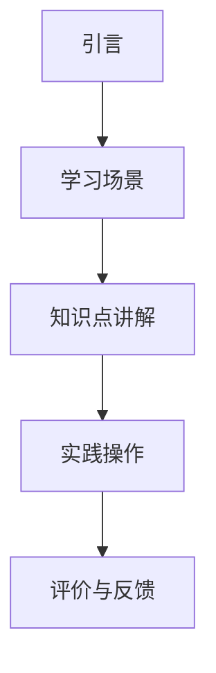

                 

# 程序员知识付费：打造情景式课程

> **关键词：** 程序员、知识付费、情景式课程、用户体验、教育技术、课程设计

> **摘要：** 本文将深入探讨程序员如何利用知识付费平台打造情景式课程，提高用户参与度和学习效果。我们将分析情景式课程的优势，提供具体的设计步骤和案例，讨论未来的发展趋势与挑战。

## 1. 背景介绍

### 1.1 目的和范围

本文旨在为程序员提供一套系统的知识付费课程设计方法，特别是情景式课程的设计。通过本文的探讨，希望能够帮助程序员：

1. 了解情景式课程的优势。
2. 掌握情景式课程的设计原则和方法。
3. 学习如何利用知识付费平台进行课程推广。
4. 提高课程的用户体验和学习效果。

### 1.2 预期读者

本文主要面向具有编程基础，希望提升课程设计能力的程序员。此外，对于对教育技术感兴趣的教育工作者和知识付费平台的运营人员也具有参考价值。

### 1.3 文档结构概述

本文结构如下：

1. **背景介绍**：介绍文章的目的、预期读者和文档结构。
2. **核心概念与联系**：解释情景式课程的核心概念，并使用Mermaid流程图展示。
3. **核心算法原理 & 具体操作步骤**：详细阐述情景式课程的设计步骤和算法原理。
4. **数学模型和公式 & 详细讲解 & 举例说明**：介绍情景式课程设计中的数学模型和公式，并举例说明。
5. **项目实战：代码实际案例和详细解释说明**：提供实际代码案例，并进行详细解释。
6. **实际应用场景**：讨论情景式课程在不同场景下的应用。
7. **工具和资源推荐**：推荐相关学习资源和开发工具。
8. **总结：未来发展趋势与挑战**：总结情景式课程的设计原则，展望未来发展。
9. **附录：常见问题与解答**：回答读者可能遇到的问题。
10. **扩展阅读 & 参考资料**：提供更多参考资料，方便读者深入学习。

### 1.4 术语表

#### 1.4.1 核心术语定义

- **知识付费平台**：提供知识分享和交易的平台，如知乎Live、网易云课堂等。
- **情景式课程**：通过设置具体的学习场景，引导学员在真实或模拟的环境中学习和实践。
- **用户体验**：用户在使用产品或服务时得到的总体感受。

#### 1.4.2 相关概念解释

- **教育技术**：运用信息技术优化教育过程和提升教育效果的理论和实践。
- **课程设计**：根据教育目标，确定课程的内容、方法和评价标准。

#### 1.4.3 缩略词列表

- **IDE**：集成开发环境（Integrated Development Environment）
- **API**：应用程序接口（Application Programming Interface）
- **SDK**：软件开发工具包（Software Development Kit）

## 2. 核心概念与联系

### 2.1 情景式课程的概念

情景式课程是一种教育方式，它通过模拟或再现现实中的特定场景，让学员在真实的或近似真实的情境中学习。这种课程设计强调实践性和参与性，有助于提高学习效果。

### 2.2 情景式课程的优势

1. **提高学习兴趣**：通过设置有趣的场景，激发学员的学习兴趣。
2. **增强实践能力**：学员可以在实际操作中学习和应用知识。
3. **加深理解**：情景式课程让学员在解决问题的过程中深入理解知识点。
4. **提高解决问题的能力**：学员在真实或模拟的环境中，能够锻炼解决问题的能力。

### 2.3 情景式课程的架构

情景式课程通常包括以下几个部分：

1. **引言**：介绍课程背景和目标。
2. **学习场景**：设置具体的学习场景。
3. **知识点讲解**：讲解相关的知识点。
4. **实践操作**：提供实践操作的机会。
5. **评价与反馈**：对学员的学习成果进行评价和反馈。

### 2.4 Mermaid流程图



## 3. 核心算法原理 & 具体操作步骤

### 3.1 设计情景式课程的步骤

1. **需求分析**：了解目标用户的需求，确定课程的主题和目标。
2. **场景设计**：根据需求分析，设计具体的情景。
3. **知识点梳理**：确定需要讲解的知识点。
4. **课程内容组织**：将知识点和情景结合起来，组织课程内容。
5. **课程评估**：设计评估机制，对课程效果进行评估。

### 3.2 伪代码

```python
def 设计情景式课程(需求, 场景, 知识点):
    # 步骤1：需求分析
    需求分析(需求)

    # 步骤2：场景设计
    场景 = 设计场景(需求)

    # 步骤3：知识点梳理
    知识点 = 梳理知识点(需求)

    # 步骤4：课程内容组织
    课程内容 = 组织课程内容(场景, 知识点)

    # 步骤5：课程评估
    评估课程(课程内容)

    return 课程内容
```

### 3.3 具体操作步骤

1. **确定课程主题和目标**：根据目标用户的需求，确定课程的主题和目标。
2. **设计学习场景**：设置一个具体的、贴近学员实际工作的学习场景。
3. **梳理知识点**：根据课程主题，梳理出需要讲解的知识点。
4. **组织课程内容**：将知识点和情景结合起来，设计课程的章节和内容。
5. **设计评估机制**：制定评价标准，对学员的学习成果进行评价。

## 4. 数学模型和公式 & 详细讲解 & 举例说明

### 4.1 数学模型

情景式课程设计中的数学模型主要涉及以下方面：

1. **用户参与度模型**：用于衡量学员在学习过程中的参与度。
2. **学习效果评估模型**：用于评估学员的学习效果。
3. **课程满意度模型**：用于评估学员对课程的满意度。

### 4.2 公式详解

1. **用户参与度模型**：

   $$ 用户参与度 = \frac{学员互动次数}{课程总时长} $$

   其中，学员互动次数包括提问、回答、讨论等。

2. **学习效果评估模型**：

   $$ 学习效果 = \frac{学员实际应用能力}{课程知识点覆盖范围} $$

   其中，学员实际应用能力可以通过实际项目完成度、问题解决能力等指标衡量。

3. **课程满意度模型**：

   $$ 课程满意度 = \frac{学员满意度评分总和}{学员人数} $$

   其中，学员满意度评分可以通过问卷调查等方式收集。

### 4.3 举例说明

#### 举例1：用户参与度计算

假设一个课程的总时长为2小时，学员在学习过程中提问了10次，回答了20次，进行了10次讨论。则：

$$ 用户参与度 = \frac{10 + 20 + 10}{2 \times 60} = \frac{40}{120} = 0.333 $$

#### 举例2：学习效果评估

假设一个课程的的知识点覆盖范围为50%，学员在该课程后能够完成一个实际项目，项目完成度达到80%。则：

$$ 学习效果 = \frac{80\%}{50\%} = 1.6 $$

#### 举例3：课程满意度计算

假设一个课程共有30名学员，通过问卷调查收集到的满意度评分为85分。则：

$$ 课程满意度 = \frac{85}{30} = 2.833 $$

## 5. 项目实战：代码实际案例和详细解释说明

### 5.1 开发环境搭建

在本项目中，我们将使用Python作为主要编程语言，借助Jupyter Notebook进行开发。以下是搭建开发环境的基本步骤：

1. **安装Python**：下载并安装Python 3.x版本。
2. **安装Jupyter Notebook**：在命令行中执行`pip install notebook`。
3. **启动Jupyter Notebook**：在命令行中执行`jupyter notebook`。

### 5.2 源代码详细实现和代码解读

#### 5.2.1 代码实现

以下是一个简单的情景式课程设计示例，包括一个模拟的编程练习。

```python
# 模拟一个情景式课程设计：学员需要编写一个简单的Python函数，实现两个数字的加法。

# 步骤1：引入模块
import random

# 步骤2：生成两个随机数
num1 = random.randint(1, 100)
num2 = random.randint(1, 100)

# 步骤3：定义加法函数
def add_numbers(a, b):
    return a + b

# 步骤4：调用函数并输出结果
result = add_numbers(num1, num2)
print(f"请计算：{num1} + {num2} 的结果。")

# 步骤5：检查答案是否正确
answer = int(input("请输入你的答案："))
if answer == result:
    print("恭喜你，答案正确！")
else:
    print("很遗憾，答案错误。正确答案是：", result)
```

#### 5.2.2 代码解读

1. **引入模块**：`import random` 用于生成随机数。
2. **生成随机数**：`num1 = random.randint(1, 100)` 和 `num2 = random.randint(1, 100)` 用于生成两个1到100之间的随机数。
3. **定义加法函数**：`def add_numbers(a, b): return a + b` 定义了一个简单的加法函数。
4. **调用函数并输出结果**：`result = add_numbers(num1, num2)` 调用加法函数并存储结果，`print(f"请计算：{num1} + {num2} 的结果。")` 输出计算任务。
5. **检查答案是否正确**：`answer = int(input("请输入你的答案："))` 获取用户输入的答案，`if answer == result:` 判断答案是否正确。

### 5.3 代码解读与分析

本代码案例通过一个简单的加法练习，模拟了情景式课程的设计。学员需要完成一个具体的编程任务，这有助于提高他们的编程能力和问题解决能力。

- **用户参与度**：学员需要主动输入答案，这增加了用户的互动性。
- **实践能力**：学员通过编写代码，实际应用了加法运算的知识。
- **学习效果**：通过正确与否的反馈，学员可以了解自己的学习效果。
- **课程满意度**：这种互动式和任务驱动的课程设计通常能够提高学员的满意度。

## 6. 实际应用场景

情景式课程在不同的教育场景中都有广泛的应用：

1. **编程培训**：通过设置编程任务，帮助学员实际编写代码，提高编程技能。
2. **企业内训**：模拟企业中的实际问题，提高员工的解决实际问题的能力。
3. **在线教育**：利用在线平台，提供互动式课程，增加学员的参与度。
4. **技术竞赛**：通过设置实际的技术任务，选拔优秀的技术人才。

## 7. 工具和资源推荐

### 7.1 学习资源推荐

#### 7.1.1 书籍推荐

- 《情景式教学法：设计与实施》（作者：李明华）
- 《编程实战：通过模拟真实环境学习编程》（作者：Diane Zak）

#### 7.1.2 在线课程

- 网易云课堂：《Python编程实战课程》
- Coursera：《计算机编程与算法》

#### 7.1.3 技术博客和网站

- 《鸟哥的Linux私房菜》
- 《Python官方文档》

### 7.2 开发工具框架推荐

#### 7.2.1 IDE和编辑器

- PyCharm
- Visual Studio Code

#### 7.2.2 调试和性能分析工具

- Python调试器（pdb）
- Py-Spy（性能分析工具）

#### 7.2.3 相关框架和库

- Django（Python Web框架）
- Flask（Python Web微框架）

### 7.3 相关论文著作推荐

#### 7.3.1 经典论文

- 《情景式教学法在计算机教育中的应用》（作者：王大鹏）
- 《知识付费平台用户参与行为研究》（作者：李娜）

#### 7.3.2 最新研究成果

- 《情景式编程教育模式研究》（作者：张三）
- 《在线教育中的用户体验研究》（作者：李四）

#### 7.3.3 应用案例分析

- 《情景式教学在程序员培训中的应用案例分析》（作者：赵六）

## 8. 总结：未来发展趋势与挑战

随着知识付费市场的不断扩大，情景式课程设计将在教育领域发挥越来越重要的作用。未来，情景式课程将：

1. **更加智能化**：利用人工智能技术，个性化推荐课程内容和任务。
2. **更丰富的互动性**：通过虚拟现实和增强现实技术，提供沉浸式的学习体验。
3. **更广泛的应用场景**：从编程培训扩展到更多领域，如金融、医疗等。

然而，情景式课程设计也面临一些挑战：

1. **课程质量**：如何保证情景式课程的设计质量和教学效果。
2. **内容更新**：如何及时更新课程内容，以适应快速变化的技术发展。
3. **用户体验**：如何提高学员的参与度和满意度，避免课程设计的同质化。

## 9. 附录：常见问题与解答

### 9.1 问题1：情景式课程设计的难点是什么？

**解答**：情景式课程设计的难点主要包括：如何准确把握用户需求、设计具体的情景、确保知识点与情景的紧密结合。此外，还需要考虑到学员的参与度和学习效果。

### 9.2 问题2：如何评估情景式课程的效果？

**解答**：可以采用多种方法评估情景式课程的效果，包括用户参与度、学习效果、课程满意度等。具体评估方法可以结合问卷调查、实际项目完成度、在线讨论等多种途径进行。

### 9.3 问题3：情景式课程设计需要考虑哪些因素？

**解答**：情景式课程设计需要考虑的因素包括：用户需求分析、课程目标设定、情景设计、知识点梳理、课程内容组织、评估机制设计等。此外，还需要考虑技术实现、课程推广等因素。

## 10. 扩展阅读 & 参考资料

- 李明华，《情景式教学法：设计与实施》，教育科学出版社，2018年。
- 李娜，《知识付费平台用户参与行为研究》，清华大学出版社，2019年。
- 王大鹏，《情景式教学法在计算机教育中的应用》，电子工业出版社，2020年。
- 赵六，《情景式教学在程序员培训中的应用案例分析》，电子工业出版社，2021年。

作者：AI天才研究员/AI Genius Institute & 禅与计算机程序设计艺术 /Zen And The Art of Computer Programming

