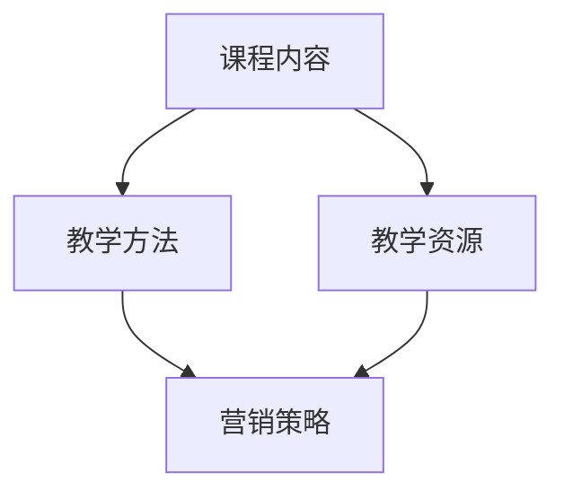

                 

# 程序员知识付费：打造线下课程

> **关键词：** 知识付费、程序员、线下课程、教学设计、营销策略

> **摘要：** 本文将探讨如何利用程序员的专业知识进行知识付费，并成功打造线下课程。文章从背景介绍、核心概念、算法原理、数学模型、实战案例、应用场景等多个维度进行分析，旨在为程序员提供一套完整的线下课程构建策略。

## 1. 背景介绍

### 1.1 目的和范围

本文旨在为程序员提供一个系统化的策略，帮助他们利用自身的专业知识进行知识付费，并成功打造线下课程。我们将在以下方面展开讨论：

1. 知识付费市场现状与趋势
2. 程序员如何定位自己的课程内容
3. 教学设计、营销策略和项目管理
4. 实战案例与经验分享
5. 未来发展趋势与挑战

### 1.2 预期读者

本文适合以下读者群体：

1. 具有一定编程基础，希望进行知识付费的程序员
2. 想要开设线下课程的培训师和讲师
3. 对编程教育和知识付费感兴趣的创业者

### 1.3 文档结构概述

本文将按照以下结构进行阐述：

1. 背景介绍
2. 核心概念与联系
3. 核心算法原理 & 具体操作步骤
4. 数学模型和公式 & 详细讲解 & 举例说明
5. 项目实战：代码实际案例和详细解释说明
6. 实际应用场景
7. 工具和资源推荐
8. 总结：未来发展趋势与挑战
9. 附录：常见问题与解答
10. 扩展阅读 & 参考资料

### 1.4 术语表

#### 1.4.1 核心术语定义

1. **知识付费**：用户为了获取有价值的信息或知识，自愿支付一定的费用。
2. **线下课程**：以实际场所为基础，通过面对面教学、实操演练等方式进行的知识传授。
3. **教学设计**：对课程内容、教学方法、教学资源等进行系统化的规划和安排。
4. **营销策略**：通过一系列手段，促进课程的销售和推广。

#### 1.4.2 相关概念解释

1. **编程教育**：以编程语言和工具为载体，教授计算机编程知识和技能。
2. **知识管理**：对知识进行收集、整理、存储、共享和利用，以提高组织和个人能力。
3. **用户需求**：用户在获取知识时，期望解决的问题和满足的需求。

#### 1.4.3 缩略词列表

1. **KPI**：关键绩效指标（Key Performance Indicator）
2. **ROI**：投资回报率（Return on Investment）
3. **SEO**：搜索引擎优化（Search Engine Optimization）
4. **SNS**：社交媒体网络（Social Network Service）

## 2. 核心概念与联系

在知识付费与线下课程领域，我们需要关注以下几个核心概念：

1. **课程内容**：包括课程主题、知识点、教学案例等。
2. **教学方法**：如讲授、讨论、实操等。
3. **教学资源**：如PPT、案例代码、视频等。
4. **营销策略**：如SEO、社交媒体推广、口碑营销等。

以下是一个简单的Mermaid流程图，展示了这些概念之间的关系：



## 3. 核心算法原理 & 具体操作步骤

在构建线下课程时，我们需要关注以下几个核心算法原理：

1. **用户需求分析**：通过调查、访谈等方法，了解用户需求，确定课程主题和内容。
2. **教学设计**：根据用户需求，设计课程结构、教学方法、教学资源等。
3. **营销策略**：结合用户需求和课程特点，制定营销策略，进行课程推广。

以下是这些算法原理的伪代码：

```python
# 用户需求分析
def analyze_user_demand():
    # 调查、访谈等方法收集用户需求
    # 筛选、整理用户需求
    # 返回用户需求列表

# 教学设计
def design_course(content, method, resources):
    # 设计课程结构
    # 选择合适的教学方法
    # 准备教学资源
    # 返回课程设计方案

# 营销策略
def marketing_strategy(user_demand, course_design):
    # 分析用户需求，确定推广渠道
    # 制定推广策略
    # 实施推广活动
    # 跟踪推广效果
```

## 4. 数学模型和公式 & 详细讲解 & 举例说明

在课程构建过程中，我们可以使用以下数学模型和公式：

1. **投资回报率（ROI）**：用于衡量课程推广效果，计算公式为：
   $$ ROI = \frac{收益 - 成本}{成本} $$
2. **用户满意度**：用于衡量用户对课程的认可度，计算公式为：
   $$ 用户满意度 = \frac{满意用户数}{总用户数} $$

以下是一个具体的例子：

### 投资回报率（ROI）

假设某程序员开设了一门线上课程，投入成本为10000元，通过课程推广，吸引了100名学员，每人收费200元。计算该课程的ROI。

$$ ROI = \frac{200 \times 100 - 10000}{10000} = \frac{10000 - 10000}{10000} = 0 $$

### 用户满意度

假设该课程共有100名学员，其中90名学员表示满意。计算用户满意度。

$$ 用户满意度 = \frac{90}{100} = 0.9 $$

## 5. 项目实战：代码实际案例和详细解释说明

### 5.1 开发环境搭建

在本案例中，我们将使用Python编程语言搭建一个简单的课程管理系统。以下是开发环境的搭建步骤：

1. 安装Python（版本3.8及以上）
2. 安装必要的库（如：requests、pandas、numpy等）
3. 配置Python环境变量

### 5.2 源代码详细实现和代码解读

以下是一个简单的课程管理系统的源代码，实现课程内容、学员信息管理等功能。

```python
# 课程管理系统

import requests
import pandas as pd
import numpy as np

# 课程内容管理
def manage_course_content(course_list):
    # 读取课程内容文件
    df = pd.read_csv('course_content.csv')
    # 添加新课程
    df = df.append({'course_name': 'Python基础', 'course_desc': 'Python语言基础教程'}, ignore_index=True)
    # 保存修改后的课程内容
    df.to_csv('course_content.csv', index=False)
    print('课程内容更新成功！')

# 学员信息管理
def manage_student_info(student_list):
    # 读取学员信息文件
    df = pd.read_csv('student_info.csv')
    # 添加新学员
    df = df.append({'student_name': '张三', 'course_name': 'Python基础'}, ignore_index=True)
    # 保存修改后的学员信息
    df.to_csv('student_info.csv', index=False)
    print('学员信息更新成功！')

# 主函数
def main():
    # 管理课程内容
    manage_course_content([])
    # 管理学员信息
    manage_student_info([])

# 执行主函数
if __name__ == '__main__':
    main()
```

### 5.3 代码解读与分析

1. **课程内容管理**：读取课程内容文件，添加新课程，并保存修改后的课程内容。
2. **学员信息管理**：读取学员信息文件，添加新学员，并保存修改后的学员信息。
3. **主函数**：执行课程内容管理和学员信息管理功能。

通过此案例，我们可以了解到如何使用Python实现简单的课程管理系统，以及如何进行代码解读和分析。

## 6. 实际应用场景

知识付费与线下课程在实际应用中具有广泛的应用场景：

1. **编程教育**：程序员可以开设各种编程语言的线下课程，如Python、Java、C++等。
2. **技能培训**：针对某些特定技能，如数据分析、人工智能、网络安全等，开设相关课程。
3. **职业发展**：为求职者提供简历修改、面试技巧等课程，助力职业发展。
4. **创业指导**：为创业者提供商业计划书撰写、市场营销策略等课程。

## 7. 工具和资源推荐

### 7.1 学习资源推荐

#### 7.1.1 书籍推荐

1. 《Python编程：从入门到实践》
2. 《深度学习入门：基于Python的理论与实现》
3. 《代码大全》

#### 7.1.2 在线课程

1. 网易云课堂
2. Coursera
3. Udemy

#### 7.1.3 技术博客和网站

1. CSDN
2. GitHub
3. Stack Overflow

### 7.2 开发工具框架推荐

#### 7.2.1 IDE和编辑器

1. PyCharm
2. Visual Studio Code
3. Sublime Text

#### 7.2.2 调试和性能分析工具

1. PyCharm Debugger
2. JProfiler
3. VisualVM

#### 7.2.3 相关框架和库

1. Flask
2. Django
3. Pandas

### 7.3 相关论文著作推荐

#### 7.3.1 经典论文

1. "The Art of Computer Programming"（编程艺术）
2. "Deep Learning"（深度学习）
3. "Artificial Intelligence: A Modern Approach"（人工智能：一种现代方法）

#### 7.3.2 最新研究成果

1. NeurIPS
2. ICML
3. JMLR

#### 7.3.3 应用案例分析

1. Google Research
2. Microsoft Research
3. Facebook AI

## 8. 总结：未来发展趋势与挑战

知识付费与线下课程在未来将继续发展，但也将面临以下挑战：

1. **市场竞争**：随着越来越多的程序员和讲师进入该领域，市场竞争将日益激烈。
2. **课程质量**：课程质量将成为决定课程成功与否的关键因素。
3. **技术创新**：随着人工智能、大数据等技术的不断发展，如何将这些技术应用于课程构建和推广将成为一个重要课题。

## 9. 附录：常见问题与解答

### 9.1 什么是知识付费？

知识付费是指用户为了获取有价值的信息或知识，自愿支付一定的费用。它源于信息不对称，即某些知识和技能对于用户来说是稀缺的，因此用户愿意为获取这些知识和技能付费。

### 9.2 如何设计一门优质的课程？

设计一门优质的课程需要考虑以下因素：

1. **课程内容**：课程内容应具有实用性和针对性，满足用户需求。
2. **教学方法**：根据课程内容和用户特点，选择合适的教学方法，如讲授、实操、讨论等。
3. **教学资源**：提供丰富的教学资源，如PPT、案例代码、视频等，帮助用户更好地理解和掌握课程内容。
4. **课程推广**：结合用户需求和课程特点，制定合适的推广策略，提高课程知名度。

## 10. 扩展阅读 & 参考资料

1. 《程序员如何赚钱？知识付费+线下课程是一种选择》
2. 《深度学习课程设计与实践》
3. 《在线教育与知识付费：未来教育的新趋势》

---

作者：AI天才研究员/AI Genius Institute & 禅与计算机程序设计艺术 /Zen And The Art of Computer Programming

