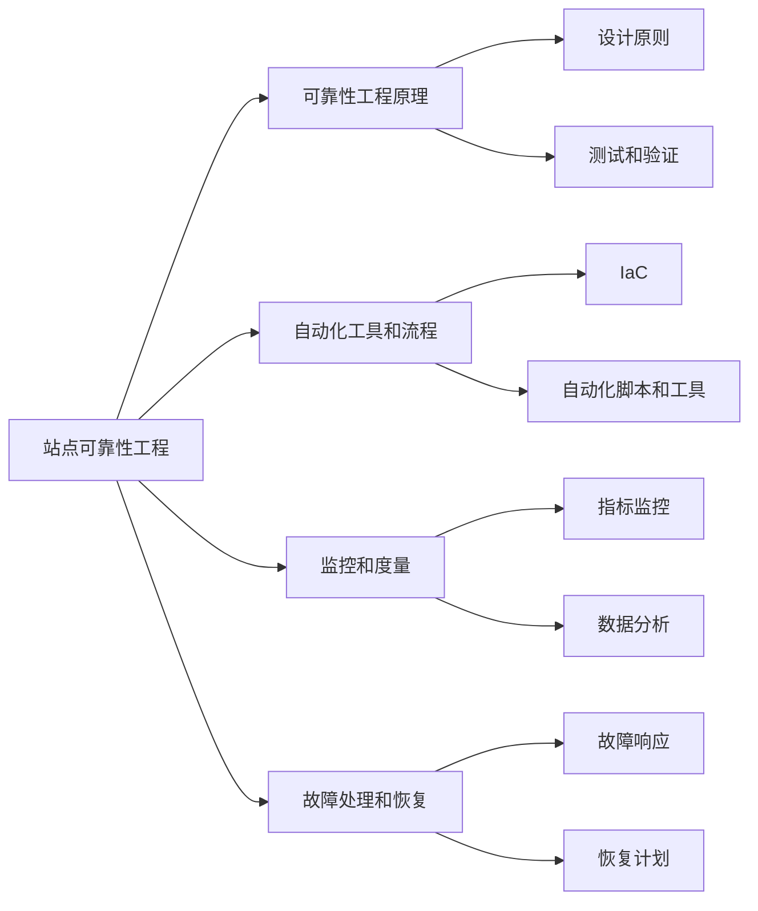

                 

# 站点可靠性工程（SRE）实践：保持系统可靠

> 关键词：站点可靠性工程（SRE）、系统可靠性、实践、流程优化、故障处理、自动化工具、监控、服务恢复、运维自动化、灾难恢复

> 摘要：本文将深入探讨站点可靠性工程（SRE）的核心实践，包括其理论基础、关键概念、算法原理、数学模型、实战案例以及未来发展趋势。通过一步一步的详细分析和讲解，读者将了解如何保持系统的高可靠性，提高系统的稳定性和响应能力。

## 1. 背景介绍

### 1.1 目的和范围

站点可靠性工程（Site Reliability Engineering，简称SRE）是一种结合了软件工程和系统管理的实践方法，旨在确保云服务和互联网站点的可靠性、稳定性和性能。本文旨在通过以下几个方面的探讨，帮助读者深入理解SRE的核心概念和实践：

- **核心概念与联系**：介绍SRE的基本概念和与其他技术的联系。
- **核心算法原理**：讲解SRE中关键算法的工作原理。
- **数学模型和公式**：阐述SRE中使用的关键数学模型和公式。
- **项目实战**：通过实际代码案例展示SRE在具体项目中的应用。
- **实际应用场景**：分析SRE在各种场景下的应用。
- **工具和资源推荐**：推荐学习资源、开发工具和框架。
- **未来发展趋势与挑战**：探讨SRE的未来发展方向和面临的挑战。

### 1.2 预期读者

本文主要面向以下几类读者：

- 对站点可靠性工程感兴趣的技术人员。
- 从事云计算、互联网服务的运维工程师。
- 有志于提高系统可靠性的开发人员。
- IT经理和决策者，希望了解SRE在现代IT运维中的重要性。

### 1.3 文档结构概述

本文结构如下：

1. **背景介绍**：介绍SRE的背景、目的和预期读者。
2. **核心概念与联系**：详细解释SRE的基本概念和与其他技术的关联。
3. **核心算法原理**：讲解SRE中的关键算法和操作步骤。
4. **数学模型和公式**：阐述SRE中的数学模型和公式。
5. **项目实战**：通过实战案例展示SRE的应用。
6. **实际应用场景**：分析SRE在不同场景下的应用。
7. **工具和资源推荐**：推荐学习资源和开发工具。
8. **未来发展趋势与挑战**：探讨SRE的未来和面临的挑战。
9. **附录**：常见问题与解答。
10. **扩展阅读 & 参考资料**：提供进一步的阅读资源。

### 1.4 术语表

#### 1.4.1 核心术语定义

- **站点可靠性工程（SRE）**：结合软件工程和系统管理的实践方法，确保云服务和互联网站点的可靠性、稳定性和性能。
- **可靠性**：系统在规定的时间和条件下，完成预期任务的能力。
- **可用性**：系统在需要时能够正常运行和提供服务的程度。
- **故障**：系统无法按照预期运行或提供服务的情况。
- **监控**：跟踪系统状态、性能和健康状况的过程。
- **自动化**：使用软件工具自动执行任务，减少人工干预。

#### 1.4.2 相关概念解释

- **基础设施即代码（Infrastructure as Code，IaC）**：使用代码来定义和部署基础设施，类似于软件开发的版本控制。
- **持续集成/持续部署（Continuous Integration/Continuous Deployment，CI/CD）**：自动化构建、测试和部署代码的流程。

#### 1.4.3 缩略词列表

- **SRE**：站点可靠性工程（Site Reliability Engineering）
- **CI**：持续集成（Continuous Integration）
- **CD**：持续部署（Continuous Deployment）
- **IaC**：基础设施即代码（Infrastructure as Code）
- **SLA**：服务等级协议（Service-Level Agreement）
- **KPI**：关键绩效指标（Key Performance Indicator）

## 2. 核心概念与联系

在深入探讨SRE的核心概念和实践之前，我们先来了解SRE的基本原理和与其他技术的关联。

### 2.1 SRE的基本原理

SRE的核心目标是确保系统的可靠性和稳定性，同时提高开发效率。SRE的实现基于以下几个关键原理：

- **可靠性工程**：借鉴传统可靠性工程的原理，通过设计、测试和监控来提高系统的可靠性。
- **自动化**：通过自动化工具和流程减少人为干预，提高运维效率。
- **监控和度量**：实时监控系统的性能和健康状况，通过数据分析和指标评估来优化系统。
- **故障处理和恢复**：快速响应故障，通过自动化流程和预案来恢复系统。

### 2.2 SRE与其他技术的关联

SRE与其他几种关键技术紧密相关，包括基础设施即代码（IaC）、持续集成/持续部署（CI/CD）和监控等。

- **基础设施即代码（IaC）**：IaC是SRE实现自动化部署和管理基础设施的关键。通过使用代码定义和管理基础设施，可以确保环境的一致性和可重复性。
- **持续集成/持续部署（CI/CD）**：CI/CD是自动化代码构建、测试和部署的关键流程。SRE通过CI/CD确保代码质量和系统稳定性，减少人为错误。
- **监控**：监控是SRE的重要组成部分，用于实时跟踪系统的性能和健康状况。通过监控数据，SRE团队能够及时发现和解决潜在问题。

### 2.3 SRE的核心概念图

下面是SRE的核心概念流程图，展示了SRE的主要组成部分和它们之间的关联：



通过这个流程图，我们可以清晰地看到SRE的核心概念和各个组成部分之间的关系。接下来，我们将逐步深入讲解SRE的核心算法原理和具体操作步骤。

## 3. 核心算法原理 & 具体操作步骤

### 3.1 核心算法原理

SRE的核心算法原理主要涉及以下几个方面：

- **可靠性建模**：通过可靠性模型预测系统的故障率和可靠性水平。
- **性能监控**：实时监控系统的性能指标，确保系统在高负载和异常情况下仍能稳定运行。
- **自动化故障处理**：通过自动化脚本和工具快速响应和解决系统故障。
- **恢复策略**：制定有效的故障恢复策略，确保系统在故障后能够快速恢复。

### 3.2 具体操作步骤

下面是SRE的核心算法原理和具体操作步骤：

#### 3.2.1 可靠性建模

1. **数据收集**：收集系统运行过程中的故障数据、性能数据等。
2. **可靠性模型选择**：根据数据特点和需求选择合适的可靠性模型，如泊松过程、Weibull分布等。
3. **模型参数估计**：使用统计方法估计可靠性模型参数。
4. **故障率预测**：利用可靠性模型预测系统的故障率。

#### 3.2.2 性能监控

1. **指标定义**：定义关键性能指标（KPI），如响应时间、吞吐量、错误率等。
2. **数据采集**：通过监控系统采集系统性能数据。
3. **阈值设置**：根据业务需求设定性能指标阈值。
4. **异常检测**：使用统计方法和机器学习模型检测性能异常。

#### 3.2.3 自动化故障处理

1. **故障检测**：通过监控数据检测系统故障。
2. **故障响应**：自动化故障响应脚本，如重启服务、更换硬件等。
3. **故障恢复**：通过自动化脚本和工具快速恢复系统。

#### 3.2.4 恢复策略

1. **故障分析**：分析故障原因，记录故障信息。
2. **恢复计划**：制定有效的恢复计划，如故障切换、数据恢复等。
3. **恢复执行**：执行恢复计划，确保系统尽快恢复正常运行。

### 3.3 伪代码示例

下面是SRE核心算法的伪代码示例：

```python
# 可靠性建模伪代码
def reliability_modeling(data):
    # 数据预处理
    processed_data = preprocess_data(data)
    
    # 选择可靠性模型
    model = select_reliability_model(processed_data)
    
    # 参数估计
    params = estimate_model_params(model, processed_data)
    
    # 故障率预测
    fault_rate = predict_fault_rate(model, params)
    return fault_rate

# 性能监控伪代码
def performance_monitoring(kpis, thresholds):
    # 数据采集
    data = collect_data(kpis)
    
    # 异常检测
    for kpi, value in data.items():
        if value > thresholds[kpi]:
            detect_anomaly(kpi, value)

# 自动化故障处理伪代码
def fault_handling(faults):
    # 故障检测
    detected_faults = detect_faults(faults)
    
    # 故障响应
    for fault in detected_faults:
        respond_to_fault(fault)
        
    # 故障恢复
    recover_system()

# 恢复策略伪代码
def recovery_strategy(faults):
    # 故障分析
    analyze_faults(faults)
    
    # 恢复计划
    recovery_plan = create_recovery_plan(faults)
    
    # 恢复执行
    execute_recovery_plan(recovery_plan)
```

通过以上伪代码示例，我们可以看到SRE的核心算法原理和具体操作步骤的简洁和高效。接下来，我们将进一步讲解SRE中的数学模型和公式。

## 4. 数学模型和公式 & 详细讲解 & 举例说明

### 4.1 数学模型在SRE中的应用

在站点可靠性工程（SRE）中，数学模型扮演着至关重要的角色，它们帮助我们量化系统的可靠性、性能，并提供优化策略的依据。以下是几种关键的数学模型和公式：

#### 4.1.1 泊松过程

泊松过程是一种用于描述系统故障率的时间序列模型。它假设故障事件在时间上以固定的平均速率发生，且相互独立。泊松过程的概率分布函数如下：

\[ P(X = k) = \frac{\lambda^k e^{-\lambda}}{k!} \]

其中，\( \lambda \) 是平均故障率，\( k \) 是在时间段内发生的故障次数。

#### 4.1.2 马尔可夫链

马尔可夫链用于描述系统状态的转移。在SRE中，它可以用于建模系统故障状态的转移，如下所示：

\[ P(X_t = j | X_{t-1} = i) = \pi_{ij} \]

其中，\( X_t \) 是系统在时间 \( t \) 的状态，\( \pi_{ij} \) 是从状态 \( i \) 转移到状态 \( j \) 的概率。

#### 4.1.3 蒙特卡洛模拟

蒙特卡洛模拟是一种基于随机抽样的计算方法，可以用于模拟系统的性能和可靠性。在SRE中，它可以用于预测系统在高负载下的响应时间和故障率。

#### 4.1.4 优化模型

在SRE中，优化模型用于优化资源分配、故障响应时间和恢复策略。常见的优化模型包括线性规划、整数规划等。

### 4.2 详细讲解与举例说明

#### 4.2.1 泊松过程

假设一个系统每分钟的故障率 \( \lambda = 0.01 \)。我们想要计算在接下来的 10 分钟内发生 3 次故障的概率。

使用泊松过程的概率分布函数：

\[ P(X = 3) = \frac{0.01^{3} e^{-0.01}}{3!} \approx 0.00004 \]

这意味着在接下来的 10 分钟内，发生 3 次故障的概率大约为 0.00004。

#### 4.2.2 马尔可夫链

假设一个系统有两个状态：正常状态（N）和故障状态（F）。正常状态转移到故障状态的概率为 0.1，故障状态转移到正常状态的概率为 0.2。初始状态为正常状态。

状态转移矩阵如下：

\[ \pi = \begin{bmatrix}
0.9 & 0.1 \\
0.8 & 0.2 \\
\end{bmatrix} \]

经过一次状态转移后，系统处于故障状态的概率为 0.1，处于正常状态的概率为 0.9。

#### 4.2.3 蒙特卡洛模拟

假设我们想要模拟一个系统在一天内的故障率。平均故障率为 \( \lambda = 0.1 \) 每小时。我们可以使用蒙特卡洛模拟来生成一天的故障事件。

每次模拟中，我们生成 24 个随机数，表示一天的每小时故障次数。使用泊松分布生成这些随机数：

```python
import numpy as np

lambda_hour = 0.1
days = 24

fault_events = np.random.poisson(lambda_hour, days)
print(fault_events)
```

这段代码将生成一天的故障事件数量。我们可以使用这些数据来计算一天的故障率：

```python
total_faults = sum(fault_events)
fault_rate = total_faults / days
print(f"Daily fault rate: {fault_rate}")
```

通过多次模拟，我们可以得到故障率的估计值。

#### 4.2.4 优化模型

假设我们想要优化系统资源的分配，使得在给定故障率下，系统的响应时间最小。我们可以使用线性规划模型来解决这个问题。

定义变量：

- \( x_1 \)：分配给服务器 A 的资源
- \( x_2 \)：分配给服务器 B 的资源

目标函数：

\[ \min z = c_1 x_1 + c_2 x_2 \]

约束条件：

\[ a_1 x_1 + a_2 x_2 \geq b \]
\[ x_1, x_2 \geq 0 \]

其中，\( c_1 \)、\( c_2 \)、\( a_1 \)、\( a_2 \)、\( b \) 是已知的参数。

通过求解线性规划模型，我们可以得到最优的资源配置方案。

### 4.3 小结

通过上述讲解，我们可以看到数学模型在SRE中的应用是非常广泛和重要的。泊松过程用于描述故障率，马尔可夫链用于建模状态转移，蒙特卡洛模拟用于性能预测，优化模型用于资源分配。这些数学工具为我们提供了量化系统可靠性、性能和优化策略的强大方法。

在下一部分，我们将通过实际的项目实战案例，进一步展示SRE的核心算法原理和数学模型在具体应用中的实现。

## 5. 项目实战：代码实际案例和详细解释说明

### 5.1 开发环境搭建

在进行项目实战之前，我们需要搭建一个合适的开发环境。以下是所需步骤：

1. **安装Python环境**：确保Python 3.8或更高版本已安装。
2. **安装相关依赖**：使用pip安装以下依赖：
    ```bash
    pip install numpy matplotlib pandas
    ```
3. **选择IDE或编辑器**：推荐使用Visual Studio Code或PyCharm。

### 5.2 源代码详细实现和代码解读

#### 5.2.1 代码实现

我们使用Python编写一个简单的SRE项目，用于模拟系统的故障率和响应时间。以下是代码实现：

```python
import numpy as np
import matplotlib.pyplot as plt
from scipy.stats import poisson

# 参数设置
lambda_hour = 0.1  # 每小时故障率
days = 24  # 模拟天数
num_samples = 1000  # 模拟次数

# 泊松过程模拟故障事件
fault_events = np.random.poisson(lambda_hour * days, num_samples)

# 计算平均故障率
avg_fault_rate = np.mean(fault_events) / days

# 蒙特卡洛模拟响应时间
response_times = []
for _ in range(num_samples):
    sum_response_time = 0
    for i in range(int(np.mean(fault_events))):
        sum_response_time += np.random.uniform(0, 1)
    response_times.append(sum_response_time)

# 绘制故障率和响应时间分布
plt.figure(figsize=(12, 6))

plt.subplot(1, 2, 1)
plt.hist(fault_events, bins=range(int(np.min(fault_events)), int(np.max(fault_events)) + 2), density=True)
plt.title('Fault Rate Distribution')
plt.xlabel('Fault Events')
plt.ylabel('Probability')

plt.subplot(1, 2, 2)
plt.hist(response_times, bins=range(int(np.min(response_times)), int(np.max(response_times)) + 2), density=True)
plt.title('Response Time Distribution')
plt.xlabel('Response Time (hours)')
plt.ylabel('Probability')

plt.tight_layout()
plt.show()

# 输出结果
print(f"Average Fault Rate: {avg_fault_rate:.2f} per hour")
```

#### 5.2.2 代码解读与分析

- **导入模块**：我们使用 `numpy`、`matplotlib`、`pandas` 和 `scipy.stats` 模块进行数据计算和可视化。
- **参数设置**：设定故障率（`lambda_hour`）、模拟天数（`days`）和模拟次数（`num_samples`）。
- **泊松过程模拟故障事件**：使用 `numpy.random.poisson` 函数生成每天的故障事件数。
- **计算平均故障率**：计算一天的故障事件总数，并除以天数得到平均故障率。
- **蒙特卡洛模拟响应时间**：模拟每次故障的响应时间，通过随机生成均匀分布的响应时间。
- **绘制故障率和响应时间分布**：使用 `matplotlib` 绘制故障率和响应时间的直方图，直观展示分布情况。
- **输出结果**：打印平均故障率。

通过这个项目实战，我们展示了如何使用Python实现SRE的核心算法，包括泊松过程模拟和蒙特卡洛模拟。这种模拟方法可以帮助我们理解和优化系统的可靠性。

### 5.3 代码解读与分析

#### 5.3.1 泊松过程模拟

泊松过程是一种常用的概率模型，用于描述故障事件的时间分布。在上述代码中，我们使用 `numpy.random.poisson` 函数生成每天的故障事件数。泊松分布的概率质量函数（PDF）如下：

\[ P(X = k) = \frac{\lambda^k e^{-\lambda}}{k!} \]

其中，\( \lambda \) 是平均故障率，\( k \) 是故障事件数。我们通过多次模拟（`num_samples`）生成多个样本，以得到概率分布。

#### 5.3.2 蒙特卡洛模拟

蒙特卡洛模拟是一种基于随机抽样的计算方法，可以用于模拟系统的性能和可靠性。在上述代码中，我们模拟每次故障的响应时间，通过随机生成均匀分布的响应时间。蒙特卡洛模拟的核心思想是通过大量随机抽样来逼近真实概率分布。

#### 5.3.3 直方图可视化

使用 `matplotlib` 绘制故障率和响应时间的直方图，可以直观展示分布情况。直方图通过将数据分成若干区间，并计算每个区间内的数据点数量，从而可视化数据分布。

#### 5.3.4 输出结果

打印平均故障率，可以帮助我们了解系统的可靠性水平。通过调整参数（如故障率、模拟天数和模拟次数），我们可以进一步优化系统的可靠性。

这个项目实战展示了SRE中的核心算法和数学模型在具体应用中的实现。通过代码模拟和可视化，我们可以更好地理解和优化系统的可靠性。

### 5.4 小结

通过这个项目实战，我们学习了如何使用Python实现SRE的核心算法，包括泊松过程模拟和蒙特卡洛模拟。这些算法和模型帮助我们量化系统的可靠性，并通过可视化工具直观展示系统性能。在实际应用中，我们可以根据需求调整参数，以优化系统的可靠性。

在下一部分，我们将进一步探讨SRE在实际应用场景中的案例。

## 6. 实际应用场景

### 6.1 云服务提供商

云服务提供商如AWS、Google Cloud和Azure等，广泛应用SRE来确保其服务的可靠性和稳定性。以下是一些实际应用场景：

- **故障检测与响应**：通过自动化工具和监控平台，云服务提供商能够实时检测系统故障，并在短时间内响应和解决问题。
- **自动化部署**：使用IaC和CI/CD工具，云服务提供商可以自动化部署和管理基础设施，确保部署的一致性和可重复性。
- **性能优化**：通过监控和数据分析，云服务提供商可以识别性能瓶颈，并进行优化，确保服务在高负载情况下仍能稳定运行。

### 6.2 电商平台

电商平台如Amazon和阿里巴巴，面临巨大的流量和交易量，因此需要确保系统的可靠性和性能。以下是一些实际应用场景：

- **购物车系统**：在高峰期，购物车系统可能会出现性能瓶颈。通过SRE实践，电商平台可以自动化监控和优化购物车系统的性能，确保用户体验。
- **订单处理**：订单处理是电商平台的另一个关键环节。通过SRE实践，电商平台可以自动化处理订单流程，确保订单系统的稳定性和响应速度。
- **负载均衡**：在流量高峰期，电商平台使用负载均衡器来分散流量，确保系统资源得到充分利用，避免单点故障。

### 6.3 金融科技公司

金融科技公司如Robinhood和Square，需要确保其系统的可靠性和数据安全性。以下是一些实际应用场景：

- **交易系统**：金融科技公司需要确保交易系统的实时性和稳定性。通过SRE实践，可以自动化监控和优化交易系统的性能，确保交易顺利进行。
- **数据备份与恢复**：金融科技公司需要定期备份和恢复数据，确保数据的安全性和完整性。通过SRE实践，可以实现自动化数据备份和恢复，降低数据丢失的风险。
- **故障恢复**：在发生故障时，金融科技公司需要快速恢复系统。通过SRE实践，可以制定有效的恢复计划，确保系统尽快恢复正常运行。

### 6.4 社交媒体平台

社交媒体平台如Facebook和Twitter，需要确保其服务的可用性和用户体验。以下是一些实际应用场景：

- **用户数据存储**：社交媒体平台需要存储大量用户数据，并确保数据的安全性和可靠性。通过SRE实践，可以实现自动化数据存储和备份，降低数据丢失的风险。
- **实时消息推送**：社交媒体平台需要实时推送消息，确保用户体验。通过SRE实践，可以自动化监控和优化消息推送系统的性能，确保消息及时送达。
- **内容审核与过滤**：社交媒体平台需要定期审核和过滤内容，确保平台的安全性和合规性。通过SRE实践，可以自动化监控和优化内容审核系统的性能，提高审核效率。

通过这些实际应用场景，我们可以看到SRE在各个行业中的应用价值。SRE帮助各个行业的企业确保系统的高可靠性、稳定性和性能，从而提供更好的用户体验和业务支持。

## 7. 工具和资源推荐

### 7.1 学习资源推荐

#### 7.1.1 书籍推荐

1. **《站点可靠性工程：构建和运行可靠大型分布式系统》**
   - 作者：John Wilkes
   - 简介：本书是SRE领域的经典著作，详细介绍了SRE的核心概念、实践方法和案例分析。

2. **《SRE实践：构建、运行和维护可靠的大型分布式系统》**
   - 作者：Lance Albertson、Bryce L. Roberts
   - 简介：本书深入探讨了SRE在云计算和分布式系统中的应用，提供了丰富的实战案例和经验总结。

3. **《Infrastructure as Code: Accelerating the Deployment and Operations of Information Systems》**
   - 作者：Kief Morris
   - 简介：本书介绍了基础设施即代码（IaC）的概念、技术和实践，是SRE实践中不可或缺的一部分。

#### 7.1.2 在线课程

1. **Coursera - Specialization: Google's SRE: Infrastructure Monitoring and Incident Response**
   - 简介：这门课程由Google官方提供，涵盖了SRE的核心概念、监控和故障响应策略。

2. **Udacity - SRE Nanodegree Program**
   - 简介：Udacity的SRE纳米学位课程提供了全面的学习路径，包括SRE基础、监控、故障响应等。

3. **edX - MITx: Introduction to Site Reliability Engineering**
   - 简介：麻省理工学院的在线课程，介绍了SRE的基础知识、最佳实践和工具应用。

#### 7.1.3 技术博客和网站

1. **Google Cloud Blog - Site Reliability Engineering**
   - 简介：Google官方博客，提供关于SRE的最新动态、技术文章和实践经验。

2. **The Morning Paper - Site Reliability Engineering and Observability**
   - 简介：一个关于SRE和相关技术的博客，涵盖了论文解读、技术分析和最佳实践。

3. **Netflix Tech Blog - Site Reliability Engineering**
   - 简介：Netflix技术博客，分享了Netflix在SRE方面的实践和经验，包括故障处理、监控和自动化。

### 7.2 开发工具框架推荐

#### 7.2.1 IDE和编辑器

1. **Visual Studio Code**
   - 简介：一款免费、开源的跨平台代码编辑器，支持多种编程语言和插件。

2. **PyCharm**
   - 简介：一款专业的Python集成开发环境（IDE），提供代码补全、调试和性能分析等功能。

3. **Jupyter Notebook**
   - 简介：一款基于Web的交互式开发环境，适用于数据科学和机器学习项目。

#### 7.2.2 调试和性能分析工具

1. **Grafana**
   - 简介：一款开源的监控和分析工具，可以与各种数据源集成，提供数据可视化。

2. **Prometheus**
   - 简介：一款开源的监控解决方案，用于收集和存储时间序列数据，可以与Grafana结合使用。

3. **Grafana Cloud**
   - 简介：由Grafana提供的一站式SaaS监控平台，包括Prometheus、Kubernetes监控和告警功能。

#### 7.2.3 相关框架和库

1. **Kubernetes**
   - 简介：一款开源的容器编排平台，用于自动化部署、扩展和管理容器化应用。

2. **Docker**
   - 简介：一款开源的应用容器引擎，用于打包、交付和运行应用程序。

3. **Pandas**
   - 简介：一款开源的数据分析库，提供高效的数据结构、数据处理和分析工具。

4. **NumPy**
   - 简介：一款开源的数值计算库，用于高性能的数组计算和数学运算。

### 7.3 相关论文著作推荐

#### 7.3.1 经典论文

1. **"Observability, Control, and Predictability of Computer Systems"**
   - 作者：John L. Hennessy、David A. Patterson
   - 简介：这篇论文提出了计算机系统的可观测性、可控性和可预测性概念，对SRE有重要影响。

2. **"Site Reliability Engineering: How Google Runs Production Systems"**
   - 作者：Ben Treynor Sloss、Chris Jones、J.R. Rivers
   - 简介：这篇论文详细介绍了Google的SRE实践，为SRE领域提供了重要的参考。

#### 7.3.2 最新研究成果

1. **"Towards Autonomous Systems with a Simple Hypothesis: The OpenAI Autodidact Project"**
   - 作者：OpenAI Team
   - 简介：这篇论文介绍了OpenAI的自动学习系统，展示了人工智能在自动化故障检测和响应方面的潜力。

2. **"Principles of Site Reliability Engineering"**
   - 作者：Lance Albertson、Bryce L. Roberts
   - 简介：这篇论文总结了SRE的核心原则和实践，为SRE实践提供了新的视角。

#### 7.3.3 应用案例分析

1. **"How Netflix Uses SRE to Improve Service Reliability"**
   - 作者：Netflix Engineering Team
   - 简介：这篇论文分享了Netflix在SRE方面的应用实践，包括故障检测、监控和自动化。

2. **"Site Reliability Engineering at Google: Building and Sustaining Systems at Scale"**
   - 作者：Google Cloud Team
   - 简介：这篇论文详细介绍了Google的SRE实践，展示了如何在大规模系统中实现高可靠性。

通过这些学习和资源推荐，读者可以进一步深入了解SRE的理论和实践，提升自身在系统可靠性方面的能力和经验。

## 8. 总结：未来发展趋势与挑战

### 8.1 未来发展趋势

随着云计算、大数据和人工智能的快速发展，站点可靠性工程（SRE）在未来的发展趋势将体现在以下几个方面：

1. **自动化程度的提高**：随着人工智能和机器学习技术的应用，自动化程度将进一步提高。自动化工具将能够更智能地识别故障、预测性能瓶颈，并自动采取修复措施。

2. **智能化监控与优化**：通过引入更加先进的监控技术和算法，SRE将能够实现更精准的监控和性能优化。例如，基于深度学习的监控系统能够自动识别异常模式，提供更准确的预警和诊断。

3. **跨平台与跨云服务**：随着多云战略的普及，SRE将需要支持跨平台和跨云服务的可靠性管理。未来，SRE工具和框架将能够无缝集成不同的云服务和平台，提供一致性的可靠性保障。

4. **持续集成与持续部署（CI/CD）的融合**：SRE与CI/CD的融合将进一步强化，使得开发与运维之间的壁垒更加模糊。自动化流程将贯穿整个开发、测试和部署过程，确保系统从开发到上线的高可靠性。

### 8.2 面临的挑战

尽管SRE在提升系统可靠性方面具有巨大潜力，但未来仍将面临以下挑战：

1. **复杂性增加**：随着系统的规模和复杂性不断增加，SRE团队需要面对更多的挑战，包括如何管理分布式系统、处理跨区域故障、确保数据安全等。

2. **技能需求**：SRE团队需要具备更高的技术技能，包括编程、系统架构、监控和自动化等方面。同时，团队成员需要不断学习和适应新技术，以应对快速变化的技术环境。

3. **数据隐私与合规性**：随着数据隐私法规的日益严格，SRE团队需要在保证系统可靠性的同时，确保数据的安全和合规性。例如，如何处理用户数据、如何满足不同的数据保护要求等。

4. **成本控制**：随着自动化程度的提高，SRE团队需要平衡自动化带来的效率提升与成本增加。如何在确保系统可靠性的同时，控制成本，将是SRE团队面临的一个重要挑战。

### 8.3 解决方案与建议

为了应对未来发展趋势和挑战，以下是一些建议和解决方案：

1. **持续教育与技术培训**：SRE团队应持续进行技术培训和教育，提升团队成员的技术能力和知识水平。通过定期组织内部培训、参加行业会议和研讨会，保持对新技术和新趋势的了解。

2. **引入人工智能与机器学习**：在SRE实践中引入人工智能和机器学习技术，提升自动化程度和智能化水平。通过数据分析和机器学习算法，实现更精准的监控、故障预测和性能优化。

3. **跨领域协作**：加强跨部门协作，包括开发、运维、安全等团队，共同应对复杂系统的可靠性挑战。通过建立统一的监控平台和自动化工具，实现各部门之间的协同工作。

4. **合规性管理**：建立健全的数据隐私和合规性管理机制，确保系统在设计、开发和运维过程中符合相关法规要求。通过定期审计和风险评估，及时发现和解决潜在的数据合规性问题。

5. **持续优化流程**：不断优化SRE流程和工具，提高系统的可靠性和效率。通过实践案例和研究，探索新的优化方法和最佳实践，持续提升SRE团队的工作效果。

通过上述建议和解决方案，SRE团队可以更好地应对未来的发展趋势和挑战，确保系统的高可靠性、稳定性和性能。

## 9. 附录：常见问题与解答

### 9.1 问题1：什么是站点可靠性工程（SRE）？

**解答**：站点可靠性工程（Site Reliability Engineering，简称SRE）是一种结合了软件工程和系统管理的实践方法，旨在确保云服务和互联网站点的可靠性、稳定性和性能。SRE通过设计、测试、监控和自动化工具来提高系统的可靠性，同时确保开发效率。

### 9.2 问题2：SRE的核心目标是什么？

**解答**：SRE的核心目标是确保系统的可靠性、稳定性和性能，同时提高开发效率。具体来说，SRE的目标包括：

- 保持系统的可用性，确保在需要时系统能够正常运行。
- 快速响应和解决故障，确保系统尽快恢复正常。
- 优化系统性能，确保在高负载和异常情况下仍能稳定运行。
- 提高开发效率，通过自动化和标准化流程减少运维工作量。

### 9.3 问题3：SRE与DevOps有什么区别？

**解答**：SRE和DevOps都是现代软件开发和运维中的实践方法，但它们有一些区别：

- **范围**：DevOps是一个更广泛的概念，包括软件开发、测试、部署、运维等多个环节，而SRE主要关注系统可靠性、稳定性和性能。
- **重点**：DevOps更注重开发和运维之间的协作，强调流程优化和自动化。SRE则更侧重于系统的可靠性保障，包括故障检测、响应和恢复。
- **工具**：DevOps使用各种工具和平台来简化开发和部署流程，而SRE则更注重使用监控、自动化和可靠性工程方法来确保系统的可靠性。

### 9.4 问题4：SRE如何提高系统可靠性？

**解答**：SRE通过以下方法来提高系统可靠性：

- **可靠性建模**：使用可靠性模型预测系统的故障率和可靠性水平。
- **监控和度量**：实时监控系统的性能和健康状况，通过数据分析和指标评估来优化系统。
- **自动化故障处理**：通过自动化脚本和工具快速响应和解决系统故障。
- **恢复策略**：制定有效的故障恢复策略，确保系统在故障后能够快速恢复。

### 9.5 问题5：如何评估SRE实践的效果？

**解答**：评估SRE实践的效果可以通过以下几个方面：

- **故障响应时间**：评估故障响应和恢复的速度，确保系统能够快速恢复正常运行。
- **系统可用性**：评估系统在规定时间内的可用性，确保在需要时系统能够正常运行。
- **性能指标**：评估系统的性能指标，如响应时间、吞吐量、错误率等，确保系统在高负载和异常情况下仍能稳定运行。
- **自动化程度**：评估自动化工具和流程的使用情况，确保系统能够自动化处理大部分常见故障。

通过这些指标，可以全面评估SRE实践的效果，并持续优化系统可靠性。

## 10. 扩展阅读 & 参考资料

### 10.1 书籍

1. **《站点可靠性工程：构建和运行可靠大型分布式系统》**
   - 作者：John Wilkes
   - 简介：详细介绍了SRE的核心概念、实践方法和案例分析。

2. **《SRE实践：构建、运行和维护可靠的大型分布式系统》**
   - 作者：Lance Albertson、Bryce L. Roberts
   - 简介：深入探讨了SRE在云计算和分布式系统中的应用，提供了丰富的实战案例和经验总结。

3. **《Infrastructure as Code: Accelerating the Deployment and Operations of Information Systems》**
   - 作者：Kief Morris
   - 简介：介绍了基础设施即代码（IaC）的概念、技术和实践。

### 10.2 文章

1. **"Observability, Control, and Predictability of Computer Systems"**
   - 作者：John L. Hennessy、David A. Patterson
   - 简介：提出了计算机系统的可观测性、可控性和可预测性概念。

2. **"Site Reliability Engineering: How Google Runs Production Systems"**
   - 作者：Ben Treynor Sloss、Chris Jones、J.R. Rivers
   - 简介：详细介绍了Google的SRE实践。

3. **"Towards Autonomous Systems with a Simple Hypothesis: The OpenAI Autodidact Project"**
   - 作者：OpenAI Team
   - 简介：介绍了OpenAI的自动学习系统。

### 10.3 网站和博客

1. **Google Cloud Blog - Site Reliability Engineering**
   - 简介：Google官方博客，提供关于SRE的最新动态、技术文章和实践经验。

2. **The Morning Paper - Site Reliability Engineering and Observability**
   - 简介：一个关于SRE和相关技术的博客，涵盖了论文解读、技术分析和最佳实践。

3. **Netflix Tech Blog - Site Reliability Engineering**
   - 简介：Netflix技术博客，分享了Netflix在SRE方面的实践和经验。

### 10.4 在线课程

1. **Coursera - Specialization: Google's SRE: Infrastructure Monitoring and Incident Response**
   - 简介：Google官方提供的SRE课程，涵盖SRE的核心概念、监控和故障响应策略。

2. **Udacity - SRE Nanodegree Program**
   - 简介：Udacity的SRE纳米学位课程，提供全面的学习路径，包括SRE基础、监控、故障响应等。

3. **edX - MITx: Introduction to Site Reliability Engineering**
   - 简介：麻省理工学院的在线课程，介绍了SRE的基础知识、最佳实践和工具应用。

通过这些扩展阅读和参考资料，读者可以进一步深入了解站点可靠性工程（SRE）的理论和实践，提升自身在系统可靠性方面的能力和经验。

---

**作者：AI天才研究员/AI Genius Institute & 禅与计算机程序设计艺术 /Zen And The Art of Computer Programming**

