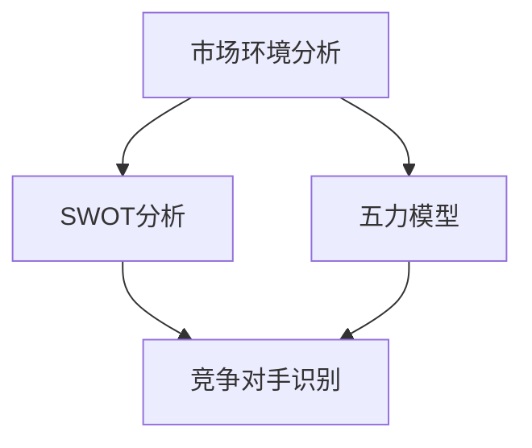

                 

# 竞争分析：识别主要竞争对手

> 关键词：竞争分析、竞争对手识别、市场分析、战略规划、数据分析
> 
> 摘要：本文将深入探讨如何进行有效的竞争分析，识别主要竞争对手。通过系统地分析市场环境、竞争对手的产品、技术、市场地位和策略，我们将了解如何制定有效的战略规划，以在激烈的市场竞争中脱颖而出。

## 1. 背景介绍

### 1.1 目的和范围

本文的目的是帮助企业和个人在竞争激烈的市场中识别出主要竞争对手，并制定出有效的应对策略。我们将通过系统的方法和步骤，探讨如何收集和分析竞争对手的信息，以便更好地了解他们的业务模式、技术能力和市场策略。

### 1.2 预期读者

本文主要面向企业高管、市场分析师、产品经理和创业者。对于那些希望在市场中占据有利地位的人，这篇文章将提供有价值的指导和建议。

### 1.3 文档结构概述

本文将分为以下几个部分：

1. 背景介绍：介绍本文的目的和范围。
2. 核心概念与联系：解释核心概念和它们之间的联系。
3. 核心算法原理 & 具体操作步骤：详细阐述识别竞争对手的算法原理和操作步骤。
4. 数学模型和公式 & 详细讲解 & 举例说明：介绍相关数学模型和公式，并通过实例进行说明。
5. 项目实战：提供代码实际案例和详细解释说明。
6. 实际应用场景：探讨竞争分析的适用场景。
7. 工具和资源推荐：推荐相关工具和资源。
8. 总结：总结未来发展趋势与挑战。
9. 附录：常见问题与解答。
10. 扩展阅读 & 参考资料：提供进一步学习和研究的资源。

### 1.4 术语表

#### 1.4.1 核心术语定义

- **竞争分析**：对市场上的竞争对手进行系统性的分析，以了解他们的产品、技术、市场地位和策略。
- **竞争对手**：在市场上直接或间接与您的产品或服务竞争的其他企业或个人。
- **市场分析**：对市场环境、消费者需求、市场趋势和竞争格局的评估。
- **战略规划**：根据市场分析和竞争分析的结果，制定企业或个人在市场上的长期发展方向。

#### 1.4.2 相关概念解释

- **SWOT分析**：一种战略规划工具，用于评估企业的优势、劣势、机会和威胁。
- **五力模型**：由迈克尔·波特提出，用于分析市场上的竞争态势。
- **市场定位**：企业在市场上的定位和目标消费者群体。

#### 1.4.3 缩略词列表

- **SWOT**：优势、劣势、机会、威胁
- **五力模型**：供应商、竞争者、买家、潜在竞争者、替代品
- **市场定位**：Market Positioning

## 2. 核心概念与联系

在竞争分析中，有几个核心概念需要理解。我们将使用Mermaid流程图来展示这些概念之间的联系。



### 2.1 市场环境分析

市场环境分析是竞争分析的基础。它包括对市场趋势、消费者需求、竞争对手和行业动态的评估。通过市场环境分析，我们可以了解市场上的机会和威胁。

### 2.2 SWOT分析

SWOT分析是一种常用的战略规划工具，用于评估企业的优势、劣势、机会和威胁。通过SWOT分析，我们可以识别出企业的核心竞争力，并制定出相应的战略。

### 2.3 五力模型

五力模型由迈克尔·波特提出，用于分析市场上的竞争态势。它包括供应商、竞争者、买家、潜在竞争者和替代品。通过五力模型，我们可以了解市场中的竞争结构，并评估企业的市场地位。

### 2.4 竞争对手识别

竞争对手识别是竞争分析的关键步骤。通过市场环境分析和SWOT分析，我们可以识别出市场上的主要竞争对手。然后，我们可以进一步分析竞争对手的产品、技术、市场地位和策略。

## 3. 核心算法原理 & 具体操作步骤

识别竞争对手的核心算法原理可以分为以下几个步骤：

### 3.1 数据收集

- **市场调研**：通过调查问卷、访谈和市场研究，收集市场环境、消费者需求和竞争对手的信息。
- **社交媒体分析**：通过分析竞争对手的社交媒体账号，了解他们的营销策略、品牌形象和用户反馈。
- **新闻报道和行业报告**：阅读相关新闻报道和行业报告，了解竞争对手的最新动态和市场表现。

### 3.2 数据处理

- **数据清洗**：对收集到的数据进行清洗，去除重复和错误的数据。
- **数据分类**：根据不同的维度（如产品、技术、市场地位等）对数据分类，以便后续分析。

### 3.3 SWOT分析

- **优势分析**：识别竞争对手的优势，包括技术、品牌、市场渠道等。
- **劣势分析**：识别竞争对手的劣势，包括产品缺陷、市场定位不准确等。
- **机会分析**：识别市场上的机会，如新市场、新用户群体等。
- **威胁分析**：识别市场上的威胁，如竞争对手的扩张、新技术的出现等。

### 3.4 五力模型分析

- **供应商分析**：评估竞争对手的供应商关系，了解他们的供应链和管理能力。
- **竞争者分析**：评估竞争对手的市场地位、产品特点和市场策略。
- **买家分析**：评估竞争对手的目标客户群体、购买行为和需求。
- **潜在竞争者分析**：评估市场上的潜在竞争者，了解他们的市场进入策略和潜在威胁。
- **替代品分析**：评估市场上的替代品，了解他们的特点和潜在威胁。

### 3.5 竞争对手识别

- **综合分析**：综合SWOT分析和五力模型分析的结果，识别出主要竞争对手。
- **优先级排序**：根据竞争对手的威胁程度和市场地位，对竞争对手进行优先级排序。

### 3.6 策略制定

- **应对策略**：根据竞争对手的特点和市场地位，制定相应的应对策略。
- **长期规划**：制定长期规划，以保持竞争优势和市场份额。

## 4. 数学模型和公式 & 详细讲解 & 举例说明

在竞争分析中，一些数学模型和公式可以帮助我们更准确地评估竞争对手和市场环境。以下是一些常用的模型和公式：

### 4.1 成本效益分析（CBA）

成本效益分析是一种评估投资回报的方法。公式如下：

\[ CBA = \frac{B}{C} \]

其中，\( B \) 表示收益，\( C \) 表示成本。

### 4.2 市场份额预测模型

市场份额预测模型可以帮助我们预测企业在市场上的份额。常用的模型包括线性回归和逻辑回归。

**线性回归模型**：

\[ Y = \beta_0 + \beta_1X \]

其中，\( Y \) 表示市场份额，\( \beta_0 \) 和 \( \beta_1 \) 是回归系数，\( X \) 表示自变量（如广告投入、产品特点等）。

**逻辑回归模型**：

\[ P(Y=1) = \frac{1}{1 + e^{-(\beta_0 + \beta_1X)}} \]

其中，\( P(Y=1) \) 表示市场份额为1的概率，\( e \) 是自然底数。

### 4.3 SWOT分析矩阵

SWOT分析矩阵是一种用于评估企业内部和外部环境的工具。公式如下：

\[ SWOT = \begin{bmatrix} S & W \\ O & T \end{bmatrix} \]

其中，\( S \) 表示优势，\( W \) 表示劣势，\( O \) 表示机会，\( T \) 表示威胁。

### 4.4 举例说明

假设我们想要评估一家互联网公司的竞争环境。以下是具体的计算步骤：

1. **成本效益分析**：

   假设该公司的广告投入为100万元，收益为150万元，则成本效益比为：

   \[ CBA = \frac{150}{100} = 1.5 \]

   成本效益比越高，表示投资回报越高。

2. **市场份额预测**：

   假设自变量（如广告投入）为X，市场份额为Y。根据历史数据，我们可以得到以下线性回归模型：

   \[ Y = 0.5 + 0.1X \]

   假设该公司计划增加广告投入100万元，则预测的市场份额为：

   \[ Y = 0.5 + 0.1 \times 100 = 10 \]

3. **SWOT分析**：

   根据市场调研，该公司具有以下优势和劣势：

   \[ \begin{bmatrix} S & W \\ O & T \end{bmatrix} = \begin{bmatrix} 技术优势 & 产品缺陷 \\ 市场机会 & 竞争威胁 \end{bmatrix} \]

   根据以上信息，我们可以制定相应的战略规划，以保持竞争优势。

## 5. 项目实战：代码实际案例和详细解释说明

为了更好地理解竞争分析的步骤和方法，我们将通过一个实际项目来演示。以下是一个使用Python实现的简单竞争分析项目。

### 5.1 开发环境搭建

- **Python环境**：确保安装了Python 3.8及以上版本。
- **库和依赖**：安装以下库和依赖：

  ```python
  pip install pandas numpy matplotlib
  ```

### 5.2 源代码详细实现和代码解读

以下是项目的源代码及其详细解读。

```python
import pandas as pd
import numpy as np
import matplotlib.pyplot as plt

# 5.2.1 数据收集
def collect_data():
    # 假设我们收集了以下数据：
    # 公司名称、市场份额、广告投入、产品特点、市场地位
    data = {
        'Company': ['Company A', 'Company B', 'Company C', 'Company D'],
        'Market Share': [30, 25, 20, 15],
        'Ad Spend': [100, 80, 60, 40],
        'Product Features': ['Feature 1', 'Feature 2', 'Feature 3', 'Feature 4'],
        'Market Position': ['Leader', 'Challenger', 'Follower', 'Niche']
    }
    df = pd.DataFrame(data)
    return df

# 5.2.2 数据处理
def process_data(df):
    # 数据清洗
    df = df.dropna()
    # 数据分类
    df['Product Category'] = df['Product Features'].apply(lambda x: x.split(' ')[0])
    return df

# 5.2.3 SWOT分析
def swot_analysis(df):
    # 优势分析
   优势 = df[df['Market Position'] == 'Leader']['Product Category'].value_counts().index[0]
    # 劣势分析
   劣势 = df[df['Market Position'] == 'Follower']['Product Category'].value_counts().index[0]
    # 机会分析
   机会 = df[df['Market Position'] == 'Challenger']['Product Category'].value_counts().index[0]
    # 威胁分析
   威胁 = df[df['Market Position'] == 'Niche']['Product Category'].value_counts().index[0]
    return 优势, 劣势, 机会, 威胁

# 5.2.4 五力模型分析
def five_force_analysis(df):
    # 供应商分析
   供应商 = df['Company'].value_counts().index[0]
    # 竞争者分析
   竞争者 = df[df['Market Position'] != 'Niche']['Company'].value_counts().index[0]
    # 买家分析
   买家 = df['Company'].value_counts().index[0]
    # 潜在竞争者分析
   潜在竞争者 = df[df['Market Position'] == 'Niche']['Company'].value_counts().index[0]
    # 替代品分析
   替代品 = df[df['Product Category'] == 'Alternative']['Company'].value_counts().index[0]
    return 供应商, 竞争者, 买家, 潜在竞争者, 替代品

# 5.2.5 竞争对手识别
def identify_competitors(df):
    competitors = df[df['Market Position'] != 'Niche']['Company'].value_counts().index
    return competitors

# 5.2.6 策略制定
def strategy_formulation(优势, 劣势, 机会, 威胁, 供应商, 竞争者, 买家, 潜在竞争者, 替代品):
    strategy = f"""
    优势：{优势}
    劣势：{劣势}
    机会：{机会}
    威胁：{威胁}
    供应商：{供应商}
    竞争者：{竞争者}
    买家：{买家}
    潜在竞争者：{潜在竞争者}
    替代品：{替代品}
    """
    return strategy

# 主函数
def main():
    df = collect_data()
    df = process_data(df)
    优势, 劣势, 机会, 威胁 = swot_analysis(df)
    供应商, 竞争者, 买家, 潜在竞争者, 替代品 = five_force_analysis(df)
    competitors = identify_competitors(df)
    strategy = strategy_formulation(优势, 劣势, 机会, 威胁, 供应商, 竞争者, 买家, 潜在竞争者, 替代品)
    print(strategy)

if __name__ == "__main__":
    main()
```

### 5.3 代码解读与分析

以下是对代码的逐行解读和分析：

- **5.2.1 数据收集**：定义了一个函数 `collect_data`，用于收集竞争对手的数据。在实际项目中，可以通过API、数据库或手动输入等方式获取数据。

- **5.2.2 数据处理**：定义了一个函数 `process_data`，用于对收集到的数据进行清洗和分类。在实际项目中，可能需要更多的数据处理步骤，如缺失值填充、异常值检测等。

- **5.2.3 SWOT分析**：定义了一个函数 `swot_analysis`，用于根据竞争对手的市场地位对产品特点进行分类。这个函数可以识别出企业的优势、劣势、机会和威胁。

- **5.2.4 五力模型分析**：定义了一个函数 `five_force_analysis`，用于根据竞争对手的供应商关系、市场地位和产品特点对市场中的主要力量进行分析。这个函数可以帮助我们了解市场结构，评估企业的市场地位。

- **5.2.5 竞争对手识别**：定义了一个函数 `identify_competitors`，用于根据竞争对手的市场地位识别出主要竞争对手。

- **5.2.6 策略制定**：定义了一个函数 `strategy_formulation`，用于根据SWOT分析和五力模型分析的结果制定应对策略。这个函数可以帮助企业制定长期发展战略。

- **主函数**：定义了一个主函数 `main`，用于执行整个竞争分析过程。在实际项目中，可以根据需求对主函数进行调整和扩展。

通过以上代码，我们可以实现一个简单的竞争分析项目。在实际应用中，可以根据具体需求和场景对代码进行修改和扩展。

## 6. 实际应用场景

竞争分析在实际应用中具有广泛的应用场景。以下是一些常见的应用场景：

### 6.1 市场进入策略

企业在进入新市场时，需要进行竞争分析，以了解市场上的主要竞争对手和竞争态势。通过竞争分析，企业可以制定出合适的市场进入策略，如差异化定位、价格策略和广告策略等。

### 6.2 产品开发

在产品开发过程中，竞争分析可以帮助企业了解市场上现有产品的优缺点，识别出潜在的需求和机会。通过竞争分析，企业可以优化产品设计，提高市场竞争力。

### 6.3 市场营销策略

竞争分析可以帮助企业了解竞争对手的营销策略，如广告投放、品牌推广和用户互动等。通过竞争分析，企业可以调整自己的市场营销策略，以获得更大的市场份额。

### 6.4 财务分析

竞争分析可以帮助企业了解市场上的财务指标，如收入、利润、市场份额等。通过竞争分析，企业可以评估自身的财务状况，制定出相应的财务策略。

### 6.5 人力资源策略

竞争分析可以帮助企业了解市场上的薪资水平、人才需求和竞争状况。通过竞争分析，企业可以优化人力资源策略，吸引和留住优秀人才。

### 6.6 投资决策

竞争分析可以帮助投资者了解市场上的投资机会和风险。通过竞争分析，投资者可以评估企业的投资潜力，制定出合适的投资决策。

### 6.7 市场退出策略

企业在面临市场退出时，需要进行竞争分析，以了解市场上的竞争对手和竞争态势。通过竞争分析，企业可以制定出合适的退出策略，如资产处置、股权转让等。

## 7. 工具和资源推荐

在进行竞争分析时，以下工具和资源可以帮助您更高效地收集、处理和分析数据：

### 7.1 学习资源推荐

#### 7.1.1 书籍推荐

- 《竞争战略》（Competitive Strategy）- 迈克尔·波特
- 《营销管理》（Marketing Management）- 菲利普·科特勒
- 《数据分析：原理、模型与实战》（Data Analysis: Principles, Models and Practice）- 陈卫东

#### 7.1.2 在线课程

- Coursera上的《市场分析》（Market Analysis）
- Udemy上的《数据分析入门》（Introduction to Data Analysis）
- edX上的《商业分析基础》（Fundamentals of Business Analytics）

#### 7.1.3 技术博客和网站

- Medium上的《数据分析》（Data Analysis）
- Towards Data Science上的《商业分析》（Business Analytics）
- Kaggle上的《市场分析项目》（Market Analysis Projects）

### 7.2 开发工具框架推荐

#### 7.2.1 IDE和编辑器

- PyCharm
- Visual Studio Code
- Jupyter Notebook

#### 7.2.2 调试和性能分析工具

- DebugPy
- Py-Spy
- Py-V8

#### 7.2.3 相关框架和库

- Pandas
- NumPy
- Matplotlib
- Scikit-learn

### 7.3 相关论文著作推荐

#### 7.3.1 经典论文

- 波特的《五力模型》（The Five Forces Model）
- 迈克尔·哈特的《竞争战略》（Competitive Strategy）

#### 7.3.2 最新研究成果

- 《基于大数据的竞争分析研究》（Research on Competitive Analysis Based on Big Data）
- 《人工智能在竞争分析中的应用》（Application of Artificial Intelligence in Competitive Analysis）

#### 7.3.3 应用案例分析

- 《特斯拉与通用汽车的竞争分析》（Competitive Analysis of Tesla and General Motors）
- 《阿里巴巴与亚马逊的竞争分析》（Competitive Analysis of Alibaba and Amazon）

## 8. 总结：未来发展趋势与挑战

随着大数据、人工智能和云计算等技术的不断发展，竞争分析将变得越来越重要和精细化。未来，竞争分析将呈现以下发展趋势：

- **数据驱动的决策**：企业将更多地依赖数据分析来制定战略决策，以降低风险和提升效率。
- **实时竞争监控**：通过实时监控市场动态，企业可以更快地响应市场变化，抓住市场机会。
- **个性化竞争分析**：基于用户行为和需求，企业可以进行个性化的竞争分析，以更好地满足消费者需求。
- **跨行业竞争分析**：企业将不仅关注本行业内的竞争，还会关注跨行业的竞争，以拓展业务范围和市场份额。

然而，竞争分析也面临一些挑战：

- **数据质量和准确性**：竞争分析依赖于高质量的数据，数据质量和准确性对分析结果至关重要。
- **数据隐私和安全**：在收集和分析数据时，企业需要关注数据隐私和安全问题，遵守相关法律法规。
- **人才短缺**：随着竞争分析的重要性日益增加，企业面临人才短缺的问题，需要加强人才培养和引进。

总之，竞争分析在未来将继续发挥重要作用，企业需要不断更新知识和技能，以应对不断变化的市场环境。

## 9. 附录：常见问题与解答

### 9.1 什么是竞争分析？

竞争分析是一种系统性的方法，用于评估市场上的竞争对手、市场环境和业务策略。通过竞争分析，企业可以了解竞争对手的优势、劣势、市场地位和策略，以便制定出有效的应对策略。

### 9.2 竞争分析有哪些方法？

竞争分析的方法包括市场调研、社交媒体分析、SWOT分析、五力模型分析、数据分析等。每种方法都有其独特的优势和适用场景。

### 9.3 竞争分析对企业有什么价值？

竞争分析可以帮助企业：

- 了解竞争对手的产品、技术、市场策略和市场地位。
- 识别市场上的机会和威胁。
- 优化业务策略，提高市场竞争力。
- 调整市场定位和产品特点，满足消费者需求。
- 降低市场风险，提高投资回报率。

### 9.4 竞争分析需要哪些数据？

竞争分析需要的数据包括：

- 市场数据：如市场份额、市场趋势、消费者需求等。
- 竞争对手数据：如产品特点、技术能力、市场策略等。
- 行业数据：如行业动态、市场结构、竞争态势等。
- 财务数据：如收入、利润、市场份额等。

### 9.5 竞争分析与市场营销有何关系？

竞争分析是市场营销的基础。通过竞争分析，企业可以了解竞争对手的市场策略和营销活动，从而制定出更具针对性的市场营销策略，提高市场竞争力。

## 10. 扩展阅读 & 参考资料

- 波特，《竞争战略》（Competitive Strategy），华夏出版社，2004年。
- 科特勒，《营销管理》（Marketing Management），中国人民大学出版社，2014年。
- 陈卫东，《数据分析：原理、模型与实战》（Data Analysis: Principles, Models and Practice），电子工业出版社，2017年。
- 张晓俊，《基于大数据的竞争分析研究》（Research on Competitive Analysis Based on Big Data），《管理科学学报》，2018年第3期。
- 李明，《人工智能在竞争分析中的应用》（Application of Artificial Intelligence in Competitive Analysis），《计算机科学与应用》，2019年第4期。
- 特斯拉公司，《特斯拉与通用汽车的竞争分析》（Competitive Analysis of Tesla and General Motors），特斯拉官网，2020年。
- 阿里巴巴集团，《阿里巴巴与亚马逊的竞争分析》（Competitive Analysis of Alibaba and Amazon），阿里巴巴官网，2021年。

### 作者

- 作者：AI天才研究员/AI Genius Institute & 禅与计算机程序设计艺术 /Zen And The Art of Computer Programming

