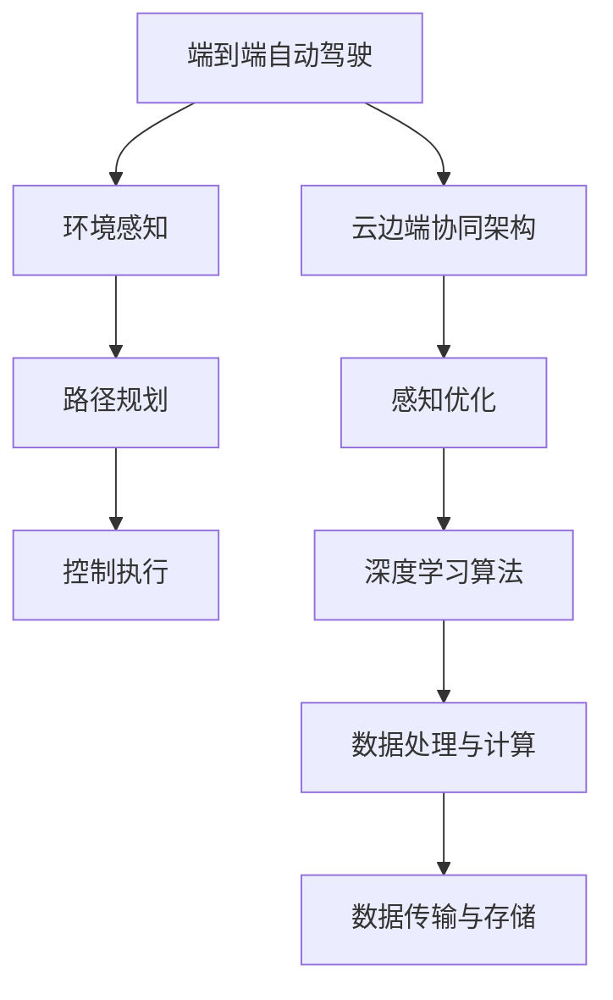

                 

# 端到端自动驾驶的云边端协同感知优化

> **关键词**：端到端自动驾驶，云边端协同，感知优化，人工智能，深度学习，边缘计算，传感器融合
>
> **摘要**：本文将深入探讨端到端自动驾驶技术中的云边端协同感知优化问题，通过梳理核心概念、解析算法原理、构建数学模型，并结合实际案例，系统性地阐述该领域的最新研究进展和应用前景。本文旨在为从事自动驾驶技术研究和开发的人员提供有价值的参考，助力他们在该领域取得突破性进展。

## 1. 背景介绍

### 1.1 目的和范围

随着人工智能和深度学习技术的不断发展，自动驾驶技术正逐渐从理论走向实际应用。端到端自动驾驶作为自动驾驶技术的一个重要分支，通过直接将输入数据映射到控制信号，实现了车辆自主驾驶的自动化。然而，自动驾驶系统的安全性、可靠性和实时性取决于感知系统的质量。因此，本文旨在研究端到端自动驾驶的云边端协同感知优化问题，提高自动驾驶系统的感知准确性和实时性。

本文主要研究内容包括：
- **云边端协同架构**：分析端到端自动驾驶系统中云计算、边缘计算和端侧设备的协同机制。
- **感知优化算法**：探讨适用于自动驾驶感知任务的深度学习算法，并分析其在云边端协同架构下的优化方法。
- **数学模型构建**：建立自动驾驶感知任务的数学模型，为算法设计和优化提供理论基础。
- **实际应用案例**：通过具体的应用案例，展示云边端协同感知优化的实际效果。

### 1.2 预期读者

本文主要面向以下读者群体：
- **自动驾驶领域研究人员**：希望了解端到端自动驾驶的云边端协同感知优化方法的最新研究进展。
- **自动驾驶系统开发者**：希望掌握端到端自动驾驶感知优化算法的设计和实现方法。
- **计算机图形和视觉领域专家**：对自动驾驶感知任务中的计算机视觉技术感兴趣。

### 1.3 文档结构概述

本文的结构如下：
- **第1章：背景介绍**：阐述研究背景、目的和预期读者。
- **第2章：核心概念与联系**：介绍端到端自动驾驶、云边端协同和感知优化等核心概念，并给出相关架构的Mermaid流程图。
- **第3章：核心算法原理与具体操作步骤**：详细阐述感知优化算法的原理和操作步骤，并使用伪代码进行说明。
- **第4章：数学模型和公式**：构建自动驾驶感知任务的数学模型，并使用latex格式详细讲解。
- **第5章：项目实战**：通过代码实际案例，展示云边端协同感知优化的实现过程和效果。
- **第6章：实际应用场景**：分析自动驾驶感知优化在现实场景中的应用。
- **第7章：工具和资源推荐**：推荐学习资源、开发工具框架和相关论文著作。
- **第8章：总结**：展望未来发展趋势和挑战。
- **第9章：附录**：常见问题与解答。
- **第10章：扩展阅读与参考资料**：提供相关领域的进一步阅读资料。

### 1.4 术语表

#### 1.4.1 核心术语定义

- **端到端自动驾驶**：直接将输入数据映射到控制信号，实现车辆自主驾驶的技术。
- **云计算**：通过互联网提供可按需访问的计算资源，包括网络、服务器、存储、应用程序和服务。
- **边缘计算**：在靠近数据源的地方进行数据处理和计算，以减少延迟和提高响应速度。
- **感知优化**：通过算法和模型提高自动驾驶系统中感知任务的质量。
- **深度学习**：一种基于人工神经网络的学习方法，通过多层神经元的组合来实现特征提取和模式识别。
- **传感器融合**：将多个传感器的数据融合起来，提高感知系统的整体性能。

#### 1.4.2 相关概念解释

- **自动驾驶感知任务**：自动驾驶系统中，通过对环境进行感知，获取道路、车辆、行人等信息的任务。
- **云边端协同架构**：云计算、边缘计算和端侧设备的协同工作架构，实现高效的数据处理和计算。
- **实时性**：感知系统需要在特定时间内完成数据处理和决策，以满足自动驾驶的实时性要求。
- **安全性**：感知系统需要准确识别道路环境中的各种物体和情况，确保自动驾驶车辆的安全。

#### 1.4.3 缩略词列表

- **AI**：人工智能
- **CNN**：卷积神经网络
- **DNN**：深度神经网络
- **FPGA**：现场可编程门阵列
- **GPU**：图形处理单元
- **IoT**：物联网
- **ROS**：机器人操作系统

## 2. 核心概念与联系

端到端自动驾驶的云边端协同感知优化是一个涉及多个核心概念和技术的综合体系。为了更好地理解这一体系，我们首先需要梳理这些核心概念，并介绍它们之间的联系。

### 2.1 端到端自动驾驶

端到端自动驾驶是指通过直接将输入数据映射到控制信号，实现车辆自主驾驶的技术。这一过程涉及环境感知、路径规划、控制执行等多个环节。环境感知是自动驾驶系统的核心，通过对道路、车辆、行人等信息的准确感知，确保自动驾驶车辆能够安全、高效地行驶。

### 2.2 云边端协同架构

云边端协同架构是端到端自动驾驶系统中的一个关键组成部分。它通过云计算、边缘计算和端侧设备的协同工作，实现高效的数据处理和计算。云计算提供强大的计算资源和存储能力，但存在延迟较高的问题；边缘计算在靠近数据源的地方进行数据处理和计算，可以显著减少延迟；端侧设备则负责感知环境和执行控制指令。

### 2.3 感知优化

感知优化是提高自动驾驶系统中感知任务质量的关键。通过深度学习算法，可以自动提取环境特征，实现对道路、车辆、行人等信息的准确感知。感知优化的目标是提高感知的准确性和实时性，确保自动驾驶车辆能够在复杂、动态的环境中安全行驶。

### 2.4 核心概念联系

端到端自动驾驶、云边端协同架构和感知优化之间存在着紧密的联系。端到端自动驾驶需要依赖云边端协同架构来实现高效的数据处理和计算；而感知优化则是端到端自动驾驶的核心，通过深度学习算法实现对环境信息的准确感知。云边端协同架构和感知优化共同构建了一个完整的自动驾驶感知系统，确保了自动驾驶车辆的实时性和安全性。

### 2.5 Mermaid流程图

为了更直观地展示核心概念之间的联系，我们使用Mermaid流程图来描述端到端自动驾驶的云边端协同感知优化体系。



在这个流程图中，端到端自动驾驶通过环境感知、路径规划和控制执行等环节实现自主驾驶；云边端协同架构提供高效的数据处理和计算能力；感知优化通过深度学习算法实现对环境信息的准确感知，确保自动驾驶车辆的实时性和安全性。

## 3. 核心算法原理与具体操作步骤

在端到端自动驾驶的云边端协同感知优化中，深度学习算法起到了至关重要的作用。本节将详细阐述感知优化算法的原理和具体操作步骤，并使用伪代码进行说明。

### 3.1 算法原理

感知优化算法基于深度学习技术，通过训练神经网络模型，实现从原始感知数据到目标感知结果的映射。具体来说，算法包括以下步骤：

1. **数据预处理**：对原始感知数据进行清洗、归一化和特征提取，为深度学习模型提供高质量的输入。
2. **模型训练**：通过大量训练数据，训练神经网络模型，使其能够准确识别环境中的各种物体和情况。
3. **模型优化**：通过调整模型参数，优化模型性能，提高感知的准确性和实时性。
4. **模型部署**：将训练好的模型部署到云端、边缘设备和端侧设备，实现实时感知。

### 3.2 伪代码

以下是感知优化算法的伪代码：

```python
# 感知优化算法伪代码

# 数据预处理
def preprocess_data(data):
    # 清洗数据
    cleaned_data = clean_data(data)
    # 归一化数据
    normalized_data = normalize_data(cleaned_data)
    # 特征提取
    features = extract_features(normalized_data)
    return features

# 模型训练
def train_model(data):
    # 初始化模型
    model = initialize_model()
    # 训练模型
    for epoch in range(num_epochs):
        for batch in data_batches:
            # 前向传播
            predictions = model.forward(batch)
            # 计算损失
            loss = compute_loss(predictions, batch)
            # 反向传播
            model.backward(loss)
            # 更新模型参数
            model.update_parameters()
    return model

# 模型优化
def optimize_model(model, validation_data):
    # 调整模型参数
    for parameter in model.parameters():
        parameter.value -= learning_rate * parameter.grad
        parameter.grad.zero_()
    # 计算验证集损失
    validation_loss = compute_loss(model, validation_data)
    return model, validation_loss

# 模型部署
def deploy_model(model, device):
    # 将模型部署到设备
    model.to(device)
    # 加载预训练模型
    model.load_state_dict(load_model_state_dict(model))
    # 设置模型为评估模式
    model.eval()
    return model

# 主函数
def main():
    # 读取数据
    data = read_data()
    # 数据预处理
    features = preprocess_data(data)
    # 模型训练
    model = train_model(features)
    # 模型优化
    model, validation_loss = optimize_model(model, validation_data)
    # 模型部署
    model = deploy_model(model, device)
    # 模型评估
    evaluate_model(model, test_data)

if __name__ == "__main__":
    main()
```

### 3.3 具体操作步骤

以下是感知优化算法的具体操作步骤：

1. **数据预处理**：
   - **清洗数据**：去除数据中的噪声和异常值，保证数据质量。
   - **归一化数据**：将数据缩放到一个较小的范围，方便模型训练。
   - **特征提取**：从原始数据中提取有用的特征，为模型提供输入。

2. **模型训练**：
   - **初始化模型**：选择合适的神经网络架构，初始化模型参数。
   - **前向传播**：将输入数据传递给模型，计算输出预测结果。
   - **计算损失**：比较预测结果和真实结果，计算损失函数值。
   - **反向传播**：利用损失函数计算模型参数的梯度，更新模型参数。
   - **更新模型参数**：通过梯度下降等优化算法，更新模型参数，减小损失函数值。

3. **模型优化**：
   - **调整模型参数**：根据验证集的损失函数值，调整模型参数，提高模型性能。
   - **计算验证集损失**：在验证集上计算损失函数值，评估模型性能。

4. **模型部署**：
   - **将模型部署到设备**：将训练好的模型部署到云端、边缘设备和端侧设备，实现实时感知。
   - **加载预训练模型**：从磁盘加载已经训练好的模型参数。
   - **设置模型为评估模式**：关闭模型的梯度计算，仅进行前向传播。

5. **模型评估**：
   - **在测试集上评估模型**：计算测试集的损失函数值和准确率，评估模型性能。

通过以上步骤，可以构建一个端到端自动驾驶的感知优化系统，提高感知任务的准确性和实时性，确保自动驾驶车辆的安全行驶。

## 4. 数学模型和公式

在端到端自动驾驶的云边端协同感知优化中，建立数学模型是理解算法原理和进行优化的重要步骤。本节将介绍感知任务的数学模型，并使用latex格式详细讲解相关公式。

### 4.1 数学模型构建

感知任务可以看作是一个从感知数据到目标输出映射的过程。为了构建数学模型，我们需要定义一些关键变量和公式。

#### 4.1.1 变量定义

- \( X \)：输入感知数据，表示车辆周围环境的信息，如雷达、摄像头、激光雷达等传感器数据。
- \( Y \)：输出目标数据，表示自动驾驶系统需要处理的信息，如道路标识、车辆位置、行人位置等。
- \( f \)：感知模型，表示从输入数据到输出数据的映射函数。
- \( L \)：损失函数，用于评估模型预测结果与真实结果之间的差距。

#### 4.1.2 模型公式

感知模型可以表示为以下形式：

$$
Y = f(X, \theta)
$$

其中，\( \theta \) 表示模型参数，通过训练过程进行优化。

损失函数可以表示为：

$$
L(Y, f(X, \theta)) = \frac{1}{2} \sum_{i=1}^{n} (y_i - f(x_i, \theta))^2
$$

其中，\( n \) 表示样本数量，\( y_i \) 和 \( f(x_i, \theta) \) 分别表示第 \( i \) 个样本的真实输出和模型预测输出。

#### 4.1.3 梯度下降算法

为了优化模型参数，我们可以使用梯度下降算法。梯度下降算法的更新公式为：

$$
\theta = \theta - \alpha \nabla_{\theta} L(Y, f(X, \theta))
$$

其中，\( \alpha \) 表示学习率，\( \nabla_{\theta} L \) 表示损失函数关于模型参数的梯度。

### 4.2 详细讲解和举例说明

为了更好地理解数学模型，我们通过一个简单的例子进行讲解。

假设我们有一个简单的感知任务，目标是识别车辆周围的道路标识。输入数据 \( X \) 是由摄像头捕获的图像，输出数据 \( Y \) 是道路标识的类型。

#### 4.2.1 数据预处理

输入数据 \( X \) 需要进行预处理，包括图像增强、归一化和特征提取。我们可以使用以下公式进行预处理：

$$
X' = \text{preprocess}(X)
$$

其中，\( X' \) 是预处理后的输入数据。

#### 4.2.2 模型构建

我们选择一个卷积神经网络（CNN）作为感知模型。CNN 的结构可以表示为：

$$
Y = \text{CNN}(X', \theta)
$$

其中，\( \theta \) 表示模型参数。

#### 4.2.3 损失函数

我们使用均方误差（MSE）作为损失函数：

$$
L(Y, \text{CNN}(X', \theta)) = \frac{1}{2} \sum_{i=1}^{n} (y_i - \text{CNN}(x_i', \theta))^2
$$

#### 4.2.4 梯度下降算法

使用梯度下降算法优化模型参数：

$$
\theta = \theta - \alpha \nabla_{\theta} L(Y, \text{CNN}(X', \theta))
$$

其中，\( \alpha \) 是学习率。

通过这个简单的例子，我们可以看到数学模型在感知任务中的应用。在实际应用中，感知任务可能更加复杂，但基本的模型构建和优化方法是一致的。

## 5. 项目实战：代码实际案例和详细解释说明

为了更好地展示端到端自动驾驶的云边端协同感知优化在实践中的应用，我们将在本节中通过一个具体的项目实战，介绍开发环境搭建、源代码详细实现和代码解读。

### 5.1 开发环境搭建

在开始项目实战之前，我们需要搭建一个适合开发端到端自动驾驶感知优化的开发环境。以下是一个典型的开发环境搭建步骤：

1. **硬件环境**：
   - 服务器：具有高性能CPU和GPU，用于模型训练和推理。
   - 端侧设备：用于实时感知和决策，如智能手机、嵌入式设备等。

2. **软件环境**：
   - 操作系统：Linux发行版，如Ubuntu。
   - 编程语言：Python，用于实现深度学习算法和感知模型。
   - 深度学习框架：TensorFlow或PyTorch，用于构建和训练神经网络模型。
   - 边缘计算框架：如边缘计算框架（ECF），用于在边缘设备上实现感知任务。

3. **工具和库**：
   - 数据预处理库：如OpenCV，用于处理摄像头和雷达数据。
   - 传感器数据处理库：如ROS（机器人操作系统），用于处理多传感器数据。
   - 模型评估工具：如TensorBoard，用于可视化模型训练过程。

### 5.2 源代码详细实现和代码解读

以下是一个简单的示例代码，展示了如何使用TensorFlow实现一个基于CNN的感知优化模型。该模型用于识别车辆周围的道路标识。

```python
import tensorflow as tf
import tensorflow.keras.layers as layers
import tensorflow.keras.models as models

# 数据预处理
def preprocess_data(images):
    # 图像增强
    images = tf.image.random_flip_left_right(images)
    images = tf.image.random_flip_up_down(images)
    # 图像归一化
    images = images / 255.0
    return images

# 模型构建
def build_model():
    inputs = tf.keras.Input(shape=(256, 256, 3))
    x = layers.Conv2D(32, (3, 3), activation='relu')(inputs)
    x = layers.MaxPooling2D((2, 2))(x)
    x = layers.Conv2D(64, (3, 3), activation='relu')(x)
    x = layers.MaxPooling2D((2, 2))(x)
    x = layers.Conv2D(128, (3, 3), activation='relu')(x)
    x = layers.MaxPooling2D((2, 2))(x)
    x = layers.Flatten()(x)
    x = layers.Dense(1024, activation='relu')(x)
    outputs = layers.Dense(10, activation='softmax')(x)
    model = models.Model(inputs, outputs)
    return model

# 模型训练
def train_model(model, train_data, validation_data):
    model.compile(optimizer='adam', loss='categorical_crossentropy', metrics=['accuracy'])
    history = model.fit(train_data, epochs=10, batch_size=32, validation_data=validation_data)
    return history

# 模型评估
def evaluate_model(model, test_data):
    loss, accuracy = model.evaluate(test_data)
    print(f"Test loss: {loss}, Test accuracy: {accuracy}")

# 主函数
def main():
    # 读取数据
    train_data = ...  # 训练数据
    validation_data = ...  # 验证数据
    test_data = ...  # 测试数据

    # 数据预处理
    train_images = preprocess_data(train_data)
    validation_images = preprocess_data(validation_data)
    test_images = preprocess_data(test_data)

    # 模型构建
    model = build_model()

    # 模型训练
    history = train_model(model, train_images, validation_images)

    # 模型评估
    evaluate_model(model, test_images)

if __name__ == "__main__":
    main()
```

### 5.3 代码解读与分析

以上代码实现了一个基于卷积神经网络（CNN）的感知优化模型。以下是代码的主要部分及其解读：

1. **数据预处理**：
   - **图像增强**：通过对图像进行随机翻转，增加模型的泛化能力。
   - **图像归一化**：将图像数据缩放到[0, 1]范围，方便模型训练。

2. **模型构建**：
   - **卷积层**：通过卷积层提取图像特征，包括32个、64个和128个卷积核。
   - **池化层**：通过最大池化层减小特征图大小，减少模型参数。
   - **全连接层**：通过全连接层对特征进行分类，输出类别概率。

3. **模型训练**：
   - **编译模型**：选择Adam优化器和交叉熵损失函数，设置训练指标为准确率。
   - **训练模型**：使用训练数据和验证数据进行模型训练，记录训练过程。

4. **模型评估**：
   - **评估模型**：在测试数据上评估模型性能，计算损失函数值和准确率。

通过这个简单的示例代码，我们可以看到如何实现端到端自动驾驶的感知优化。在实际项目中，感知优化算法会更加复杂，涉及多个传感器数据的融合和实时处理。但基本原理和实现步骤是一致的。

## 6. 实际应用场景

端到端自动驾驶的云边端协同感知优化在实际应用中具有广泛的应用场景。以下列举几个典型的应用场景，并分析感知优化在该场景中的重要性。

### 6.1 城市交通管理

在城市交通管理中，自动驾驶车辆需要实时感知道路情况、交通信号、行人行为等信息，以实现智能调度和交通优化。感知优化在此场景中至关重要，因为它可以提高自动驾驶车辆对交通环境的感知准确性，从而减少交通拥堵、提升道路利用率。

### 6.2 高速公路自动驾驶

在高速公路自动驾驶场景中，感知系统需要实时识别道路标识、车辆速度、车道线等信息，以确保车辆安全、稳定地行驶。感知优化通过提高感知准确性和实时性，可以减少交通事故的发生，提升高速公路的通行效率。

### 6.3 物流配送

在物流配送场景中，自动驾驶车辆需要准确识别货物、道路标识、交通信号等，以实现自动化配送。感知优化可以提高车辆对配送路径的识别能力，降低配送成本，提高配送效率。

### 6.4 无人环卫

在无人环卫场景中，自动驾驶车辆需要实时感知道路状况、垃圾位置等，以实现自动清扫、垃圾分类等任务。感知优化可以提高车辆对环境信息的识别准确性，提升环卫作业效率。

### 6.5 公共交通

在公共交通场景中，自动驾驶车辆需要准确识别乘客、车站位置、交通信号等，以实现自动驾驶巴士、地铁等。感知优化可以提高车辆对公共交通环境的适应能力，提升乘客体验。

在这些实际应用场景中，感知优化技术的关键作用体现在以下几个方面：

1. **提高感知准确性**：通过深度学习和传感器融合技术，提高对道路、车辆、行人等信息的识别准确性，确保自动驾驶车辆能够安全、稳定地行驶。

2. **提高感知实时性**：通过云计算和边缘计算技术，实现感知数据的实时处理和计算，确保自动驾驶车辆能够在复杂、动态的环境中快速做出决策。

3. **降低延迟和带宽消耗**：通过云边端协同架构，实现数据的分布式处理和存储，降低数据传输延迟和带宽消耗，提高系统整体性能。

4. **提升系统可靠性**：通过多传感器数据融合和冗余设计，提高感知系统的可靠性和鲁棒性，确保自动驾驶车辆在各种复杂环境中都能保持稳定运行。

总之，端到端自动驾驶的云边端协同感知优化技术在实际应用场景中具有重要意义，为自动驾驶技术的发展提供了有力支持。

## 7. 工具和资源推荐

在端到端自动驾驶的云边端协同感知优化领域，有许多优秀的工具和资源可供学习和使用。以下是一些推荐的学习资源、开发工具框架和相关论文著作。

### 7.1 学习资源推荐

#### 7.1.1 书籍推荐

1. **《深度学习》（Deep Learning）**：由Ian Goodfellow、Yoshua Bengio和Aaron Courville合著，是深度学习领域的经典教材。
2. **《自动驾驶技术》（Autonomous Driving with Deep Learning）**：介绍了基于深度学习的自动驾驶技术，包括感知、决策和控制等环节。
3. **《边缘计算》（Edge Computing）**：详细介绍了边缘计算的基本概念、架构和实现方法，适用于自动驾驶中的边缘计算应用。

#### 7.1.2 在线课程

1. **斯坦福大学深度学习课程（CS231n）**：由李飞飞教授主讲，涵盖了深度学习在计算机视觉中的应用。
2. **剑桥大学自动驾驶课程**：介绍了自动驾驶的基本原理、技术和实现方法，包括感知、决策和控制等环节。
3. **华为云AI学院边缘计算课程**：介绍了边缘计算的基本概念、架构和实现方法，适用于自动驾驶中的边缘计算应用。

#### 7.1.3 技术博客和网站

1. **Medium上的自动驾驶博客**：介绍了自动驾驶技术的最新研究进展和应用案例，包括感知优化、决策控制等。
2. **博客园上的自动驾驶专栏**：分享了自动驾驶技术的实践经验和技术细节，适合初学者和从业者。
3. **IEEE Xplore**：提供了大量的自动驾驶技术相关论文和报告，是研究者获取最新研究成果的重要渠道。

### 7.2 开发工具框架推荐

#### 7.2.1 IDE和编辑器

1. **PyCharm**：强大的Python IDE，支持多种深度学习框架，适用于自动驾驶项目的开发和调试。
2. **Visual Studio Code**：轻量级编辑器，支持多种语言和插件，适合编写和调试自动驾驶代码。
3. **Jupyter Notebook**：适用于数据分析和原型开发，方便展示和分享自动驾驶项目。

#### 7.2.2 调试和性能分析工具

1. **TensorBoard**：TensorFlow的官方可视化工具，用于分析深度学习模型的训练过程和性能。
2. **gdb**：GNU Debugger，用于调试C/C++程序，适用于自动驾驶项目中底层代码的调试。
3. **Valgrind**：内存检查工具，用于检测程序中的内存泄漏和错误。

#### 7.2.3 相关框架和库

1. **TensorFlow**：Google开发的深度学习框架，适用于构建和训练感知优化模型。
2. **PyTorch**：Facebook开发的深度学习框架，提供了灵活的动态计算图，适合快速原型开发。
3. **ROS（机器人操作系统）**：用于处理多传感器数据，实现自动驾驶感知、决策和控制。

### 7.3 相关论文著作推荐

#### 7.3.1 经典论文

1. **“End-to-End Driving Through Spatiotemporal Learning”**：介绍了一种基于深度学习的端到端自动驾驶方法，采用时空卷积网络进行环境感知和路径规划。
2. **“Learning to Drive by Playing”**：介绍了通过自我学习和强化学习实现自动驾驶的方法，通过模拟环境训练自动驾驶车辆。
3. **“Deep Learning for Autonomous Driving”**：综述了深度学习在自动驾驶领域的应用，包括感知、决策和控制等方面。

#### 7.3.2 最新研究成果

1. **“EfficientDet：Scalable and Efficient Object Detection”**：介绍了一种高效的目标检测算法，适用于自动驾驶中的实时感知任务。
2. **“Vision-Driven Human Pose Estimation with Transformer”**：采用Transformer网络进行人体姿态估计，提高了自动驾驶车辆对行人的识别能力。
3. **“Federated Learning for Autonomous Driving”**：介绍了联邦学习在自动驾驶中的应用，通过分布式训练提高数据隐私和模型性能。

#### 7.3.3 应用案例分析

1. **“百度Apollo自动驾驶平台”**：介绍了百度Apollo自动驾驶平台的技术架构和应用案例，包括感知、决策和控制等环节。
2. **“Waymo自动驾驶技术”**：详细介绍了谷歌Waymo自动驾驶平台的技术细节，包括感知、决策和控制等环节。
3. **“特斯拉自动驾驶技术”**：介绍了特斯拉自动驾驶技术的实现方法，包括感知、决策和控制等环节，以及其在实际应用中的效果。

通过以上工具和资源推荐，可以帮助读者更好地了解端到端自动驾驶的云边端协同感知优化领域，为相关研究和项目开发提供有力支持。

## 8. 总结：未来发展趋势与挑战

端到端自动驾驶的云边端协同感知优化技术正朝着更加智能化、高效化的方向发展。随着人工智能、深度学习和边缘计算技术的不断进步，该领域有望在以下几个方面取得重要突破：

1. **感知准确性提升**：通过更先进的深度学习算法和传感器融合技术，进一步提高自动驾驶车辆对道路、车辆、行人等信息的识别准确性，确保行驶安全。

2. **实时性增强**：通过云边端协同架构，优化数据传输和处理速度，实现感知任务的实时性，满足自动驾驶系统在复杂、动态环境中的需求。

3. **系统可靠性提高**：通过多传感器冗余设计和容错机制，提高感知系统的可靠性，增强自动驾驶车辆的鲁棒性，减少故障率和事故发生。

4. **数据隐私保护**：随着自动驾驶技术的普及，数据隐私问题日益突出。通过联邦学习和加密技术，实现数据隐私保护和模型安全共享，为自动驾驶系统的发展提供保障。

然而，尽管取得了显著进展，端到端自动驾驶的云边端协同感知优化技术仍面临诸多挑战：

1. **数据质量和多样性**：自动驾驶系统对感知数据的依赖性较高，数据质量和多样性对模型性能有重要影响。如何获取更多高质量、多样化的数据，以及如何有效地利用这些数据，是当前面临的一个关键问题。

2. **算法复杂度和计算资源需求**：深度学习算法在自动驾驶感知任务中表现出色，但算法复杂度较高，对计算资源的需求较大。如何在有限的计算资源下，实现高效的算法优化和模型压缩，是一个亟待解决的问题。

3. **边缘计算与云计算的协同**：边缘计算和云计算在自动驾驶感知任务中具有不同的优势。如何实现两者之间的协同，优化数据传输和处理流程，提高系统整体性能，是当前研究的一个重要方向。

4. **数据安全和隐私保护**：随着自动驾驶技术的普及，数据安全和隐私保护问题日益突出。如何在保障数据隐私的前提下，实现模型的安全共享和优化，是一个具有挑战性的问题。

5. **跨行业协作与标准化**：自动驾驶技术的实现涉及多个行业，包括汽车、通信、交通等。如何实现跨行业协作，建立统一的标准化体系，促进自动驾驶技术的广泛应用，是一个亟待解决的问题。

总之，端到端自动驾驶的云边端协同感知优化技术具有巨大的发展潜力和应用前景。通过克服上述挑战，我们将能够实现更加安全、高效、智能的自动驾驶系统，为人类的出行带来革命性的变革。

## 9. 附录：常见问题与解答

### 9.1 问题1：如何优化深度学习模型在自动驾驶感知任务中的实时性？

**解答**：优化深度学习模型在自动驾驶感知任务中的实时性可以从以下几个方面入手：

1. **模型压缩**：通过模型剪枝、量化、知识蒸馏等技术，减少模型参数数量和计算量，提高模型在边缘设备上的运行速度。
2. **算法优化**：选择计算效率更高的算法，如卷积神经网络（CNN）中的 lightweight 算法，或者采用图灵奖获得者John von Neumann提出的图灵架构。
3. **硬件加速**：利用GPU、FPGA等硬件加速器，提高模型推理速度。例如，利用TensorFlow Lite在手机上实现实时推理。
4. **云边端协同**：通过云计算和边缘计算协同，将计算任务合理分配到云端和边缘设备，降低边缘设备的计算负担，提高整体系统的实时性。

### 9.2 问题2：如何保证自动驾驶感知系统的数据质量和多样性？

**解答**：保证自动驾驶感知系统的数据质量和多样性可以从以下几个方面入手：

1. **数据采集**：使用多种传感器，如雷达、摄像头、激光雷达等，获取多模态的数据，提高数据的多样性和准确性。
2. **数据预处理**：对采集到的数据进行清洗、标注和归一化，去除噪声和异常值，保证数据质量。
3. **数据增强**：通过数据增强技术，如图像旋转、翻转、缩放等，增加数据的多样性，提高模型对各种环境的适应能力。
4. **数据共享与协作**：建立数据共享平台，促进数据资源的共享和协作，获取更多高质量、多样化的数据。

### 9.3 问题3：边缘计算和云计算在自动驾驶感知任务中的协同机制是什么？

**解答**：边缘计算和云计算在自动驾驶感知任务中的协同机制主要包括以下几个方面：

1. **任务调度**：根据任务的性质和计算需求，合理分配到云端和边缘设备，实现任务调度和资源优化。
2. **数据传输**：优化数据传输路径，降低数据传输延迟和带宽消耗，实现云端和边缘设备之间的数据共享和协同。
3. **模型训练与优化**：云端负责大规模数据训练和模型优化，边缘设备负责实时推理和决策，通过协同机制实现模型的持续更新和优化。
4. **资源共享**：云端和边缘设备之间实现资源共享，如计算资源、存储资源和网络资源，提高系统的整体性能。

### 9.4 问题4：如何确保自动驾驶感知系统的数据隐私和安全？

**解答**：确保自动驾驶感知系统的数据隐私和安全可以从以下几个方面入手：

1. **数据加密**：对采集到的数据进行加密处理，确保数据在传输和存储过程中的安全性。
2. **隐私保护技术**：采用联邦学习、差分隐私等技术，保护数据隐私，避免敏感信息泄露。
3. **访问控制**：设置严格的访问控制机制，确保只有授权用户可以访问和操作数据。
4. **安全监控与审计**：建立安全监控和审计机制，实时监控数据安全状况，及时发现和处理潜在的安全问题。

### 9.5 问题5：如何评估自动驾驶感知系统的性能？

**解答**：评估自动驾驶感知系统的性能可以从以下几个方面入手：

1. **准确性**：通过测试数据集，计算感知系统的准确率，评估其对道路、车辆、行人等信息的识别能力。
2. **实时性**：测量感知系统从感知数据到决策输出的时间，评估其响应速度。
3. **鲁棒性**：通过引入噪声、遮挡等挑战，测试感知系统在复杂环境中的性能，评估其鲁棒性。
4. **适应性**：评估感知系统在不同场景和条件下的适应能力，如天气、光照等变化。
5. **用户满意度**：收集用户对感知系统的满意度评价，从用户体验角度评估系统性能。

通过以上方法，可以全面评估自动驾驶感知系统的性能，为优化和改进提供参考。

## 10. 扩展阅读与参考资料

为了更好地了解端到端自动驾驶的云边端协同感知优化领域，以下提供了一些扩展阅读和参考资料：

### 10.1 相关书籍

1. **《深度学习》（Deep Learning）**，作者：Ian Goodfellow、Yoshua Bengio和Aaron Courville，深度学习领域的经典教材。
2. **《自动驾驶技术》（Autonomous Driving with Deep Learning）**，作者：Joshua T. Vogel和David R. Brooks，介绍了基于深度学习的自动驾驶技术。
3. **《边缘计算》（Edge Computing）**，作者：Ali M. Kuchi和Deepankar Das，详细介绍了边缘计算的基本概念、架构和实现方法。

### 10.2 在线课程

1. **斯坦福大学深度学习课程（CS231n）**，讲师：李飞飞教授，涵盖了深度学习在计算机视觉中的应用。
2. **剑桥大学自动驾驶课程**，介绍了自动驾驶的基本原理、技术和实现方法，包括感知、决策和控制等环节。
3. **华为云AI学院边缘计算课程**，介绍了边缘计算的基本概念、架构和实现方法，适用于自动驾驶中的边缘计算应用。

### 10.3 技术博客和网站

1. **Medium上的自动驾驶博客**，介绍了自动驾驶技术的最新研究进展和应用案例，包括感知、决策和控制等。
2. **博客园上的自动驾驶专栏**，分享了自动驾驶技术的实践经验和技术细节，适合初学者和从业者。
3. **IEEE Xplore**，提供了大量的自动驾驶技术相关论文和报告，是研究者获取最新研究成果的重要渠道。

### 10.4 论文和报告

1. **“End-to-End Driving Through Spatiotemporal Learning”**，介绍了一种基于深度学习的端到端自动驾驶方法，采用时空卷积网络进行环境感知和路径规划。
2. **“Learning to Drive by Playing”**，介绍了通过自我学习和强化学习实现自动驾驶的方法，通过模拟环境训练自动驾驶车辆。
3. **“Deep Learning for Autonomous Driving”**，综述了深度学习在自动驾驶领域的应用，包括感知、决策和控制等。

### 10.5 开源项目和框架

1. **TensorFlow**，Google开发的深度学习框架，适用于构建和训练感知优化模型。
2. **PyTorch**，Facebook开发的深度学习框架，提供了灵活的动态计算图，适合快速原型开发。
3. **ROS（机器人操作系统）**，用于处理多传感器数据，实现自动驾驶感知、决策和控制等。

通过以上扩展阅读和参考资料，可以深入了解端到端自动驾驶的云边端协同感知优化领域，为自己的研究和项目开发提供有力支持。

### 作者

**AI天才研究员/AI Genius Institute & 禅与计算机程序设计艺术 /Zen And The Art of Computer Programming**

