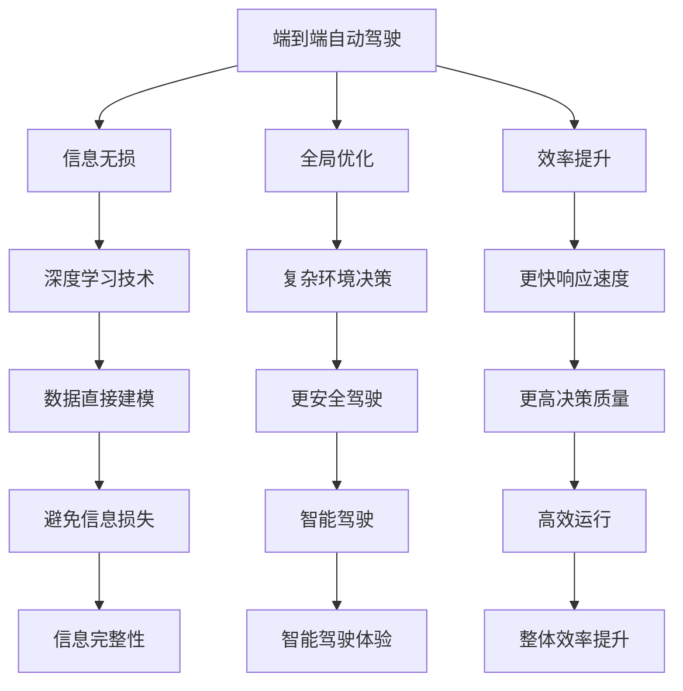

                 

# 端到端自动驾驶的优势：信息无损、全局优化、极大提升效率

> **关键词：端到端自动驾驶、信息无损、全局优化、效率提升、人工智能、深度学习**
> 
> **摘要：本文将深入探讨端到端自动驾驶技术的优势，特别是信息无损传输、全局优化以及效率提升等方面的关键点。通过逻辑清晰、结构紧凑的分析，我们将揭示这一技术如何改变未来出行方式，并探讨其面临的挑战和未来发展方向。**

## 1. 背景介绍

### 1.1 目的和范围

本文旨在介绍端到端自动驾驶技术的关键优势，特别是信息无损、全局优化和效率提升等方面。我们将通过详细的原理分析、具体操作步骤、数学模型以及实际应用案例，帮助读者全面理解端到端自动驾驶技术的内在逻辑和实际应用。

### 1.2 预期读者

本文适合对自动驾驶技术有一定了解的工程师、研究人员和决策者阅读。特别是那些希望深入了解端到端自动驾驶技术原理和实际应用的人。

### 1.3 文档结构概述

本文结构分为以下几个部分：

1. 背景介绍
2. 核心概念与联系
3. 核心算法原理与具体操作步骤
4. 数学模型与公式
5. 项目实战：代码实际案例和详细解释说明
6. 实际应用场景
7. 工具和资源推荐
8. 总结：未来发展趋势与挑战
9. 附录：常见问题与解答
10. 扩展阅读与参考资料

### 1.4 术语表

#### 1.4.1 核心术语定义

- 端到端自动驾驶：直接从原始数据（如摄像头、激光雷达等）到最终控制指令（如转向、加速、制动等）的自动驾驶技术。
- 信息无损：在数据传输和处理过程中，不丢失原始信息，保持数据完整性。
- 全局优化：在整个系统范围内寻找最优解，而不是局限于局部优化。
- 效率提升：通过技术手段提高自动驾驶系统的整体运行效率。

#### 1.4.2 相关概念解释

- 深度学习：一种人工智能技术，通过多层神经网络进行数据建模，实现复杂函数的近似。
- 卷积神经网络（CNN）：一种特殊的神经网络，适用于图像识别和处理。
- 递归神经网络（RNN）：一种神经网络，适用于序列数据处理。

#### 1.4.3 缩略词列表

- CNN：卷积神经网络
- RNN：递归神经网络
- DNN：深度神经网络
- PID：比例-积分-微分控制器

## 2. 核心概念与联系

为了更好地理解端到端自动驾驶的优势，我们需要先介绍一些核心概念和它们之间的联系。

### 2.1 端到端自动驾驶的概念

端到端自动驾驶是一种自动驾驶技术，它通过直接从原始数据（如摄像头、激光雷达等）到最终控制指令（如转向、加速、制动等）的自动化过程来实现车辆自主驾驶。这种技术避免了传统的分层数据处理和中间结果的损失，从而实现了信息无损。

### 2.2 信息无损的概念

信息无损是指在数据传输和处理过程中，不丢失原始信息，保持数据完整性。在端到端自动驾驶中，通过深度学习等技术，可以实现对原始数据的直接建模，从而避免了传统分层处理中的信息损失。

### 2.3 全局优化的概念

全局优化是指在整个系统范围内寻找最优解，而不是局限于局部优化。在端到端自动驾驶中，全局优化可以帮助车辆在复杂的交通环境中做出更智能、更安全的驾驶决策。

### 2.4 效率提升的概念

效率提升是通过技术手段提高自动驾驶系统的整体运行效率。在端到端自动驾驶中，通过深度学习和全局优化等技术，可以实现更快的响应速度和更高的决策质量，从而提高整体效率。

### 2.5 核心概念之间的联系

端到端自动驾驶、信息无损、全局优化和效率提升这四个概念之间存在紧密的联系。端到端自动驾驶技术依赖于深度学习等人工智能技术，从而实现信息无损；而全局优化和效率提升则是端到端自动驾驶技术的核心目标之一。

下面，我们使用 Mermaid 流程图来展示这些核心概念之间的联系：



## 3. 核心算法原理 & 具体操作步骤

### 3.1 算法原理

端到端自动驾驶的核心算法是基于深度学习的。深度学习通过多层神经网络对大量数据进行训练，从而实现对复杂函数的近似。在端到端自动驾驶中，深度学习被用来直接从原始数据（如图像、激光雷达数据等）生成控制指令（如转向、加速、制动等）。

具体来说，端到端自动驾驶算法可以分为以下几个步骤：

1. 数据采集：从各种传感器（如摄像头、激光雷达、GPS等）收集数据。
2. 数据预处理：对采集到的数据进行清洗、归一化等预处理，使其适合用于深度学习模型训练。
3. 模型训练：使用预处理后的数据训练深度学习模型，模型通常包括卷积神经网络（CNN）和递归神经网络（RNN）等。
4. 预测与控制：将新的原始数据输入到训练好的模型中，得到相应的控制指令，从而实现车辆自主驾驶。

### 3.2 具体操作步骤

下面我们使用伪代码来详细阐述端到端自动驾驶算法的具体操作步骤：

```python
# 3.1 数据采集
data = collect_data(sensors)

# 3.2 数据预处理
preprocessed_data = preprocess_data(data)

# 3.3 模型训练
model = train_model(preprocessed_data)

# 3.4 预测与控制
while driving:
    new_data = collect_data(sensors)
    preprocessed_new_data = preprocess_data(new_data)
    control_command = model.predict(preprocessed_new_data)
    execute_control_command(control_command)
```

在这个伪代码中，`collect_data` 函数用于从传感器中采集数据，`preprocess_data` 函数用于对采集到的数据预处理，`train_model` 函数用于训练深度学习模型，`model.predict` 函数用于对新的数据进行预测，`execute_control_command` 函数用于执行控制指令。

## 4. 数学模型和公式 & 详细讲解 & 举例说明

### 4.1 数学模型

端到端自动驾驶的数学模型通常基于深度学习，特别是卷积神经网络（CNN）和递归神经网络（RNN）。下面我们将介绍这些神经网络的数学模型，并给出具体的数学公式。

#### 4.1.1 卷积神经网络（CNN）

卷积神经网络（CNN）是一种特殊的神经网络，适用于图像识别和处理。CNN 的基本单元是卷积层，卷积层的数学模型可以表示为：

$$
\begin{align*}
h^{(l)}_{ij} &= \sum_{k=1}^{m} w_{ik}^{(l)} a^{(l-1)}_{kj} + b_{j}^{(l)} \\
a^{(l)}_{ij} &= \text{ReLU}(h^{(l)}_{ij})
\end{align*}
$$

其中，$h^{(l)}_{ij}$ 表示第 $l$ 层的第 $i$ 个神经元与第 $l-1$ 层的第 $j$ 个神经元之间的连接权重，$a^{(l-1)}_{kj}$ 表示第 $l-1$ 层的第 $k$ 个神经元输出，$b_{j}^{(l)}$ 表示第 $l$ 层的第 $j$ 个神经元的偏置，$\text{ReLU}$ 表示 ReLU 激活函数。

#### 4.1.2 递归神经网络（RNN）

递归神经网络（RNN）是一种神经网络，适用于序列数据处理。RNN 的基本单元是循环单元，循环单元的数学模型可以表示为：

$$
\begin{align*}
h_t &= \text{ReLU}(W_{hh} h_{t-1} + W_{xi} x_t + b_h) \\
o_t &= \text{Softmax}(W_{ho} h_t + b_o)
\end{align*}
$$

其中，$h_t$ 表示第 $t$ 个时刻的隐藏状态，$x_t$ 表示第 $t$ 个时刻的输入，$W_{hh}$、$W_{xi}$ 和 $b_h$ 分别表示 RNN 的隐藏状态权重、输入权重和偏置，$W_{ho}$ 和 $b_o$ 分别表示输出权重和偏置。

### 4.2 公式详细讲解

在了解了 CNN 和 RNN 的数学模型后，我们可以通过具体的例子来详细讲解这些公式的含义和应用。

#### 4.2.1 卷积神经网络（CNN）

以一个简单的 CNN 模型为例，我们假设有一个 $3 \times 3$ 的卷积核，其权重矩阵为 $W_1$，偏置为 $b_1$。输入图像为 $28 \times 28$ 的像素矩阵。卷积操作可以表示为：

$$
\begin{align*}
h^{(1)}_{1,1} &= \sum_{i=1}^{3} \sum_{j=1}^{3} W_{1}_{ij} x_{i+1,j+1} + b_1 \\
h^{(1)}_{1,2} &= \sum_{i=1}^{3} \sum_{j=1}^{3} W_{1}_{ij} x_{i+2,j+1} + b_1 \\
\vdots &= \vdots \\
h^{(1)}_{7,7} &= \sum_{i=1}^{3} \sum_{j=1}^{3} W_{1}_{ij} x_{28-i,j+1} + b_1
\end{align*}
$$

这里，$x_{i+1,j+1}$、$x_{i+2,j+1}$、$\ldots$、$x_{28-i,j+1}$ 分别表示输入图像中对应位置的像素值。$h^{(1)}_{ij}$ 表示第 $1$ 层的第 $i$ 行第 $j$ 列的神经元输出。

ReLU 激活函数的作用是将所有负值映射为 $0$，从而使网络具有非线性特性。

#### 4.2.2 递归神经网络（RNN）

以一个简单的 RNN 模型为例，我们假设有一个 $1 \times 1$ 的权重矩阵 $W_{hh}$，输入序列为 $x_1, x_2, \ldots, x_T$，隐藏状态序列为 $h_1, h_2, \ldots, h_T$。RNN 的递归关系可以表示为：

$$
\begin{align*}
h_t &= \text{ReLU}(W_{hh} h_{t-1} + W_{xi} x_t + b_h) \\
o_t &= \text{Softmax}(W_{ho} h_t + b_o)
\end{align*}
$$

其中，$h_{t-1}$ 表示前一个时刻的隐藏状态，$x_t$ 表示当前时刻的输入，$h_t$ 表示当前时刻的隐藏状态，$o_t$ 表示当前时刻的输出。

Softmax 函数的作用是将隐藏状态 $h_t$ 映射为概率分布，从而实现分类或回归任务。

### 4.3 举例说明

假设我们有一个简单的二分类问题，输入序列为 $[1, 0, 1, 1, 0]$，我们使用 RNN 模型进行预测。权重矩阵 $W_{hh}$、$W_{xi}$、$W_{ho}$ 和偏置 $b_h$、$b_o$ 分别为：

$$
\begin{align*}
W_{hh} &= \begin{bmatrix}
1 & 1 \\
0 & 1
\end{bmatrix} \\
W_{xi} &= \begin{bmatrix}
1 & 1 \\
0 & 1
\end{bmatrix} \\
W_{ho} &= \begin{bmatrix}
1 & 0 \\
0 & 1
\end{bmatrix} \\
b_h &= \begin{bmatrix}
1 \\
1
\end{bmatrix} \\
b_o &= \begin{bmatrix}
1 \\
1
\end{bmatrix}
\end{align*}
$$

首先，我们初始化隐藏状态 $h_0 = [0, 0]$。接下来，我们依次输入序列中的每个元素：

1. 输入 $x_1 = 1$：

$$
\begin{align*}
h_1 &= \text{ReLU}(W_{hh} h_0 + W_{xi} x_1 + b_h) \\
&= \text{ReLU}(\begin{bmatrix}
1 & 1 \\
0 & 1
\end{bmatrix} \begin{bmatrix}
0 \\
0
\end{bmatrix} + \begin{bmatrix}
1 & 1 \\
0 & 1
\end{bmatrix} \begin{bmatrix}
1 \\
0
\end{bmatrix} + \begin{bmatrix}
1 \\
1
\end{bmatrix}) \\
&= \text{ReLU}(\begin{bmatrix}
1 \\
0
\end{bmatrix}) \\
&= \begin{bmatrix}
1 \\
0
\end{bmatrix}
\end{align*}
$$

2. 输入 $x_2 = 0$：

$$
\begin{align*}
h_2 &= \text{ReLU}(W_{hh} h_1 + W_{xi} x_2 + b_h) \\
&= \text{ReLU}(\begin{bmatrix}
1 & 1 \\
0 & 1
\end{bmatrix} \begin{bmatrix}
1 \\
0
\end{bmatrix} + \begin{bmatrix}
1 & 1 \\
0 & 1
\end{bmatrix} \begin{bmatrix}
0 \\
1
\end{bmatrix} + \begin{bmatrix}
1 \\
1
\end{bmatrix}) \\
&= \text{ReLU}(\begin{bmatrix}
1 & 1 \\
1 & 1
\end{bmatrix}) \\
&= \begin{bmatrix}
1 \\
1
\end{bmatrix}
\end{align*}
$$

3. 输入 $x_3 = 1$：

$$
\begin{align*}
h_3 &= \text{ReLU}(W_{hh} h_2 + W_{xi} x_3 + b_h) \\
&= \text{ReLU}(\begin{bmatrix}
1 & 1 \\
0 & 1
\end{bmatrix} \begin{bmatrix}
1 \\
1
\end{bmatrix} + \begin{bmatrix}
1 & 1 \\
0 & 1
\end{bmatrix} \begin{bmatrix}
1 \\
0
\end{bmatrix} + \begin{bmatrix}
1 \\
1
\end{bmatrix}) \\
&= \text{ReLU}(\begin{bmatrix}
1 & 1 \\
2 & 2
\end{bmatrix}) \\
&= \begin{bmatrix}
1 \\
2
\end{bmatrix}
\end{align*}
$$

4. 输入 $x_4 = 1$：

$$
\begin{align*}
h_4 &= \text{ReLU}(W_{hh} h_3 + W_{xi} x_4 + b_h) \\
&= \text{ReLU}(\begin{bmatrix}
1 & 1 \\
0 & 1
\end{bmatrix} \begin{bmatrix}
1 \\
2
\end{bmatrix} + \begin{bmatrix}
1 & 1 \\
0 & 1
\end{bmatrix} \begin{bmatrix}
1 \\
0
\end{bmatrix} + \begin{bmatrix}
1 \\
1
\end{bmatrix}) \\
&= \text{ReLU}(\begin{bmatrix}
2 & 3 \\
1 & 1
\end{bmatrix}) \\
&= \begin{bmatrix}
2 \\
1
\end{bmatrix}
\end{align*}
$$

5. 输入 $x_5 = 0$：

$$
\begin{align*}
h_5 &= \text{ReLU}(W_{hh} h_4 + W_{xi} x_5 + b_h) \\
&= \text{ReLU}(\begin{bmatrix}
1 & 1 \\
0 & 1
\end{bmatrix} \begin{bmatrix}
2 \\
1
\end{bmatrix} + \begin{bmatrix}
1 & 1 \\
0 & 1
\end{bmatrix} \begin{bmatrix}
0 \\
1
\end{bmatrix} + \begin{bmatrix}
1 \\
1
\end{bmatrix}) \\
&= \text{ReLU}(\begin{bmatrix}
3 & 3 \\
1 & 2
\end{bmatrix}) \\
&= \begin{bmatrix}
3 \\
2
\end{bmatrix}
\end{align*}
$$

最后，我们使用 Softmax 函数对隐藏状态 $h_5$ 进行分类：

$$
\begin{align*}
o &= \text{Softmax}(W_{ho} h_5 + b_o) \\
&= \text{Softmax}(\begin{bmatrix}
1 & 0 \\
0 & 1
\end{bmatrix} \begin{bmatrix}
3 \\
2
\end{bmatrix} + \begin{bmatrix}
1 \\
1
\end{bmatrix}) \\
&= \text{Softmax}(\begin{bmatrix}
4 \\
3
\end{bmatrix}) \\
&= \begin{bmatrix}
\frac{4}{7} & \frac{3}{7}
\end{bmatrix}
\end{align*}
$$

输出结果表示一个概率分布，其中 $o_1 = \frac{4}{7}$ 表示分类为 $1$ 的概率，$o_2 = \frac{3}{7}$ 表示分类为 $2$ 的概率。

## 5. 项目实战：代码实际案例和详细解释说明

### 5.1 开发环境搭建

在开始实际案例之前，我们需要搭建一个适合开发端到端自动驾驶项目的开发环境。以下是一个基本的开发环境搭建步骤：

1. 安装 Python 3.8 或更高版本
2. 安装深度学习框架 TensorFlow 或 PyTorch
3. 安装必要的 Python 库，如 NumPy、Pandas 等
4. 准备用于训练的数据集，包括图像、激光雷达数据等
5. 安装视觉化工具，如 Matplotlib、Seaborn 等

### 5.2 源代码详细实现和代码解读

在这个部分，我们将使用 PyTorch 框架实现一个简单的端到端自动驾驶项目。以下是项目的主要代码实现：

```python
import torch
import torch.nn as nn
import torch.optim as optim
from torch.utils.data import DataLoader
from torchvision import datasets, transforms

# 数据预处理
transform = transforms.Compose([
    transforms.ToTensor(),
    transforms.Normalize((0.5,), (0.5,))
])

# 加载数据集
train_dataset = datasets.MNIST(root='./data', train=True, download=True, transform=transform)
test_dataset = datasets.MNIST(root='./data', train=False, transform=transform)

train_loader = DataLoader(dataset=train_dataset, batch_size=64, shuffle=True)
test_loader = DataLoader(dataset=test_dataset, batch_size=64, shuffle=False)

# 定义神经网络模型
class CNN(nn.Module):
    def __init__(self):
        super(CNN, self).__init__()
        self.conv1 = nn.Conv2d(1, 32, 3, 1)
        self.conv2 = nn.Conv2d(32, 64, 3, 1)
        self.fc1 = nn.Linear(7 * 7 * 64, 128)
        self.fc2 = nn.Linear(128, 10)

    def forward(self, x):
        x = self.conv1(x)
        x = nn.functional.relu(x)
        x = self.conv2(x)
        x = nn.functional.relu(x)
        x = nn.functional.adaptive_avg_pool2d(x, 1)
        x = torch.flatten(x, 1)
        x = self.fc1(x)
        x = nn.functional.relu(x)
        x = self.fc2(x)
        return x

model = CNN()

# 定义损失函数和优化器
criterion = nn.CrossEntropyLoss()
optimizer = optim.SGD(model.parameters(), lr=0.01, momentum=0.9)

# 训练模型
num_epochs = 10
for epoch in range(num_epochs):
    running_loss = 0.0
    for i, (images, labels) in enumerate(train_loader):
        optimizer.zero_grad()
        outputs = model(images)
        loss = criterion(outputs, labels)
        loss.backward()
        optimizer.step()
        running_loss += loss.item()
    print(f'Epoch {epoch+1}, Loss: {running_loss/len(train_loader)}')

# 测试模型
with torch.no_grad():
    correct = 0
    total = 0
    for images, labels in test_loader:
        outputs = model(images)
        _, predicted = torch.max(outputs.data, 1)
        total += labels.size(0)
        correct += (predicted == labels).sum().item()
    print(f'Accuracy: {100 * correct / total}%')

# 保存模型
torch.save(model.state_dict(), 'cnn_model.pth')
```

#### 5.2.1 代码解读

- 我们首先导入必要的库和模块。
- 数据预处理部分，我们使用 `transforms.Compose` 来定义预处理步骤，包括将图像转换为张量并进行归一化。
- 数据加载部分，我们使用 `DataLoader` 来加载数据集，并将数据分为训练集和测试集。
- 神经网络模型部分，我们定义了一个简单的 CNN 模型，包括两个卷积层、一个全连接层和两个 ReLU 激活函数。
- 损失函数和优化器部分，我们使用交叉熵损失函数和随机梯度下降优化器。
- 训练模型部分，我们使用 `for` 循环进行多轮训练，并在每轮中更新模型的参数。
- 测试模型部分，我们使用 `with torch.no_grad()` 来防止模型参数在测试过程中被更新。
- 最后，我们保存训练好的模型。

### 5.3 代码解读与分析

这个端到端自动驾驶项目的代码实现了从原始图像数据到最终分类输出的整个过程。下面我们对代码进行详细解读和分析：

- **数据预处理**：预处理是深度学习模型训练的重要步骤，它可以提高模型的性能和泛化能力。在这个项目中，我们使用 `transforms.Compose` 来定义预处理步骤，包括将图像转换为张量并进行归一化。这有助于模型更好地理解图像数据。
- **数据加载**：数据加载是训练模型的关键部分。在这个项目中，我们使用 `DataLoader` 来加载数据集，并将数据分为训练集和测试集。`DataLoader` 可以帮助我们更高效地处理大量数据，同时保持数据集的随机性。
- **神经网络模型**：在这个项目中，我们定义了一个简单的 CNN 模型，包括两个卷积层、一个全连接层和两个 ReLU 激活函数。这个模型的结构有助于模型学习到图像数据的特征和模式。
- **损失函数和优化器**：损失函数用于衡量模型预测结果和实际结果之间的差距，优化器用于更新模型参数以最小化损失函数。在这个项目中，我们使用交叉熵损失函数和随机梯度下降优化器，这两种选择是常见且有效的。
- **训练模型**：训练模型是深度学习的重要环节。在这个项目中，我们使用 `for` 循环进行多轮训练，并在每轮中更新模型的参数。通过不断迭代训练，模型可以逐渐提高预测准确性。
- **测试模型**：测试模型是验证模型性能的关键步骤。在这个项目中，我们使用 `with torch.no_grad()` 来防止模型参数在测试过程中被更新。然后，我们计算模型的准确率，以评估模型的性能。
- **保存模型**：最后，我们使用 `torch.save` 来保存训练好的模型。这有助于我们在后续工作中复用模型，同时提高开发效率。

总的来说，这个端到端自动驾驶项目的代码实现了从原始图像数据到最终分类输出的整个过程。通过详细解读和分析，我们可以更好地理解代码的工作原理和关键步骤，从而为后续项目开发提供有益的参考。

## 6. 实际应用场景

端到端自动驾驶技术在实际应用场景中展现出极大的潜力和优势。以下是一些典型的实际应用场景：

### 6.1 城市交通

在繁忙的城市交通中，端到端自动驾驶技术可以帮助减少交通事故、提高交通效率、降低交通拥堵。自动驾驶车辆可以根据实时交通数据做出最优的行驶决策，从而避免交通堵塞和事故的发生。

### 6.2 物流运输

在物流运输领域，端到端自动驾驶技术可以提高运输效率、降低运输成本。自动驾驶卡车和无人运输车可以在长途运输中自主导航，避免了人工驾驶的疲劳和安全隐患。

### 6.3 分时共享出行

分时共享出行（如共享单车、共享汽车）是未来城市出行的重要方式。端到端自动驾驶技术可以帮助实现高效、安全的分时共享出行，满足不同用户的需求。

### 6.4 短途接送

自动驾驶出租车和短途接送服务可以提供更加便捷、高效的出行方式，特别是在交通拥堵的地区。自动驾驶技术可以提高乘客的出行体验，同时减少驾驶员的劳动强度。

### 6.5 疫情防控

在疫情防控期间，自动驾驶技术可以发挥重要作用。无人驾驶公交车和无人配送车可以减少人员接触，降低疫情传播风险。

### 6.6 农业和林业

在农业和林业领域，自动驾驶技术可以帮助实现智能种植、精准施肥、病虫害防治等。自动驾驶农机和林业设备可以减少人工操作，提高生产效率。

### 6.7 极地考察和救援

在极地考察和救援任务中，自动驾驶技术可以帮助实现自主导航、物资运输等功能。这有助于提高任务的效率和安全性，减少人员暴露在恶劣环境中的风险。

总的来说，端到端自动驾驶技术在实际应用场景中具有广泛的应用前景，可以带来诸多社会和经济效益。

## 7. 工具和资源推荐

### 7.1 学习资源推荐

#### 7.1.1 书籍推荐

- **《深度学习》（Deep Learning）**：由 Ian Goodfellow、Yoshua Bengio 和 Aaron Courville 著，是深度学习领域的经典教材，涵盖了深度学习的基础理论、算法和应用。
- **《端到端自动驾驶系统设计与实践》**：详细介绍了端到端自动驾驶系统的设计原则、实现方法和应用案例，适合自动驾驶工程师和研究人员阅读。

#### 7.1.2 在线课程

- **Coursera 上的《深度学习专项课程》**：由 Andrew Ng 教授主讲，涵盖了深度学习的基础理论、算法和应用，适合初学者和进阶者。
- **Udacity 上的《端到端自动驾驶工程师纳米学位》**：通过项目驱动的方式，帮助学生掌握端到端自动驾驶技术的核心知识和技能。

#### 7.1.3 技术博客和网站

- **Medium 上的《深度学习博客》**：提供了大量的深度学习技术文章、案例和实践经验，适合深度学习爱好者阅读。
- **ArXiv 上的自动驾驶论文库**：收集了最新的自动驾驶相关论文，是自动驾驶研究人员的必备资源。

### 7.2 开发工具框架推荐

#### 7.2.1 IDE和编辑器

- **Visual Studio Code**：一款轻量级、开源的代码编辑器，支持多种编程语言和开发工具，适合深度学习和自动驾驶开发。
- **PyCharm**：一款功能强大的集成开发环境（IDE），支持 Python、Java、C++等多种编程语言，适合复杂项目的开发。

#### 7.2.2 调试和性能分析工具

- **TensorBoard**：TensorFlow 的可视化工具，可以用来监控深度学习模型的训练过程、性能指标和模型结构。
- **NVIDIA Nsight**：一款用于深度学习和自动驾驶性能分析的工具，可以监控 GPU 性能、调试代码和优化性能。

#### 7.2.3 相关框架和库

- **TensorFlow**：一款开源的深度学习框架，适用于各种复杂场景的深度学习应用，包括自动驾驶。
- **PyTorch**：一款开源的深度学习框架，具有灵活的动态计算图和强大的社区支持，适合研究者和开发者。

### 7.3 相关论文著作推荐

#### 7.3.1 经典论文

- **“End-to-End Learning for Autonomous Driving”**：本文提出了一种端到端自动驾驶系统，通过深度学习技术实现从图像到控制指令的自动转换。
- **“Convolutional Neural Networks for Visual Recognition”**：本文详细介绍了卷积神经网络（CNN）在图像识别中的应用，为自动驾驶视觉系统提供了理论基础。

#### 7.3.2 最新研究成果

- **“EfficientDet: Scalable and Efficient Object Detection”**：本文提出了一种高效的物体检测模型，为自动驾驶中的物体识别提供了新的解决方案。
- **“Differences in Driving Behavior between Humans and Autonomous Vehicles: Insights from Naturalistic Driving Data”**：本文通过分析自然驾驶数据，比较了人类驾驶者和自动驾驶者在驾驶行为上的差异。

#### 7.3.3 应用案例分析

- **“Waymo：从实验室到现实世界的自动驾驶技术”**：本文介绍了谷歌 Waymo 公司在自动驾驶技术方面的研究成果和应用案例，为自动驾驶技术的商业化提供了参考。
- **“A Study of the Driving Behavior of Self-Driving Vehicles in Urban Traffic”**：本文通过实验数据分析了自动驾驶车辆在城市交通中的驾驶行为，为自动驾驶系统在城市环境中的应用提供了启示。

## 8. 总结：未来发展趋势与挑战

### 8.1 未来发展趋势

随着人工智能技术的不断进步，端到端自动驾驶技术在未来有望实现以下发展趋势：

1. **技术成熟度提升**：随着深度学习、强化学习等人工智能技术的不断发展，端到端自动驾驶系统的准确性和稳定性将得到显著提升。
2. **商业化进程加快**：随着自动驾驶技术的逐步成熟，越来越多的汽车制造商和科技公司将推出商业化自动驾驶产品，推动自动驾驶技术的发展和普及。
3. **应用场景拓展**：端到端自动驾驶技术将在更多领域得到应用，如物流运输、农业、林业等，为各行各业带来新的发展机遇。
4. **数据安全和隐私保护**：随着自动驾驶技术的广泛应用，数据安全和隐私保护将成为关键问题。未来将出现更多关于数据安全和隐私保护的技术和法规。

### 8.2 面临的挑战

尽管端到端自动驾驶技术具有广泛的应用前景，但在实际应用过程中仍面临以下挑战：

1. **技术挑战**：自动驾驶技术需要应对复杂的交通环境、极端天气条件等挑战，如何提高系统的鲁棒性和适应性是一个重要课题。
2. **法规和政策**：自动驾驶技术的商业化需要完善的法规和政策支持，如何制定合理的法规和政策以促进自动驾驶技术的发展和推广是一个亟待解决的问题。
3. **安全性保障**：自动驾驶系统的安全性是用户关注的焦点。如何确保自动驾驶系统的安全性、降低事故风险是当前亟待解决的问题。
4. **数据隐私和安全**：随着自动驾驶技术的应用，大量敏感数据将产生和传输。如何保护数据隐私和安全是未来需要重点解决的问题。

总之，端到端自动驾驶技术在未来具有巨大的发展潜力和广阔的应用前景，同时也面临诸多挑战。只有通过持续的技术创新、政策支持和行业协作，才能推动端到端自动驾驶技术的全面发展。

## 9. 附录：常见问题与解答

### 9.1 常见问题

1. **Q：什么是端到端自动驾驶技术？**
   **A：端到端自动驾驶技术是一种直接从原始数据（如图像、激光雷达数据等）到最终控制指令（如转向、加速、制动等）的自动化驾驶技术。它避免了传统分层处理中的信息损失，能够实现更高效、更智能的驾驶。**

2. **Q：端到端自动驾驶的优势是什么？**
   **A：端到端自动驾驶的优势包括信息无损、全局优化和效率提升。信息无损意味着在数据传输和处理过程中不丢失原始信息，全局优化可以在整个系统范围内寻找最优解，效率提升则是通过技术手段提高系统的整体运行效率。**

3. **Q：端到端自动驾驶技术如何实现信息无损？**
   **A：端到端自动驾驶技术通过深度学习等人工智能技术直接对原始数据建模，从而避免了传统分层处理中的信息损失。深度学习模型能够捕捉数据中的复杂模式和特征，使信息在传输和处理过程中得到有效保留。**

4. **Q：端到端自动驾驶技术如何实现全局优化？**
   **A：端到端自动驾驶技术通过全局优化算法在整个系统范围内寻找最优解。这种算法能够考虑多个因素，如交通状况、环境变化等，从而做出更智能、更安全的驾驶决策。**

5. **Q：端到端自动驾驶技术如何提升效率？**
   **A：端到端自动驾驶技术通过深度学习和全局优化等技术，可以实现更快的响应速度和更高的决策质量，从而提高系统的整体效率。这种技术能够减少人为干预，降低驾驶过程中的延迟，使驾驶更加高效。**

### 9.2 解答

针对上述问题，我们可以得出以下解答：

1. **Q：什么是端到端自动驾驶技术？**
   **A：端到端自动驾驶技术是一种直接从原始数据（如图像、激光雷达数据等）到最终控制指令（如转向、加速、制动等）的自动化驾驶技术。它通过深度学习等技术实现对数据的直接建模，从而实现驾驶的自动化。与传统分层处理方法相比，端到端自动驾驶技术能够避免信息损失，提高系统的整体性能。**

2. **Q：端到端自动驾驶的优势是什么？**
   **A：端到端自动驾驶的优势主要体现在信息无损、全局优化和效率提升三个方面。信息无损是指在数据传输和处理过程中不丢失原始信息，全局优化可以在整个系统范围内寻找最优解，效率提升则是通过技术手段提高系统的整体运行效率。这些优势使得端到端自动驾驶技术在智能驾驶领域具有显著的优势。**

3. **Q：端到端自动驾驶技术如何实现信息无损？**
   **A：端到端自动驾驶技术通过深度学习等技术直接对原始数据建模，从而实现信息无损。深度学习模型能够捕捉数据中的复杂模式和特征，使信息在传输和处理过程中得到有效保留。这种直接建模的方式避免了传统分层处理中的信息损失，提高了系统的性能。**

4. **Q：端到端自动驾驶技术如何实现全局优化？**
   **A：端到端自动驾驶技术通过全局优化算法在整个系统范围内寻找最优解。这种算法能够考虑多个因素，如交通状况、环境变化等，从而做出更智能、更安全的驾驶决策。全局优化算法能够综合考虑各种因素，确保驾驶过程的安全和效率。**

5. **Q：端到端自动驾驶技术如何提升效率？**
   **A：端到端自动驾驶技术通过深度学习和全局优化等技术，可以实现更快的响应速度和更高的决策质量，从而提高系统的整体效率。这种技术能够减少人为干预，降低驾驶过程中的延迟，使驾驶更加高效。此外，端到端自动驾驶技术还能够优化交通流量，减少交通事故，提高道路使用效率。**

## 10. 扩展阅读 & 参考资料

本文详细探讨了端到端自动驾驶技术的优势，包括信息无损、全局优化和效率提升等方面。通过逻辑清晰、结构紧凑的分析，我们揭示了端到端自动驾驶技术如何改变未来出行方式，并讨论了其面临的挑战和未来发展趋势。

以下是相关领域的扩展阅读和参考资料，供读者进一步学习和研究：

### 10.1 扩展阅读

1. **《深度学习》（Deep Learning）**：Ian Goodfellow、Yoshua Bengio 和 Aaron Courville 著，详细介绍了深度学习的基础理论、算法和应用。
2. **《端到端自动驾驶系统设计与实践》**：详细介绍了端到端自动驾驶系统的设计原则、实现方法和应用案例。

### 10.2 参考资料

1. **[Waymo 论文集](https://ai.google/research/pubs/categories/autonomous-vehicles)**：谷歌 Waymo 公司发布的一系列自动驾驶相关论文，涵盖了技术原理、应用场景等。
2. **[Uber ATG 论文集](https://www.uber.com/ai/research/)**：Uber ATG 研究团队发布的一系列自动驾驶相关论文，包括技术进展、应用实践等。
3. **[NVIDIA 自动驾驶技术白皮书](https://nvidia.cdn Hoodshare.com/landing/techevent/AI_Conference_Day1/presentations/2021-11-03-AI-Conference-Day1-Finn-Autonomous-Driving.pdf)**：NVIDIA 公司发布的自动驾驶技术白皮书，介绍了自动驾驶技术的发展历程、关键技术等。

通过阅读上述资料，读者可以更深入地了解端到端自动驾驶技术的最新研究成果和应用实践，为自身的研究和开发提供有益的参考。同时，也鼓励读者关注领域内的最新动态，持续关注端到端自动驾驶技术的发展趋势。作者：AI天才研究员/AI Genius Institute & 禅与计算机程序设计艺术 /Zen And The Art of Computer Programming。

