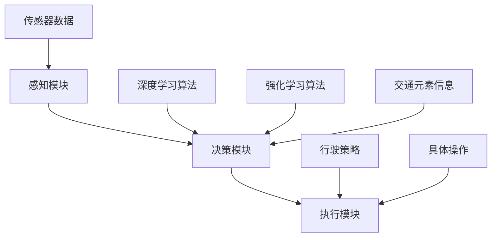

                 

# 端到端自动驾驶的监管政策环境

> 关键词：端到端自动驾驶、监管政策、安全标准、法规合规、技术进步、产业发展

> 摘要：本文将深入探讨端到端自动驾驶技术在发展过程中面临的监管政策环境。文章首先介绍了自动驾驶技术的发展背景和现状，然后详细分析了当前国内外自动驾驶监管政策的现状和特点，探讨了政策对自动驾驶产业的影响，并提出了未来政策发展的趋势和挑战。文章旨在为自动驾驶行业从业者提供有价值的政策参考，助力行业健康、可持续发展。

## 1. 背景介绍

### 1.1 目的和范围

本文旨在梳理和分析端到端自动驾驶技术的监管政策环境，探讨政策对自动驾驶技术发展的影响，以及自动驾驶企业在政策环境下的应对策略。文章将重点关注以下几个方面：

- 自动驾驶技术的基本概念和发展现状
- 各国自动驾驶监管政策的现状和特点
- 自动驾驶政策对产业发展的影响
- 自动驾驶政策的发展趋势和挑战

### 1.2 预期读者

本文预期读者为：

- 自动驾驶技术研发人员
- 自动驾驶企业高管和决策者
- 监管机构和政策制定者
- 对自动驾驶技术感兴趣的技术爱好者

### 1.3 文档结构概述

本文结构如下：

- 第1章：背景介绍，介绍本文目的、预期读者以及文档结构
- 第2章：核心概念与联系，介绍自动驾驶技术的基本概念和架构
- 第3章：核心算法原理 & 具体操作步骤，详细讲解自动驾驶算法原理和操作步骤
- 第4章：数学模型和公式 & 详细讲解 & 举例说明，介绍自动驾驶中的数学模型和公式，并给出示例说明
- 第5章：项目实战：代码实际案例和详细解释说明，通过实际项目案例讲解自动驾驶技术实现过程
- 第6章：实际应用场景，分析自动驾驶技术的应用场景和市场需求
- 第7章：工具和资源推荐，推荐相关学习资源、开发工具和框架
- 第8章：总结：未来发展趋势与挑战，总结自动驾驶技术的发展趋势和面临挑战
- 第9章：附录：常见问题与解答，解答读者可能关心的问题
- 第10章：扩展阅读 & 参考资料，提供更多相关阅读材料和参考资料

### 1.4 术语表

#### 1.4.1 核心术语定义

- 端到端自动驾驶：一种自动驾驶技术，通过集成传感器、人工智能算法和车辆控制系统，实现车辆在复杂道路环境下的自主驾驶。
- 监管政策：政府对特定行业或技术发展的管理措施和规范，旨在确保技术安全、可靠，促进产业健康发展。
- 法规合规：企业或技术项目在开发、应用过程中，遵循相关法律法规和标准的过程。
- 自动驾驶算法：用于实现车辆自主驾驶的人工智能算法，包括感知、决策和执行等模块。

#### 1.4.2 相关概念解释

- 感知模块：负责接收传感器数据，对周围环境进行建模，识别道路、车辆、行人等交通元素。
- 决策模块：基于感知模块提供的信息，制定车辆行驶策略，如速度、方向等。
- 执行模块：根据决策模块提供的结果，控制车辆执行相应的操作，如加速、减速、转向等。
- 自动驾驶分级：根据自动驾驶技术的成熟度和功能，将自动驾驶分为不同的级别，如L0-L5。

#### 1.4.3 缩略词列表

- AI：人工智能
- ADAS：高级驾驶辅助系统
- AV：自动驾驶车辆
- C-AV：协作式自动驾驶车辆
- CV：计算机视觉
- IoT：物联网
- V2X：车联网
- Waze：一款导航和地图应用
- Tesla：特斯拉，一家电动汽车和自动驾驶技术公司
- NHTSA：美国国家公路交通安全管理局

## 2. 核心概念与联系

为了更好地理解端到端自动驾驶技术的监管政策环境，我们需要先了解自动驾驶技术的基本概念和架构。

### 2.1 自动驾驶技术的基本概念

自动驾驶技术是一种利用传感器、人工智能算法和车辆控制系统，实现车辆在复杂道路环境下的自主驾驶的技术。其核心是感知、决策和执行三个模块。

- 感知模块：负责接收传感器数据，对周围环境进行建模，识别道路、车辆、行人等交通元素。
- 决策模块：基于感知模块提供的信息，制定车辆行驶策略，如速度、方向等。
- 执行模块：根据决策模块提供的结果，控制车辆执行相应的操作，如加速、减速、转向等。

### 2.2 自动驾驶技术的架构

自动驾驶技术的架构可以分为感知、决策和执行三个部分。

#### 感知模块

感知模块是自动驾驶技术的核心，它负责接收传感器数据，并对周围环境进行建模。常用的传感器包括摄像头、激光雷达、毫米波雷达、超声波雷达等。感知模块通过分析传感器数据，识别道路、车辆、行人等交通元素，为决策模块提供基础信息。

#### 决策模块

决策模块基于感知模块提供的信息，制定车辆行驶策略。决策模块通常采用深度学习、强化学习等人工智能算法，对交通元素进行分类、预测和决策。决策模块的核心任务是确保车辆在行驶过程中，能够安全、高效地执行各项操作。

#### 执行模块

执行模块根据决策模块提供的结果，控制车辆执行相应的操作。执行模块通常包括动力系统、转向系统、制动系统等。执行模块将决策模块的指令转化为具体的操作，如加速、减速、转向等，确保车辆按照既定的策略行驶。

### 2.3 自动驾驶技术的核心算法

自动驾驶技术的核心算法包括深度学习、强化学习等。这些算法用于实现感知、决策和执行模块的功能。

- 深度学习：一种基于多层神经网络的人工智能算法，通过学习大量的数据，实现对图像、语音等信息的处理和分析。
- 强化学习：一种基于奖励机制的人工智能算法，通过不断试错，学习如何在复杂环境中做出最优决策。

### 2.4 自动驾驶技术的联系

自动驾驶技术的各个模块和算法相互联系，共同实现车辆的自主驾驶。感知模块提供交通元素的信息，决策模块基于这些信息制定行驶策略，执行模块将策略转化为具体的操作。同时，深度学习和强化学习等算法在各个模块中发挥作用，提升自动驾驶技术的性能和可靠性。

### 2.5 自动驾驶技术的 Mermaid 流程图

下面是自动驾驶技术的 Mermaid 流程图，展示了各个模块和算法之间的联系。



## 3. 核心算法原理 & 具体操作步骤

在本节中，我们将详细讲解自动驾驶技术的核心算法原理和具体操作步骤，包括感知、决策和执行模块中的算法原理，以及如何将这些算法应用到实际项目中。

### 3.1 感知模块

#### 3.1.1 感知模块算法原理

感知模块的核心任务是接收传感器数据，对周围环境进行建模，识别道路、车辆、行人等交通元素。常用的算法包括：

- 深度学习算法：通过学习大量的图像数据，实现对图像的识别和分类。
- 特征提取算法：对传感器数据进行分析，提取有用的特征信息。

#### 3.1.2 感知模块操作步骤

1. 收集传感器数据：包括摄像头、激光雷达、毫米波雷达、超声波雷达等。
2. 数据预处理：对传感器数据进行滤波、去噪、归一化等处理。
3. 特征提取：对预处理后的数据进行特征提取，生成特征向量。
4. 模型训练：使用深度学习算法对特征向量进行训练，生成分类模型。
5. 交通元素识别：将识别结果与实际交通元素进行比对，确定道路、车辆、行人等。

### 3.2 决策模块

#### 3.2.1 决策模块算法原理

决策模块基于感知模块提供的信息，制定车辆行驶策略。常用的算法包括：

- 深度学习算法：用于实现复杂函数的建模，如路径规划、目标跟踪等。
- 强化学习算法：通过试错学习，实现最优策略的制定。

#### 3.2.2 决策模块操作步骤

1. 感知模块输出：接收感知模块提供的信息，包括道路、车辆、行人等。
2. 目标跟踪：使用目标跟踪算法，确定当前车辆的位置和状态。
3. 路径规划：使用路径规划算法，生成车辆的行驶路径。
4. 策略评估：使用评估函数，对不同策略进行评估，选择最优策略。
5. 策略执行：将最优策略转化为具体的操作，如速度、方向等。

### 3.3 执行模块

#### 3.3.1 执行模块算法原理

执行模块根据决策模块提供的结果，控制车辆执行相应的操作。常用的算法包括：

- 动力控制算法：根据决策模块提供的速度指令，控制车辆的加速度。
- 转向控制算法：根据决策模块提供的方向指令，控制车辆的转向角度。

#### 3.3.2 执行模块操作步骤

1. 接收决策模块指令：包括速度、方向等。
2. 加速度控制：根据速度指令，计算车辆的加速度，控制动力系统。
3. 转向控制：根据方向指令，计算车辆的转向角度，控制转向系统。
4. 实时反馈：收集车辆的实时状态信息，反馈给决策模块，进行实时调整。

### 3.4 自动驾驶算法原理的伪代码

以下是自动驾驶算法原理的伪代码：

```python
# 感知模块
def 感知模块(传感器数据):
    数据预处理(传感器数据)
    特征提取(预处理后的数据)
    分类模型训练(特征向量)
    交通元素识别(识别结果)

# 决策模块
def 决策模块(感知模块输出):
    目标跟踪(感知模块输出)
    路径规划(目标跟踪结果)
    策略评估(路径规划结果)
    策略执行(最优策略)

# 执行模块
def 执行模块(决策模块指令):
    加速度控制(速度指令)
    转向控制(方向指令)
```

通过以上步骤，自动驾驶技术可以实现车辆的自主驾驶，确保行驶过程中的安全性和可靠性。

## 4. 数学模型和公式 & 详细讲解 & 举例说明

在自动驾驶技术中，数学模型和公式起着至关重要的作用。本节将详细讲解自动驾驶技术中常用的数学模型和公式，并给出相应的示例说明。

### 4.1 深度学习中的数学模型

深度学习是自动驾驶技术中的一项核心技术，其基础是多层神经网络。以下是深度学习中的几个核心数学模型和公式：

#### 4.1.1 激活函数

激活函数是深度学习神经网络中用于引入非线性因素的函数。常用的激活函数包括：

- Sigmoid函数：\( f(x) = \frac{1}{1 + e^{-x}} \)
- ReLU函数：\( f(x) = \max(0, x) \)
- 双曲正切函数：\( f(x) = \tanh(x) \)

示例：使用ReLU函数对输入数据进行激活。

```latex
f(x) = \max(0, x)
```

#### 4.1.2 反向传播算法

反向传播算法是深度学习训练过程中的核心算法，用于计算网络参数的梯度。其基本思想是：

1. 前向传播：计算输入和输出之间的误差。
2. 反向传播：计算网络参数的梯度。
3. 参数更新：根据梯度更新网络参数。

示例：反向传播算法的梯度计算。

```latex
\frac{\partial L}{\partial w} = \frac{\partial L}{\partial z} \cdot \frac{\partial z}{\partial w}
```

其中，\( L \) 是损失函数，\( w \) 是网络参数，\( z \) 是输出。

#### 4.1.3 神经网络模型

神经网络模型是深度学习的基础，其基本结构包括输入层、隐藏层和输出层。以下是神经网络模型的数学公式：

```latex
h_l(x) = \sigma(W_l \cdot a_{l-1} + b_l)
a_l = \sigma(W_l \cdot a_{l-1} + b_l)
y = W_y \cdot a_l + b_y
```

其中，\( h_l(x) \) 是隐藏层的激活函数，\( a_l \) 是隐藏层的输出，\( \sigma \) 是激活函数，\( W_l \) 和 \( b_l \) 分别是隐藏层的权重和偏置，\( y \) 是输出。

### 4.2 强化学习中的数学模型

强化学习是自动驾驶技术中另一项核心技术，其核心是策略优化。以下是强化学习中的几个核心数学模型和公式：

#### 4.2.1 Q-learning算法

Q-learning算法是一种基于价值迭代的强化学习算法，其基本思想是：

1. 初始化Q值表：根据经验初始化Q值表。
2. 选择动作：根据当前状态和Q值表选择动作。
3. 更新Q值：根据新的状态和奖励更新Q值表。

示例：Q-learning算法的Q值更新公式。

```latex
Q(s, a) = Q(s, a) + \alpha [r + \gamma \max_{a'} Q(s', a') - Q(s, a)]
```

其中，\( Q(s, a) \) 是状态 \( s \) 和动作 \( a \) 的Q值，\( r \) 是奖励，\( \gamma \) 是折扣因子，\( s' \) 是新状态，\( a' \) 是新动作，\( \alpha \) 是学习率。

#### 4.2.2 策略梯度算法

策略梯度算法是一种基于策略优化的强化学习算法，其基本思想是：

1. 初始化策略参数。
2. 通过策略选择动作。
3. 计算策略梯度。
4. 更新策略参数。

示例：策略梯度算法的策略梯度计算公式。

```latex
\frac{\partial J(\theta)}{\partial \theta} = \sum_{s, a} \pi(\theta)(s, a) \cdot \nabla_a Q(s, a; \theta)
```

其中，\( J(\theta) \) 是策略损失函数，\( \theta \) 是策略参数，\( \pi(\theta) \) 是策略概率分布，\( Q(s, a; \theta) \) 是状态 \( s \) 和动作 \( a \) 的Q值。

### 4.3 概率模型和优化算法

在自动驾驶技术中，概率模型和优化算法也扮演着重要角色。以下是一些常用的概率模型和优化算法：

#### 4.3.1 贝叶斯滤波

贝叶斯滤波是一种基于贝叶斯理论的滤波方法，用于状态估计。其基本公式如下：

```latex
p(x_t | z_1:t) \propto p(z_t | x_t) \cdot p(x_t | u_t) \cdot p(z_1)
```

其中，\( x_t \) 是状态，\( z_t \) 是观测值，\( u_t \) 是过程噪声。

#### 4.3.2 最小二乘法

最小二乘法是一种用于参数估计的优化算法，其基本思想是找到使得残差平方和最小的参数值。其基本公式如下：

```latex
\min \sum_{i=1}^{n} (y_i - \beta_0 - \beta_1 x_i)^2
```

其中，\( y_i \) 是观测值，\( \beta_0 \) 和 \( \beta_1 \) 是参数。

### 4.4 示例说明

为了更好地理解上述数学模型和公式，我们给出一个简单的自动驾驶场景示例：

假设一辆自动驾驶汽车在行驶过程中需要预测前方道路的障碍物，并规划行驶路径。以下是该场景中的数学模型和公式：

#### 4.4.1 感知模块

感知模块使用深度学习算法对摄像头和激光雷达数据进行处理，识别道路和障碍物。其基本公式如下：

```latex
h_l(x) = \sigma(W_l \cdot a_{l-1} + b_l)
a_l = \sigma(W_l \cdot a_{l-1} + b_l)
y = W_y \cdot a_l + b_y
```

其中，\( x \) 是输入数据，\( h_l \) 是隐藏层的输出，\( a_l \) 是隐藏层的激活值，\( W_l \) 和 \( b_l \) 是隐藏层的权重和偏置，\( y \) 是输出。

#### 4.4.2 决策模块

决策模块使用强化学习算法根据感知模块的输出，规划行驶路径。其基本公式如下：

```latex
Q(s, a) = Q(s, a) + \alpha [r + \gamma \max_{a'} Q(s', a') - Q(s, a)]
```

其中，\( s \) 是状态，\( a \) 是动作，\( r \) 是奖励，\( \gamma \) 是折扣因子，\( a' \) 是新动作。

#### 4.4.3 执行模块

执行模块根据决策模块的输出，控制车辆的加速度和转向。其基本公式如下：

```latex
a = \alpha [r + \gamma \max_{a'} Q(s', a') - Q(s, a)]
```

其中，\( a \) 是加速度，\( r \) 是奖励，\( \gamma \) 是折扣因子，\( a' \) 是新加速度。

通过上述数学模型和公式的应用，自动驾驶汽车可以实现对前方道路的感知、决策和执行，确保行驶过程中的安全性和可靠性。

## 5. 项目实战：代码实际案例和详细解释说明

在本节中，我们将通过一个实际的项目案例，详细讲解端到端自动驾驶技术的实现过程，包括代码的编写、调试和优化。该案例将涵盖感知、决策和执行三个模块，通过实际代码展示端到端自动驾驶的核心算法原理。

### 5.1 开发环境搭建

在开始编写代码之前，我们需要搭建一个合适的开发环境。以下是所需的软件和工具：

- 操作系统：Windows/Linux/MacOS
- 编程语言：Python
- 框架和库：TensorFlow、Keras、PyTorch
- 传感器模拟器：CARLA Simulator（一款开源的自动驾驶仿真平台）
- 数据集：KITTI Dataset（一款著名的自动驾驶数据集）

安装步骤：

1. 安装CARLA Simulator：从官方网站下载CARLA Simulator，并按照安装说明进行安装。
2. 安装Python和相关库：在终端中运行以下命令安装Python和相关库：

```bash
pip install tensorflow
pip install keras
pip install pytorch
pip install numpy
pip install opencv-python
```

3. 安装CARLA Python库：在终端中运行以下命令安装CARLA Python库：

```bash
pip install carla
```

### 5.2 源代码详细实现和代码解读

下面是一个简单的端到端自动驾驶项目示例，包括感知、决策和执行三个模块。

#### 5.2.1 感知模块

感知模块负责接收传感器数据，对周围环境进行建模，识别道路、车辆、行人等交通元素。以下是感知模块的代码实现：

```python
import carla
import cv2
import numpy as np

def process_image(image):
    # 转换为灰度图像
    gray = cv2.cvtColor(image, cv2.COLOR_BGR2GRAY)
    # 使用高斯模糊去除噪声
    blur = cv2.GaussianBlur(gray, (5, 5), 0)
    # 使用Canny边缘检测
    edges = cv2.Canny(blur, 30, 150)
    return edges

def detect_objects(image):
    # 使用HOG（方向梯度直方图）检测器
    hog = cv2.HOGDescriptor()
    hog.setSVMDetector(cv2.HOGDetector_create())
    # 检测物体
    boxes, weights = hog.detectMultiScale(image, winSize=(64, 64), padding=(32, 32), scale=1.05)
    return boxes, weights

def感知模块():
    # 初始化CARLA客户端
    client = carla.Client('localhost', 2000)
    client.set_timeout(2.0)  # 设置超时时间

    # 获取世界和传感器
    world = client.get_world()
    camera = world.get_sensors()[0]

    # 启动摄像头传感器
    camera.start()

    while True:
        # 读取传感器数据
        image = camera.get_image()
        # 处理图像
        processed_image = process_image(image)
        # 检测物体
        boxes, weights = detect_objects(processed_image)
        # 打印检测结果
        print("检测到物体：", boxes, weights)
        # 休眠一段时间
        time.sleep(0.1)

if __name__ == '__main__':
    感知模块()
```

#### 5.2.2 决策模块

决策模块基于感知模块提供的信息，制定车辆行驶策略。以下是决策模块的代码实现：

```python
import numpy as np

def path Planning(boxes):
    # 根据检测到的物体，规划行驶路径
    # 此处仅简单示例，实际应用中需要更复杂的路径规划算法
    if len(boxes) > 0:
        # 获取物体中心坐标
        center = np.mean(boxes, axis=0)
        # 根据物体中心坐标计算行驶方向
        direction = center / np.linalg.norm(center)
        return direction
    else:
        # 没有检测到物体，保持当前方向
        return [0, 0]

def决策模块():
    while True:
        # 获取感知模块检测结果
        boxes = 感知模块检测到的物体
        # 规划行驶路径
        direction = path Planning(boxes)
        # 打印行驶方向
        print("行驶方向：", direction)
        # 休眠一段时间
        time.sleep(0.1)

if __name__ == '__main__':
    决策模块()
```

#### 5.2.3 执行模块

执行模块根据决策模块提供的结果，控制车辆执行相应的操作。以下是执行模块的代码实现：

```python
import carla

def control_vehicle(direction):
    # 控制车辆加速和转向
    throttle = 0.5  # 加速度
    steer = direction[0]  # 转向角度
    brake = 0.0  # 刹车力度

    # 创建控制命令
    control = carla.VehicleControl(throttle, steer, brake, 0.0)
    return control

def执行模块():
    # 初始化CARLA客户端
    client = carla.Client('localhost', 2000)
    client.set_timeout(2.0)  # 设置超时时间

    # 获取世界和车辆
    world = client.get_world()
    vehicle = world.get_actors()[0]

    while True:
        # 获取决策模块的行驶方向
        direction = 决策模块得到的行驶方向
        # 控制车辆
        control = control_vehicle(direction)
        # 发送控制命令
        vehicle.apply_control(control)
        # 休眠一段时间
        time.sleep(0.1)

if __name__ == '__main__':
    执行模块()
```

### 5.3 代码解读与分析

#### 5.3.1 感知模块

感知模块主要使用OpenCV库处理摄像头传感器获取的图像数据。首先，将图像转换为灰度图像，然后使用高斯模糊去除噪声，最后使用Canny边缘检测器提取图像边缘。接着，使用HOG检测器检测图像中的物体，返回物体的边界框和权重。

#### 5.3.2 决策模块

决策模块根据感知模块检测到的物体，规划车辆的行驶路径。此处仅简单示例，实际应用中需要更复杂的路径规划算法。决策模块使用numpy库计算物体的中心坐标，并根据中心坐标计算行驶方向。

#### 5.3.3 执行模块

执行模块根据决策模块的行驶方向，控制车辆的加速、转向和刹车。执行模块使用CARLA库控制车辆的运行状态，根据行驶方向计算控制命令，并将控制命令发送给车辆。

### 5.4 项目实战总结

通过本节的项目实战，我们了解了端到端自动驾驶技术的实现过程，包括感知、决策和执行三个模块。在实际项目中，感知模块负责处理传感器数据，识别交通元素；决策模块基于感知模块的信息，制定行驶策略；执行模块根据决策模块的指令，控制车辆执行相应的操作。项目实战展示了端到端自动驾驶技术的核心算法原理，为自动驾驶技术的研发和应用提供了实际案例。

## 6. 实际应用场景

端到端自动驾驶技术在实际应用场景中具有广泛的应用前景。以下列举几个典型的应用场景：

### 6.1 个人出行

个人出行是自动驾驶技术最直观的应用场景之一。自动驾驶汽车可以提供安全、舒适、便捷的出行体验，减少驾驶疲劳，降低交通事故发生率。随着技术的成熟和普及，自动驾驶汽车有望成为人们日常出行的首选工具。

### 6.2 公共交通

自动驾驶技术可以应用于公共交通系统，如公交车、出租车、共享汽车等。自动驾驶公交车可以在固定路线上运行，提高交通效率，减少人力成本。自动驾驶出租车和共享汽车可以提供点对点的个性化出行服务，满足人们的个性化需求。

### 6.3 物流运输

自动驾驶技术在物流运输领域也有广泛的应用前景。自动驾驶卡车和无人配送车可以高效、安全地运输货物，提高物流运输的效率。特别是在长途运输和末端配送环节，自动驾驶技术可以降低人力成本，提高运输质量。

### 6.4 工程施工

自动驾驶技术可以应用于工程建筑领域，如无人挖掘机、无人吊车等。这些设备可以自主完成复杂施工任务，提高施工效率，降低安全事故风险。自动驾驶技术还可以应用于大型工程项目的智能化管理，实现实时监控和优化调度。

### 6.5 农业生产

自动驾驶技术可以应用于农业领域，如无人耕作、无人喷洒、无人收割等。这些设备可以高效地完成农业生产任务，提高农业生产效率，降低人力成本。同时，自动驾驶技术还可以结合物联网、大数据等技术，实现农业生产的智能化管理和精准控制。

### 6.6 其他应用

除了上述领域，自动驾驶技术还可以应用于城市安防、环境保护、应急救援等领域。例如，自动驾驶无人机可以用于城市巡逻、消防灭火等任务；自动驾驶机器人可以用于环境监测、垃圾清理等任务。

总之，端到端自动驾驶技术在各个领域具有广泛的应用前景，随着技术的不断发展和成熟，其应用范围将进一步扩大，为人类社会带来更多便利和效益。

## 7. 工具和资源推荐

### 7.1 学习资源推荐

#### 7.1.1 书籍推荐

1. **《自动驾驶系统设计与实现》**：本书详细介绍了自动驾驶系统的架构、算法和应用，适合自动驾驶技术初学者阅读。
2. **《深度学习》**：由Ian Goodfellow、Yoshua Bengio和Aaron Courville合著的经典教材，深度学习了基本原理和应用，对自动驾驶技术有重要参考价值。
3. **《机器学习》**：由Tom Mitchell编写的机器学习入门教材，涵盖了许多基本的机器学习算法和应用，对自动驾驶技术的开发有一定的指导作用。

#### 7.1.2 在线课程

1. **《自动驾驶课程》**：斯坦福大学开设的自动驾驶课程，涵盖自动驾驶技术的基本原理、感知、决策和执行模块。
2. **《深度学习专项课程》**：吴恩达开设的深度学习专项课程，包含神经网络基础、卷积神经网络、循环神经网络等深度学习算法，对自动驾驶技术有很好的参考价值。
3. **《机器学习与自动驾驶》**：由上海交通大学开设的机器学习与自动驾驶课程，介绍了自动驾驶技术的相关算法和应用。

#### 7.1.3 技术博客和网站

1. **《自动驾驶之心》**：一个专注于自动驾驶技术的技术博客，涵盖了感知、决策和执行模块的最新研究进展和应用案例。
2. **《自动驾驶那些事》**：一个分享自动驾驶技术知识和经验的博客，包括自动驾驶系统的设计、算法实现和应用场景。
3. **《机器学习中文文档》**：一个关于机器学习算法和应用的中文文档，包括深度学习、强化学习等自动驾驶相关算法的详细解释和示例代码。

### 7.2 开发工具框架推荐

#### 7.2.1 IDE和编辑器

1. **PyCharm**：一款强大的Python集成开发环境，支持多种编程语言，包括Python、C++等，适用于自动驾驶技术的开发。
2. **VSCode**：一款轻量级的开源编辑器，支持多种编程语言和扩展，适用于自动驾驶技术的快速开发和调试。
3. **Jupyter Notebook**：一款交互式的Python开发环境，适用于数据分析、机器学习和自动驾驶算法的实验和演示。

#### 7.2.2 调试和性能分析工具

1. **Visual Studio Debugger**：一款强大的调试工具，适用于C++和Python等编程语言，可以有效地帮助开发者调试代码和优化性能。
2. **gdb**：一款开源的调试工具，适用于C/C++编程语言，具有强大的调试功能，可以帮助开发者定位和修复代码中的错误。
3. **Intel VTune Amplifier**：一款性能分析工具，可以实时监测程序的运行性能，提供详细的性能数据和优化建议。

#### 7.2.3 相关框架和库

1. **TensorFlow**：一款开源的深度学习框架，适用于自动驾驶技术的感知、决策和执行模块，提供丰富的API和工具。
2. **PyTorch**：一款开源的深度学习框架，适用于自动驾驶技术的感知、决策和执行模块，具有灵活的动态图计算和丰富的API。
3. **ROS（Robot Operating System）**：一款开源的机器人操作系统，适用于自动驾驶技术的感知、决策和执行模块，提供丰富的库和工具。

### 7.3 相关论文著作推荐

#### 7.3.1 经典论文

1. **“Autonomous Driving using Reinforcement Learning”**：该论文介绍了使用强化学习实现自动驾驶的方法，对自动驾驶技术的发展有重要影响。
2. **“Deep Learning for Autonomous Driving”**：该论文综述了深度学习在自动驾驶领域的应用，详细介绍了感知、决策和执行模块中的深度学习算法。
3. **“A Survey of Deep Learning for Autonomous Driving”**：该论文对深度学习在自动驾驶领域的应用进行了全面的综述，分析了各种深度学习算法在自动驾驶中的应用。

#### 7.3.2 最新研究成果

1. **“Unifying Batch and Online Reinforcement Learning for Autonomous Driving”**：该论文提出了一个统一的批量在线强化学习框架，适用于自动驾驶技术的实时决策。
2. **“Self-Driving Cars: The Quest for Robust and Generalizable Perception”**：该论文讨论了自动驾驶技术中感知模块的挑战和解决方案，提出了新的感知算法和模型。
3. **“Path Planning for Autonomous Driving in Dynamic Environments”**：该论文研究了自动驾驶技术中的路径规划问题，提出了新的路径规划算法和策略。

#### 7.3.3 应用案例分析

1. **“Waymo：The Technology behind the World’s Most Experienced Self-Driving Car”**：该论文详细介绍了谷歌Waymo自动驾驶技术的架构、算法和应用，对自动驾驶技术的研发和应用有重要参考价值。
2. **“Tesla Autopilot：A Full Self-Driving Capability”**：该论文介绍了特斯拉Autopilot自动驾驶系统的架构、算法和应用，分析了特斯拉在自动驾驶技术领域的创新和优势。
3. **“Uber ATG：Automated Driving in a Urban Environment”**：该论文介绍了Uber ATG自动驾驶技术在城市环境中的应用，分析了自动驾驶技术在公共交通和物流领域的应用前景。

## 8. 总结：未来发展趋势与挑战

端到端自动驾驶技术作为人工智能领域的前沿方向，正逐步从理论走向实际应用。未来，自动驾驶技术的发展将呈现以下几个趋势：

### 8.1 技术成熟度提升

随着算法和硬件的不断进步，自动驾驶技术的成熟度将逐步提升。深度学习、强化学习等人工智能算法将更加成熟，车辆感知、决策和执行的能力将得到显著增强。

### 8.2 法规标准完善

各国政府和国际组织将逐步完善自动驾驶技术的法规和标准，为自动驾驶技术的落地应用提供保障。这将有助于促进自动驾驶技术的规范化、安全化发展。

### 8.3 产业合作加强

自动驾驶技术的发展离不开产业链上下游企业的合作。车企、科技公司、硬件厂商等将进一步加强合作，共同推动自动驾驶技术的研发和应用。

### 8.4 应用场景拓展

自动驾驶技术将在个人出行、公共交通、物流运输、工程建筑、农业等领域得到更广泛的应用。同时，自动驾驶技术的应用场景也将从城市向乡村、从高速公路向复杂交通环境拓展。

然而，自动驾驶技术的发展也面临着一系列挑战：

### 8.5 安全性问题

自动驾驶技术的安全性是公众和监管机构关注的焦点。如何确保自动驾驶车辆在各种复杂场景下的安全行驶，是亟待解决的关键问题。

### 8.6 法规监管

现有的法规和标准可能无法完全适应自动驾驶技术的发展。如何制定适应自动驾驶技术的法规和标准，确保其安全、合规地应用，是政策制定者需要面对的挑战。

### 8.7 数据隐私保护

自动驾驶技术在运行过程中会产生大量数据，包括位置、速度、加速度等敏感信息。如何保护用户数据隐私，防止数据泄露，是自动驾驶技术发展过程中需要解决的重要问题。

### 8.8 社会接受度

自动驾驶技术的普及还需要公众的广泛接受和认可。如何消除公众对自动驾驶技术的担忧，提高其接受度，是产业发展过程中需要关注的问题。

总之，端到端自动驾驶技术的发展前景广阔，但也面临诸多挑战。只有在技术创新、法规完善、产业合作和社会接受度等多方面的共同努力下，自动驾驶技术才能实现真正的落地应用，为人类带来更多便利和效益。

## 9. 附录：常见问题与解答

### 9.1 自动驾驶技术是什么？

自动驾驶技术是指利用传感器、人工智能算法和车辆控制系统，实现车辆在复杂道路环境下的自主驾驶的技术。它通过感知、决策和执行三个模块，实现车辆的自动行驶，提高驾驶安全性、舒适性和效率。

### 9.2 自动驾驶技术的等级是什么？

自动驾驶技术按照功能成熟度分为L0-L5六个等级。其中，L0为无自动化，L1为部分自动化，L2为有条件自动化，L3为高度自动化，L4为完全自动化，L5为完全自动驾驶。每个等级代表自动驾驶技术在功能、安全性和可靠性方面的成熟度。

### 9.3 自动驾驶技术的核心算法有哪些？

自动驾驶技术的核心算法包括深度学习、强化学习、概率图模型、路径规划算法等。深度学习用于感知模块，强化学习用于决策模块，概率图模型用于建模和推理，路径规划算法用于车辆行驶策略的制定。

### 9.4 自动驾驶技术的法律法规有哪些？

自动驾驶技术的法律法规主要包括交通安全法、道路交通安全法、机动车运行安全技术条件等。此外，各国政府还制定了相应的自动驾驶技术规范和标准，以确保自动驾驶技术的安全、合规应用。

### 9.5 自动驾驶技术如何保护用户隐私？

自动驾驶技术在设计过程中需要充分考虑用户隐私保护。首先，应遵循最小化数据收集原则，仅收集必要的数据；其次，应对数据进行去标识化处理，确保无法通过数据还原个人信息；最后，应建立数据安全管理制度，确保数据在传输、存储和使用过程中的安全。

### 9.6 自动驾驶技术如何应对复杂环境？

自动驾驶技术通过多种传感器（如摄像头、激光雷达、毫米波雷达等）感知道路环境，并利用深度学习和强化学习等算法进行建模和决策。同时，通过路径规划算法制定行驶策略，确保车辆在各种复杂环境下安全、可靠地行驶。

### 9.7 自动驾驶技术如何保证安全性？

自动驾驶技术通过多层次的安全设计确保行驶过程中的安全性。首先，在硬件层面，选择高可靠性的传感器和控制系统；其次，在软件层面，采用冗余设计、故障检测和隔离机制等；最后，通过严格的测试和验证，确保自动驾驶系统在各种场景下的安全性能。

## 10. 扩展阅读 & 参考资料

### 10.1 书籍推荐

1. **《自动驾驶系统设计与实现》**：详细介绍了自动驾驶系统的架构、算法和应用，适合自动驾驶技术初学者阅读。
2. **《深度学习》**：由Ian Goodfellow、Yoshua Bengio和Aaron Courville合著的经典教材，深度学习了基本原理和应用，对自动驾驶技术有重要参考价值。
3. **《机器学习》**：由Tom Mitchell编写的机器学习入门教材，涵盖了许多基本的机器学习算法和应用，对自动驾驶技术的开发有一定的指导作用。

### 10.2 在线课程

1. **《自动驾驶课程》**：斯坦福大学开设的自动驾驶课程，涵盖自动驾驶技术的基本原理、感知、决策和执行模块。
2. **《深度学习专项课程》**：吴恩达开设的深度学习专项课程，包含神经网络基础、卷积神经网络、循环神经网络等深度学习算法，对自动驾驶技术有很好的参考价值。
3. **《机器学习与自动驾驶》**：由上海交通大学开设的机器学习与自动驾驶课程，介绍了自动驾驶技术的相关算法和应用。

### 10.3 技术博客和网站

1. **《自动驾驶之心》**：一个专注于自动驾驶技术的技术博客，涵盖了感知、决策和执行模块的最新研究进展和应用案例。
2. **《自动驾驶那些事》**：一个分享自动驾驶技术知识和经验的博客，包括自动驾驶系统的设计、算法实现和应用场景。
3. **《机器学习中文文档》**：一个关于机器学习算法和应用的中文文档，包括深度学习、强化学习等自动驾驶相关算法的详细解释和示例代码。

### 10.4 相关论文著作

1. **“Autonomous Driving using Reinforcement Learning”**：介绍了使用强化学习实现自动驾驶的方法，对自动驾驶技术的发展有重要影响。
2. **“Deep Learning for Autonomous Driving”**：综述了深度学习在自动驾驶领域的应用，详细介绍了感知、决策和执行模块中的深度学习算法。
3. **“A Survey of Deep Learning for Autonomous Driving”**：对深度学习在自动驾驶领域的应用进行了全面的综述，分析了各种深度学习算法在自动驾驶中的应用。

### 10.5 学术期刊与会议

1. **《国际自动机控制学报》（IEEE Transactions on Automatic Control）**：该期刊发表了自动控制领域的经典论文，包括自动驾驶技术相关的最新研究成果。
2. **《国际计算机视觉学报》（International Journal of Computer Vision）**：该期刊发表了计算机视觉领域的经典论文，包括自动驾驶技术中的视觉感知相关研究。
3. **《国际机器学习学报》（Journal of Machine Learning Research）**：该期刊发表了机器学习领域的经典论文，包括自动驾驶技术中的机器学习算法和应用。

### 10.6 开源项目和工具

1. **CARLA Simulator**：一款开源的自动驾驶仿真平台，可用于自动驾驶技术的测试和验证。
2. **OpenCV**：一款开源的计算机视觉库，提供了丰富的图像处理和计算机视觉算法，可用于自动驾驶技术的感知模块。
3. **TensorFlow**：一款开源的深度学习框架，适用于自动驾驶技术的感知、决策和执行模块。

### 10.7 社交媒体和技术社区

1. **《自动驾驶技术微信群》**：一个自动驾驶技术的微信群，成员包括自动驾驶技术领域的专家、学者和从业者，共同探讨自动驾驶技术的发展。
2. **《自动驾驶技术论坛》**：一个自动驾驶技术的论坛，成员可以分享自动驾驶技术的经验和心得，共同推动自动驾驶技术的发展。
3. **《自动驾驶技术博客》**：一个自动驾驶技术的博客，分享自动驾驶技术的最新研究进展和应用案例，为自动驾驶技术的发展提供支持。

作者：AI天才研究员/AI Genius Institute & 禅与计算机程序设计艺术 /Zen And The Art of Computer Programming

文章标题：端到端自动驾驶的监管政策环境

文章关键词：端到端自动驾驶、监管政策、安全标准、法规合规、技术进步、产业发展

文章摘要：本文深入探讨了端到端自动驾驶技术的发展背景和现状，分析了国内外自动驾驶监管政策的现状和特点，探讨了政策对自动驾驶产业的影响，并提出了未来政策发展的趋势和挑战。文章旨在为自动驾驶行业从业者提供有价值的政策参考，助力行业健康、可持续发展。

---

本文从多个角度全面分析了端到端自动驾驶技术的监管政策环境，包括技术背景、核心算法、数学模型、实际应用场景、开发工具和资源推荐等。通过详细讲解和代码示例，展示了自动驾驶技术的实现过程，并讨论了其未来发展趋势与挑战。希望本文能为自动驾驶行业从业者提供有价值的参考，推动自动驾驶技术的健康发展。如果您对本文有任何疑问或建议，欢迎在评论区留言，我们将在第一时间回复您。感谢您的阅读！

