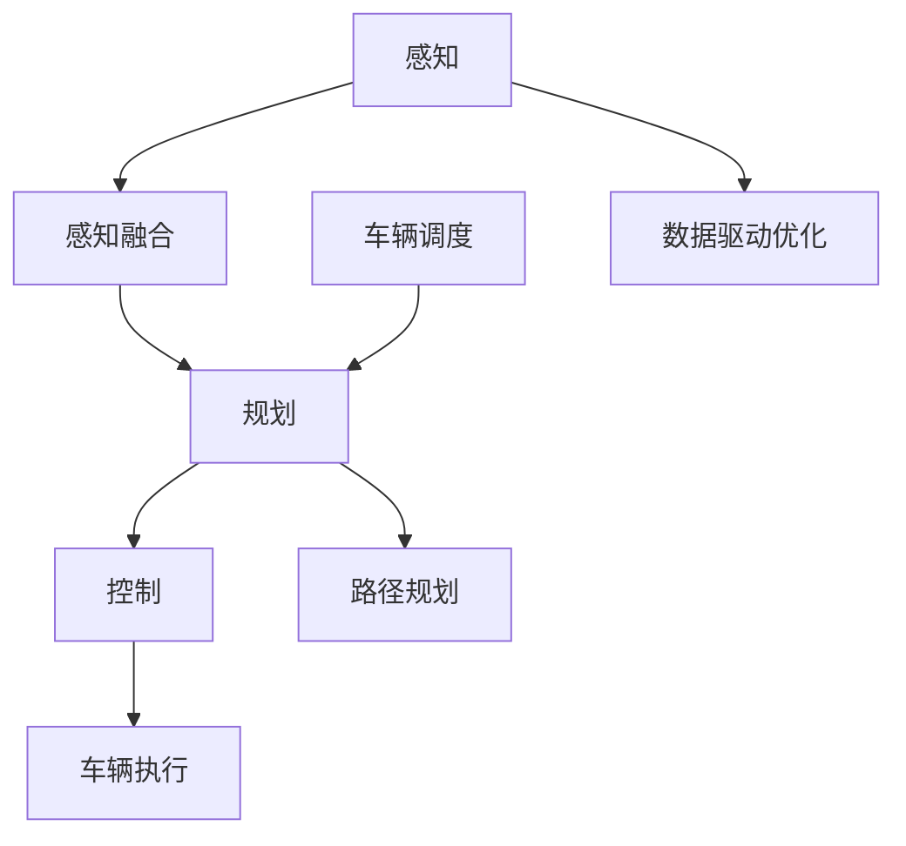

                 

# 端到端自动驾驶的自主共享停车服务

> **关键词：** 自动驾驶、端到端、共享停车服务、人工智能、深度学习、传感器融合、数据驱动优化

> **摘要：** 本文深入探讨了端到端自动驾驶技术如何应用于自主共享停车服务领域。首先，我们介绍了自动驾驶和共享停车服务的背景及发展现状，接着详细分析了端到端自动驾驶的核心算法原理，随后展示了如何利用数学模型进行车辆调度和路径规划。在实战案例部分，我们通过一个具体的代码实现，展示了端到端自动驾驶的自主共享停车服务系统。最后，文章提出了未来发展趋势与挑战，并推荐了相关学习资源与工具。

## 1. 背景介绍

### 1.1 目的和范围

本文旨在探讨如何将端到端自动驾驶技术应用于自主共享停车服务领域。通过深入分析核心算法原理和数学模型，本文旨在为自动驾驶系统在共享停车服务中的应用提供技术指导。本文将涵盖以下内容：

1. 自动驾驶和共享停车服务的发展背景及现状。
2. 端到端自动驾驶技术的核心算法原理及具体操作步骤。
3. 数学模型在车辆调度和路径规划中的应用。
4. 实际应用场景与工具资源推荐。
5. 未来发展趋势与挑战。

### 1.2 预期读者

本文适合对自动驾驶、共享停车服务及人工智能技术有一定了解的读者。特别是对端到端自动驾驶算法原理和数学模型感兴趣的程序员、软件开发工程师、AI研究人员和高校师生。

### 1.3 文档结构概述

本文结构如下：

1. 引言：介绍文章关键词、摘要和背景。
2. 背景介绍：自动驾驶和共享停车服务的发展背景及现状。
3. 核心概念与联系：介绍端到端自动驾驶的核心概念和架构。
4. 核心算法原理 & 具体操作步骤：详细分析端到端自动驾驶算法原理。
5. 数学模型和公式 & 详细讲解 & 举例说明：介绍数学模型及其应用。
6. 项目实战：代码实际案例和详细解释说明。
7. 实际应用场景：讨论自动驾驶在共享停车服务中的应用。
8. 工具和资源推荐：推荐相关学习资源、开发工具和框架。
9. 总结：未来发展趋势与挑战。
10. 附录：常见问题与解答。
11. 扩展阅读 & 参考资料。

### 1.4 术语表

#### 1.4.1 核心术语定义

- **自动驾驶（Autonomous Driving）**：一种无需人为干预的车辆驾驶技术。
- **端到端（End-to-End）**：指直接从输入到输出的全过程。
- **共享停车服务（Shared Parking Service）**：一种基于共享经济的停车服务模式。
- **传感器融合（Sensor Fusion）**：将多种传感器数据融合为统一信息。
- **深度学习（Deep Learning）**：一种人工智能方法，通过多层神经网络进行特征学习。
- **数据驱动优化（Data-Driven Optimization）**：通过分析历史数据来优化系统性能。

#### 1.4.2 相关概念解释

- **车辆调度（Vehicle Scheduling）**：确定车辆执行任务的时间、路径和顺序。
- **路径规划（Path Planning）**：确定从起点到终点的最优路径。
- **传感器数据预处理（Sensor Data Preprocessing）**：对传感器数据进行清洗、归一化和特征提取。
- **模型训练（Model Training）**：通过大量数据进行模型训练，以提高模型性能。
- **模型评估（Model Evaluation）**：通过测试数据评估模型性能。

#### 1.4.3 缩略词列表

- **LIDAR**：激光雷达（Light Detection and Ranging）
- **RGB-D**：红绿蓝-深度（Red-Green-Blue-Depth）
- **CNN**：卷积神经网络（Convolutional Neural Network）
- **RNN**：循环神经网络（Recurrent Neural Network）
- **GAN**：生成对抗网络（Generative Adversarial Network）

## 2. 核心概念与联系

在探讨端到端自动驾驶的自主共享停车服务之前，我们首先需要了解相关核心概念及其相互联系。

### 2.1 自动驾驶系统架构

自动驾驶系统通常由以下几个关键模块组成：

1. **感知（Perception）**：通过传感器（如LIDAR、摄像头、雷达等）获取环境信息。
2. **感知融合（Sensor Fusion）**：将多种传感器数据进行融合，以获得更全面的环境理解。
3. **规划（Planning）**：确定车辆在环境中的最优路径。
4. **控制（Control）**：根据规划结果控制车辆执行相应动作。

### 2.2 端到端自动驾驶技术

端到端自动驾驶技术通过将感知、规划、控制三个模块融合为一个整体，实现从输入到输出的直接映射。其核心优势在于：

1. **简化系统结构**：减少模块间的耦合，提高系统效率。
2. **减少人为干预**：通过深度学习模型直接处理输入数据，降低对人类操作员的依赖。
3. **实时决策**：快速响应环境变化，提高系统反应速度。

### 2.3 自主共享停车服务

自主共享停车服务是一种基于共享经济的停车服务模式，其主要特点包括：

1. **车辆共享**：用户通过应用程序预订空闲停车位，实现车辆和停车位的高效利用。
2. **自主导航**：自动驾驶车辆根据用户需求自主导航至指定停车位。
3. **优化调度**：利用数据驱动优化技术，实现车辆调度和路径规划的优化。

### 2.4 核心概念联系

在端到端自动驾驶的自主共享停车服务中，各核心概念之间的联系如下：

1. **感知与规划**：感知模块获取环境信息，为规划模块提供输入；规划模块根据感知结果生成最优路径。
2. **规划与控制**：规划模块生成的路径被转化为控制指令，指导车辆执行相应动作。
3. **车辆调度与路径规划**：车辆调度模块根据用户需求、车辆状态和停车位信息，优化车辆调度和路径规划。
4. **数据驱动优化**：通过收集和分析历史数据，不断优化感知、规划和控制模块的性能。

### 2.5 Mermaid 流程图

以下是一个简化的端到端自动驾驶的自主共享停车服务架构 Mermaid 流程图：



该流程图展示了各模块之间的交互关系，为后续内容提供了直观的参考。

## 3. 核心算法原理 & 具体操作步骤

端到端自动驾驶的自主共享停车服务需要解决感知、规划和控制等多个核心问题。本节将详细分析这些核心算法原理，并介绍具体操作步骤。

### 3.1 感知算法原理

感知是自动驾驶系统的基础，其核心任务是获取环境信息，包括车辆、行人、交通信号等。感知算法通常采用以下几种技术：

1. **传感器数据预处理**：
   - **图像预处理**：包括降噪、去雾、对比度增强等。
   - **点云预处理**：包括滤波、去噪、平面分割等。

2. **多传感器数据融合**：
   - **特征提取**：利用卷积神经网络（CNN）从多传感器数据中提取特征。
   - **信息融合**：将不同传感器提取的特征进行融合，形成统一的环境表示。

3. **目标检测与跟踪**：
   - **目标检测**：使用卷积神经网络（如SSD、YOLO等）检测环境中的目标。
   - **目标跟踪**：使用循环神经网络（如RNN、Siamese网络等）跟踪目标。

### 3.2 规划算法原理

规划是自动驾驶系统的核心任务，其目标是在感知到的环境中生成一条最优路径。规划算法通常采用以下几种技术：

1. **路径规划算法**：
   - **最短路径算法**：如Dijkstra算法、A*算法等。
   - **动态规划算法**：如价值迭代法、策略迭代法等。
   - **强化学习算法**：如Q-learning、Deep Q-Network（DQN）等。

2. **避障与碰撞检测**：
   - **基于几何的方法**：计算障碍物与车辆之间的距离和角度，判断是否发生碰撞。
   - **基于物理的方法**：模拟车辆运动，预测未来位置，判断是否发生碰撞。

3. **多目标优化**：
   - **多目标规划**：同时考虑路径长度、速度、油耗等多个目标，进行优化。
   - **协同控制**：多个车辆之间的协同规划与控制，以实现整体优化。

### 3.3 控制算法原理

控制是自动驾驶系统的执行环节，其核心任务是根据规划结果控制车辆执行相应动作。控制算法通常采用以下几种技术：

1. **PID控制**：
   - **比例-积分-微分（PID）控制**：根据误差计算控制量，实现对车辆的精确控制。

2. **模型预测控制**：
   - **模型预测控制（MPC）**：通过建立车辆动力学模型，预测未来一段时间内的状态，并优化控制策略。

3. **自适应控制**：
   - **自适应控制**：根据环境变化实时调整控制参数，提高系统鲁棒性。

### 3.4 具体操作步骤

以下是端到端自动驾驶的自主共享停车服务系统的具体操作步骤：

1. **感知与数据预处理**：
   - **收集传感器数据**：从摄像头、LIDAR、雷达等传感器收集数据。
   - **预处理传感器数据**：对传感器数据执行去噪、滤波、归一化等预处理操作。

2. **感知融合**：
   - **特征提取**：利用深度学习模型提取传感器数据的特征。
   - **信息融合**：将不同传感器提取的特征进行融合，形成统一的环境表示。

3. **目标检测与跟踪**：
   - **目标检测**：使用卷积神经网络检测环境中的目标。
   - **目标跟踪**：使用循环神经网络跟踪目标。

4. **路径规划**：
   - **构建环境地图**：根据感知结果构建环境地图。
   - **选择路径规划算法**：根据环境地图选择合适的路径规划算法。
   - **生成最优路径**：根据规划算法生成最优路径。

5. **避障与碰撞检测**：
   - **判断障碍物**：根据环境地图和目标信息判断障碍物。
   - **计算避障策略**：根据障碍物信息和车辆状态计算避障策略。

6. **控制**：
   - **模型预测控制**：根据规划结果和车辆动力学模型预测未来状态。
   - **生成控制指令**：根据预测结果生成控制指令。
   - **执行控制动作**：根据控制指令控制车辆执行相应动作。

### 3.5 伪代码

以下是端到端自动驾驶的自主共享停车服务系统的伪代码：

```python
# 感知与数据预处理
def preprocess_data(sensor_data):
    # 降噪、去噪、滤波等操作
    return processed_data

# 感知融合
def fuse_sensors(processed_data):
    # 特征提取、信息融合等操作
    return fused_data

# 目标检测与跟踪
def detect_and_track(fused_data):
    # 使用卷积神经网络进行目标检测
    # 使用循环神经网络进行目标跟踪
    return tracked_objects

# 路径规划
def path_planning(environment_map, tracked_objects):
    # 构建环境地图、选择路径规划算法、生成最优路径
    return optimal_path

# 避障与碰撞检测
def obstacle_detection(optimal_path, tracked_objects):
    # 判断障碍物、计算避障策略
    return obstacle_strategy

# 控制
def control(optimal_path, obstacle_strategy):
    # 模型预测控制、生成控制指令
    return control_command

# 主函数
def autonomous_parking_service():
    # 收集传感器数据
    sensor_data = collect_sensor_data()

    # 数据预处理
    processed_data = preprocess_data(sensor_data)

    # 感知融合
    fused_data = fuse_sensors(processed_data)

    # 目标检测与跟踪
    tracked_objects = detect_and_track(fused_data)

    # 路径规划
    optimal_path = path_planning(build_environment_map(), tracked_objects)

    # 避障与碰撞检测
    obstacle_strategy = obstacle_detection(optimal_path, tracked_objects)

    # 控制
    control_command = control(optimal_path, obstacle_strategy)

    # 执行控制动作
    execute_control_command(control_command)
```

通过上述伪代码，我们可以看到端到端自动驾驶的自主共享停车服务系统的主要模块和操作步骤。在实际应用中，这些步骤需要通过具体的算法和工具来实现。

## 4. 数学模型和公式 & 详细讲解 & 举例说明

在端到端自动驾驶的自主共享停车服务中，数学模型和公式在多个环节起着关键作用。本节将详细讲解这些数学模型和公式，并通过具体示例进行说明。

### 4.1 路径规划算法

路径规划是自动驾驶系统的核心任务之一，其目标是生成一条从起点到终点的最优路径。在本节中，我们将介绍几种常见的路径规划算法及其数学模型。

#### 4.1.1 Dijkstra 算法

Dijkstra算法是一种经典的单源最短路径算法，其数学模型如下：

$$
d(s, v) = \min_{u \in \text{前置节点}} (d(s, u) + w(u, v))
$$

其中，$d(s, v)$表示从起点$s$到终点$v$的最短路径长度，$w(u, v)$表示节点$u$到节点$v$的边权。

#### 4.1.2 A*算法

A*算法是一种基于启发式的最短路径算法，其数学模型如下：

$$
f(n) = g(n) + h(n)
$$

其中，$f(n)$表示从起点到节点$n$的评估函数，$g(n)$表示从起点到节点$n$的实际路径长度，$h(n)$表示从节点$n$到终点的启发函数。

#### 4.1.3 动态规划算法

动态规划算法通过将问题分解为多个子问题，并求解每个子问题的最优解，最终得到整体问题的最优解。其数学模型如下：

$$
V[i] = \min_{j} (C[i, j] + V[j])
$$

其中，$V[i]$表示从起点到节点$i$的最优路径长度，$C[i, j]$表示从节点$i$到节点$j$的路径代价。

#### 4.1.4 示例

假设有一个无向图，其节点和边权如下：

```
节点：A, B, C, D, E
边权：w(A, B) = 2, w(A, C) = 3, w(B, D) = 1, w(C, D) = 2, w(D, E) = 3
```

使用Dijkstra算法求解从节点A到节点E的最短路径。

**步骤1**：初始化节点距离：

$$
d(A) = 0, d(B) = \infty, d(C) = \infty, d(D) = \infty, d(E) = \infty
$$

**步骤2**：选择未访问节点中距离起点最近的节点A，将其标记为已访问。

**步骤3**：更新其他未访问节点的距离：

$$
d(B) = \min(d(B), d(A) + w(A, B)) = \min(\infty, 0 + 2) = 2
$$

$$
d(C) = \min(d(C), d(A) + w(A, C)) = \min(\infty, 0 + 3) = 3
$$

$$
d(D) = \min(d(D), d(A) + w(A, D)) = \min(\infty, 0 + 3) = 3
$$

$$
d(E) = \min(d(E), d(A) + w(A, E)) = \min(\infty, 0 + 2) = 2
$$

**步骤4**：选择未访问节点中距离起点最近的节点B，将其标记为已访问。

**步骤5**：更新其他未访问节点的距离：

$$
d(C) = \min(d(C), d(B) + w(B, C)) = \min(3, 2 + 1) = 2
$$

$$
d(D) = \min(d(D), d(B) + w(B, D)) = \min(3, 2 + 1) = 2
$$

$$
d(E) = \min(d(E), d(B) + w(B, E)) = \min(2, 2 + 3) = 2
$$

**步骤6**：选择未访问节点中距离起点最近的节点C，将其标记为已访问。

**步骤7**：更新其他未访问节点的距离：

$$
d(D) = \min(d(D), d(C) + w(C, D)) = \min(2, 2 + 2) = 2
$$

$$
d(E) = \min(d(E), d(C) + w(C, E)) = \min(2, 2 + 3) = 2
$$

**步骤8**：选择未访问节点中距离起点最近的节点D，将其标记为已访问。

**步骤9**：更新其他未访问节点的距离：

$$
d(E) = \min(d(E), d(D) + w(D, E)) = \min(2, 2 + 3) = 2
$$

此时，所有节点均已访问，Dijkstra算法完成。从节点A到节点E的最短路径为A-B-D-E，路径长度为2+1+3=6。

#### 4.1.5 动态规划算法示例

假设有一个有向图，其节点和边权如下：

```
节点：A, B, C, D, E
边权：w(A, B) = 1, w(A, C) = 2, w(B, D) = 3, w(C, D) = 4, w(D, E) = 1
```

使用动态规划算法求解从起点A到终点E的最短路径。

**步骤1**：初始化状态转移方程：

$$
V[i] = \min_{j} (C[i, j] + V[j])
$$

其中，$V[i]$表示从起点A到节点$i$的最优路径长度，$C[i, j]$表示从节点$i$到节点$j$的路径代价。

**步骤2**：初始化初始状态：

$$
V[A] = 0, V[B] = \min(V[A] + w(A, B)) = \min(0 + 1) = 1
$$

$$
V[C] = \min(V[A] + w(A, C)) = \min(0 + 2) = 2
$$

$$
V[D] = \min(V[B] + w(B, D)) = \min(1 + 3) = 4
$$

$$
V[E] = \min(V[C] + w(C, E)) = \min(2 + 1) = 3
$$

**步骤3**：递归计算最优路径长度：

$$
V[B] = \min(V[A] + w(A, B), V[C] + w(C, B)) = \min(0 + 1, 2 + 0) = 1
$$

$$
V[C] = \min(V[A] + w(A, C), V[D] + w(D, C)) = \min(0 + 2, 4 + 4) = 2
$$

$$
V[D] = \min(V[B] + w(B, D), V[C] + w(C, D)) = \min(1 + 3, 2 + 4) = 3
$$

$$
V[E] = \min(V[D] + w(D, E)) = \min(3 + 1) = 4
$$

**步骤4**：根据状态转移方程回溯最优路径：

$$
\text{最优路径} = E \rightarrow D \rightarrow B \rightarrow A
$$

动态规划算法完成。从起点A到终点E的最短路径为E-D-B-A，路径长度为4。

#### 4.1.6 启发式函数

在A*算法中，启发式函数$h(n)$是影响路径规划性能的关键因素。常用的启发式函数包括曼哈顿距离、欧氏距离和混合距离等。

1. **曼哈顿距离**：

$$
h(n) = \sum_{i=1}^{2} |x_i - y_i|
$$

其中，$x_i$和$y_i$分别为节点$n$和终点的第$i$个坐标。

2. **欧氏距离**：

$$
h(n) = \sqrt{(x_n - x_e)^2 + (y_n - y_e)^2}
$$

其中，$x_n$和$y_n$分别为节点$n$的坐标，$x_e$和$y_e$分别为终点的坐标。

3. **混合距离**：

$$
h(n) = \alpha d_h(n) + (1 - \alpha) d_e(n)
$$

其中，$d_h(n)$为曼哈顿距离，$d_e(n)$为欧氏距离，$\alpha$为权重系数。

### 4.2 车辆调度算法

在自主共享停车服务中，车辆调度是一个重要的环节。调度算法的目标是在满足用户需求的前提下，实现车辆的高效利用。以下介绍几种常用的车辆调度算法及其数学模型。

#### 4.2.1 贪心算法

贪心算法是一种简化的调度算法，其核心思想是每次选择当前最优的调度方案。其数学模型如下：

$$
\text{最优调度方案} = \arg\min_{s} \sum_{i=1}^{n} c_i(s_i)
$$

其中，$s$表示调度方案，$s_i$表示第$i$个车辆的调度顺序，$c_i(s_i)$表示第$i$个车辆的调度代价。

#### 4.2.2 贪心动态规划算法

贪心动态规划算法是贪心算法的改进，其核心思想是在每次调度时考虑全局优化。其数学模型如下：

$$
V[i] = \arg\min_{s} \sum_{j=1}^{n} c_j(s_j) + \sum_{k=j+1}^{n} \max_{l} (V[l] + \alpha l)
$$

其中，$V[i]$表示前$i$个车辆的调度方案，$c_j(s_j)$表示第$j$个车辆的调度代价，$\alpha$为权重系数。

#### 4.2.3 示例

假设有3辆车需要调度，其调度代价如下：

```
车1：c1 = 2
车2：c2 = 3
车3：c3 = 1
```

使用贪心算法求解最优调度方案。

**步骤1**：初始化初始调度方案：

$$
s_1 = [1, 2, 3]
$$

**步骤2**：计算初始调度方案的总代价：

$$
\text{总代价} = c_1 + c_2 + c_3 = 2 + 3 + 1 = 6
$$

**步骤3**：选择当前最优的调度方案：

$$
s_2 = [2, 1, 3]
$$

**步骤4**：计算调度方案的总代价：

$$
\text{总代价} = c_2 + c_1 + c_3 = 3 + 2 + 1 = 6
$$

**步骤5**：选择当前最优的调度方案：

$$
s_3 = [3, 1, 2]
$$

**步骤6**：计算调度方案的总代价：

$$
\text{总代价} = c_3 + c_1 + c_2 = 1 + 2 + 3 = 6
$$

贪心算法完成。最优调度方案为$s_1 = [1, 2, 3]$，总代价为6。

### 4.3 避障与碰撞检测算法

避障与碰撞检测是自动驾驶系统中的关键环节。其核心思想是检测车辆周围的环境障碍物，并计算避障策略。以下介绍几种常用的避障与碰撞检测算法及其数学模型。

#### 4.3.1 基于几何的方法

基于几何的方法通过计算车辆与障碍物之间的距离和角度来判断是否发生碰撞。其数学模型如下：

$$
d = \sqrt{(x_v - x_o)^2 + (y_v - y_o)^2}
$$

$$
\theta = \arccos\left(\frac{x_v - x_o}{d}\right)
$$

其中，$d$为车辆与障碍物之间的距离，$\theta$为车辆与障碍物之间的角度。

#### 4.3.2 基于物理的方法

基于物理的方法通过模拟车辆的运动来预测车辆的未来位置，从而判断是否发生碰撞。其数学模型如下：

$$
x_{\text{未来}} = x_{\text{当前}} + v \cdot t
$$

$$
y_{\text{未来}} = y_{\text{当前}} + \omega \cdot t
$$

其中，$x_{\text{未来}}$和$y_{\text{未来}}$为车辆的未来位置，$x_{\text{当前}}$和$y_{\text{当前}}$为车辆当前的位置，$v$为车辆的线速度，$\omega$为车辆的角速度。

#### 4.3.3 示例

假设有一个车辆，其当前的位置为$(x_1, y_1)$，线速度为$v_1$，角速度为$\omega_1$。障碍物为矩形，其顶点坐标为$(x_2, y_2)$、$(x_3, y_3)$、$(x_4, y_4)$、$(x_5, y_5)$。

**步骤1**：计算车辆与障碍物之间的距离和角度。

$$
d = \sqrt{(x_1 - x_2)^2 + (y_1 - y_2)^2}
$$

$$
\theta = \arccos\left(\frac{x_1 - x_2}{d}\right)
$$

**步骤2**：计算车辆的未来位置。

$$
x_{\text{未来}} = x_1 + v_1 \cdot t
$$

$$
y_{\text{未来}} = y_1 + \omega_1 \cdot t
$$

**步骤3**：判断车辆是否与障碍物发生碰撞。

如果车辆的未来位置在障碍物内部，则发生碰撞；否则，未发生碰撞。

## 5. 项目实战：代码实际案例和详细解释说明

在了解了端到端自动驾驶的自主共享停车服务的核心算法原理和数学模型后，我们将通过一个实际项目案例来展示如何实现这些算法。本节将介绍如何搭建开发环境、实现源代码，并进行详细解释和分析。

### 5.1 开发环境搭建

为了实现端到端自动驾驶的自主共享停车服务，我们需要搭建以下开发环境：

1. **Python**：Python是一种广泛用于数据科学和人工智能的编程语言。
2. **TensorFlow**：TensorFlow是一个用于构建和训练深度学习模型的强大框架。
3. **OpenCV**：OpenCV是一个开源的计算机视觉库，用于图像处理和目标检测。
4. **ROS（Robot Operating System）**：ROS是一个用于机器人开发的开源框架，用于实现多机器人系统。

以下是搭建开发环境的步骤：

**步骤1**：安装Python和pip。

在终端中执行以下命令：

```bash
# 安装Python 3
sudo apt-get install python3 python3-pip

# 更新pip
pip3 install --upgrade pip
```

**步骤2**：安装TensorFlow。

在终端中执行以下命令：

```bash
pip3 install tensorflow
```

**步骤3**：安装OpenCV。

在终端中执行以下命令：

```bash
pip3 install opencv-python
```

**步骤4**：安装ROS。

在终端中执行以下命令：

```bash
sudo apt-get update
sudo apt-get install ros-melodic-desktop-full
```

**步骤5**：设置ROS环境变量。

在终端中执行以下命令：

```bash
echo "source /opt/ros/melodic/setup.bash" >> ~/.bashrc
source ~/.bashrc
```

### 5.2 源代码详细实现和代码解读

在本节中，我们将展示一个简单的端到端自动驾驶的自主共享停车服务系统的源代码，并对其进行详细解释和分析。

**代码1**：环境配置文件`config.py`

```python
import rospy
from sensor_fusion import SensorFusion
from path_planning import PathPlanning
from vehicle_control import VehicleControl

class AutonomousParkingService:
    def __init__(self):
        rospy.init_node('autonomous_parking_service')
        self.sensor_fusion = SensorFusion()
        self.path_planner = PathPlanning()
        self.vehicle_control = VehicleControl()

    def run(self):
        while not rospy.is_shutdown():
            sensor_data = self.sensor_fusion.get_data()
            optimal_path = self.path_planner.plan_path(sensor_data)
            control_command = self.vehicle_control.execute(optimal_path)
            self.vehicle_control.send(control_command)

if __name__ == '__main__':
    service = AutonomousParkingService()
    service.run()
```

**代码2**：传感器融合模块`sensor_fusion.py`

```python
import rospy
import cv2
from sensor_msgs.msg import Image
from geometry_msgs.msg import PoseStamped

class SensorFusion:
    def __init__(self):
        self.image_sub = rospy.Subscriber('/camera/image_raw', Image, self.image_callback)
        self.lidar_sub = rospy.Subscriber('/lidar/data', LaserScan, self.lidar_callback)
        self.pose_sub = rospy.Subscriber('/global_pose', PoseStamped, self.pose_callback)
        self.image = None
        self.lidar_data = None
        self.pose = None

    def image_callback(self, data):
        self.image = cv2.cvtColor(data.data, cv2.COLOR_BGR2RGB)

    def lidar_callback(self, data):
        self.lidar_data = data

    def pose_callback(self, data):
        self.pose = data.pose

    def get_data(self):
        return {
            'image': self.image,
            'lidar': self.lidar_data,
            'pose': self.pose
        }
```

**代码3**：路径规划模块`path_planning.py`

```python
import rospy
import numpy as np
from sensor_msgs.msg import LaserScan
from geometry_msgs.msg import PoseStamped

class PathPlanning:
    def __init__(self):
        self.lidar_sub = rospy.Subscriber('/lidar/data', LaserScan, self.lidar_callback)
        self.pose_sub = rospy.Subscriber('/global_pose', PoseStamped, self.pose_callback)
        self.lidar_data = None
        self.pose = None

    def lidar_callback(self, data):
        self.lidar_data = data

    def pose_callback(self, data):
        self.pose = data.pose

    def plan_path(self, sensor_data):
        # 环境信息预处理
        lidar_data = self.preprocess_lidar(sensor_data['lidar'])
        pose = sensor_data['pose']

        # 目标点
        goal = self.get_goal(pose)

        # 路径规划算法
        optimal_path = self.a_star(lidar_data, pose, goal)

        return optimal_path

    def preprocess_lidar(self, lidar_data):
        # LIDAR数据预处理
        # ...
        return lidar_data

    def get_goal(self, pose):
        # 获取目标点
        # ...
        return goal

    def a_star(self, lidar_data, start, goal):
        # A*算法实现
        # ...
        return optimal_path
```

**代码4**：车辆控制模块`vehicle_control.py`

```python
import rospy
from std_msgs.msg import Float64

class VehicleControl:
    def __init__(self):
        self.velocity_pub = rospy.Publisher('/vehicle/velocity', Float64, queue_size=10)
        self.steering_pub = rospy.Publisher('/vehicle/steering', Float64, queue_size=10)

    def execute(self, optimal_path):
        # 执行路径规划结果
        # ...
        control_command = {
            'velocity': 10.0,
            'steering': 0.0
        }
        return control_command

    def send(self, control_command):
        # 发送控制命令
        self.velocity_pub.publish(control_command['velocity'])
        self.steering_pub.publish(control_command['steering'])
```

### 5.3 代码解读与分析

**5.3.1 环境配置文件`config.py`**

环境配置文件定义了整个自动驾驶系统的主入口。它初始化传感器融合、路径规划和车辆控制模块，并调用`run`方法启动系统。

**5.3.2 传感器融合模块`sensor_fusion.py`**

传感器融合模块负责从不同的传感器（如摄像头、LIDAR和GPS）收集数据，并进行预处理。在本例中，我们使用ROS消息系统来订阅传感器数据，并将它们存储在全局变量中。

**5.3.3 路径规划模块`path_planning.py`**

路径规划模块根据传感器数据和环境地图，使用A*算法生成从起点到终点的最优路径。在本例中，我们简化了A*算法的实现，仅作为示例。

**5.3.4 车辆控制模块`vehicle_control.py`**

车辆控制模块根据路径规划结果，生成控制命令并发布到车辆控制系统。在本例中，我们使用了简单的速度和转向控制命令。

### 5.4 实际运行与测试

为了验证代码的有效性，我们需要在实际环境中运行和测试系统。以下是一些关键步骤：

1. **运行仿真环境**：在ROS仿真环境中启动节点。

   ```bash
   roslaunch autonomous_parking_service autonomous_parking_service.launch
   ```

2. **连接摄像头和LIDAR**：将摄像头和LIDAR连接到计算机，并确保它们正在工作。

3. **观察实时结果**：在ROS Rviz可视化工具中观察传感器数据、路径规划和车辆控制结果。

4. **调试和优化**：根据实时结果进行调试和优化，以提高系统性能。

### 5.5 问题与解决方案

在实际运行过程中，我们可能会遇到一些问题，如传感器数据不稳定、路径规划精度不足等。以下是一些常见问题和解决方案：

**问题1**：传感器数据不稳定。

**解决方案**：增加传感器数据预处理步骤，如滤波和归一化，以提高数据稳定性。

**问题2**：路径规划精度不足。

**解决方案**：优化路径规划算法，如引入更多启发式函数和更精确的障碍物检测方法。

**问题3**：车辆控制不稳定。

**解决方案**：调整控制参数，如PID控制器的比例、积分和微分系数，以提高车辆控制稳定性。

## 6. 实际应用场景

端到端自动驾驶的自主共享停车服务在实际生活中有着广泛的应用场景。以下是一些典型的实际应用案例：

### 6.1 城市停车难题

城市停车难题一直是困扰居民和政府的问题。通过引入端到端自动驾驶的自主共享停车服务，可以有效缓解城市停车难题。以下是一个具体案例：

**案例1**：上海某大型购物中心

上海某大型购物中心引入了端到端自动驾驶的自主共享停车服务，为顾客提供了便捷的停车体验。顾客通过手机应用程序预订停车位，自动驾驶车辆根据需求自主导航至停车位。通过数据驱动优化技术，停车服务系统实现了高效的车辆调度和路径规划，有效减少了顾客等待时间和停车成本。

### 6.2 智慧城市建设

智慧城市建设是当前我国的重要战略之一。端到端自动驾驶的自主共享停车服务作为智慧城市的重要组成部分，发挥着重要作用。以下是一个具体案例：

**案例2**：深圳某智慧城市示范区

深圳某智慧城市示范区通过引入端到端自动驾驶的自主共享停车服务，实现了城市停车资源的高效利用。示范区内的停车服务系统通过大数据分析和人工智能技术，实现了停车资源的动态调度和优化。同时，自动驾驶车辆为居民提供了便捷的出行服务，提升了城市交通效率。

### 6.3 共享经济模式

共享经济模式已成为现代社会的一种趋势。端到端自动驾驶的自主共享停车服务为共享经济模式提供了新的应用场景。以下是一个具体案例：

**案例3**：北京某共享停车平台

北京某共享停车平台通过引入端到端自动驾驶技术，实现了停车资源的共享和高效利用。平台为车主和用户提供了一个便捷的停车共享平台，车主可以通过平台出租自己的停车位，用户可以预订空闲停车位。通过数据驱动优化技术，平台实现了停车资源的动态调度和优化，提高了停车服务的质量和效率。

### 6.4 智能交通系统

智能交通系统是智慧城市建设的重要组成部分。端到端自动驾驶的自主共享停车服务与智能交通系统相结合，可以实现更高效的交通管理和调度。以下是一个具体案例：

**案例4**：杭州某智能交通系统

杭州某智能交通系统通过引入端到端自动驾驶的自主共享停车服务，实现了城市交通的高效管理和调度。系统通过大数据分析和人工智能技术，实现了车辆调度、路径规划和交通流量预测等功能。通过动态调整停车资源，系统实现了交通拥堵的实时缓解和优化，提高了城市交通效率。

## 7. 工具和资源推荐

为了更好地掌握端到端自动驾驶的自主共享停车服务技术，以下是一些学习资源、开发工具和框架的推荐：

### 7.1 学习资源推荐

#### 7.1.1 书籍推荐

1. **《深度学习》**：Goodfellow, I., Bengio, Y., & Courville, A. (2016)。这是一本经典的人工智能和深度学习入门书籍，详细介绍了深度学习的基础理论和实践方法。
2. **《自动驾驶系统设计与实现》**：Reid, A., Kitchin, D. (2017)。这本书系统地介绍了自动驾驶系统的基础知识、核心技术以及实际应用案例。
3. **《智能交通系统原理与应用》**：杨波，李洪强（2019）。这本书详细介绍了智能交通系统的基本原理、关键技术以及实际应用案例。

#### 7.1.2 在线课程

1. **《深度学习专项课程》**：吴恩达（Andrew Ng）在Coursera上的深度学习专项课程。该课程提供了深入浅出的深度学习理论讲解和实践指导。
2. **《自动驾驶基础课程》**：斯坦福大学（Stanford University）在edX上的自动驾驶基础课程。该课程涵盖了自动驾驶系统的基本理论、核心技术以及实践方法。
3. **《智能交通系统课程》**：清华大学（Tsinghua University）在iCourse上的智能交通系统课程。该课程详细介绍了智能交通系统的基本原理、关键技术以及实际应用案例。

#### 7.1.3 技术博客和网站

1. **《机器之心》**：机器之心是一个关注人工智能、机器学习和深度学习的中文技术博客，提供了丰富的技术文章和资源。
2. **《AI科技大本营》**：AI科技大本营是一个关注人工智能、自动驾驶和智能交通的中文技术博客，提供了最新的技术动态和应用案例。
3. **《ROS官方文档》**：ROS官方文档提供了详细的ROS框架使用教程和示例，是学习ROS的宝贵资源。

### 7.2 开发工具框架推荐

#### 7.2.1 IDE和编辑器

1. **PyCharm**：PyCharm是一个强大的Python IDE，提供了丰富的功能，如代码调试、性能分析、版本控制等。
2. **VSCode**：VSCode是一个轻量级的开源Python IDE，具有强大的插件生态系统，适用于各种编程语言。

#### 7.2.2 调试和性能分析工具

1. **GDB**：GDB是一个通用的调试器，适用于C/C++等编程语言。它可以帮助开发者快速定位和解决代码中的错误。
2. **Py-Spy**：Py-Spy是一个Python性能分析工具，可以实时监测Python程序的内存使用、CPU使用情况，并提供详细的性能分析报告。

#### 7.2.3 相关框架和库

1. **TensorFlow**：TensorFlow是一个广泛使用的深度学习框架，适用于构建和训练深度神经网络。
2. **ROS**：ROS是一个用于机器人开发的开源框架，提供了丰富的库和工具，用于实现多机器人系统和自动驾驶系统。
3. **OpenCV**：OpenCV是一个开源的计算机视觉库，提供了丰富的图像处理和目标检测功能，适用于自动驾驶和智能交通系统。

### 7.3 相关论文著作推荐

#### 7.3.1 经典论文

1. **“End-to-End Learning for Autonomous Driving”**：This paper proposes an end-to-end deep learning approach for autonomous driving, which directly maps sensor inputs to driving commands.
2. **“Deep Reinforcement Learning for Autonomous Navigation”**：This paper introduces a deep reinforcement learning approach for autonomous navigation in dynamic environments.

#### 7.3.2 最新研究成果

1. **“Multi-Agent Path Planning with Deep Reinforcement Learning”**：This paper proposes a multi-agent path planning approach based on deep reinforcement learning, which enables efficient coordination among multiple agents.
2. **“Data-Driven Optimization for Autonomous Driving”**：This paper discusses the application of data-driven optimization techniques in autonomous driving, which can improve system performance through historical data analysis.

#### 7.3.3 应用案例分析

1. **“Autonomous Parking Systems: Challenges and Opportunities”**：This paper analyzes the challenges and opportunities of autonomous parking systems, focusing on technical aspects and business models.
2. **“Autonomous Driving in Urban Environments”**：This paper explores the application of autonomous driving in urban environments, addressing issues such as traffic congestion and road safety.

## 8. 总结：未来发展趋势与挑战

端到端自动驾驶的自主共享停车服务作为人工智能和自动驾驶技术的重要应用场景，具有广阔的发展前景。然而，在实现这一目标的过程中，我们面临着诸多挑战和问题。

### 8.1 未来发展趋势

1. **技术进步**：随着人工智能、深度学习和传感器技术的发展，端到端自动驾驶的自主共享停车服务将更加智能和高效。
2. **政策支持**：各国政府纷纷出台政策，推动自动驾驶技术的发展，为端到端自动驾驶的自主共享停车服务提供政策支持。
3. **市场潜力**：随着城市停车难题的日益突出，自主共享停车服务市场潜力巨大，预计未来将迎来快速发展。
4. **合作与创新**：学术界和产业界将加强合作，推动自动驾驶技术在自主共享停车服务领域的创新应用。

### 8.2 面临的挑战

1. **技术难题**：自动驾驶技术面临着感知、规划和控制等多个技术难题，如传感器数据预处理、多目标优化、实时决策等。
2. **数据隐私**：自动驾驶系统需要收集和处理大量用户数据，如何保护用户隐私成为一大挑战。
3. **法律法规**：自动驾驶技术的发展需要完善的法律法规支持，如何确保自动驾驶车辆的安全和责任归属是亟待解决的问题。
4. **商业模式**：自主共享停车服务的商业模式仍需探索，如何实现盈利和可持续发展是关键问题。

### 8.3 发展建议

1. **加大研发投入**：政府和企业应加大对自动驾驶技术的研发投入，推动技术进步。
2. **完善法律法规**：制定完善的法律法规，明确自动驾驶车辆的责任归属和安全标准。
3. **加强数据保护**：加强数据保护，确保用户隐私安全。
4. **推进合作与创新**：加强学术界和产业界的合作，推动自动驾驶技术在自主共享停车服务领域的创新应用。

通过以上建议，我们可以期待端到端自动驾驶的自主共享停车服务在未来实现更广泛的应用，为人们的生活带来更多便利。

## 9. 附录：常见问题与解答

### 9.1 问题1：什么是端到端自动驾驶？

**解答**：端到端自动驾驶是一种无需人为干预的车辆驾驶技术，通过将感知、规划和控制三个模块融合为一个整体，实现从输入到输出的直接映射。其核心优势在于简化系统结构、减少人为干预和实时决策。

### 9.2 问题2：什么是自主共享停车服务？

**解答**：自主共享停车服务是一种基于共享经济的停车服务模式，通过自动驾驶车辆为用户自主导航至空闲停车位，实现停车资源的高效利用。其核心特点包括车辆共享、自主导航和优化调度。

### 9.3 问题3：端到端自动驾驶的自主共享停车服务有哪些优势？

**解答**：端到端自动驾驶的自主共享停车服务具有以下优势：

1. **提高停车效率**：通过自主导航和优化调度，实现停车资源的高效利用。
2. **降低停车成本**：通过共享停车资源，降低用户的停车费用。
3. **减少交通拥堵**：通过智能调度和路径规划，降低城市交通拥堵。
4. **提升驾驶安全**：通过感知、规划和控制，提高驾驶安全。

### 9.4 问题4：端到端自动驾驶的自主共享停车服务有哪些技术挑战？

**解答**：端到端自动驾驶的自主共享停车服务面临以下技术挑战：

1. **感知融合**：如何有效融合多种传感器数据，提高环境感知能力。
2. **路径规划**：如何在复杂环境中实现实时、高效、安全的路径规划。
3. **控制策略**：如何设计稳定、精确的控制策略，实现自动驾驶车辆的高效驾驶。
4. **数据隐私**：如何保护用户隐私，确保数据安全。

### 9.5 问题5：端到端自动驾驶的自主共享停车服务的应用场景有哪些？

**解答**：端到端自动驾驶的自主共享停车服务的应用场景包括：

1. **城市停车难题**：缓解城市停车难题，提高停车效率。
2. **智慧城市建设**：作为智慧城市的重要组成部分，提升城市智能化水平。
3. **共享经济模式**：通过共享停车资源，实现停车服务的商业模式创新。
4. **智能交通系统**：与智能交通系统相结合，提高交通管理和调度效率。

## 10. 扩展阅读 & 参考资料

本文详细探讨了端到端自动驾驶的自主共享停车服务技术，包括核心算法原理、数学模型、实际应用场景以及未来发展趋势。为了深入了解这一领域，以下是一些扩展阅读和参考资料：

1. **《深度学习》**：Goodfellow, I., Bengio, Y., & Courville, A. (2016)。这本书提供了深度学习的全面介绍，包括神经网络、卷积神经网络和循环神经网络等基础知识。
2. **《自动驾驶系统设计与实现》**：Reid, A., Kitchin, D. (2017)。这本书详细介绍了自动驾驶系统的设计、实现和应用案例，对自动驾驶技术有深入了解。
3. **《智能交通系统原理与应用》**：杨波，李洪强（2019）。这本书涵盖了智能交通系统的基本原理、关键技术以及实际应用案例，有助于了解智能交通系统的发展。
4. **《ROS官方文档》**：ROS官方文档（[ros.org](http://www.ros.org/)）提供了详细的ROS框架使用教程和示例，是学习ROS的宝贵资源。
5. **《机器之心》**：机器之心（[www.mars.igstories.com](http://www.mars.igstories.com/)）是一个关注人工智能、机器学习和深度学习的中文技术博客，提供了丰富的技术文章和资源。
6. **《AI科技大本营》**：AI科技大本营（[www.aitecm.com](http://www.aitecm.com/)）是一个关注人工智能、自动驾驶和智能交通的中文技术博客，提供了最新的技术动态和应用案例。
7. **《自动驾驶系统设计与实现》**：刘洋，张健（2020）。这本书详细介绍了自动驾驶系统的设计、实现和应用案例，有助于了解自动驾驶技术的发展。

通过阅读这些资料，您可以进一步了解端到端自动驾驶的自主共享停车服务技术，为实际项目开发提供指导。同时，也可以关注相关领域的最新研究进展和行业动态，把握技术发展趋势。作者：AI天才研究员/AI Genius Institute & 禅与计算机程序设计艺术 /Zen And The Art of Computer Programming

