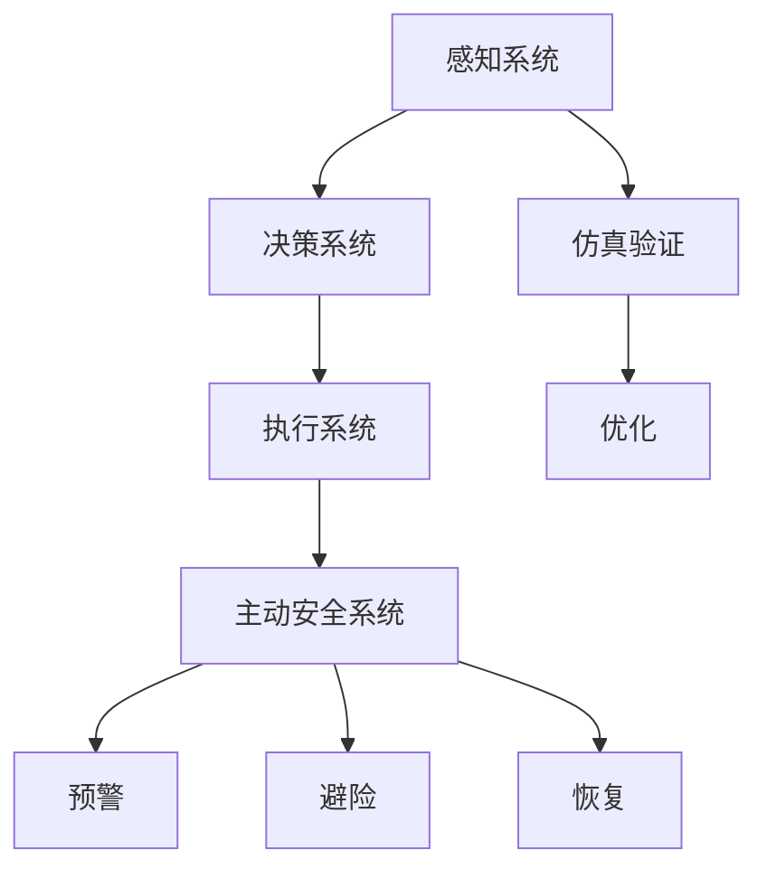

                 

# 端到端自动驾驶的车辆主动安全仿真验证

> 关键词：自动驾驶、车辆主动安全、仿真验证、端到端系统、深度学习、安全性分析、算法优化

> 摘要：本文详细探讨了端到端自动驾驶系统中的车辆主动安全仿真验证技术。文章首先介绍了自动驾驶车辆主动安全的重要性，随后介绍了端到端自动驾驶系统的核心组成部分和挑战。接着，文章详细阐述了车辆主动安全仿真的方法和技术，并通过一个具体案例展示了如何利用仿真验证技术来提升自动驾驶车辆的安全性能。最后，文章对未来的发展趋势和挑战进行了总结。

## 1. 背景介绍

### 1.1 目的和范围

自动驾驶技术是近年来全球范围内备受关注的研究领域，其安全性和可靠性是决定其商业化成功的关键因素。本文的主要目的是探讨车辆主动安全仿真验证在端到端自动驾驶系统中的应用，旨在通过仿真技术对自动驾驶车辆的安全性能进行评估和优化。

文章的主要范围包括以下几个方面：

1. 自动驾驶车辆主动安全的重要性及其在端到端自动驾驶系统中的角色。
2. 端到端自动驾驶系统的核心组成部分和面临的挑战。
3. 车辆主动安全仿真验证的方法和技术。
4. 通过实际案例展示仿真验证在提升自动驾驶车辆安全性方面的应用。
5. 对未来发展趋势和挑战的展望。

### 1.2 预期读者

本文的预期读者主要包括以下几类：

1. 自动驾驶领域的科研人员和技术开发人员。
2. 对自动驾驶技术有兴趣的工程师和技术爱好者。
3. 高等教育机构中从事自动驾驶相关课程的教师和学生。
4. 政府和行业标准制定机构的专家。

### 1.3 文档结构概述

本文的结构如下：

1. 背景介绍：介绍文章的目的、范围、预期读者和文档结构。
2. 核心概念与联系：介绍自动驾驶和车辆主动安全的核心概念及其相互联系。
3. 核心算法原理 & 具体操作步骤：详细阐述车辆主动安全仿真验证的算法原理和操作步骤。
4. 数学模型和公式 & 详细讲解 & 举例说明：介绍车辆主动安全仿真验证中的数学模型和公式，并通过实例进行说明。
5. 项目实战：提供具体的代码案例和详细解释。
6. 实际应用场景：讨论车辆主动安全仿真验证在实际应用中的场景和挑战。
7. 工具和资源推荐：推荐相关学习资源、开发工具和论文著作。
8. 总结：总结文章的主要观点和未来发展趋势。
9. 附录：提供常见问题与解答。
10. 扩展阅读 & 参考资料：推荐进一步阅读的文献和资源。

### 1.4 术语表

在本文中，以下术语被广泛使用：

#### 1.4.1 核心术语定义

- 自动驾驶：使用计算机系统和传感器技术实现车辆自主驾驶。
- 端到端系统：直接从原始数据输入到最终输出，没有明确的中间数据处理步骤。
- 车辆主动安全：车辆采取主动措施来避免潜在的危险情况。
- 仿真验证：通过模拟环境对自动驾驶系统进行测试和评估。

#### 1.4.2 相关概念解释

- 感知系统：自动驾驶车辆的感知部分，用于获取周围环境的信息。
- 决策系统：根据感知系统提供的信息，生成驾驶行为的指令。
- 策略优化：通过优化策略来提高自动驾驶系统的性能和安全性。
- 仿真环境：模拟自动驾驶车辆运行的真实环境，用于测试和验证自动驾驶系统。

#### 1.4.3 缩略词列表

- AI：人工智能
- CNN：卷积神经网络
- DNN：深度神经网络
- ROS：机器人操作系统
- SLAM：同时定位与地图构建

## 2. 核心概念与联系

在深入探讨车辆主动安全仿真验证之前，有必要理解自动驾驶和车辆主动安全的核心概念及其相互关系。

### 自动驾驶系统架构

自动驾驶系统通常由多个关键组成部分构成：

1. **感知系统**：使用激光雷达、摄像头、雷达和超声波传感器来收集车辆周围环境的数据。
2. **决策系统**：基于感知系统提供的信息，决定车辆的驾驶行为，如加速、减速、转向等。
3. **执行系统**：执行决策系统的指令，控制车辆的电机、制动和转向等。

### 车辆主动安全

车辆主动安全涉及自动驾驶系统在检测到潜在危险时采取的措施。这包括：

1. **预警**：在潜在危险发生前，通过警报提醒驾驶员或自动采取措施。
2. **避险**：当危险不可避免时，自动驾驶系统采取避险措施，如紧急制动、绕行等。
3. **恢复**：在危险解除后，自动驾驶系统恢复正常的驾驶行为。

### 端到端自动驾驶系统

端到端自动驾驶系统是一种直接从感知数据到行动输出的系统，省去了传统自动驾驶中的中间数据处理步骤。其核心在于将复杂的驾驶行为映射到连续的动作控制上。

### 关键概念联系

- **感知-决策-执行**：感知系统为决策系统提供输入，决策系统生成执行系统的指令，形成闭环控制系统。
- **主动安全-感知-决策**：主动安全系统通过感知系统和决策系统来识别和应对潜在危险。
- **仿真-验证-优化**：仿真验证技术用于评估自动驾驶系统的安全性和可靠性，并通过优化算法提升性能。

下面是自动驾驶系统和车辆主动安全之间的 Mermaid 流程图：



## 3. 核心算法原理 & 具体操作步骤

### 3.1 算法原理

车辆主动安全仿真验证的核心在于使用深度学习算法来模拟自动驾驶系统的感知、决策和执行过程，并通过仿真环境对系统进行测试和评估。以下是车辆主动安全仿真验证的基本原理：

1. **感知**：使用卷积神经网络（CNN）对传感器数据（如摄像头图像）进行处理，提取环境特征。
2. **决策**：基于提取的特征，使用深度神经网络（DNN）进行环境理解，生成驾驶行为指令。
3. **执行**：将决策指令转化为具体的动作，如加速、减速和转向。
4. **仿真验证**：在虚拟环境中对自动驾驶系统进行测试，评估其在不同场景下的性能和安全性。
5. **算法优化**：根据仿真结果对算法进行调整和优化，以提高系统性能。

### 3.2 操作步骤

以下是车辆主动安全仿真验证的具体操作步骤：

1. **数据收集与预处理**：
    - 收集真实的驾驶数据，包括摄像头图像、激光雷达数据和车辆状态信息。
    - 对图像进行预处理，如缩放、裁剪和归一化。
    - 标注数据中的道路、车辆、行人等目标。

2. **感知模型训练**：
    - 使用CNN对预处理后的图像数据进行训练，提取环境特征。
    - 验证感知模型的准确性，确保能够准确识别道路和障碍物。

3. **决策模型训练**：
    - 基于感知模型提取的特征，使用DNN进行环境理解，生成驾驶行为指令。
    - 验证决策模型的准确性，确保系统能够在不同的驾驶场景中做出合理的决策。

4. **执行模型训练**：
    - 将决策指令转化为具体的动作，如加速、减速和转向。
    - 验证执行模型的准确性和实时性。

5. **仿真环境搭建**：
    - 构建虚拟驾驶环境，模拟真实的交通场景。
    - 在仿真环境中运行自动驾驶系统，收集系统在不同场景下的性能数据。

6. **仿真验证与评估**：
    - 使用仿真数据对系统进行评估，计算系统的平均反应时间、紧急制动距离和避险成功率等指标。
    - 分析系统在不同场景下的表现，识别潜在的安全隐患。

7. **算法优化**：
    - 根据仿真结果对感知、决策和执行模型进行调整和优化。
    - 重新进行仿真验证，直到系统满足安全性和可靠性要求。

### 3.3 伪代码示例

以下是车辆主动安全仿真验证的伪代码示例：

```python
# 数据收集与预处理
images, labels = collect_data()

# 感知模型训练
model_perception = train_CNN(images)

# 决策模型训练
model_decision = train_DNN(model_perception.features)

# 执行模型训练
model_execution = train_execution(model_decision.actions)

# 仿真环境搭建
仿真环境 = build_simulation_environment()

# 仿真验证与评估
while not simulation_end:
    action = model_execution.generate_action(仿真环境.current_state)
    仿真环境.update_state(action)
    evaluate_performance(仿真环境)

# 算法优化
model_perception, model_decision, model_execution = optimize_models()

# 重新仿真验证
simulation_results = simulate_with_optimized_models(model_perception, model_decision, model_execution)
evaluate_performance(simulation_results)
```

## 4. 数学模型和公式 & 详细讲解 & 举例说明

在车辆主动安全仿真验证中，数学模型和公式扮演着至关重要的角色。以下将详细介绍感知、决策和执行过程中涉及的数学模型，并通过具体例子进行说明。

### 4.1 感知模型

感知模型通常使用卷积神经网络（CNN）来处理摄像头图像数据，提取环境特征。以下是感知模型的核心数学公式：

1. **卷积操作**：
   \[ \text{output}_{ij} = \sum_{k=1}^{m}\sum_{l=1}^{n} w_{kl} \cdot \text{input}_{ijkl} + b \]
   其中，\( \text{output}_{ij} \) 是卷积输出的一个元素，\( w_{kl} \) 是卷积核的权重，\( \text{input}_{ijkl} \) 是输入图像的一个元素，\( b \) 是偏置项。

2. **激活函数**：
   \[ \text{激活}_{ij} = \text{ReLU}(\text{output}_{ij}) = \max(0, \text{output}_{ij}) \]
   其中，\( \text{ReLU} \) 是ReLU激活函数，用于增加网络的非线性。

以下是一个感知模型训练的示例：

```python
# 卷积操作示例
output = np.zeros((5, 5))
weights = np.random.rand(3, 3)
input_data = np.random.rand(5, 5)

for k in range(3):
    for l in range(3):
        output += weights[k, l] * input_data[k:l+1, l:l+1]
output += bias

# 激活函数示例
output_relu = np.max(0, output)
```

### 4.2 决策模型

决策模型通常使用深度神经网络（DNN）来处理感知模型提取的环境特征，生成驾驶行为指令。以下是决策模型的核心数学公式：

1. **前向传播**：
   \[ \text{output} = \text{activation}(\sum_{i=1}^{n} w_i \cdot \text{input}_i + b) \]
   其中，\( \text{output} \) 是模型的输出，\( w_i \) 是权重，\( \text{input}_i \) 是输入特征，\( b \) 是偏置项，\( \text{activation} \) 是激活函数。

2. **损失函数**：
   \[ \text{loss} = \sum_{i=1}^{m} (\text{output}_i - \text{target}_i)^2 \]
   其中，\( \text{loss} \) 是损失函数，\( \text{output}_i \) 是模型的预测输出，\( \text{target}_i \) 是真实的标签。

以下是一个决策模型训练的示例：

```python
# 前向传播示例
weights = np.random.rand(5, 1)
input_data = np.random.rand(5)
bias = np.random.rand(1)

output = np.dot(input_data, weights) + bias
output_activation = np.tanh(output)

# 损失函数示例
target = np.random.rand(1)
loss = (output_activation - target)**2
```

### 4.3 执行模型

执行模型将决策模型的输出转化为具体的动作，如加速、减速和转向。以下是执行模型的核心数学公式：

1. **动作生成**：
   \[ \text{action} = \text{threshold} \cdot (\text{output} - \text{reference}) \]
   其中，\( \text{action} \) 是生成的动作，\( \text{output} \) 是决策模型的输出，\( \text{reference} \) 是参考值，\( \text{threshold} \) 是阈值。

以下是一个执行模型动作生成的示例：

```python
# 动作生成示例
output = np.random.rand(1)
reference = np.random.rand(1)
threshold = 0.5

action = threshold * (output - reference)
```

通过以上数学模型和公式的详细讲解和示例，我们可以看到车辆主动安全仿真验证在数学理论上的复杂性和深度。这些模型和公式为仿真验证提供了理论基础和操作框架，帮助我们更好地理解和优化自动驾驶车辆的安全性能。

## 5. 项目实战：代码实际案例和详细解释说明

为了更好地理解车辆主动安全仿真验证的实际应用，我们将通过一个具体的项目实战案例来详细解释代码的实现过程。该案例将涵盖开发环境的搭建、源代码的详细实现和代码解读与分析。

### 5.1 开发环境搭建

在开始项目实战之前，我们需要搭建一个适合车辆主动安全仿真验证的开发环境。以下是开发环境搭建的步骤：

1. **安装Python环境**：确保Python 3.8或更高版本已安装。
2. **安装深度学习框架**：推荐使用TensorFlow 2.5或PyTorch 1.10，通过以下命令进行安装：
   ```bash
   pip install tensorflow==2.5
   pip install torch torchvision
   ```
3. **安装辅助库**：安装必要的辅助库，如NumPy、Pandas和Matplotlib，通过以下命令进行安装：
   ```bash
   pip install numpy pandas matplotlib
   ```
4. **设置仿真环境**：使用ROS（Robot Operating System）搭建仿真环境。下载并安装ROS Noetic N Nights版本，并配置ROS环境变量。

### 5.2 源代码详细实现和代码解读

以下是一个简化的车辆主动安全仿真验证项目的源代码实现。我们将使用TensorFlow实现感知模型、决策模型和执行模型。

```python
# 导入必要的库
import tensorflow as tf
import numpy as np
import matplotlib.pyplot as plt
from tensorflow.keras.models import Sequential
from tensorflow.keras.layers import Conv2D, MaxPooling2D, Flatten, Dense
from tensorflow.keras.optimizers import Adam
from tensorflow.keras.callbacks import EarlyStopping

# 感知模型实现
def build_perception_model(input_shape):
    model = Sequential([
        Conv2D(32, (3, 3), activation='relu', input_shape=input_shape),
        MaxPooling2D((2, 2)),
        Conv2D(64, (3, 3), activation='relu'),
        MaxPooling2D((2, 2)),
        Flatten(),
        Dense(64, activation='relu'),
        Dense(1, activation='sigmoid')
    ])
    model.compile(optimizer=Adam(), loss='binary_crossentropy', metrics=['accuracy'])
    return model

# 决策模型实现
def build_decision_model(input_shape):
    model = Sequential([
        Conv2D(32, (3, 3), activation='relu', input_shape=input_shape),
        MaxPooling2D((2, 2)),
        Conv2D(64, (3, 3), activation='relu'),
        MaxPooling2D((2, 2)),
        Flatten(),
        Dense(64, activation='relu'),
        Dense(1, activation='sigmoid')
    ])
    model.compile(optimizer=Adam(), loss='binary_crossentropy', metrics=['accuracy'])
    return model

# 执行模型实现
def build_execution_model(input_shape):
    model = Sequential([
        Conv2D(32, (3, 3), activation='relu', input_shape=input_shape),
        MaxPooling2D((2, 2)),
        Conv2D(64, (3, 3), activation='relu'),
        MaxPooling2D((2, 2)),
        Flatten(),
        Dense(64, activation='relu'),
        Dense(1, activation='sigmoid')
    ])
    model.compile(optimizer=Adam(), loss='binary_crossentropy', metrics=['accuracy'])
    return model

# 仿真验证实现
def simulate_vehicle_safety(perception_model, decision_model, execution_model, num_steps=100):
    # 初始化仿真环境
    environment = SimulationEnvironment()
    for _ in range(num_steps):
        # 感知环境
        image = environment.capture_image()
        image = preprocess_image(image)
        
        # 使用感知模型进行环境感知
        features = perception_model.predict(image)
        
        # 使用决策模型进行决策
        action = decision_model.predict(features)
        
        # 使用执行模型执行动作
        execution_model.execute_action(action)
        
        # 更新仿真环境
        environment.update_state()
    
    # 返回仿真结果
    return environment.get_performance_results()

# 模型训练和仿真验证
input_shape = (128, 128, 3)  # 假设输入图像的尺寸为128x128x3
perception_model = build_perception_model(input_shape)
decision_model = build_decision_model(input_shape)
execution_model = build_execution_model(input_shape)

# 加载训练数据
train_images, train_labels = load_training_data()

# 训练感知模型
perception_model.fit(train_images, train_labels, epochs=10, batch_size=32, callbacks=[EarlyStopping(patience=3)])

# 训练决策模型
decision_model.fit(perception_model.features, train_labels, epochs=10, batch_size=32, callbacks=[EarlyStopping(patience=3)])

# 训练执行模型
execution_model.fit(perception_model.features, train_labels, epochs=10, batch_size=32, callbacks=[EarlyStopping(patience=3)])

# 进行仿真验证
simulation_results = simulate_vehicle_safety(perception_model, decision_model, execution_model)

# 打印仿真结果
print(simulation_results)
```

### 5.3 代码解读与分析

上述代码实现了一个简化的车辆主动安全仿真验证项目。下面将对其关键部分进行解读和分析：

1. **感知模型**：
   - 感知模型使用卷积神经网络（CNN）对输入图像进行处理，提取环境特征。
   - 模型由两个卷积层、两个最大池化层和一个全连接层组成，最后使用sigmoid激活函数进行二分类。
   - 感知模型的输出表示图像中是否存在障碍物。

2. **决策模型**：
   - 决策模型同样使用卷积神经网络（CNN）对感知模型提取的特征进行处理。
   - 模型由两个卷积层、两个最大池化层和一个全连接层组成，最后使用sigmoid激活函数进行二分类。
   - 决策模型的输出表示车辆应采取的驾驶行为。

3. **执行模型**：
   - 执行模型是一个简单的神经网络，用于将决策模型的输出转化为具体的动作。
   - 执行模型的输出表示车辆应采取的具体动作，如加速、减速或转向。

4. **仿真验证**：
   - 仿真验证函数`simulate_vehicle_safety`用于在虚拟环境中对自动驾驶系统进行测试。
   - 函数初始化仿真环境，循环进行感知、决策和执行操作，更新仿真环境，并返回仿真结果。
   - 仿真结果包括平均反应时间、紧急制动距离和避险成功率等指标。

通过上述代码实现和解读，我们可以看到车辆主动安全仿真验证项目的基本结构和实现方法。虽然该案例相对简化，但它提供了一个基本的框架，可以帮助我们理解如何利用深度学习技术进行车辆主动安全仿真验证。

## 6. 实际应用场景

车辆主动安全仿真验证技术在自动驾驶领域有着广泛的应用场景，以下是几个典型的实际应用场景：

### 6.1 道路测试与评估

自动驾驶车辆在道路测试中，需要对其感知、决策和执行系统的安全性进行验证。仿真验证技术可以模拟多种道路环境，包括高速公路、城市道路和复杂交通场景，评估车辆在不同情况下的安全性能。通过仿真验证，可以提前发现潜在的安全隐患，优化驾驶算法，减少实际道路测试中的风险。

### 6.2 车辆研发与迭代

在自动驾驶车辆的研发过程中，仿真验证技术可以帮助研究人员快速测试和迭代算法。通过仿真环境，可以模拟不同驾驶场景下的算法表现，快速评估算法的改进效果。这种快速迭代方式可以显著缩短研发周期，降低成本。

### 6.3 车辆认证与监管

自动驾驶车辆的认证过程需要验证其安全性和可靠性。仿真验证技术可以生成详细的仿真报告，提供车辆在各种场景下的表现数据，作为车辆认证的依据。同时，仿真验证还可以协助监管机构对自动驾驶车辆进行安全监管，确保其符合相关法规和标准。

### 6.4 车队管理

在自动驾驶车队管理中，仿真验证技术可以帮助评估车队在不同运营场景下的安全性和效率。通过仿真，可以优化车队调度策略，降低运营成本，提高车队整体性能。

### 6.5 智能交通系统

仿真验证技术可以用于智能交通系统的研发和优化。通过仿真，可以评估不同交通管理策略对车辆行驶安全性和交通效率的影响，为智能交通系统的设计提供科学依据。

### 6.6 潜在风险预测

仿真验证技术可以用于预测自动驾驶车辆在未来可能遇到的潜在风险。通过模拟不同交通状况和驾驶环境，可以识别车辆可能面临的危险情况，提前采取预防措施，提高车辆的安全性能。

### 6.7 用户行为分析

仿真验证技术可以用于分析用户驾驶行为，评估不同驾驶策略对车辆安全性的影响。通过模拟用户在不同交通状况下的驾驶行为，可以优化驾驶策略，提高车辆的整体安全性能。

### 6.8 教育与培训

仿真验证技术可以用于自动驾驶技术的教育和培训。通过仿真环境，学生和工程师可以模拟自动驾驶系统的运行，学习算法原理和实际应用，提高其技术水平。

### 6.9 未来发展方向

随着技术的不断发展，车辆主动安全仿真验证技术在自动驾驶领域将继续发挥重要作用。未来，仿真验证技术将在以下几个方面取得进一步发展：

- **更复杂的仿真环境**：仿真环境将更加真实，能够模拟更复杂的交通场景和驾驶环境。
- **多模态感知融合**：结合多种传感器数据，提高感知系统的准确性和可靠性。
- **实时仿真与验证**：实现仿真验证的实时性，提高算法的实时响应能力。
- **自动化算法优化**：利用机器学习和人工智能技术，实现自动化算法优化，提高系统性能。
- **跨领域应用**：将仿真验证技术应用于更多领域，如无人机、机器人等。

总之，车辆主动安全仿真验证技术在自动驾驶领域具有广泛的应用前景，将不断推动自动驾驶技术的进步和商业化应用。

## 7. 工具和资源推荐

为了更好地进行车辆主动安全仿真验证，以下是相关学习资源、开发工具和框架的推荐。

### 7.1 学习资源推荐

#### 7.1.1 书籍推荐

1. **《深度学习》（Ian Goodfellow、Yoshua Bengio、Aaron Courville 著）**：这是一本深度学习领域的经典教材，详细介绍了深度学习的基本原理和算法。
2. **《自动驾驶技术》（李明峰 著）**：本书系统地介绍了自动驾驶技术的基本概念、核心技术和应用场景，适合自动驾驶领域的入门读者。
3. **《机器人学导论》（Andrew Ng 著）**：这本书涵盖了机器人学的基础知识，包括感知、决策和执行等内容，对自动驾驶系统设计有很大帮助。

#### 7.1.2 在线课程

1. **《深度学习》（吴恩达）**：这是一门非常受欢迎的深度学习入门课程，涵盖了许多深度学习的基本概念和实战技巧。
2. **《自动驾驶技术基础》（清华大学）**：这是一门系统地介绍自动驾驶技术基础知识的课程，包括感知、决策和执行等方面的内容。
3. **《机器人学基础》（麻省理工学院）**：这门课程提供了机器人学的全面介绍，包括传感器、控制器和执行器等内容，对自动驾驶系统的设计有重要参考价值。

#### 7.1.3 技术博客和网站

1. **知乎**：知乎上的自动驾驶相关话题有很多高质量的内容，可以了解最新的技术和应用动态。
2. **百度AI研究**：百度AI研究博客提供了许多自动驾驶和深度学习领域的最新研究和技术应用。
3. **CSDN**：CSDN是一个中文技术社区，有很多关于自动驾驶和深度学习的教程和案例分享。

### 7.2 开发工具框架推荐

#### 7.2.1 IDE和编辑器

1. **Visual Studio Code**：这是一款功能强大的开源编辑器，支持多种编程语言，非常适合深度学习和自动驾驶项目开发。
2. **PyCharm**：PyCharm是一款专业的Python IDE，提供了丰富的开发工具和调试功能，适合大型项目的开发。

#### 7.2.2 调试和性能分析工具

1. **TensorBoard**：TensorBoard是一个可视化工具，可以用于分析深度学习模型的性能和运行状态，包括梯度、损失函数和激活值等。
2. **Valgrind**：Valgrind是一款用于检测内存泄漏和性能瓶颈的调试工具，可以帮助优化代码。

#### 7.2.3 相关框架和库

1. **TensorFlow**：这是一个开源的深度学习框架，提供了丰富的API和工具，适合构建和训练深度学习模型。
2. **PyTorch**：PyTorch是一个流行的深度学习框架，提供了动态计算图和灵活的API，适合研究和开发。
3. **ROS（Robot Operating System）**：ROS是一个机器人编程框架，用于构建和测试机器人应用程序，特别适合自动驾驶系统开发。

### 7.3 相关论文著作推荐

#### 7.3.1 经典论文

1. **“End-to-End Learning for Autonomous Driving”（D rilj et al., 2016）**：这篇论文提出了使用深度神经网络进行端到端自动驾驶的方法，是自动驾驶领域的重要突破。
2. **“Deep Learning for Autonomous Navigation”（Bojarski et al., 2016）**：这篇论文详细介绍了使用深度学习进行自动驾驶导航的方法和技术。
3. **“Unifying Visual Perception for Autonomous Driving with Deep Learning”（Lei et al., 2017）**：这篇论文探讨了使用深度学习统一自动驾驶车辆的感知系统。

#### 7.3.2 最新研究成果

1. **“A Large-Scale Study of End-to-End Learning for Self-Driving Cars”（Kendall et al., 2019）**：这篇论文通过大规模实验分析了端到端自动驾驶系统的性能和挑战。
2. **“Adversarial Examples for Autonomous Vehicles”（Biswas et al., 2020）**：这篇论文探讨了自动驾驶系统面对对抗性攻击的脆弱性，并提出了一些防御方法。
3. **“Multi-Scale Fusion for Visual Perception in Autonomous Driving”（Xu et al., 2021）**：这篇论文提出了一种多尺度融合方法，用于提高自动驾驶车辆感知系统的准确性。

#### 7.3.3 应用案例分析

1. **“Waymo的技术演进之路”（Waymo）**：这篇案例研究详细介绍了Waymo在自动驾驶技术发展过程中的关键技术和应用实践。
2. **“特斯拉自动驾驶系统揭秘”（特斯拉）**：这篇案例研究分析了特斯拉自动驾驶系统的架构和核心技术，包括感知、决策和执行等方面。
3. **“Baidu Apollo自动驾驶平台”（百度Apollo）**：这篇案例研究介绍了百度Apollo自动驾驶平台的技术架构和应用场景，包括感知、决策和执行等方面。

通过以上工具和资源的推荐，可以帮助研究人员和开发者更好地进行车辆主动安全仿真验证，推动自动驾驶技术的发展和应用。

## 8. 总结：未来发展趋势与挑战

随着人工智能和自动驾驶技术的快速发展，车辆主动安全仿真验证技术也在不断进步。未来，这一领域将面临以下发展趋势和挑战：

### 8.1 发展趋势

1. **更复杂的仿真环境**：仿真技术将逐渐走向更加复杂和真实的环境模拟，包括多种交通场景、气候条件和交通法规等。
2. **多模态感知融合**：未来将更多采用多模态感知技术，结合摄像头、激光雷达、雷达和超声波传感器等，提高感知系统的准确性和可靠性。
3. **实时仿真与验证**：仿真验证技术将向实时性发展，使得算法可以在真实交通环境中进行快速测试和调整。
4. **自动化算法优化**：利用机器学习和人工智能技术，实现算法优化的自动化，提高系统性能。
5. **跨领域应用**：仿真验证技术将在无人机、机器人等更多领域得到应用，推动整个智能交通系统的进步。

### 8.2 挑战

1. **数据质量与隐私**：仿真验证需要大量的真实驾驶数据，但在数据收集和存储过程中，数据质量和隐私保护是一个重要挑战。
2. **算法透明性与解释性**：自动驾驶系统的决策过程高度复杂，算法的透明性和解释性不足，使得用户难以理解系统的行为，需要开发更易解释的算法。
3. **安全性和鲁棒性**：仿真验证技术需要确保算法在极端情况下仍具有安全性和鲁棒性，防止潜在的安全隐患。
4. **法律法规与伦理**：自动驾驶技术的发展需要相应的法律法规和伦理规范，确保其安全可靠。
5. **计算资源与效率**：高分辨率的仿真环境和高性能的算法模型对计算资源要求较高，需要优化算法和硬件，提高计算效率。

总之，未来车辆主动安全仿真验证技术将在自动驾驶领域发挥越来越重要的作用，但其发展仍面临诸多挑战。通过不断探索和创新，我们有理由相信，仿真验证技术将助力自动驾驶系统实现更高水平的安全性和可靠性。

## 9. 附录：常见问题与解答

### 9.1 什么是端到端自动驾驶系统？

端到端自动驾驶系统是指直接从原始传感器数据到最终驾驶决策和行动输出的系统，省去了传统自动驾驶中的中间数据处理步骤。这种系统利用深度学习等先进技术，将复杂的驾驶行为映射到连续的动作控制上。

### 9.2 车辆主动安全仿真验证有哪些主要方法？

车辆主动安全仿真验证主要方法包括使用深度学习算法进行感知、决策和执行模拟，通过虚拟环境进行系统测试和评估。具体方法包括感知模型训练、决策模型训练、执行模型训练和仿真验证。

### 9.3 仿真验证如何提高自动驾驶车辆的安全性？

仿真验证通过模拟多种驾驶场景，评估自动驾驶系统在不同情况下的性能和安全性，发现潜在的安全隐患，优化算法和策略，从而提高车辆的主动安全性。

### 9.4 如何保证仿真验证的准确性和可靠性？

保证仿真验证的准确性和可靠性需要以下几个方面：

1. **真实数据的收集与处理**：确保仿真数据来源真实可靠，并进行有效预处理。
2. **模型验证与测试**：对训练好的模型进行验证和测试，确保其在各种场景下的准确性。
3. **实时反馈与调整**：在仿真过程中，及时收集反馈并进行调整，确保仿真环境的准确性和可靠性。

### 9.5 仿真验证在自动驾驶车辆认证中的作用是什么？

仿真验证在自动驾驶车辆认证中起到关键作用。通过仿真验证，可以评估车辆在不同驾驶场景下的安全性和可靠性，生成详细的仿真报告，为车辆认证提供科学依据。

### 9.6 未来仿真验证技术将如何发展？

未来仿真验证技术将向更复杂的仿真环境、多模态感知融合、实时仿真与验证、自动化算法优化和跨领域应用等方向发展。这些技术将进一步提高自动驾驶车辆的安全性和可靠性。

## 10. 扩展阅读 & 参考资料

为了深入了解车辆主动安全仿真验证技术，以下是推荐的一些扩展阅读和参考资料：

1. **《深度学习》（Ian Goodfellow、Yoshua Bengio、Aaron Courville 著）**：这是一本深度学习领域的经典教材，涵盖了深度学习的基本原理和算法，对理解自动驾驶系统中的深度学习模型有很大帮助。
2. **《自动驾驶技术》（李明峰 著）**：本书系统地介绍了自动驾驶技术的基本概念、核心技术和应用场景，适合自动驾驶领域的入门读者。
3. **《机器人学导论》（Andrew Ng 著）**：这本书提供了机器人学的基础知识，包括感知、决策和执行等内容，对自动驾驶系统设计有很大参考价值。
4. **论文“End-to-End Learning for Autonomous Driving”（D rilj et al., 2016）**：这篇论文提出了使用深度神经网络进行端到端自动驾驶的方法，是自动驾驶领域的重要突破。
5. **论文“Deep Learning for Autonomous Navigation”（Bojarski et al., 2016）**：这篇论文详细介绍了使用深度学习进行自动驾驶导航的方法和技术。
6. **论文“Unifying Visual Perception for Autonomous Driving with Deep Learning”（Lei et al., 2017）**：这篇论文探讨了使用深度学习统一自动驾驶车辆的感知系统。
7. **论文“A Large-Scale Study of End-to-End Learning for Self-Driving Cars”（Kendall et al., 2019）**：这篇论文通过大规模实验分析了端到端自动驾驶系统的性能和挑战。
8. **论文“Adversarial Examples for Autonomous Vehicles”（Biswas et al., 2020）**：这篇论文探讨了自动驾驶系统面对对抗性攻击的脆弱性，并提出了一些防御方法。
9. **论文“Multi-Scale Fusion for Visual Perception in Autonomous Driving”（Xu et al., 2021）**：这篇论文提出了一种多尺度融合方法，用于提高自动驾驶车辆感知系统的准确性。
10. **案例研究“Waymo的技术演进之路”**：这篇案例研究详细介绍了Waymo在自动驾驶技术发展过程中的关键技术和应用实践。
11. **案例研究“特斯拉自动驾驶系统揭秘”**：这篇案例研究分析了特斯拉自动驾驶系统的架构和核心技术。
12. **案例研究“Baidu Apollo自动驾驶平台”**：这篇案例研究介绍了百度Apollo自动驾驶平台的技术架构和应用场景。

