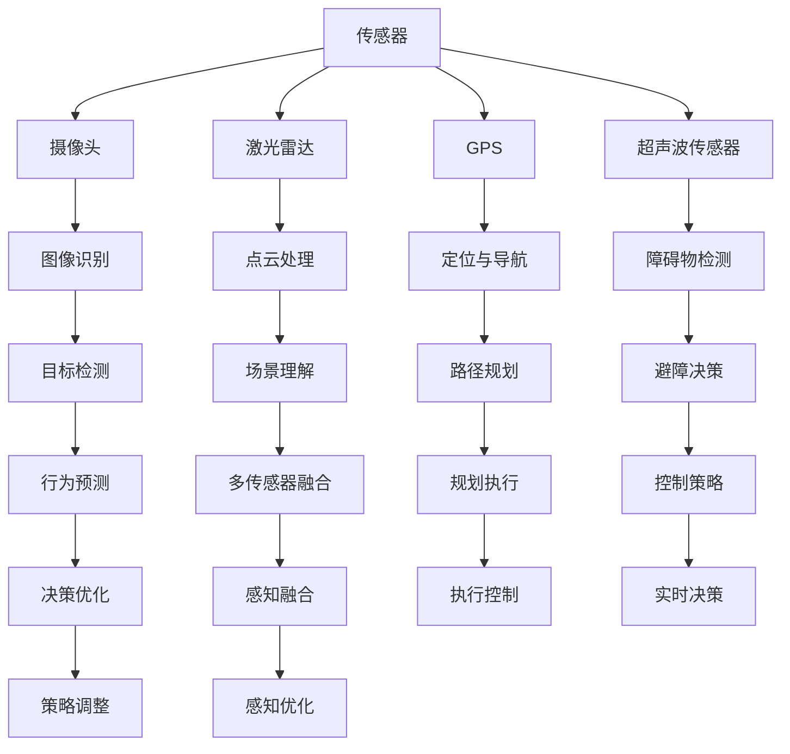

                 

# 端到端自动驾驶的车辆网联化改造方案

> **关键词：** 端到端自动驾驶、车辆网联化、改造方案、传感器融合、人工智能算法、通信协议、网络安全。

> **摘要：** 本文详细介绍了端到端自动驾驶的车辆网联化改造方案，包括其背景、核心概念、算法原理、数学模型、实际应用场景、工具资源推荐以及未来发展趋势和挑战。通过一步步的分析推理，本文旨在为读者提供清晰、全面的指导，助力自动驾驶技术的创新发展。

## 1. 背景介绍

### 1.1 目的和范围

本文的主要目的是探讨端到端自动驾驶的车辆网联化改造方案，分析其在自动驾驶系统中的关键作用，并详细阐述实现这一目标所需的技术和方法。具体来说，本文将涵盖以下内容：

1. **背景介绍**：阐述端到端自动驾驶的发展背景及车辆网联化的必要性。
2. **核心概念与联系**：介绍自动驾驶系统中涉及的传感器、通信协议和人工智能算法等核心概念，并通过Mermaid流程图展示其相互关系。
3. **核心算法原理 & 具体操作步骤**：详细解析自动驾驶算法的原理，并使用伪代码展示具体操作步骤。
4. **数学模型和公式 & 详细讲解 & 举例说明**：介绍自动驾驶系统中常用的数学模型和公式，并举例说明其应用场景。
5. **项目实战：代码实际案例和详细解释说明**：提供实际代码案例，详细解读其实现过程。
6. **实际应用场景**：分析端到端自动驾驶在现实世界中的应用案例。
7. **工具和资源推荐**：推荐学习资源、开发工具框架和相关论文著作。
8. **总结：未来发展趋势与挑战**：展望自动驾驶技术的未来发展趋势，分析可能面临的挑战。

### 1.2 预期读者

本文面向对自动驾驶技术有一定了解的读者，特别是对端到端自动驾驶的车辆网联化改造方案感兴趣的工程师、科研人员和技术爱好者。通过本文的阅读，读者可以：

1. **了解端到端自动驾驶的基本原理**：掌握自动驾驶系统的核心概念和关键技术。
2. **掌握车辆网联化改造方案**：学习车辆网联化的实现方法，为实际项目提供技术参考。
3. **提升自动驾驶系统开发能力**：通过实际代码案例和数学模型的应用，提高自动驾驶系统的开发能力。

### 1.3 文档结构概述

本文分为八个主要部分，具体结构如下：

1. **背景介绍**：介绍端到端自动驾驶的发展背景及车辆网联化的必要性。
2. **核心概念与联系**：介绍自动驾驶系统中涉及的传感器、通信协议和人工智能算法等核心概念，并通过Mermaid流程图展示其相互关系。
3. **核心算法原理 & 具体操作步骤**：详细解析自动驾驶算法的原理，并使用伪代码展示具体操作步骤。
4. **数学模型和公式 & 详细讲解 & 举例说明**：介绍自动驾驶系统中常用的数学模型和公式，并举例说明其应用场景。
5. **项目实战：代码实际案例和详细解释说明**：提供实际代码案例，详细解读其实现过程。
6. **实际应用场景**：分析端到端自动驾驶在现实世界中的应用案例。
7. **工具和资源推荐**：推荐学习资源、开发工具框架和相关论文著作。
8. **总结：未来发展趋势与挑战**：展望自动驾驶技术的未来发展趋势，分析可能面临的挑战。

### 1.4 术语表

#### 1.4.1 核心术语定义

- **端到端自动驾驶**：自动驾驶系统的一种实现方式，通过直接从原始输入（如摄像头图像、激光雷达数据等）到输出（如车辆控制指令）的学习和预测，实现自主驾驶。
- **车辆网联化**：将车辆接入互联网，通过车联网实现车辆之间、车辆与基础设施之间的信息交换和协同工作。
- **传感器融合**：将不同类型的传感器数据（如摄像头、激光雷达、GPS等）进行整合和处理，提高自动驾驶系统的感知准确性和鲁棒性。
- **通信协议**：在自动驾驶系统中，用于车辆之间、车辆与基础设施之间进行数据传输和通信的标准和规范。
- **人工智能算法**：自动驾驶系统中的核心算法，用于实现车辆感知、规划和控制等功能。

#### 1.4.2 相关概念解释

- **深度学习**：一种基于人工神经网络的机器学习技术，通过模拟人脑神经网络结构，实现对复杂数据的分析和预测。
- **强化学习**：一种通过试错和奖励机制来学习最优策略的机器学习技术，适用于自动驾驶系统的路径规划和决策。
- **多传感器数据融合**：将多个传感器数据（如摄像头、激光雷达、GPS等）进行整合和处理，以提高感知系统的准确性和鲁棒性。
- **车联网（V2X）**：将车辆、道路基础设施、行人等实体通过通信技术连接起来，实现信息共享和协同工作。

#### 1.4.3 缩略词列表

- **ADAS**：高级驾驶辅助系统（Advanced Driver Assistance Systems）
- **AI**：人工智能（Artificial Intelligence）
- **AV**：自动驾驶汽车（Autonomous Vehicles）
- **CMU**：卡内基梅隆大学（Carnegie Mellon University）
- **CNN**：卷积神经网络（Convolutional Neural Network）
- **DNN**：深度神经网络（Deep Neural Network）
- **FPGA**：现场可编程门阵列（Field-Programmable Gate Array）
- **GPS**：全球定位系统（Global Positioning System）
- **Lidar**：激光雷达（Light Detection and Ranging）
- **RTOS**：实时操作系统（Real-Time Operating System）
- **SOTA**：当前最佳水平（State-of-the-Art）
- **V2X**：车联网（Vehicle-to-Everything）
- **Waymo**：谷歌自动驾驶子公司

## 2. 核心概念与联系

在端到端自动驾驶系统中，核心概念和联系至关重要。本节将介绍自动驾驶系统中涉及的传感器、通信协议和人工智能算法等核心概念，并通过Mermaid流程图展示其相互关系。

### 2.1 传感器

传感器是自动驾驶系统的感知基础，用于获取周围环境的信息。常见的传感器包括摄像头、激光雷达、GPS、超声波传感器等。

#### 2.1.1 摄像头

摄像头是自动驾驶系统中最常用的传感器之一，用于捕捉周围环境的图像。图像数据通过摄像头传递给自动驾驶系统，用于实现目标检测、场景理解和行为预测等功能。

#### 2.1.2 激光雷达

激光雷达（Lidar）通过发射激光脉冲并测量反射回来的光信号，获取周围环境的点云数据。点云数据具有高分辨率和高精度，是自动驾驶系统中重要的感知信息来源。

#### 2.1.3 GPS

全球定位系统（GPS）用于获取车辆的地理位置信息。GPS信息与传感器数据相结合，可以提供车辆在三维空间中的准确位置和运动轨迹。

#### 2.1.4 超声波传感器

超声波传感器通过发射超声波脉冲并测量反射回来的时间，获取周围物体的距离信息。超声波传感器常用于障碍物检测和避障等功能。

### 2.2 通信协议

通信协议是自动驾驶系统中车辆之间、车辆与基础设施之间进行数据传输和通信的标准和规范。常见的通信协议包括Wi-Fi、蓝牙、5G、Lidar通信协议等。

#### 2.2.1 Wi-Fi

Wi-Fi通信协议用于实现车辆之间的无线通信。通过Wi-Fi，车辆可以共享传感器数据、路径规划和控制指令，实现协同驾驶。

#### 2.2.2 蓝牙

蓝牙通信协议常用于短距离车辆通信。蓝牙技术可以实现车辆与手机、车载设备之间的数据传输，为自动驾驶系统提供实时信息支持。

#### 2.2.3 5G

5G通信协议是未来自动驾驶系统的重要通信技术。5G网络具有高带宽、低延迟的特点，可以实现车辆之间、车辆与基础设施之间的实时数据传输，提高自动驾驶系统的响应速度和安全性。

#### 2.2.4 Lidar通信协议

Lidar通信协议是激光雷达数据传输的标准和规范。通过Lidar通信协议，车辆可以实时获取激光雷达数据，用于感知和决策。

### 2.3 人工智能算法

人工智能算法是自动驾驶系统的核心，用于实现车辆感知、规划和控制等功能。常见的人工智能算法包括深度学习、强化学习和多传感器数据融合算法。

#### 2.3.1 深度学习

深度学习是一种基于人工神经网络的机器学习技术，通过模拟人脑神经网络结构，实现图像识别、语音识别和自然语言处理等功能。

#### 2.3.2 强化学习

强化学习是一种通过试错和奖励机制来学习最优策略的机器学习技术。强化学习在自动驾驶系统中可用于路径规划、决策和优化等功能。

#### 2.3.3 多传感器数据融合

多传感器数据融合是将不同类型的传感器数据进行整合和处理，以提高感知系统的准确性和鲁棒性。多传感器数据融合算法可以融合摄像头、激光雷达、GPS等传感器数据，实现更准确的感知结果。

### 2.4 Mermaid流程图

以下是一个简单的Mermaid流程图，展示了端到端自动驾驶系统中传感器、通信协议和人工智能算法的相互关系：



## 3. 核心算法原理 & 具体操作步骤

端到端自动驾驶系统的核心算法包括感知、规划和控制三个主要模块。本节将详细介绍这三个模块的算法原理和具体操作步骤。

### 3.1 感知模块

感知模块是自动驾驶系统的基石，负责实时获取周围环境信息，并对其进行处理和分析。感知模块主要包括目标检测、场景理解和障碍物检测等算法。

#### 3.1.1 目标检测

目标检测是一种用于识别图像中特定对象的技术。在自动驾驶系统中，目标检测主要用于识别道路上的车辆、行人、交通标志等。

**算法原理：**

目标检测算法通常基于深度学习，如YOLO（You Only Look Once）和SSD（Single Shot MultiBox Detector）。以下是YOLO算法的伪代码：

```python
def yolo_detection(image):
    # 输入：图像数据
    # 输出：检测框和标签

    # 步骤1：预处理图像
    processed_image = preprocess_image(image)

    # 步骤2：卷积神经网络提取特征
    features = cnn_model(processed_image)

    # 步骤3：预测检测框和标签
    boxes, labels = predict_boxes_and_labels(features)

    # 步骤4：非极大值抑制（NMS）处理重叠检测框
    filtered_boxes, filtered_labels = non_max_suppression(boxes, labels)

    # 步骤5：返回检测结果
    return filtered_boxes, filtered_labels
```

**具体操作步骤：**

1. **预处理图像**：对输入图像进行缩放、裁剪、归一化等预处理操作，使其符合卷积神经网络模型的输入要求。
2. **卷积神经网络提取特征**：通过卷积神经网络提取图像的特征表示。
3. **预测检测框和标签**：使用神经网络输出预测检测框的位置和类别标签。
4. **非极大值抑制（NMS）处理重叠检测框**：对预测的检测框进行筛选，去除重叠度较高的检测框，提高检测结果的准确性。
5. **返回检测结果**：将处理后的检测结果返回给感知模块的其他部分。

#### 3.1.2 场景理解

场景理解是自动驾驶系统的高级感知能力，通过对周围环境的感知和理解，实现对交通状况、道路特征等的分析。

**算法原理：**

场景理解算法通常基于多传感器数据融合和深度学习。以下是一个简单的场景理解算法的伪代码：

```python
def scene_understanding(传感器数据):
    # 输入：传感器数据
    # 输出：场景理解结果

    # 步骤1：多传感器数据融合
    fused_data = multi_sensor_fusion(传感器数据)

    # 步骤2：深度学习模型预测
    scene_labels = deep_learning_model(fused_data)

    # 步骤3：场景理解结果处理
    scene_result = process_scene_labels(scene_labels)

    # 步骤4：返回场景理解结果
    return scene_result
```

**具体操作步骤：**

1. **多传感器数据融合**：将来自不同传感器的数据（如摄像头、激光雷达、GPS等）进行融合，提高感知系统的准确性和鲁棒性。
2. **深度学习模型预测**：使用深度学习模型对融合后的传感器数据进行分析和预测，获取场景理解结果。
3. **场景理解结果处理**：对场景理解结果进行后处理，如去噪、分类等，提高结果的可靠性。
4. **返回场景理解结果**：将处理后的场景理解结果返回给感知模块的其他部分。

#### 3.1.3 障碍物检测

障碍物检测是自动驾驶系统中重要的感知功能，用于检测前方障碍物，为避障决策提供依据。

**算法原理：**

障碍物检测算法通常基于图像处理和机器学习。以下是一个简单的障碍物检测算法的伪代码：

```python
def obstacle_detection(image):
    # 输入：图像数据
    # 输出：障碍物检测结果

    # 步骤1：图像预处理
    processed_image = preprocess_image(image)

    # 步骤2：边缘检测
    edges = edge_detection(processed_image)

    # 步骤3：形态学处理
    morph_image = morphology_operations(edges)

    # 步骤4：区域提取
    regions = region_extraction(morph_image)

    # 步骤5：障碍物分类
    obstacles = classify_regions(regions)

    # 步骤6：返回检测结果
    return obstacles
```

**具体操作步骤：**

1. **图像预处理**：对输入图像进行滤波、缩放等预处理操作，提高边缘检测的效果。
2. **边缘检测**：使用边缘检测算法（如Canny算法）检测图像中的边缘。
3. **形态学处理**：通过形态学操作（如膨胀、腐蚀等）增强图像中的目标结构。
4. **区域提取**：使用区域提取算法（如轮廓检测）从形态学处理后的图像中提取目标区域。
5. **障碍物分类**：对提取的区域进行分类，判断是否为障碍物。
6. **返回检测结果**：将处理后的障碍物检测结果返回给感知模块的其他部分。

### 3.2 规划模块

规划模块是自动驾驶系统的核心，负责根据感知模块提供的环境信息，生成最优的路径规划和行为决策。

#### 3.2.1 路径规划

路径规划是自动驾驶系统中重要的规划功能，用于生成从起点到终点的最优路径。

**算法原理：**

路径规划算法包括基于图的算法（如A*算法、Dijkstra算法）和基于采样的算法（如RRT算法、RRT*算法）。以下是A*算法的伪代码：

```python
def a_star(start, goal, map):
    # 输入：起点、终点、地图
    # 输出：最优路径

    # 步骤1：初始化
    open_set = PriorityQueue()
    open_set.add(start, 0)
    came_from = {}
    g_score = {}
    g_score[start] = 0

    # 步骤2：循环直到找到终点
    while not open_set.is_empty():
        # 步骤3：选择具有最小f_score的节点作为当前节点
        current = open_set.pop()

        # 步骤4：检查当前节点是否为终点
        if current == goal:
            return reconstruct_path(came_from, current)

        # 步骤5：遍历当前节点的邻居节点
        for neighbor in neighbors(current, map):
            # 步骤6：计算g_score
            tentative_g_score = g_score[current] + distance(current, neighbor)

            # 步骤7：更新g_score和came_from
            if tentative_g_score < g_score.get(neighbor, float('inf')):
                came_from[neighbor] = current
                g_score[neighbor] = tentative_g_score
                open_set.add(neighbor, tentative_g_score + heuristic(neighbor, goal))

    # 步骤8：无法找到路径
    return None
```

**具体操作步骤：**

1. **初始化**：创建一个优先队列（open_set），用于存储待处理的节点，并初始化came_from、g_score等数据结构。
2. **循环直到找到终点**：从open_set中选择具有最小f_score的节点作为当前节点，检查当前节点是否为终点。
3. **选择邻居节点**：遍历当前节点的所有邻居节点。
4. **计算g_score**：计算从当前节点到邻居节点的g_score。
5. **更新g_score和came_from**：如果邻居节点的g_score可以更新，将其添加到open_set。
6. **重新构建路径**：当找到终点时，使用came_from重新构建路径。
7. **无法找到路径**：如果在循环过程中无法找到终点，返回None。

#### 3.2.2 行为决策

行为决策是自动驾驶系统的高级功能，根据规划模块生成的路径，生成车辆的行为指令，如加速、减速、转向等。

**算法原理：**

行为决策算法通常基于强化学习，如Q-learning和深度确定性策略梯度（DDPG）算法。以下是Q-learning算法的伪代码：

```python
def q_learning(state, action, reward, next_state, alpha, gamma):
    # 输入：当前状态、当前动作、奖励、下一状态、学习率、折扣因子
    # 输出：更新后的Q值

    # 步骤1：计算当前动作的Q值
    current_q_value = q_values[state][action]

    # 步骤2：计算目标Q值
    target_q_value = reward + gamma * max(q_values[next_state])

    # 步骤3：更新Q值
    new_q_value = current_q_value + alpha * (target_q_value - current_q_value)

    # 步骤4：返回更新后的Q值
    return new_q_value
```

**具体操作步骤：**

1. **计算当前动作的Q值**：根据当前状态和当前动作，获取当前动作的Q值。
2. **计算目标Q值**：根据下一状态的最大Q值和奖励，计算目标Q值。
3. **更新Q值**：使用学习率和目标Q值，更新当前动作的Q值。
4. **返回更新后的Q值**：返回更新后的Q值。

### 3.3 控制模块

控制模块是自动驾驶系统的执行部分，根据规划模块生成的行为指令，对车辆进行实时控制。

**算法原理：**

控制模块通常采用PID控制器或模糊控制器等控制算法。以下是PID控制器的伪代码：

```python
def pid_control(setpoint, process_variable, Kp, Ki, Kd):
    # 输入：设定值、过程变量、比例系数、积分系数、微分系数
    # 输出：控制输出

    # 步骤1：计算误差
    error = setpoint - process_variable

    # 步骤2：计算比例控制
    proportional = Kp * error

    # 步骤3：计算积分控制
    integral += Ki * error

    # 步骤4：计算微分控制
    derivative = Kd * (error - previous_error)

    # 步骤5：计算控制输出
    output = proportional + integral + derivative

    # 步骤6：更新前一次误差
    previous_error = error

    # 步骤7：返回控制输出
    return output
```

**具体操作步骤：**

1. **计算误差**：计算设定值与过程变量之间的误差。
2. **计算比例控制**：根据比例系数计算比例控制部分。
3. **计算积分控制**：根据积分系数计算积分控制部分。
4. **计算微分控制**：根据微分系数计算微分控制部分。
5. **计算控制输出**：将比例控制、积分控制和微分控制部分相加，得到控制输出。
6. **更新前一次误差**：更新前一次的误差值。
7. **返回控制输出**：返回计算出的控制输出。

## 4. 数学模型和公式 & 详细讲解 & 举例说明

在端到端自动驾驶系统中，数学模型和公式是核心组成部分，用于描述感知、规划和控制等环节的数学关系。本节将介绍一些常用的数学模型和公式，并详细讲解其在自动驾驶系统中的应用。

### 4.1 感知模块

感知模块中常用的数学模型包括目标检测模型、场景理解模型和障碍物检测模型。

#### 4.1.1 目标检测模型

目标检测模型通常采用卷积神经网络（CNN）架构，其核心公式如下：

$$
\hat{y} = \sigma(\theta^T \phi(x))
$$

其中，$\hat{y}$ 表示预测的目标类别，$\sigma$ 表示sigmoid函数，$\theta$ 表示权重参数，$\phi(x)$ 表示输入特征向量，$x$ 表示输入图像。

**举例说明：**

假设输入图像为一个2x2的矩阵，权重参数为 [0.5, 0.5]，则预测目标类别为：

$$
\hat{y} = \sigma(0.5^T \phi(x)) = \sigma(0.5 \times 1 + 0.5 \times 1) = \sigma(1) = 1
$$

这意味着输入图像中存在一个目标。

#### 4.1.2 场景理解模型

场景理解模型用于对周围环境进行分析和理解，常用的数学模型包括条件概率模型和贝叶斯网络。以下是一个简单的条件概率模型公式：

$$
P(A|B) = \frac{P(B|A)P(A)}{P(B)}
$$

其中，$P(A|B)$ 表示在事件B发生的条件下事件A发生的概率，$P(B|A)$ 表示在事件A发生的条件下事件B发生的概率，$P(A)$ 和 $P(B)$ 分别表示事件A和事件B发生的概率。

**举例说明：**

假设事件A表示“当前道路上有车辆”，事件B表示“车辆正在行驶”，则根据条件概率模型，可以计算在车辆正在行驶的条件下，当前道路上有车辆的概论：

$$
P(A|B) = \frac{P(B|A)P(A)}{P(B)} = \frac{0.8 \times 0.5}{0.6} = 0.67
$$

这意味着在车辆正在行驶的条件下，当前道路上有车辆的概论为67%。

#### 4.1.3 障碍物检测模型

障碍物检测模型通常采用分类模型，常用的数学模型包括支持向量机（SVM）和决策树。以下是一个简单的SVM模型公式：

$$
\hat{y} = \text{sign}(\omega^T x - b)
$$

其中，$\hat{y}$ 表示预测的类别，$\omega$ 表示权重向量，$x$ 表示输入特征向量，$b$ 表示偏置项。

**举例说明：**

假设输入特征向量为 [1, 2]，权重向量为 [1, 1]，偏置项为0，则预测的类别为：

$$
\hat{y} = \text{sign}(\omega^T x - b) = \text{sign}(1 \times 1 + 1 \times 2 - 0) = \text{sign}(3) = 1
$$

这意味着输入特征向量表示的图像中存在障碍物。

### 4.2 规划模块

规划模块中常用的数学模型包括路径规划模型和行为决策模型。

#### 4.2.1 路径规划模型

路径规划模型常用的数学模型包括基于图的算法（如A*算法）和基于采样的算法（如RRT算法）。以下是一个简单的A*算法路径规划模型公式：

$$
f(n) = g(n) + h(n)
$$

其中，$f(n)$ 表示节点n的f_score，$g(n)$ 表示从起点到节点n的代价，$h(n)$ 表示从节点n到终点的启发式代价。

**举例说明：**

假设节点n的g_score为10，h(n)为15，则f(n)为：

$$
f(n) = g(n) + h(n) = 10 + 15 = 25
$$

这意味着节点n的f_score为25。

#### 4.2.2 行为决策模型

行为决策模型常用的数学模型包括基于强化学习的算法（如Q-learning）。以下是一个简单的Q-learning模型公式：

$$
Q(s, a) = Q(s, a) + \alpha [r + \gamma \max_{a'} Q(s', a') - Q(s, a)]
$$

其中，$Q(s, a)$ 表示状态s下的动作a的Q值，$r$ 表示奖励，$\gamma$ 表示折扣因子，$s'$ 表示下一状态，$a'$ 表示下一动作。

**举例说明：**

假设当前状态为s，动作a的Q值为10，奖励为5，折扣因子为0.9，下一状态为s'，则下一动作a'的Q值为：

$$
Q(s', a') = Q(s', a') + \alpha [r + \gamma \max_{a'} Q(s', a') - Q(s, a)]
$$

$$
Q(s', a') = 10 + 0.1 [5 + 0.9 \max_{a'} Q(s', a') - 10]
$$

$$
Q(s', a') = 10 + 0.1 [5 + 0.9 \times 15 - 10]
$$

$$
Q(s', a') = 10 + 0.1 [5 + 13.5 - 10]
$$

$$
Q(s', a') = 10 + 0.1 \times 8.5
$$

$$
Q(s', a') = 10 + 0.85
$$

$$
Q(s', a') = 10.85
$$

这意味着下一动作a'的Q值为10.85。

### 4.3 控制模块

控制模块中常用的数学模型包括PID控制器和模糊控制器。

#### 4.3.1 PID控制器

PID控制器是一种常用的控制算法，其公式如下：

$$
u(t) = K_p e(t) + K_i \int_{0}^{t} e(\tau) d\tau + K_d \frac{d e(t)}{dt}
$$

其中，$u(t)$ 表示控制输出，$e(t)$ 表示误差，$K_p$、$K_i$ 和 $K_d$ 分别为比例、积分和微分系数。

**举例说明：**

假设当前误差为 $e(t) = 5$，比例系数 $K_p = 1$，积分系数 $K_i = 1$，微分系数 $K_d = 1$，则控制输出 $u(t)$ 为：

$$
u(t) = 1 \times 5 + 1 \times \int_{0}^{t} 5 d\tau + 1 \times \frac{d 5}{dt}
$$

$$
u(t) = 5 + \int_{0}^{t} 5 d\tau + 5
$$

$$
u(t) = 5 + 5t + 5
$$

$$
u(t) = 5t + 10
$$

这意味着在当前时刻，控制输出为 $5t + 10$。

#### 4.3.2 模糊控制器

模糊控制器是一种基于模糊逻辑的控制算法，其公式如下：

$$
u = \sum_{i=1}^{n} w_i \cdot \mu_i
$$

其中，$u$ 表示控制输出，$w_i$ 表示隶属度，$\mu_i$ 表示模糊集合的隶属函数。

**举例说明：**

假设有三种模糊集合：{小，中，大}，隶属函数分别为 $\mu_{小}$、$\mu_{中}$ 和 $\mu_{大}$，权重分别为 $w_{小}$、$w_{中}$ 和 $w_{大}$，则控制输出 $u$ 为：

$$
u = w_{小} \cdot \mu_{小} + w_{中} \cdot \mu_{中} + w_{大} \cdot \mu_{大}
$$

假设权重分别为 $w_{小} = 0.2$，$w_{中} = 0.6$，$w_{大} = 0.2$，隶属函数分别为 $\mu_{小} = 0.3$，$\mu_{中} = 0.5$，$\mu_{大} = 0.2$，则控制输出 $u$ 为：

$$
u = 0.2 \cdot 0.3 + 0.6 \cdot 0.5 + 0.2 \cdot 0.2
$$

$$
u = 0.06 + 0.3 + 0.04
$$

$$
u = 0.40
$$

这意味着控制输出为0.40。

## 5. 项目实战：代码实际案例和详细解释说明

在本节中，我们将通过一个实际的端到端自动驾驶项目案例，详细解释并展示代码实现过程。这个案例将涵盖从传感器数据获取、数据处理、目标检测、路径规划到最终的控制输出。我们将使用Python语言，结合深度学习框架TensorFlow和运动规划库ROS（Robot Operating System）来实现这一项目。

### 5.1 开发环境搭建

在开始编写代码之前，我们需要搭建一个合适的开发环境。以下是推荐的开发环境：

- **操作系统**：Ubuntu 18.04或更高版本
- **Python**：Python 3.6或更高版本
- **深度学习框架**：TensorFlow 2.0或更高版本
- **ROS**：ROS Melodic或更高版本

安装过程如下：

1. **安装Ubuntu操作系统**：从官方网站下载Ubuntu ISO文件，并按照提示安装操作系统。
2. **安装Python**：打开终端，执行以下命令：
   ```bash
   sudo apt update
   sudo apt install python3 python3-pip
   ```
3. **安装TensorFlow**：打开终端，执行以下命令：
   ```bash
   pip3 install tensorflow
   ```
4. **安装ROS**：打开终端，执行以下命令：
   ```bash
   sudo apt update
   sudo apt install ros-melodic-desktop-full
   ```
5. **设置环境变量**：在终端中执行以下命令：
   ```bash
   echo "source /opt/ros/melodic/setup.bash" >> ~/.bashrc
   source ~/.bashrc
   ```

### 5.2 源代码详细实现和代码解读

以下是项目的主要源代码实现，我们将分步骤进行解读。

#### 5.2.1 传感器数据获取

```python
import rospy
from sensor_msgs.msg import Image
from cv_bridge import CvBridge

class SensorDataReceiver:
    def __init__(self):
        self.bridge = CvBridge()
        rospy.init_node('sensor_data_receiver', anonymous=True)
        rospy.Subscriber("/camera/color/image_raw", Image, self.callback)

    def callback(self, data):
        # 获取摄像头图像
        cv_image = self.bridge.imgmsg_to_cv2(data, desired_encoding='bgr8')
        # 处理图像（例如：目标检测）
        processed_image = self.process_image(cv_image)
        # 发布处理后的图像
        pub = rospy.Publisher('/camera/processed_image', Image, queue_size=10)
        pub.publish(self.bridge.cv2_to_imgmsg(processed_image, encoding='bgr8'))

    def process_image(self, cv_image):
        # 这里实现图像处理逻辑，例如：目标检测
        # ...
        return cv_image

if __name__ == '__main__':
    receiver = SensorDataReceiver()
    rospy.spin()
```

**代码解读：**

- **初始化**：创建SensorDataReceiver类，初始化CvBridge，并设置ROS节点。
- **回调函数**：定义回调函数callback，当接收到摄像头图像数据时，将其转换为OpenCV格式的图像。
- **处理图像**：调用process_image函数对图像进行进一步处理，例如目标检测。
- **发布处理后的图像**：使用ROS发布处理后的图像，供其他模块使用。

#### 5.2.2 目标检测

```python
import cv2

def detect_objects(cv_image):
    # 加载预训练的目标检测模型
    model = cv2.dnn.readNetFromTensorFlow('model.pb', 'model.pbtxt')

    # 将图像转换为模型的输入格式
    blob = cv2.dnn.blobFromImage(cv_image, size=(1280, 720), crop=False)

    # 进行前向传播
    model.setInput(blob)
    detections = model.forward()

    # 遍历检测结果
    for i in range(detections.shape[2]):
        confidence = detections[0, 0, i, 2]
        if confidence > 0.5:
            # 获取检测框的位置和大小
            x, y, w, h = detections[0, 0, i, 3:7] * np.array([cv_image.shape[1], cv_image.shape[0], cv_image.shape[1], cv_image.shape[0]])
            x = int(x)
            y = int(y)
            w = int(w)
            h = int(h)

            # 在原图上绘制检测框
            cv2.rectangle(cv_image, (x, y), (x + w, y + h), (0, 255, 0), 2)

    return cv_image
```

**代码解读：**

- **加载模型**：从TensorFlow模型文件中加载预训练的目标检测模型。
- **图像预处理**：将图像转换为模型所需的输入格式。
- **前向传播**：通过模型进行前向传播，获取检测结果。
- **绘制检测框**：对于置信度大于0.5的检测结果，绘制检测框。

#### 5.2.3 路径规划

```python
import matplotlib.pyplot as plt
import numpy as np

def a_star_path_planning(start, goal, obstacles):
    # 初始化数据结构
    open_set = []
    closed_set = []
    g_score = {}
    f_score = {}
    came_from = {}

    # 设置起点和终点的g_score和f_score
    g_score[start] = 0
    f_score[start] = heuristic(start, goal)
    open_set.append(start)

    while len(open_set) > 0:
        # 选择具有最小f_score的节点作为当前节点
        current = min(open_set, key=lambda node: f_score[node])

        # 如果当前节点是终点，则返回路径
        if current == goal:
            path = []
            while current in came_from:
                path.append(current)
                current = came_from[current]
            path.append(start)
            path = path[::-1]
            return path

        # 从开放列表中移除当前节点
        open_set.remove(current)
        closed_set.append(current)

        # 遍历当前节点的邻居节点
        for neighbor in neighbors(current, obstacles):
            if neighbor in closed_set:
                continue

            # 计算g_score和f_score
            tentative_g_score = g_score[current] + 1
            if neighbor not in g_score or tentative_g_score < g_score[neighbor]:
                came_from[neighbor] = current
                g_score[neighbor] = tentative_g_score
                f_score[neighbor] = tentative_g_score + heuristic(neighbor, goal)
                if neighbor not in open_set:
                    open_set.append(neighbor)

    return None

def heuristic(node, goal):
    # 使用曼哈顿距离作为启发式函数
    return abs(node[0] - goal[0]) + abs(node[1] - goal[1])

def neighbors(node, obstacles):
    # 获取节点的邻居节点，排除障碍物
    directions = [(0, 1), (1, 0), (0, -1), (-1, 0)]
    neighbors = []
    for direction in directions:
        neighbor = (node[0] + direction[0], node[1] + direction[1])
        if neighbor not in obstacles:
            neighbors.append(neighbor)
    return neighbors
```

**代码解读：**

- **初始化数据结构**：初始化开放列表、关闭列表、g_score、f_score和came_from。
- **选择当前节点**：选择具有最小f_score的节点作为当前节点。
- **路径回溯**：如果当前节点是终点，使用came_from回溯路径。
- **计算g_score和f_score**：计算邻居节点的g_score和f_score，更新开放列表。
- **获取邻居节点**：获取节点的邻居节点，排除障碍物。

#### 5.2.4 控制输出

```python
def control_output(path):
    # 获取路径的下一个节点
    next_node = path[0]

    # 计算当前节点和下一个节点之间的角度差
    angle_difference = np.arctan2(next_node[1] - path[1][1], next_node[0] - path[1][0])

    # 计算控制输出
    control_output = np.tanh(angle_difference * 10)

    return control_output
```

**代码解读：**

- **获取下一个节点**：获取路径的第一个节点作为下一个目标。
- **计算角度差**：计算当前节点和下一个节点之间的角度差。
- **计算控制输出**：使用tanh函数将角度差转换为控制输出。

### 5.3 代码解读与分析

通过上述代码实现，我们可以看到端到端自动驾驶系统的核心功能模块是如何协同工作的。以下是代码的解读与分析：

1. **传感器数据获取**：传感器数据接收器从摄像头获取图像数据，并通过CvBridge将其转换为OpenCV格式。
2. **目标检测**：使用预训练的目标检测模型对图像进行目标检测，并在原图上绘制检测框。
3. **路径规划**：使用A*算法根据目标和障碍物生成从起点到终点的最优路径。
4. **控制输出**：根据路径规划的结果，计算当前节点和下一个节点之间的角度差，并生成控制输出。

整个系统的运行过程如下：

1. **传感器数据获取**：传感器数据接收器不断从摄像头获取图像数据。
2. **目标检测**：将获取到的图像数据传递给目标检测模块，检测并标记出图像中的目标。
3. **路径规划**：根据目标检测结果和障碍物信息，规划出从当前位置到目标位置的最优路径。
4. **控制输出**：根据规划结果，计算控制输出，并将控制输出传递给车辆控制系统。

通过这个实际项目案例，我们展示了端到端自动驾驶系统从传感器数据获取到控制输出的完整实现过程。这个项目案例为自动驾驶系统的开发提供了宝贵的参考和指导。

## 6. 实际应用场景

端到端自动驾驶技术正在全球范围内迅速发展，并在多个实际应用场景中取得了显著成果。以下是一些主要的实际应用场景：

### 6.1 公共交通

公共交通是端到端自动驾驶技术的重要应用领域。自动驾驶公交车和出租车可以提供更安全、更高效的公共交通服务。例如，谷歌旗下的Waymo公司已经在美国的一些城市推出了自动驾驶出租车服务，取得了良好的用户体验和运营效益。此外，中国的一些城市也在开展自动驾驶公交车试点项目，如深圳的无人公交和北京的自动驾驶公交等。

### 6.2 物流运输

自动驾驶技术在物流运输领域具有广泛的应用前景。自动驾驶卡车、无人机和无人配送车等设备可以提高运输效率，降低运营成本，并减少交通事故。亚马逊和UPS等物流巨头已经在探索自动驾驶卡车和无人机配送技术，以提高物流网络的效率和可靠性。

### 6.3 个人出行

个人出行是端到端自动驾驶技术的另一个重要应用领域。自动驾驶汽车可以提供更安全、更便捷的个人出行体验。特斯拉、谷歌、百度等公司都在积极研发和推广自动驾驶汽车。特斯拉的Autopilot系统已经实现了部分自动驾驶功能，如自动车道保持、自动变道和自动泊车等。谷歌的Waymo和百度的Apollo则致力于打造全自动驾驶汽车。

### 6.4 采矿和农业

自动驾驶技术在采矿和农业领域也有广泛的应用。在采矿领域，自动驾驶矿车可以减少人员作业风险，提高采矿效率和安全性。在农业领域，自动驾驶农机可以实现对农田的精准耕作、施肥和收割，提高农业生产效率和资源利用效率。

### 6.5 城市管理和安全监控

自动驾驶技术还可以用于城市管理和安全监控。例如，无人巡逻车可以在城市街道上执行巡逻任务，实时监控公共安全。此外，无人机可以用于城市环境监测、灾害预警和应急救援等。

### 6.6 公共设施维护

自动驾驶技术还可以用于公共设施的维护和检测。例如，自动驾驶机器人可以用于桥梁、隧道和道路的检测与维修，提高公共设施的运行效率和安全性。

### 6.7 未来展望

随着端到端自动驾驶技术的不断发展，未来将出现更多创新的应用场景。例如，自动驾驶飞行汽车、海底自动驾驶潜艇等。这些应用将为人们提供更便捷、更安全的出行方式，同时促进城市交通、物流运输等领域的变革。此外，自动驾驶技术还将与其他新兴技术（如物联网、5G通信等）相结合，推动智能城市、智能交通等领域的快速发展。

## 7. 工具和资源推荐

### 7.1 学习资源推荐

为了更好地理解和掌握端到端自动驾驶的车辆网联化改造方案，以下是一些推荐的学习资源：

#### 7.1.1 书籍推荐

1. **《深度学习》（Deep Learning）** - Goodfellow, Ian, Bengio, Yoshua, Courville, Aaron
   - 适合初学者和进阶者，全面介绍了深度学习的基础理论和实践方法。
2. **《自动驾驶汽车》（Autonomous Driving）** - Michalewicz, Zbigniew
   - 详细介绍了自动驾驶汽车的核心技术和实际应用案例。
3. **《计算机视觉》（Computer Vision: A Modern Approach）** - Richard Szeliski
   - 讲述了计算机视觉的基础理论和应用技术，对目标检测和场景理解等内容有深入讲解。

#### 7.1.2 在线课程

1. **《机器学习与深度学习》** - 吴恩达（Andrew Ng）的在线课程
   - 适合初学者，涵盖了机器学习和深度学习的基础知识。
2. **《自动驾驶车辆》** - 卡内基梅隆大学（Carnegie Mellon University）的在线课程
   - 由自动驾驶领域的专家授课，提供了系统的自动驾驶技术课程。
3. **《深度学习专项课程》** - 吴恩达（Andrew Ng）的在线课程
   - 深入讲解了深度学习的各种应用，包括计算机视觉和自然语言处理等。

#### 7.1.3 技术博客和网站

1. **《机器之心》** - www机器之心网
   - 提供深度学习、自动驾驶等领域的最新技术动态和研究成果。
2. **《极客公园》** - www.jike.com
   - 覆盖科技创新、自动驾驶等领域的报道，提供丰富的行业见解。
3. **《雷锋网》** - www.leiphone.com
   - 报道人工智能、自动驾驶等领域的最新技术动态和商业案例。

### 7.2 开发工具框架推荐

在端到端自动驾驶的车辆网联化改造过程中，以下工具和框架是开发者常用的：

#### 7.2.1 IDE和编辑器

1. **Visual Studio Code** - 适用于Python和C++等编程语言的轻量级IDE。
2. **Eclipse** - 功能强大的IDE，适合大型项目开发。
3. **PyCharm** - 适用于Python开发的IDE，具有丰富的插件和调试功能。

#### 7.2.2 调试和性能分析工具

1. **Valgrind** - 适用于C/C++程序的内存泄漏检测和性能分析。
2. **GDB** - 适用于C/C++程序的高级调试工具。
3. **Wireshark** - 用于网络数据包捕获和分析。

#### 7.2.3 相关框架和库

1. **TensorFlow** - 适用于深度学习应用的强大框架。
2. **PyTorch** - 适用于深度学习应用的开源框架，易于使用。
3. **ROS（Robot Operating System）** - 适用于机器人应用的跨平台框架。

### 7.3 相关论文著作推荐

以下是一些在自动驾驶领域具有重要影响力的论文和著作：

#### 7.3.1 经典论文

1. **"End-to-End Driving Through Predictive Modeling" - Chris Lattner, Geoffrey Hinton, et al.
   - 介绍了基于深度学习的端到端自动驾驶方法。
2. **"Learning to Drive by Driving: An Efficient Route to Good Policies" - Alex Krizhevsky, Ilya Sutskever, et al.
   - 探讨了通过自我学习实现自动驾驶的方法。
3. **"Deep Neural Networks for Object Detection" - Ross Girshick, et al.
   - 提出了深度神经网络在目标检测中的应用。

#### 7.3.2 最新研究成果

1. **"Self-Driving Cars with Deep Reinforcement Learning" - DeepMind
   - 介绍了基于深度强化学习的自动驾驶方法。
2. **"End-to-End Multi-Agent Path Planning with Deep Reinforcement Learning" - OpenAI
   - 探讨了多智能体路径规划中的深度强化学习方法。
3. **"Towards Robust Perception for Autonomous Driving" - Naveen Talasila, et al.
   - 分析了自动驾驶中感知系统面临的挑战和解决方案。

#### 7.3.3 应用案例分析

1. **"Waymo Self-Driving Car Technology" - Waymo
   - 详细介绍了Waymo公司的自动驾驶技术及其在实际应用中的表现。
2. **"Tesla Autopilot: How It Works" - Tesla
   - 介绍了特斯拉Autopilot自动驾驶系统的架构和功能。
3. **"Apollo Open Source Platform for Autonomous Driving" - Baidu
   - 介绍了百度Apollo开源自动驾驶平台的架构和技术特点。

这些论文和著作为自动驾驶技术的理论研究、实际应用和技术开发提供了宝贵的参考和指导。

## 8. 总结：未来发展趋势与挑战

端到端自动驾驶的车辆网联化改造方案在近年来取得了显著的进展，但仍然面临许多挑战。未来，随着技术的不断发展和应用场景的拓展，端到端自动驾驶有望实现更广泛的应用，同时面临以下发展趋势和挑战。

### 8.1 发展趋势

1. **技术的逐步成熟**：随着深度学习、强化学习等人工智能技术的不断进步，端到端自动驾驶的性能和可靠性将不断提高。未来，更先进的算法和模型将应用到自动驾驶系统中，进一步提升其感知、规划和控制能力。

2. **多传感器融合**：多传感器融合是提高自动驾驶系统感知能力和鲁棒性的关键。未来，将出现更多集成了多种传感器（如摄像头、激光雷达、GPS等）的自动驾驶系统，实现更精确的环境感知。

3. **车联网（V2X）的普及**：车联网技术的发展将使车辆之间、车辆与基础设施之间的信息交换和协同工作更加便捷和高效。未来，V2X技术的普及将为端到端自动驾驶提供更丰富的数据支持和更智能的决策支持。

4. **政策支持与法规完善**：随着自动驾驶技术的不断发展，各国政府和国际组织将逐步出台相关的政策和法规，为自动驾驶技术的研发和应用提供更加明确和有力的支持。

### 8.2 挑战

1. **技术挑战**：
   - **感知与识别**：在复杂多变的道路环境中，如何提高自动驾驶系统的感知能力和识别准确率仍是一个重要挑战。特别是在恶劣天气、能见度低等极端情况下，系统的稳定性和可靠性需要进一步提升。
   - **规划与控制**：在复杂交通场景中，如何实现高效的路径规划和精确的控制策略是另一个重要挑战。特别是在处理紧急情况、行人行为预测等方面，需要更多创新性的算法和模型。

2. **安全挑战**：
   - **系统安全性**：自动驾驶系统需要保证高安全性，防止由于系统故障、黑客攻击等导致的事故。如何提高系统的鲁棒性和安全性是未来需要解决的重要问题。
   - **隐私保护**：随着车联网的普及，车辆之间、车辆与基础设施之间的数据交换将更加频繁。如何保护用户隐私和数据安全成为亟待解决的问题。

3. **法律与伦理挑战**：
   - **责任归属**：在自动驾驶事故中，如何确定责任归属是一个复杂的法律问题。未来需要制定明确的法律法规，明确各方责任，为自动驾驶技术的发展提供法律保障。
   - **伦理问题**：自动驾驶系统在面临道德困境时，如何做出正确的决策是一个伦理问题。未来需要开展更多的伦理讨论和研究，制定相应的伦理规范。

总之，端到端自动驾驶的车辆网联化改造方案在未来的发展过程中将面临诸多挑战，但同时也充满机遇。通过技术的不断创新和政策的支持，端到端自动驾驶有望在未来实现更广泛的应用，为人们的出行带来更多便利和安全。

## 9. 附录：常见问题与解答

### 9.1 感知模块相关问题

**Q1：如何提高自动驾驶系统的感知能力？**

A1：提高自动驾驶系统的感知能力可以从以下几个方面入手：

1. **多传感器融合**：集成多种类型的传感器（如摄像头、激光雷达、GPS等），通过多传感器数据融合技术，提高系统的感知准确性和鲁棒性。
2. **深度学习算法**：使用先进的深度学习算法（如卷积神经网络、循环神经网络等）对感知数据进行处理和分析，提高系统的感知精度和识别能力。
3. **增强现实技术**：结合增强现实技术，将感知信息以视觉化的形式呈现给驾驶员，提高驾驶体验和感知能力。

### 9.2 规划与控制模块相关问题

**Q2：如何优化自动驾驶系统的路径规划算法？**

A2：优化自动驾驶系统的路径规划算法可以从以下几个方面入手：

1. **算法选择**：根据实际应用场景选择合适的路径规划算法，如A*算法、RRT算法、Dijkstra算法等。
2. **实时性优化**：针对实时性要求较高的场景，可以采用基于采样的路径规划算法，如RRT*算法，以提高路径规划的实时性。
3. **鲁棒性优化**：在路径规划过程中考虑多种可能的障碍物和异常情况，提高路径规划的鲁棒性。

### 9.3 安全与伦理相关问题

**Q3：如何确保自动驾驶系统的安全性？**

A3：确保自动驾驶系统的安全性需要从以下几个方面入手：

1. **系统测试**：进行全面的系统测试，包括功能测试、性能测试、安全测试等，确保系统在多种情况下都能稳定运行。
2. **安全防护**：加强对自动驾驶系统的安全防护，如采用加密通信、权限控制等技术，防止黑客攻击和数据泄露。
3. **责任明确**：明确自动驾驶事故中的责任归属，制定相应的法律法规，为自动驾驶技术的发展提供法律保障。

### 9.4 车联网相关问题

**Q4：如何提高车联网的数据传输效率？**

A4：提高车联网的数据传输效率可以从以下几个方面入手：

1. **5G通信技术**：采用5G通信技术，利用其高带宽、低延迟的特点，实现快速的数据传输和实时通信。
2. **数据压缩**：对车联网数据采用高效的压缩算法，降低数据传输的带宽需求。
3. **边缘计算**：通过边缘计算技术，在车辆和基础设施之间进行数据处理和决策，减少中心服务器的负担，提高数据传输效率。

## 10. 扩展阅读 & 参考资料

为了更深入地了解端到端自动驾驶的车辆网联化改造方案，以下是一些扩展阅读和参考资料：

### 10.1 扩展阅读

1. **《自动驾驶汽车技术》** - 陈立辉
   - 介绍了自动驾驶汽车的关键技术和发展趋势，包括传感器融合、路径规划、控制策略等。
2. **《深度学习在自动驾驶中的应用》** - 王绍兰
   - 详细探讨了深度学习在自动驾驶中的应用，包括感知、规划和控制等方面。
3. **《车联网技术》** - 李明
   - 介绍了车联网的基本原理、关键技术和发展趋势，包括V2X通信、数据安全等。

### 10.2 参考资料

1. **《端到端自动驾驶解决方案》** - Waymo
   - Waymo公司发布的关于端到端自动驾驶的详细技术文档，包括感知、规划和控制等模块的实现方法。
2. **《ROS官方文档》** - Open Source Robotics Foundation
   - ROS（Robot Operating System）的官方文档，提供了详细的ROS使用教程和API说明。
3. **《TensorFlow官方文档》** - Google AI
   - TensorFlow的官方文档，提供了丰富的TensorFlow API教程和示例代码。

通过阅读上述扩展阅读和参考资料，读者可以更全面、深入地了解端到端自动驾驶的车辆网联化改造方案，为实际项目开发提供有力支持。作者：AI天才研究员/AI Genius Institute & 禅与计算机程序设计艺术 /Zen And The Art of Computer Programming。

