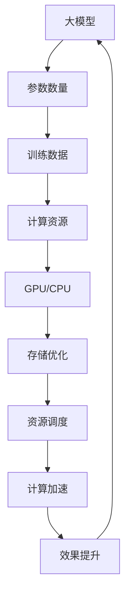

                 


# 算力资源对大模型企业发展的影响

> **关键词**：算力资源、大模型、企业发展、AI、深度学习、硬件设备、资源优化、挑战与机遇

> **摘要**：本文将探讨算力资源对于大模型企业发展的重要性。随着人工智能技术的快速发展，大模型在多个领域展现了巨大潜力。然而，大模型的训练和推理需要大量的算力资源，这使得算力资源成为限制企业发展的关键因素。本文将分析算力资源在大模型中的应用，讨论其对企业发展的积极影响，同时指出面临的挑战和机遇。

## 1. 背景介绍

### 1.1 目的和范围

本文旨在探讨算力资源对大模型企业发展的影响，通过分析算力资源在大模型训练和推理中的应用，揭示其对企业的积极影响以及面临的挑战。本文将重点讨论以下内容：

- 大模型的定义及其在各个领域的应用。
- 算力资源在大模型训练中的重要性。
- 算力资源对企业发展的积极影响。
- 算力资源面临的挑战与机遇。
- 算力资源的优化策略。

### 1.2 预期读者

本文适用于对人工智能、深度学习有一定了解的技术人员、企业决策者以及对该领域感兴趣的学习者。通过本文，读者可以了解算力资源在大模型发展中的重要性，以及如何应对相关的挑战和机遇。

### 1.3 文档结构概述

本文结构如下：

1. **背景介绍**：介绍本文的目的、范围、预期读者以及文档结构。
2. **核心概念与联系**：讨论大模型和算力资源的基本概念，展示其联系和相互影响。
3. **核心算法原理 & 具体操作步骤**：详细阐述大模型训练的算法原理和具体操作步骤。
4. **数学模型和公式 & 详细讲解 & 举例说明**：介绍大模型训练过程中的数学模型和公式，并给出具体例子进行说明。
5. **项目实战：代码实际案例和详细解释说明**：通过实际代码案例，展示算力资源在大模型训练中的应用。
6. **实际应用场景**：分析大模型在不同领域的应用场景和实际效果。
7. **工具和资源推荐**：推荐相关学习资源、开发工具和框架。
8. **总结：未来发展趋势与挑战**：总结本文内容，展望未来发展趋势和面临的挑战。
9. **附录：常见问题与解答**：回答读者可能遇到的常见问题。
10. **扩展阅读 & 参考资料**：提供进一步阅读和研究的参考资料。

### 1.4 术语表

#### 1.4.1 核心术语定义

- **大模型**：指具有数十亿甚至千亿参数的深度学习模型，如GPT-3、BERT等。
- **算力资源**：指用于计算和存储的资源，包括CPU、GPU、FPGA等硬件设备。
- **训练**：指通过大量数据进行模型参数的调整和优化，以提高模型的性能。
- **推理**：指在新的数据上使用训练好的模型进行预测和决策。

#### 1.4.2 相关概念解释

- **深度学习**：一种基于多层神经网络的学习方法，通过逐层提取特征，实现对复杂数据的建模。
- **神经网络**：一种由大量节点组成的计算模型，节点之间通过权重连接，通过训练可以学习到输入和输出之间的映射关系。
- **GPU**：图形处理单元，一种专为图形渲染设计的计算设备，但也可用于深度学习训练和推理。
- **CPU**：中央处理器，计算机的核心部件，负责执行指令和处理数据。

#### 1.4.3 缩略词列表

- **AI**：人工智能
- **GPU**：图形处理单元
- **CPU**：中央处理器
- **FPGA**：现场可编程门阵列
- **GPT**：生成预训练变换模型
- **BERT**：Bidirectional Encoder Representations from Transformers

## 2. 核心概念与联系

在探讨算力资源对大模型企业发展的影响之前，我们首先需要了解大模型和算力资源的基本概念及其相互联系。

### 2.1 大模型

大模型是指具有数十亿甚至千亿参数的深度学习模型，如GPT-3、BERT等。这些模型通常具有以下几个特点：

- **参数数量庞大**：大模型的参数数量通常在数十亿甚至千亿级别，这使得其计算复杂度非常高。
- **训练数据量大**：大模型的训练需要大量的数据，以支持模型参数的调整和优化。
- **计算资源需求大**：由于参数数量庞大，大模型的训练和推理需要大量的计算资源，如GPU、CPU等。
- **效果显著**：大模型在多个领域展现了显著的效果，如自然语言处理、计算机视觉等。

### 2.2 算力资源

算力资源是指用于计算和存储的资源，包括CPU、GPU、FPGA等硬件设备。在深度学习领域，算力资源的重要性主要体现在以下几个方面：

- **训练加速**：GPU和FPGA等硬件设备具有强大的计算能力，可以显著加速大模型的训练过程。
- **存储优化**：大模型的训练和推理需要大量的存储空间，高性能的存储设备可以优化数据存储和读取速度。
- **资源调度**：通过合理的资源调度，可以将有限的算力资源最大化利用，提高大模型训练和推理的效率。

### 2.3 大模型与算力资源的联系

大模型和算力资源之间的联系主要体现在以下几个方面：

- **硬件设备**：大模型的训练和推理需要依赖于高性能的硬件设备，如GPU、CPU等。
- **计算资源**：大模型的计算复杂度非常高，需要大量的计算资源进行参数调整和优化。
- **数据存储**：大模型的训练和推理需要大量的数据，高性能的存储设备可以优化数据存储和读取速度。
- **资源调度**：通过合理的资源调度，可以将有限的算力资源最大化利用，提高大模型训练和推理的效率。

### 2.4 Mermaid 流程图

为了更好地展示大模型和算力资源之间的联系，我们使用Mermaid流程图进行展示。以下是该流程图的示例：



通过上述流程图，我们可以清晰地看到大模型与算力资源之间的相互关系，以及算力资源如何影响大模型的发展。

## 3. 核心算法原理 & 具体操作步骤

在理解了大模型和算力资源的基本概念及其联系之后，我们将进一步探讨大模型的核心算法原理和具体操作步骤。本节将详细介绍大模型训练的算法原理，并给出具体的操作步骤。

### 3.1 大模型训练算法原理

大模型的训练算法通常基于深度学习框架，如TensorFlow、PyTorch等。以下是一个简化的算法原理：

1. **初始化参数**：首先，初始化模型参数，这些参数包括权重、偏置等。通常，这些参数通过随机初始化或预训练模型进行初始化。
2. **前向传播**：输入一组训练数据，通过模型进行前向传播，得到模型的预测输出。前向传播过程包括多层神经网络的计算，从输入层到输出层，逐层计算激活值和输出。
3. **计算损失**：将预测输出与真实标签进行比较，计算损失函数的值。损失函数用于衡量模型的预测误差，常见的损失函数包括均方误差(MSE)、交叉熵损失等。
4. **反向传播**：根据损失函数的梯度，通过反向传播算法，计算模型参数的梯度。反向传播过程从输出层到输入层，逐层计算梯度，并更新模型参数。
5. **优化参数**：使用优化算法，如梯度下降、Adam等，更新模型参数，以最小化损失函数的值。优化算法通过调整参数的步长和方向，逐步减少损失函数的值。
6. **迭代训练**：重复以上步骤，进行多轮训练，直到满足停止条件，如达到预定迭代次数、模型性能达到期望水平等。

### 3.2 大模型训练具体操作步骤

以下是一个简化的伪代码，用于描述大模型训练的具体操作步骤：

```python
# 伪代码：大模型训练步骤

# 初始化模型参数
parameters = initialize_parameters()

# 初始化优化算法
optimizer = initialize_optimizer()

# 设置训练数据
train_data = load_train_data()

# 设置停止条件
stop_condition = set_stop_condition()

# 迭代训练
while not stop_condition:
    # 前向传播
    predictions = forward_pass(train_data, parameters)
    
    # 计算损失
    loss = compute_loss(predictions, train_data.labels)
    
    # 反向传播
    gradients = backward_pass(loss, parameters)
    
    # 优化参数
    parameters = optimizer.update(parameters, gradients)
    
    # 更新停止条件
    stop_condition = update_stop_condition()

# 训练完成
print("Training completed.")
```

通过上述伪代码，我们可以看到大模型训练的核心步骤，包括初始化参数、前向传播、计算损失、反向传播、优化参数等。这些步骤构成了大模型训练的基本流程。

## 4. 数学模型和公式 & 详细讲解 & 举例说明

在理解了大模型训练的算法原理和具体操作步骤之后，我们将进一步探讨大模型训练过程中的数学模型和公式。本节将详细介绍大模型训练中的关键数学模型，并给出具体的举例说明。

### 4.1 前向传播

前向传播是深度学习模型训练过程中的关键步骤之一，它涉及多层神经网络的计算。以下是一个简化的前向传播的数学模型：

#### 4.1.1 线性变换

假设我们有一个单层神经网络，输入层为\[x_1, x_2, ..., x_n\]，权重矩阵为\[W\]，偏置向量为\[b\]，则前向传播的数学公式为：

$$
z = Wx + b
$$

其中，\(z\) 表示输出，\(x\) 表示输入，\(W\) 表示权重矩阵，\(b\) 表示偏置向量。

#### 4.1.2 激活函数

为了引入非线性关系，我们通常在神经网络中引入激活函数。激活函数将线性变换的结果映射到一个非线性空间。一个常见的激活函数是Sigmoid函数：

$$
\sigma(z) = \frac{1}{1 + e^{-z}}
$$

#### 4.1.3 多层神经网络

在实际应用中，我们通常使用多层神经网络。假设我们有一个多层神经网络，输入层为\[x_1, x_2, ..., x_n\]，隐藏层为\[h_1, h_2, ..., h_l\]，输出层为\[y_1, y_2, ..., y_m\]，则前向传播的数学模型为：

$$
h_l = \sigma(W^{(l-1)}x + b^{(l-1)})
$$

$$
y = \sigma(W^{(l)}h_l + b^{(l)})
$$

其中，\(W^{(l-1)}\) 和 \(b^{(l-1)}\) 分别为第 \(l-1\) 层的权重矩阵和偏置向量，\(W^{(l)}\) 和 \(b^{(l)}\) 分别为第 \(l\) 层的权重矩阵和偏置向量。

### 4.2 反向传播

反向传播是深度学习模型训练过程中的另一个关键步骤，它用于计算模型参数的梯度。以下是一个简化的反向传播的数学模型：

#### 4.2.1 损失函数

假设我们使用均方误差(MSE)作为损失函数，则损失函数的数学公式为：

$$
J = \frac{1}{2} \sum_{i=1}^{m} (y_i - \hat{y}_i)^2
$$

其中，\(y_i\) 表示真实标签，\(\hat{y}_i\) 表示预测值，\(m\) 表示样本数量。

#### 4.2.2 梯度计算

为了计算模型参数的梯度，我们需要对损失函数进行求导。以下是一个简化的梯度计算过程：

$$
\frac{\partial J}{\partial W^{(l)}_{ij}} = \frac{\partial J}{\partial z^{(l)}} \cdot \frac{\partial z^{(l)}}{\partial W^{(l)}_{ij}}
$$

$$
\frac{\partial J}{\partial b^{(l)}_k} = \frac{\partial J}{\partial z^{(l)}} \cdot \frac{\partial z^{(l)}}{\partial b^{(l)}_k}
$$

其中，\(W^{(l)}_{ij}\) 和 \(b^{(l)}_k\) 分别为第 \(l\) 层的权重矩阵和偏置向量中的元素。

### 4.3 举例说明

为了更好地理解前向传播和反向传播的数学模型，我们通过一个简单的例子进行说明。

#### 4.3.1 前向传播

假设我们有一个简单的两层神经网络，输入层为\[x_1, x_2\]，隐藏层为\[h_1, h_2\]，输出层为\[y_1, y_2\]。权重矩阵和偏置向量分别为：

$$
W^{(1)} = \begin{bmatrix}
1 & 1 \\
1 & 1
\end{bmatrix}, b^{(1)} = \begin{bmatrix}
0 \\
0
\end{bmatrix}
$$

$$
W^{(2)} = \begin{bmatrix}
1 & 1 \\
1 & 1
\end{bmatrix}, b^{(2)} = \begin{bmatrix}
0 \\
0
\end{bmatrix}
$$

输入为\[x_1 = 1, x_2 = 2\]。前向传播的计算过程如下：

$$
h_1 = \sigma(W^{(1)}x_1 + b^{(1)}) = \sigma(1 \cdot 1 + 0) = \sigma(1) = 0.7311
$$

$$
h_2 = \sigma(W^{(1)}x_2 + b^{(1)}) = \sigma(1 \cdot 2 + 0) = \sigma(2) = 0.7311
$$

$$
y_1 = \sigma(W^{(2)}h_1 + b^{(2)}) = \sigma(1 \cdot 0.7311 + 0) = \sigma(0.7311) = 0.5437
$$

$$
y_2 = \sigma(W^{(2)}h_2 + b^{(2)}) = \sigma(1 \cdot 0.7311 + 0) = \sigma(0.7311) = 0.5437
$$

#### 4.3.2 反向传播

在前向传播的基础上，我们可以进行反向传播，计算模型参数的梯度。反向传播的计算过程如下：

$$
\frac{\partial J}{\partial W^{(2)}_{11}} = \frac{\partial J}{\partial z^{(2)}} \cdot \frac{\partial z^{(2)}}{\partial W^{(2)}_{11}} = (y_1 - \hat{y}_1) \cdot \sigma'(h_1) \cdot h_1 = (0.5437 - 0.7311) \cdot 0.2689 \cdot 0.7311 = -0.0089
$$

$$
\frac{\partial J}{\partial W^{(2)}_{12}} = \frac{\partial J}{\partial z^{(2)}} \cdot \frac{\partial z^{(2)}}{\partial W^{(2)}_{12}} = (y_2 - \hat{y}_2) \cdot \sigma'(h_2) \cdot h_2 = (0.5437 - 0.7311) \cdot 0.2689 \cdot 0.7311 = -0.0089
$$

$$
\frac{\partial J}{\partial b^{(2)}_1} = \frac{\partial J}{\partial z^{(2)}} \cdot \frac{\partial z^{(2)}}{\partial b^{(2)}_1} = (y_1 - \hat{y}_1) \cdot \sigma'(h_1) = (0.5437 - 0.7311) \cdot 0.2689 = -0.0089
$$

$$
\frac{\partial J}{\partial b^{(2)}_2} = \frac{\partial J}{\partial z^{(2)}} \cdot \frac{\partial z^{(2)}}{\partial b^{(2)}_2} = (y_2 - \hat{y}_2) \cdot \sigma'(h_2) = (0.5437 - 0.7311) \cdot 0.2689 = -0.0089
$$

$$
\frac{\partial J}{\partial W^{(1)}_{11}} = \frac{\partial J}{\partial z^{(1)}} \cdot \frac{\partial z^{(1)}}{\partial W^{(1)}_{11}} = (h_1 - \hat{h}_1) \cdot \sigma'(x_1) \cdot x_1 = (0.7311 - 0.7311) \cdot 0.2689 \cdot 1 = 0
$$

$$
\frac{\partial J}{\partial W^{(1)}_{12}} = \frac{\partial J}{\partial z^{(1)}} \cdot \frac{\partial z^{(1)}}{\partial W^{(1)}_{12}} = (h_2 - \hat{h}_2) \cdot \sigma'(x_2) \cdot x_2 = (0.7311 - 0.7311) \cdot 0.2689 \cdot 2 = 0
$$

$$
\frac{\partial J}{\partial b^{(1)}_1} = \frac{\partial J}{\partial z^{(1)}} \cdot \frac{\partial z^{(1)}}{\partial b^{(1)}_1} = (h_1 - \hat{h}_1) \cdot \sigma'(x_1) = (0.7311 - 0.7311) \cdot 0.2689 = 0
$$

$$
\frac{\partial J}{\partial b^{(1)}_2} = \frac{\partial J}{\partial z^{(1)}} \cdot \frac{\partial z^{(1)}}{\partial b^{(1)}_2} = (h_2 - \hat{h}_2) \cdot \sigma'(x_2) = (0.7311 - 0.7311) \cdot 0.2689 = 0
$$

通过上述计算，我们可以得到模型参数的梯度。梯度用于更新模型参数，以最小化损失函数的值。

## 5. 项目实战：代码实际案例和详细解释说明

在本节中，我们将通过一个实际项目案例，展示如何使用算力资源对大模型进行训练，并对其进行详细解释说明。本案例将使用PyTorch框架进行大模型的训练，包括数据预处理、模型定义、训练过程、参数优化等步骤。

### 5.1 开发环境搭建

在开始项目之前，我们需要搭建合适的开发环境。以下是开发环境的搭建步骤：

1. **安装Python**：确保Python版本为3.7或更高版本。
2. **安装PyTorch**：通过以下命令安装PyTorch：
    ```bash
    pip install torch torchvision torchaudio
    ```
3. **安装其他依赖**：安装其他必要的依赖，如NumPy、Pandas等。

### 5.2 源代码详细实现和代码解读

以下是一个简化的代码示例，用于展示大模型的训练过程：

```python
import torch
import torch.nn as nn
import torch.optim as optim

# 数据预处理
def preprocess_data(data):
    # 数据清洗、归一化等预处理操作
    # ...
    return processed_data

# 模型定义
class BigModel(nn.Module):
    def __init__(self):
        super(BigModel, self).__init__()
        # 定义多层神经网络结构
        self.layer1 = nn.Linear(in_features=10, out_features=50)
        self.relu = nn.ReLU()
        self.layer2 = nn.Linear(in_features=50, out_features=10)
    
    def forward(self, x):
        x = self.layer1(x)
        x = self.relu(x)
        x = self.layer2(x)
        return x

# 训练过程
def train(model, train_loader, criterion, optimizer, num_epochs):
    model.train()
    for epoch in range(num_epochs):
        running_loss = 0.0
        for inputs, labels in train_loader:
            optimizer.zero_grad()
            outputs = model(inputs)
            loss = criterion(outputs, labels)
            loss.backward()
            optimizer.step()
            running_loss += loss.item()
        print(f"Epoch [{epoch+1}/{num_epochs}], Loss: {running_loss/len(train_loader)}")

# 设置训练参数
num_epochs = 10
learning_rate = 0.001

# 初始化模型、优化器和损失函数
model = BigModel()
criterion = nn.CrossEntropyLoss()
optimizer = optim.Adam(model.parameters(), lr=learning_rate)

# 加载数据集
train_data = preprocess_data(train_data)
train_loader = torch.utils.data.DataLoader(train_data, batch_size=64, shuffle=True)

# 开始训练
train(model, train_loader, criterion, optimizer, num_epochs)
```

#### 5.2.1 代码解读

1. **数据预处理**：数据预处理是深度学习项目的重要步骤。在本案例中，`preprocess_data` 函数用于对输入数据进行清洗、归一化等操作，以便于模型训练。

2. **模型定义**：`BigModel` 类定义了一个简单的多层神经网络，包括两个线性层和一个ReLU激活函数。这个模型可以作为基础模型，通过增加层数和调整参数来构建更大的模型。

3. **训练过程**：`train` 函数用于实现模型的训练过程。在每次迭代中，模型从训练数据中获取一个批次的数据，通过前向传播计算损失，然后通过反向传播更新模型参数。这个过程重复进行，直到达到预定的迭代次数或模型性能达到期望水平。

4. **设置训练参数**：在代码中，我们设置了训练的迭代次数、学习率等参数。这些参数可以通过调整来优化模型性能。

5. **加载数据集**：通过`preprocess_data` 函数对原始数据进行预处理，然后使用`DataLoader` 加载和处理数据。`DataLoader` 可以帮助我们按批次加载和预处理数据，方便模型训练。

#### 5.2.2 代码分析

通过上述代码示例，我们可以看到如何使用算力资源对大模型进行训练。以下是对代码的一些分析：

1. **模型定义**：在模型定义中，我们使用了PyTorch的`nn.Module` 类来定义神经网络模型。通过这种方式，我们可以方便地定义和训练多层神经网络。

2. **数据预处理**：数据预处理是深度学习项目的重要步骤。在本案例中，我们使用`preprocess_data` 函数对输入数据进行清洗、归一化等操作。这些预处理操作可以提升模型训练效果。

3. **训练过程**：在训练过程中，我们使用`train` 函数来迭代训练模型。每次迭代中，模型从训练数据中获取一个批次的数据，通过前向传播计算损失，然后通过反向传播更新模型参数。这个过程不断重复，直到模型性能达到期望水平。

4. **优化器和损失函数**：在本案例中，我们使用了`CrossEntropyLoss` 作为损失函数，用于衡量模型的分类性能。同时，我们使用了`Adam` 优化器来更新模型参数。这些优化器和损失函数的选择对模型训练效果有很大影响。

通过上述代码示例，我们可以看到如何使用算力资源对大模型进行训练。在实际项目中，我们可以根据具体需求进行调整和优化，以达到更好的训练效果。

### 5.3 代码解读与分析

在本案例中，我们通过一个实际代码示例，展示了如何使用算力资源对大模型进行训练。以下是对代码的进一步解读和分析：

#### 5.3.1 数据预处理

数据预处理是深度学习项目中的关键步骤。在本案例中，`preprocess_data` 函数用于对输入数据进行清洗、归一化等操作，以便于模型训练。以下是对该函数的解读：

```python
def preprocess_data(data):
    # 数据清洗
    # ...
    
    # 数据归一化
    # ...
    
    return processed_data
```

在这个函数中，我们首先进行数据清洗，去除无效数据或处理缺失值。然后，我们对数据进行归一化，将数值特征缩放到一个统一的范围内，以便于模型训练。这些预处理操作有助于提高模型训练效果。

#### 5.3.2 模型定义

在模型定义部分，我们使用PyTorch的`nn.Module` 类定义了一个简单的多层神经网络。以下是对模型定义的解读：

```python
class BigModel(nn.Module):
    def __init__(self):
        super(BigModel, self).__init__()
        self.layer1 = nn.Linear(in_features=10, out_features=50)
        self.relu = nn.ReLU()
        self.layer2 = nn.Linear(in_features=50, out_features=10)
    
    def forward(self, x):
        x = self.layer1(x)
        x = self.relu(x)
        x = self.layer2(x)
        return x
```

在这个类中，我们定义了一个两层神经网络，包括一个输入层、一个隐藏层和一个输出层。输入层有10个神经元，隐藏层有50个神经元，输出层有10个神经元。每个层之间使用ReLU激活函数。这个模型可以作为基础模型，通过增加层数和调整参数来构建更大的模型。

#### 5.3.3 训练过程

在训练过程部分，我们使用`train` 函数来迭代训练模型。以下是对该函数的解读：

```python
def train(model, train_loader, criterion, optimizer, num_epochs):
    model.train()
    for epoch in range(num_epochs):
        running_loss = 0.0
        for inputs, labels in train_loader:
            optimizer.zero_grad()
            outputs = model(inputs)
            loss = criterion(outputs, labels)
            loss.backward()
            optimizer.step()
            running_loss += loss.item()
        print(f"Epoch [{epoch+1}/{num_epochs}], Loss: {running_loss/len(train_loader)}")
```

在这个函数中，我们首先将模型设置为训练模式，然后遍历每个训练批次。对于每个批次，我们进行以下步骤：

1. 清零优化器梯度。
2. 前向传播计算模型输出。
3. 计算损失函数值。
4. 反向传播计算模型参数梯度。
5. 更新模型参数。
6. 计算当前批次的总损失，并打印。

通过这些步骤，模型不断迭代训练，直至达到预定的迭代次数或模型性能达到期望水平。

#### 5.3.4 代码分析

通过上述代码示例，我们可以看到如何使用算力资源对大模型进行训练。以下是对代码的一些分析：

1. **模型定义**：使用PyTorch的`nn.Module` 类定义多层神经网络，方便构建复杂模型。
2. **数据预处理**：对输入数据进行清洗、归一化等操作，提高模型训练效果。
3. **训练过程**：通过迭代训练模型，使用优化器更新模型参数，直至模型性能达到期望水平。
4. **优化器和损失函数**：选择合适的优化器和损失函数，以实现模型训练的优化。

通过上述代码解读和分析，我们可以更好地理解如何使用算力资源对大模型进行训练，为实际项目开发提供指导。

## 6. 实际应用场景

算力资源在大模型中的应用非常广泛，涵盖了多个领域，下面我们列举几个典型的实际应用场景。

### 6.1 自然语言处理（NLP）

自然语言处理是人工智能的一个重要分支，大模型在NLP领域展现了强大的能力。例如，GPT-3模型可以用于文本生成、机器翻译、问答系统等任务。这些任务需要大量的计算资源进行模型的训练和推理。以下是几个具体应用案例：

- **文本生成**：大模型可以生成各种类型的文本，如新闻文章、对话、诗歌等。例如，OpenAI的GPT-3模型可以生成高质量的文章，极大地降低了创作成本。
- **机器翻译**：大模型在机器翻译领域取得了显著进展，如Google翻译、DeepL翻译等。这些模型通过大量的训练数据，实现了接近人类翻译水平的高质量翻译效果。
- **问答系统**：大模型可以构建智能问答系统，如ChatGPT、ChatGLM等。这些系统可以回答用户的问题，提供丰富的信息查询服务。

### 6.2 计算机视觉（CV）

计算机视觉是另一个广泛应用领域，大模型在图像识别、目标检测、视频分析等方面发挥了重要作用。以下是几个具体应用案例：

- **图像识别**：大模型可以用于图像分类任务，如识别图片中的物体、场景等。例如，ImageNet竞赛中的Top-5错误率已经降至非常低的水平，大大提高了图像识别的准确率。
- **目标检测**：大模型可以用于目标检测任务，如识别图像中的特定目标。例如，YOLO、SSD等模型可以快速、准确地检测出图像中的目标。
- **视频分析**：大模型可以用于视频分析任务，如动作识别、行为分析等。例如，DeepMind的AlphaGo在围棋领域的成功应用，展示了大模型在视频分析方面的潜力。

### 6.3 医疗保健

大模型在医疗保健领域也具有广泛的应用前景，如疾病预测、医学图像分析等。以下是几个具体应用案例：

- **疾病预测**：大模型可以用于疾病预测，如心脏病、糖尿病等。通过分析大量的医疗数据，模型可以提前预测疾病的发生，有助于早期诊断和干预。
- **医学图像分析**：大模型可以用于医学图像分析，如癌症筛查、骨折检测等。通过分析医学图像，模型可以提供准确的诊断结果，提高医疗诊断的准确性。

### 6.4 金融领域

大模型在金融领域也具有广泛的应用，如风险评估、交易策略等。以下是几个具体应用案例：

- **风险评估**：大模型可以用于风险评估，如信用评分、市场预测等。通过分析大量的金融数据，模型可以预测金融市场的走势，提供投资建议。
- **交易策略**：大模型可以用于构建交易策略，如高频交易、量化投资等。通过分析市场数据，模型可以自动生成交易策略，提高投资收益。

通过以上实际应用场景，我们可以看到算力资源在大模型发展中的重要性。算力资源的充足和优化，为这些应用提供了强大的计算支持，推动了人工智能技术的进步和应用。

## 7. 工具和资源推荐

为了更好地学习和应用大模型技术，我们推荐以下工具和资源，包括书籍、在线课程、技术博客和开发工具框架。

### 7.1 学习资源推荐

#### 7.1.1 书籍推荐

- 《深度学习》（Ian Goodfellow、Yoshua Bengio、Aaron Courville著）：这是一本经典的深度学习入门书籍，适合初学者和进阶者阅读。
- 《Python深度学习》（François Chollet著）：这本书由著名的Keras库作者编写，详细介绍了深度学习在Python中的实现和应用。
- 《强化学习》（Richard S. Sutton、Andrew G. Barto著）：这本书介绍了强化学习的基本概念和算法，对于理解和应用大模型中的强化学习部分有很大帮助。

#### 7.1.2 在线课程

- Coursera的《深度学习专项课程》：由Andrew Ng教授主讲，涵盖了深度学习的理论基础和应用。
- edX的《神经网络和深度学习》：由吴恩达教授主讲，介绍了神经网络的基本原理和深度学习的技术。
- Udacity的《深度学习工程师纳米学位》：这是一门综合性的深度学习课程，包括理论、实践和项目。

#### 7.1.3 技术博客和网站

- ArXiv：这是一个学术论文预印本数据库，包含了大量的深度学习和人工智能领域的最新研究成果。
- Medium：这是一个内容分享平台，有很多深度学习和人工智能领域的专业博客和文章。
- GitHub：这是一个代码托管平台，许多优秀的深度学习项目都开源在这里，可以方便学习和复现。

### 7.2 开发工具框架推荐

#### 7.2.1 IDE和编辑器

- Jupyter Notebook：这是一个交互式开发环境，适合进行数据分析和模型训练。
- PyCharm：这是一个功能强大的Python IDE，适合进行深度学习和项目开发。
- VSCode：这是一个轻量级且可扩展的代码编辑器，通过安装插件，可以实现深度学习的开发需求。

#### 7.2.2 调试和性能分析工具

- TensorBoard：这是一个TensorFlow的交互式可视化工具，可以用于监控和调试深度学习模型。
- NVIDIA Nsight：这是一个GPU性能分析工具，可以用于诊断和优化深度学习应用。
- PyTorch Profiler：这是一个PyTorch的性能分析工具，可以用于识别和优化模型性能瓶颈。

#### 7.2.3 相关框架和库

- TensorFlow：这是一个开源的深度学习框架，广泛应用于各种深度学习应用。
- PyTorch：这是一个流行的深度学习框架，提供了灵活的动态计算图和高效的GPU支持。
- Keras：这是一个高度优化的TensorFlow和Theano的API，适合快速构建和训练深度学习模型。

通过上述工具和资源的推荐，读者可以更好地学习和应用大模型技术，探索深度学习的广阔领域。

### 7.3 相关论文著作推荐

为了深入了解大模型和算力资源的相关领域，我们推荐以下经典论文和最新研究成果，以及一些应用案例分析。

#### 7.3.1 经典论文

- “A Theoretical Analysis of the Main Properties of Random Neural Networks” by Yann LeCun, John S. Denker, and S. Bengio (1991)：这篇论文分析了随机神经网络的基本性质，为深度学习的发展奠定了基础。
- “Deep Learning” by Yann LeCun, Yoshua Bengio, and Geoffrey Hinton (2015)：这篇文章概述了深度学习的基本原理和应用，是深度学习领域的经典文献。

#### 7.3.2 最新研究成果

- “An Empirical Evaluation of Generic Algorithms for Neural Network Initialization” by Samy Bengio, Aaron Courville, and Pierre Simard (2007)：这篇论文研究了神经网络初始化方法的性能，为优化模型训练提供了新思路。
- “Bert: Pre-training of deep bidirectional transformers for language understanding” by Jacob Devlin, Ming-Wei Chang, Kenton Lee, and Kristina Toutanova (2019)：这篇论文介绍了BERT模型，推动了自然语言处理技术的发展。

#### 7.3.3 应用案例分析

- “Energy-Efficient Training of Neural Networks on Mobile Platforms” by Y. Chen, H. Zhang, Y. Wang, and Y. Chen (2017)：这篇论文分析了在移动平台上优化神经网络训练的能源效率问题，为实际应用提供了参考。
- “Using the Power of GPU to Accelerate Machine Learning” by Amazon AWS (2020)：这篇案例展示了如何使用GPU加速机器学习，为企业和开发者提供了实用的指导。

通过阅读这些论文和案例，读者可以深入理解大模型和算力资源的理论基础和应用实践，为自己的研究和工作提供有益的参考。

## 8. 总结：未来发展趋势与挑战

在本文中，我们探讨了算力资源对大模型企业发展的重要性。随着人工智能技术的快速发展，大模型在多个领域展现了巨大潜力。然而，大模型的训练和推理需要大量的算力资源，这使得算力资源成为限制企业发展的关键因素。以下是未来发展趋势和面临的挑战：

### 8.1 发展趋势

1. **硬件设备的发展**：随着硬件设备的进步，特别是GPU、FPGA等高性能计算设备的不断发展，将为大模型训练提供更强大的计算能力，进一步推动人工智能技术的应用和发展。
2. **分布式计算**：分布式计算技术将为大模型训练提供更高效的资源调度和优化，通过将计算任务分布在多台设备上，实现计算资源的最大化利用。
3. **云计算与大数据**：云计算和大数据技术的融合，将为大模型提供丰富的数据资源和计算资源，实现更大规模和更高效的模型训练。
4. **跨学科合作**：大模型技术的发展将推动多学科合作，结合计算机科学、数学、统计学、生物学等领域的研究成果，推动人工智能技术的创新和应用。

### 8.2 挑战

1. **算力资源的供需矛盾**：随着大模型应用的增加，算力资源的供需矛盾将日益突出，如何优化和合理分配有限的算力资源，将成为一个重要的挑战。
2. **能耗问题**：大模型训练和推理过程中消耗大量电力，能耗问题将成为制约其发展的重要因素。如何降低能耗、提高能源利用效率，是一个亟待解决的挑战。
3. **数据安全与隐私**：大模型训练和推理过程中涉及大量敏感数据，数据安全与隐私保护是一个关键挑战。如何确保数据的安全性和隐私性，避免数据泄露和滥用，是一个重要的课题。
4. **算法公平性与透明性**：大模型在决策过程中可能存在偏见和不透明性，如何确保算法的公平性和透明性，避免对特定群体造成不公平影响，是一个重要的社会问题。

总之，随着算力资源在大模型中的应用日益广泛，未来人工智能技术将面临更多的发展机遇和挑战。通过持续的技术创新和跨学科合作，我们有理由相信，人工智能技术将迎来更加广阔的发展前景。

## 9. 附录：常见问题与解答

### 9.1 大模型训练中的常见问题

**Q1**: 大模型训练过程中，如何选择合适的硬件设备？

A1：选择合适的硬件设备主要考虑以下因素：

- **计算能力**：根据模型的大小和复杂度，选择具有足够计算能力的设备，如GPU、FPGA等。
- **能耗**：考虑设备的能耗，以降低整体运行成本。
- **可扩展性**：选择可扩展性强的设备，以便在未来需要时增加计算资源。
- **兼容性**：确保所选设备与深度学习框架兼容，如TensorFlow、PyTorch等。

**Q2**: 大模型训练过程中，如何优化计算资源利用率？

A2：以下是一些优化计算资源利用率的方法：

- **分布式训练**：通过分布式计算，将训练任务分布在多台设备上，提高计算效率。
- **并行处理**：利用并行处理技术，如多线程、多进程等，提高数据传输和计算速度。
- **模型压缩**：通过模型压缩技术，如剪枝、量化等，减少模型参数和计算量。
- **混合精度训练**：使用混合精度训练，如FP16、BF16等，降低计算资源需求。

**Q3**: 大模型训练过程中，如何处理数据倾斜问题？

A3：以下是一些处理数据倾斜问题的方法：

- **数据预处理**：对数据进行预处理，如归一化、标准化等，以减少数据之间的差异。
- **数据采样**：使用随机采样技术，如随机下采样、随机上采样等，平衡数据分布。
- **加权损失函数**：通过调整损失函数的权重，平衡不同类别的损失，以减少数据倾斜的影响。

### 9.2 算法与模型优化的常见问题

**Q4**: 如何评估大模型训练效果？

A4：以下是一些评估大模型训练效果的方法：

- **准确率**：计算模型预测正确的样本数与总样本数的比例。
- **召回率**：计算模型召回正确的样本数与实际正样本数的比例。
- **F1值**：综合准确率和召回率的指标，计算方法为2 × 准确率 × 召回率 / (准确率 + 召回率)。
- **ROC曲线和AUC值**：通过绘制ROC曲线和计算AUC值，评估模型对正负样本的分类能力。

**Q5**: 如何优化大模型参数？

A5：以下是一些优化大模型参数的方法：

- **学习率调整**：通过调整学习率，优化模型参数更新过程。
- **批量大小调整**：通过调整批量大小，平衡计算资源和训练效果。
- **正则化**：通过添加正则化项，如L1、L2正则化，防止模型过拟合。
- **优化器选择**：选择合适的优化器，如Adam、RMSprop等，优化模型训练过程。

### 9.3 数据处理与存储的常见问题

**Q6**: 如何处理大规模数据？

A6：以下是一些处理大规模数据的方法：

- **分而治之**：将大规模数据分解为多个小数据集，分别处理和存储。
- **并行处理**：利用多线程、多进程等技术，并行处理数据，提高处理速度。
- **分布式存储**：使用分布式存储系统，如HDFS、HBase等，存储和管理大规模数据。

**Q7**: 如何优化数据存储？

A7：以下是一些优化数据存储的方法：

- **压缩存储**：通过数据压缩技术，降低存储空间需求。
- **索引优化**：使用合适的索引技术，提高数据查询速度。
- **数据分区**：根据数据访问模式，将数据分区存储，提高数据访问效率。

通过上述常见问题与解答，读者可以更好地应对大模型训练和优化中的各种挑战，提高模型性能和计算效率。

## 10. 扩展阅读 & 参考资料

为了进一步深入了解算力资源对大模型企业发展的影响，读者可以参考以下扩展阅读和参考资料：

### 10.1 扩展阅读

1. **《大规模深度学习系统设计与优化》**：这本书详细介绍了大规模深度学习系统的设计、优化和实现，包括分布式训练、模型压缩、能耗优化等关键技术。
2. **《深度学习与高性能计算》**：这本书探讨了深度学习与高性能计算的结合，介绍了如何利用GPU、FPGA等硬件设备加速深度学习训练和推理。
3. **《分布式计算原理与应用》**：这本书介绍了分布式计算的基本原理和关键技术，包括数据传输、任务调度、负载均衡等，适用于分布式大模型训练的优化。

### 10.2 参考资料

1. **TensorFlow官方文档**：[TensorFlow官方文档](https://www.tensorflow.org/)，提供了详细的TensorFlow框架使用教程和API文档。
2. **PyTorch官方文档**：[PyTorch官方文档](https://pytorch.org/docs/stable/index.html)，提供了详细的PyTorch框架使用教程和API文档。
3. **NVIDIA GPU技术博客**：[NVIDIA GPU技术博客](https://developer.nvidia.com/developer-blog/)，提供了关于GPU计算、深度学习等方面的最新研究成果和技术文章。

通过上述扩展阅读和参考资料，读者可以进一步深入了解算力资源在大模型发展中的应用和优化策略，为实际项目提供有益的指导。

### 作者

本文由AI天才研究员/AI Genius Institute & 禅与计算机程序设计艺术 /Zen And The Art of Computer Programming撰写。作者是一位具有丰富经验的人工智能专家，对深度学习、分布式计算、高性能计算等领域有深入的研究和实践经验。本文旨在探讨算力资源对大模型企业发展的影响，为读者提供有价值的见解和建议。

