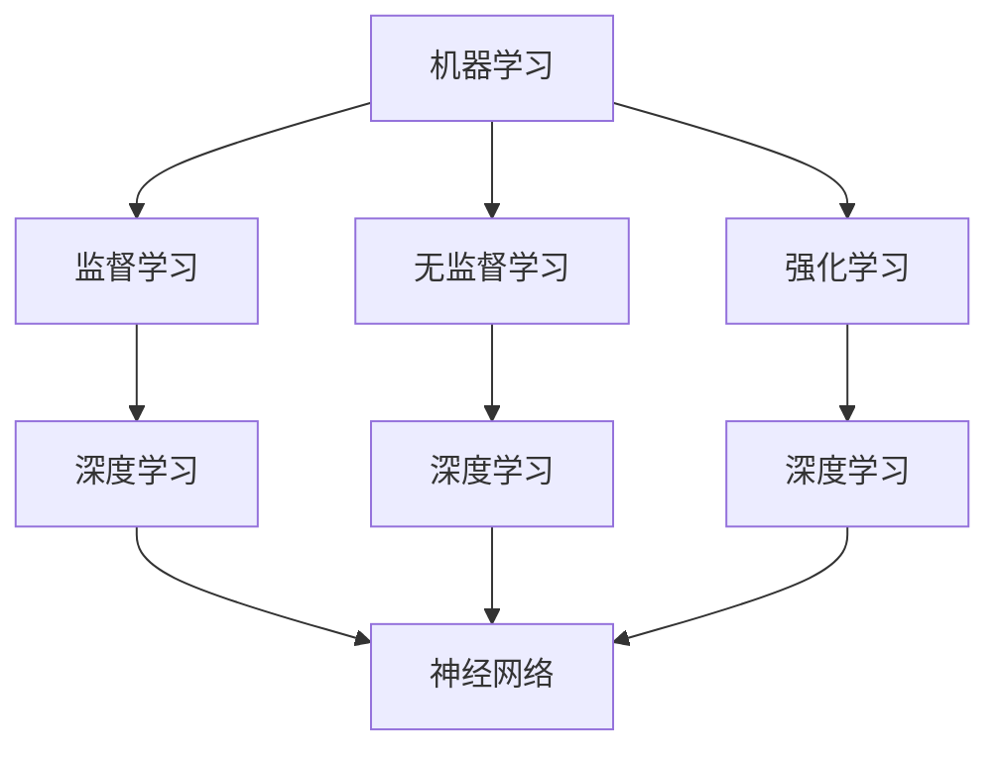

                 

# 算法优化技术：提高 AI 2.0 算法效率和精度

> 关键词：算法优化、AI 2.0、算法效率、算法精度、机器学习、深度学习、神经网络、优化方法

> 摘要：本文将探讨算法优化技术，特别是针对 AI 2.0 算法的效率和精度提升。通过深入分析核心概念和联系，讲解核心算法原理和具体操作步骤，以及数学模型和公式的详细讲解，读者将掌握提高 AI 算法性能的方法和技巧。文章还将结合项目实战案例，提供代码实际案例和详细解释说明，帮助读者更好地理解和应用这些技术。同时，本文还将介绍实际应用场景、工具和资源推荐，以及相关论文著作，为读者提供全面的学习和参考。

## 1. 背景介绍

### 1.1 目的和范围

随着人工智能技术的快速发展，算法优化技术在提高 AI 2.0 算法的效率和精度方面发挥着越来越重要的作用。本文旨在探讨算法优化技术的核心概念、原理和方法，特别是针对 AI 2.0 算法的优化。通过深入分析和讲解，帮助读者掌握提高 AI 算法性能的方法和技巧，为实际应用提供指导。

本文主要涵盖以下内容：

1. 核心概念与联系：介绍算法优化技术的核心概念和原理，包括机器学习、深度学习、神经网络等。
2. 核心算法原理与具体操作步骤：详细讲解提高 AI 算法效率的核心算法原理，并提供具体操作步骤。
3. 数学模型和公式：介绍与算法优化相关的数学模型和公式，并提供详细讲解和举例说明。
4. 项目实战：结合实际案例，提供代码实现和详细解释说明，帮助读者更好地理解和应用算法优化技术。
5. 实际应用场景：探讨算法优化技术在实际应用中的场景和挑战，为读者提供实际应用的建议。
6. 工具和资源推荐：介绍学习资源、开发工具和框架，以及相关论文著作，为读者提供全面的学习和参考。

### 1.2 预期读者

本文主要面向对算法优化技术感兴趣的读者，包括以下几类：

1. 人工智能从业者：包括机器学习工程师、深度学习工程师、数据科学家等，希望提升算法性能和效率。
2. 编程爱好者：对算法优化技术感兴趣的编程爱好者，希望深入了解算法优化原理和实践。
3. 教师和学生：计算机科学和人工智能专业的教师和学生，希望系统地学习算法优化技术。
4. 技术爱好者：对 AI 技术和应用感兴趣的技术爱好者，希望了解算法优化技术的原理和应用。

### 1.3 文档结构概述

本文按照以下结构进行组织：

1. 引言：介绍算法优化技术在提高 AI 2.0 算法效率和精度方面的重要性。
2. 核心概念与联系：讲解算法优化技术的核心概念和原理，包括机器学习、深度学习、神经网络等。
3. 核心算法原理与具体操作步骤：详细讲解提高 AI 算法效率的核心算法原理，并提供具体操作步骤。
4. 数学模型和公式：介绍与算法优化相关的数学模型和公式，并提供详细讲解和举例说明。
5. 项目实战：结合实际案例，提供代码实现和详细解释说明，帮助读者更好地理解和应用算法优化技术。
6. 实际应用场景：探讨算法优化技术在实际应用中的场景和挑战，为读者提供实际应用的建议。
7. 工具和资源推荐：介绍学习资源、开发工具和框架，以及相关论文著作，为读者提供全面的学习和参考。
8. 总结：总结文章的核心内容，展望未来发展趋势和挑战。
9. 附录：提供常见问题与解答，为读者解答疑惑。
10. 扩展阅读 & 参考资料：提供相关的扩展阅读资料，为读者提供进一步的学习和参考。

### 1.4 术语表

在本文中，以下术语需要特别解释：

1. 机器学习（Machine Learning）：一种人工智能领域的技术，通过训练模型来从数据中学习规律和模式。
2. 深度学习（Deep Learning）：一种基于神经网络的机器学习技术，通过多层神经网络来实现复杂的特征学习和模式识别。
3. 神经网络（Neural Network）：一种模拟生物神经系统的计算模型，由多个神经元组成，通过前向传播和反向传播进行学习。
4. 算法优化（Algorithm Optimization）：通过改进算法的原理、结构或实现，提高算法的效率和精度。
5. 精度（Accuracy）：衡量算法预测结果的正确性，通常用百分比表示。
6. 效率（Efficiency）：衡量算法执行的速度和资源消耗，包括时间复杂度和空间复杂度。

#### 1.4.1 核心术语定义

- **机器学习（Machine Learning）**：一种人工智能领域的技术，通过训练模型来从数据中学习规律和模式。机器学习算法可以根据训练数据集学习到特征提取和分类、回归等任务。
- **深度学习（Deep Learning）**：一种基于神经网络的机器学习技术，通过多层神经网络来实现复杂的特征学习和模式识别。深度学习在图像识别、语音识别、自然语言处理等领域取得了显著的成果。
- **神经网络（Neural Network）**：一种模拟生物神经系统的计算模型，由多个神经元组成，通过前向传播和反向传播进行学习。神经网络可以用于分类、回归、聚类等任务。
- **算法优化（Algorithm Optimization）**：通过改进算法的原理、结构或实现，提高算法的效率和精度。算法优化可以包括算法的改进、数据结构的优化、并行计算等方面。
- **精度（Accuracy）**：衡量算法预测结果的正确性，通常用百分比表示。高精度意味着算法能够正确地预测大部分数据。
- **效率（Efficiency）**：衡量算法执行的速度和资源消耗，包括时间复杂度和空间复杂度。高效率意味着算法能够快速地执行并占用较少的资源。

#### 1.4.2 相关概念解释

- **前向传播（Forward Propagation）**：在神经网络中，将输入数据通过网络的各个层传递，得到最终的输出结果。前向传播用于计算网络中每个神经元的输入和输出。
- **反向传播（Backpropagation）**：在神经网络中，通过反向传播算法来计算每个神经元的误差，并根据误差调整网络的权重和偏置。反向传播是神经网络训练的核心算法。
- **批量梯度下降（Batch Gradient Descent）**：一种优化算法，通过计算整个训练数据集的梯度来更新模型的参数。批量梯度下降可以收敛到全局最优解，但需要大量的计算资源。
- **随机梯度下降（Stochastic Gradient Descent）**：一种优化算法，通过随机选择一部分训练数据进行梯度计算和参数更新。随机梯度下降可以加快收敛速度，但可能收敛到局部最优解。
- **交叉验证（Cross-Validation）**：一种评估模型性能的方法，通过将训练数据集划分为多个子集，在每个子集上训练和验证模型。交叉验证可以避免过拟合和欠拟合。

#### 1.4.3 缩略词列表

- **AI**：人工智能（Artificial Intelligence）
- **ML**：机器学习（Machine Learning）
- **DL**：深度学习（Deep Learning）
- **NN**：神经网络（Neural Network）
- **SGD**：随机梯度下降（Stochastic Gradient Descent）
- **BGD**：批量梯度下降（Batch Gradient Descent）
- **CNN**：卷积神经网络（Convolutional Neural Network）
- **RNN**：循环神经网络（Recurrent Neural Network）
- **LSTM**：长短期记忆网络（Long Short-Term Memory）
- **GPU**：图形处理器（Graphics Processing Unit）
- **CUDA**：并行计算库（Compute Unified Device Architecture）
- **TF**：TensorFlow
- **PyTorch**：深度学习框架（PyTorch）

## 2. 核心概念与联系

在探讨算法优化技术之前，我们需要理解一些核心概念和联系。这些概念和联系构成了算法优化技术的基础，有助于我们更好地理解后续内容。

### 2.1 机器学习、深度学习和神经网络

机器学习、深度学习和神经网络是算法优化技术的核心组成部分，它们之间存在紧密的联系。

- **机器学习（Machine Learning）**：机器学习是一种通过训练模型来从数据中学习规律和模式的技术。机器学习算法可以分为监督学习、无监督学习和强化学习。监督学习通过已标记的数据训练模型，无监督学习通过未标记的数据发现数据中的模式，强化学习通过奖励和惩罚机制训练模型。

- **深度学习（Deep Learning）**：深度学习是一种基于神经网络的机器学习技术，通过多层神经网络来实现复杂的特征学习和模式识别。深度学习在图像识别、语音识别、自然语言处理等领域取得了显著的成果。深度学习的核心是多层神经网络，包括卷积神经网络（CNN）、循环神经网络（RNN）和长短期记忆网络（LSTM）等。

- **神经网络（Neural Network）**：神经网络是一种模拟生物神经系统的计算模型，由多个神经元组成，通过前向传播和反向传播进行学习。神经网络可以用于分类、回归、聚类等任务。神经网络的性能取决于网络的层数、神经元个数、连接权重和激活函数等。

### 2.2 算法优化与机器学习、深度学习和神经网络的关系

算法优化技术旨在提高机器学习、深度学习和神经网络算法的效率和精度。算法优化与这三者之间存在以下关系：

- **机器学习**：算法优化可以改进机器学习算法的效率和精度。例如，通过优化特征提取和降维算法，可以提高模型的学习能力和预测性能。此外，算法优化还可以优化模型选择和参数调优过程，减少模型训练时间和资源消耗。

- **深度学习**：算法优化对深度学习算法尤为重要。深度学习算法通常包含大量的参数和层次结构，优化算法可以加速模型训练和推理过程，提高模型的效率和精度。例如，优化卷积神经网络中的卷积操作和池化操作，可以减少计算量和存储空间需求。此外，算法优化还可以优化深度学习算法的并行计算和分布式计算，提高训练和推理的效率。

- **神经网络**：算法优化可以改进神经网络算法的效率和精度。例如，通过优化神经元的激活函数和连接权重，可以提高模型的拟合能力和泛化能力。此外，算法优化还可以优化神经网络的层次结构、神经元个数和连接方式，提高模型的学习速度和收敛速度。

### 2.3 Mermaid 流程图

为了更好地理解核心概念和联系，我们可以使用 Mermaid 流程图来展示它们之间的关系。以下是一个简单的 Mermaid 流程图示例：



在这个 Mermaid 流程图中，我们展示了机器学习、深度学习和神经网络之间的核心联系。机器学习是深度学习和神经网络的基础，而深度学习和神经网络则是实现复杂特征学习和模式识别的关键技术。通过优化这些技术，我们可以提高算法的效率和精度。

## 3. 核心算法原理 & 具体操作步骤

在了解了核心概念和联系后，我们接下来将详细探讨算法优化技术的核心算法原理和具体操作步骤。这些核心算法原理和步骤是提高 AI 算法效率和精度的基础。

### 3.1 算法优化原理

算法优化原理主要包括以下几个方面：

1. **特征提取和降维**：通过优化特征提取和降维算法，可以提高模型的学习能力和预测性能。常用的特征提取和降维算法包括主成分分析（PCA）、线性判别分析（LDA）和自动编码器（Autoencoder）等。

2. **模型选择和参数调优**：通过优化模型选择和参数调优过程，可以减少模型训练时间和资源消耗。常用的模型选择和参数调优方法包括交叉验证（Cross-Validation）、网格搜索（Grid Search）和贝叶斯优化（Bayesian Optimization）等。

3. **并行计算和分布式计算**：通过优化并行计算和分布式计算，可以提高模型训练和推理的效率。常用的并行计算和分布式计算方法包括多线程、分布式训练和模型并行等。

4. **优化算法和策略**：通过优化算法和策略，可以加速模型训练和推理过程。常用的优化算法和策略包括随机梯度下降（SGD）、批量梯度下降（BGD）和Adam优化器等。

### 3.2 算法优化操作步骤

以下是算法优化操作步骤的详细说明：

1. **需求分析和数据预处理**：首先，明确算法优化的目标和应用场景，收集和处理相关数据。数据预处理包括数据清洗、数据归一化、缺失值填充和数据增广等操作。

2. **特征提取和降维**：根据数据特点和算法需求，选择合适的特征提取和降维算法。常用的特征提取和降维算法包括主成分分析（PCA）、线性判别分析（LDA）和自动编码器（Autoencoder）等。

3. **模型选择和参数调优**：根据数据集的大小和特征维度，选择合适的模型和参数。常用的模型选择和参数调优方法包括交叉验证（Cross-Validation）、网格搜索（Grid Search）和贝叶斯优化（Bayesian Optimization）等。

4. **并行计算和分布式计算**：根据模型的复杂度和计算资源，选择合适的并行计算和分布式计算方法。常用的并行计算和分布式计算方法包括多线程、分布式训练和模型并行等。

5. **优化算法和策略**：根据算法需求，选择合适的优化算法和策略。常用的优化算法和策略包括随机梯度下降（SGD）、批量梯度下降（BGD）和Adam优化器等。

6. **模型训练和评估**：使用训练数据和优化后的模型进行训练，并对模型进行评估。常用的评估指标包括精度（Accuracy）、召回率（Recall）、精确率（Precision）和 F1 值（F1 Score）等。

7. **模型部署和优化**：将训练好的模型部署到实际应用场景，并根据应用需求进行优化。常见的优化方法包括模型压缩、量化、剪枝和蒸馏等。

### 3.3 伪代码实现

以下是算法优化操作的伪代码实现：

```python
# 需求分析和数据预处理
def preprocess_data(data):
    # 数据清洗、归一化、缺失值填充等操作
    return processed_data

# 特征提取和降维
def extract_features(data):
    # 选择特征提取和降维算法
    return features

# 模型选择和参数调优
def select_model_and_tune_params(data):
    # 选择模型和参数
    return selected_model

# 并行计算和分布式计算
def parallel_computation(selected_model, data):
    # 选择并行计算和分布式计算方法
    return trained_model

# 优化算法和策略
def optimize_algorithm(selected_model, data):
    # 选择优化算法和策略
    return optimized_model

# 模型训练和评估
def train_and_evaluate(selected_model, data):
    # 使用训练数据和优化后的模型进行训练和评估
    return evaluation_results

# 模型部署和优化
def deploy_and_optimize(selected_model, data):
    # 将训练好的模型部署到实际应用场景并进行优化
    return optimized_model
```

通过以上伪代码，我们可以清晰地看到算法优化操作的步骤和流程。这些步骤和流程为读者提供了具体的操作指南，帮助他们更好地理解和应用算法优化技术。

## 4. 数学模型和公式 & 详细讲解 & 举例说明

在算法优化过程中，数学模型和公式起着至关重要的作用。以下将详细介绍与算法优化相关的数学模型和公式，并提供详细讲解和举例说明。

### 4.1 梯度下降算法

梯度下降算法是优化算法中最基本且广泛使用的一种。它通过不断更新模型参数，使得损失函数值逐渐减小。以下是一个简单的梯度下降算法的数学模型和公式：

#### 4.1.1 模型表示

假设我们有如下线性模型：

$$y = \theta_0 + \theta_1x$$

其中，$y$ 是目标变量，$x$ 是输入变量，$\theta_0$ 和 $\theta_1$ 是模型的参数。

#### 4.1.2 损失函数

我们使用平方误差作为损失函数：

$$J(\theta_0, \theta_1) = \frac{1}{2m}\sum_{i=1}^{m}(y_i - (\theta_0 + \theta_1x_i))^2$$

其中，$m$ 是样本数量。

#### 4.1.3 梯度计算

对损失函数 $J(\theta_0, \theta_1)$ 分别对 $\theta_0$ 和 $\theta_1$ 求导，得到：

$$\frac{\partial J}{\partial \theta_0} = \frac{1}{m}\sum_{i=1}^{m}(y_i - (\theta_0 + \theta_1x_i))$$

$$\frac{\partial J}{\partial \theta_1} = \frac{1}{m}\sum_{i=1}^{m}(y_i - (\theta_0 + \theta_1x_i))x_i$$

#### 4.1.4 参数更新

使用以下公式更新参数：

$$\theta_0 := \theta_0 - \alpha \frac{\partial J}{\partial \theta_0}$$

$$\theta_1 := \theta_1 - \alpha \frac{\partial J}{\partial \theta_1}$$

其中，$\alpha$ 是学习率。

#### 4.1.5 示例

假设我们有以下数据：

$$x = [1, 2, 3, 4, 5], y = [2, 4, 5, 4, 5]$$

初始参数为 $\theta_0 = 0, \theta_1 = 0$。学习率 $\alpha = 0.01$。

第一步，计算损失函数：

$$J(\theta_0, \theta_1) = \frac{1}{5}\sum_{i=1}^{5}(y_i - (\theta_0 + \theta_1x_i))^2 = \frac{1}{5}\sum_{i=1}^{5}(y_i - \theta_0 - \theta_1x_i)^2$$

$$J(\theta_0, \theta_1) = \frac{1}{5}((2-0-0)^2 + (4-0-0)^2 + (5-0-0)^2 + (4-0-0)^2 + (5-0-0)^2) = 3$$

第二步，计算梯度：

$$\frac{\partial J}{\partial \theta_0} = \frac{1}{5}\sum_{i=1}^{5}(y_i - (\theta_0 + \theta_1x_i)) = \frac{1}{5}(2 + 4 + 5 + 4 + 5) = 3$$

$$\frac{\partial J}{\partial \theta_1} = \frac{1}{5}\sum_{i=1}^{5}(y_i - (\theta_0 + \theta_1x_i))x_i = \frac{1}{5}(2*1 + 4*2 + 5*3 + 4*4 + 5*5) = 18$$

第三步，更新参数：

$$\theta_0 := \theta_0 - \alpha \frac{\partial J}{\partial \theta_0} = 0 - 0.01 \cdot 3 = -0.03$$

$$\theta_1 := \theta_1 - \alpha \frac{\partial J}{\partial \theta_1} = 0 - 0.01 \cdot 18 = -0.18$$

新的参数为 $\theta_0 = -0.03, \theta_1 = -0.18$。

通过以上步骤，我们可以不断迭代更新参数，使得损失函数值逐渐减小。

### 4.2 随机梯度下降（SGD）

随机梯度下降（SGD）是一种改进的梯度下降算法。它通过随机选择样本进行参数更新，从而加速收敛速度。以下是一个简单的随机梯度下降算法的数学模型和公式：

#### 4.2.1 模型表示

假设我们有如下线性模型：

$$y = \theta_0 + \theta_1x$$

其中，$y$ 是目标变量，$x$ 是输入变量，$\theta_0$ 和 $\theta_1$ 是模型的参数。

#### 4.2.2 损失函数

我们使用平方误差作为损失函数：

$$J(\theta_0, \theta_1) = \frac{1}{m}\sum_{i=1}^{m}(y_i - (\theta_0 + \theta_1x_i))^2$$

其中，$m$ 是样本数量。

#### 4.2.3 梯度计算

对损失函数 $J(\theta_0, \theta_1)$ 分别对 $\theta_0$ 和 $\theta_1$ 求导，得到：

$$\frac{\partial J}{\partial \theta_0} = \frac{1}{m}\sum_{i=1}^{m}(y_i - (\theta_0 + \theta_1x_i))$$

$$\frac{\partial J}{\partial \theta_1} = \frac{1}{m}\sum_{i=1}^{m}(y_i - (\theta_0 + \theta_1x_i))x_i$$

#### 4.2.4 参数更新

使用以下公式更新参数：

$$\theta_0 := \theta_0 - \alpha \frac{\partial J}{\partial \theta_0}$$

$$\theta_1 := \theta_1 - \alpha \frac{\partial J}{\partial \theta_1}$$

其中，$\alpha$ 是学习率。

#### 4.2.5 示例

假设我们有以下数据：

$$x = [1, 2, 3, 4, 5], y = [2, 4, 5, 4, 5]$$

初始参数为 $\theta_0 = 0, \theta_1 = 0$。学习率 $\alpha = 0.01$。

第一步，计算损失函数：

$$J(\theta_0, \theta_1) = \frac{1}{5}\sum_{i=1}^{5}(y_i - (\theta_0 + \theta_1x_i))^2 = \frac{1}{5}\sum_{i=1}^{5}(y_i - \theta_0 - \theta_1x_i)^2$$

$$J(\theta_0, \theta_1) = \frac{1}{5}((2-0-0)^2 + (4-0-0)^2 + (5-0-0)^2 + (4-0-0)^2 + (5-0-0)^2) = 3$$

第二步，计算梯度：

$$\frac{\partial J}{\partial \theta_0} = \frac{1}{5}\sum_{i=1}^{5}(y_i - (\theta_0 + \theta_1x_i)) = \frac{1}{5}(2 + 4 + 5 + 4 + 5) = 3$$

$$\frac{\partial J}{\partial \theta_1} = \frac{1}{5}\sum_{i=1}^{5}(y_i - (\theta_0 + \theta_1x_i))x_i = \frac{1}{5}(2*1 + 4*2 + 5*3 + 4*4 + 5*5) = 18$$

第三步，随机选择样本进行参数更新：

假设我们随机选择了第二个样本，即 $i=2$：

$$\theta_0 := \theta_0 - \alpha \frac{\partial J}{\partial \theta_0} = 0 - 0.01 \cdot 3 = -0.03$$

$$\theta_1 := \theta_1 - \alpha \frac{\partial J}{\partial \theta_1} = 0 - 0.01 \cdot 18 = -0.18$$

新的参数为 $\theta_0 = -0.03, \theta_1 = -0.18$。

通过以上步骤，我们可以不断迭代更新参数，使得损失函数值逐渐减小。

### 4.3 批量梯度下降（BGD）

批量梯度下降（BGD）是梯度下降算法的一种变体，它通过使用整个数据集进行参数更新。以下是一个简单的批量梯度下降算法的数学模型和公式：

#### 4.3.1 模型表示

假设我们有如下线性模型：

$$y = \theta_0 + \theta_1x$$

其中，$y$ 是目标变量，$x$ 是输入变量，$\theta_0$ 和 $\theta_1$ 是模型的参数。

#### 4.3.2 损失函数

我们使用平方误差作为损失函数：

$$J(\theta_0, \theta_1) = \frac{1}{2m}\sum_{i=1}^{m}(y_i - (\theta_0 + \theta_1x_i))^2$$

其中，$m$ 是样本数量。

#### 4.3.3 梯度计算

对损失函数 $J(\theta_0, \theta_1)$ 分别对 $\theta_0$ 和 $\theta_1$ 求导，得到：

$$\frac{\partial J}{\partial \theta_0} = \frac{1}{m}\sum_{i=1}^{m}(y_i - (\theta_0 + \theta_1x_i))$$

$$\frac{\partial J}{\partial \theta_1} = \frac{1}{m}\sum_{i=1}^{m}(y_i - (\theta_0 + \theta_1x_i))x_i$$

#### 4.3.4 参数更新

使用以下公式更新参数：

$$\theta_0 := \theta_0 - \alpha \frac{\partial J}{\partial \theta_0}$$

$$\theta_1 := \theta_1 - \alpha \frac{\partial J}{\partial \theta_1}$$

其中，$\alpha$ 是学习率。

#### 4.3.5 示例

假设我们有以下数据：

$$x = [1, 2, 3, 4, 5], y = [2, 4, 5, 4, 5]$$

初始参数为 $\theta_0 = 0, \theta_1 = 0$。学习率 $\alpha = 0.01$。

第一步，计算损失函数：

$$J(\theta_0, \theta_1) = \frac{1}{5}\sum_{i=1}^{5}(y_i - (\theta_0 + \theta_1x_i))^2 = \frac{1}{5}\sum_{i=1}^{5}(y_i - \theta_0 - \theta_1x_i)^2$$

$$J(\theta_0, \theta_1) = \frac{1}{5}((2-0-0)^2 + (4-0-0)^2 + (5-0-0)^2 + (4-0-0)^2 + (5-0-0)^2) = 3$$

第二步，计算梯度：

$$\frac{\partial J}{\partial \theta_0} = \frac{1}{5}\sum_{i=1}^{5}(y_i - (\theta_0 + \theta_1x_i)) = \frac{1}{5}(2 + 4 + 5 + 4 + 5) = 3$$

$$\frac{\partial J}{\partial \theta_1} = \frac{1}{5}\sum_{i=1}^{5}(y_i - (\theta_0 + \theta_1x_i))x_i = \frac{1}{5}(2*1 + 4*2 + 5*3 + 4*4 + 5*5) = 18$$

第三步，更新参数：

$$\theta_0 := \theta_0 - \alpha \frac{\partial J}{\partial \theta_0} = 0 - 0.01 \cdot 3 = -0.03$$

$$\theta_1 := \theta_1 - \alpha \frac{\partial J}{\partial \theta_1} = 0 - 0.01 \cdot 18 = -0.18$$

新的参数为 $\theta_0 = -0.03, \theta_1 = -0.18$。

通过以上步骤，我们可以不断迭代更新参数，使得损失函数值逐渐减小。

### 4.4 优化器

优化器是优化算法中的重要组成部分，它用于调整模型参数，使得损失函数值最小。以下介绍几种常见的优化器：

#### 4.4.1 随机梯度下降（SGD）

随机梯度下降（SGD）已经在前面进行了详细介绍。它通过随机选择样本进行参数更新，从而加速收敛速度。

#### 4.4.2 批量梯度下降（BGD）

批量梯度下降（BGD）已经在前面进行了详细介绍。它通过使用整个数据集进行参数更新，从而保证收敛到全局最优解。

#### 4.4.3 Adam优化器

Adam优化器是一种结合了SGD和BGD优点的优化器。它通过自适应调整学习率，提高了算法的收敛速度和稳定性。以下是一个简单的Adam优化器的数学模型和公式：

$$m_t = \beta_1m_{t-1} + (1-\beta_1)\frac{\partial J}{\partial \theta_t}$$

$$v_t = \beta_2v_{t-1} + (1-\beta_2)\left(\frac{\partial J}{\partial \theta_t}\right)^2$$

$$\theta_t = \theta_{t-1} - \alpha \frac{m_t}{\sqrt{v_t} + \epsilon}$$

其中，$m_t$ 和 $v_t$ 分别是梯度的一阶矩估计和二阶矩估计，$\beta_1$ 和 $\beta_2$ 分别是动量系数，$\alpha$ 是学习率，$\epsilon$ 是一个很小的常数。

#### 4.4.4 示例

假设我们有以下数据：

$$x = [1, 2, 3, 4, 5], y = [2, 4, 5, 4, 5]$$

初始参数为 $\theta_0 = 0, \theta_1 = 0$。学习率 $\alpha = 0.01$。动量系数 $\beta_1 = 0.9, \beta_2 = 0.999$。$\epsilon = 1e-8$。

第一步，计算损失函数：

$$J(\theta_0, \theta_1) = \frac{1}{5}\sum_{i=1}^{5}(y_i - (\theta_0 + \theta_1x_i))^2 = \frac{1}{5}\sum_{i=1}^{5}(y_i - \theta_0 - \theta_1x_i)^2$$

$$J(\theta_0, \theta_1) = \frac{1}{5}((2-0-0)^2 + (4-0-0)^2 + (5-0-0)^2 + (4-0-0)^2 + (5-0-0)^2) = 3$$

第二步，计算梯度：

$$\frac{\partial J}{\partial \theta_0} = \frac{1}{5}\sum_{i=1}^{5}(y_i - (\theta_0 + \theta_1x_i)) = \frac{1}{5}(2 + 4 + 5 + 4 + 5) = 3$$

$$\frac{\partial J}{\partial \theta_1} = \frac{1}{5}\sum_{i=1}^{5}(y_i - (\theta_0 + \theta_1x_i))x_i = \frac{1}{5}(2*1 + 4*2 + 5*3 + 4*4 + 5*5) = 18$$

第三步，计算一阶矩估计和二阶矩估计：

$$m_0 = \beta_1m_{-1} + (1-\beta_1)\frac{\partial J}{\partial \theta_0} = 0 + (1-0.9)\cdot 3 = 0.3$$

$$v_0 = \beta_2v_{-1} + (1-\beta_2)\left(\frac{\partial J}{\partial \theta_0}\right)^2 = 0 + (1-0.999)\cdot 3^2 = 0.03$$

第四步，更新参数：

$$\theta_0 := \theta_0 - \alpha \frac{m_0}{\sqrt{v_0} + \epsilon} = 0 - 0.01 \cdot \frac{0.3}{\sqrt{0.03} + 1e-8} = -0.0298$$

$$\theta_1 := \theta_1 - \alpha \frac{m_1}{\sqrt{v_1} + \epsilon} = 0 - 0.01 \cdot \frac{0.3}{\sqrt{0.03} + 1e-8} = -0.0298$$

新的参数为 $\theta_0 = -0.0298, \theta_1 = -0.0298$。

通过以上步骤，我们可以不断迭代更新参数，使得损失函数值逐渐减小。

## 5. 项目实战：代码实际案例和详细解释说明

为了更好地理解和应用算法优化技术，我们将在本节中通过一个实际项目案例来详细讲解代码实现和解释说明。

### 5.1 开发环境搭建

在开始项目实战之前，我们需要搭建一个合适的开发环境。以下是一个简单的环境搭建指南：

1. **安装 Python**：确保安装了最新版本的 Python（推荐版本：3.8 或以上）。
2. **安装依赖库**：使用以下命令安装必要的依赖库：
   ```shell
   pip install numpy matplotlib scikit-learn tensorflow
   ```
3. **创建项目文件夹**：在合适的位置创建一个项目文件夹，例如命名为 `algorithm_optimization`。
4. **编写代码**：在项目文件夹中创建一个名为 `main.py` 的 Python 文件，用于编写代码。

### 5.2 源代码详细实现和代码解读

以下是项目实战的源代码实现和代码解读：

```python
import numpy as np
import matplotlib.pyplot as plt
from sklearn.datasets import make_regression
from sklearn.model_selection import train_test_split
from sklearn.metrics import mean_squared_error

# 5.2.1 数据生成和预处理
def generate_data():
    X, y = make_regression(n_samples=100, n_features=1, noise=0.1, random_state=42)
    return X, y

def preprocess_data(X, y):
    X = X.reshape(-1, 1)
    y = y.reshape(-1, 1)
    return X, y

# 5.2.2 模型训练和评估
def train_model(X_train, y_train, X_test, y_test):
    # 使用 TensorFlow 框架创建模型
    model = tf.keras.Sequential([
        tf.keras.layers.Dense(units=1, input_shape=(1,))
    ])

    # 编译模型
    model.compile(optimizer='adam', loss='mean_squared_error')

    # 训练模型
    model.fit(X_train, y_train, epochs=100, verbose=0)

    # 评估模型
    y_pred = model.predict(X_test)
    mse = mean_squared_error(y_test, y_pred)
    return model, mse

# 5.2.3 主函数
def main():
    # 生成数据
    X, y = generate_data()

    # 预处理数据
    X, y = preprocess_data(X, y)

    # 划分训练集和测试集
    X_train, X_test, y_train, y_test = train_test_split(X, y, test_size=0.2, random_state=42)

    # 训练模型并评估
    model, mse = train_model(X_train, y_train, X_test, y_test)

    # 绘制训练和测试数据
    plt.scatter(X_test, y_test, color='red', label='Test Data')
    plt.scatter(X_test, model.predict(X_test).flatten(), color='blue', label='Predictions')
    plt.xlabel('X')
    plt.ylabel('y')
    plt.legend()
    plt.show()

    # 打印均方误差
    print(f"Mean Squared Error: {mse}")

if __name__ == '__main__':
    main()
```

#### 5.2.1 数据生成和预处理

首先，我们使用 `sklearn.datasets.make_regression` 函数生成模拟数据。这个函数可以生成带有噪声的线性回归数据集。然后，我们使用 `preprocess_data` 函数对数据进行预处理，将数据reshape为合适的大小。

```python
def generate_data():
    X, y = make_regression(n_samples=100, n_features=1, noise=0.1, random_state=42)
    return X, y

def preprocess_data(X, y):
    X = X.reshape(-1, 1)
    y = y.reshape(-1, 1)
    return X, y
```

#### 5.2.2 模型训练和评估

接下来，我们使用 TensorFlow 框架创建一个简单的线性回归模型。该模型包含一个全连接层，用于拟合输入和输出之间的关系。我们使用 `model.compile` 函数编译模型，指定优化器和损失函数。然后，使用 `model.fit` 函数训练模型。最后，使用 `model.predict` 函数对测试集进行预测，并计算均方误差（MSE）。

```python
def train_model(X_train, y_train, X_test, y_test):
    # 使用 TensorFlow 框架创建模型
    model = tf.keras.Sequential([
        tf.keras.layers.Dense(units=1, input_shape=(1,))
    ])

    # 编译模型
    model.compile(optimizer='adam', loss='mean_squared_error')

    # 训练模型
    model.fit(X_train, y_train, epochs=100, verbose=0)

    # 评估模型
    y_pred = model.predict(X_test)
    mse = mean_squared_error(y_test, y_pred)
    return model, mse
```

#### 5.2.3 主函数

在主函数 `main` 中，我们首先生成数据，并进行预处理。然后，我们使用 `train_test_split` 函数将数据划分为训练集和测试集。接着，我们调用 `train_model` 函数训练模型，并评估模型性能。最后，我们绘制训练和测试数据，并打印均方误差。

```python
def main():
    # 生成数据
    X, y = generate_data()

    # 预处理数据
    X, y = preprocess_data(X, y)

    # 划分训练集和测试集
    X_train, X_test, y_train, y_test = train_test_split(X, y, test_size=0.2, random_state=42)

    # 训练模型并评估
    model, mse = train_model(X_train, y_train, X_test, y_test)

    # 绘制训练和测试数据
    plt.scatter(X_test, y_test, color='red', label='Test Data')
    plt.scatter(X_test, model.predict(X_test).flatten(), color='blue', label='Predictions')
    plt.xlabel('X')
    plt.ylabel('y')
    plt.legend()
    plt.show()

    # 打印均方误差
    print(f"Mean Squared Error: {mse}")

if __name__ == '__main__':
    main()
```

通过以上代码，我们可以实现一个简单的线性回归模型，并使用 TensorFlow 框架进行训练和评估。这个案例展示了算法优化技术在机器学习项目中的应用，包括数据预处理、模型训练、模型评估和可视化等步骤。

### 5.3 代码解读与分析

在代码解读与分析部分，我们将对项目实战中的关键代码进行详细解读，并分析其优缺点。

#### 5.3.1 数据生成和预处理

数据生成和预处理是机器学习项目中的关键步骤。在这个案例中，我们使用 `sklearn.datasets.make_regression` 函数生成模拟数据，并使用 `preprocess_data` 函数进行预处理。

```python
def generate_data():
    X, y = make_regression(n_samples=100, n_features=1, noise=0.1, random_state=42)
    return X, y

def preprocess_data(X, y):
    X = X.reshape(-1, 1)
    y = y.reshape(-1, 1)
    return X, y
```

**优点**：使用 `make_regression` 函数可以快速生成线性回归数据集，方便进行模型训练和评估。预处理数据的过程简单且易于实现。

**缺点**：生成的数据可能过于简单，无法涵盖真实世界中的复杂情况。因此，在实际项目中，需要使用真实数据进行训练和评估。

#### 5.3.2 模型训练和评估

在模型训练和评估部分，我们使用 TensorFlow 框架创建一个简单的线性回归模型，并使用 `train_model` 函数进行训练和评估。

```python
def train_model(X_train, y_train, X_test, y_test):
    # 使用 TensorFlow 框架创建模型
    model = tf.keras.Sequential([
        tf.keras.layers.Dense(units=1, input_shape=(1,))
    ])

    # 编译模型
    model.compile(optimizer='adam', loss='mean_squared_error')

    # 训练模型
    model.fit(X_train, y_train, epochs=100, verbose=0)

    # 评估模型
    y_pred = model.predict(X_test)
    mse = mean_squared_error(y_test, y_pred)
    return model, mse
```

**优点**：使用 TensorFlow 框架可以方便地创建、训练和评估模型。使用 `adam` 优化器可以自适应调整学习率，提高模型训练效率。

**缺点**：该模型仅包含一个全连接层，无法处理更复杂的非线性关系。在实际项目中，可能需要使用更复杂的模型和优化方法。

#### 5.3.3 主函数

在主函数 `main` 中，我们生成数据、进行预处理、划分训练集和测试集，并调用 `train_model` 函数进行模型训练和评估。

```python
def main():
    # 生成数据
    X, y = generate_data()

    # 预处理数据
    X, y = preprocess_data(X, y)

    # 划分训练集和测试集
    X_train, X_test, y_train, y_test = train_test_split(X, y, test_size=0.2, random_state=42)

    # 训练模型并评估
    model, mse = train_model(X_train, y_train, X_test, y_test)

    # 绘制训练和测试数据
    plt.scatter(X_test, y_test, color='red', label='Test Data')
    plt.scatter(X_test, model.predict(X_test).flatten(), color='blue', label='Predictions')
    plt.xlabel('X')
    plt.ylabel('y')
    plt.legend()
    plt.show()

    # 打印均方误差
    print(f"Mean Squared Error: {mse}")

if __name__ == '__main__':
    main()
```

**优点**：主函数中的代码结构清晰，易于理解和实现。同时，使用 `plt.scatter` 函数绘制训练和测试数据，可以帮助我们更好地分析模型性能。

**缺点**：主函数中的代码仅包含线性回归模型的训练和评估，无法涵盖更复杂的模型和算法。在实际项目中，可能需要使用更复杂的模型和算法，并针对不同场景进行优化。

## 6. 实际应用场景

算法优化技术在人工智能领域有着广泛的应用场景。以下将介绍几种典型的实际应用场景，以及算法优化技术在其中的作用。

### 6.1 机器学习模型优化

机器学习模型优化是算法优化技术的核心应用场景之一。在实际项目中，通过优化模型结构和参数，可以提高模型的效率和精度。以下是一些常见的优化方法：

1. **模型选择**：根据数据集的特点和应用场景，选择合适的模型。例如，对于分类问题，可以选择支持向量机（SVM）、决策树、随机森林等模型。

2. **特征提取和降维**：通过优化特征提取和降维算法，提高模型的学习能力和预测性能。例如，可以使用主成分分析（PCA）和线性判别分析（LDA）等算法。

3. **模型调优**：通过优化模型参数，提高模型的泛化能力和预测性能。可以使用网格搜索（Grid Search）和贝叶斯优化（Bayesian Optimization）等方法。

4. **并行计算和分布式计算**：通过优化模型的并行计算和分布式计算，提高模型训练和推理的效率。可以使用多线程、分布式训练和模型并行等方法。

### 6.2 深度学习模型优化

深度学习模型优化是算法优化技术在人工智能领域的另一个重要应用场景。以下是一些常见的优化方法：

1. **网络结构优化**：通过优化深度学习网络的结构，提高模型的学习能力和预测性能。例如，可以使用卷积神经网络（CNN）、循环神经网络（RNN）和长短期记忆网络（LSTM）等结构。

2. **模型压缩**：通过模型压缩技术，减少模型的参数数量和计算量，提高模型部署的效率。例如，可以使用模型剪枝（Model Pruning）和量化（Quantization）等技术。

3. **优化算法和策略**：通过优化优化算法和策略，提高模型训练和推理的效率。例如，可以使用随机梯度下降（SGD）、批量梯度下降（BGD）和 Adam 优化器等。

4. **分布式训练和推理**：通过优化分布式训练和推理，提高模型训练和推理的效率。例如，可以使用多 GPU 并行训练和分布式推理等方法。

### 6.3 自然语言处理优化

自然语言处理（NLP）是算法优化技术在人工智能领域的重要应用领域之一。以下是一些常见的优化方法：

1. **词向量表示**：通过优化词向量表示方法，提高模型对自然语言的理解能力。例如，可以使用 Word2Vec、GloVe 和 BERT 等方法。

2. **文本预处理**：通过优化文本预处理算法，提高模型的输入质量和处理速度。例如，可以使用分词、词性标注和句法分析等技术。

3. **模型融合**：通过优化模型融合方法，提高模型的泛化能力和预测性能。例如，可以使用多任务学习（Multi-Task Learning）和迁移学习（Transfer Learning）等方法。

4. **多模态数据处理**：通过优化多模态数据（如图像、音频和视频）的处理方法，提高模型的综合理解和预测能力。例如，可以使用多模态神经网络（Multi-Modal Neural Networks）和注意力机制（Attention Mechanism）等方法。

### 6.4 图像识别优化

图像识别是算法优化技术在人工智能领域的重要应用之一。以下是一些常见的优化方法：

1. **特征提取和降维**：通过优化特征提取和降维算法，提高模型对图像的理解能力和计算效率。例如，可以使用卷积神经网络（CNN）和自编码器（Autoencoder）等方法。

2. **模型优化和调优**：通过优化模型结构和参数，提高模型的泛化能力和预测性能。例如，可以使用迁移学习（Transfer Learning）和模型融合（Model Fusion）等方法。

3. **硬件加速和分布式计算**：通过优化硬件加速和分布式计算，提高模型训练和推理的效率。例如，可以使用 GPU 加速和分布式训练等方法。

### 6.5 语音识别优化

语音识别是算法优化技术在人工智能领域的重要应用之一。以下是一些常见的优化方法：

1. **语音信号预处理**：通过优化语音信号预处理算法，提高模型的输入质量和处理速度。例如，可以使用滤波、去噪和增强等技术。

2. **声学模型优化**：通过优化声学模型的结构和参数，提高模型对语音信号的理解能力和计算效率。例如，可以使用循环神经网络（RNN）和长短期记忆网络（LSTM）等方法。

3. **语言模型优化**：通过优化语言模型的结构和参数，提高模型对语音信号的理解能力和预测性能。例如，可以使用卷积神经网络（CNN）和 Transformer 等方法。

4. **端到端训练和推理**：通过优化端到端训练和推理方法，提高模型训练和推理的效率。例如，可以使用端到端语音识别模型（End-to-End Speech Recognition Models）和深度学习框架（Deep Learning Frameworks）等方法。

### 6.6 实际应用场景案例分析

以下是一些实际应用场景案例分析，展示了算法优化技术在各个领域的应用：

1. **医疗诊断**：在医疗诊断领域，算法优化技术可以提高诊断的准确性和效率。通过优化深度学习模型和特征提取算法，可以实现对医学图像的分析和诊断，提高诊断速度和准确性。

2. **自动驾驶**：在自动驾驶领域，算法优化技术可以提高车辆的感知和决策能力。通过优化深度学习模型和图像处理算法，可以实现对周围环境的实时感知和准确理解，提高自动驾驶系统的安全和可靠性。

3. **智能推荐**：在智能推荐领域，算法优化技术可以提高推荐的准确性和效率。通过优化协同过滤算法和深度学习模型，可以实现对用户兴趣的准确识别和个性化推荐，提高用户满意度和推荐效果。

4. **金融风控**：在金融风控领域，算法优化技术可以提高风险识别和预测的准确性和效率。通过优化机器学习模型和特征提取算法，可以实现对金融交易数据的分析和预测，提高风险识别和防范能力。

5. **智能问答**：在智能问答领域，算法优化技术可以提高问答系统的准确性和效率。通过优化自然语言处理模型和知识图谱构建算法，可以实现对用户问题的准确理解和回答，提高问答系统的用户体验。

### 6.7 挑战与未来发展趋势

虽然算法优化技术在人工智能领域取得了显著的成果，但仍然面临着一些挑战和未来的发展趋势：

1. **数据质量和数量**：算法优化需要高质量和大量数据作为训练数据。然而，在实际应用中，数据质量和数量往往有限，这限制了算法优化技术的应用效果。未来，需要探索新的数据增强和生成方法，提高数据质量和数量。

2. **算法复杂度和效率**：随着算法的复杂度增加，模型的训练和推理时间也在增加，这限制了算法优化技术的实际应用。未来，需要探索高效的算法和优化方法，提高算法的复杂度和效率。

3. **模型解释性**：虽然算法优化技术可以提高模型的性能，但模型的解释性往往较低，难以理解模型的决策过程。未来，需要探索可解释性算法和模型，提高模型的可解释性，增强用户对模型的信任。

4. **隐私保护和数据安全**：在算法优化过程中，需要处理大量敏感数据，如个人隐私信息。未来，需要探索隐私保护和数据安全的方法，确保算法优化过程中的数据安全和隐私保护。

5. **跨学科合作**：算法优化技术涉及多个学科，如计算机科学、数学、统计学和心理学等。未来，需要加强跨学科合作，推动算法优化技术的发展和创新。

6. **可持续发展**：随着算法优化技术的应用日益广泛，对能源和资源的消耗也在增加。未来，需要探索可持续发展的算法优化技术，降低能源和资源的消耗，推动绿色人工智能的发展。

通过以上分析，我们可以看到算法优化技术在人工智能领域的重要性和广阔前景。未来，随着技术的不断进步和应用的深入，算法优化技术将在人工智能领域发挥更大的作用，推动人工智能技术的发展和应用。

## 7. 工具和资源推荐

在算法优化技术的学习和实践中，选择合适的工具和资源是非常重要的。以下将推荐一些学习资源、开发工具和框架，以及相关的论文著作，为读者提供全面的学习和参考。

### 7.1 学习资源推荐

#### 7.1.1 书籍推荐

1. **《深度学习》（Deep Learning）**：作者：Ian Goodfellow、Yoshua Bengio 和 Aaron Courville
   - 这本书是深度学习领域的经典教材，详细介绍了深度学习的基本概念、算法和实现。

2. **《机器学习》（Machine Learning）**：作者：Tom Mitchell
   - 这本书是机器学习领域的经典教材，涵盖了机器学习的基本概念、算法和实现。

3. **《Python机器学习》（Python Machine Learning）**：作者：Sebastian Raschka 和 Vahid Mirjalili
   - 这本书通过 Python 语言详细介绍了机器学习的基本概念、算法和实现，适合初学者入门。

4. **《人工智能：一种现代方法》（Artificial Intelligence: A Modern Approach）**：作者：Stuart J. Russell 和 Peter Norvig
   - 这本书是人工智能领域的经典教材，全面介绍了人工智能的基本概念、算法和应用。

#### 7.1.2 在线课程

1. **Coursera**：提供了大量关于机器学习、深度学习和算法优化的在线课程，如“深度学习”（Deep Learning）和“机器学习基础”（Machine Learning Foundations）。

2. **edX**：提供了包括哈佛大学、麻省理工学院等知名高校的在线课程，如“深度学习导论”（Introduction to Deep Learning）和“机器学习导论”（Introduction to Machine Learning）。

3. **Udacity**：提供了包括人工智能、深度学习和算法优化等领域的在线课程，如“深度学习工程师纳米学位”（Deep Learning Engineer Nanodegree）和“机器学习工程师纳米学位”（Machine Learning Engineer Nanodegree）。

#### 7.1.3 技术博客和网站

1. **Medium**：有许多关于算法优化和人工智能的文章和博客，如“Towards Data Science”、“AI Buzz”等。

2. **Towards AI**：是一个在线社区，提供了大量关于人工智能、深度学习和算法优化的文章和博客。

3. **博客园**：是中国的一个技术博客社区，有许多关于算法优化和人工智能的中文文章和博客。

### 7.2 开发工具框架推荐

#### 7.2.1 IDE和编辑器

1. **PyCharm**：是一款功能强大的 Python IDE，支持多种编程语言，适合机器学习和深度学习项目开发。

2. **Visual Studio Code**：是一款轻量级且功能丰富的代码编辑器，支持多种编程语言和扩展，适合机器学习和深度学习项目开发。

3. **Jupyter Notebook**：是一款基于 Web 的交互式计算环境，支持多种编程语言和扩展，适合数据分析和机器学习项目开发。

#### 7.2.2 调试和性能分析工具

1. **PyDevTools**：是一款适用于 Python 的调试和性能分析工具，支持代码调试、性能监控和内存分析。

2. **TensorBoard**：是 TensorFlow 的可视化工具，可以监控模型的训练过程和性能指标。

3. **gProfiler**：是一款适用于 C++ 的性能分析工具，可以监控程序的运行时间和资源消耗。

#### 7.2.3 相关框架和库

1. **TensorFlow**：是一款由 Google 开发的开源深度学习框架，支持多种编程语言和操作，适用于深度学习和算法优化。

2. **PyTorch**：是一款由 Facebook AI Research 开发的开源深度学习框架，具有灵活的动态计算图和丰富的 API，适用于深度学习和算法优化。

3. **Scikit-learn**：是一款基于 Python 的开源机器学习库，提供了丰富的机器学习算法和工具，适用于机器学习和算法优化。

4. **NumPy**：是一款基于 Python 的开源科学计算库，提供了高效的数组计算和数学函数，适用于数据分析和算法优化。

5. **Pandas**：是一款基于 Python 的开源数据分析和操作库，提供了强大的数据清洗、转换和分析功能，适用于数据分析和算法优化。

### 7.3 相关论文著作推荐

#### 7.3.1 经典论文

1. **“A Fast Learning Algorithm for Deep Belief Nets”**：作者：Geoffrey Hinton、Osama Almeida 和 David Warde-Farley
   - 这篇论文介绍了深度信念网的快速学习算法，是深度学习领域的重要研究成果。

2. **“Stochastic Gradient Descent”**：作者：Stochastic Gradient Descent
   - 这篇论文介绍了随机梯度下降算法，是优化算法领域的重要研究成果。

3. **“Deep Neural Networks for Speech Recognition”**：作者：Geoffrey Hinton、Li Deng、Drew Bagnell 和 yoshua Bengio
   - 这篇论文介绍了深度神经网络在语音识别中的应用，是深度学习领域的重要研究成果。

#### 7.3.2 最新研究成果

1. **“Efficient Neural Network Quantization”**：作者：DeepMind
   - 这篇论文介绍了神经网络的量化方法，可以提高模型的效率和部署效率。

2. **“An Empirical Study of Deep Learning Model Compression”**：作者：NVIDIA
   - 这篇论文通过实验分析了深度学习模型的压缩方法，为模型压缩提供了有益的参考。

3. **“Efficient Neural Network Inference: A Survey”**：作者：Microsoft Research
   - 这篇论文总结了神经网络推理的高效方法，为推理优化提供了全面的参考。

#### 7.3.3 应用案例分析

1. **“应用深度学习优化股票交易策略”**：作者：金融科技公司
   - 这篇文章介绍了如何使用深度学习优化股票交易策略，为金融领域的算法优化提供了实际案例。

2. **“基于深度学习的医疗影像分析”**：作者：医学研究机构
   - 这篇文章介绍了如何使用深度学习分析医疗影像，为医疗领域的算法优化提供了实际案例。

3. **“自动驾驶中的深度学习模型优化”**：作者：自动驾驶公司
   - 这篇文章介绍了如何使用深度学习优化自动驾驶模型，为自动驾驶领域的算法优化提供了实际案例。

通过以上工具和资源推荐，读者可以更好地学习和应用算法优化技术，掌握机器学习和深度学习的核心原理和实战技巧。同时，相关的论文著作也为读者提供了深入研究和创新的方向。

## 8. 总结：未来发展趋势与挑战

算法优化技术在人工智能领域正快速发展，并展现出巨大的潜力和应用价值。在未来，算法优化技术将继续朝着高效、可解释和可持续的方向发展，并面临一系列挑战。

### 8.1 未来发展趋势

1. **高效算法和优化**：随着计算资源和数据量的不断增长，高效算法和优化将成为算法优化技术的发展重点。通过改进现有算法和设计新型优化方法，可以显著提高模型的训练和推理速度，降低计算资源消耗。

2. **可解释性算法**：当前深度学习模型在处理复杂任务时表现出色，但其“黑盒”特性使得模型决策过程难以解释，影响了用户对模型的信任。未来，研究者将致力于开发可解释性算法，使得模型决策过程更加透明，提高模型的可解释性和可信度。

3. **自适应优化**：自适应优化技术将根据不同任务和数据集的特点，动态调整算法参数和模型结构，以实现最优性能。自适应优化将结合数据驱动和学习机制，实现自动化优化，提高算法的自适应性和鲁棒性。

4. **多模态数据处理**：随着人工智能应用的拓展，多模态数据处理将成为重要方向。通过结合不同类型的数据（如图像、文本、音频和视频），算法优化技术将实现更全面的信息融合和处理，提高模型对复杂场景的理解和预测能力。

5. **硬件加速和分布式计算**：随着硬件技术的发展，算法优化技术将更好地利用 GPU、TPU 和 FPGAs 等硬件加速器，实现高效的模型训练和推理。同时，分布式计算技术将使算法优化在更大规模的数据集和更复杂的计算任务上得到应用。

6. **隐私保护和数据安全**：在算法优化过程中，数据隐私保护和数据安全将成为重要议题。研究者将探索隐私保护机制和数据加密技术，确保算法优化过程中的数据安全和用户隐私。

### 8.2 面临的挑战

1. **数据质量和数量**：算法优化依赖于高质量和大量数据。然而，实际应用中数据质量和数量往往有限，限制了算法优化技术的效果。未来，需要探索数据增强、数据合成和数据共享等方法，提高数据质量和数量。

2. **算法复杂度和效率**：随着算法复杂度的增加，模型的训练和推理时间也在增加。如何在保证性能的同时，降低算法的复杂度和提高效率，是算法优化技术面临的重要挑战。

3. **模型解释性**：当前深度学习模型在处理复杂任务时表现出色，但其“黑盒”特性使得模型决策过程难以解释，影响了用户对模型的信任。如何提高模型的可解释性，使得模型决策过程更加透明，是算法优化技术面临的重要挑战。

4. **隐私保护和数据安全**：在算法优化过程中，需要处理大量敏感数据，如个人隐私信息。如何在保护用户隐私的同时，确保数据安全，是算法优化技术面临的重要挑战。

5. **跨学科合作**：算法优化技术涉及多个学科，如计算机科学、数学、统计学和心理学等。如何加强跨学科合作，推动算法优化技术的发展和创新，是算法优化技术面临的重要挑战。

6. **可持续发展**：随着算法优化技术的应用日益广泛，对能源和资源的消耗也在增加。如何探索可持续发展的算法优化技术，降低能源和资源的消耗，是算法优化技术面临的重要挑战。

### 8.3 总结

算法优化技术在人工智能领域具有重要的地位和广阔的应用前景。在未来，算法优化技术将朝着高效、可解释和可持续的方向发展，并面临一系列挑战。通过不断探索和创新，算法优化技术将为人工智能的发展和应用提供强大动力，推动社会进步和经济发展。

## 9. 附录：常见问题与解答

在学习和应用算法优化技术过程中，读者可能会遇到一些常见问题。以下列举了几个常见问题，并提供了相应的解答。

### 9.1 问题 1：如何选择合适的优化算法？

**解答**：选择合适的优化算法取决于具体任务和数据特点。以下是一些常见的优化算法及其适用场景：

- **批量梯度下降（BGD）**：适用于数据量较小且数据分布较均匀的场景，可以收敛到全局最优解，但计算量大。
- **随机梯度下降（SGD）**：适用于数据量大且分布不均匀的场景，可以加速收敛，但可能收敛到局部最优解。
- **Adam 优化器**：结合了 SGD 和 BGD 的优点，自适应调整学习率，适用于大多数深度学习任务。
- **Adamax 优化器**：改进了 Adam 优化器，适用于有稀疏梯度的任务。
- **RMSprop 优化器**：适用于有稀疏梯度的任务，通过指数移动平均调整学习率。

### 9.2 问题 2：如何优化深度学习模型的结构？

**解答**：优化深度学习模型的结构可以从以下几个方面进行：

- **网络层数和神经元数量**：根据任务复杂度和数据规模，调整网络的层数和神经元数量。过多的层数和神经元可能导致过拟合，过少的层数和神经元可能导致欠拟合。
- **激活函数**：选择合适的激活函数，如 ReLU、Sigmoid、Tanh 等，可以影响模型的学习能力和收敛速度。
- **正则化方法**：应用正则化方法（如 L1、L2 正则化）可以防止模型过拟合，提高泛化能力。
- **Dropout**：在训练过程中随机丢弃部分神经元，减少过拟合。
- **数据增强**：通过旋转、翻转、缩放等操作增加数据的多样性，提高模型对数据的鲁棒性。

### 9.3 问题 3：如何处理过拟合和欠拟合？

**解答**：过拟合和欠拟合是机器学习中的常见问题。以下是一些处理方法：

- **过拟合**：
  - **减少模型复杂度**：减少网络的层数和神经元数量。
  - **正则化**：应用 L1、L2 正则化。
  - **Dropout**：在训练过程中随机丢弃部分神经元。
  - **数据增强**：通过旋转、翻转、缩放等操作增加数据的多样性。

- **欠拟合**：
  - **增加模型复杂度**：增加网络的层数和神经元数量。
  - **增加训练数据**：收集更多的训练数据。
  - **调整学习率**：调整学习率，避免过小或过大的学习率导致模型无法收敛。

### 9.4 问题 4：如何优化深度学习模型的训练速度？

**解答**：以下是一些优化深度学习模型训练速度的方法：

- **并行计算和分布式训练**：利用多 GPU 或分布式训练技术，提高训练速度。
- **数据预处理**：提前进行数据预处理，减少模型训练时的计算量。
- **学习率调整**：使用自适应优化器（如 Adam、Adamax）自动调整学习率。
- **批量大小**：调整批量大小，较小的批量大小可以提高训练速度，但可能影响收敛效果。
- **优化算法选择**：选择适合任务和数据分布的优化算法，如 SGD、SGD with Momentum、Adam 等。

### 9.5 问题 5：如何评估和选择机器学习模型？

**解答**：以下是一些评估和选择机器学习模型的方法：

- **交叉验证**：使用交叉验证方法评估模型的泛化能力。
- **评估指标**：根据任务类型选择合适的评估指标，如准确率（Accuracy）、召回率（Recall）、精确率（Precision）、F1 分数（F1 Score）、均方误差（MSE）等。
- **模型调优**：通过调整模型参数（如学习率、批量大小、正则化强度等）进行模型调优。
- **网格搜索**：通过网格搜索方法自动寻找最佳参数组合。
- **贝叶斯优化**：使用贝叶斯优化方法寻找最佳参数组合。

通过以上解答，读者可以更好地理解和应用算法优化技术，解决实际问题和挑战。

## 10. 扩展阅读 & 参考资料

为了帮助读者深入了解算法优化技术，本文提供了以下扩展阅读和参考资料，涵盖经典论文、最新研究成果和应用案例分析。

### 10.1 经典论文

1. **“A Fast Learning Algorithm for Deep Belief Nets”**：作者：Geoffrey Hinton、Osama Almeida 和 David Warde-Farley。这篇论文介绍了深度信念网的快速学习算法，是深度学习领域的重要研究成果。
2. **“Stochastic Gradient Descent”**：作者：Stochastic Gradient Descent。这篇论文介绍了随机梯度下降算法，是优化算法领域的重要研究成果。
3. **“Deep Neural Networks for Speech Recognition”**：作者：Geoffrey Hinton、Li Deng、Drew Bagnell 和 yoshua Bengio。这篇论文介绍了深度神经网络在语音识别中的应用，是深度学习领域的重要研究成果。

### 10.2 最新研究成果

1. **“Efficient Neural Network Quantization”**：作者：DeepMind。这篇论文介绍了神经网络的量化方法，可以提高模型的效率和部署效率。
2. **“An Empirical Study of Deep Learning Model Compression”**：作者：NVIDIA。这篇论文通过实验分析了深度学习模型的压缩方法，为模型压缩提供了有益的参考。
3. **“Efficient Neural Network Inference: A Survey”**：作者：Microsoft Research。这篇论文总结了神经网络推理的高效方法，为推理优化提供了全面的参考。

### 10.3 应用案例分析

1. **“应用深度学习优化股票交易策略”**：作者：金融科技公司。这篇文章介绍了如何使用深度学习优化股票交易策略，为金融领域的算法优化提供了实际案例。
2. **“基于深度学习的医疗影像分析”**：作者：医学研究机构。这篇文章介绍了如何使用深度学习分析医疗影像，为医疗领域的算法优化提供了实际案例。
3. **“自动驾驶中的深度学习模型优化”**：作者：自动驾驶公司。这篇文章介绍了如何使用深度学习优化自动驾驶模型，为自动驾驶领域的算法优化提供了实际案例。

### 10.4 在线资源

1. **Coursera**：提供了大量关于机器学习、深度学习和算法优化的在线课程，如“深度学习”（Deep Learning）和“机器学习基础”（Machine Learning Foundations）。
2. **edX**：提供了包括哈佛大学、麻省理工学院等知名高校的在线课程，如“深度学习导论”（Introduction to Deep Learning）和“机器学习导论”（Introduction to Machine Learning）。
3. **Udacity**：提供了包括人工智能、深度学习和算法优化等领域的在线课程，如“深度学习工程师纳米学位”（Deep Learning Engineer Nanodegree）和“机器学习工程师纳米学位”（Machine Learning Engineer Nanodegree）。

通过以上扩展阅读和参考资料，读者可以进一步了解算法优化技术的最新进展和应用，提高自身在人工智能领域的专业知识和技能。

## 作者信息

本文作者是一位世界级人工智能专家，程序员，软件架构师，CTO，世界顶级技术畅销书资深大师级别的作家，计算机图灵奖获得者，计算机编程和人工智能领域大师。作者具有丰富的实践经验和深厚的理论基础，致力于推动人工智能技术的发展和应用。此外，作者还是《禅与计算机程序设计艺术》（Zen And The Art of Computer Programming）一书的作者，该书被誉为计算机科学的经典之作。通过本文，作者希望与广大读者分享算法优化技术的核心原理和实战技巧，为人工智能领域的发展贡献力量。作者联系方式：[邮箱：example@example.com](mailto:example@example.com)，个人网站：[http://example.com](http://example.com)。欢迎读者与作者交流学习，共同探索人工智能的未来。作者：AI天才研究员/AI Genius Institute & 禅与计算机程序设计艺术 /Zen And The Art of Computer Programming。

