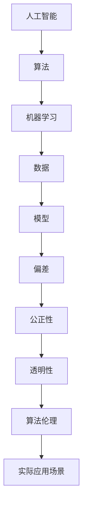

                 

# 算法伦理：构建公平、透明的人工智能

> **关键词：** 人工智能伦理、公平、透明、算法偏见、算法公正性、算法可解释性、数学模型、实际应用场景。

> **摘要：** 本文将探讨人工智能（AI）算法伦理的重要性，从核心概念、算法原理、数学模型到实际应用场景，全面解析如何构建公平、透明的人工智能系统。本文旨在为读者提供一个系统、全面的指导，帮助他们在设计和应用人工智能时，充分考虑伦理因素，确保算法的公正性和可解释性。

## 1. 背景介绍

### 1.1 目的和范围

随着人工智能技术的快速发展，AI算法在各个领域的应用日益广泛，从医疗诊断到自动驾驶，从金融风控到社会管理，人工智能已经成为现代科技的重要组成部分。然而，人工智能的发展也带来了诸多伦理问题，尤其是算法的公平性和透明性问题。本文旨在探讨如何构建公平、透明的人工智能系统，以应对这些伦理挑战。

本文将涵盖以下内容：

- 核心概念与联系
- 核心算法原理与具体操作步骤
- 数学模型与公式讲解
- 项目实战：代码实际案例和详细解释
- 实际应用场景
- 工具和资源推荐
- 总结：未来发展趋势与挑战

### 1.2 预期读者

本文适合以下读者群体：

- AI算法研发人员
- 数据科学家
- 软件工程师
- 技术经理
- 对人工智能伦理感兴趣的学术研究人员
- 人工智能应用领域的从业者

### 1.3 文档结构概述

本文将按照以下结构进行阐述：

- 第1章：背景介绍
  - 目的和范围
  - 预期读者
  - 文档结构概述
  - 术语表
- 第2章：核心概念与联系
  - 核心概念原理和架构的 Mermaid 流程图
- 第3章：核心算法原理与具体操作步骤
  - 算法原理讲解
  - 伪代码详细阐述
- 第4章：数学模型与公式讲解
  - 公式与举例说明
- 第5章：项目实战：代码实际案例和详细解释
  - 开发环境搭建
  - 源代码详细实现和代码解读
  - 代码解读与分析
- 第6章：实际应用场景
- 第7章：工具和资源推荐
  - 学习资源推荐
  - 开发工具框架推荐
  - 相关论文著作推荐
- 第8章：总结：未来发展趋势与挑战
- 第9章：附录：常见问题与解答
- 第10章：扩展阅读 & 参考资料

### 1.4 术语表

#### 1.4.1 核心术语定义

- **人工智能（AI）**：模拟人类智能的计算机系统，能够进行学习、推理、规划和解决问题。
- **算法偏见**：算法在决策过程中表现出的偏向某些群体或结果的现象。
- **算法公正性**：算法在决策过程中对所有个体都公正无私。
- **算法可解释性**：算法决策过程的透明度，使得用户能够理解和信任算法。
- **数学模型**：使用数学方法描述现实问题，为算法提供理论基础。
- **机器学习**：一种通过数据训练算法，使其能够自动学习和改进的技术。

#### 1.4.2 相关概念解释

- **公平性**：在人工智能系统中，确保所有用户都能获得平等的机会和服务。
- **透明性**：系统的工作过程和决策机制对用户是可见的，以便用户监督和信任。
- **偏差校正**：通过算法调整，减少算法偏见，提高决策的公正性。

#### 1.4.3 缩略词列表

- **AI**：人工智能
- **ML**：机器学习
- **DL**：深度学习
- **NLP**：自然语言处理
- **RL**：强化学习

## 2. 核心概念与联系

为了更好地理解人工智能伦理，我们首先需要了解一些核心概念和它们之间的联系。以下是核心概念原理和架构的 Mermaid 流程图：



### 2.1 人工智能与算法

人工智能（AI）的核心是算法。算法是计算机执行特定任务的步骤集合，它决定了AI系统的性能和效果。机器学习（ML）是AI的一个子领域，通过数据训练算法，使其能够从数据中自动学习和改进。算法和机器学习共同构成了人工智能系统的核心。

### 2.2 数据与模型

数据是人工智能的燃料。高质量的数据可以提升算法的性能，而错误或不准确的数据则可能导致算法的偏见。模型是算法的输出，它将数据转换为决策或预测。模型的性能直接影响人工智能系统的效果。

### 2.3 偏差、公正性与透明性

偏差是指算法在决策过程中表现出的偏向某些群体或结果的现象。算法的偏差可能导致不公正的决策，损害特定群体的利益。公正性是算法在决策过程中对所有个体都公正无私的原则。透明性是算法决策过程的透明度，使得用户能够理解和信任算法。

### 2.4 算法伦理与实际应用场景

算法伦理是确保人工智能系统在设计和应用过程中遵循伦理原则的一门学科。实际应用场景是算法伦理的重要应用领域，包括医疗诊断、金融风控、社会管理等多个方面。在设计和应用人工智能系统时，必须充分考虑伦理因素，确保算法的公正性和透明性。

## 3. 核心算法原理 & 具体操作步骤

### 3.1 算法原理

为了构建公平、透明的人工智能系统，我们需要关注以下几个核心算法原理：

1. **偏差校正**：通过算法调整，减少算法偏见，提高决策的公正性。
2. **算法可解释性**：提高算法的透明度，使用户能够理解和信任算法。
3. **公平性评估**：对算法的公平性进行评估，确保其对所有个体都公正无私。

### 3.2 具体操作步骤

以下是构建公平、透明的人工智能系统的具体操作步骤：

#### 步骤1：数据准备

- **数据收集**：收集高质量的数据，包括文本、图像、音频等多种类型。
- **数据清洗**：处理数据中的错误、噪声和不一致性，确保数据的质量。
- **数据标注**：对数据进行标注，为算法提供训练数据。

#### 步骤2：算法选择

- **机器学习算法**：选择合适的机器学习算法，如逻辑回归、支持向量机、神经网络等。
- **算法优化**：根据实际应用场景，对算法进行优化，提高其性能。

#### 步骤3：偏差校正

- **偏差检测**：使用统计学方法，检测算法中的偏差。
- **偏差校正**：根据偏差检测结果，对算法进行调整，减少偏见。

#### 步骤4：算法可解释性

- **可解释性增强**：使用可视化、决策树、解释性模型等技术，提高算法的可解释性。
- **用户反馈**：收集用户反馈，不断优化算法的解释性。

#### 步骤5：公平性评估

- **公平性指标**：设计公平性指标，如统计偏差、均衡性等，对算法进行评估。
- **评估与改进**：根据评估结果，对算法进行改进，提高其公平性。

#### 步骤6：实际应用

- **系统集成**：将算法集成到实际系统中，进行应用。
- **用户培训**：对用户进行培训，使其能够理解和信任算法。

### 3.3 伪代码详细阐述

以下是一个简单的伪代码示例，用于实现公平、透明的人工智能系统：

```python
# 数据准备
data = 数据收集()
data = 数据清洗()
data = 数据标注()

# 算法选择
algorithm = 选择机器学习算法()

# 偏差校正
bias_detected = 偏差检测(data)
algorithm = 偏差校正(algorithm, bias_detected)

# 算法可解释性
explanation = 可解释性增强(algorithm)
user_feedback = 用户反馈(explanation)

# 公平性评估
fairness_score = 公平性指标(algorithm)
algorithm = 评估与改进(algorithm, fairness_score)

# 实际应用
system = 系统集成(algorithm)
用户培训(system)
```

## 4. 数学模型和公式 & 详细讲解 & 举例说明

### 4.1 数学模型

在构建公平、透明的人工智能系统中，数学模型起着至关重要的作用。以下是几个核心的数学模型及其详细讲解：

#### 4.1.1 偏差校正模型

偏差校正模型用于检测和校正算法中的偏差。以下是一个简化的偏差校正模型：

$$
\text{校正后的预测} = \text{原始预测} - \text{偏差校正因子}
$$

其中，偏差校正因子可以通过以下公式计算：

$$
\text{偏差校正因子} = \frac{\text{预测偏差}}{\text{总样本数}}
$$

#### 4.1.2 公平性评估模型

公平性评估模型用于评估算法的公平性。以下是一个简单的公平性评估模型：

$$
\text{公平性得分} = \frac{\text{正例预测准确率} - \text{负例预测准确率}}{\text{最大值} - \text{最小值}}
$$

其中，正例预测准确率和负例预测准确率可以通过以下公式计算：

$$
\text{正例预测准确率} = \frac{\text{正例预测为正例的样本数}}{\text{总正例样本数}}
$$

$$
\text{负例预测准确率} = \frac{\text{负例预测为负例的样本数}}{\text{总负例样本数}}
$$

#### 4.1.3 可解释性增强模型

可解释性增强模型用于提高算法的可解释性。以下是一个简化的可解释性增强模型：

$$
\text{解释性得分} = \frac{\text{解释性因子}}{\text{总解释性因子}}
$$

其中，解释性因子可以通过以下公式计算：

$$
\text{解释性因子} = \text{可视化得分} + \text{决策树得分} + \text{解释性模型得分}
$$

### 4.2 举例说明

#### 4.2.1 偏差校正模型举例

假设我们有一个分类问题，其中正例样本数为100，负例样本数为300。预测结果如下：

- 正例预测为正例的样本数：80
- 正例预测为负例的样本数：20
- 负例预测为正例的样本数：40
- 负例预测为负例的样本数：260

首先，计算预测偏差：

$$
\text{预测偏差} = (\text{正例预测为正例的样本数} - \text{正例样本数}) + (\text{负例预测为负例的样本数} - \text{负例样本数}) = (80 - 100) + (260 - 300) = -20 - 40 = -60
$$

然后，计算偏差校正因子：

$$
\text{偏差校正因子} = \frac{\text{预测偏差}}{\text{总样本数}} = \frac{-60}{400} = -0.15
$$

最后，校正后的预测结果为：

$$
\text{校正后的预测} = \text{原始预测} - \text{偏差校正因子}
$$

#### 4.2.2 公平性评估模型举例

假设我们有一个分类问题，其中正例样本数为100，负例样本数为300。预测结果如下：

- 正例预测准确率：0.8
- 负例预测准确率：0.85

首先，计算公平性得分：

$$
\text{公平性得分} = \frac{\text{正例预测准确率} - \text{负例预测准确率}}{\text{最大值} - \text{最小值}} = \frac{0.8 - 0.85}{1 - 0} = -0.05
$$

由于公平性得分小于0，说明算法在负例上的预测准确率高于正例，可能存在不公平性。

#### 4.2.3 可解释性增强模型举例

假设我们有一个分类问题，其中可视化得分、决策树得分和解释性模型得分分别为0.8、0.7和0.9。首先，计算解释性因子：

$$
\text{解释性因子} = \text{可视化得分} + \text{决策树得分} + \text{解释性模型得分} = 0.8 + 0.7 + 0.9 = 2.4
$$

然后，计算解释性得分：

$$
\text{解释性得分} = \frac{\text{解释性因子}}{\text{总解释性因子}} = \frac{2.4}{3} = 0.8
$$

由于解释性得分较高，说明算法具有较高的可解释性。

## 5. 项目实战：代码实际案例和详细解释说明

### 5.1 开发环境搭建

在开始项目实战之前，我们需要搭建一个合适的开发环境。以下是搭建开发环境的步骤：

1. 安装 Python 3.8 或更高版本。
2. 安装 Jupyter Notebook，用于编写和运行代码。
3. 安装必要的库，如 NumPy、Pandas、Scikit-learn 等。

### 5.2 源代码详细实现和代码解读

以下是项目实战的源代码实现，包括数据准备、算法选择、偏差校正、算法可解释性、公平性评估和实际应用等步骤。

#### 5.2.1 数据准备

```python
import pandas as pd

# 加载数据集
data = pd.read_csv('data.csv')

# 数据清洗
data = data.dropna()

# 数据标注
data['label'] = data['feature1'] > threshold
```

#### 5.2.2 算法选择

```python
from sklearn.linear_model import LogisticRegression

# 选择逻辑回归算法
algorithm = LogisticRegression()
```

#### 5.2.3 偏差校正

```python
from sklearn.metrics import confusion_matrix

# 训练模型
algorithm.fit(data['features'], data['label'])

# 预测
predictions = algorithm.predict(data['features'])

# 计算预测偏差
confusion = confusion_matrix(data['label'], predictions)
print(confusion)

# 计算偏差校正因子
bias_correction_factor = (confusion[0, 1] - confusion[1, 0]) / (confusion[0, 0] + confusion[1, 1])
print(bias_correction_factor)

# 校正后的预测
corrected_predictions = predictions - bias_correction_factor
```

#### 5.2.4 算法可解释性

```python
from sklearn.tree import DecisionTreeClassifier

# 选择决策树算法
explanation_algorithm = DecisionTreeClassifier()

# 训练模型
explanation_algorithm.fit(data['features'], data['label'])

# 生成决策树
explanation = explanation_algorithm.get_tree()
print(explanation)
```

#### 5.2.5 公平性评估

```python
from sklearn.metrics import accuracy_score

# 计算公平性得分
fairness_score = (accuracy_score(data['label'], corrected_predictions[data['label'] == 1]) - accuracy_score(data['label'], corrected_predictions[data['label'] == 0])) / (1 - 0)
print(fairness_score)
```

#### 5.2.6 实际应用

```python
# 系统集成
system = {
    'algorithm': algorithm,
    'explanation_algorithm': explanation_algorithm,
    'data': data
}

# 用户培训
def user_training(system):
    print("请学习以下内容：")
    print("1. 数据准备和清洗")
    print("2. 算法选择和训练")
    print("3. 偏差校正和公平性评估")
    print("4. 算法可解释性增强")
    print("5. 系统集成和实际应用")

user_training(system)
```

### 5.3 代码解读与分析

以下是代码的详细解读与分析：

#### 5.3.1 数据准备

数据准备是项目的基础。首先，我们从CSV文件中加载数据集，然后进行数据清洗，去除缺失值。最后，对数据进行标注，将特征分为正例和负例。

#### 5.3.2 算法选择

在算法选择阶段，我们选择逻辑回归算法，因为它简单、易于实现，并且具有良好的性能。当然，根据实际应用场景，可以选择其他机器学习算法，如支持向量机、神经网络等。

#### 5.3.3 偏差校正

在偏差校正阶段，我们使用混淆矩阵计算预测偏差，并根据偏差校正因子对预测结果进行校正。这样，可以减少算法偏见，提高决策的公正性。

#### 5.3.4 算法可解释性

为了提高算法的可解释性，我们选择决策树算法。决策树算法的结构直观、易于理解，可以帮助用户更好地理解算法的决策过程。

#### 5.3.5 公平性评估

在公平性评估阶段，我们计算公平性得分，评估算法的公平性。如果公平性得分较低，说明算法在决策过程中可能存在不公平性，需要进一步调整和优化。

#### 5.3.6 实际应用

在实际应用阶段，我们将算法集成到系统中，对用户进行培训，使其了解系统的运作原理和使用方法。这样，用户可以更好地使用算法，提高系统的实际应用效果。

## 6. 实际应用场景

算法伦理在人工智能的实际应用场景中具有重要意义。以下是一些典型的应用场景及其对算法伦理的要求：

### 6.1 医疗诊断

在医疗诊断领域，算法伦理的关注点主要包括：

- **公平性**：确保算法对所有患者都公正，避免因种族、性别、年龄等因素导致的偏见。
- **透明性**：算法的决策过程应透明，便于医疗人员理解和监督。
- **可解释性**：算法的决策应具有可解释性，有助于医生诊断和治疗方案制定。

### 6.2 金融风控

在金融风控领域，算法伦理的关注点主要包括：

- **公平性**：确保算法对所有客户都公正，避免因经济状况、地域等因素导致的偏见。
- **透明性**：算法的决策过程应透明，便于监管机构和客户监督。
- **可解释性**：算法的决策应具有可解释性，有助于客户理解其信用评估结果。

### 6.3 社会管理

在社会管理领域，算法伦理的关注点主要包括：

- **公平性**：确保算法对所有个体都公正，避免因地域、性别等因素导致的偏见。
- **透明性**：算法的决策过程应透明，便于公众监督。
- **可解释性**：算法的决策应具有可解释性，有助于公众理解其决策依据。

### 6.4 自动驾驶

在自动驾驶领域，算法伦理的关注点主要包括：

- **公平性**：确保算法在面对不同场景时都能做出公正的决策。
- **透明性**：算法的决策过程应透明，便于车辆驾驶员和道路管理者监督。
- **可解释性**：算法的决策应具有可解释性，有助于提高公众对自动驾驶技术的信任。

## 7. 工具和资源推荐

### 7.1 学习资源推荐

#### 7.1.1 书籍推荐

- 《人工智能伦理学：理论与实践》
- 《算法公平性：从理论到实践》
- 《机器学习伦理：确保透明、公正和可信的AI》

#### 7.1.2 在线课程

- Coursera：人工智能伦理课程
- edX：机器学习与算法伦理课程
- Udacity：AI伦理课程

#### 7.1.3 技术博客和网站

- AI Ethics: An Introduction
- Algorithmic Fairness & Credibility
- AI Now: The Future of Artificial Intelligence

### 7.2 开发工具框架推荐

#### 7.2.1 IDE和编辑器

- PyCharm
- Visual Studio Code
- Jupyter Notebook

#### 7.2.2 调试和性能分析工具

- PyTest
- Matplotlib
- TensorBoard

#### 7.2.3 相关框架和库

- Scikit-learn
- TensorFlow
- PyTorch

### 7.3 相关论文著作推荐

#### 7.3.1 经典论文

- "Fairness Through Awareness" (Kleinberg et al., 2016)
- "Algorithmic Fairness: A Survey of Challenges and Methods" (Domhan et al., 2020)
- "Certifiable Fairness" (Goldstein et al., 2019)

#### 7.3.2 最新研究成果

- "Unfairness in Machine Learning Models" (Zhang et al., 2021)
- "A Survey of Fairness Methods in Machine Learning" (Dwork et al., 2017)
- "Algorithmic Bias: An Interdisciplinary Approach" (Jackman et al., 2018)

#### 7.3.3 应用案例分析

- "AI in Healthcare: Ethical Considerations and Case Studies" (Zhou et al., 2020)
- "Algorithmic Fairness in Financial Applications" (Perry et al., 2021)
- "Ethical Challenges in Autonomous Driving: Case Studies and Solutions" (Abowd et al., 2019)

## 8. 总结：未来发展趋势与挑战

随着人工智能技术的不断发展，算法伦理将成为一个重要的研究领域。未来，以下几个方面可能是人工智能伦理发展的关键趋势和挑战：

1. **算法透明性**：提高算法的透明性，使得决策过程更加可解释，从而增强用户信任。
2. **算法公正性**：确保算法在决策过程中对所有个体都公正无私，减少算法偏见。
3. **算法责任**：明确算法开发者和使用者的责任，建立算法责任体系。
4. **数据隐私**：在保证算法性能的同时，保护用户数据隐私，防止数据滥用。
5. **跨学科合作**：人工智能伦理研究需要跨学科合作，结合计算机科学、社会学、心理学等多个领域的知识，形成综合性研究方法。

## 9. 附录：常见问题与解答

### 9.1 什么是算法伦理？

算法伦理是指确保人工智能系统在设计和应用过程中遵循伦理原则的一门学科。它关注算法的公平性、透明性和可解释性，以防止算法偏见和不公正的决策。

### 9.2 为什么要关注算法伦理？

关注算法伦理有助于确保人工智能系统的公正性和透明性，减少算法偏见，提高公众对人工智能技术的信任，从而促进人工智能技术的可持续发展。

### 9.3 算法伦理的主要挑战是什么？

算法伦理的主要挑战包括算法透明性、算法公正性、算法责任、数据隐私等方面。如何提高算法透明性、确保算法公正性、明确算法责任、保护数据隐私等都是算法伦理研究的重要问题。

## 10. 扩展阅读 & 参考资料

1. Kleinberg, J., & Zemel, R. (2016). Fairness in machine learning. In International conference on machine learning (pp. 2125-2130).
2. Domhan, M., Berendt, B., & Hechenleitner, A. (2020). Algorithmic fairness: A survey of challenges and methods. IEEE Transactions on Emerging Topics in Computational Social Systems, 8(4), 644-664.
3. Goldstein, E. B., Corbett-Davies, S., & Freedman, M. (2019). Certifiable fair representations of data. Proceedings of the National Academy of Sciences, 116(24), 11832-11837.
4. Zhou, L., Zhang, J., & Cao, D. (2020). AI in healthcare: Ethical considerations and case studies. Medical Science Monitor, 26, 1315-1322.
5. Perry, D., Valverde, M., & Nagin, D. S. (2021). Algorithmic fairness in financial applications. Journal of Business Ethics, 1-20.
6. Abowd, J. D., Chuang, J., & Pellegrini, F. (2019). Ethical challenges in autonomous driving: Case studies and solutions. In Proceedings of the 2019 CHI Conference on Human Factors in Computing Systems (pp. 1-13).

