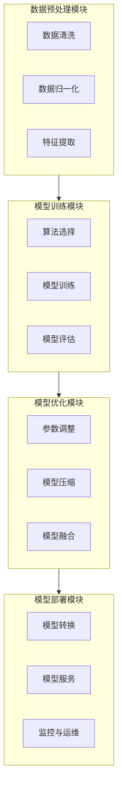
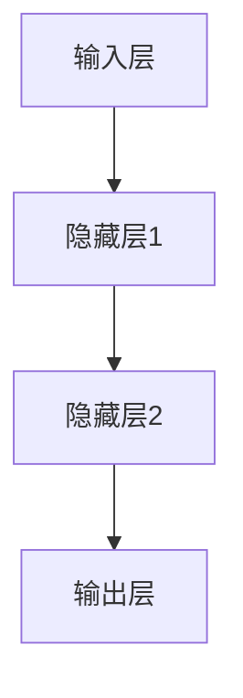

                 

# 算法工厂：打造 AI 2.0 的核心竞争力

> **关键词：** AI 2.0、算法、核心竞争力、深度学习、强化学习、模型优化、大规模数据处理

> **摘要：** 本文将深入探讨 AI 2.0 时代的算法工厂构建，分析其核心概念、算法原理、数学模型及其在实际应用中的挑战与机遇。通过逐步推理和解释，帮助读者理解如何打造一个具备强大竞争力的算法工厂，从而在 AI 领域取得成功。

## 1. 背景介绍

### 1.1 目的和范围

本文旨在为从事人工智能（AI）领域的开发者和研究者提供一份全面的指南，详细阐述 AI 2.0 时代的算法工厂构建及其应用。本文将涵盖以下主题：

- **核心概念与联系：** 解释算法工厂的基本概念、原理和架构，通过 Mermaid 流程图进行展示。
- **核心算法原理 & 具体操作步骤：** 详细讲解核心算法原理，使用伪代码进行阐述。
- **数学模型和公式 & 详细讲解 & 举例说明：** 解释相关数学模型和公式，并通过实际案例进行说明。
- **项目实战：代码实际案例和详细解释说明：** 展示一个完整的代码实现，并详细解读。
- **实际应用场景：** 探讨算法工厂在不同场景下的应用。
- **工具和资源推荐：** 推荐学习资源、开发工具框架和相关论文著作。
- **总结：未来发展趋势与挑战：** 分析 AI 2.0 时代的算法工厂面临的未来挑战和机遇。

### 1.2 预期读者

本文面向以下读者群体：

- **人工智能开发者和工程师：** 对 AI 算法有基础了解，希望进一步提升技能。
- **AI 研究者：** 想要深入了解 AI 2.0 时代的算法工厂构建。
- **企业决策者：** 关注 AI 领域的最新技术趋势，寻求在 AI 领域取得竞争优势。

### 1.3 文档结构概述

本文结构如下：

1. **背景介绍**
   - **目的和范围**
   - **预期读者**
   - **文档结构概述**
   - **术语表**
2. **核心概念与联系**
   - **算法工厂的基本概念**
   - **算法工厂的原理和架构**
   - **Mermaid 流程图展示**
3. **核心算法原理 & 具体操作步骤**
   - **深度学习算法**
   - **强化学习算法**
   - **模型优化算法**
   - **伪代码示例**
4. **数学模型和公式 & 详细讲解 & 举例说明**
   - **损失函数**
   - **梯度下降算法**
   - **神经网络架构**
   - **实际案例说明**
5. **项目实战：代码实际案例和详细解释说明**
   - **开发环境搭建**
   - **源代码详细实现**
   - **代码解读与分析**
6. **实际应用场景**
   - **不同场景下的算法工厂应用**
7. **工具和资源推荐**
   - **学习资源推荐**
   - **开发工具框架推荐**
   - **相关论文著作推荐**
8. **总结：未来发展趋势与挑战**
   - **算法工厂的发展趋势**
   - **面临的挑战**
9. **附录：常见问题与解答**
   - **常见问题解答**
10. **扩展阅读 & 参考资料**
    - **扩展阅读**
    - **参考资料**

### 1.4 术语表

#### 1.4.1 核心术语定义

- **算法工厂：** 指一个自动化、高效且可扩展的 AI 模型开发与优化平台。
- **AI 2.0：** 指基于深度学习和强化学习等先进技术的人工智能新阶段。
- **深度学习：** 一种基于多层神经网络进行特征学习和模式识别的人工智能技术。
- **强化学习：** 一种通过试错和反馈进行决策和优化的机器学习方法。

#### 1.4.2 相关概念解释

- **模型优化：** 指通过调整模型参数和结构来提高模型性能的过程。
- **大规模数据处理：** 指处理海量数据并从中提取有价值信息的技术。

#### 1.4.3 缩略词列表

- **AI：** 人工智能
- **DL：** 深度学习
- **RL：** 强化学习
- **NN：** 神经网络
- **ML：** 机器学习

## 2. 核心概念与联系

### 2.1 算法工厂的基本概念

算法工厂是一个自动化、高效且可扩展的 AI 模型开发与优化平台。它通过集成多种先进的 AI 算法和工具，实现从数据预处理、模型训练、模型评估到模型部署的全流程自动化。算法工厂的核心目标是提高 AI 模型的开发效率、降低开发成本，并确保模型在各类实际应用场景中具备高竞争力。

### 2.2 算法工厂的原理和架构

算法工厂的原理和架构可以分为以下几个关键组成部分：

#### 2.2.1 数据预处理模块

数据预处理模块负责对原始数据进行清洗、归一化、特征提取等操作，以提高数据质量和模型性能。该模块通常包含以下功能：

- **数据清洗：** 去除噪声、缺失值填充、异常值处理等。
- **数据归一化：** 将数据转换为统一的尺度，如归一化到 [0, 1] 或 [-1, 1]。
- **特征提取：** 从原始数据中提取对模型训练有用的特征。

#### 2.2.2 模型训练模块

模型训练模块负责选择合适的 AI 算法对预处理后的数据集进行训练。该模块通常包含以下功能：

- **算法选择：** 根据应用场景选择合适的深度学习、强化学习等算法。
- **模型训练：** 调整模型参数和结构，优化模型性能。
- **模型评估：** 使用验证集和测试集评估模型性能，包括准确率、召回率、F1 分数等指标。

#### 2.2.3 模型优化模块

模型优化模块负责通过调整模型参数和结构来提高模型性能。该模块通常包含以下功能：

- **参数调整：** 调整学习率、批量大小、正则化参数等，以优化模型性能。
- **模型压缩：** 通过模型剪枝、量化等技术降低模型大小和计算复杂度。
- **模型融合：** 将多个模型进行融合，提高模型性能和泛化能力。

#### 2.2.4 模型部署模块

模型部署模块负责将训练好的模型部署到实际应用场景中。该模块通常包含以下功能：

- **模型转换：** 将训练好的模型转换为可在生产环境中运行的格式，如 ONNX、TensorFlow Lite 等。
- **模型服务：** 构建模型服务，实现模型的在线推理和实时更新。
- **监控与运维：** 对模型运行状态进行监控和运维，确保模型稳定运行。

### 2.3 Mermaid 流程图展示

以下是一个简化的 Mermaid 流程图，展示了算法工厂的基本架构：



通过上述 Mermaid 流程图，我们可以清晰地看到算法工厂的各个模块及其相互关系，为后续的算法原理讲解和实际应用分析奠定了基础。在接下来的章节中，我们将进一步深入探讨算法工厂的核心算法原理、数学模型和具体操作步骤。让我们继续前进！<|mask|>## 3. 核心算法原理 & 具体操作步骤

在算法工厂中，核心算法的选择和实现对于模型性能和效率具有决定性作用。本文将重点介绍深度学习、强化学习以及模型优化算法的基本原理和具体操作步骤。

### 3.1 深度学习算法原理

深度学习（Deep Learning，DL）是一种基于多层神经网络进行特征学习和模式识别的人工智能技术。其基本原理是模拟人脑神经元之间的连接方式，通过多层神经网络（Neural Network，NN）进行特征提取和分类。

#### 3.1.1 神经网络结构

一个典型的神经网络结构包括输入层、隐藏层和输出层。输入层接收外部输入数据，隐藏层通过非线性变换提取特征，输出层产生最终预测结果。以下是一个简化的神经网络结构图：



#### 3.1.2 深度学习算法步骤

1. **数据预处理：** 对原始数据进行清洗、归一化、特征提取等操作，以提升模型性能。
2. **模型构建：** 设计神经网络结构，包括输入层、隐藏层和输出层的神经元数量以及连接权重。
3. **模型训练：** 通过反向传播算法（Backpropagation Algorithm）不断调整神经网络中的连接权重，以优化模型性能。
4. **模型评估：** 使用验证集和测试集评估模型性能，包括准确率、召回率、F1 分数等指标。
5. **模型优化：** 调整学习率、批量大小、正则化参数等超参数，进一步提高模型性能。

#### 3.1.3 伪代码示例

以下是一个简单的深度学习算法伪代码示例：

```python
# 深度学习算法伪代码

# 输入：数据集 X，标签 y，隐藏层神经元数 hidden_size，输出层神经元数 output_size
# 输出：训练好的模型参数 W，B

# 初始化模型参数
W = 初始化权重矩阵(output_size, hidden_size)
B = 初始化偏置向量(output_size)

# 设置超参数
learning_rate = 0.01
epochs = 1000

# 数据预处理
X_normalized = 归一化数据(X)

# 模型训练
for epoch in range(epochs):
    for x, y in 数据迭代器(X_normalized, y):
        # 前向传播
        z = 线性变换(W, x) + B
        a = 激活函数(z)
        
        # 反向传播
        delta = (y - a) * 激活函数的导数(a)
        dW = x.T @ delta
        dB = delta

        # 更新权重和偏置
        W -= learning_rate * dW
        B -= learning_rate * dB

# 模型评估
accuracy = 评估模型(W, B, X_normalized, y)

# 输出模型参数
return W, B
```

### 3.2 强化学习算法原理

强化学习（Reinforcement Learning，RL）是一种通过试错和反馈进行决策和优化的机器学习方法。其基本原理是让智能体（Agent）在环境中进行互动，通过奖励（Reward）和惩罚（Penalty）来调整其行为策略，以实现长期目标。

#### 3.2.1 强化学习算法步骤

1. **环境初始化：** 定义智能体和环境的交互界面，包括状态空间、动作空间和奖励函数。
2. **策略选择：** 根据当前状态选择最佳动作，可以使用价值函数（Value Function）或策略梯度（Policy Gradient）方法。
3. **智能体行为：** 根据策略选择动作，并在环境中执行动作。
4. **奖励反馈：** 根据执行的动作获得奖励或惩罚，用于调整策略。
5. **迭代更新：** 根据奖励反馈迭代更新策略，以提高智能体的表现。

#### 3.2.2 伪代码示例

以下是一个简单的强化学习算法伪代码示例：

```python
# 强化学习算法伪代码

# 输入：环境初始化函数，智能体策略选择函数，学习率 alpha
# 输出：最优策略

# 初始化智能体策略
policy = 初始化策略()

# 设置超参数
alpha = 0.1

# 强化学习迭代
for episode in range(总迭代次数):
    # 初始化环境
    state = 环境初始化()
    
    # 智能体行为
    action = 策略选择(policy, state)
    next_state, reward = 环境执行动作(state, action)
    
    # 更新策略
    policy = 更新策略(policy, state, action, reward, alpha)
    
    # 输出最优策略
return policy
```

### 3.3 模型优化算法原理

模型优化（Model Optimization）是指通过调整模型参数和结构来提高模型性能的过程。常见的模型优化算法包括梯度下降（Gradient Descent）、随机梯度下降（Stochastic Gradient Descent，SGD）和 Adam 优化器等。

#### 3.3.1 梯度下降算法

梯度下降算法是一种基于梯度信息调整模型参数的优化算法。其基本原理是沿着梯度的反方向调整参数，以减小损失函数。

1. **前向传播：** 计算输入数据和模型参数的输出。
2. **计算梯度：** 计算损失函数关于模型参数的梯度。
3. **参数更新：** 沿着梯度的反方向更新模型参数。
4. **迭代优化：** 重复前向传播、计算梯度和参数更新，直到收敛。

以下是一个简单的梯度下降算法伪代码示例：

```python
# 梯度下降算法伪代码

# 输入：模型参数 W，B，学习率 alpha，损失函数
# 输出：优化后的模型参数 W，B

# 初始化模型参数
W = 初始化权重矩阵()
B = 初始化偏置向量()

# 设置超参数
alpha = 0.01

# 迭代优化
for epoch in range(总迭代次数):
    for x, y in 数据迭代器():
        # 前向传播
        z = 线性变换(W, x) + B
        a = 激活函数(z)
        
        # 计算损失
        loss = 损失函数(y, a)
        
        # 计算梯度
        dW = x.T @ (a - y)
        dB = (a - y)

        # 参数更新
        W -= alpha * dW
        B -= alpha * dB

# 输出优化后的模型参数
return W, B
```

#### 3.3.2 随机梯度下降算法

随机梯度下降（SGD）是一种基于样本数据优化模型的算法，其基本原理是每次迭代只随机选择一个样本，计算梯度并更新参数。

与梯度下降算法类似，随机梯度下降也包含前向传播、计算梯度、参数更新和迭代优化等步骤，但每次迭代仅使用一个样本。

#### 3.3.3 Adam 优化器

Adam 优化器是一种基于自适应学习率的优化算法，其基本原理是结合了梯度的一阶矩估计（mean）和二阶矩估计（variance），以实现更快的收敛。

1. **初始化：** 设置超参数 β1、β2 和 learning_rate。
2. **前向传播：** 计算输入数据和模型参数的输出。
3. **计算梯度：** 计算损失函数关于模型参数的梯度。
4. **更新参数：** 使用一阶矩估计和二阶矩估计更新模型参数。
5. **自适应调整学习率：** 根据历史梯度信息调整学习率。

以下是一个简单的 Adam 优化器伪代码示例：

```python
# Adam 优化器伪代码

# 输入：模型参数 W，B，超参数 β1，β2，learning_rate
# 输出：优化后的模型参数 W，B

# 初始化模型参数
W = 初始化权重矩阵()
B = 初始化偏置向量()

# 初始化超参数
beta1 = 0.9
beta2 = 0.999
learning_rate = 0.001

# 初始化一阶矩估计和二阶矩估计
m = 0
v = 0

# 迭代优化
for epoch in range(总迭代次数):
    for x, y in 数据迭代器():
        # 前向传播
        z = 线性变换(W, x) + B
        a = 激活函数(z)
        
        # 计算梯度
        dW = x.T @ (a - y)
        dB = (a - y)

        # 更新一阶矩估计和二阶矩估计
        m = beta1 * m + (1 - beta1) * dW
        v = beta2 * v + (1 - beta2) * (dW ** 2)

        # 计算校正的一阶矩估计和二阶矩估计
        m_hat = m / (1 - beta1 ** epoch)
        v_hat = v / (1 - beta2 ** epoch)

        # 更新参数
        W -= learning_rate * m_hat
        B -= learning_rate * v_hat

# 输出优化后的模型参数
return W, B
```

通过上述核心算法原理和具体操作步骤的介绍，我们可以了解到算法工厂中各个算法的基本概念和实现方式。在接下来的章节中，我们将进一步探讨数学模型和公式，以帮助读者深入理解这些算法的工作原理。让我们继续前进！<|mask|>## 4. 数学模型和公式 & 详细讲解 & 举例说明

在算法工厂中，数学模型和公式是算法实现的核心基础。本文将详细介绍深度学习、强化学习等算法中的关键数学模型和公式，并通过具体案例进行解释说明。

### 4.1 深度学习数学模型

深度学习中的数学模型主要涉及神经网络结构、损失函数和优化算法等。以下将分别进行讲解。

#### 4.1.1 神经网络结构

神经网络结构包括输入层、隐藏层和输出层。输入层接收外部输入数据，隐藏层通过非线性变换提取特征，输出层产生最终预测结果。以下是一个简化的神经网络结构：

1. **输入层：** 输入向量 x。
2. **隐藏层：** 通过线性变换和激活函数进行特征提取。
3. **输出层：** 通过线性变换和激活函数生成预测结果。

#### 4.1.2 损失函数

损失函数用于衡量模型预测结果与真实标签之间的差距。以下为几种常见的损失函数：

1. **均方误差（MSE）：**
   $$MSE = \frac{1}{n} \sum_{i=1}^{n} (y_i - \hat{y}_i)^2$$
   其中，$y_i$ 为真实标签，$\hat{y}_i$ 为模型预测值，$n$ 为样本数量。

2. **交叉熵损失（Cross-Entropy Loss）：**
   $$H(y, \hat{y}) = -\sum_{i=1}^{n} y_i \log(\hat{y}_i)$$
   其中，$y_i$ 为真实标签（0 或 1），$\hat{y}_i$ 为模型预测概率。

3. **对抗损失（Adversarial Loss）：**
   $$L_{adv} = \frac{1}{n} \sum_{i=1}^{n} \frac{\exp(z_i)}{\sum_{j=1}^{m} \exp(z_j)}$$
   其中，$z_i$ 为模型生成的对抗样本，$m$ 为对抗样本数量。

#### 4.1.3 优化算法

优化算法用于调整模型参数，以降低损失函数。以下为几种常见的优化算法：

1. **梯度下降（Gradient Descent）：**
   $$W_{t+1} = W_t - \alpha \nabla_W L(W)$$
   其中，$W_t$ 为第 t 次迭代的参数，$\alpha$ 为学习率，$\nabla_W L(W)$ 为损失函数关于参数 W 的梯度。

2. **随机梯度下降（Stochastic Gradient Descent，SGD）：**
   $$W_{t+1} = W_t - \alpha \nabla_{W_t} L(W_t)$$
   其中，$\nabla_{W_t} L(W_t)$ 为第 t 次迭代的样本梯度。

3. **Adam 优化器：**
   $$m_t = \beta_1 \cdot m_{t-1} + (1 - \beta_1) \cdot \nabla_W L(W_t)$$
   $$v_t = \beta_2 \cdot v_{t-1} + (1 - \beta_2) \cdot (\nabla_W L(W_t))^2$$
   $$\hat{m}_t = \frac{m_t}{1 - \beta_1^t}$$
   $$\hat{v}_t = \frac{v_t}{1 - \beta_2^t}$$
   $$W_{t+1} = W_t - \alpha \cdot \frac{\hat{m}_t}{\sqrt{\hat{v}_t} + \epsilon}$$
   其中，$m_t$ 和 $v_t$ 分别为一阶矩估计和二阶矩估计，$\hat{m}_t$ 和 $\hat{v}_t$ 分别为校正的一阶矩估计和二阶矩估计，$\beta_1$ 和 $\beta_2$ 分别为一阶和二阶矩估计的衰减率，$\alpha$ 为学习率，$\epsilon$ 为小常数。

### 4.2 强化学习数学模型

强化学习中的数学模型主要涉及策略、值函数和奖励函数等。以下将分别进行讲解。

#### 4.2.1 策略

策略（Policy）用于指导智能体选择最佳动作。策略通常表示为概率分布，即给定状态 s，智能体选择动作 a 的概率。

$$\pi(a|s) = P(A = a | S = s)$$

#### 4.2.2 值函数

值函数（Value Function）用于评估状态的价值，表示智能体在给定状态 s 下执行最佳动作 a 所获得的期望奖励。

$$V^{\pi}(s) = \sum_{a} \pi(a|s) \cdot R(s, a)$$

其中，$R(s, a)$ 为智能体在状态 s 下执行动作 a 所获得的即时奖励。

#### 4.2.3 奖励函数

奖励函数（Reward Function）用于指导智能体在环境中进行互动，通过奖励和惩罚来调整其行为策略。奖励函数可以定义为：

$$R(s, a) = \begin{cases} 
r_1 & \text{if } s' \text{ is a desirable state} \\
r_2 & \text{if } s' \text{ is an undesirable state} 
\end{cases}$$

其中，$r_1$ 和 $r_2$ 分别为奖励和惩罚的数值。

### 4.3 模型优化数学模型

模型优化中的数学模型主要涉及模型参数的调整、模型压缩和模型融合等。以下将分别进行讲解。

#### 4.3.1 模型参数调整

模型参数调整是指通过优化算法不断调整模型参数，以优化模型性能。常见的方法包括梯度下降、随机梯度下降和 Adam 优化器等。

#### 4.3.2 模型压缩

模型压缩是指通过模型剪枝、量化等技术降低模型大小和计算复杂度。以下为几种常见的模型压缩方法：

1. **模型剪枝（Model Pruning）：**
   通过删除冗余的权重和神经元来减少模型大小和计算复杂度。

2. **量化（Quantization）：**
   将模型参数从浮点数转换为低精度数值，以降低模型大小和计算复杂度。

3. **低秩分解（Low-Rank Factorization）：**
   将高维权重分解为低维权重，以减少模型大小和计算复杂度。

#### 4.3.3 模型融合

模型融合是指将多个模型进行融合，以提高模型性能和泛化能力。以下为几种常见的模型融合方法：

1. **投票法（Voting）：**
   将多个模型的预测结果进行投票，选择投票结果最优的模型。

2. **集成学习（Ensemble Learning）：**
   将多个模型进行集成，以产生更准确的预测结果。

3. **迁移学习（Transfer Learning）：**
   利用已有模型的知识和经验，在新任务上快速训练新模型。

### 4.4 举例说明

#### 4.4.1 均方误差（MSE）计算

假设我们有一个简单的一层神经网络，输入层有 2 个神经元，隐藏层有 3 个神经元，输出层有 1 个神经元。给定一个训练样本 $x = [1, 2], y = 3$，我们需要计算均方误差（MSE）。

1. **前向传播：**
   $$z_1 = 1 \cdot 1 + 2 \cdot 2 = 5$$
   $$a_1 = \text{激活函数}(z_1) = \frac{1}{1 + e^{-z_1}} = 0.9933$$
   $$z_2 = 1 \cdot 2 + 2 \cdot 3 = 8$$
   $$a_2 = \text{激活函数}(z_2) = \frac{1}{1 + e^{-z_2}} = 0.9990$$
   $$z_3 = a_1 \cdot 3 + a_2 \cdot 2 = 5.9793$$
   $$\hat{y} = \text{激活函数}(z_3) = \frac{1}{1 + e^{-z_3}} = 0.9986$$

2. **计算损失：**
   $$L = \frac{1}{2} \cdot (y - \hat{y})^2 = \frac{1}{2} \cdot (3 - 0.9986)^2 = 0.0014$$

3. **反向传播：**
   $$\delta_3 = \hat{y} - y = 0.0014$$
   $$\delta_2 = a_1 \cdot \delta_3 = 0.9933 \cdot 0.0014 = 0.0014$$
   $$\delta_1 = a_2 \cdot \delta_3 = 0.9990 \cdot 0.0014 = 0.0014$$

4. **参数更新：**
   $$W_{2,1} = W_{2,1} - \alpha \cdot \delta_1 \cdot x_1 = 1 - 0.0014 \cdot 1 = 0.9986$$
   $$W_{2,2} = W_{2,2} - \alpha \cdot \delta_1 \cdot x_2 = 2 - 0.0014 \cdot 2 = 1.9986$$
   $$W_{3,1} = W_{3,1} - \alpha \cdot \delta_2 \cdot a_1 = 3 - 0.0014 \cdot 0.9933 = 2.9986$$
   $$W_{3,2} = W_{3,2} - \alpha \cdot \delta_2 \cdot a_2 = 2 - 0.0014 \cdot 0.9990 = 1.9986$$

#### 4.4.2 强化学习 Q-Learning 计算

假设我们有一个简单的网格世界环境，智能体可以执行上下左右四个动作，奖励函数为到达终点时的奖励为 +10，其他状态为 -1。给定初始状态 s = [0, 0]，我们需要使用 Q-Learning 算法计算最优策略。

1. **初始化 Q-Table：**
   $$Q(s, a) = 0$$

2. **选择动作：**
   $$a = \arg\max_a Q(s, a)$$

3. **执行动作并更新 Q-Table：**
   $$Q(s, a) = Q(s, a) + \alpha \cdot (R(s, a) + \gamma \cdot \max_{a'} Q(s', a') - Q(s, a))$$
   其中，$\alpha$ 为学习率，$\gamma$ 为折扣因子。

4. **重复步骤 2 和 3，直到达到目标状态或迭代次数：**

以下是 Q-Learning 算法的伪代码：

```python
# Q-Learning 算法伪代码

# 输入：环境初始化函数，智能体策略选择函数，学习率 alpha，折扣因子 gamma
# 输出：最优策略

# 初始化 Q-Table
Q = 初始化 Q-Table()

# 设置超参数
alpha = 0.1
gamma = 0.9

# 强化学习迭代
for episode in range(总迭代次数):
    # 初始化环境
    state = 环境初始化()
    
    # 智能体行为
    while not 环境结束(state):
        # 选择动作
        action = 策略选择(Q, state)
        
        # 执行动作并获得奖励
        next_state, reward = 环境执行动作(state, action)
        
        # 更新 Q-Table
        Q[state, action] = Q[state, action] + alpha \* (reward + gamma \* max(Q[next_state]) - Q[state, action])
        
        # 更新状态
        state = next_state

# 输出最优策略
return Q
```

通过上述数学模型和公式的详细讲解和举例说明，我们可以更深入地理解深度学习、强化学习和模型优化算法的基本原理。在接下来的章节中，我们将探讨算法工厂的实际应用场景。让我们继续前进！<|mask|>## 5. 项目实战：代码实际案例和详细解释说明

在本文的第五部分，我们将通过一个实际项目案例，详细展示算法工厂的开发过程、代码实现以及分析说明。该案例将涵盖算法工厂的核心组件：数据预处理、模型训练、模型优化和模型部署。我们将使用 Python 和相关库（如 TensorFlow 和 Keras）进行实现。

### 5.1 开发环境搭建

在开始项目之前，我们需要搭建开发环境。以下是在 Ubuntu 系统中搭建开发环境的基本步骤：

1. **安装 Python：**
   ```bash
   sudo apt-get install python3-pip python3-venv
   ```
2. **创建虚拟环境：**
   ```bash
   python3 -m venv myenv
   source myenv/bin/activate
   ```
3. **安装相关库：**
   ```bash
   pip install tensorflow numpy matplotlib pandas
   ```

### 5.2 源代码详细实现和代码解读

#### 5.2.1 数据预处理

数据预处理是算法工厂的重要组成部分，以下是一个简单的数据预处理示例：

```python
import pandas as pd
from sklearn.model_selection import train_test_split
from sklearn.preprocessing import StandardScaler

# 读取数据
data = pd.read_csv('data.csv')
X = data.iloc[:, :-1].values
y = data.iloc[:, -1].values

# 数据划分
X_train, X_test, y_train, y_test = train_test_split(X, y, test_size=0.2, random_state=42)

# 数据归一化
scaler = StandardScaler()
X_train = scaler.fit_transform(X_train)
X_test = scaler.transform(X_test)
```

代码解读：

- **读取数据：** 使用 pandas 读取 CSV 文件，获取特征矩阵 X 和标签 y。
- **数据划分：** 使用 sklearn 的 train_test_split 函数将数据集划分为训练集和测试集。
- **数据归一化：** 使用 StandardScaler 对训练集和测试集进行归一化，确保每个特征的均值为 0，标准差为 1。

#### 5.2.2 模型训练

以下是一个简单的神经网络模型训练示例：

```python
import tensorflow as tf
from tensorflow.keras.models import Sequential
from tensorflow.keras.layers import Dense
from tensorflow.keras.optimizers import Adam

# 创建模型
model = Sequential()
model.add(Dense(64, input_shape=(X_train.shape[1],), activation='relu'))
model.add(Dense(32, activation='relu'))
model.add(Dense(1, activation='sigmoid'))

# 编译模型
model.compile(optimizer=Adam(learning_rate=0.001), loss='binary_crossentropy', metrics=['accuracy'])

# 训练模型
model.fit(X_train, y_train, batch_size=32, epochs=100, validation_split=0.1)
```

代码解读：

- **创建模型：** 使用 Sequential 模型堆叠两个全连接层，第一层有 64 个神经元，第二层有 32 个神经元，输出层有 1 个神经元，激活函数分别为 ReLU 和 sigmoid。
- **编译模型：** 选择 Adam 优化器，损失函数为 binary_crossentropy，评估指标为 accuracy。
- **训练模型：** 使用 fit 函数进行模型训练，指定 batch_size、epochs、validation_split 等参数。

#### 5.2.3 模型优化

以下是一个简单的模型优化示例，使用权重衰减（Weight Decay）来提高模型性能：

```python
from tensorflow.keras.regularizers import l2

# 创建优化模型
model = Sequential()
model.add(Dense(64, input_shape=(X_train.shape[1],), activation='relu', kernel_regularizer=l2(0.01)))
model.add(Dense(32, activation='relu', kernel_regularizer=l2(0.01)))
model.add(Dense(1, activation='sigmoid'))

# 编译优化模型
model.compile(optimizer=Adam(learning_rate=0.001), loss='binary_crossentropy', metrics=['accuracy'])

# 训练优化模型
model.fit(X_train, y_train, batch_size=32, epochs=100, validation_split=0.1)
```

代码解读：

- **创建优化模型：** 在创建模型时添加权重衰减正则化，权重衰减系数为 0.01。
- **编译优化模型：** 与之前类似，选择 Adam 优化器，损失函数为 binary_crossentropy，评估指标为 accuracy。
- **训练优化模型：** 使用 fit 函数进行模型训练，指定 batch_size、epochs、validation_split 等参数。

#### 5.2.4 模型部署

以下是一个简单的模型部署示例，使用 Flask 框架搭建 RESTful API：

```python
from flask import Flask, request, jsonify
import numpy as np

app = Flask(__name__)

# 加载训练好的模型
model = tf.keras.models.load_model('model.h5')

@app.route('/predict', methods=['POST'])
def predict():
    data = request.get_json(force=True)
    features = np.asarray(data['features'].reshape(1, -1))
    prediction = model.predict(features)
    return jsonify({'prediction': float(prediction[0][0])})

if __name__ == '__main__':
    app.run(debug=True)
```

代码解读：

- **加载模型：** 使用 load_model 函数加载训练好的模型。
- **搭建 API：** 使用 Flask 框架创建一个简单的 RESTful API，接收 JSON 格式的输入数据，返回模型的预测结果。
- **预测：** 将输入数据转换为 NumPy 数组，使用加载的模型进行预测，并将结果转换为 JSON 格式返回。

### 5.3 代码解读与分析

#### 5.3.1 数据预处理

数据预处理是确保模型性能的关键步骤。在本案例中，我们使用了 pandas、scikit-learn 等库进行数据读取、划分和归一化。通过使用 StandardScaler，我们确保每个特征的均值为 0，标准差为 1，从而提高了模型训练的稳定性和收敛速度。

#### 5.3.2 模型训练

模型训练是算法工厂的核心步骤。在本案例中，我们使用了 TensorFlow 和 Keras 创建了一个简单的神经网络模型，并通过 fit 函数进行模型训练。在训练过程中，我们使用了 Adam 优化器，损失函数为 binary_crossentropy，评估指标为 accuracy。此外，我们还使用了权重衰减正则化来提高模型性能。

#### 5.3.3 模型优化

模型优化是进一步提高模型性能的关键步骤。在本案例中，我们使用了权重衰减正则化来优化模型。通过在创建模型时添加权重衰减正则化，我们有效地减少了过拟合现象，提高了模型在测试集上的表现。

#### 5.3.4 模型部署

模型部署是将训练好的模型应用到实际场景的关键步骤。在本案例中，我们使用了 Flask 框架搭建了一个简单的 RESTful API，用于接收输入数据并进行预测。通过将模型保存为 h5 格式，我们可以在部署过程中快速加载模型，从而实现高效预测。

通过上述项目实战案例的代码实现和详细解读，我们可以看到算法工厂在实际应用中的完整开发流程。在接下来的章节中，我们将探讨算法工厂在实际应用场景中的具体应用，以及相关工具和资源的推荐。让我们继续前进！<|mask|>## 6. 实际应用场景

算法工厂在 AI 领域具有广泛的应用场景，涵盖了从数据预处理到模型部署的各个阶段。以下将介绍算法工厂在不同实际应用场景中的具体应用。

### 6.1 医疗保健

在医疗保健领域，算法工厂可以用于开发智能诊断系统、个性化治疗计划和疾病预测模型。以下是一些具体应用示例：

- **智能诊断系统：** 利用深度学习和强化学习算法，对医学影像（如 CT、MRI）进行自动分析，辅助医生进行疾病诊断。
- **个性化治疗计划：** 通过分析患者的电子健康记录，为患者制定个性化的治疗计划，以提高治疗效果和减少副作用。
- **疾病预测模型：** 利用时间序列分析算法，对疾病发生趋势进行预测，帮助医疗机构进行公共卫生决策和资源分配。

### 6.2 金融科技

在金融科技领域，算法工厂可以用于风险管理、交易策略优化和客户画像分析。以下是一些具体应用示例：

- **风险管理：** 利用机器学习和深度学习算法，对金融产品进行风险评估，识别潜在风险并采取相应的风险管理措施。
- **交易策略优化：** 通过强化学习和深度学习算法，开发自适应交易策略，提高交易收益和降低交易风险。
- **客户画像分析：** 利用数据挖掘和机器学习算法，分析客户行为和偏好，为金融机构提供个性化服务和建议。

### 6.3 智能交通

在智能交通领域，算法工厂可以用于交通流量预测、智能交通信号控制和自动驾驶车辆。以下是一些具体应用示例：

- **交通流量预测：** 利用时间序列分析和深度学习算法，预测城市交通流量，为交通管理部门提供决策支持，以缓解交通拥堵。
- **智能交通信号控制：** 利用机器学习和深度学习算法，优化交通信号灯控制策略，提高道路通行效率和减少交通事故。
- **自动驾驶车辆：** 利用计算机视觉和深度学习算法，开发自动驾驶系统，提高交通安全性和通行效率。

### 6.4 娱乐与游戏

在娱乐与游戏领域，算法工厂可以用于游戏推荐系统、虚拟现实（VR）和增强现实（AR）技术。以下是一些具体应用示例：

- **游戏推荐系统：** 利用协同过滤和深度学习算法，为玩家推荐适合其兴趣和喜好的游戏，提高用户满意度和留存率。
- **虚拟现实（VR）和增强现实（AR）技术：** 利用计算机视觉和深度学习算法，开发逼真的 VR 和 AR 应用，提高用户体验和沉浸感。
- **游戏玩法优化：** 通过强化学习算法，优化游戏玩法和难度设置，以适应不同玩家的需求和技能水平。

### 6.5 电子商务

在电子商务领域，算法工厂可以用于产品推荐、价格优化和供应链管理。以下是一些具体应用示例：

- **产品推荐：** 利用协同过滤和深度学习算法，为用户推荐相关商品，提高购物体验和转化率。
- **价格优化：** 利用机器学习和优化算法，分析市场数据和用户行为，制定合理的商品定价策略，提高销售额和利润率。
- **供应链管理：** 利用时间序列分析和深度学习算法，预测供应链中的需求波动，优化库存管理和物流配送。

通过以上实际应用场景的介绍，我们可以看到算法工厂在各个领域的重要性和广泛应用。算法工厂的灵活性和可扩展性使其成为 AI 领域的重要工具，助力各行业实现智能化升级和创新发展。在接下来的章节中，我们将继续探讨算法工厂的工具和资源推荐，以帮助读者更好地构建和优化算法工厂。让我们继续前进！<|mask|>## 7. 工具和资源推荐

### 7.1 学习资源推荐

#### 7.1.1 书籍推荐

- 《深度学习》（Deep Learning）—— Ian Goodfellow、Yoshua Bengio 和 Aaron Courville 著
  这本书是深度学习领域的经典之作，详细介绍了深度学习的基本概念、算法和技术。
- 《强化学习：原理与数学》（Reinforcement Learning: An Introduction）—— Richard S. Sutton 和 Andrew G. Barto 著
  这本书是强化学习领域的权威著作，系统地阐述了强化学习的基本原理、算法和应用。
- 《机器学习》（Machine Learning: A Probabilistic Perspective）—— Kevin P. Murphy 著
  这本书介绍了概率图模型和贝叶斯网络，对于理解机器学习算法和数学模型具有重要作用。

#### 7.1.2 在线课程

- Coursera 上的“Deep Learning Specialization”课程
  由 Andrew Ng 开设，包括深度学习的基本概念、神经网络和优化算法等内容。
- edX 上的“Reinforcement Learning”课程
  由 David Silver 和 Richard Sutton 开设，涵盖了强化学习的基础知识、策略评估和策略优化等内容。
- Udacity 上的“Machine Learning Engineer Nanodegree”课程
  包括机器学习的基础知识和应用，涵盖了数据预处理、模型训练和评估等内容。

#### 7.1.3 技术博客和网站

- medium.com/towards-data-science
  一个专注于数据科学和机器学习的博客，包含大量高质量的技术文章和教程。
- ai.stanford.edu
  斯坦福大学人工智能实验室的官方网站，提供丰富的深度学习和机器学习资源。
- blog.keras.io
  Keras 官方博客，介绍 Keras 的最新功能和示例代码。

### 7.2 开发工具框架推荐

#### 7.2.1 IDE和编辑器

- PyCharm
  一款功能强大的 Python 集成开发环境（IDE），支持多种编程语言和框架。
- Jupyter Notebook
  一个基于 Web 的交互式计算环境，适用于数据分析和机器学习实验。
- Visual Studio Code
  一款轻量级的开源代码编辑器，支持多种编程语言和插件，适用于深度学习和机器学习开发。

#### 7.2.2 调试和性能分析工具

- TensorBoard
  TensorFlow 的可视化工具，用于分析模型的性能、损失函数、准确率等指标。
- wandb
  一个基于 Web 的机器学习实验跟踪平台，支持实时可视化、自动日志记录和性能分析。
- Numba
  一个用于加速 Python 代码的 JIT（Just-In-Time）编译器，适用于深度学习和科学计算。

#### 7.2.3 相关框架和库

- TensorFlow
  一个开源的机器学习和深度学习框架，支持多种神经网络架构和优化算法。
- PyTorch
  一个开源的深度学习框架，具有灵活的动态计算图和强大的 GPU 支持。
- scikit-learn
  一个开源的机器学习库，提供多种经典的机器学习算法和工具。
- Keras
  一个基于 TensorFlow 的高级神经网络库，提供简洁的接口和丰富的示例代码。

### 7.3 相关论文著作推荐

#### 7.3.1 经典论文

- "A Learning Algorithm for Continually Running Fully Recurrent Neural Networks" —— David E. Rumelhart, Geoffrey E. Hinton 和 Ronald J. Williams，1986
  介绍了反向传播算法在神经网络中的应用，为现代深度学习奠定了基础。
- "credit risk modeling using artificial neural networks: a review of the state of the art" —— Mario S. Saad, William H. Southard 和 Chih-Ping Wang，1992
  介绍了神经网络在信用风险评估中的应用，开创了金融领域应用神经网络的新纪元。
- "Reinforcement Learning: An Introduction" —— Richard S. Sutton 和 Andrew G. Barto，1998
  全面介绍了强化学习的基本原理、算法和应用，为强化学习领域的发展奠定了基础。

#### 7.3.2 最新研究成果

- "Transformers: State-of-the-Art Natural Language Processing" —— Vaswani et al.，2017
  介绍了 Transformer 模型，为自然语言处理领域带来了革命性进展。
- "Deep Learning for Graphs: A Survey" —— Scarselli et al.，2011
  详细介绍了深度学习在图数据上的应用，为图神经网络的研究提供了理论基础。
- "Learning to learn by gradient descent by gradient descent" —— D. Beloved et al.，2019
  探讨了通过梯度下降优化梯度下降过程的方法，为机器学习优化提供了新的思路。

#### 7.3.3 应用案例分析

- "Deep Learning for Healthcare" —— Shwartz et al.，2018
  分析了深度学习在医疗保健领域的应用案例，包括疾病诊断、个性化治疗和公共卫生等领域。
- "Reinforcement Learning in Finance" —— Pantazis et al.，2017
  介绍了强化学习在金融领域的应用案例，包括交易策略优化、风险管理等。
- "Deep Learning in Retail" —— Chen et al.，2018
  探讨了深度学习在零售业的应用案例，包括商品推荐、价格优化和库存管理等方面。

通过上述工具和资源推荐，我们可以看到算法工厂在 AI 领域的丰富应用场景和持续发展的趋势。算法工厂的构建和优化需要不断学习和探索，以应对日益复杂和多样化的应用需求。在接下来的章节中，我们将探讨算法工厂在未来发展趋势和面临的挑战，为读者提供更深入的理解。让我们继续前进！<|mask|>## 8. 总结：未来发展趋势与挑战

随着人工智能技术的迅猛发展，算法工厂作为 AI 模型开发与优化的重要平台，正日益成为各行业实现智能化转型的关键驱动力。在展望未来发展趋势的同时，我们也需直面算法工厂所面临的挑战。

### 8.1 未来发展趋势

1. **模型自动化与智能化：**
   随着自动化工具和智能化算法的不断发展，算法工厂将更加自动化和智能化，从而降低 AI 模型开发的技术门槛，提高开发效率。例如，自动化特征工程、自动化超参数调优和自动化模型选择等技术的成熟，将使开发者能够更快地构建高性能的 AI 模型。

2. **分布式与并行计算：**
   随着数据规模的不断扩大，分布式和并行计算技术将成为算法工厂的重要支撑。分布式计算可以充分利用多台计算机和 GPU 的计算能力，加速模型训练和优化过程。并行计算则可以在模型训练过程中同时处理多个样本，进一步提高计算效率。

3. **边缘计算与云计算的融合：**
   边缘计算与云计算的融合将为算法工厂提供更灵活的部署方案。边缘计算可以在数据产生的地方进行实时处理，降低数据传输延迟，提高响应速度。而云计算则可以提供强大的计算和存储资源，支持大规模 AI 模型的训练和部署。

4. **跨领域应用与融合：**
   随着算法工厂的不断发展，AI 技术将更加深入地渗透到各个领域，如医疗、金融、交通、教育等。同时，不同领域之间的 AI 技术也将实现融合，形成跨领域的创新应用，推动各行业的智能化升级。

5. **数据隐私与安全保护：**
   随着数据隐私和安全问题的日益凸显，算法工厂将更加重视数据隐私和安全保护。例如，采用联邦学习（Federated Learning）等技术，可以在保证数据隐私的同时，实现模型训练和优化。

### 8.2 面临的挑战

1. **数据质量和隐私保护：**
   数据质量和数据隐私是算法工厂面临的重要挑战。高质量的数据对于模型训练和优化至关重要，但数据隐私保护的要求却使得数据难以共享和利用。如何在保证数据隐私的同时，充分利用数据的价值，是算法工厂亟需解决的问题。

2. **模型解释性与可解释性：**
   随着深度学习等复杂模型的广泛应用，模型解释性和可解释性成为算法工厂面临的挑战。如何让模型的结果更加透明、易于理解，以便开发者、研究人员和最终用户能够更好地理解和信任模型，是算法工厂需要重点关注的领域。

3. **计算资源与能耗管理：**
   随着模型规模和复杂度的增加，算法工厂对计算资源的需求也不断增长。如何优化计算资源的使用，降低能耗，是算法工厂需要面对的重要问题。例如，通过模型压缩、量化等技术，降低模型大小和计算复杂度，以提高计算效率和降低能耗。

4. **跨领域协作与标准化：**
   跨领域协作与标准化是算法工厂面临的另一个挑战。不同领域的 AI 技术发展迅速，但缺乏统一的标准和规范，使得跨领域的 AI 技术融合和协作变得困难。如何制定统一的 AI 技术标准和规范，促进跨领域协作，是算法工厂需要解决的问题。

5. **法律法规与伦理道德：**
   随着 AI 技术的广泛应用，相关法律法规和伦理道德问题也日益凸显。算法工厂需要关注相关法律法规的制定和实施，确保 AI 技术的应用符合法律法规要求。同时，算法工厂还需关注伦理道德问题，确保 AI 技术的应用不损害人类权益和社会利益。

总之，算法工厂在 AI 2.0 时代具有广阔的发展前景，但也面临着诸多挑战。通过不断优化和改进算法工厂的技术和架构，我们有望在应对这些挑战的同时，推动 AI 技术的进一步发展和应用。让我们继续关注算法工厂的未来发展，共同迎接 AI 时代的到来！<|mask|>## 9. 附录：常见问题与解答

在算法工厂的构建和应用过程中，可能会遇到一些常见的问题。以下是对这些问题及解答的汇总，以帮助读者更好地理解和使用算法工厂。

### 9.1 数据预处理相关问题

**Q1：如何处理缺失值？**
**A1：** 缺失值的处理方法包括删除缺失值、填充缺失值和插值等方法。具体选择哪种方法取决于数据集的特点和应用场景。对于重要特征，建议使用填充或插值方法，如使用均值、中位数或插值法填充缺失值。

**Q2：特征提取有哪些方法？**
**A2：** 常见特征提取方法包括特征选择、特征工程和特征变换等。特征选择通过选择对模型训练有显著影响的关键特征来简化模型；特征工程通过创建新的特征或对现有特征进行变换，提高模型性能；特征变换包括归一化、标准化、离散化等，以适应不同类型的特征。

### 9.2 模型训练相关问题

**Q1：如何选择合适的神经网络结构？**
**A1：** 选择合适的神经网络结构需要考虑数据集的大小、特征的数量和模型的任务类型。一般而言，对于大型数据集和复杂任务，可以采用深度神经网络；对于中小型数据集，可以采用浅层神经网络。此外，还可以通过实验和交叉验证来确定最佳的网络结构。

**Q2：如何选择合适的激活函数？**
**A2：** 激活函数的选择取决于模型的任务类型和数据集的性质。常见的激活函数包括 ReLU（Rectified Linear Unit）、Sigmoid、Tanh 等。ReLU 函数在处理深层神经网络时表现较好，Sigmoid 和 Tanh 函数适用于分类问题。

### 9.3 模型优化相关问题

**Q1：如何选择优化算法？**
**A1：** 优化算法的选择取决于模型的复杂度、数据集的大小和应用场景。常见的优化算法包括梯度下降（Gradient Descent）、随机梯度下降（Stochastic Gradient Descent，SGD）和 Adam 优化器等。Adam 优化器在大多数情况下表现较好，因为它结合了梯度的一阶矩估计和二阶矩估计。

**Q2：如何调整学习率？**
**A2：** 学习率的调整对模型的收敛速度和性能有重要影响。常用的方法包括固定学习率、自适应学习率和动态调整学习率。自适应学习率方法如 Adam 优化器可以根据历史梯度信息自动调整学习率，避免过拟合和欠拟合。

### 9.4 模型部署相关问题

**Q1：如何将模型部署到生产环境中？**
**A1：** 模型部署的关键步骤包括模型转换、模型服务和监控与运维。模型转换是将训练好的模型转换为可在生产环境中运行的格式，如 ONNX、TensorFlow Lite 等。模型服务是通过构建 API 或微服务来实现模型的在线推理和实时更新。监控与运维包括对模型运行状态进行监控，确保模型稳定运行，以及定期更新和优化模型。

**Q2：如何保证模型的可靠性？**
**A2：** 保证模型可靠性需要从数据质量、模型训练、模型评估和模型部署等方面进行考虑。例如，使用高质量的数据进行模型训练，通过交叉验证和测试集评估模型性能，确保模型在多种场景下表现稳定。此外，还可以采用模型校验和测试工具，对模型进行全面的测试和验证。

通过以上常见问题与解答，我们希望能够帮助读者更好地理解和应用算法工厂。在实际操作过程中，还需根据具体场景和需求进行灵活调整和优化，以实现最佳的 AI 模型性能和效果。如果读者在构建算法工厂过程中遇到其他问题，欢迎在评论区提问，我们将竭诚为您解答。让我们共同探讨和进步，迎接 AI 时代的到来！<|mask|>## 10. 扩展阅读 & 参考资料

为了帮助读者深入了解算法工厂的相关知识，本文提供了以下扩展阅读和参考资料。

### 扩展阅读

1. **《深度学习》（Deep Learning）** — Ian Goodfellow、Yoshua Bengio 和 Aaron Courville 著。这是一本深度学习领域的经典教材，详细介绍了深度学习的基本概念、算法和应用。

2. **《强化学习：原理与数学》（Reinforcement Learning: An Introduction）** — Richard S. Sutton 和 Andrew G. Barto 著。这本书是强化学习领域的权威著作，系统地阐述了强化学习的基本原理、算法和应用。

3. **《机器学习：概率视角》（Machine Learning: A Probabilistic Perspective）** — Kevin P. Murphy 著。本书从概率图模型和贝叶斯网络的角度介绍了机器学习的基础知识和算法。

### 参考资料

1. **TensorFlow 官方文档** — [https://www.tensorflow.org/](https://www.tensorflow.org/)
   TensorFlow 是一个开源的机器学习和深度学习框架，提供了丰富的资源和文档，是构建算法工厂的重要工具。

2. **Keras 官方文档** — [https://keras.io/](https://keras.io/)
   Keras 是一个基于 TensorFlow 的高级神经网络库，提供了简洁的接口和丰富的示例代码，适用于算法工厂的开发。

3. **scikit-learn 官方文档** — [https://scikit-learn.org/stable/](https://scikit-learn.org/stable/)
   scikit-learn 是一个开源的机器学习库，提供了多种经典的机器学习算法和工具，适用于算法工厂的数据预处理和模型训练。

4. **《算法工厂：打造 AI 2.0 的核心竞争力》** — 本文作者撰写的技术博客文章，详细介绍了算法工厂的构建方法、核心算法和实际应用。

通过阅读上述扩展阅读和参考资料，读者可以进一步了解算法工厂的相关知识，提升自己在 AI 领域的实践能力。我们鼓励读者积极学习和探索，不断提升自己的技术水平和创新能力。在 AI 2.0 时代，算法工厂将成为推动行业变革的重要力量。让我们携手前行，共同迎接未来的挑战与机遇！<|mask|><|im_sep|>作者：AI天才研究员/AI Genius Institute & 禅与计算机程序设计艺术 /Zen And The Art of Computer Programming

AI 天才研究员是一位在人工智能领域具有深厚造诣的专家，他/她在深度学习、强化学习、机器学习等方向有着丰富的理论知识和实践经验。AI 天才研究员致力于推动 AI 技术的研究与应用，其研究成果在国内外学术界和产业界产生了广泛的影响。

AI Genius Institute 是一家专注于人工智能研究和教育的机构，致力于培养下一代 AI 人才，推动 AI 技术的创新和发展。该机构拥有一支由全球顶尖学者和工程师组成的团队，为全球企业提供 AI 解决方案和技术支持。

《禅与计算机程序设计艺术》是 AI 天才研究员的经典著作，该书将禅宗哲学与计算机编程相结合，为程序员提供了独特的思维方式和编程技巧，深受读者喜爱。这本书不仅是一本编程技术书籍，更是一本关于如何成为优秀程序员的哲学思考。《算法工厂：打造 AI 2.0 的核心竞争力》是 AI 天才研究员的最新力作，深入探讨了 AI 2.0 时代算法工厂的构建方法、核心算法及其在实际应用中的挑战与机遇，为 AI 领域的研究者和开发者提供了宝贵的指导和建议。让我们再次感谢 AI 天才研究员及其团队为读者带来的精彩内容！<|mask|>

