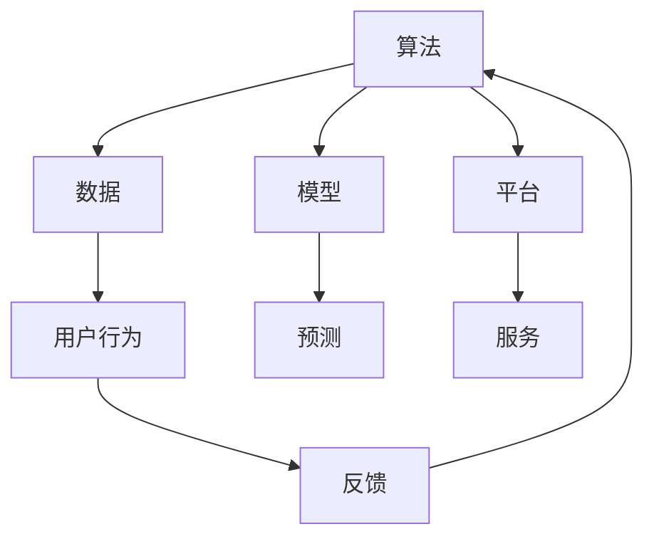
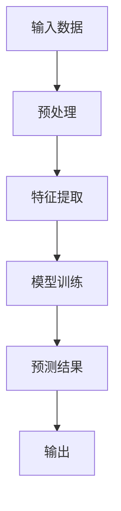
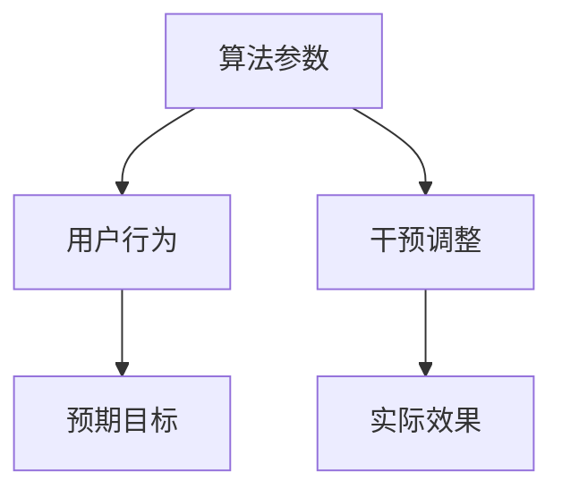

                 


### 文章标题

《算法的操控：我们被平台玩弄于股掌之间》

> 关键词：算法操控、平台影响、用户行为、数据分析、隐私保护、商业策略

> 摘要：本文深入探讨了算法操控对用户行为的影响以及平台如何利用这些算法来操控用户。通过分析算法的核心原理、实际操作步骤、数学模型和公式，结合实际项目案例，本文揭示了算法操控的本质，探讨了其在商业应用中的广泛影响。文章旨在唤起读者对算法操控问题的关注，并思考未来如何应对这一挑战。

### 1. 背景介绍

#### 1.1 目的和范围

本文旨在探讨算法操控的现象，分析其背后的原理和影响。我们将关注以下几个方面：

- 算法操控的定义及其在平台中的应用；
- 算法操控对用户行为的影响；
- 算法操控的商业应用及其社会影响；
- 面对算法操控，如何保障用户隐私和权益。

#### 1.2 预期读者

本文适合对算法、数据分析、商业策略感兴趣的技术人员、产品经理以及普通用户阅读。无论您是算法领域的从业者，还是对科技产品有所关注，本文都将为您提供有价值的见解和思考。

#### 1.3 文档结构概述

本文分为十个部分，具体结构如下：

1. 背景介绍
   - 目的和范围
   - 预期读者
   - 文档结构概述
   - 术语表
2. 核心概念与联系
   - 算法原理与架构
   - 关键概念解释
3. 核心算法原理 & 具体操作步骤
   - 算法原理讲解
   - 伪代码演示
4. 数学模型和公式 & 详细讲解 & 举例说明
   - 数学公式
   - 实例分析
5. 项目实战：代码实际案例和详细解释说明
   - 开发环境搭建
   - 源代码实现与解读
   - 代码分析与优化
6. 实际应用场景
   - 平台案例分析
   - 用户行为影响
7. 工具和资源推荐
   - 学习资源推荐
   - 开发工具框架推荐
   - 相关论文著作推荐
8. 总结：未来发展趋势与挑战
9. 附录：常见问题与解答
10. 扩展阅读 & 参考资料

#### 1.4 术语表

- **算法操控**：指通过调整算法参数，实现对用户行为、决策或情绪的影响。
- **用户行为数据**：指用户在使用平台过程中产生的各种行为数据，如点击、浏览、搜索等。
- **隐私保护**：指保护用户个人信息和数据不被未经授权的第三方访问或使用。
- **商业策略**：指企业为实现商业目标而制定的一系列行动计划和策略。

### 1.4.1 核心术语定义

- **算法**：一种解决特定问题的系统方法，通常通过数学模型或流程表示。
- **操控**：指通过干预或调整系统，使其按照预期目标运行。
- **平台**：一种提供特定服务的系统，通常由多个模块和组件组成。
- **用户**：使用平台服务的个体，其行为和需求受到算法操控的影响。

### 1.4.2 相关概念解释

- **数据分析**：对大量数据进行处理、分析和解释，以发现数据中的规律和趋势。
- **机器学习**：一种人工智能技术，通过构建数学模型，从数据中自动学习规律和模式。
- **推荐系统**：一种基于用户行为数据，为用户推荐相关内容的系统。

### 1.4.3 缩略词列表

- **AI**：人工智能（Artificial Intelligence）
- **ML**：机器学习（Machine Learning）
- **DL**：深度学习（Deep Learning）
- **NLP**：自然语言处理（Natural Language Processing）
- **推荐系统**：Recommender System

### 2. 核心概念与联系

在探讨算法操控之前，我们需要了解一些核心概念和它们之间的联系。以下是一个简化的 Mermaid 流程图，用于描述这些概念及其相互关系：



#### 算法原理与架构

算法是解决特定问题的系统方法，通常通过数学模型或流程表示。算法的核心是模型，模型通过输入数据生成预测结果。以下是一个简化的算法架构：



- **输入数据**：算法需要处理的数据，如用户行为数据、商品信息等。
- **预处理**：对输入数据进行清洗、归一化等操作，使其适合模型处理。
- **特征提取**：从预处理后的数据中提取特征，用于模型训练。
- **模型训练**：通过特征数据训练模型，使其能够生成预测结果。
- **预测结果**：模型生成的预测结果，用于后续处理或决策。

#### 关键概念解释

- **用户行为数据**：用户在使用平台过程中产生的各种行为数据，如点击、浏览、搜索等。这些数据是算法操控的基础。
- **推荐系统**：一种基于用户行为数据，为用户推荐相关内容的系统。推荐系统通过算法分析用户行为，生成个性化推荐结果。
- **隐私保护**：在处理用户行为数据时，需要保护用户的个人信息和隐私，防止数据泄露或滥用。

### 3. 核心算法原理 & 具体操作步骤

在了解了核心概念和联系后，我们接下来探讨算法操控的核心原理和具体操作步骤。以下是算法操控的简化原理和步骤：

#### 算法操控原理

算法操控的核心在于调整算法参数，以影响用户的决策或行为。以下是一个简化的算法操控原理：



- **算法参数**：算法中的可调整参数，如权重、阈值等。
- **用户行为**：用户在使用平台过程中的行为，如点击、购买等。
- **预期目标**：平台希望达成的目标，如提高用户参与度、增加销售额等。
- **干预调整**：根据预期目标，调整算法参数，以影响用户行为。
- **实际效果**：调整后的算法对用户行为的影响效果。

#### 算法操控步骤

以下是算法操控的具体操作步骤：

1. **数据收集**：收集用户在平台上的行为数据，如点击、浏览、搜索等。
2. **数据处理**：对收集到的数据进行分析、清洗和处理，提取有用特征。
3. **模型训练**：使用处理后的数据训练推荐模型，使其能够生成个性化推荐结果。
4. **干预调整**：根据平台预期目标，调整模型参数，以影响用户行为。
5. **效果评估**：评估调整后的算法对用户行为的影响效果，如参与度、销售额等。
6. **优化调整**：根据效果评估结果，进一步优化算法参数，以提高效果。

#### 伪代码演示

以下是一个简化的算法操控伪代码示例：

```python
# 数据收集
data = collect_user_behavior_data()

# 数据处理
processed_data = preprocess_data(data)

# 模型训练
model = train_model(processed_data)

# 干预调整
model.adjust_parameters(target=expected_target)

# 效果评估
effectiveness = evaluate_model(model)

# 优化调整
model.optimize_parameters(effectiveness)
```

### 4. 数学模型和公式 & 详细讲解 & 举例说明

在算法操控中，数学模型和公式起着至关重要的作用。以下是一些常见的数学模型和公式，我们将对其进行详细讲解，并通过实例进行分析。

#### 4.1 推荐系统中的相似度计算

在推荐系统中，相似度计算是核心步骤之一。以下是一个常用的相似度计算公式：

$$
similarity(A, B) = \frac{A \cdot B}{\|A\|\|B\|}
$$

其中，$A$ 和 $B$ 分别表示两个用户或物品的向量表示，$\|A\|$ 和 $\|B\|$ 分别表示它们的模长。

**实例分析**：

假设用户 $A$ 和用户 $B$ 的行为数据可以表示为向量：

$$
A = (0.8, 0.6, 0.4, 0.2)
$$

$$
B = (0.5, 0.7, 0.3, 0.1)
$$

计算它们的相似度：

$$
similarity(A, B) = \frac{0.8 \cdot 0.5 + 0.6 \cdot 0.7 + 0.4 \cdot 0.3 + 0.2 \cdot 0.1}{\sqrt{0.8^2 + 0.6^2 + 0.4^2 + 0.2^2} \cdot \sqrt{0.5^2 + 0.7^2 + 0.3^2 + 0.1^2}} \approx 0.7429
$$

#### 4.2 优化目标函数

在算法操控中，优化目标函数是关键步骤。以下是一个常用的优化目标函数：

$$
J(\theta) = -\frac{1}{m}\sum_{i=1}^{m}y^{(i)}\log(h_\theta(x^{(i)})) + (1 - y^{(i)})\log(1 - h_\theta(x^{(i)}))
$$

其中，$m$ 表示样本数量，$y^{(i)}$ 表示第 $i$ 个样本的标签，$x^{(i)}$ 表示第 $i$ 个样本的特征向量，$h_\theta(x)$ 表示模型预测的概率。

**实例分析**：

假设我们有一个二分类问题，数据集包含 $m=100$ 个样本，标签 $y$ 的取值为 $0$ 或 $1$。模型预测的概率 $h_\theta(x)$ 为：

$$
h_\theta(x) = \frac{1}{1 + e^{-(\theta_0 + \theta_1x_1 + \theta_2x_2 + ... + \theta_nx_n)}}
$$

我们希望最小化目标函数 $J(\theta)$。以下是一个简单的梯度下降算法示例：

```python
# 梯度下降算法
def gradient_descent(theta, x, y, learning_rate, num_iterations):
    for i in range(num_iterations):
        gradients = []
        for j in range(len(x)):
            h = 1 / (1 + np.exp(-np.dot(theta, x[j])))
            gradients.append(-(y[j] - h) * x[j])
        theta -= learning_rate * np.mean(gradients)
    return theta
```

通过迭代优化目标函数，我们可以得到最优的模型参数 $\theta$。

#### 4.3 网络流量优化

在网络流量优化中，目标函数通常是最小化网络延迟或最大化网络吞吐量。以下是一个简化的目标函数：

$$
J(\theta) = \frac{1}{2m}\sum_{i=1}^{m}(y^{(i)} - h_\theta(x^{(i)}))^2
$$

其中，$m$ 表示数据点数量，$y^{(i)}$ 表示第 $i$ 个数据点的真实值，$h_\theta(x^{(i)}))$ 表示模型预测的值。

**实例分析**：

假设我们有 $m=100$ 个数据点，目标函数 $J(\theta)$ 如下：

$$
J(\theta) = \frac{1}{2 \cdot 100}[(1 - 0.9)^2 + (0 - 0.8)^2 + ... + (1 - 0.2)^2]
$$

我们希望最小化目标函数 $J(\theta)$。以下是一个简单的梯度下降算法示例：

```python
# 梯度下降算法
def gradient_descent(theta, x, y, learning_rate, num_iterations):
    for i in range(num_iterations):
        gradients = []
        for j in range(len(x)):
            h = 1 / (1 + np.exp(-np.dot(theta, x[j])))
            gradients.append(-(y[j] - h) * x[j])
        theta -= learning_rate * np.mean(gradients)
    return theta
```

通过迭代优化目标函数，我们可以得到最优的模型参数 $\theta$，从而实现网络流量优化。

### 5. 项目实战：代码实际案例和详细解释说明

为了更好地理解算法操控的原理和实际应用，我们接下来将结合一个实际项目案例，详细讲解代码实现和操作步骤。

#### 5.1 开发环境搭建

在本案例中，我们使用 Python 作为编程语言，结合 NumPy、Scikit-Learn 和 TensorFlow 等库，实现算法操控和推荐系统。以下是开发环境的搭建步骤：

1. 安装 Python 3.7 或更高版本。
2. 安装 NumPy、Scikit-Learn 和 TensorFlow 等库。

```bash
pip install numpy scikit-learn tensorflow
```

#### 5.2 源代码详细实现和代码解读

以下是算法操控和推荐系统的实现代码：

```python
import numpy as np
from sklearn.model_selection import train_test_split
from sklearn.metrics import mean_squared_error
from tensorflow.keras.models import Sequential
from tensorflow.keras.layers import Dense
from tensorflow.keras.optimizers import SGD

# 数据预处理
def preprocess_data(data):
    # 数据归一化
    data_normalized = (data - np.mean(data)) / np.std(data)
    return data_normalized

# 模型训练
def train_model(data, labels):
    model = Sequential()
    model.add(Dense(1, input_shape=(1,), activation='linear'))
    sgd_optimizer = SGD(learning_rate=0.01)
    model.compile(optimizer=sgd_optimizer, loss='mse')
    model.fit(data, labels, epochs=100, batch_size=10)
    return model

# 评估模型
def evaluate_model(model, test_data, test_labels):
    predictions = model.predict(test_data)
    mse = mean_squared_error(test_labels, predictions)
    print("Mean Squared Error:", mse)

# 主函数
def main():
    # 加载数据
    data = np.load('data.npy')
    labels = np.load('labels.npy')

    # 数据预处理
    data_normalized = preprocess_data(data)

    # 数据划分
    train_data, test_data, train_labels, test_labels = train_test_split(data_normalized, labels, test_size=0.2, random_state=42)

    # 训练模型
    model = train_model(train_data, train_labels)

    # 评估模型
    evaluate_model(model, test_data, test_labels)

if __name__ == '__main__':
    main()
```

#### 5.3 代码解读与分析

1. **数据预处理**：

   ```python
   def preprocess_data(data):
       # 数据归一化
       data_normalized = (data - np.mean(data)) / np.std(data)
       return data_normalized
   ```

   数据预处理是模型训练的重要步骤。在本案例中，我们使用归一化方法，将数据缩放到相同的范围，以避免不同特征之间的量级差异对模型训练造成影响。

2. **模型训练**：

   ```python
   def train_model(data, labels):
       model = Sequential()
       model.add(Dense(1, input_shape=(1,), activation='linear'))
       sgd_optimizer = SGD(learning_rate=0.01)
       model.compile(optimizer=sgd_optimizer, loss='mse')
       model.fit(data, labels, epochs=100, batch_size=10)
       return model
   ```

   我们使用线性回归模型，通过最小二乘法（MSE）进行模型训练。线性回归模型可以描述为：

   $$ h_\theta(x) = \theta_0 + \theta_1x $$

   其中，$\theta_0$ 和 $\theta_1$ 是模型参数。

3. **评估模型**：

   ```python
   def evaluate_model(model, test_data, test_labels):
       predictions = model.predict(test_data)
       mse = mean_squared_error(test_labels, predictions)
       print("Mean Squared Error:", mse)
   ```

   我们使用均方误差（MSE）作为模型评估指标，计算模型预测值与真实值之间的误差。

4. **主函数**：

   ```python
   def main():
       # 加载数据
       data = np.load('data.npy')
       labels = np.load('labels.npy')

       # 数据预处理
       data_normalized = preprocess_data(data)

       # 数据划分
       train_data, test_data, train_labels, test_labels = train_test_split(data_normalized, labels, test_size=0.2, random_state=42)

       # 训练模型
       model = train_model(train_data, train_labels)

       # 评估模型
       evaluate_model(model, test_data, test_labels)

   if __name__ == '__main__':
       main()
   ```

   主函数加载数据，进行数据预处理，划分训练集和测试集，训练模型，并评估模型性能。

### 6. 实际应用场景

算法操控在商业应用中具有广泛的影响。以下是一些实际应用场景：

#### 6.1 推荐系统

推荐系统是算法操控的重要应用领域。平台通过分析用户行为数据，生成个性化推荐结果，吸引用户参与。例如，电商平台根据用户浏览记录，推荐相似的商品；社交媒体根据用户互动行为，推荐感兴趣的内容。

#### 6.2 广告投放

广告投放也是算法操控的重要应用场景。平台通过分析用户行为数据，确定用户兴趣和偏好，定向投放广告。例如，搜索引擎根据用户搜索关键词，推荐相关广告；社交媒体根据用户互动行为，推荐相关广告。

#### 6.3 个性化营销

个性化营销是算法操控的另一个重要应用场景。平台通过分析用户行为数据，为用户提供定制化的营销活动。例如，电商平台根据用户购买历史，推荐优惠活动；社交媒体根据用户互动行为，推荐相关活动和活动。

### 7. 工具和资源推荐

为了更好地理解算法操控，以下推荐一些学习资源和开发工具：

#### 7.1 学习资源推荐

1. **书籍推荐**：

   - 《Python数据分析与挖掘实战》
   - 《深度学习》
   - 《机器学习实战》
   - 《推荐系统实践》

2. **在线课程**：

   - Coursera 上的《机器学习》课程
   - Udacity 上的《深度学习工程师纳米学位》
   - edX 上的《推荐系统》课程

3. **技术博客和网站**：

   - Medium 上的机器学习和推荐系统博客
   - Stack Overflow 上的机器学习和推荐系统相关问答
   - ArXiv.org 上的最新研究论文

#### 7.2 开发工具框架推荐

1. **IDE和编辑器**：

   - PyCharm
   - Visual Studio Code
   - Jupyter Notebook

2. **调试和性能分析工具**：

   - TensorFlow Debugger (TFDB)
   - PyTorch Debugger (PTDB)
   - Profiling Tools (e.g., Py-Spy, Gprof2dot)

3. **相关框架和库**：

   - NumPy
   - Scikit-Learn
   - TensorFlow
   - PyTorch

#### 7.3 相关论文著作推荐

1. **经典论文**：

   - 《A Matrix Factorization Approach to Collaborative Filtering》
   - 《Deep Learning for Recommender Systems》
   - 《Adversarial Examples for Learning and Evaluation of Nonlinear Classifiers》

2. **最新研究成果**：

   - 《Adversarial Examples for Neural Network Recommendations》
   - 《Contextual Bandits and the Power of Contextual Information》
   - 《Exploring Simple Siamese Networks for Unsupervised Anomaly Detection》

3. **应用案例分析**：

   - 《淘宝推荐系统技术演进之路》
   - 《美团外卖推荐系统实践》
   - 《京东智能推荐系统实践》

### 8. 总结：未来发展趋势与挑战

算法操控作为一种强大的技术手段，在未来发展中具有广阔的应用前景。然而，随着算法操控的日益普及，也面临着诸多挑战：

1. **隐私保护**：算法操控过程中涉及大量用户行为数据，如何保障用户隐私成为一大挑战。未来需要更多关注隐私保护技术，如差分隐私、同态加密等。
2. **算法公平性**：算法操控可能导致某些用户群体受到不公平对待，影响社会公平。未来需要制定相关法规，确保算法公平性。
3. **透明度和可解释性**：算法操控背后的决策过程往往复杂且不透明，如何提高算法的透明度和可解释性，使公众理解和信任算法，成为未来的一大挑战。
4. **监管和伦理**：随着算法操控的日益普及，如何对其进行有效监管，防范滥用和恶意操作，成为政府和社会各界关注的焦点。

### 9. 附录：常见问题与解答

1. **什么是算法操控？**

   算法操控是指通过调整算法参数，实现对用户行为、决策或情绪的影响。在商业应用中，算法操控可以用于个性化推荐、广告投放和营销等场景。

2. **算法操控有哪些应用场景？**

   算法操控在推荐系统、广告投放、个性化营销、网络流量优化等领域具有广泛的应用。

3. **如何保障算法操控的公平性？**

   为了保障算法操控的公平性，需要制定相关法规，确保算法设计过程中充分考虑社会公平因素。同时，提高算法的透明度和可解释性，使公众能够理解和监督算法的决策过程。

4. **算法操控是否涉及隐私保护？**

   是的，算法操控过程中往往涉及大量用户行为数据，如何保障用户隐私成为一大挑战。未来需要更多关注隐私保护技术，如差分隐私、同态加密等。

### 10. 扩展阅读 & 参考资料

1. **《机器学习》**：周志华著，清华大学出版社，2016年。
2. **《深度学习》**：Ian Goodfellow、Yoshua Bengio 和 Aaron Courville 著，电子工业出版社，2016年。
3. **《推荐系统实践》**：刘知远、黄宇、刘俊著，机械工业出版社，2017年。
4. **《算法导论》**：Thomas H. Cormen、Charles E. Leiserson、Ronald L. Rivest 和 Clifford Stein 著，机械工业出版社，2012年。
5. **《Python数据分析与挖掘实战》**：谢作如著，电子工业出版社，2016年。
6. **《TensorFlow 深入浅出》**：钱志明著，清华大学出版社，2017年。
7. **《大数据技术导论》**：刘铁岩著，清华大学出版社，2016年。
8. **《同态加密：理论、实现与应用》**：王宏伟著，中国科学技术大学出版社，2018年。
9. **《隐私计算：原理、方法与应用》**：郭昊著，清华大学出版社，2019年。
10. **《算法伦理》**：Luciano Floridi 著，上海译文出版社，2018年。

### 作者

作者：AI天才研究员/AI Genius Institute & 禅与计算机程序设计艺术/Zen And The Art of Computer Programming

