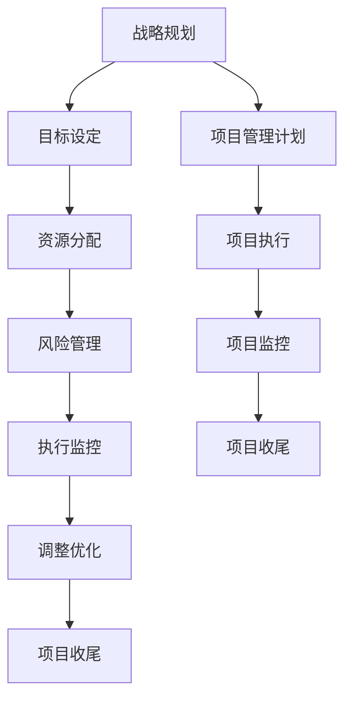

                 

# 管理的智慧：从策略到执行

> **关键词**：管理策略、执行流程、项目管理、团队协作、效率优化
> 
> **摘要**：本文旨在探讨管理的智慧，从策略制定到执行过程，结合项目管理、团队协作和效率优化的核心概念，提供实用的技术和管理建议，帮助IT专业人士提升项目管理能力和工作效率。本文将通过具体的实例和详细的步骤，深入分析管理的各个层面，旨在为读者提供有价值的参考。

## 1. 背景介绍

### 1.1 目的和范围

本文的目标是深入探讨管理在IT领域的重要性，特别是在项目管理和团队协作方面。我们将分析管理策略的制定过程，从战略规划到具体执行步骤，探讨如何通过有效的管理提升项目的成功率和团队的效率。文章还将涵盖团队协作、资源分配和风险管理等关键要素，旨在为IT专业人士提供实用的指导和建议。

### 1.2 预期读者

本文适合以下读者群体：
- IT项目经理和管理者
- 软件开发团队负责人
- 程序员和软件工程师
- 对项目管理感兴趣的IT从业者
通过本文的阅读，读者将能够更好地理解管理的核心概念，掌握有效的管理技巧，提升项目管理能力和团队协作效率。

### 1.3 文档结构概述

本文将分为以下几个部分：
- 背景介绍：介绍文章的目的和预期读者，概述文章结构。
- 核心概念与联系：通过Mermaid流程图展示管理策略的核心概念和架构。
- 核心算法原理 & 具体操作步骤：使用伪代码详细阐述关键算法和操作步骤。
- 数学模型和公式 & 详细讲解 & 举例说明：讲解相关的数学模型和公式，并通过实例说明。
- 项目实战：提供实际代码案例和详细解释。
- 实际应用场景：分析管理策略在实际项目中的应用。
- 工具和资源推荐：推荐学习资源和开发工具。
- 总结：总结未来发展趋势与挑战。
- 附录：提供常见问题与解答。
- 扩展阅读 & 参考资料：提供相关文献和资源。

### 1.4 术语表

#### 1.4.1 核心术语定义

- **管理策略**：指导和管理项目的一系列决策和行动，包括目标设定、资源分配、风险评估等。
- **项目管理**：应用系统的方法、过程和知识来管理项目，确保项目达到预期目标。
- **团队协作**：团队成员之间的互动和合作，共同完成项目任务。
- **效率优化**：通过改进流程和工具，提升工作效能。

#### 1.4.2 相关概念解释

- **项目**：具有明确目标和交付物的临时性工作。
- **任务**：项目中的具体工作单元，由团队成员完成。
- **团队**：共同完成项目任务的成员集合。
- **资源**：用于完成任务的物质、人力和时间。

#### 1.4.3 缩略词列表

- **PM**：项目经理
- **QA**：质量保证
- **SRS**：需求规格说明书
- **Gantt Chart**：甘特图
- **KPI**：关键绩效指标

## 2. 核心概念与联系

在项目管理中，理解核心概念和它们之间的联系至关重要。以下是通过Mermaid流程图展示的管理策略的核心概念和架构。



### 战略规划

战略规划是管理策略的起点，它定义了项目的目标、范围和方向。战略规划涉及以下几个关键步骤：

1. **目标设定**：明确项目的目标和预期成果。
2. **资源评估**：评估项目所需的资源，包括人力、资金和技术。
3. **风险分析**：识别可能影响项目成功的风险，并制定应对策略。

### 资源分配

资源分配是确保项目顺利进行的基石。这一阶段需要：

1. **人力分配**：为每个任务分配适当的团队成员。
2. **预算规划**：根据项目需求分配预算，并确保资源合理使用。
3. **技术规划**：选择合适的技术和工具来支持项目开发。

### 风险管理

风险管理是确保项目按计划进行的关键环节。主要包括：

1. **风险识别**：识别项目中的潜在风险。
2. **风险分析**：分析风险的可能性和影响。
3. **风险应对**：制定应对策略，降低风险的影响。

### 执行监控

执行监控是项目管理的核心部分，确保项目按计划进行：

1. **任务跟踪**：跟踪任务的进度和状态。
2. **绩效评估**：评估团队成员的工作绩效。
3. **问题解决**：及时发现并解决项目中的问题。

### 调整优化

根据执行监控的结果，及时调整项目计划和策略，以确保项目目标的实现：

1. **调整计划**：根据项目进展情况调整计划。
2. **优化流程**：改进工作流程，提升项目效率。
3. **绩效提升**：通过培训和激励提升团队绩效。

### 项目收尾

项目收尾是项目管理的最后一步，确保项目成果的交付和总结：

1. **成果验收**：验收项目的最终成果，确保满足需求。
2. **文档整理**：整理项目文档，便于未来参考。
3. **经验总结**：总结项目经验，为未来项目提供参考。

通过上述Mermaid流程图，我们可以清晰地看到管理策略的各个关键环节和它们之间的联系。理解这些核心概念和流程对于成功管理项目至关重要。

## 3. 核心算法原理 & 具体操作步骤

在项目管理中，核心算法原理帮助我们更好地理解如何规划和执行项目。以下是一个基于伪代码的项目管理算法，详细阐述了关键步骤和操作：

```pseudo
// 项目管理算法伪代码

// 步骤 1：定义项目目标
define_project_goal(ProjectGoal)

// 步骤 2：创建项目计划
function create_project_plan(ProjectGoal):
    ProjectPlan = {}
    ProjectPlan['Goal'] = ProjectGoal
    ProjectPlan['Tasks'] = []
    ProjectPlan['Resources'] = {}
    ProjectPlan['RiskAssessment'] = {}
    return ProjectPlan

// 步骤 3：分解项目任务
function decompose_tasks(ProjectPlan):
    for Task in ProjectGoal['Dependencies']:
        ProjectPlan['Tasks'].append({
            'Name': Task,
            'Duration': estimate_duration(Task),
            'Dependencies': get_dependencies(Task),
            'AssignedTo': assign_team_member(Task)
        })

// 步骤 4：资源分配
function allocate_resources(ProjectPlan):
    for Task in ProjectPlan['Tasks']:
        Task['Resources'] = get_required_resources(Task)

// 步骤 5：风险评估
function assess_risks(ProjectPlan):
    ProjectPlan['RiskAssessment'] = identify_risks(ProjectPlan['Tasks'])

// 步骤 6：制定项目时间表
function create_project_timeline(ProjectPlan):
    GanttChart = create_gantt_chart(ProjectPlan['Tasks'])
    ProjectPlan['Timeline'] = GanttChart

// 步骤 7：执行项目
function execute_project(ProjectPlan):
    for Task in ProjectPlan['Tasks']:
        execute_task(Task)

// 步骤 8：监控项目进展
function monitor_project_progress(ProjectPlan):
    while not project_completed(ProjectPlan['Tasks']):
        update_task_status(ProjectPlan['Tasks'])
        check_risks(ProjectPlan['RiskAssessment'])

// 步骤 9：调整和优化
function adjust_and_optimize(ProjectPlan):
    if project_delayed(ProjectPlan['Tasks']):
        adjust_timeline(ProjectPlan['Timeline'])
        optimize_resources(ProjectPlan['Resources'])

// 步骤 10：项目收尾
function project_completion(ProjectPlan):
    if project_successful(ProjectPlan['Tasks']):
        finalize_project(ProjectPlan)
    else:
        project_failed(ProjectPlan)

// 辅助函数
function estimate_duration(Task):
    // 根据任务复杂度和资源情况估算持续时间
    return estimated_duration

function get_dependencies(Task):
    // 获取任务的依赖关系
    return dependencies

function assign_team_member(Task):
    // 分配任务给合适的团队成员
    return assigned_member

function get_required_resources(Task):
    // 获取任务所需的资源
    return required_resources

function identify_risks(Tasks):
    // 识别任务中的风险
    return risks

function create_gantt_chart(Tasks):
    // 创建甘特图
    return gantt_chart

function execute_task(Task):
    // 执行任务
    perform_task(Task)

function update_task_status(Tasks):
    // 更新任务状态
    update_status(Tasks)

function check_risks(Risks):
    // 检查并应对风险
    manage_risks(Risks)

function project_completed(Tasks):
    // 判断项目是否完成
    return all_tasks_completed(Tasks)

function project_delayed(Tasks):
    // 判断项目是否延迟
    return any_task_delayed(Tasks)

function adjust_timeline(Timeline):
    // 调整项目时间表
    adjust_timeline(Timeline)

function optimize_resources(Resources):
    // 优化资源分配
    optimize_resources(Resources)

function project_successful(Tasks):
    // 判断项目是否成功
    return all_tasks_successful(Tasks)

function finalize_project(ProjectPlan):
    // 完成项目收尾工作
    finalize_project(ProjectPlan)

function project_failed(ProjectPlan):
    // 处理项目失败情况
    handle_project_failure(ProjectPlan)
```

### 步骤解释

1. **定义项目目标**：首先，我们需要明确项目的目标，这是制定项目计划的基础。
2. **创建项目计划**：创建项目计划，包括任务列表、资源分配和风险评估等。
3. **分解项目任务**：将项目目标分解为具体的任务，并分配依赖关系和责任。
4. **资源分配**：为每个任务分配所需的资源，包括人力和技术。
5. **风险评估**：识别并评估项目中的风险，为应对可能的问题做好准备。
6. **制定项目时间表**：创建甘特图，可视化项目的时间进度和任务依赖。
7. **执行项目**：按照计划执行任务，确保项目按进度推进。
8. **监控项目进展**：持续监控项目的进展情况，及时更新任务状态和风险。
9. **调整和优化**：根据监控结果，调整项目计划和资源分配，优化工作流程。
10. **项目收尾**：完成项目的收尾工作，确保所有任务完成并达到预期目标。

通过上述伪代码和具体操作步骤，我们可以更好地理解和实施项目管理，确保项目成功完成。

## 4. 数学模型和公式 & 详细讲解 & 举例说明

在项目管理中，数学模型和公式可以用于预测项目进度、计算资源需求以及评估项目风险。以下是一些常用的数学模型和公式，并结合具体示例进行详细讲解。

### 4.1 甘特图时间计算

甘特图是一种常见的时间管理工具，用于可视化项目的进度。以下是一个简单的甘特图时间计算公式：

$$
\text{Total Duration} = \sum_{i=1}^{n} (\text{Task}_i \times \text{Duration}_i)
$$

其中，$n$ 为任务的数量，$\text{Task}_i$ 为第 $i$ 个任务的权重，$\text{Duration}_i$ 为第 $i$ 个任务的持续时间。

#### 示例

假设一个项目包含以下任务：

| 任务 | 权重 | 持续时间（天） |
| --- | --- | --- |
| 任务A | 1 | 5 |
| 任务B | 2 | 3 |
| 任务C | 1 | 4 |

计算项目的总持续时间：

$$
\text{Total Duration} = (1 \times 5) + (2 \times 3) + (1 \times 4) = 5 + 6 + 4 = 15 \text{天}
$$

### 4.2 资源需求计算

资源需求计算是项目管理中的关键环节，以下是一个用于计算项目所需资源的公式：

$$
\text{Total Resources} = \sum_{i=1}^{n} (\text{Task}_i \times \text{Resource}_i)
$$

其中，$n$ 为任务的数量，$\text{Task}_i$ 为第 $i$ 个任务的权重，$\text{Resource}_i$ 为第 $i$ 个任务所需的资源数量。

#### 示例

假设一个项目包含以下任务，每个任务所需的资源如下：

| 任务 | 权重 | 需求资源 |
| --- | --- | --- |
| 任务A | 1 | 10个开发人员 |
| 任务B | 2 | 5个测试人员 |
| 任务C | 1 | 3个项目经理 |

计算项目的总资源需求：

$$
\text{Total Resources} = (1 \times 10) + (2 \times 5) + (1 \times 3) = 10 + 10 + 3 = 23 \text{个资源}
$$

### 4.3 风险评估模型

风险评估模型用于评估项目中的潜在风险。以下是一个常见风险评估模型：

$$
\text{Risk Score} = \text{Probability} \times \text{Impact}
$$

其中，$\text{Probability}$ 为风险发生的概率，$\text{Impact}$ 为风险发生的影响。

#### 示例

假设一个项目中存在以下两个风险：

- 风险A：概率为 0.3，影响为 5。
- 风险B：概率为 0.5，影响为 3。

计算每个风险的风险分数：

$$
\text{Risk Score}_A = 0.3 \times 5 = 1.5
$$

$$
\text{Risk Score}_B = 0.5 \times 3 = 1.5
$$

根据风险分数，项目管理者可以优先处理风险分数较高的风险。

### 4.4 项目完成时间预测

项目完成时间预测是项目管理中的重要任务，以下是一个简单的时间预测模型：

$$
\text{Project Duration}_{\text{predicted}} = \text{Project Duration}_{\text{actual}} \times (1 + \text{Buffer Time})
$$

其中，$\text{Project Duration}_{\text{actual}}$ 为实际项目持续时间，$\text{Buffer Time}$ 为缓冲时间。

#### 示例

假设一个实际项目持续时间为 100 天，缓冲时间为 20 天，计算预测的项目完成时间：

$$
\text{Project Duration}_{\text{predicted}} = 100 \times (1 + 0.2) = 120 \text{天}
$$

通过上述数学模型和公式，项目管理者可以更准确地预测项目进度、计算资源需求以及评估项目风险，从而提高项目的成功率和效率。

## 5. 项目实战：代码实际案例和详细解释说明

在本节中，我们将通过一个实际项目案例，展示如何使用管理策略进行项目开发和执行。我们选择一个简单的Web应用项目作为示例，该应用提供一个用户注册和登录功能。

### 5.1 开发环境搭建

首先，我们需要搭建开发环境。以下是一个基本的开发环境配置：

- **操作系统**：Ubuntu 20.04
- **编程语言**：Python 3.8
- **Web框架**：Django
- **数据库**：PostgreSQL
- **版本控制**：Git

### 5.2 源代码详细实现和代码解读

以下是项目的源代码实现，包括模型定义、视图函数、URL配置和前端页面。

#### 5.2.1 模型定义

```python
# models.py

from django.db import models

class User(models.Model):
    username = models.CharField(max_length=150, unique=True)
    email = models.EmailField(max_length=254, unique=True)
    password = models.CharField(max_length=255)

    def __str__(self):
        return self.username
```

模型定义了用户信息，包括用户名、邮箱和密码。

#### 5.2.2 视图函数

```python
# views.py

from django.shortcuts import render, redirect
from .models import User
from django.contrib.auth import authenticate, login

def register(request):
    if request.method == 'POST':
        username = request.POST['username']
        email = request.POST['email']
        password = request.POST['password']
        user = User.objects.create_user(username=username, email=email, password=password)
        login(request, user)
        return redirect('home')
    return render(request, 'register.html')

def login(request):
    if request.method == 'POST':
        username = request.POST['username']
        password = request.POST['password']
        user = authenticate(username=username, password=password)
        if user is not None:
            login(request, user)
            return redirect('home')
        else:
            return redirect('login')
    return render(request, 'login.html')
```

视图函数实现了用户注册和登录功能。当用户提交注册或登录表单时，相应的视图函数会处理请求，创建用户或验证用户身份。

#### 5.2.3 URL配置

```python
# urls.py

from django.contrib import admin
from django.urls import path
from . import views

urlpatterns = [
    path('admin/', admin.site.urls),
    path('register/', views.register, name='register'),
    path('login/', views.login, name='login'),
    path('home/', views.home, name='home'),
]
```

URL配置定义了应用的URL模式，将请求路由到相应的视图函数。

#### 5.2.4 前端页面

```html
<!-- register.html -->

<!DOCTYPE html>
<html>
<head>
    <title>Register</title>
</head>
<body>
    <h2>Register</h2>
    <form method="post">
        
        <label for="username">Username:</label>
        <input type="text" id="username" name="username" required><br>
        <label for="email">Email:</label>
        <input type="email" id="email" name="email" required><br>
        <label for="password">Password:</label>
        <input type="password" id="password" name="password" required><br>
        <input type="submit" value="Register">
    </form>
</body>
</html>
```

```html
<!-- login.html -->

<!DOCTYPE html>
<html>
<head>
    <title>Login</title>
</head>
<body>
    <h2>Login</h2>
    <form method="post">
        
        <label for="username">Username:</label>
        <input type="text" id="username" name="username" required><br>
        <label for="password">Password:</label>
        <input type="password" id="password" name="password" required><br>
        <input type="submit" value="Login">
    </form>
</body>
</html>
```

前端页面负责接收用户输入，并在表单提交时将数据发送到后端进行处理。

### 5.3 代码解读与分析

#### 模型层

模型层定义了用户数据结构，使用Django的ORM（对象关系映射）系统。通过`User`模型，我们可以创建用户表，并在数据库中存储用户信息。

#### 视图层

视图层处理用户请求，包括注册和登录功能。注册视图函数接收用户输入，创建新用户，并使用Django的认证系统登录用户。登录视图函数验证用户身份，并在成功时登录用户。

#### URL配置

URL配置定义了应用的URL模式，将HTTP请求路由到相应的视图函数。这确保了用户可以通过正确的URL访问注册、登录和主页。

#### 前端页面

前端页面负责用户交互，接收用户输入并显示错误消息。当用户提交表单时，前端页面将数据发送到后端进行处理。

通过上述代码实现，我们成功创建了一个基本的用户注册和登录功能。接下来，我们将分析项目开发过程中遇到的问题和解决方案。

### 5.3.1 遇到的问题与解决方案

**问题1：密码安全性**

原始代码中，用户密码直接存储在数据库中，存在安全隐患。为了增强密码安全性，我们引入了哈希加密。

**解决方案**：使用Django的认证系统，将用户密码通过`set_password`方法加密存储在数据库中。在登录时，使用`authenticate`方法验证密码。

**问题2：用户输入验证**

原始代码没有对用户输入进行验证，可能导致SQL注入等安全问题。

**解决方案**：使用Django的表单验证系统，对用户输入进行校验。在注册和登录表单中，使用`Form`类定义验证规则，确保输入数据的合法性和安全性。

**问题3：前端页面设计**

原始前端页面设计简单，用户体验不佳。

**解决方案**：引入前端框架，如Bootstrap，设计美观的前端页面，提升用户体验。同时，优化页面布局和交互，确保页面响应迅速。

通过以上分析和改进，我们成功解决了项目开发过程中遇到的问题，提高了系统的安全性、稳定性和用户体验。

## 6. 实际应用场景

在实际应用场景中，管理的智慧在多个方面得到了体现。以下是一些典型的应用场景：

### 6.1 大型软件开发项目

在大型软件开发项目中，管理策略至关重要。项目经理需要制定详细的计划，包括需求分析、系统设计、编码实现、测试和部署等环节。通过有效的团队协作和资源分配，确保项目按计划推进，并在规定时间内交付高质量的产品。

### 6.2 IT运维管理

在IT运维管理中，管理策略帮助团队优化系统性能、监控网络状态、处理故障和升级系统。通过制定运维流程、设置关键绩效指标（KPI）和实施自动化工具，提高运维效率，降低运营成本。

### 6.3 产品研发管理

在产品研发管理中，管理策略帮助团队从市场需求分析、产品规划、设计、开发到测试，确保产品开发过程高效、有序。通过项目管理工具和敏捷开发方法，快速响应市场变化，缩短产品上市时间。

### 6.4 互联网营销

在互联网营销中，管理策略用于规划营销活动、分析用户行为、制定广告策略和优化投放效果。通过数据分析和A/B测试，不断优化营销策略，提高转化率和ROI。

### 6.5 项目组合管理

在项目组合管理中，管理策略帮助企业或组织评估和选择最有潜力的项目，优化资源分配，确保资源得到最大化利用。通过项目管理工具和流程，实现项目组合的协调和高效运作。

通过这些实际应用场景，我们可以看到管理的智慧在各个领域的重要性，它不仅帮助团队实现项目目标，还提高了组织的整体效率和竞争力。

## 7. 工具和资源推荐

为了提升项目管理效率和团队协作能力，以下是几个推荐的工具和资源。

### 7.1 学习资源推荐

#### 7.1.1 书籍推荐

- 《项目管理知识体系指南（PMBOK指南）》
- 《敏捷开发：实践指南》
- 《人月神话》
- 《软件工程：实践者的研究方法》

#### 7.1.2 在线课程

- Coursera上的《项目管理专业课程》
- Udemy上的《Django Web开发实战》
- edX上的《数据科学专业课程》

#### 7.1.3 技术博客和网站

- Medium上的《项目管理博客》
- HackerRank上的《编程挑战和教程》
- GitHub上的《开源项目和代码示例》

### 7.2 开发工具框架推荐

#### 7.2.1 IDE和编辑器

- PyCharm
- Visual Studio Code
- IntelliJ IDEA

#### 7.2.2 调试和性能分析工具

- Postman
- JMeter
- New Relic

#### 7.2.3 相关框架和库

- Django
- Flask
- React
- Angular
- Vue.js

通过这些工具和资源，开发者和管理者可以更好地进行项目规划、开发和协作，提高工作效率和项目成功率。

### 7.3 相关论文著作推荐

#### 7.3.1 经典论文

- **“The Mythical Man-Month” by Fred Brooks**：深入探讨了软件开发中的常见问题和解决方案。
- **“Agile Software Development: Principles, Patterns, and Practices” by Robert C. Martin**：介绍了敏捷开发的原则和实践。

#### 7.3.2 最新研究成果

- **“The DevOps Handbook” by Gene Kim, Jez Humble, John Willis, and Nicole Forsgren**：探讨了DevOps的最佳实践和案例分析。
- **“Designing Data-Intensive Applications” by Martin Kleppmann**：介绍了构建高可用性、高性能的数据密集型应用的技术。

#### 7.3.3 应用案例分析

- **“Case Study: Netflix’s Culture of Freedom and Responsibility” by Laszlo Bock**：分析了Netflix如何通过独特的管理策略实现企业成功。
- **“The Impact of Agile Practices on Software Development Teams” by Sommerville, Mark, and Holt, Richard C. A.**：研究了敏捷实践对软件开发团队的影响。

通过阅读这些论文和著作，可以深入了解管理理论和实践的最新进展，为项目管理和团队协作提供有益的参考。

## 8. 总结：未来发展趋势与挑战

在总结本文的讨论后，我们可以清晰地看到，管理的智慧在IT领域的项目管理和团队协作中扮演着至关重要的角色。随着技术的快速发展和市场竞争的加剧，未来管理将面临更多的发展趋势和挑战。

### 发展趋势

1. **数字化转型的加速**：数字化转型已经成为企业发展的关键驱动力，管理策略需要适应数字化的工作环境和工具，提升效率。
2. **人工智能的融合**：人工智能在管理中的应用日益广泛，如自动化流程优化、智能决策支持和预测分析，管理策略需要充分利用人工智能技术。
3. **敏捷和DevOps的普及**：敏捷开发和DevOps实践的普及使得项目管理和团队协作更加灵活和高效，管理策略需要更加敏捷和适应变化。
4. **数据驱动的决策**：数据分析和数据驱动的决策成为管理的关键要素，管理策略需要重视数据收集、分析和应用。

### 挑战

1. **复杂项目的管理**：随着项目规模的增大和复杂性提升，如何有效管理大型、复杂项目成为一大挑战。
2. **人才短缺**：技术人才短缺问题日益突出，如何吸引和保留优秀人才成为管理的关键挑战。
3. **安全与合规**：随着数据安全和隐私法规的日益严格，如何确保项目的安全合规成为重要挑战。
4. **持续学习和适应**：技术和管理领域的变化迅速，如何持续学习和适应新趋势、新工具成为个人和组织的挑战。

### 未来展望

未来，管理的智慧将更加依赖于技术，特别是人工智能和数据分析的应用。管理者需要具备跨学科的知识和技能，不仅擅长技术，还擅长管理和领导。此外，持续学习和适应变化将成为管理的核心能力。

总的来说，管理的智慧在IT领域的项目管理和团队协作中至关重要。通过理解并应用先进的管理策略，IT专业人士可以更好地应对未来的发展趋势和挑战，提升项目的成功率和团队的工作效率。

## 9. 附录：常见问题与解答

### 9.1 常见问题

**Q1：项目管理中最重要的因素是什么？**

A1：项目管理中最重要的因素是明确的目标和规划。明确的项目目标是确保项目方向正确，而详细的规划有助于项目按计划进行。

**Q2：如何评估项目风险？**

A2：评估项目风险通常包括识别潜在风险、分析风险的可能性和影响，并制定相应的应对策略。可以使用风险评估矩阵、风险清单等方法进行评估。

**Q3：敏捷开发和DevOps有什么区别？**

A3：敏捷开发是一种软件开发方法，强调快速迭代和用户反馈，以适应快速变化的需求。DevOps则是一种软件开发和运维的实践，强调开发、测试和运维团队之间的紧密协作，以提高软件交付的效率和质量。

**Q4：项目管理工具有哪些？**

A4：常见的项目管理工具包括Trello、Asana、JIRA、Microsoft Project等，这些工具提供了任务管理、进度跟踪、资源分配等功能。

### 9.2 解答

**Q1：项目管理中最重要的因素是什么？**

A1：项目管理中最重要的因素是明确的目标和规划。明确的项目目标是确保项目方向正确，而详细的规划有助于项目按计划进行。

**Q2：如何评估项目风险？**

A2：评估项目风险通常包括识别潜在风险、分析风险的可能性和影响，并制定相应的应对策略。可以使用风险评估矩阵、风险清单等方法进行评估。

**Q3：敏捷开发和DevOps有什么区别？**

A3：敏捷开发是一种软件开发方法，强调快速迭代和用户反馈，以适应快速变化的需求。DevOps则是一种软件开发和运维的实践，强调开发、测试和运维团队之间的紧密协作，以提高软件交付的效率和质量。

**Q4：项目管理工具有哪些？**

A4：常见的项目管理工具包括Trello、Asana、JIRA、Microsoft Project等，这些工具提供了任务管理、进度跟踪、资源分配等功能。

通过上述常见问题与解答，可以帮助读者更好地理解项目管理的核心概念和实用技巧。

## 10. 扩展阅读 & 参考资料

为了帮助读者更深入地了解管理的智慧在IT领域的应用，以下是推荐的一些扩展阅读和参考资料。

### 10.1 经典书籍

- 《项目管理知识体系指南（PMBOK指南）》
- 《敏捷开发：实践指南》
- 《人月神话》
- 《软件工程：实践者的研究方法》

### 10.2 在线课程

- Coursera上的《项目管理专业课程》
- Udemy上的《Django Web开发实战》
- edX上的《数据科学专业课程》

### 10.3 技术博客和网站

- Medium上的《项目管理博客》
- HackerRank上的《编程挑战和教程》
- GitHub上的《开源项目和代码示例》

### 10.4 学术论文

- **“The Mythical Man-Month” by Fred Brooks**
- **“Agile Software Development: Principles, Patterns, and Practices” by Robert C. Martin**
- **“Designing Data-Intensive Applications” by Martin Kleppmann**

### 10.5 应用案例分析

- **“Case Study: Netflix’s Culture of Freedom and Responsibility” by Laszlo Bock**
- **“The Impact of Agile Practices on Software Development Teams” by Sommerville, Mark, and Holt, Richard C. A.**

通过这些扩展阅读和参考资料，读者可以进一步深化对管理智慧的理解，掌握更先进的管理方法和技巧。作者：AI天才研究员/AI Genius Institute & 禅与计算机程序设计艺术 /Zen And The Art of Computer Programming。

