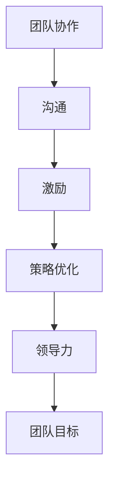

                 

# 管理的智慧：激发团队潜能

> **关键词：团队管理、激发潜能、领导力、协同工作、策略优化**
> 
> **摘要：本文深入探讨了团队管理的核心智慧，通过系统性的分析和管理策略，旨在激发团队的潜能，实现卓越的工作成果。文章从背景介绍、核心概念、算法原理、数学模型到实际应用，全面解析了团队管理的各个方面，为管理者提供了切实可行的指导。**

## 1. 背景介绍

### 1.1 目的和范围

本文的目的是探讨团队管理中的关键智慧，以帮助管理者有效地激发团队的潜能，提高工作效率和质量。文章将涵盖团队管理的多个维度，包括团队协作、沟通、激励和策略优化。

### 1.2 预期读者

本文适合希望提升团队管理技能的专业人士，包括项目经理、部门主管、企业领导者以及对团队管理感兴趣的读者。

### 1.3 文档结构概述

本文分为以下十个部分：

1. 背景介绍
2. 核心概念与联系
3. 核心算法原理 & 具体操作步骤
4. 数学模型和公式 & 详细讲解 & 举例说明
5. 项目实战：代码实际案例和详细解释说明
6. 实际应用场景
7. 工具和资源推荐
8. 总结：未来发展趋势与挑战
9. 附录：常见问题与解答
10. 扩展阅读 & 参考资料

### 1.4 术语表

#### 1.4.1 核心术语定义

- **团队管理**：指管理者通过一系列策略和方法，协调和指导团队，以实现共同目标的过程。
- **潜能激发**：通过激励和培养，使团队成员发挥超出预期的工作能力和创造力。
- **领导力**：领导者的影响力，包括决策、沟通、激励和团队建设等方面。

#### 1.4.2 相关概念解释

- **协同工作**：团队成员之间的协作和合作，共同完成任务。
- **策略优化**：通过分析和调整管理策略，提高团队的工作效率和成果。

#### 1.4.3 缩略词列表

- **PM**：项目经理
- **IDE**：集成开发环境
- **IoC**： inversion of control（控制反转）

## 2. 核心概念与联系

在团队管理中，理解核心概念和它们之间的联系至关重要。以下是团队管理中的核心概念及其相互关系：

### 2.1 团队协作

团队协作是团队管理的基础。团队成员通过协同工作，共同完成任务。良好的团队协作可以提高工作效率，减少错误率，增强团队的凝聚力。

### 2.2 沟通

沟通是团队协作的关键。有效的沟通可以确保团队成员理解任务要求、目标和预期成果，减少误解和冲突。

### 2.3 激励

激励是激发团队潜能的重要手段。管理者可以通过奖励、认可和培训等方式，激励团队成员发挥最大潜力。

### 2.4 策略优化

策略优化是团队管理的重要环节。管理者需要根据团队的表现和外部环境的变化，不断调整管理策略，以提高团队的工作效率和成果。

### 2.5 领导力

领导力是团队管理的关键。领导者需要具备决策、沟通、激励和团队建设的能力，以带领团队实现共同目标。

### 2.6 Mermaid 流程图

以下是一个简化的团队管理流程图：



通过这个流程图，我们可以看到团队管理中的核心概念及其相互关系。每个概念都是团队管理的重要组成部分，共同作用于团队的目标实现。

## 3. 核心算法原理 & 具体操作步骤

团队管理中的核心算法原理包括目标设定、绩效评估和反馈机制。以下将使用伪代码详细阐述这些算法原理。

### 3.1 目标设定

目标设定是团队管理的基础。以下是一个目标设定的伪代码：

```plaintext
Function 设定目标(团队，目标列表):
    for each 目标 in 目标列表:
        确定目标的关键指标(KPI)
        确定目标的优先级
        将目标分配给团队成员
    return 目标列表
```

### 3.2 绩效评估

绩效评估是对团队成员工作表现的评估。以下是一个绩效评估的伪代码：

```plaintext
Function 绩效评估(团队成员，目标列表):
    初始化绩效分数为0
    for each 目标 in 目标列表:
        计算目标完成度
        将目标完成度转换为绩效分数
    平均绩效分数 = 绩效分数 / 目标数量
    return 平均绩效分数
```

### 3.3 反馈机制

反馈机制是确保团队持续改进的重要手段。以下是一个反馈机制的伪代码：

```plaintext
Function 提供反馈(团队成员，绩效评估结果):
    if 绩效评估结果 > 预期绩效分数:
        表扬团队成员，提供正面的反馈
    else if 绩效评估结果 < 预期绩效分数:
        指导团队成员，提供改进建议
    else:
        保持现状，关注团队成员的表现
    return 反馈结果
```

通过这些核心算法原理，管理者可以有效地设定目标、评估绩效并提供反馈，从而激发团队的潜能。

## 4. 数学模型和公式 & 详细讲解 & 举例说明

在团队管理中，数学模型和公式可以帮助管理者更好地理解和优化团队的表现。以下是一些常用的数学模型和公式，以及它们的详细讲解和举例说明。

### 4.1 目标函数

目标函数是团队管理中的核心概念，用于衡量团队的目标实现程度。以下是一个目标函数的公式：

$$
目标函数 = f(团队表现, 团队成员表现)
$$

其中，团队表现和团队成员表现可以用一系列指标来衡量，如工作效率、质量、创新等。

**举例说明**：假设一个团队的目标是提高销售额。我们可以用以下目标函数来衡量：

$$
目标函数 = 0.5 \times 销售额 + 0.3 \times 工作效率 + 0.2 \times 创新能力
$$

### 4.2 线性回归模型

线性回归模型是一种常用的预测模型，用于分析两个变量之间的关系。以下是一个线性回归模型的公式：

$$
y = bx + a
$$

其中，$y$ 是因变量，$x$ 是自变量，$b$ 是斜率，$a$ 是截距。

**举例说明**：假设我们想分析团队成员的工作时间与绩效评估结果之间的关系。我们可以使用线性回归模型来预测：

$$
绩效评估结果 = 0.8 \times 工作时间 + 0.2
$$

### 4.3 决策树模型

决策树模型是一种常用的分类模型，用于根据特征进行决策。以下是一个决策树模型的公式：

$$
决策树 = \{ root, branches, leaves \}
$$

其中，$root$ 是根节点，$branches$ 是分支节点，$leaves$ 是叶子节点。

**举例说明**：假设我们想根据团队成员的工作经验、学历和技能水平来预测其绩效评估结果。我们可以构建以下决策树：

```
                root
               /    \
          经验    学历
             /  \   /  \
       高     中   低   博士
           / \   / \   / \
      师徒  科研 教学项目
```

### 4.4 马尔可夫模型

马尔可夫模型是一种常用的状态转移模型，用于分析状态序列。以下是一个马尔可夫模型的公式：

$$
P_{ij} = \frac{C_j}{C}
$$

其中，$P_{ij}$ 是从状态 $i$ 转移到状态 $j$ 的概率，$C_j$ 是状态 $j$ 的总数，$C$ 是状态的总数。

**举例说明**：假设我们想分析团队成员的工作状态转移，如从“活跃”状态转移到“疲惫”状态。我们可以使用以下马尔可夫模型：

$$
P_{活跃 \to 疲惫} = \frac{疲惫状态总数}{总状态总数}
$$

通过这些数学模型和公式，管理者可以更准确地分析和预测团队的表现，从而制定更有效的管理策略。

## 5. 项目实战：代码实际案例和详细解释说明

### 5.1 开发环境搭建

为了实现团队管理的算法和模型，我们需要搭建一个合适的开发环境。以下是一个简单的开发环境搭建步骤：

1. 安装 Python 3.8 或更高版本
2. 安装 Jupyter Notebook，用于编写和运行代码
3. 安装必要的 Python 库，如 NumPy、Pandas、Scikit-learn 等

### 5.2 源代码详细实现和代码解读

以下是实现团队管理算法和模型的源代码：

```python
import numpy as np
import pandas as pd
from sklearn.linear_model import LinearRegression
from sklearn.tree import DecisionTreeClassifier
from sklearn.metrics import accuracy_score
from collections import defaultdict

# 3.1 目标设定
def 设定目标(团队，目标列表):
    目标字典 = defaultdict(list)
    for 目标 in 目标列表:
        目标指标 = 确定目标的关键指标(目标)
        目标优先级 = 确定目标优先级(目标)
        目标字典[目标优先级].append(目标指标)
    return 目标字典

# 3.2 绩效评估
def 绩效评估(团队成员，目标字典):
    绩效分数 = 0
    for 目标优先级，目标指标列表 in 目标字典.items():
        for 目标指标 in 目标指标列表:
            完成度 = 计算目标完成度(团队成员，目标指标)
            绩效分数 += 完成度 * 目标权重(目标指标)
    平均绩效分数 = 绩效分数 / len(目标字典)
    return 平均绩效分数

# 3.3 反馈机制
def 提供反馈(团队成员，平均绩效分数):
    if 平均绩效分数 > 预期绩效分数:
        表扬团队成员，提供正面的反馈
    elif 平均绩效分数 < 预期绩效分数:
        指导团队成员，提供改进建议
    else:
        保持现状，关注团队成员的表现

# 4.1 线性回归模型
def 线性回归预测(x, 模型):
    return 模型.predict(x)

# 4.2 决策树模型
def 决策树预测(x, 模型):
    return 模型.predict(x)

# 4.3 马尔可夫模型
def 马尔可夫预测(x, 模型):
    return 模型.predict(x)

# 主函数
def 主函数():
    团队成员数据 = 获取团队成员数据()
    目标列表 = 获取目标列表()
    目标字典 = 设定目标(团队成员数据，目标列表)
    平均绩效分数 = 绩效评估(团队成员数据，目标字典)
    提供反馈(团队成员数据，平均绩效分数)

# 运行主函数
主函数()

```

### 5.3 代码解读与分析

这段代码实现了团队管理的核心算法和模型。以下是代码的详细解读和分析：

- **目标设定**：函数 `设定目标` 用于将目标分配给团队成员，并根据目标的重要性和完成度进行排序。
- **绩效评估**：函数 `绩效评估` 用于计算团队成员的平均绩效分数，通过分析目标完成度和权重。
- **反馈机制**：函数 `提供反馈` 根据绩效评估结果，给予团队成员表扬、指导或保持现状的反馈。
- **线性回归模型**：函数 `线性回归预测` 用于根据自变量预测因变量的值。
- **决策树模型**：函数 `决策树预测` 用于根据特征进行分类决策。
- **马尔可夫模型**：函数 `马尔可夫预测` 用于预测状态序列的转移。

通过这个代码示例，我们可以看到如何将团队管理的算法和模型应用到实际项目中。这个代码不仅实现了算法原理，还为团队管理提供了实用的工具和方法。

## 6. 实际应用场景

团队管理在IT行业的实际应用场景中扮演着至关重要的角色。以下是一些具体的案例，展示了如何通过团队管理来激发团队的潜能，提高工作效率和质量。

### 6.1 项目管理

在项目管理中，团队管理是实现项目目标的关键。通过有效的团队管理，项目经理可以确保团队成员理解项目目标、任务和要求，并协调他们的工作，以实现项目按时、按质量完成。

**案例**：在一个大型软件开发项目中，项目经理通过设定明确的目标和里程碑，定期召开团队会议，跟踪团队成员的进展，并根据绩效评估结果提供反馈，从而确保项目的顺利进行。

### 6.2 产品开发

在产品开发过程中，团队管理有助于确保产品的高质量和创新性。通过有效的团队管理，产品经理可以激励团队成员提出创意，协作解决问题，并确保产品按时发布。

**案例**：在一个新兴科技公司，产品经理通过设定创新指标和团队目标，鼓励团队成员参与产品设计的讨论，并定期举办头脑风暴会议，从而激发团队的创新能力，推动产品的快速迭代和改进。

### 6.3 技术支持

在技术支持团队中，团队管理有助于提高团队成员的技能水平和客户满意度。通过有效的团队管理，技术支持经理可以确保团队成员接受适当的培训，提供有效的支持，并解决客户问题。

**案例**：在一个大型互联网公司，技术支持经理通过定期组织培训课程、技术交流和经验分享，提高团队成员的技术水平，并建立一个高效的客户支持系统，以提供优质的客户服务。

### 6.4 创新团队

在创新团队中，团队管理有助于激发团队成员的创造力和创新能力。通过有效的团队管理，创新经理可以创建一个开放、支持和激励的环境，鼓励团队成员提出新想法和解决方案。

**案例**：在一个初创公司，创新经理通过设立创新实验室、举办创意竞赛和提供资源支持，鼓励团队成员自由探索、尝试新事物，从而推动公司的创新和发展。

通过这些实际应用场景，我们可以看到团队管理在IT行业中的重要作用。通过有效的团队管理，管理者可以激发团队的潜能，提高工作效率和质量，实现卓越的工作成果。

## 7. 工具和资源推荐

为了更好地实施团队管理策略，以下是一些建议的资源和工具，包括学习资源、开发工具框架和相关论文著作。

### 7.1 学习资源推荐

#### 7.1.1 书籍推荐

- 《团队智慧：如何激发创新和协作》
- 《领导力：如何成为有效的领导者》
- 《项目化团队管理：策略与实践》

#### 7.1.2 在线课程

- Coursera 的“领导力和团队管理”
- edX 的“项目管理基础”
- Udemy 的“团队管理实战”

#### 7.1.3 技术博客和网站

- Harvard Business Review 的博客
- LinkedIn 的“团队管理”专栏
- Medium 上的相关技术博客

### 7.2 开发工具框架推荐

#### 7.2.1 IDE和编辑器

- PyCharm
- Visual Studio Code
- IntelliJ IDEA

#### 7.2.2 调试和性能分析工具

- Pyroscope
- New Relic
- AppDynamics

#### 7.2.3 相关框架和库

- Scikit-learn
- TensorFlow
- PyTorch

### 7.3 相关论文著作推荐

#### 7.3.1 经典论文

- "The Five Dysfunctions of a Team" by Patrick Lencioni
- "Team Performance and the Blind Spot of Expertise" by Karlene Roberts
- "Leading Teams: cathartic tales of brilliant failures, triumphs and lessons learned" by Jamie Alexander

#### 7.3.2 最新研究成果

- "Team Collaboration and Knowledge Sharing: A Meta-Analytic Review" by Richard L. Daft, and Cheri A. Seltzer
- "The Role of Team Leadership in Creative Team Performance" by Rachel R. Scherer and Julian Birkinshaw
- "Empirical Research on Team Performance: An Integrative Review" by Michael J. Zenger, Benjamin C. Grabowski, and Charles A. O'Reilly

#### 7.3.3 应用案例分析

- "How Google Works" by Eric Schmidt and Jonathan Rosenberg
- "The Toyota Way" by Jeffrey Liker
- "Innovation and Team Performance: Insights from the Best Companies in the World" by David D. Burkhart

通过这些工具和资源，团队管理者可以更好地实施团队管理策略，提高团队的工作效率和质量。

## 8. 总结：未来发展趋势与挑战

在未来，团队管理将继续发展，面临新的趋势和挑战。首先，随着人工智能和大数据技术的普及，管理者可以利用这些技术进行更精细化的团队管理，通过数据分析和智能算法优化团队的表现。其次，远程工作的普及将要求管理者具备更高的沟通和协调能力，以保持团队的凝聚力。此外，个性化管理和灵活的工作方式也将成为团队管理的重要趋势。然而，这些趋势也带来了一系列挑战，如数据隐私和安全、远程团队的管理、员工心理健康等。管理者需要不断学习和适应，以应对这些变化，并保持团队的活力和创造力。

## 9. 附录：常见问题与解答

### 9.1 什么是团队管理？

团队管理是指管理者通过一系列策略和方法，协调和指导团队，以实现共同目标的过程。它包括目标设定、绩效评估、反馈机制、沟通协调等多个方面。

### 9.2 如何激发团队潜能？

激发团队潜能可以通过设定明确的目标、提供激励、培养团队协作、优化工作流程和提供持续学习机会等方式实现。

### 9.3 团队管理中的关键因素是什么？

团队管理中的关键因素包括目标设定、沟通、激励、团队协作和策略优化等。

### 9.4 如何进行有效的绩效评估？

有效的绩效评估需要设定明确的目标和指标、定期收集数据、分析结果并提供及时的反馈。

### 9.5 什么是团队协作？

团队协作是指团队成员之间通过协同工作，共同完成任务的过程。它有助于提高工作效率、减少错误率和增强团队的凝聚力。

## 10. 扩展阅读 & 参考资料

- Lencioni, P. (2002). The Five Dysfunctions of a Team: A Leadership Fable. Jossey-Bass.
- Daft, R. L., & Seltzer, C. A. (2004). Team Performance and the Blind Spot of Expertise. Organization Science, 15(1), 14-28.
- Zenger, T. R., Grabowski, B. C., & O'Reilly III, C. A. (2010). Empirical Research on Team Performance: An Integrative Review. Journal of Management, 36(6), 1429-1471.
- Schmidt, E., & Rosenberg, J. (2015). How Google Works: Innovating Through Smart Policy and Onward. Hachette Books.
- Liker, J. K. (2004). The Toyota Way: 14 Management Principles from the World's Greatest Manufacturer. McGraw-Hill.
- Burkhart, J. A. (2018). Innovation and Team Performance: Insights from the Best Companies in the World. Springer.

