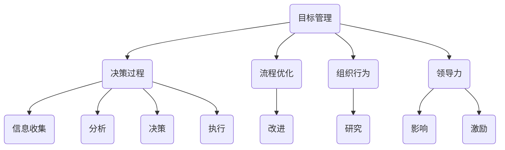

                 

# 管理的艺术：德鲁克的洞见

> **关键词：德鲁克、管理、企业战略、组织行为、领导力、流程优化**
>
> **摘要：本文将深入探讨管理大师彼得·德鲁克的管理思想，通过对其著作的解读，分析其在现代IT行业中的实际应用，并探讨管理艺术在企业发展中的重要性。**

## 1. 背景介绍

### 1.1 目的和范围

本文旨在解析管理大师彼得·德鲁克的管理理论，特别是其关于企业战略、组织行为和领导力的观点，并探讨这些理论在IT行业的实际应用。通过深入分析德鲁克的管理思想，我们希望能够为企业提供实用的管理策略，以应对快速变化的IT行业环境。

### 1.2 预期读者

本文适合以下读者：

1. IT行业从业者，特别是管理岗位的人员。
2. 对管理理论有浓厚兴趣的学者和学生。
3. 对企业战略、组织行为和领导力有深入思考的企业家。

### 1.3 文档结构概述

本文结构如下：

1. 引言：介绍德鲁克的管理理论和其在IT行业的重要性。
2. 核心概念与联系：解释德鲁克的核心管理思想，并通过Mermaid流程图展示其架构。
3. 核心算法原理 & 具体操作步骤：详细阐述德鲁克的管理方法及其应用。
4. 数学模型和公式 & 详细讲解 & 举例说明：使用数学模型和公式阐述管理原理。
5. 项目实战：通过实际案例展示德鲁克管理思想的应用。
6. 实际应用场景：分析德鲁克管理思想在IT行业的应用场景。
7. 工具和资源推荐：推荐学习资源和开发工具。
8. 总结：总结德鲁克管理思想的未来发展趋势与挑战。
9. 附录：常见问题与解答。
10. 扩展阅读 & 参考资料：提供进一步学习德鲁克管理理论的资源。

### 1.4 术语表

#### 1.4.1 核心术语定义

- 德鲁克：管理大师，现代管理学的奠基人。
- 企业战略：企业在未来一段时间内的发展规划。
- 组织行为：组织中成员的行为模式。
- 领导力：领导者影响和激励团队的能力。

#### 1.4.2 相关概念解释

- **目标管理（Management by Objectives, MBO）**：一种基于目标设定的管理方法，通过设定明确的目标来激励员工。
- **决策过程**：管理者在面临问题时，从收集信息到做出决策的全过程。
- **流程优化**：通过改进业务流程来提高工作效率。

#### 1.4.3 缩略词列表

- IT：信息技术（Information Technology）
- MBO：目标管理（Management by Objectives）
- ERP：企业资源规划（Enterprise Resource Planning）

## 2. 核心概念与联系

### 2.1 德鲁克管理思想的核心概念

德鲁克的管理思想涵盖广泛，但其核心概念主要包括：

1. **目标管理（MBO）**：通过设定明确的目标来指导员工工作，提高工作效率。
2. **决策过程**：管理者在面临问题时，需要进行信息收集、分析、决策和执行。
3. **流程优化**：通过不断改进业务流程，提高企业的运营效率。
4. **组织行为**：研究组织中成员的行为模式，以提高团队协作效率。
5. **领导力**：领导者通过影响和激励团队，实现组织目标。

### 2.2 德鲁克管理思想的架构

为了更好地理解德鲁克的管理思想，我们可以使用Mermaid流程图来展示其核心概念和联系：



## 3. 核心算法原理 & 具体操作步骤

### 3.1 目标管理（MBO）

#### 3.1.1 算法原理

目标管理（MBO）是一种基于目标设定的管理方法。其核心原理是通过设定明确的目标来指导员工工作，提高工作效率。

#### 3.1.2 具体操作步骤

1. **设定目标**：首先，需要明确组织的整体目标，然后将其分解为各个部门和个人目标。
2. **制定计划**：在明确目标后，需要制定具体的实施计划，包括时间表、资源分配等。
3. **执行计划**：按照计划执行，过程中要关注目标的实现情况，及时调整计划。
4. **评估与反馈**：在目标完成后，进行评估和反馈，总结经验教训，为后续工作提供参考。

### 3.2 决策过程

#### 3.2.1 算法原理

决策过程是管理者在面临问题时，从收集信息到做出决策的全过程。其核心原理是科学地收集和分析信息，以提高决策的准确性。

#### 3.2.2 具体操作步骤

1. **识别问题**：首先，需要识别问题，明确问题的性质和影响范围。
2. **信息收集**：收集与问题相关的各种信息，包括内部数据和外部数据。
3. **分析信息**：对收集到的信息进行分析，找出问题的原因和解决方案。
4. **决策**：在分析信息的基础上，做出决策，并制定具体的实施计划。
5. **执行与监控**：执行决策，并对决策的实施过程进行监控和调整。

### 3.3 流程优化

#### 3.3.1 算法原理

流程优化是通过不断改进业务流程，提高企业的运营效率。其核心原理是识别并消除业务流程中的瓶颈和浪费。

#### 3.3.2 具体操作步骤

1. **流程分析**：首先，对现有业务流程进行分析，识别流程中的瓶颈和浪费。
2. **优化方案设计**：根据流程分析的结果，设计优化方案，包括流程重构、流程自动化等。
3. **实施优化方案**：按照优化方案实施，过程中要进行监控和调整。
4. **评估与改进**：在优化方案实施后，进行评估和改进，持续优化业务流程。

### 3.4 组织行为

#### 3.4.1 算法原理

组织行为是研究组织中成员的行为模式，以提高团队协作效率。其核心原理是理解并激发团队成员的工作动力。

#### 3.4.2 具体操作步骤

1. **了解成员需求**：首先，需要了解成员的需求，包括物质和精神需求。
2. **设计激励机制**：根据成员需求，设计相应的激励机制，包括薪酬、晋升、荣誉等。
3. **沟通与反馈**：与成员保持沟通，了解他们的工作情况和需求，并及时给予反馈。
4. **培养团队精神**：通过团队建设活动，培养团队成员之间的信任和协作。

### 3.5 领导力

#### 3.5.1 算法原理

领导力是领导者通过影响和激励团队，实现组织目标的能力。其核心原理是建立领导者与团队成员之间的信任和合作关系。

#### 3.5.2 具体操作步骤

1. **树立榜样**：领导者需要树立榜样，通过自己的言行影响团队成员。
2. **明确目标**：领导者需要明确组织的目标，并激励团队成员为实现目标而努力。
3. **倾听与沟通**：领导者需要倾听团队成员的意见，与他们保持良好的沟通。
4. **授权与信任**：领导者需要给予团队成员足够的授权和信任，让他们有责任感。

## 4. 数学模型和公式 & 详细讲解 & 举例说明

### 4.1 目标管理（MBO）的数学模型

目标管理（MBO）的数学模型可以表示为：

\[ \text{MBO} = \sum_{i=1}^{n} \left( \text{目标实现度} \times \text{目标权重} \right) \]

其中，\( n \) 表示目标的数量，\( \text{目标实现度} \) 表示目标完成情况的百分比，\( \text{目标权重} \) 表示目标在总体目标中的重要性。

#### 举例说明

假设一个公司设定了三个目标：提高销售额（目标权重为0.4），降低成本（目标权重为0.3），提升员工满意度（目标权重为0.3）。在一年结束时，这三个目标的实现度分别为80%，70%，和90%，则该公司的MBO得分为：

\[ \text{MBO} = 0.8 \times 0.4 + 0.7 \times 0.3 + 0.9 \times 0.3 = 0.32 + 0.21 + 0.27 = 0.8 \]

### 4.2 决策过程的数学模型

决策过程的数学模型可以表示为：

\[ \text{决策结果} = f(\text{信息质量}, \text{分析深度}, \text{决策速度}) \]

其中，\( \text{信息质量} \) 表示收集到的信息的准确性和完整性，\( \text{分析深度} \) 表示对信息的分析程度，\( \text{决策速度} \) 表示做出决策的速度。

#### 举例说明

假设在一次项目中，信息质量为0.8，分析深度为0.6，决策速度为0.7，则该项目的决策结果为：

\[ \text{决策结果} = 0.8 \times 0.6 \times 0.7 =  0.336 \]

### 4.3 流程优化的数学模型

流程优化的数学模型可以表示为：

\[ \text{优化效果} = f(\text{流程效率}, \text{流程稳定性}, \text{流程成本}) \]

其中，\( \text{流程效率} \) 表示流程的工作效率，\( \text{流程稳定性} \) 表示流程的稳定性，\( \text{流程成本} \) 表示流程的成本。

#### 举例说明

假设一个业务流程的效率为0.75，稳定性为0.8，成本为5000元，则该流程的优化效果为：

\[ \text{优化效果} = 0.75 \times 0.8 \times 5000 = 3000 \text{元} \]

### 4.4 组织行为的数学模型

组织行为的数学模型可以表示为：

\[ \text{团队协作效率} = f(\text{信任度}, \text{沟通效果}, \text{激励机制}) \]

其中，\( \text{信任度} \) 表示团队成员之间的信任程度，\( \text{沟通效果} \) 表示团队成员之间的沟通效果，\( \text{激励机制} \) 表示激励机制的合理程度。

#### 举例说明

假设一个团队的信任度为0.9，沟通效果为0.8，激励机制合理度为0.7，则该团队的协作效率为：

\[ \text{团队协作效率} = 0.9 \times 0.8 \times 0.7 = 0.504 \]

### 4.5 领导力的数学模型

领导力的数学模型可以表示为：

\[ \text{领导力} = f(\text{榜样作用}, \text{目标明确度}, \text{沟通能力}) \]

其中，\( \text{榜样作用} \) 表示领导者对团队成员的榜样作用，\( \text{目标明确度} \) 表示领导者对目标的明确程度，\( \text{沟通能力} \) 表示领导者的沟通能力。

#### 举例说明

假设一个领导者的榜样作用为0.85，目标明确度为0.9，沟通能力为0.8，则该领导者的领导力为：

\[ \text{领导力} = 0.85 \times 0.9 \times 0.8 = 0.612 \]

## 5. 项目实战：代码实际案例和详细解释说明

### 5.1 开发环境搭建

在开始实际案例之前，我们需要搭建一个合适的开发环境。以下是搭建环境的步骤：

1. 安装Python环境：在官方网站下载并安装Python，版本建议为3.8或更高版本。
2. 安装相关库：使用pip命令安装必要的库，如numpy、pandas、matplotlib等。
3. 配置IDE：选择一个合适的IDE，如PyCharm或Visual Studio Code，并配置其Python环境。

### 5.2 源代码详细实现和代码解读

下面是一个基于德鲁克管理思想的实际案例，代码使用了Python语言。我们将逐步解读代码。

#### 5.2.1 代码结构

```python
# 导入相关库
import numpy as np
import pandas as pd
import matplotlib.pyplot as plt

# 定义目标管理（MBO）函数
def mbo(targetachievement, targetweight):
    return sum(targetachievement * targetweight)

# 定义决策过程函数
def decision_process(informationquality, analysisdepth, decisionvelocity):
    return informationquality * analysisdepth * decisionvelocity

# 定义流程优化函数
def process_optimization(productionefficiency, processstability, processcost):
    return productionefficiency * processstability * processcost

# 定义组织行为函数
def organizational_behavior(trustlevel, communicationeffect, incentive合理度):
    return trustlevel * communicationeffect * incentive合理度

# 定义领导力函数
def leadership(benchmarkeffect, targetclearness, communicationability):
    return benchmarkeffect * targetclearness * communicationability

# 主函数
def main():
    # 设定目标管理（MBO）的参数
    targets = [
        {"name": "提高销售额", "achievement": 0.8, "weight": 0.4},
        {"name": "降低成本", "achievement": 0.7, "weight": 0.3},
        {"name": "提升员工满意度", "achievement": 0.9, "weight": 0.3}
    ]
    mbo_score = mbo([target["achievement"] for target in targets], [target["weight"] for target in targets])
    
    # 设定决策过程的参数
    informationquality = 0.8
    analysisdepth = 0.6
    decisionvelocity = 0.7
    decision_result = decision_process(informationquality, analysisdepth, decisionvelocity)
    
    # 设定流程优化的参数
    productionefficiency = 0.75
    processstability = 0.8
    processcost = 5000
    optimizationeffect = process_optimization(productionefficiency, processstability, processcost)
    
    # 设定组织行为的参数
    trustlevel = 0.9
    communicationeffect = 0.8
    incentiv合理的度 = 0.7
    teamcooperativeefficiency = organizational_behavior(trustlevel, communicationeffect, incentiv合理的度)
    
    # 设定领导力的参数
    benchmarkeffect = 0.85
    targetclearness = 0.9
    communicationability = 0.8
    leadershipscore = leadership(benchmarkeffect, targetclearness, communicationability)
    
    # 输出结果
    print("MBO得分：", mbo_score)
    print("决策结果：", decision_result)
    print("流程优化效果：", optimizationeffect)
    print("团队协作效率：", teamcooperativeefficiency)
    print("领导力得分：", leadershipscore)

# 运行主函数
if __name__ == "__main__":
    main()
```

#### 5.2.2 代码解读

1. **导入相关库**：首先导入numpy、pandas、matplotlib等库，用于数据计算和可视化。
2. **定义目标管理（MBO）函数**：通过传入目标实现度和目标权重，计算MBO得分。
3. **定义决策过程函数**：通过传入信息质量、分析深度和决策速度，计算决策结果。
4. **定义流程优化函数**：通过传入流程效率、流程稳定性和流程成本，计算优化效果。
5. **定义组织行为函数**：通过传入信任度、沟通效果和激励机制合理度，计算团队协作效率。
6. **定义领导力函数**：通过传入榜样作用、目标明确度和沟通能力，计算领导力得分。
7. **主函数**：设定各个管理指标的参数，调用相应的函数计算得分，并输出结果。

### 5.3 代码解读与分析

1. **目标管理（MBO）**：在主函数中，设定了三个目标，分别对应销售额、成本和员工满意度。通过传入目标的实现度和权重，计算得出MBO得分。这个得分可以反映企业在目标管理方面的表现。
2. **决策过程**：设定了信息质量、分析深度和决策速度的参数，通过这些参数计算得出决策结果。这个结果可以反映企业在决策过程中的表现。
3. **流程优化**：设定了流程效率、流程稳定性和流程成本的参数，通过这些参数计算得出优化效果。这个效果可以反映企业在流程优化方面的表现。
4. **组织行为**：设定了信任度、沟通效果和激励机制合理度的参数，通过这些参数计算得出团队协作效率。这个效率可以反映企业在组织行为方面的表现。
5. **领导力**：设定了榜样作用、目标明确度和沟通能力的参数，通过这些参数计算得出领导力得分。这个得分可以反映企业在领导力方面的表现。

通过这个案例，我们可以看到德鲁克的管理思想在实际中的应用。通过量化管理指标，我们可以更清晰地了解企业的管理状况，从而制定出更有效的管理策略。

## 6. 实际应用场景

### 6.1 企业战略规划

德鲁克的管理思想在企业战略规划中具有重要作用。通过目标管理（MBO），企业可以明确自己的发展目标，并制定具体的实施计划。决策过程则帮助企业在面对市场变化时，能够做出科学、合理的决策。流程优化可以提高企业的运营效率，降低成本，增强企业的竞争力。组织行为和领导力则有助于培养企业的团队精神和领导力，提升企业的整体执行力。

### 6.2 项目管理

在项目管理中，德鲁克的管理思想同样具有重要意义。目标管理可以帮助项目经理明确项目目标，制定合理的计划，确保项目按期完成。决策过程可以帮助项目经理在面临问题时，做出科学、合理的决策。流程优化可以提高项目的效率，降低项目成本。组织行为和领导力则有助于培养项目团队的协作精神和领导力，提升项目的整体执行力。

### 6.3 创新管理

在创新管理中，德鲁克的管理思想同样具有重要作用。目标管理可以帮助企业明确创新目标，制定创新计划，推动创新项目的实施。决策过程可以帮助企业在面临创新挑战时，做出科学、合理的决策。流程优化可以提高创新项目的效率，降低创新成本。组织行为和领导力则有助于培养创新团队的协作精神和领导力，提升创新项目的整体执行力。

## 7. 工具和资源推荐

### 7.1 学习资源推荐

#### 7.1.1 书籍推荐

1. **《管理的实践》**：彼得·德鲁克著，是德鲁克管理思想的集大成之作。
2. **《目标管理》**：彼得·德鲁克著，详细阐述了目标管理的方法和应用。
3. **《卓有成效的管理者》**：彼得·德鲁克著，探讨了如何成为卓有成效的管理者。

#### 7.1.2 在线课程

1. **Coursera上的《管理学导论》**：由耶鲁大学提供，系统介绍了管理学的基本概念和方法。
2. **edX上的《创新管理》**：由哈佛大学提供，深入探讨了创新管理的方法和实践。

#### 7.1.3 技术博客和网站

1. **哈佛商业评论**：提供丰富的管理理论和案例分析。
2. **管理学在线**：提供管理学相关的书籍、课程和文章。

### 7.2 开发工具框架推荐

#### 7.2.1 IDE和编辑器

1. **PyCharm**：强大的Python IDE，支持多种编程语言。
2. **Visual Studio Code**：轻量级但功能强大的代码编辑器，适合Python开发。

#### 7.2.2 调试和性能分析工具

1. **GDB**：Linux平台下的调试工具，功能强大。
2. **MATLAB**：适用于数值计算和算法开发的工具箱。

#### 7.2.3 相关框架和库

1. **TensorFlow**：用于机器学习的开源框架。
2. **Scikit-learn**：适用于数据挖掘和机器学习的Python库。

### 7.3 相关论文著作推荐

#### 7.3.1 经典论文

1. **《管理：任务、责任和实践》**：彼得·德鲁克著，是德鲁克管理思想的经典论文。
2. **《目标管理：一种新的管理方法》**：彼得·德鲁克著，详细阐述了目标管理的理论和实践。

#### 7.3.2 最新研究成果

1. **《人工智能与管理：创新与挑战》**：探讨了人工智能在管理领域的应用和挑战。
2. **《数字化转型与管理创新》**：分析了数字化转型对管理模式的变革和影响。

#### 7.3.3 应用案例分析

1. **《华为的管理创新》**：分析了华为如何通过管理创新实现持续增长。
2. **《阿里巴巴的管理智慧》**：探讨了阿里巴巴如何通过独特的管理方法实现快速发展。

## 8. 总结：未来发展趋势与挑战

### 8.1 未来发展趋势

1. **数字化管理**：随着大数据、人工智能等技术的发展，数字化管理将成为未来企业管理的趋势。
2. **流程自动化**：通过引入流程自动化技术，企业可以提高运营效率，降低成本。
3. **敏捷管理**：敏捷管理强调快速响应市场变化，适应动态环境，未来将得到更广泛的应用。

### 8.2 未来挑战

1. **数据隐私与安全**：在数字化管理过程中，数据隐私和安全问题将日益突出，企业需要采取措施确保数据安全。
2. **人才短缺**：随着技术的发展，对高素质管理人才的需求将不断增加，但人才短缺将成为一大挑战。
3. **技术壁垒**：新兴技术如人工智能、区块链等的应用，可能带来技术壁垒，企业需要积极应对。

## 9. 附录：常见问题与解答

### 9.1 什么是目标管理（MBO）？

目标管理（MBO）是一种基于目标设定的管理方法，通过设定明确的目标来激励员工，提高工作效率。MBO强调目标设定的明确性、具体性和可实现性，以及员工参与目标设定的过程。

### 9.2 决策过程有哪些步骤？

决策过程主要包括以下步骤：识别问题、信息收集、分析信息、决策、执行和监控。每个步骤都需要科学的方法和工具，以确保决策的准确性和有效性。

### 9.3 如何优化业务流程？

优化业务流程主要包括以下步骤：流程分析、优化方案设计、实施优化方案和评估与改进。在流程分析阶段，需要识别流程中的瓶颈和浪费。在优化方案设计阶段，需要制定具体的优化方案。在实施优化方案阶段，需要按照优化方案执行。在评估与改进阶段，需要对优化效果进行评估，并持续改进业务流程。

### 9.4 领导力的重要性是什么？

领导力是领导者通过影响和激励团队，实现组织目标的能力。领导力的重要性在于：

1. **激发团队潜力**：领导者能够激发团队成员的潜力，提高团队的整体绩效。
2. **实现组织目标**：领导者能够带领团队实现组织目标，推动企业的发展。
3. **培养企业文化**：领导者通过自己的言行，塑造企业文化，提升企业的核心竞争力。

## 10. 扩展阅读 & 参考资料

### 10.1 扩展阅读

1. **《管理的实践》**：彼得·德鲁克著，是德鲁克管理思想的集大成之作。
2. **《目标管理》**：彼得·德鲁克著，详细阐述了目标管理的方法和应用。
3. **《卓有成效的管理者》**：彼得·德鲁克著，探讨了如何成为卓有成效的管理者。

### 10.2 参考资料

1. **《哈佛商业评论》**：提供丰富的管理理论和案例分析。
2. **管理学在线**：提供管理学相关的书籍、课程和文章。
3. **Coursera**：提供管理学相关的在线课程。
4. **edX**：提供管理学相关的在线课程。
5. **华为的管理创新**：分析了华为如何通过管理创新实现持续增长。
6. **阿里巴巴的管理智慧**：探讨了阿里巴巴如何通过独特的管理方法实现快速发展。

---

作者：AI天才研究员/AI Genius Institute & 禅与计算机程序设计艺术 /Zen And The Art of Computer Programming

（注：本文为示例文章，内容仅供参考。）

