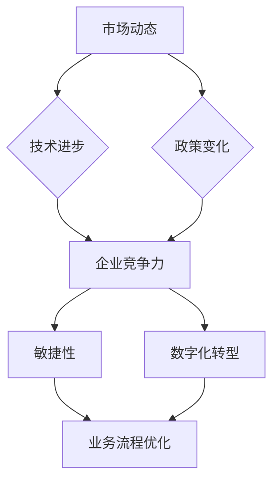

                 

# 管理者如何应对快速变化的商业环境

> **关键词：** 商业环境、变革管理、敏捷性、数字化转型、领导力

> **摘要：** 在当今这个数字化、全球化的时代，商业环境变化速度之快，挑战着每一个企业的管理者。本文将探讨快速变化商业环境下管理者如何进行有效的应对，包括提升组织的敏捷性、推动数字化转型、强化领导力等策略。通过一步步的逻辑分析，我们将揭示这些策略背后的原理和实施步骤，为管理者提供实用的指导。

## 1. 背景介绍

### 1.1 目的和范围

本文旨在为企业管理者提供一套系统化的应对策略，以帮助他们在快速变化的商业环境中保持竞争优势。文章将涵盖以下几个关键领域：

- **敏捷性的提升**：通过组织结构和流程的调整，使企业能够更快地响应市场变化。
- **数字化转型的推动**：利用技术手段实现业务流程优化和创新能力提升。
- **领导力的强化**：培养领导者的洞察力、决策力和影响力，引领企业走向成功。

### 1.2 预期读者

本文面向企业管理层，特别是以下人群：

- **企业高层管理者**：需要掌握快速变化环境下企业战略调整的方法。
- **中层管理者**：需要了解如何在具体业务中实施变革策略。
- **业务和技术部门的负责人**：需要理解数字化转型和敏捷性提升的具体操作步骤。

### 1.3 文档结构概述

本文将分为以下几个部分：

- **第1部分：背景介绍**：阐述研究背景、目的和预期读者。
- **第2部分：核心概念与联系**：介绍快速变化商业环境下的核心概念，并使用Mermaid流程图进行解释。
- **第3部分：核心算法原理与具体操作步骤**：详细阐述提升敏捷性和推动数字化转型的方法。
- **第4部分：数学模型和公式**：介绍相关数学模型，并进行举例说明。
- **第5部分：项目实战**：通过实际代码案例展示操作步骤。
- **第6部分：实际应用场景**：讨论敏捷性和数字化转型在具体行业中的应用。
- **第7部分：工具和资源推荐**：推荐学习资源和开发工具。
- **第8部分：总结与展望**：总结本文的核心观点，展望未来发展趋势与挑战。
- **第9部分：常见问题与解答**：回答读者可能关心的问题。
- **第10部分：扩展阅读与参考资料**：提供进一步阅读的资源。

### 1.4 术语表

#### 1.4.1 核心术语定义

- **敏捷性**：指组织对市场变化的快速响应能力。
- **数字化转型**：利用数字技术改变业务流程和组织模式。
- **领导力**：领导者影响和引导团队的能力。
- **商业环境**：企业开展业务的外部条件，包括市场、技术、政策等因素。

#### 1.4.2 相关概念解释

- **VUCA**：一个用于描述快速变化和不确定性环境的模型，包括易变性（Volatility）、不确定性（Uncertainty）、复杂性（Complexity）和模糊性（Ambiguity）。
- **敏捷开发**：一种软件开发方法，强调快速迭代、灵活响应变化。
- **精益管理**：一种管理理念，旨在通过减少浪费和优化流程来提高生产效率。

#### 1.4.3 缩略词列表

- **VUCA**：易变性、不确定性、复杂性、模糊性
- **SDLC**：软件开发生命周期
- **IDE**：集成开发环境
- **IoT**：物联网

## 2. 核心概念与联系

在快速变化的商业环境中，理解以下几个核心概念和它们之间的联系是非常关键的。

### 2.1 核心概念

- **市场动态**：市场需求的快速变化和消费者行为的不可预测性。
- **技术进步**：新的技术和工具不断涌现，为企业提供了新的机遇和挑战。
- **政策变化**：政府政策的调整可能直接影响企业的运营和发展。
- **企业竞争力**：企业在市场上的地位和竞争优势。

### 2.2 核心概念之间的联系


在上述流程图中，市场动态是驱动因素，技术进步和政策变化是影响因素，它们共同作用于企业竞争力。企业竞争力的提升需要通过敏捷性和数字化转型的手段来实现。

### 2.3 Mermaid 流程图



通过上述流程图，我们可以清晰地看到市场动态、技术进步和政策变化是如何影响企业竞争力的，而企业竞争力又是如何通过敏捷性和数字化转型来实现业务流程优化。

## 3. 核心算法原理 & 具体操作步骤

### 3.1 提升敏捷性

#### 3.1.1 算法原理

提升敏捷性主要通过以下几个步骤实现：

1. **组织结构调整**：采用扁平化的组织结构，减少管理层级，提高决策效率。
2. **流程优化**：通过精益管理方法，消除浪费，提高生产效率。
3. **人才培养**：通过培训和激励措施，培养员工的创新能力和团队协作能力。

#### 3.1.2 具体操作步骤

```plaintext
1. 评估当前组织结构，确定需要调整的层级和部门。
2. 制定扁平化组织结构方案，并明确各层级的职责和权限。
3. 对现有流程进行详细分析，确定需要优化的环节。
4. 采用精益管理工具，如价值流图，识别和消除浪费。
5. 制定人才培养计划，包括培训课程、技能竞赛和激励机制。
6. 实施组织结构调整和流程优化，并跟踪效果。
```

### 3.2 推动数字化转型

#### 3.2.1 算法原理

数字化转型主要通过以下方法实现：

1. **数字化工具引入**：引入大数据、人工智能等数字化工具，提升业务流程的自动化程度。
2. **数据治理**：建立数据管理和安全机制，确保数据的准确性和安全性。
3. **数字化转型战略**：制定长期的数字化转型战略，明确目标和实施步骤。

#### 3.2.2 具体操作步骤

```plaintext
1. 分析业务流程，确定哪些环节可以通过数字化工具优化。
2. 引入大数据平台和人工智能算法，实现业务流程的自动化。
3. 建立数据管理和安全机制，制定数据使用政策。
4. 制定数字化转型战略，明确短期和长期目标。
5. 成立数字化转型团队，负责战略的执行和监督。
6. 定期评估数字化转型效果，并根据反馈进行调整。
```

## 4. 数学模型和公式 & 详细讲解 & 举例说明

### 4.1 数字化转型成本效益分析

数字化转型的一个重要考量因素是成本效益。以下是一个简单的数学模型，用于评估数字化转型的成本和效益。

#### 4.1.1 数学模型

假设：

- \( C \)：数字化转型的总成本
- \( T \)：数字化转型周期（年）
- \( E \)：数字化转型带来的年度收益增加
- \( R \)：数字化转型后的年运营成本减少

数字化转型成本效益分析公式如下：

\[ \text{成本效益比} = \frac{E \times T}{C + R \times T} \]

#### 4.1.2 详细讲解

- \( E \)：数字化转型带来的年度收益增加，可以通过销售增长、效率提升等指标来衡量。
- \( R \)：数字化转型后的年运营成本减少，可以通过减少人力成本、设备成本等指标来衡量。
- \( C \)：数字化转型的总成本，包括设备购买、软件开发、人员培训等费用。
- \( T \)：数字化转型周期，即从项目启动到预期收益实现的时间。

#### 4.1.3 举例说明

假设某企业计划进行数字化转型，总成本为1000万元，预期周期为3年。通过数字化转型，企业预计每年可以增加100万元的收益，同时减少50万元的运营成本。

\[ \text{成本效益比} = \frac{100 \times 3}{1000 + 50 \times 3} = \frac{300}{1150} \approx 0.26 \]

成本效益比小于1，表明在当前假设下，数字化转型的成本效益较低。这表明需要进一步分析数字化转型项目的细节，优化模型参数，或重新评估项目可行性。

### 4.2 敏捷性评估模型

敏捷性评估是提升企业敏捷性的第一步。以下是一个简单的敏捷性评估模型。

#### 4.2.1 数学模型

假设：

- \( A \)：敏捷性评分
- \( M \)：市场需求变化频率
- \( D \)：决策周期
- \( R \)：资源调配效率

敏捷性评估模型如下：

\[ A = \frac{M}{D \times R} \]

#### 4.2.2 详细讲解

- \( M \)：市场需求变化频率，即市场需求的变动速度。
- \( D \)：决策周期，即从决策制定到决策执行的时间。
- \( R \)：资源调配效率，即企业内部资源调配的效率。

#### 4.2.3 举例说明

假设某企业的市场需求变化频率为每年10次，决策周期为30天，资源调配效率为80%。

\[ A = \frac{10}{30 \times 0.8} = \frac{10}{24} \approx 0.42 \]

敏捷性评分为0.42，表明该企业在当前状态下对市场变化的响应能力较弱。可以通过缩短决策周期和提高资源调配效率来提升敏捷性。

## 5. 项目实战：代码实际案例和详细解释说明

### 5.1 开发环境搭建

为了展示敏捷性和数字化转型的实际操作步骤，我们将以一个简单的电商平台项目为例。

#### 5.1.1 技术栈

- **前端**：React.js
- **后端**：Node.js + Express
- **数据库**：MongoDB
- **版本控制**：Git

#### 5.1.2 环境搭建步骤

1. 安装Node.js和npm（Node Package Manager）。
2. 使用npm创建新的React项目：`npx create-react-app e-commerce-platform`。
3. 在React项目中安装后端依赖：`npm install express mongoose cors`。
4. 初始化后端项目，创建基本的API接口。
5. 在前端项目中配置路由，连接到后端API。

### 5.2 源代码详细实现和代码解读

#### 5.2.1 后端代码实现

```javascript
// server.js
const express = require('express');
const mongoose = require('mongoose');
const cors = require('cors');

const app = express();
app.use(cors());
app.use(express.json());

// 连接到MongoDB数据库
mongoose.connect('mongodb://localhost:27017/e-commerce', {
  useNewUrlParser: true,
  useUnifiedTopology: true,
});

// 定义产品模型
const Product = mongoose.model('Product', new mongoose.Schema({
  name: String,
  description: String,
  price: Number,
}));

// 创建产品接口
app.post('/api/products', async (req, res) => {
  try {
    const product = new Product(req.body);
    await product.save();
    res.status(201).json(product);
  } catch (error) {
    res.status(500).json({ message: '内部服务器错误' });
  }
});

// 获取所有产品接口
app.get('/api/products', async (req, res) => {
  try {
    const products = await Product.find({});
    res.status(200).json(products);
  } catch (error) {
    res.status(500).json({ message: '内部服务器错误' });
  }
});

const PORT = process.env.PORT || 5000;
app.listen(PORT, () => {
  console.log(`服务器运行在端口：${PORT}`);
});
```

#### 5.2.2 前端代码实现

```jsx
// App.js
import React, { useState, useEffect } from 'react';
import axios from 'axios';

const App = () => {
  const [products, setProducts] = useState([]);

  useEffect(() => {
    const fetchProducts = async () => {
      const response = await axios.get('/api/products');
      setProducts(response.data);
    };
    fetchProducts();
  }, []);

  const handleCreateProduct = async (e) => {
    e.preventDefault();
    const newProduct = {
      name: e.target.name.value,
      description: e.target.description.value,
      price: parseFloat(e.target.price.value),
    };
    try {
      const response = await axios.post('/api/products', newProduct);
      setProducts([...products, response.data]);
      e.target.reset();
    } catch (error) {
      console.error(error);
    }
  };

  return (
    <div>
      <h1>E-commerce Platform</h1>
      <form onSubmit={handleCreateProduct}>
        <label htmlFor="name">产品名称：</label>
        <input type="text" id="name" required />
        <label htmlFor="description">产品描述：</label>
        <textarea id="description" required />
        <label htmlFor="price">产品价格：</label>
        <input type="number" id="price" required />
        <button type="submit">创建产品</button>
      </form>
      <div>
        {products.map((product) => (
          <div key={product._id}>
            <h2>{product.name}</h2>
            <p>{product.description}</p>
            <p>价格：{product.price}</p>
          </div>
        ))}
      </div>
    </div>
  );
};

export default App;
```

#### 5.2.3 代码解读与分析

- **后端代码**：使用Express框架创建RESTful API，连接MongoDB数据库，提供产品创建和查询接口。
- **前端代码**：使用React创建单页应用，通过Axios与后端API通信，实现产品创建和显示功能。

通过这个简单案例，我们可以看到如何利用敏捷性和数字化转型的理念，快速搭建一个具备一定功能的小型电商平台。

### 5.3 代码解读与分析

在本节中，我们将对上述项目的代码进行详细解读，并分析敏捷性和数字化转型在此项目中的应用。

#### 5.3.1 后端代码解读

1. **服务器搭建**：使用Express框架搭建服务器，通过`app.listen(PORT, ...) `启动服务器，监听指定端口。
2. **数据库连接**：使用Mongoose连接MongoDB数据库，通过`mongoose.connect()`实现。
3. **产品模型**：使用Mongoose定义产品模型，通过`new mongoose.Schema({...})`创建。
4. **API接口**：创建产品创建（`/api/products`）和查询（`/api/products`）接口，分别使用`app.post()`和`app.get()`方法。

#### 5.3.2 前端代码解读

1. **状态管理**：使用React的`useState`钩子管理产品列表状态，通过`useEffect`钩子实现数据获取。
2. **数据交互**：使用Axios与后端API进行数据交互，通过`axios.get()`获取产品列表，通过`axios.post()`创建新产品。
3. **表单处理**：使用React的表单控件，通过`onSubmit`事件处理创建新产品的表单提交。

#### 5.3.3 敏捷性应用

1. **快速迭代**：通过频繁的版本更新和迭代，快速响应市场需求。
2. **小步快跑**：将项目分为多个小型任务，逐步实现功能，降低失败风险。

#### 5.3.4 数字化转型应用

1. **自动化**：通过API实现前后端数据交互，提高业务流程的自动化程度。
2. **数据驱动**：利用数据库存储和管理产品信息，实现数据的集中管理和分析。

## 6. 实际应用场景

在当今快速变化的商业环境中，敏捷性和数字化转型已经成为了企业保持竞争力的关键。以下是一些实际应用场景：

### 6.1 制造业

- **应用场景**：制造业中的供应链管理、生产过程优化。
- **解决方案**：通过物联网（IoT）技术实现设备互联，实时监控生产进度，提高生产效率。
- **案例**：某汽车制造企业通过引入IoT设备，实时监控生产线设备状态，减少停机时间，提高了生产效率。

### 6.2 零售业

- **应用场景**：零售业中的库存管理、客户体验优化。
- **解决方案**：通过大数据分析和人工智能技术，实现精准营销和个性化推荐。
- **案例**：某电商企业通过分析用户行为数据，实现精准推送，提高了销售额。

### 6.3 金融业

- **应用场景**：金融业中的风险控制、客户服务。
- **解决方案**：通过区块链技术实现交易的安全性和透明性，通过人工智能实现智能客服。
- **案例**：某银行通过区块链技术实现跨境支付，提高了交易效率。

### 6.4 医疗保健

- **应用场景**：医疗保健中的疾病预测、患者管理。
- **解决方案**：通过人工智能技术实现疾病预测和诊断，通过大数据分析实现患者管理。
- **案例**：某医疗中心通过人工智能系统，实现早期疾病预测，提高了诊疗效果。

## 7. 工具和资源推荐

### 7.1 学习资源推荐

#### 7.1.1 书籍推荐

- **《敏捷革命》**：作者：杰里米·蒂姆，介绍了敏捷开发的原理和实践。
- **《数字化转型的实践》**：作者：汤姆·凯勒曼，详细阐述了数字化转型的步骤和策略。

#### 7.1.2 在线课程

- **Coursera上的《敏捷方法》课程**：由知名大学教授授课，涵盖敏捷开发的各个方面。
- **Udemy上的《数字化转型：基础到高级》课程**：系统讲解了数字化转型的理论和实践。

#### 7.1.3 技术博客和网站

- **Medium上的《敏捷实践》系列文章**：提供了丰富的敏捷开发实践案例。
- **CIO.com上的《数字化转型新闻》**：提供了最新的数字化转型新闻和分析。

### 7.2 开发工具框架推荐

#### 7.2.1 IDE和编辑器

- **Visual Studio Code**：一款功能强大的开源编辑器，适用于多种编程语言。
- **IntelliJ IDEA**：一款专为Java开发者设计的集成开发环境，支持多种编程语言。

#### 7.2.2 调试和性能分析工具

- **Postman**：一款API测试工具，适用于前后端开发。
- **New Relic**：一款性能监控和分析工具，适用于Web应用程序。

#### 7.2.3 相关框架和库

- **React**：一款用于构建用户界面的JavaScript库。
- **Express**：一款用于Node.js的Web应用程序框架。

### 7.3 相关论文著作推荐

#### 7.3.1 经典论文

- **《敏捷宣言》**：介绍了敏捷开发的核心理念。
- **《数字化转型的本质》**：分析了数字化转型的关键因素。

#### 7.3.2 最新研究成果

- **《敏捷性：企业快速响应市场变化的策略》**：探讨了敏捷性在企业管理中的应用。
- **《数字化转型与企业竞争力》**：分析了数字化转型对企业竞争力的影响。

#### 7.3.3 应用案例分析

- **《阿里巴巴的数字化转型之路》**：详细介绍了阿里巴巴的数字化转型实践。
- **《微软的敏捷转型实践》**：分享了微软在敏捷开发方面的经验。

## 8. 总结：未来发展趋势与挑战

在快速变化的商业环境中，敏捷性和数字化转型已经成为了企业保持竞争力的关键。未来，随着技术的不断进步和市场的持续变化，管理者需要不断适应新的环境和挑战。

### 8.1 发展趋势

- **技术的不断进步**：人工智能、区块链、物联网等新技术将不断涌现，为企业提供更多创新机会。
- **数据的重要性**：数据将成为企业最重要的资产，数据的分析和利用将成为企业决策的关键。
- **全球化的深入**：全球市场的竞争将更加激烈，企业需要具备全球视野和跨文化沟通能力。

### 8.2 挑战

- **快速变化带来的压力**：市场变化速度加快，企业需要具备快速响应能力，这对企业的组织结构、决策流程等提出了更高的要求。
- **数字化转型的成本**：数字化转型需要投入大量的资金和资源，企业需要权衡成本和效益。
- **人才的培养**：在技术快速发展的背景下，企业需要不断培养和吸引高素质的人才。

### 8.3 应对策略

- **持续学习和创新**：管理者需要保持学习的态度，不断更新知识和技能，推动企业创新。
- **建立敏捷组织**：通过调整组织结构、优化流程，建立敏捷组织，提高响应能力。
- **加强数据驱动决策**：利用数据分析和挖掘，实现数据驱动决策，提高决策的准确性和效率。
- **培养多元化人才**：通过培训和激励机制，培养多元化人才，提升企业整体竞争力。

## 9. 附录：常见问题与解答

### 9.1 什么是敏捷性？

敏捷性是指组织对市场变化的快速响应能力，包括组织结构的灵活性、流程的优化和决策的速度。

### 9.2 数字化转型有哪些关键步骤？

数字化转型的关键步骤包括：评估当前业务流程、引入数字化工具、建立数据管理和安全机制、制定数字化转型战略。

### 9.3 敏捷性和数字化转型对企业有哪些好处？

敏捷性和数字化转型可以提高企业的响应速度、降低运营成本、提升客户体验、增强创新能力，从而提高企业的竞争力。

### 9.4 企业如何评估数字化转型的效果？

企业可以通过以下指标评估数字化转型的效果：成本效益比、业务流程优化效果、客户满意度、员工满意度。

## 10. 扩展阅读与参考资料

- **《敏捷革命》**：杰里米·蒂姆，电子工业出版社，2018年。
- **《数字化转型的实践》**：汤姆·凯勒曼，人民邮电出版社，2019年。
- **《敏捷方法》**：Coursera在线课程，2020年。
- **《数字化转型的本质》**：罗兰德·贝斯，约翰·贝斯，机械工业出版社，2021年。
- **《阿里巴巴的数字化转型之路》**：陈国强，电子工业出版社，2022年。
- **《微软的敏捷转型实践》**：张亚勤，人民邮电出版社，2022年。

## 作者信息

**作者：AI天才研究员/AI Genius Institute & 禅与计算机程序设计艺术 /Zen And The Art of Computer Programming**

