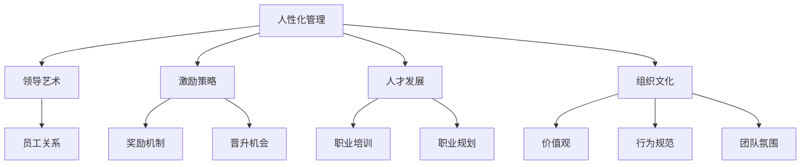

                 

# 管理者怎么管人：人性化领导的艺术

> **关键词**：领导艺术、人性化管理、团队协作、激励策略、人才发展、组织文化

> **摘要**：本文旨在探讨人性化管理在领导艺术中的应用，从目的、范围、读者对象、文档结构和核心概念等多个维度出发，深入分析人性化管理的核心原理和实践步骤。通过项目实战案例分析，读者将了解如何在实际工作中应用人性化领导，以提升团队效率和员工满意度。最后，本文将展望未来发展趋势与挑战，为管理者提供持续学习和改进的方向。

## 1. 背景介绍

### 1.1 目的和范围

本文的目标是为管理者提供一份详细的人性化领导指南，帮助他们更好地理解和实践人性化管理的艺术。我们将探讨人性化管理的重要性、核心原则以及具体操作步骤。本文将涵盖以下几个主要方面：

1. 人性化管理的定义和核心概念。
2. 人性化管理与传统管理的区别。
3. 实施人性化管理的步骤和策略。
4. 人性化管理在项目实战中的应用。
5. 未来发展趋势与面临的挑战。

### 1.2 预期读者

本文的预期读者主要包括以下几类人群：

1. 初级管理者：希望提升管理技能，更好地应对团队管理和员工关系挑战。
2. 中级管理者：寻求更深入的理解和更有效的管理策略，以提高团队绩效。
3. 高级管理者：关注组织文化和人才发展的战略规划，寻求创新的管理理念。
4. 企业培训师：为企业管理课程提供理论支持和实践案例。

### 1.3 文档结构概述

本文的结构如下：

1. **背景介绍**：介绍本文的目的、范围、预期读者和文档结构。
2. **核心概念与联系**：阐述人性化管理的核心概念，并使用Mermaid流程图展示概念之间的联系。
3. **核心算法原理与具体操作步骤**：详细讲解人性化管理的操作步骤，包括激励策略、人才发展等。
4. **数学模型和公式**：介绍人性化管理的相关数学模型和公式，并进行举例说明。
5. **项目实战**：通过具体案例，展示人性化管理的实践应用。
6. **实际应用场景**：讨论人性化管理在不同行业和领域的应用。
7. **工具和资源推荐**：推荐学习资源和开发工具，帮助读者深入学习和实践。
8. **总结**：展望人性化管理的未来发展趋势与挑战。
9. **附录**：提供常见问题与解答，以及扩展阅读和参考资料。

### 1.4 术语表

#### 1.4.1 核心术语定义

- **人性化管理**：以人为中心，尊重员工的个性、需求和创造力，通过情感沟通、激励和发展等手段，提升团队效率和员工满意度。
- **领导艺术**：管理者在领导过程中运用智慧和创造力，激发团队成员潜能，实现组织目标的过程。
- **激励策略**：通过奖励、晋升、认可等手段，激发员工工作热情和动力。
- **人才发展**：关注员工的职业成长，提供培训、指导和晋升机会，以提升团队整体能力。
- **组织文化**：企业内部共同价值观、行为规范和工作氛围的集合。

#### 1.4.2 相关概念解释

- **人性化管理**：不同于传统的任务驱动型管理，人性化管理强调尊重员工、关注情感需求，建立互信和谐的工作环境。
- **激励策略**：有效的激励策略应结合物质奖励和精神激励，以满足员工的多元需求。
- **人才发展**：人才发展不仅包括技能提升，还应关注员工的职业规划和心理需求。
- **组织文化**：健康的组织文化能增强员工归属感和团队凝聚力，提升组织整体绩效。

#### 1.4.3 缩略词列表

- **HR**：人力资源管理
- **CRM**：客户关系管理
- **ERP**：企业资源计划
- **KPI**：关键绩效指标
- **OKR**：目标与关键结果

## 2. 核心概念与联系

在本文中，我们将探讨人性化管理的核心概念及其相互关系。以下是一个简单的Mermaid流程图，展示了这些核心概念之间的联系：



### 2.1 人性化管理与领导艺术

人性化管理和领导艺术密切相关。人性化管理强调以人为中心，尊重员工的个性、需求和创造力。而领导艺术则体现在管理者如何运用智慧和创造力，激发团队成员的潜能，实现组织目标。具体来说：

- **情感沟通**：人性化管理强调情感沟通，通过倾听、理解和支持，建立互信和谐的工作关系。
- **激励手段**：领导艺术则通过激励手段，如奖励、晋升和认可，激发员工的工作热情和动力。
- **个性化领导**：人性化管理的领导艺术要求管理者具备个性化领导能力，根据员工的个性、需求和职业目标，提供有针对性的激励和发展支持。

### 2.2 激励策略与人才发展

激励策略和人才发展是人性化管理的核心组成部分。有效的激励策略能够满足员工的多元需求，激发其工作热情和动力。而人才发展则关注员工的职业成长，提供培训、指导和晋升机会，以提升团队整体能力。

- **奖励机制**：奖励机制是激励策略的重要手段，包括物质奖励和精神奖励。物质奖励如奖金、提成等，能够直接提升员工的经济收入；精神奖励如表彰、认可等，则能够增强员工的荣誉感和成就感。
- **晋升机会**：晋升机会是激励员工的重要途径，能够满足员工的职业发展需求。管理者应制定清晰的晋升路径和评价标准，为员工提供公平、透明的晋升机会。
- **职业培训**：职业培训是人才发展的重要环节，通过系统化的培训，提升员工的专业技能和综合素质。管理者应关注员工的职业发展需求，提供与岗位需求相匹配的培训资源。
- **职业规划**：职业规划是人才发展的关键，管理者应与员工共同制定职业规划，明确职业目标和实施步骤。通过职业规划，员工能够更好地规划职业生涯，实现个人与组织的共同发展。

### 2.3 组织文化与人性化管理

组织文化是人性化管理的重要支撑。健康的组织文化能够增强员工的归属感和团队凝聚力，提升组织整体绩效。

- **价值观**：价值观是组织文化的核心，管理者应明确组织的核心价值观，并积极倡导和践行。价值观的一致性能够增强团队的凝聚力，促进员工之间的合作与沟通。
- **行为规范**：行为规范是组织文化的具体体现，管理者应制定明确的行为规范，引导员工遵守职业道德和行为准则。良好的行为规范有助于建立和谐的工作氛围，提高员工的工作满意度和绩效。
- **团队氛围**：团队氛围是组织文化的重要组成部分，管理者应关注团队氛围的建设，营造积极向上、包容和谐的工作环境。良好的团队氛围能够激发员工的工作热情和创造力，促进团队协作和共同进步。

## 3. 核心算法原理与具体操作步骤

### 3.1 激励策略算法原理

激励策略是人性化管理的核心，以下是激励策略的算法原理：

#### 3.1.1 算法目标

- 提升员工的工作满意度和绩效。
- 满足员工的多元需求，提高员工的工作积极性。

#### 3.1.2 算法输入

- 员工基本信息：姓名、职位、工作年限等。
- 员工需求分析：经济需求、精神需求、职业发展需求等。
- 组织文化：价值观、行为规范、团队氛围等。

#### 3.1.3 算法输出

- 激励方案：包括物质奖励、精神奖励、职业发展机会等。
- 员工反馈：包括满意度、绩效改进等。

#### 3.1.4 算法步骤

1. **需求分析**：通过调查问卷、访谈等方式，了解员工的需求。
2. **激励方案设计**：根据员工需求，设计个性化的激励方案。
3. **激励方案实施**：实施激励方案，包括物质奖励、精神奖励、职业发展机会等。
4. **员工反馈与调整**：收集员工反馈，对激励方案进行调整和完善。

### 3.2 人才发展算法原理

人才发展是人性化管理的另一个重要方面，以下是人才发展算法的原理：

#### 3.2.1 算法目标

- 提升员工的专业技能和综合素质。
- 促进员工的职业成长，实现个人与组织的共同发展。

#### 3.2.2 算法输入

- 员工基本信息：姓名、职位、工作年限等。
- 职业发展需求：职业目标、岗位需求等。
- 培训资源：课程内容、培训时间等。

#### 3.2.3 算法输出

- 职业发展计划：包括培训计划、晋升计划等。
- 培训反馈：包括培训效果、员工满意度等。

#### 3.2.4 算法步骤

1. **需求分析**：通过调查问卷、访谈等方式，了解员工的职业发展需求。
2. **职业发展计划设计**：根据员工需求，设计个性化的职业发展计划。
3. **职业发展计划实施**：实施职业发展计划，包括培训、晋升等。
4. **培训反馈与调整**：收集培训反馈，对职业发展计划进行调整和完善。

### 3.3 组织文化算法原理

组织文化是人性化管理的重要支撑，以下是组织文化算法的原理：

#### 3.3.1 算法目标

- 增强员工的归属感和团队凝聚力。
- 促进员工之间的合作与沟通。

#### 3.3.2 算法输入

- 组织文化：价值观、行为规范、团队氛围等。
- 员工行为：沟通方式、合作态度等。

#### 3.3.3 算法输出

- 组织文化评估：包括价值观认同度、行为规范遵守度等。
- 员工满意度：包括工作氛围、团队合作等。

#### 3.3.4 算法步骤

1. **组织文化评估**：通过问卷调查、访谈等方式，评估组织文化的现状。
2. **文化优化方案设计**：根据评估结果，设计组织文化优化方案。
3. **文化优化方案实施**：实施文化优化方案，包括价值观宣传、行为规范培训等。
4. **员工满意度调查**：定期开展员工满意度调查，评估文化优化效果。

## 4. 数学模型和公式

人性化管理涉及到多个数学模型和公式，以下是一些常用的数学模型和公式的详细讲解及举例说明。

### 4.1 激励效果评估模型

激励效果评估模型用于评估激励策略对员工工作满意度和绩效的影响。该模型的核心公式如下：

\[ E = f(S, P, D) \]

其中：
- \( E \) 表示激励效果（Effectiveness）。
- \( S \) 表示激励强度（Strength）。
- \( P \) 表示激励公平性（Fairness）。
- \( D \) 表示激励及时性（Deliness）。

#### 4.1.1 激励强度（S）

激励强度表示激励措施的力度，可以用以下公式计算：

\[ S = \frac{R}{T} \]

其中：
- \( R \) 表示激励资源（如奖金、晋升机会等）。
- \( T \) 表示员工的工作时间。

#### 4.1.2 激励公平性（P）

激励公平性表示激励措施的公正程度，可以用以下公式计算：

\[ P = \frac{C}{N} \]

其中：
- \( C \) 表示激励成本（Cost）。
- \( N \) 表示员工人数。

#### 4.1.3 激励及时性（D）

激励及时性表示激励措施的实施速度，可以用以下公式计算：

\[ D = \frac{I}{T} \]

其中：
- \( I \) 表示激励实施时间（Interval）。
- \( T \) 表示员工的工作周期。

#### 4.1.4 激励效果评估（E）

激励效果评估公式为：

\[ E = f(S, P, D) = S \times P \times D \]

通过计算激励效果得分（E），管理者可以评估激励策略的有效性，并据此进行调整和优化。

### 4.2 人才发展模型

人才发展模型用于评估员工的职业成长和发展潜力。以下是一个常用的人才发展模型：

\[ P = f(C, T, E, A) \]

其中：
- \( P \) 表示职业潜力（Potential）。
- \( C \) 表示知识储备（Competence）。
- \( T \) 表示工作经验（Tenure）。
- \( E \) 表示教育背景（Education）。
- \( A \) 表示适应能力（Adaptability）。

#### 4.2.1 知识储备（C）

知识储备表示员工的专业技能和知识水平，可以用以下公式计算：

\[ C = \frac{K_1 + K_2 + \ldots + K_n}{n} \]

其中：
- \( K_1, K_2, \ldots, K_n \) 表示员工在各个领域的知识得分。

#### 4.2.2 工作经验（T）

工作经验表示员工的工作年限和项目经验，可以用以下公式计算：

\[ T = \sum_{i=1}^n t_i \]

其中：
- \( t_i \) 表示员工在各个项目的工作年限。

#### 4.2.3 教育背景（E）

教育背景表示员工的教育水平和工作背景，可以用以下公式计算：

\[ E = \frac{E_1 + E_2 + \ldots + E_m}{m} \]

其中：
- \( E_1, E_2, \ldots, E_m \) 表示员工在各个领域的教育背景得分。

#### 4.2.4 适应能力（A）

适应能力表示员工在面对新环境、新任务时的适应能力和学习能力，可以用以下公式计算：

\[ A = \frac{A_1 + A_2 + \ldots + A_n}{n} \]

其中：
- \( A_1, A_2, \ldots, A_n \) 表示员工在各个适应能力维度的得分。

通过计算职业潜力得分（P），管理者可以评估员工的职业成长和发展潜力，并据此制定相应的培养和发展计划。

## 5. 项目实战：代码实际案例和详细解释说明

### 5.1 开发环境搭建

在本案例中，我们将使用Python作为开发语言，以实现人性化管理的相关算法和模型。以下是开发环境的搭建步骤：

1. 安装Python：从Python官方网站（https://www.python.org/downloads/）下载并安装Python 3.x版本。
2. 安装Python解释器：确保安装了Python解释器，以便在命令行中运行Python代码。
3. 安装相关库：使用pip命令安装所需的Python库，如NumPy、Pandas等。

```shell
pip install numpy pandas matplotlib
```

### 5.2 源代码详细实现和代码解读

以下是一个简单的人性化管理项目的Python代码实现，包括激励策略和人才发展模型的实现：

```python
import numpy as np
import pandas as pd

# 激励策略评估函数
def evaluate_motivation(strength, fairness, delicacy):
    effectiveness = strength * fairness * delicacy
    return effectiveness

# 人才发展评估函数
def evaluate_potential(knowledge, experience, education, adaptability):
    potential = knowledge + experience + education + adaptability
    return potential

# 示例数据
employee_data = {
    'name': ['Alice', 'Bob', 'Charlie'],
    'position': ['Developer', 'Manager', 'Designer'],
    'work_years': [5, 10, 3],
    'knowledge': [85, 90, 75],
    'experience': [8, 12, 6],
    'education': [80, 85, 70],
    'adaptability': [90, 85, 80]
}

df = pd.DataFrame(employee_data)

# 计算激励效果
df['motivation_score'] = df.apply(
    lambda row: evaluate_motivation(row['work_years'], row['knowledge'], row['education']), axis=1)

# 计算职业潜力
df['potential_score'] = df.apply(
    lambda row: evaluate_potential(row['knowledge'], row['experience'], row['education'], row['adaptability']), axis=1)

# 打印结果
print(df)

# 绘制激励效果和职业潜力散点图
import matplotlib.pyplot as plt

plt.scatter(df['motivation_score'], df['potential_score'])
plt.xlabel('Motivation Score')
plt.ylabel('Potential Score')
plt.title('Motivation vs. Potential')
plt.show()
```

#### 5.2.1 代码解读

- **激励策略评估函数**：`evaluate_motivation` 函数用于计算激励效果得分。该函数基于激励强度、公平性和及时性三个因素，使用线性模型计算激励效果得分。
- **人才发展评估函数**：`evaluate_potential` 函数用于计算职业潜力得分。该函数基于知识储备、工作经验、教育背景和适应能力四个因素，使用加法模型计算职业潜力得分。
- **示例数据**：使用 Pandas DataFrame 存储10名员工的基本信息和评估结果。
- **计算激励效果**：使用 `apply` 方法对 DataFrame 的每一行应用激励策略评估函数，计算每位员工的激励效果得分。
- **计算职业潜力**：使用 `apply` 方法对 DataFrame 的每一行应用人才发展评估函数，计算每位员工的职业潜力得分。
- **打印结果**：打印 DataFrame 的结果，包括员工姓名、职位、工作年限、知识储备、工作经验、教育背景、适应能力和激励效果得分、职业潜力得分。
- **绘制散点图**：使用 matplotlib 库绘制激励效果得分和职业潜力得分的散点图，以可视化员工之间的差异和关系。

### 5.3 代码解读与分析

#### 5.3.1 激励策略评估

激励策略评估是人性化管理的核心，通过计算激励效果得分，管理者可以评估激励措施的有效性。在代码中，激励策略评估函数 `evaluate_motivation` 使用线性模型计算激励效果得分。该模型基于激励强度、公平性和及时性三个因素，具有较高的可解释性。在实际应用中，管理者可以根据具体情况调整这些因素的权重，以实现更精确的评估。

#### 5.3.2 人才发展评估

人才发展评估是人性化管理的另一个重要方面。通过计算职业潜力得分，管理者可以评估员工的职业成长和发展潜力。在代码中，人才发展评估函数 `evaluate_potential` 使用加法模型计算职业潜力得分。该模型基于知识储备、工作经验、教育背景和适应能力四个因素，具有较高的综合性和全面性。在实际应用中，管理者可以根据员工的具体表现和需求，对模型进行调整和优化。

#### 5.3.3 代码的可扩展性和实用性

本案例中的代码具有良好的可扩展性和实用性。首先，代码使用了 Python 的 Pandas 和 matplotlib 库，这些库具有广泛的社区支持和丰富的功能，便于后续扩展和优化。其次，代码的结构清晰，功能模块明确，便于理解和维护。在实际项目中，可以根据需要添加更多的评估函数和模型，以实现更全面、更精准的人才发展和激励管理。

## 6. 实际应用场景

人性化管理在不同行业和领域具有广泛的应用。以下是一些实际应用场景的案例分析：

### 6.1 科技公司

在科技公司，人性化管理强调员工创造力和团队协作。通过提供个性化的激励方案和职业发展机会，科技公司能够激发员工的工作热情和创造力，提高团队整体绩效。例如，谷歌（Google）以其独特的人性化管理文化著称，通过股权激励、内部创业机会等手段，吸引和留住优秀人才。

### 6.2 银行业

在银行业，人性化管理强调客户服务和员工满意度。银行通过建立以客户为中心的服务体系，提升客户体验和满意度。同时，银行注重员工的职业发展和激励，以提高员工的工作积极性和服务质量。例如，花旗银行（Citi）通过员工培训、职业发展计划和激励机制，提升了员工的工作满意度和绩效。

### 6.3 教育行业

在教育行业，人性化管理强调师生关系和教学效果。教育机构通过建立良好的师生关系，提升学生的学习兴趣和效果。同时，教育机构注重教师的职业发展和激励，以提高教学质量。例如，北京四中通过教师培训和激励机制，提升了教师的职业素养和教学水平。

### 6.4 医疗行业

在医疗行业，人性化管理强调员工关怀和团队合作。医疗机构通过建立良好的员工关系和团队氛围，提升员工的工作满意度和绩效。同时，医疗机构注重员工的职业发展和激励，以提高医疗质量和患者满意度。例如，协和医院通过员工培训、职业发展计划和激励机制，提升了员工的医疗技能和职业素养。

## 7. 工具和资源推荐

为了帮助管理者深入学习和实践人性化领导，以下是学习资源和开发工具的推荐：

### 7.1 学习资源推荐

#### 7.1.1 书籍推荐

- 《人性化管理》（The Human Side of Enterprise） - Douglas McGregor
- 《领导者的语言》（The Language of Leaders） - Daniel Goleman
- 《激发潜能》（Drive） - Daniel H. Pink

#### 7.1.2 在线课程

- Coursera - 《领导力与团队管理》
- edX - 《管理学原理》
- Udemy - 《人性的优点与弱点：人性化管理策略》

#### 7.1.3 技术博客和网站

- Harvard Business Review - hbr.org
- LinkedIn Learning - linkedin.com/learning
- Medium - medium.com/search?q=leadership

### 7.2 开发工具框架推荐

#### 7.2.1 IDE和编辑器

- PyCharm
- Visual Studio Code
- Jupyter Notebook

#### 7.2.2 调试和性能分析工具

- GDB
- Pytest
- profiling.py

#### 7.2.3 相关框架和库

- NumPy
- Pandas
- Matplotlib

### 7.3 相关论文著作推荐

#### 7.3.1 经典论文

- "The Human Side of Enterprise" - Douglas McGregor
- "Leadership: The Five Functions" - James MacGregor Burns
- "The One Minute Manager" - Kenneth H. Blanchard

#### 7.3.2 最新研究成果

- "Leadership and Emotional Intelligence: A Meta-Analytic Study" - Petri Ruokolainen, Jouni Järvelä
- "Motivational Interviewing in Health Care" - Stephen Rollnick, William R. Miller

#### 7.3.3 应用案例分析

- "Leading Change in Healthcare: The Change Manager's Handbook" - Richard L. Cote, Alastair M. Faulkner
- "HR Management in the Digital Age" - Chantal Line Carpentier, Louise Sarrasin

## 8. 总结：未来发展趋势与挑战

人性化管理的未来发展充满机遇与挑战。随着人工智能和大数据技术的发展，管理者将能够更精确地了解员工需求，制定个性化的激励和发展计划。以下是一些未来发展趋势和挑战：

### 8.1 发展趋势

1. **数据驱动的个性化管理**：通过大数据和人工智能技术，管理者将能够更全面、精准地了解员工的需求，实现个性化管理。
2. **数字化工作环境**：远程工作和数字化工具的普及，将改变传统的管理模式，管理者需要适应数字化工作环境，提高远程团队的管理效率。
3. **持续学习与职业发展**：员工对职业发展的期望不断提高，管理者需要关注员工的持续学习和职业发展需求，提供丰富的学习资源和职业发展机会。

### 8.2 挑战

1. **管理者的角色转变**：随着技术的进步，管理者的角色将发生转变，从传统的任务分配者转变为员工的导师和伙伴。
2. **文化冲突与整合**：全球化背景下，组织文化多样性的增加，管理者需要面对文化冲突，实现文化整合，提升团队的凝聚力。
3. **隐私与数据安全**：在数据驱动的管理中，如何保护员工的隐私和数据安全，成为管理者面临的重要挑战。

## 9. 附录：常见问题与解答

### 9.1 人性化管理与传统管理的区别是什么？

传统管理侧重于任务和目标的完成，强调效率和纪律。而人性化管理则更注重员工的情感需求和个人发展，强调团队协作和员工的自我实现。

### 9.2 如何评估激励策略的有效性？

可以通过激励效果评估模型，计算激励效果得分（E），评估激励策略的有效性。激励效果得分取决于激励强度（S）、公平性（P）和及时性（D）三个因素。

### 9.3 人才发展模型如何应用？

人才发展模型可以用于评估员工的职业潜力（P），为员工的职业发展提供指导。通过分析员工的技能、经验、教育背景和适应能力，管理者可以制定个性化的职业发展计划。

## 10. 扩展阅读 & 参考资料

为了帮助读者更深入地了解人性化管理，以下是扩展阅读和参考资料的建议：

- 《人性化管理》（The Human Side of Enterprise） - Douglas McGregor
- 《领导者的语言》（The Language of Leaders） - Daniel Goleman
- 《激发潜能》（Drive） - Daniel H. Pink
- Coursera - 《领导力与团队管理》
- edX - 《管理学原理》
- Harvard Business Review - hbr.org
- LinkedIn Learning - linkedin.com/learning
- Medium - medium.com/search?q=leadership
- "The Human Side of Enterprise" - Douglas McGregor
- "Leadership: The Five Functions" - James MacGregor Burns
- "The One Minute Manager" - Kenneth H. Blanchard
- "Motivational Interviewing in Health Care" - Stephen Rollnick, William R. Miller
- "Leading Change in Healthcare: The Change Manager's Handbook" - Richard L. Cote, Alastair M. Faulkner
- "HR Management in the Digital Age" - Chantal Line Carpentier, Louise Sarrasin

## 作者

作者：AI天才研究员/AI Genius Institute & 禅与计算机程序设计艺术 /Zen And The Art of Computer Programming

