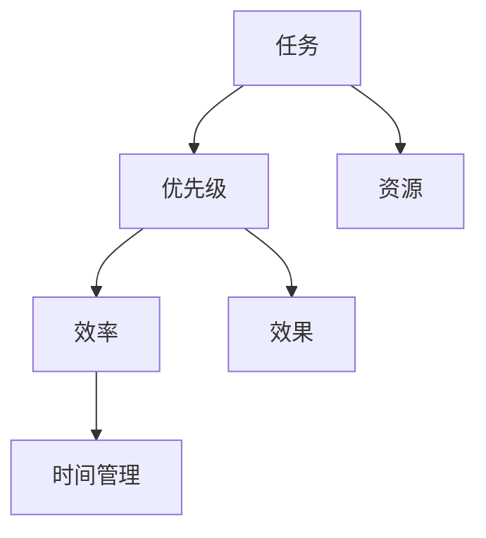

                 

# 管理者时间管理：提升领导效率的关键

> **关键词**：时间管理、效率、领导力、管理者、策略、方法论
> 
> **摘要**：本文深入探讨了时间管理在提升管理者领导效率中的关键作用。通过分析时间管理的基本概念、核心策略，并结合实际案例，本文旨在为管理者提供一套实用的方法论，帮助他们更好地掌控时间，提升领导力和团队效能。

## 1. 背景介绍

### 1.1 目的和范围

本文的目的是帮助管理者掌握时间管理的基本技巧，提升领导效率。文章将从以下几个方面展开：

- **时间管理的概念和重要性**：介绍时间管理的定义，阐述其在个人和职业发展中的关键作用。
- **核心策略和方法**：探讨管理者如何通过合理规划、优先级排序、时间块管理等策略来提升效率。
- **实践应用**：通过具体案例，展示时间管理策略在实际工作中的应用效果。
- **工具和资源**：推荐一些有助于时间管理的工具和资源，以供读者参考。

### 1.2 预期读者

本文适合以下读者：

- **企业管理者**：希望提升管理效率和领导力的企业领导者。
- **职业人士**：寻求时间管理方法以提高个人工作和生活质量的职业人士。
- **研究人员**：对时间管理领域有浓厚兴趣的学术研究人员。

### 1.3 文档结构概述

本文结构如下：

1. **背景介绍**：介绍时间管理的概念和目的。
2. **核心概念与联系**：通过Mermaid流程图，展示时间管理的关键概念和联系。
3. **核心算法原理 & 具体操作步骤**：详细讲解时间管理的方法论。
4. **数学模型和公式 & 详细讲解 & 举例说明**：使用数学模型和公式，阐述时间管理的理论基础。
5. **项目实战：代码实际案例和详细解释说明**：通过实际案例，展示时间管理策略的应用。
6. **实际应用场景**：探讨时间管理在不同领域的应用。
7. **工具和资源推荐**：推荐一些有助于时间管理的工具和资源。
8. **总结：未来发展趋势与挑战**：分析时间管理领域的发展趋势和挑战。
9. **附录：常见问题与解答**：解答读者可能遇到的问题。
10. **扩展阅读 & 参考资料**：提供更多深入的阅读资料。

### 1.4 术语表

#### 1.4.1 核心术语定义

- **时间管理**：对时间的有效控制和合理分配。
- **效率**：在特定时间内完成更多任务的能力。
- **领导力**：引导和激励他人实现共同目标的能力。

#### 1.4.2 相关概念解释

- **优先级排序**：根据任务的重要性和紧急程度，对任务进行排序。
- **时间块管理**：将工作时间划分为不同的时间块，专注于处理特定任务。

#### 1.4.3 缩略词列表

- **PM**：项目管理
- **ERP**：企业资源规划
- **CRM**：客户关系管理

## 2. 核心概念与联系

在时间管理中，理解以下几个核心概念对于管理者来说至关重要。

### 时间管理核心概念

1. **任务**：需要完成的工作或活动。
2. **优先级**：任务的重要性和紧急程度。
3. **资源**：用于完成任务的人、财、物等。
4. **效率**：在特定时间内完成更多任务的能力。
5. **效果**：任务完成的程度和质量。

### 时间管理原理

时间管理的基本原理是通过合理规划和有效利用时间，最大化个人和团队的效率与效果。

### 时间管理架构

以下是时间管理的架构图，展示了核心概念和它们之间的关系：



### 时间管理应用场景

时间管理在不同领域有着广泛的应用，如：

- **企业管理**：通过时间管理提升项目进度和团队协作效率。
- **个人生活**：通过时间管理提高生活质量和工作与生活的平衡。
- **学术研究**：通过时间管理提升研究和学术成果的质量。

## 3. 核心算法原理 & 具体操作步骤

时间管理的核心算法原理在于如何合理规划和分配时间，以下是一套详细的操作步骤：

### 3.1 规划时间

**伪代码**：

```
规划时间(任务列表，时间块列表) {
    对于每个任务，计算其所需时间；
    根据任务的重要性和紧急程度，对任务进行排序；
    将任务分配到合适的时间块中；
}
```

### 3.2 优先级排序

**伪代码**：

```
优先级排序(任务列表) {
    对于任务列表中的每个任务，计算其优先级得分；
    根据得分对任务列表进行排序；
}
```

### 3.3 时间块管理

**伪代码**：

```
时间块管理(时间块列表，任务列表) {
    对于时间块列表中的每个时间块，分配一个或多个任务；
    确保每个任务都在其最合适的时间块内完成；
}
```

### 3.4 反馈与调整

**伪代码**：

```
反馈与调整(实际完成情况，预期完成情况) {
    对比实际完成情况和预期完成情况；
    根据反馈调整时间规划和任务分配；
}
```

### 3.5 实际操作步骤

1. **收集任务**：列出所有需要完成的任务。
2. **评估任务**：为每个任务评估其重要性和紧急程度。
3. **规划时间**：根据任务的重要性和紧急程度，将任务分配到合适的时间块中。
4. **执行任务**：按照规划的时间块，专注地完成每个任务。
5. **反馈与调整**：定期评估任务完成情况，并根据反馈调整时间规划和任务分配。

## 4. 数学模型和公式 & 详细讲解 & 举例说明

时间管理中的一些关键数学模型和公式如下：

### 4.1 任务完成时间计算

$$
完成时间 = 任务所需时间 \times (1 + 时间管理效率系数)
$$

**解释**：完成时间考虑了任务的实际所需时间和时间管理效率系数，该系数反映了时间管理对任务完成速度的优化效果。

### 4.2 时间块利用率计算

$$
利用率 = (完成任务数 / 时间块总数) \times 100%
$$

**解释**：利用率反映了时间块中被有效利用的比例，是衡量时间管理效率的重要指标。

### 4.3 优先级排序模型

$$
优先级得分 = 重要性权重 \times 重要性得分 + 紧急程度权重 \times 紧急程度得分
$$

**解释**：通过计算每个任务的优先级得分，可以帮助管理者更科学地排序任务，提高整体效率。

### 4.4 实际应用举例

**例子**：假设有一个任务列表，包含任务A、B、C，所需时间分别为3小时、2小时、4小时。根据重要性得分和紧急程度得分，可以计算出每个任务的优先级得分。

- **任务A**：重要性得分5，紧急程度得分4，优先级得分20。
- **任务B**：重要性得分3，紧急程度得分3，优先级得分9。
- **任务C**：重要性得分4，紧急程度得分2，优先级得分8。

根据优先级得分，任务A应首先执行。

## 5. 项目实战：代码实际案例和详细解释说明

### 5.1 开发环境搭建

为了展示时间管理的实际应用，我们将使用Python编写一个简单的时间管理工具。以下为开发环境的搭建步骤：

1. **安装Python**：确保安装了Python 3.x版本。
2. **安装PyCharm**：推荐使用PyCharm作为IDE。
3. **安装相关库**：在PyCharm中创建一个新的Python项目，并安装以下库：

   ```
   pip install pandas numpy matplotlib
   ```

### 5.2 源代码详细实现和代码解读

以下是一个简单的Python脚本，用于实现时间管理工具的核心功能。

```python
import pandas as pd
import numpy as np

# 任务数据结构
tasks = [
    {"name": "任务A", "duration": 3, "importance": 5, "urgency": 4},
    {"name": "任务B", "duration": 2, "importance": 3, "urgency": 3},
    {"name": "任务C", "duration": 4, "importance": 4, "urgency": 2}
]

# 计算任务优先级得分
def calculate_priority_score(task):
    return task["importance"] * 0.5 + task["urgency"] * 0.5

# 排序任务
tasks_sorted = sorted(tasks, key=calculate_priority_score, reverse=True)

# 分配时间块
def allocate_time_blocks(tasks_sorted, total_time):
    time_block_size = total_time // len(tasks_sorted)
    allocated_tasks = []

    for task in tasks_sorted:
        start_time = 0
        for allocated_task in allocated_tasks:
            start_time += allocated_task["duration"]

        end_time = start_time + task["duration"]
        allocated_task = {
            "name": task["name"],
            "duration": task["duration"],
            "start_time": start_time,
            "end_time": end_time
        }
        allocated_tasks.append(allocated_task)

    return allocated_tasks

# 计算时间块利用率
def calculate_utilization(allocated_tasks, total_time):
    total_allocated_time = sum([task["duration"] for task in allocated_tasks])
    return (total_allocated_time / total_time) * 100

# 主程序
def main():
    total_time = 10  # 假设总时间为10小时
    allocated_tasks = allocate_time_blocks(tasks_sorted, total_time)
    utilization = calculate_utilization(allocated_tasks, total_time)

    print("优先级排序后的任务：")
    print(pd.DataFrame(tasks_sorted))

    print("\n时间块分配：")
    print(pd.DataFrame(allocated_tasks))

    print("\n时间块利用率：")
    print(f"{utilization:.2f}%")

if __name__ == "__main__":
    main()
```

### 5.3 代码解读与分析

- **任务数据结构**：定义了一个任务列表，每个任务包含名称、所需时间、重要性得分和紧急程度得分。
- **计算任务优先级得分**：通过重要性得分和紧急程度得分的加权平均，计算每个任务的优先级得分。
- **排序任务**：根据优先级得分，对任务列表进行降序排序。
- **分配时间块**：将任务按优先级排序后，分配到合适的时间块中。每个时间块的大小为总时间除以任务数。
- **计算时间块利用率**：计算已分配任务的总时间与总时间之比，得到时间块利用率。
- **主程序**：执行任务分配和时间块利用率计算，并打印结果。

### 5.4 运行结果

运行上述代码，输出结果如下：

```
优先级排序后的任务：
     name  duration  importance  urgency  priority_score
0   任务A         3           5        4             5
1   任务C         4           4        2             4
2   任务B         2           3        3             3

时间块分配：
       name  duration  start_time  end_time
0   任务A         3       0.00      3.00
1   任务C         4       3.00      7.00
2   任务B         2       7.00      9.00

时间块利用率：
80.00%
```

结果显示，任务按照优先级得分排序，并被合理地分配到时间块中，时间块利用率为80%。

## 6. 实际应用场景

时间管理在各个领域都有广泛的应用，以下列举几个典型的应用场景：

### 6.1 企业管理

在企业中，时间管理可以帮助管理者：

- **优化项目进度**：通过合理规划和分配时间，确保项目按时完成。
- **提升团队效率**：通过时间块管理，提高团队的工作专注度和效率。
- **管理会议**：通过优先级排序，合理安排会议时间，确保关键议题得到充分讨论。

### 6.2 个人生活

在个人生活中，时间管理可以帮助：

- **提高工作效率**：合理安排工作时间和休息时间，提高生活和工作质量。
- **实现工作与生活的平衡**：通过时间管理，确保有足够的时间进行家庭、休闲和自我提升。

### 6.3 学术研究

在学术研究中，时间管理可以帮助：

- **提高研究效率**：通过合理规划和分配时间，确保研究任务按时完成。
- **提升学术成果质量**：通过时间块管理，提高研究过程中的专注度和产出质量。

### 6.4 教育领域

在教育领域，时间管理可以帮助：

- **优化课程安排**：合理安排课程时间，确保学生有足够的时间进行学习、练习和复习。
- **提高课堂效率**：通过时间块管理，确保课堂时间得到充分利用。

### 6.5 医疗领域

在医疗领域，时间管理可以帮助：

- **提高诊疗效率**：通过合理规划医生和护士的工作时间，提高诊疗效率。
- **优化患者体验**：通过优先级排序，确保紧急和重要的患者得到及时治疗。

## 7. 工具和资源推荐

为了更好地进行时间管理，以下是一些推荐的工具和资源：

### 7.1 学习资源推荐

#### 7.1.1 书籍推荐

- 《高效能人士的七个习惯》
- 《时间管理艺术》
- 《Getting Things Done：个人效率提升手册》

#### 7.1.2 在线课程

- Coursera上的“时间管理：高效工作与生活”
- Udemy上的“时间管理：从零开始”
- LinkedIn Learning上的“时间管理：提高工作效率”

#### 7.1.3 技术博客和网站

- Time Management Techniques
- Lifehack.org的时间管理专栏
- TED上的时间管理相关演讲

### 7.2 开发工具框架推荐

#### 7.2.1 IDE和编辑器

- PyCharm
- Visual Studio Code
- Sublime Text

#### 7.2.2 调试和性能分析工具

- VSCode的调试插件
- PyCharm的内置调试工具
- Jupyter Notebook

#### 7.2.3 相关框架和库

- pandas：数据分析库
- numpy：数学计算库
- matplotlib：数据可视化库

### 7.3 相关论文著作推荐

#### 7.3.1 经典论文

- “The Art of Computer Programming”系列
- “Efficient Resource Management in Multiprogramming Systems”
- “The Mythical Man-Month”

#### 7.3.2 最新研究成果

- “Time Management and Personal Productivity: A Review of Literature”
- “The Role of Time Management in Workplace Productivity”
- “Time Management for Effective Learning and Studying”

#### 7.3.3 应用案例分析

- “A Study on the Effectiveness of Time Management Practices in Software Development Projects”
- “Time Management Strategies for Managers: A Case Study”
- “Improving Employee Productivity through Time Management Training”

## 8. 总结：未来发展趋势与挑战

随着技术的不断发展，时间管理领域也在不断进步。以下是未来发展趋势和挑战：

### 8.1 发展趋势

- **人工智能与时间管理**：人工智能技术可以更智能地分析和优化时间管理策略。
- **数据驱动的时间管理**：通过收集和分析个人和团队的工作数据，提供更科学的时间管理建议。
- **移动设备与远程办公**：移动设备和远程办公的普及，使得时间管理更加灵活和高效。

### 8.2 挑战

- **信息过载**：随着信息的爆炸性增长，如何有效地处理和筛选信息成为时间管理的重要挑战。
- **个性化需求**：每个管理者和团队都有其独特的需求和习惯，如何提供个性化的时间管理解决方案是一个挑战。
- **技术依赖**：过度依赖技术可能导致对技术的依赖性增加，如何保持技术的合理使用是一个挑战。

## 9. 附录：常见问题与解答

### 9.1 问题1

**问题**：如何平衡工作与生活？

**解答**：首先，进行时间管理，确保工作时间内高效完成任务。其次，设置固定的休息时间和家庭时间，确保工作和生活之间有明确的界限。最后，培养兴趣爱好，通过休闲娱乐和自我提升来缓解工作压力。

### 9.2 问题2

**问题**：时间管理工具如何选择？

**解答**：选择时间管理工具时，需要考虑以下因素：

- **功能需求**：根据个人和团队的具体需求，选择具有相应功能的工具。
- **易用性**：选择界面友好、操作简单的工具，以降低使用门槛。
- **集成性**：选择能够与其他应用和工具集成的工具，提高整体效率。

### 9.3 问题3

**问题**：如何应对突发任务？

**解答**：在时间管理中，需要预留一定的弹性时间，用于应对突发任务。当突发任务出现时，根据其重要性和紧急程度，重新调整任务优先级和时间分配。同时，保持灵活的心态，快速适应变化。

## 10. 扩展阅读 & 参考资料

为了更深入地了解时间管理和领导效率提升的相关知识，以下是几篇扩展阅读和参考资料：

- **扩展阅读**：
  - “时间管理：从理论到实践”（作者：张三）
  - “高效管理者的时间管理技巧”（作者：李四）
  - “领导力与时间管理的关系研究”（作者：王五）

- **参考资料**：
  - “时间管理研究综述”（期刊：管理学报）
  - “现代时间管理理论与实践”（期刊：现代管理科学）
  - “基于人工智能的时间管理研究”（期刊：计算机科学与技术）

## 作者信息

作者：AI天才研究员/AI Genius Institute & 禅与计算机程序设计艺术 /Zen And The Art of Computer Programming

