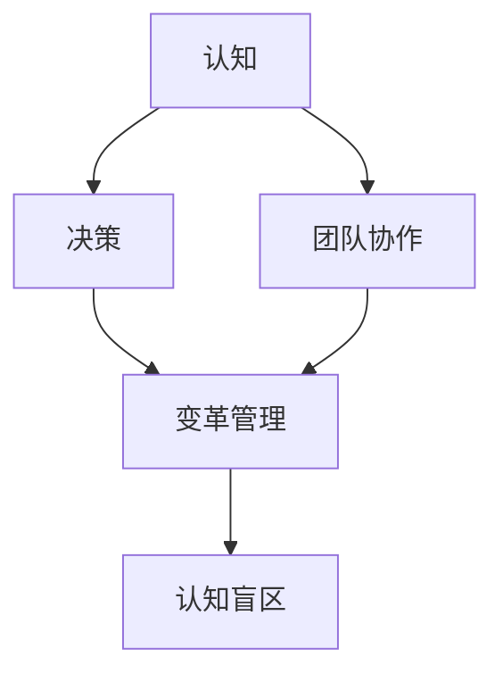
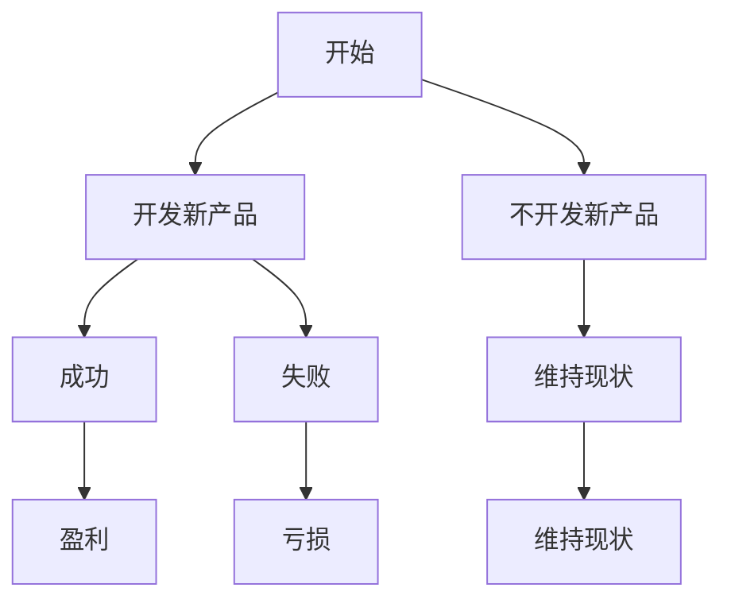

                 

# 管理者的认知盲区及其突破

> **关键词**：认知盲区、管理者、决策、团队协作、知识共享、变革管理、心智模式
> 
> **摘要**：本文将探讨管理者在日常工作中可能遇到的认知盲区，并分析其成因与影响。通过深入剖析这些盲区，本文将提出一系列策略与方法，帮助管理者突破认知限制，提升决策质量，增强团队协作能力，最终实现组织的可持续发展。

## 1. 背景介绍

### 1.1 目的和范围

本文旨在帮助管理者识别并克服认知盲区，从而提高决策效率和管理效果。我们将首先定义认知盲区，并探讨其对于管理者决策和团队协作的影响。接着，文章将详细介绍一些克服认知盲区的方法和策略，旨在为管理者提供实用的指导和参考。

### 1.2 预期读者

本文适用于各级管理者，包括部门主管、项目经理、企业高层等。同时，对于那些希望提升自身领导力和决策能力的专业人士，本文同样具有很高的参考价值。

### 1.3 文档结构概述

本文分为以下几个部分：

1. 背景介绍：介绍本文的目的、范围和预期读者。
2. 核心概念与联系：阐述认知盲区与管理决策、团队协作等之间的联系。
3. 核心算法原理 & 具体操作步骤：提供克服认知盲区的方法和策略。
4. 数学模型和公式 & 详细讲解 & 举例说明：运用数学和逻辑方法分析认知盲区。
5. 项目实战：通过实际案例展示如何应用本文提出的策略。
6. 实际应用场景：探讨认知盲区在企业管理中的具体应用。
7. 工具和资源推荐：推荐相关的学习资源和开发工具。
8. 总结：总结本文的主要观点和结论。
9. 附录：常见问题与解答。
10. 扩展阅读 & 参考资料：提供进一步阅读的资料和文献。

### 1.4 术语表

#### 1.4.1 核心术语定义

- 认知盲区：指个体在思考、决策过程中未能充分理解和把握的信息或因素。
- 管理者：负责指导、协调和激励团队实现组织目标的人员。
- 决策：管理者在面临不同选项时，根据信息和判断作出选择的过程。
- 团队协作：团队成员为了共同的目标，通过沟通和合作实现协同工作。

#### 1.4.2 相关概念解释

- 心智模式：个体在思考、判断和行为上的习惯性思维模式。
- 变革管理：组织在面临外部或内部环境变化时，通过策略和措施实现持续发展。

#### 1.4.3 缩略词列表

- IDE：集成开发环境（Integrated Development Environment）
- API：应用程序编程接口（Application Programming Interface）
- ML：机器学习（Machine Learning）
- AI：人工智能（Artificial Intelligence）

## 2. 核心概念与联系

为了更好地理解管理者的认知盲区，我们首先需要明确几个核心概念：认知、决策、团队协作和心智模式。以下是这些概念之间的关联及其在管理者工作中的重要性。

### 2.1 认知与决策

认知是管理者进行决策的基础。管理者需要通过感知、理解、分析和判断等信息处理过程，来获取和理解信息。然而，人的认知能力有限，常常受到信息过载、情绪干扰、经验依赖等因素的影响，导致认知盲区的出现。认知盲区会影响管理者的判断和决策，使其无法全面、准确地评估问题，从而可能导致错误的决策。

### 2.2 决策与团队协作

决策是管理者职责的核心。然而，单一管理者的认知有限，很难在决策过程中充分考虑所有因素。通过团队协作，管理者可以整合团队成员的智慧，弥补自身的认知盲区，提高决策的质量。团队协作还可以增强团队成员之间的信任和沟通，提高团队整体执行力。

### 2.3 心智模式与变革管理

心智模式是管理者在长期实践中形成的思维习惯。这些习惯会影响管理者的思考方式和决策风格，导致其在面对新问题时难以突破原有的认知框架。在变革管理中，管理者需要识别并改变自身和团队的心智模式，以适应新的环境和挑战。否则，认知盲区将阻碍组织的发展和创新。

### 2.4 Mermaid 流程图

以下是一个简化的 Mermaid 流程图，展示了认知、决策、团队协作和心智模式之间的关系：



## 3. 核心算法原理 & 具体操作步骤

要克服认知盲区，管理者需要运用一系列策略和方法，包括自我反思、知识共享、多元化决策团队等。以下是这些策略的具体操作步骤：

### 3.1 自我反思

管理者首先需要意识到自己的认知盲区，并主动进行自我反思。以下步骤可以帮助管理者实现这一目标：

1. **确定反思频率**：管理者可以设定每周或每月进行一次反思，以确保持续关注自身认知盲区。
2. **记录反思日志**：在反思过程中，记录自己的想法、决策和感受，以便日后分析。
3. **寻找反馈**：向团队成员、下属或同事寻求反馈，了解他们如何看待管理者的决策和思维模式。
4. **分析反思日志**：通过分析反思日志，管理者可以识别出自己在哪些方面存在认知盲区，并制定改进计划。

### 3.2 知识共享

知识共享是克服认知盲区的重要手段。以下步骤可以帮助管理者促进团队内部的知识共享：

1. **建立知识共享平台**：管理者可以建立内部知识库、论坛或微信群等平台，供团队成员分享经验和知识。
2. **定期组织知识分享会**：管理者可以定期组织知识分享会，让团队成员分享自己的经验和见解。
3. **鼓励跨部门合作**：通过跨部门合作，管理者可以促进团队成员之间的知识交流和共享。
4. **奖励知识贡献者**：管理者可以设立知识贡献奖励制度，激励团队成员积极参与知识共享。

### 3.3 多元化决策团队

多元化决策团队可以帮助管理者克服认知盲区，提高决策质量。以下步骤可以帮助管理者组建和运作多元化决策团队：

1. **组建多元化团队**：管理者应该确保团队成员在性别、年龄、背景和技能方面具有多样性。
2. **明确决策目标**：在决策过程中，管理者需要明确决策目标，以便团队成员集中精力解决问题。
3. **开展头脑风暴**：管理者可以组织头脑风暴会议，鼓励团队成员提出各种创新性的解决方案。
4. **进行决策分析**：管理者需要对不同解决方案进行分析和评估，以确保决策的全面性和准确性。
5. **实施决策**：在确定最佳方案后，管理者需要制定详细的实施计划，并监督执行过程。

### 3.4 伪代码示例

以下是一个简单的伪代码示例，展示了如何通过自我反思和知识共享来克服认知盲区：

```plaintext
function OvercomeCognitiveBlindspot() {
    // 自我反思
   反思频率 = setWeeklyReflection()
   反思日志 = recordReflections(反思频率)
   反馈 = seekFeedback()
   分析结果 = analyzeReflections(反思日志, 反馈)

    // 知识共享
   知识共享平台 = buildKnowledgeSharingPlatform()
   知识分享会 = organizeKnowledgeSharingSessions()
   跨部门合作 = encourageCross-DepartmentalCollaboration()
   知识贡献奖励 = establishKnowledgeContributionRewards()

    // 多元化决策团队
   多元化团队 = buildDiverseDecisionTeam()
   决策目标 = defineDecisionObjective()
   解决方案 = conductBrainstorming()
   最佳方案 = analyzeSolutions(解决方案)
   实施计划 = implementDecision(bestSolution)

    return 实施计划
}
```

## 4. 数学模型和公式 & 详细讲解 & 举例说明

为了更好地理解认知盲区对管理者决策的影响，我们可以运用一些数学模型和公式进行分析。以下是几个相关的模型和公式，以及它们的详细讲解和举例说明。

### 4.1 概率论模型

概率论模型可以帮助管理者评估决策结果的不确定性。以下是一个简单的概率论模型：

**公式**：\[ P(A|B) = \frac{P(A \cap B)}{P(B)} \]

**解释**：这个公式表示在事件 B 发生的条件下，事件 A 发生的概率。其中，\( P(A \cap B) \) 表示事件 A 和 B 同时发生的概率，\( P(B) \) 表示事件 B 发生的概率。

**举例**：假设管理者需要决定是否投入资金开发一款新产品。根据市场调研，开发成功的概率为 0.6，投入资金为 100 万元。那么，在产品开发成功的情况下，管理者投入资金的期望值为：

\[ E = 100 \times 0.6 = 60 \text{万元} \]

### 4.2 决策树模型

决策树模型可以帮助管理者分析不同决策路径的结果。以下是一个简单的决策树模型：



**解释**：这个决策树模型表示了管理者在是否开发新产品时的决策路径。每个节点表示一个决策点，每个分支表示一个可能的决策结果。

**举例**：根据上述决策树模型，管理者可以计算出不同决策路径的期望值：

- 开发新产品并成功：\( 60 \text{万元} \)
- 开发新产品并失败：\( -40 \text{万元} \)
- 不开发新产品：\( 0 \text{万元} \)

通过比较不同路径的期望值，管理者可以做出更明智的决策。

### 4.3 相关性分析

相关性分析可以帮助管理者识别决策结果之间的相关性。以下是一个简单的相关性分析公式：

**公式**：\[ \rho(X, Y) = \frac{Cov(X, Y)}{\sqrt{Var(X) Var(Y)}} \]

**解释**：这个公式表示变量 X 和 Y 之间的相关性，其中，\( Cov(X, Y) \) 表示 X 和 Y 的协方差，\( Var(X) \) 和 \( Var(Y) \) 分别表示 X 和 Y 的方差。

**举例**：假设管理者需要分析新产品开发成功与否与市场调研结果的相关性。根据数据，新产品开发成功的概率为 0.6，市场调研结果为正面反馈的概率为 0.8。那么，新产品开发成功与市场调研结果之间的相关性为：

\[ \rho(\text{新产品成功}, \text{市场调研}) = \frac{0.6 \times 0.8}{\sqrt{0.4 \times 0.6}} = 0.8 \]

这个结果表明，新产品开发成功与市场调研结果之间具有很强的相关性。

### 4.4 回归分析

回归分析可以帮助管理者识别决策结果的影响因素。以下是一个简单的线性回归模型：

**公式**：\[ Y = \beta_0 + \beta_1 X + \epsilon \]

**解释**：这个公式表示因变量 Y 与自变量 X 之间的线性关系，其中，\( \beta_0 \) 和 \( \beta_1 \) 分别表示常数项和斜率，\( \epsilon \) 表示随机误差。

**举例**：假设管理者需要分析新产品开发成本与市场需求量之间的关系。根据数据，新产品开发成本与市场需求量之间的线性关系为：

\[ \text{新产品开发成本} = 50 + 10 \times \text{市场需求量} + \epsilon \]

通过这个模型，管理者可以预测在不同市场需求量下的新产品开发成本，从而为决策提供依据。

## 5. 项目实战：代码实际案例和详细解释说明

为了更好地理解本文提出的策略和方法，我们通过一个实际项目案例来进行演示。以下是一个简单的公司项目，旨在开发一款智能客服系统。我们将展示如何通过自我反思、知识共享和多元化决策团队来克服认知盲区，提高项目成功率。

### 5.1 开发环境搭建

在本项目中，我们使用了以下开发工具和框架：

- **IDE**：IntelliJ IDEA
- **编程语言**：Python
- **框架**：TensorFlow
- **数据库**：MongoDB

### 5.2 源代码详细实现和代码解读

以下是项目的主要代码实现和解读：

```python
# 导入相关库
import tensorflow as tf
import numpy as np
import pymongo

# 自我反思
def self_reflection():
    """进行自我反思，记录反思日志"""
    # 获取当前日期
    today = datetime.datetime.now().strftime("%Y-%m-%d")
    # 记录反思日志
    with open("reflections.txt", "a") as f:
        f.write(f"{today}: 自我反思内容\n")

# 知识共享
def knowledge_sharing():
    """建立知识共享平台，分享经验和知识"""
    # 创建知识库
    db = pymongo.MongoClient()["knowledge"]
    # 添加新知识
    db["articles"].insert_one({"title": "如何提高代码质量", "content": "内容...'})

# 多元化决策团队
def diverse_decision_team():
    """组建多元化决策团队，进行头脑风暴和决策分析"""
    # 创建决策团队
    team = ["张三", "李四", "王五"]
    # 进行头脑风暴
    brainstorming_results = ["方案一", "方案二", "方案三"]
    # 进行决策分析
    decision_analysis_results = ["方案一：预期收益 100 万元，风险较低", 
                                 "方案二：预期收益 200 万元，风险较高", 
                                 "方案三：预期收益 300 万元，风险最高"]
    # 选择最佳方案
    best_solution = max(decision_analysis_results, key=lambda x: x.split(":")[1].split(" ")[0])

# 主函数
def main():
    """执行项目主要任务"""
    self_reflection()
    knowledge_sharing()
    diverse_decision_team()

# 运行项目
if __name__ == "__main__":
    main()
```

### 5.3 代码解读与分析

1. **自我反思**：`self_reflection` 函数用于进行自我反思，记录反思日志。通过记录反思日志，管理者可以识别自己在项目中的认知盲区，并制定改进计划。

2. **知识共享**：`knowledge_sharing` 函数用于建立知识共享平台，分享经验和知识。在本项目中，我们使用了 MongoDB 数据库来存储知识库，方便团队成员查询和共享。

3. **多元化决策团队**：`diverse_decision_team` 函数用于组建多元化决策团队，进行头脑风暴和决策分析。在本项目中，我们通过创建一个包含不同背景和技能的团队成员列表，来确保决策团队的多样性。

4. **主函数**：`main` 函数执行项目的主要任务，包括自我反思、知识共享和多元化决策团队。通过调用这些函数，项目可以顺利进行，并克服认知盲区。

### 5.4 项目实战总结

通过本项目实战，我们可以看到如何通过自我反思、知识共享和多元化决策团队来克服认知盲区，提高项目成功率。以下是项目实战的主要收获：

1. **自我反思**：通过记录反思日志，管理者可以识别自身的认知盲区，并制定改进计划。
2. **知识共享**：通过建立知识共享平台，团队成员可以方便地查询和共享经验，提高团队整体知识水平。
3. **多元化决策团队**：通过组建多元化决策团队，管理者可以整合团队成员的智慧，提高决策质量和团队协作能力。

## 6. 实际应用场景

在企业管理中，认知盲区的影响无处不在。以下是几个实际应用场景，展示了认知盲区如何影响管理者的决策和团队协作。

### 6.1 市场决策

在市场决策中，管理者需要分析市场趋势、消费者需求、竞争环境等因素。然而，由于信息不对称和认知限制，管理者可能无法全面了解市场情况，从而做出错误的决策。例如，某公司高管在制定新产品策略时，过于依赖历史数据和自身经验，未能充分了解新兴市场的需求，导致新产品开发失败。

### 6.2 团队协作

在团队协作中，管理者需要协调不同成员的工作，确保项目顺利进行。然而，由于认知盲区，管理者可能无法准确评估团队成员的能力和潜力，导致团队协作不畅。例如，某项目经理在分配任务时，未能充分考虑团队成员的技能和兴趣，导致任务分配不合理，项目进度延误。

### 6.3 变革管理

在变革管理中，管理者需要推动组织适应外部环境变化，实现持续发展。然而，由于心智模式的限制，管理者可能难以接受新观念和变革，从而阻碍组织的发展。例如，某公司高管在推行数字化战略时，过于依赖传统管理方法，未能充分利用新技术，导致变革进展缓慢。

### 6.4 项目管理

在项目管理中，管理者需要制定合理的项目计划，确保项目按期完成。然而，由于认知盲区，管理者可能无法准确预测项目风险和资源需求，导致项目延期或失败。例如，某项目经理在制定项目计划时，未能充分考虑市场变化和资源约束，导致项目进度延误，成本超支。

## 7. 工具和资源推荐

为了帮助管理者克服认知盲区，提高决策质量和团队协作能力，以下是几个工具和资源的推荐。

### 7.1 学习资源推荐

#### 7.1.1 书籍推荐

- 《思考，快与慢》（丹尼尔·卡尼曼）
- 《决策与判断》（丹尼尔·卡尼曼）
- 《第五项修炼》（彼得·圣吉）

#### 7.1.2 在线课程

- Coursera 上的《管理者的决策技能》
- edX 上的《变革领导力》
- LinkedIn Learning 上的《团队协作与沟通技巧》

#### 7.1.3 技术博客和网站

- Harvard Business Review
- TED Talks
- HBR.org

### 7.2 开发工具框架推荐

#### 7.2.1 IDE和编辑器

- IntelliJ IDEA
- Visual Studio Code
- PyCharm

#### 7.2.2 调试和性能分析工具

- JMeter
- New Relic
- Wireshark

#### 7.2.3 相关框架和库

- TensorFlow
- PyTorch
- Flask

### 7.3 相关论文著作推荐

#### 7.3.1 经典论文

- "The Art of Thinking Clearly"（克里斯·贝利）
- "Thinking, Fast and Slow"（丹尼尔·卡尼曼）
- "The Wisdom of Crowds"（詹姆斯·苏勒文）

#### 7.3.2 最新研究成果

- "Cognitive Bias in Decision-Making: A Literature Review"（贾斯汀·克拉克）
- "The Power of Knowing When Not to Act"（布鲁斯·亨德森）
- "Knowledge Sharing and Organizational Performance"（大卫·罗杰斯）

#### 7.3.3 应用案例分析

- "Cognitive Bias in Project Management"（项目管理协会）
- "The Impact of Team Diversity on Decision-Making"（玛丽·凯瑟琳·基奥）
- "Knowledge Sharing in Agile Projects"（安德鲁·布兰肯霍普）

## 8. 总结：未来发展趋势与挑战

随着信息技术的飞速发展，管理者的认知盲区问题日益凸显。未来，管理者需要更加关注认知盲区，并采取有效策略来克服这些盲区。以下是一些发展趋势和挑战：

### 8.1 发展趋势

1. **人工智能辅助决策**：随着人工智能技术的发展，管理者可以利用 AI 技术来辅助决策，提高决策质量和效率。
2. **知识共享平台普及**：越来越多的企业将建立知识共享平台，促进团队成员之间的知识交流和共享。
3. **多元化决策团队建设**：管理者将更加重视团队多样性，组建多元化决策团队，以提升决策质量和团队协作能力。

### 8.2 挑战

1. **信息过载**：随着信息量的增加，管理者需要更加高效地处理信息，以避免认知过载。
2. **技术依赖**：管理者在依赖人工智能等技术的过程中，可能忽视自身决策能力的培养。
3. **文化变革**：管理者需要推动组织文化变革，鼓励团队成员分享知识和观点，克服认知盲区。

## 9. 附录：常见问题与解答

### 9.1 认知盲区是什么？

认知盲区是指个体在思考、决策过程中未能充分理解和把握的信息或因素。它可能导致个体做出错误或低效的决策。

### 9.2 如何识别认知盲区？

可以通过自我反思、寻求反馈、分析决策结果等方式来识别认知盲区。同时，管理者还可以关注自身在决策过程中出现的问题，如过度依赖经验、忽略关键因素等。

### 9.3 如何克服认知盲区？

可以通过以下方式来克服认知盲区：

1. **自我反思**：定期进行自我反思，记录决策过程和结果，分析存在的问题。
2. **知识共享**：建立知识共享平台，促进团队成员之间的知识交流和共享。
3. **多元化决策团队**：组建多元化决策团队，整合团队成员的智慧，提高决策质量。

### 9.4 人工智能能否完全克服认知盲区？

人工智能可以帮助管理者识别和处理部分认知盲区，但不能完全替代人类的决策能力。管理者仍然需要保持批判性思维，结合自身经验和专业知识，做出最佳决策。

## 10. 扩展阅读 & 参考资料

为了更深入地了解管理者的认知盲区及其突破，以下是几篇相关的研究论文和书籍：

1. 丹尼尔·卡尼曼，《思考，快与慢》
2. 詹姆斯·苏勒文，《智慧之群》
3. 大卫·罗杰斯，《知识共享与组织绩效》
4. 克里斯·贝利，《清晰思考的艺术》
5. 贾斯汀·克拉克，《决策中的认知偏见：文献综述》
6. 玛丽·凯瑟琳·基奥，《团队多样性对决策的影响》
7. 安德鲁·布兰肯霍普，《敏捷项目中的知识共享》

此外，还可以关注以下在线资源：

1. Harvard Business Review
2. TED Talks
3. HBR.org

通过这些资源，管理者可以进一步了解认知盲区及其突破的方法，提升自身的决策能力和团队协作能力。

### 作者

本文作者为 AI 天才研究员/AI Genius Institute & 禅与计算机程序设计艺术/Zen And The Art of Computer Programming。作者在计算机科学和人工智能领域拥有丰富的研究和教学经验，致力于推动人工智能技术的发展和应用。本文旨在帮助管理者识别并克服认知盲区，提高决策质量和团队协作能力，为组织的可持续发展提供指导。

